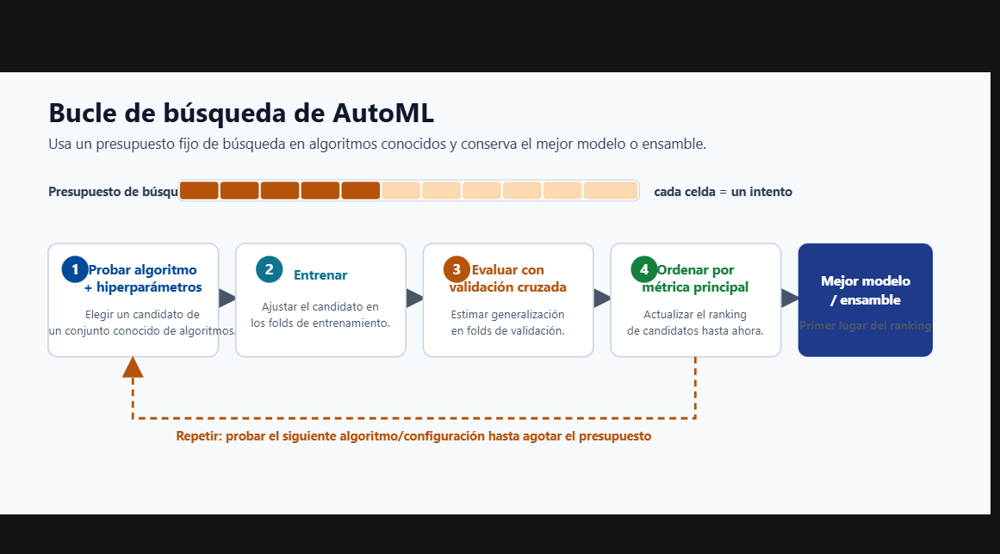
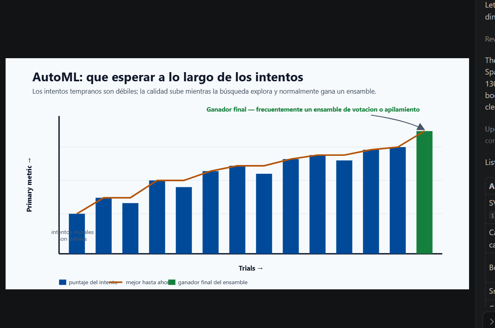

# 01. Environment and Access Setup

## Objective

Set up everything required to run both paths:

- Azure ML Studio model path
- Fabric LLM notebook path

## Steps

1. Confirm Azure subscription and resource group permissions.
2. Create or select Azure ML workspace.
3. Create compute instance in Azure ML Studio.
4. Register sample dataset from `azML-modelcreation/data/sample_data.csv`.
5. Validate Fabric capacity and workspace assignment.
6. Confirm notebook runtime can install required dependencies.

## Setup Images

