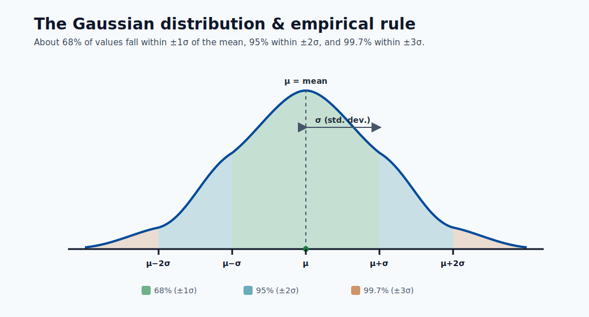
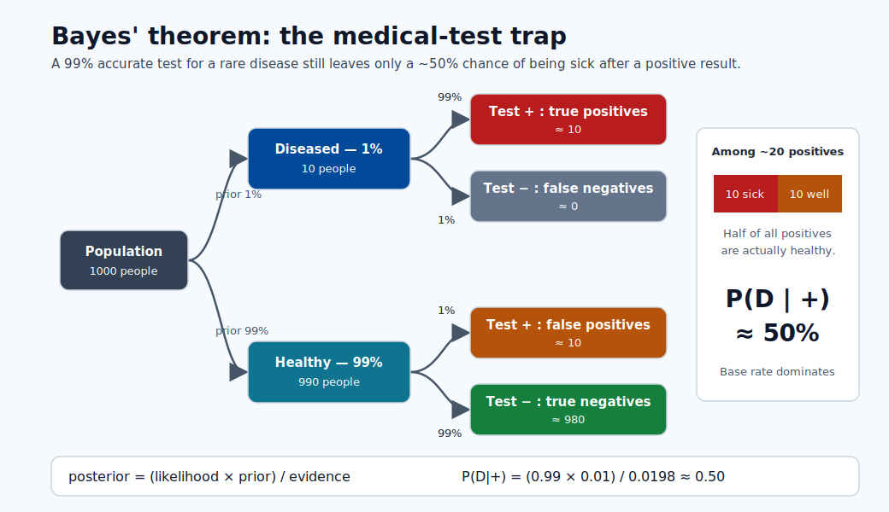

# Math Prerequisites for Machine Learning

This module builds every mathematical foundation you need before tackling any other module
in this course. It starts from basic algebra and works up to the graduate-level mathematics
that underpins optimization, probability, and learning theory.

No prior knowledge beyond high school algebra is required. By the end you will be able to
read and derive the key equations in every other module.

---

## Why Mathematics Underlies ML

Machine learning is, at its core, **applied mathematics**. Every algorithm is a solution to a
precisely stated optimization problem, and the language of that problem is mathematics.

Consider what happens when you train a linear regression model:

1. You represent your data as a matrix $X \in \mathbb{R}^{N \times d}$ — **linear algebra**.
2. You define a loss function $\mathcal{L}(\theta)$ that measures how wrong your predictions are — **calculus and probability**.
3. You minimize that loss by computing gradients and updating parameters — **multivariate calculus**.
4. You evaluate whether the result is statistically meaningful — **statistics**.

Strip away any one of those four pillars and the algorithm either breaks or becomes a black box
you cannot reason about. When a model fails in production, the engineers who fix it are the ones
who can trace the failure back to a mathematical cause: a gradient vanishing, a distribution shift,
an objective that was not convex.

> **Note - The payoff:** You do not need to derive everything from scratch every day. But understanding
> the math means you can read a paper, understand what a new optimizer does, debug a training
> instability, and choose the right regularizer. That is the difference between applying ML and
> understanding it.

The table below maps each area of mathematics to the ML concepts it enables:

| Math area       | What it enables in ML                                                     |
| --------------- | ------------------------------------------------------------------------- |
| Linear algebra  | Feature representation, neural network layers, PCA, attention mechanisms  |
| Probability     | Loss functions, Bayesian inference, generative models, uncertainty        |
| Calculus        | Gradient descent, backpropagation, optimization algorithms                |
| Statistics      | Model evaluation, hypothesis testing, confidence intervals, MLE/MAP       |

---

## Probability Theory

### What is Probability?

Probability is a number between 0 and 1 that quantifies **how likely** an event is to occur.

**Sample space and events**

- The **sample space** $\Omega$ is the set of all possible outcomes. For a coin flip, $\Omega = \{H, T\}$.
- An **event** $A$ is a subset of $\Omega$. For a die, the event "even" is $A = \{2, 4, 6\}$.
- The **probability** of event $A$ is written $P(A)$.

**Kolmogorov's axioms** (the three rules everything else follows from):

1. Non-negativity: $P(A) \geq 0$ for any event $A$.
2. Normalization: $P(\Omega) = 1$ (something must happen).
3. Additivity: if $A$ and $B$ are mutually exclusive, $P(A \cup B) = P(A) + P(B)$.

From these three axioms alone, all of probability theory is derived.

**Two interpretations of probability:**

| Interpretation | "P(rain tomorrow) = 0.7" means...                          | Used for...                                      |
| -------------- | ----------------------------------------------------------- | ------------------------------------------------ |
| Frequentist    | In the long run, 70 % of similar days have rain             | Classical statistics, hypothesis testing         |
| Bayesian       | My degree of belief that it will rain is 70 %               | Bayesian inference, prior/posterior, uncertainty |

ML uses both. Cross-validation and p-values are frequentist. Bayesian neural networks and
MAP estimation are Bayesian.

> **Note - Why this matters:** The interpretation you choose affects how you report uncertainty.
> A frequentist confidence interval and a Bayesian credible interval have different meanings,
> even if they often produce similar numbers.

---

### Random Variables and Distributions

A **random variable** $X$ is a function that assigns a real number to each outcome in the
sample space. It is the bridge between abstract probability and concrete numbers.

**Discrete vs continuous:**

- **Discrete** $X$ takes countable values (0, 1, 2, ...). Described by a **probability mass function (PMF)**:
  $P(X = k) = p_k$, where $\sum_k p_k = 1$.
- **Continuous** $X$ takes any real value in an interval. Described by a **probability density function (PDF)**:
  $f(x) \geq 0$, and $\int_{-\infty}^{\infty} f(x)\, dx = 1$.

**Cumulative Distribution Function (CDF):** works for both types:

$$F(x) = P(X \leq x)$$

For a continuous variable, $F(x) = \int_{-\infty}^{x} f(t)\, dt$.


> **Note - Three views of a distribution:** The PMF places probability on discrete points, the PDF spreads it as area under a curve, and the CDF accumulates that probability from 0 to 1.

**Key distributions:**

| Distribution           | Type       | Parameters         | PMF / PDF                                                                      | ML use                                        |
| ---------------------- | ---------- | ------------------ | ------------------------------------------------------------------------------ | --------------------------------------------- |
| Bernoulli              | Discrete   | $p \in [0,1]$      | $P(X=1)=p,\ P(X=0)=1-p$                                                       | Binary classification output                  |
| Binomial               | Discrete   | $n, p$             | $\binom{n}{k} p^k (1-p)^{n-k}$                                                | Count of successes in $n$ trials              |
| Gaussian (Normal)      | Continuous | $\mu, \sigma^2$    | $\frac{1}{\sqrt{2\pi\sigma^2}} \exp\!\left(-\frac{(x-\mu)^2}{2\sigma^2}\right)$ | Residuals, weight initialization, noise       |
| Uniform                | Continuous | $a, b$             | $\frac{1}{b-a}$ on $[a,b]$                                                     | Weight initialization, random search          |
| Poisson                | Discrete   | $\lambda > 0$      | $\frac{\lambda^k e^{-\lambda}}{k!}$                                            | Count data, arrival rates, NLP token counts   |
| Categorical            | Discrete   | $p_1,\dots,p_K$    | $P(X=k) = p_k$                                                                 | Multiclass classification output              |



> **Note - The empirical rule:** For any Gaussian, ~68% of values lie within ±1σ of the mean μ, ~95% within ±2σ, and ~99.7% within ±3σ.

**Expectation** — the long-run average value of a random variable:

$$E[X] = \sum_k k \cdot P(X=k) \quad \text{(discrete)}$$

$$E[X] = \int_{-\infty}^{\infty} x \cdot f(x)\, dx \quad \text{(continuous)}$$

*Worked example (discrete):* Let $X$ be a fair die. Then:

$$E[X] = 1 \cdot \frac{1}{6} + 2 \cdot \frac{1}{6} + 3 \cdot \frac{1}{6} + 4 \cdot \frac{1}{6} + 5 \cdot \frac{1}{6} + 6 \cdot \frac{1}{6} = \frac{21}{6} = 3.5$$

**Variance** — how spread out values are around the mean:

$$\text{Var}(X) = E\!\left[(X - E[X])^2\right] = E[X^2] - (E[X])^2$$

**Standard deviation:** $\sigma = \sqrt{\text{Var}(X)}$. It has the same units as $X$, making it more interpretable.

*Worked example:* For a Bernoulli$(p)$ variable: $E[X] = p$, $E[X^2] = p$,
so $\text{Var}(X) = p - p^2 = p(1-p)$. Variance is maximized at $p = 0.5$ (maximum uncertainty).

> **Note - Why variance matters in ML:** The bias-variance tradeoff is literally about the variance
> of your estimator across different training sets. High variance = overfitting. Understanding this
> mathematically lets you reason about regularization and ensemble methods.

---

### Joint, Marginal, and Conditional Probability

Real ML problems involve multiple random variables. We need to reason about their relationships.

**Joint probability** $P(X, Y)$ (or $P(X=x, Y=y)$) is the probability that both $X=x$ and $Y=y$ occur simultaneously.

**Marginal probability** is obtained by summing (or integrating) out the other variable:

$$P(X = x) = \sum_y P(X = x, Y = y)$$

This is called **marginalization** — you collapse one dimension of the joint distribution.

**Conditional probability** is the probability of $X$ given that you already know $Y=y$:

$$P(X = x \mid Y = y) = \frac{P(X = x,\, Y = y)}{P(Y = y)}$$

*Worked example:* Suppose 100 emails: 40 spam, 60 not-spam. Of the 40 spam, 30 contain the word
"free". What is $P(\text{free} \mid \text{spam})$?

$$P(\text{free} \mid \text{spam}) = \frac{P(\text{free},\, \text{spam})}{P(\text{spam})} = \frac{30/100}{40/100} = \frac{30}{40} = 0.75$$

**Independence:** $X$ and $Y$ are independent if knowing $Y$ tells you nothing about $X$:

$$X \perp Y \iff P(X, Y) = P(X) \cdot P(Y)$$

Equivalently, $P(X \mid Y) = P(X)$.

**Chain rule of probability** — factoring a joint distribution into conditionals:

$$P(X_1, X_2, X_3) = P(X_1) \cdot P(X_2 \mid X_1) \cdot P(X_3 \mid X_1, X_2)$$

This generalizes to any number of variables and is the foundation of directed graphical models
(Bayesian networks) used in causal ML.

---

### Bayes' Theorem

Bayes' theorem is the cornerstone of probabilistic machine learning. It tells you how to update
your beliefs when you observe new evidence.

**Derivation:** Starting from the definition of conditional probability:

$$P(A \mid B) = \frac{P(A, B)}{P(B)}, \quad P(B \mid A) = \frac{P(A, B)}{P(A)}$$

Solving both for $P(A, B)$ and equating:

$$\boxed{P(A \mid B) = \frac{P(B \mid A)\, P(A)}{P(B)}}$$

**In ML terms, with parameter $\theta$ and data $D$:**

$$P(\theta \mid D) = \frac{P(D \mid \theta)\, P(\theta)}{P(D)}$$

| Term | Name | Meaning |
| ---- | ---- | ------- |
| $P(\theta)$ | Prior | Your belief about $\theta$ before seeing data |
| $P(D \mid \theta)$ | Likelihood | How probable is the data if $\theta$ is true? |
| $P(\theta \mid D)$ | Posterior | Updated belief about $\theta$ after data |
| $P(D)$ | Evidence (marginal likelihood) | Normalizing constant; often intractable |

**Intuitive example:** Medical test. A disease affects 1 % of the population. A test is 99 %
accurate (sensitivity 99 %, specificity 99 %). You test positive. What is the probability you
have the disease?

Let $D$ = disease, $+$ = positive test.

- $P(D) = 0.01$, $P(\neg D) = 0.99$
- $P(+ \mid D) = 0.99$, $P(+ \mid \neg D) = 0.01$

$$P(D \mid +) = \frac{0.99 \times 0.01}{0.99 \times 0.01 + 0.01 \times 0.99} = \frac{0.0099}{0.0198} = 0.5$$

Only 50 %! The low base rate ($P(D) = 0.01$) dominates. This is why screening tests on rare
conditions generate many false positives — a critical insight for ML on imbalanced datasets.



> **Note - Why the posterior is only 50%:** Among ~20 positive tests, about 10 come from the 10 truly diseased people and about 10 are false positives from the 990 healthy people, so a positive result is a coin flip.

**MLE vs MAP:**

- **Maximum Likelihood Estimation (MLE):** $\hat{\theta}_{MLE} = \arg\max_\theta P(D \mid \theta)$. Ignores the prior.
- **Maximum A Posteriori (MAP):** $\hat{\theta}_{MAP} = \arg\max_\theta P(\theta \mid D) = \arg\max_\theta \left[\log P(D \mid \theta) + \log P(\theta)\right]$. Includes the prior — equivalent to regularization.

---

### Key Distributions for ML

**Gaussian (Normal) distribution:** The most important distribution in statistics and ML.

$$\mathcal{N}(x;\, \mu,\, \sigma^2) = \frac{1}{\sqrt{2\pi\sigma^2}} \exp\!\left(-\frac{(x - \mu)^2}{2\sigma^2}\right)$$

Properties:

- Symmetric bell curve centered at $\mu$.
- 68 % of mass within $\mu \pm \sigma$; 95 % within $\mu \pm 2\sigma$; 99.7 % within $\mu \pm 3\sigma$.
- Sum of two Gaussians is Gaussian: if $X \sim \mathcal{N}(\mu_1, \sigma_1^2)$ and $Y \sim \mathcal{N}(\mu_2, \sigma_2^2)$, then $X + Y \sim \mathcal{N}(\mu_1 + \mu_2,\, \sigma_1^2 + \sigma_2^2)$.
- Fully characterized by just $\mu$ and $\sigma^2$.

**Standard Normal:** $Z = \frac{X - \mu}{\sigma} \sim \mathcal{N}(0, 1)$. This standardization (z-scoring) is feature normalization in ML.

**Bernoulli distribution:** Models a single binary outcome.

$$P(X=1) = p, \quad P(X=0) = 1-p, \quad E[X] = p, \quad \text{Var}(X) = p(1-p)$$

In logistic regression, the model outputs $\hat{p} = \sigma(w^\top x)$ and the label distribution
is $y \sim \text{Bernoulli}(\hat{p})$.

**Softmax and Categorical:** For $K$-class classification, the model outputs a vector of logits
$z = (z_1, \dots, z_K)$. The softmax function converts logits to probabilities:

$$\text{softmax}(z_k) = \frac{e^{z_k}}{\sum_{j=1}^K e^{z_j}}$$

The output is a Categorical distribution. Each $\text{softmax}(z_k) \geq 0$ and they sum to 1.

> **Note - Numerical stability:** In practice, compute $\text{softmax}(z - \max(z))$ to avoid
> overflow in $e^{z_k}$ when logits are large. This identity holds because the max cancels in
> numerator and denominator.

---

### Central Limit Theorem

**Statement:** Let $X_1, X_2, \dots, X_n$ be independent, identically distributed random variables
with mean $\mu$ and variance $\sigma^2$. Then as $n \to \infty$:

$$\bar{X}_n = \frac{1}{n}\sum_{i=1}^n X_i \xrightarrow{d} \mathcal{N}\!\left(\mu,\, \frac{\sigma^2}{n}\right)$$

In words: the sample mean of $n$ observations is approximately Normally distributed, **regardless
of the original distribution**, for large enough $n$.

**Why the Gaussian appears everywhere in ML:**

1. Many real measurements are the sum of many small independent effects — hence Gaussian by the CLT.
2. Maximum entropy: the Gaussian maximizes entropy among all distributions with fixed mean and variance — it is the "least informative" assumption.
3. Conjugate prior for the mean: if your likelihood is Gaussian, your posterior is also Gaussian.

**Why CLT matters for ML evaluation:**

When you report a test accuracy of 0.87 over 1 000 test samples, the CLT tells you the sampling
distribution of that accuracy estimate is approximately Normal. This lets you compute a
confidence interval:

$$\text{CI}_{95\%} \approx \hat{p} \pm 1.96 \sqrt{\frac{\hat{p}(1-\hat{p})}{n}}$$

For $\hat{p} = 0.87$, $n = 1000$: $\text{CI} \approx 0.87 \pm 0.021 = (0.849,\, 0.891)$.

Two models differing by less than this margin are statistically indistinguishable.

---

### Information Theory Basics

Information theory quantifies **uncertainty** and **information content** — the mathematical
foundation of loss functions.

**Entropy** $H(X)$ measures the expected uncertainty of a random variable:

$$H(X) = -\sum_{k} P(X=k) \log_2 P(X=k)$$

- Entropy is 0 when one outcome is certain ($P = 1$) — no surprise.
- Entropy is maximized when all outcomes are equally likely — maximum uncertainty.
- For a fair coin: $H = -(0.5 \log_2 0.5 + 0.5 \log_2 0.5) = 1$ bit.
- For a biased coin $p = 0.9$: $H = -(0.9 \log_2 0.9 + 0.1 \log_2 0.1) \approx 0.469$ bits.

**Cross-entropy** $H(p, q)$ measures how well distribution $q$ approximates true distribution $p$:

$$H(p, q) = -\sum_k p_k \log q_k$$

**Why cross-entropy is the classification loss:** If the true label distribution is
$p = (0, 1, 0)$ (class 2 is correct) and our model outputs $q = (0.1, 0.7, 0.2)$:

$$H(p, q) = -\log(0.7) \approx 0.357$$

Minimizing cross-entropy pushes the model to assign high probability to the correct class,
which is exactly what we want. Minimizing $H(p, q)$ is equivalent to maximizing
log-likelihood.

**KL divergence** $D_{KL}(p \| q)$ measures how much $q$ diverges from $p$:

$$D_{KL}(p \| q) = \sum_k p_k \log \frac{p_k}{q_k} = H(p, q) - H(p)$$

Properties: $D_{KL}(p \| q) \geq 0$, with equality iff $p = q$. It is not symmetric:
$D_{KL}(p \| q) \neq D_{KL}(q \| p)$.

KL divergence appears in variational autoencoders (VAEs) as the regularization term, and in
reinforcement learning as a constraint on policy updates (PPO, TRPO).

---

## Linear Algebra

### Scalars, Vectors, Matrices, Tensors

These are the four fundamental objects in ML computations.

| Object | Symbol | Example dimensions | Meaning |
| ------ | ------ | ------------------ | ------- |
| Scalar | $x \in \mathbb{R}$ | $1 \times 1$ | A single number: learning rate, loss value |
| Vector | $\mathbf{x} \in \mathbb{R}^d$ | $d \times 1$ | A feature vector with $d$ features |
| Matrix | $W \in \mathbb{R}^{m \times n}$ | $m \times n$ | A weight matrix; a dataset $X \in \mathbb{R}^{N \times d}$ |
| Tensor | $\mathcal{T} \in \mathbb{R}^{d_1 \times d_2 \times d_3}$ | arbitrary | Image batch: $(B, H, W, C)$ |

**Vector notation:**

$$\mathbf{x} = \begin{pmatrix} x_1 \\ x_2 \\ \vdots \\ x_d \end{pmatrix} \in \mathbb{R}^d$$

By convention, vectors are column vectors unless stated otherwise.

**Matrix notation:**

$$W = \begin{pmatrix} w_{11} & w_{12} & \cdots & w_{1n} \\ w_{21} & w_{22} & \cdots & w_{2n} \\ \vdots & & \ddots & \vdots \\ w_{m1} & w_{m2} & \cdots & w_{mn} \end{pmatrix} \in \mathbb{R}^{m \times n}$$

The entry in row $i$, column $j$ is $W_{ij}$ or $w_{ij}$.

---

### Vector Operations

**Addition:** Vectors of the same dimension add element-wise.

$$\mathbf{u} + \mathbf{v} = \begin{pmatrix} u_1 + v_1 \\ u_2 + v_2 \end{pmatrix}$$

**Scalar multiplication:** $c \cdot \mathbf{x} = (c x_1, c x_2, \dots, c x_d)^\top$.

**Dot product (inner product):** Fundamental to everything in ML.

$$\mathbf{x} \cdot \mathbf{y} = \mathbf{x}^\top \mathbf{y} = \sum_{i=1}^d x_i y_i$$

*Worked example:* $\mathbf{x} = (1, 2, 3)^\top$, $\mathbf{y} = (4, 5, 6)^\top$:

$$\mathbf{x}^\top \mathbf{y} = 1 \cdot 4 + 2 \cdot 5 + 3 \cdot 6 = 4 + 10 + 18 = 32$$

In linear regression, the prediction is $\hat{y} = \mathbf{w}^\top \mathbf{x}$ — a single dot product.

**Geometric interpretation:** $\mathbf{x}^\top \mathbf{y} = \|\mathbf{x}\|_2 \|\mathbf{y}\|_2 \cos\theta$,
where $\theta$ is the angle between the vectors.

- $\mathbf{x}^\top \mathbf{y} > 0$: vectors point in a similar direction (angle $< 90°$).
- $\mathbf{x}^\top \mathbf{y} = 0$: vectors are **orthogonal** (perpendicular).
- $\mathbf{x}^\top \mathbf{y} < 0$: vectors point in opposite directions.

**Norms — measuring the size of a vector:**

- **L2 norm (Euclidean):** $\|\mathbf{x}\|_2 = \sqrt{\sum_{i=1}^d x_i^2}$. Most common.
- **L1 norm (Manhattan):** $\|\mathbf{x}\|_1 = \sum_{i=1}^d |x_i|$.
- **L$\infty$ norm:** $\|\mathbf{x}\|_\infty = \max_i |x_i|$.

*Example:* $\mathbf{x} = (3, 4)^\top$: $\|\mathbf{x}\|_2 = \sqrt{9+16} = 5$, $\|\mathbf{x}\|_1 = 7$.

**Cosine similarity** measures direction, ignoring magnitude:

$$\text{cos\_sim}(\mathbf{x}, \mathbf{y}) = \frac{\mathbf{x}^\top \mathbf{y}}{\|\mathbf{x}\|_2 \|\mathbf{y}\|_2}$$

This is the basis of text similarity, recommendation systems, and the attention mechanism in
Transformers.

> **Note - L1 vs L2 regularization:** L2 regularization penalizes $\|\mathbf{w}\|_2^2$ and
> produces small weights uniformly. L1 regularization penalizes $\|\mathbf{w}\|_1$ and
> produces **sparse** weights (many exactly zero), enabling feature selection.

---

### Matrix Operations

**Matrix multiplication:** If $A \in \mathbb{R}^{m \times n}$ and $B \in \mathbb{R}^{n \times p}$,
their product $C = AB \in \mathbb{R}^{m \times p}$ has entries:

$$C_{ij} = \sum_{k=1}^n A_{ik} B_{kj}$$

The inner dimensions must match: $m \times \mathbf{n}$ times $\mathbf{n} \times p$.

*Worked example:*

$$A = \begin{pmatrix} 1 & 2 \\ 3 & 4 \end{pmatrix}, \quad B = \begin{pmatrix} 5 & 6 \\ 7 & 8 \end{pmatrix}$$

$$AB = \begin{pmatrix} 1\cdot5 + 2\cdot7 & 1\cdot6 + 2\cdot8 \\ 3\cdot5 + 4\cdot7 & 3\cdot6 + 4\cdot8 \end{pmatrix} = \begin{pmatrix} 19 & 22 \\ 43 & 50 \end{pmatrix}$$

Matrix multiplication is **not commutative**: $AB \neq BA$ in general.

**Transpose:** $(A^\top)_{ij} = A_{ji}$. Flips rows and columns. If $A \in \mathbb{R}^{m \times n}$, then $A^\top \in \mathbb{R}^{n \times m}$.

Key identity: $(AB)^\top = B^\top A^\top$.

**Identity matrix $I$:** A square matrix with 1s on the diagonal and 0s elsewhere. $AI = IA = A$.

**Inverse:** The inverse of square matrix $A$ is $A^{-1}$ such that $A A^{-1} = A^{-1} A = I$.
Not every matrix has an inverse. A matrix is **invertible** (non-singular) iff its determinant is non-zero.

The closed-form solution to linear regression uses the matrix inverse:

$$\hat{\mathbf{w}} = (X^\top X)^{-1} X^\top \mathbf{y}$$

This is the **Normal Equations** — valid when $X^\top X$ is invertible (i.e., features are not linearly dependent).

**Determinant:** A scalar $\det(A)$ that encodes how a matrix scales volumes.

- $\det(A) = 0$: matrix is singular, not invertible, columns are linearly dependent.
- $|\det(A)| > 1$: the transformation expands space.
- $|\det(A)| < 1$: the transformation contracts space.

---

### Linear Transformations

A matrix $A \in \mathbb{R}^{m \times n}$ defines a **linear transformation** $f(\mathbf{x}) = A\mathbf{x}$
that maps vectors from $\mathbb{R}^n$ to $\mathbb{R}^m$.

Properties of linear transformations:

- $f(\mathbf{u} + \mathbf{v}) = f(\mathbf{u}) + f(\mathbf{v})$ (additivity)
- $f(c\mathbf{u}) = c f(\mathbf{u})$ (homogeneity)

Geometrically, a $2 \times 2$ matrix can:

- **Rotate** vectors (rotation matrix preserves lengths)
- **Scale** vectors along axes (diagonal matrix)
- **Reflect** vectors across an axis
- **Shear** vectors (push rows of points sideways)
- **Project** vectors onto a subspace

In a neural network, each layer applies a linear transformation $W\mathbf{x} + \mathbf{b}$ followed by
a non-linear activation. Without the non-linearity, stacking linear layers would still just be
one big linear transformation — the network could not learn non-linear patterns.

---

### Eigenvalues and Eigenvectors

An **eigenvector** of matrix $A$ is a non-zero vector $\mathbf{v}$ that only gets **scaled** (not rotated)
when multiplied by $A$:

$$A\mathbf{v} = \lambda \mathbf{v}$$

The scalar $\lambda$ is the corresponding **eigenvalue**. The eigenvector $\mathbf{v}$ points in a
direction that $A$ does not change — it is a "preferred" direction of the transformation.

**Finding eigenvalues:** Rearranging $(A - \lambda I)\mathbf{v} = \mathbf{0}$; this has a non-zero
solution iff $\det(A - \lambda I) = 0$. This is the **characteristic polynomial**.

*Worked example:* Let $A = \begin{pmatrix} 3 & 1 \\ 0 & 2 \end{pmatrix}$.

$$\det(A - \lambda I) = (3-\lambda)(2-\lambda) - 0 = \lambda^2 - 5\lambda + 6 = 0$$

$$\lambda_1 = 3, \quad \lambda_2 = 2$$

For $\lambda_1 = 3$: $(A - 3I)\mathbf{v} = \mathbf{0}$ gives $\mathbf{v}_1 = (1, 0)^\top$.
For $\lambda_2 = 2$: $(A - 2I)\mathbf{v} = \mathbf{0}$ gives $\mathbf{v}_2 = (1, -1)^\top$.

**Connection to PCA:** Principal Component Analysis finds the directions (principal components)
of maximum variance in data. Those directions are exactly the eigenvectors of the
**covariance matrix** $\Sigma = \frac{1}{N} X^\top X$. The eigenvalue $\lambda_i$ tells you
how much variance is explained by component $i$.

**Spectral theorem:** A real symmetric matrix (like a covariance matrix) has:

- All real eigenvalues.
- Orthogonal eigenvectors.
- Can be written as $A = Q \Lambda Q^\top$ where $Q$ has eigenvectors as columns and $\Lambda$ is diagonal.

---

### Matrix Decompositions

**Singular Value Decomposition (SVD):** Every matrix $A \in \mathbb{R}^{m \times n}$ can be factored as:

$$A = U \Sigma V^\top$$

where:

- $U \in \mathbb{R}^{m \times m}$: orthogonal matrix; columns are **left singular vectors**.
- $\Sigma \in \mathbb{R}^{m \times n}$: diagonal matrix of **singular values** $\sigma_1 \geq \sigma_2 \geq \cdots \geq 0$.
- $V \in \mathbb{R}^{n \times n}$: orthogonal matrix; columns are **right singular vectors**.

The singular values $\sigma_i$ tell you how "important" each component is. Truncating to the
top $k$ singular values gives the **best rank-$k$ approximation** of $A$.

**PCA via SVD:** Center the data matrix $X$ (subtract column means), then compute the SVD.
The top $k$ right singular vectors $V_k$ define the $k$ principal components.
Projecting the data: $Z = X V_k$ gives you the $k$-dimensional representation.

```python
import numpy as np

X = np.array([[1, 2], [3, 4], [5, 6]], dtype=float)
X -= X.mean(axis=0)          # center
U, S, Vt = np.linalg.svd(X, full_matrices=False)
Z = X @ Vt[:1].T             # project onto first principal component
print("Singular values:", S)
print("Projected data:", Z.ravel())
```

**Why SVD matters in ML:**

- **PCA:** dimensionality reduction, noise removal, visualization.
- **Collaborative filtering (recommender systems):** matrix factorization of a user-item rating matrix.
- **Pseudoinverse:** $A^+ = V \Sigma^+ U^\top$ solves least-squares systems stably.
- **Word embeddings:** SVD on a co-occurrence matrix was the precursor to Word2Vec.

---

### Why Linear Algebra is Everywhere in ML

| ML operation | Linear algebra object |
| --- | --- |
| Feature vector for one sample | $\mathbf{x} \in \mathbb{R}^d$ |
| Entire dataset | $X \in \mathbb{R}^{N \times d}$ |
| Neural network layer | $\mathbf{h} = \sigma(W\mathbf{x} + \mathbf{b})$, matrix multiply |
| Batch forward pass | $H = \sigma(XW^\top + \mathbf{b})$, matrix multiply |
| Feature normalization (z-score) | $\mathbf{x} \leftarrow (\mathbf{x} - \boldsymbol{\mu}) / \boldsymbol{\sigma}$, vector operations |
| Cosine similarity (attention) | $\text{softmax}(QK^\top / \sqrt{d_k})\,V$ |
| Dimensionality reduction (PCA) | SVD of centered $X$ |
| Gram matrix (kernel SVM) | $K = XX^\top$ |
| L2 regularization penalty | $\|\mathbf{w}\|_2^2 = \mathbf{w}^\top \mathbf{w}$ |

The Transformer's self-attention mechanism is entirely built from matrix multiplications and
softmax. Understanding matrix shapes and products is what lets you debug shape errors in
PyTorch or TensorFlow, which are among the most common errors in practice.

---

## Calculus and Optimization

### Functions and Derivatives

A **function** $f: \mathbb{R} \to \mathbb{R}$ maps an input $x$ to an output $f(x)$.

The **derivative** $f'(x)$ (also written $\frac{df}{dx}$) measures the **instantaneous rate of change**
of $f$ at the point $x$ — how much the output changes for an infinitesimally small change in the input.

Formally:

$$f'(x) = \lim_{h \to 0} \frac{f(x+h) - f(x)}{h}$$

Geometrically, the derivative is the **slope of the tangent line** to the graph of $f$ at $x$.

**Basic differentiation rules:**

| Rule | Formula |
| ---- | ------- |
| Constant | $\frac{d}{dx} c = 0$ |
| Power | $\frac{d}{dx} x^n = n x^{n-1}$ |
| Sum | $\frac{d}{dx}[f + g] = f' + g'$ |
| Product | $\frac{d}{dx}[fg] = f'g + fg'$ |
| Chain rule | $\frac{d}{dx}[f(g(x))] = f'(g(x)) \cdot g'(x)$ |
| Exponential | $\frac{d}{dx} e^x = e^x$ |
| Log | $\frac{d}{dx} \ln x = \frac{1}{x}$ |

*Worked examples:*

- $f(x) = x^3$: $f'(x) = 3x^2$.
- $f(x) = 5x^2 + 3x + 7$: $f'(x) = 10x + 3$.
- $f(x) = e^{-x^2}$: $f'(x) = e^{-x^2} \cdot (-2x) = -2x e^{-x^2}$ (chain rule).

**Critical points:** Where $f'(x) = 0$ (slope is zero). These are candidates for minima and maxima.
A minimum has $f''(x) > 0$ (curve is concave up); a maximum has $f''(x) < 0$.

---

### Partial Derivatives and Gradients

When a function has multiple inputs $f(\theta_1, \theta_2, \dots, \theta_n)$, the
**partial derivative** $\frac{\partial f}{\partial \theta_i}$ measures the rate of change
with respect to $\theta_i$ while holding all other inputs constant.

*Worked example:* $f(\theta_1, \theta_2) = \theta_1^2 + 3\theta_1\theta_2 + \theta_2^3$.

$$\frac{\partial f}{\partial \theta_1} = 2\theta_1 + 3\theta_2, \qquad \frac{\partial f}{\partial \theta_2} = 3\theta_1 + 3\theta_2^2$$

**The gradient** $\nabla_\theta f$ is the vector of all partial derivatives:

$$\nabla_\theta f = \begin{pmatrix} \frac{\partial f}{\partial \theta_1} \\ \frac{\partial f}{\partial \theta_2} \\ \vdots \\ \frac{\partial f}{\partial \theta_n} \end{pmatrix}$$

**Key geometric fact:** The gradient points in the direction of **steepest increase** of $f$.
Its negative, $-\nabla_\theta f$, points in the direction of steepest **decrease** — and that
is exactly the direction we move in gradient descent to minimize a loss function.

**Gradient for the mean squared error loss:**

$$\mathcal{L}(\mathbf{w}) = \frac{1}{N}\sum_{i=1}^N (y_i - \mathbf{w}^\top \mathbf{x}_i)^2$$

$$\nabla_\mathbf{w} \mathcal{L} = -\frac{2}{N} \sum_{i=1}^N (y_i - \mathbf{w}^\top \mathbf{x}_i)\, \mathbf{x}_i = -\frac{2}{N} X^\top (\mathbf{y} - X\mathbf{w})$$

Setting this to zero gives the Normal Equations, connecting calculus back to linear algebra.

---

### The Chain Rule (Backpropagation)

The chain rule is the mathematical engine of neural network training.

**Univariate chain rule:** If $z = f(y)$ and $y = g(x)$, then:

$$\frac{dz}{dx} = \frac{dz}{dy} \cdot \frac{dy}{dx}$$

**Multivariate chain rule:** If $z = f(y_1, y_2)$ where $y_1 = g_1(x)$ and $y_2 = g_2(x)$:

$$\frac{dz}{dx} = \frac{\partial z}{\partial y_1}\frac{dy_1}{dx} + \frac{\partial z}{\partial y_2}\frac{dy_2}{dx}$$

**In a neural network:** Consider a two-layer network:

$$\mathbf{h} = \sigma(W_1 \mathbf{x}),\quad \hat{y} = W_2 \mathbf{h},\quad \mathcal{L} = (\hat{y} - y)^2$$

To update $W_1$, we need $\frac{\partial \mathcal{L}}{\partial W_1}$. Applying the chain rule:

$$\frac{\partial \mathcal{L}}{\partial W_1} = \frac{\partial \mathcal{L}}{\partial \hat{y}} \cdot \frac{\partial \hat{y}}{\partial \mathbf{h}} \cdot \frac{\partial \mathbf{h}}{\partial W_1}$$

**Backpropagation** is simply the efficient computation of this chain rule, passing gradients
**backward** through the network from the loss to the parameters. Modern frameworks (PyTorch,
TensorFlow) build a **computational graph** during the forward pass and traverse it in reverse
during the backward pass.

*Why depth matters:* In a network with $L$ layers, the gradient of $W_1$ involves a product of
$L$ Jacobians. If those Jacobians have small eigenvalues, gradients become exponentially small
(**vanishing gradients**). If they are large, gradients explode. Batch normalization, residual
connections, and careful initialization all exist to address this chain-rule consequence.

---

### Gradient Descent Derivation

We want to find parameters $\theta$ that minimize the loss $\mathcal{L}(\theta)$:

$$\hat{\theta} = \arg\min_\theta \mathcal{L}(\theta)$$

**Derivation from Taylor expansion:** The first-order Taylor approximation of $\mathcal{L}$ near
current parameters $\theta_t$ is:

$$\mathcal{L}(\theta_t + \Delta\theta) \approx \mathcal{L}(\theta_t) + \nabla_\theta \mathcal{L}(\theta_t)^\top \Delta\theta$$

To decrease $\mathcal{L}$, we want $\nabla_\theta \mathcal{L}^\top \Delta\theta < 0$. The direction
that maximally decreases $\mathcal{L}$ per unit step is $\Delta\theta = -\nabla_\theta \mathcal{L}$.
Scaling by step size $\eta$ gives the **gradient descent update rule**:

$$\boxed{\theta_{t+1} = \theta_t - \eta\, \nabla_\theta \mathcal{L}(\theta_t)}$$

where $\eta > 0$ is the **learning rate**.

**Variants of gradient descent:**

| Variant | Update uses | Pros | Cons |
| --- | --- | --- | --- |
| Batch GD | All $N$ samples | Exact gradient, stable | Slow for large $N$ |
| Stochastic GD (SGD) | 1 random sample | Fast updates, escapes local minima | Noisy, unstable |
| Mini-batch GD | $B$ samples (e.g., $B=32$) | Balance of speed and stability | Choice of $B$ matters |

**Learning rate intuition:**

- Too small $\eta$: training is very slow; may get stuck.
- Too large $\eta$: loss oscillates or diverges.
- Learning rate schedules (cosine decay, warmup) adapt $\eta$ over training.

**Saddle points and local minima:**

- A **local minimum** has $\nabla_\theta \mathcal{L} = 0$ and a positive-definite Hessian.
- A **saddle point** has $\nabla_\theta \mathcal{L} = 0$ but the Hessian is indefinite (positive in some directions, negative in others).
- For deep networks, saddle points are more common than local minima. SGD noise helps escape them.

---

### Convexity

A function $f$ is **convex** if for any two points $a, b$ and any $\lambda \in [0, 1]$:

$$f(\lambda a + (1-\lambda)b) \leq \lambda f(a) + (1-\lambda)f(b)$$

Geometrically: the function lies **below the chord** connecting any two points on its graph.

**Why convexity matters for optimization:**

- A convex function has **no local minima that are not global minima**.
- If $f$ is strictly convex, it has exactly one global minimum.
- Gradient descent on a convex function is guaranteed to converge to the global minimum.

**Examples:**

| Function | Convex? | Reason |
| --- | --- | --- |
| $f(x) = x^2$ | Yes | Parabola opening upward |
| MSE loss with linear model | Yes | Second derivative is positive semidefinite |
| Cross-entropy loss with softmax | Yes | Log-sum-exp is convex |
| Neural network loss | No | Multiple layers create non-convex landscape |

> **Note - Practical implication:** Because neural network losses are non-convex, gradient descent
> finds a local minimum, not necessarily the global one. Remarkably, in practice this is not a
> problem — the local minima found by SGD tend to generalize well. This is an active area of
> theoretical research.

---

### Taylor Series Approximation

The Taylor series approximates a smooth function $f$ near a point $a$ using its derivatives:

$$f(x) \approx f(a) + f'(a)(x-a) + \frac{f''(a)}{2!}(x-a)^2 + \frac{f'''(a)}{3!}(x-a)^3 + \cdots$$

The **first-order approximation** (linear) is what gradient descent uses.
The **second-order approximation** (quadratic) uses the Hessian $H = \nabla^2 \mathcal{L}$:

$$\mathcal{L}(\theta + \Delta\theta) \approx \mathcal{L}(\theta) + \nabla_\theta\mathcal{L}^\top \Delta\theta + \frac{1}{2}\Delta\theta^\top H\, \Delta\theta$$

**Newton's method** minimizes this quadratic approximation exactly:

$$\theta_{t+1} = \theta_t - H^{-1} \nabla_\theta \mathcal{L}(\theta_t)$$

Newton's method converges faster than gradient descent (quadratic vs linear convergence) but
requires computing and inverting the $d \times d$ Hessian — infeasible for neural networks
with billions of parameters.

**Adam optimizer** is an approximate second-order method. It maintains running estimates of the
first moment (mean of gradients, $m_t$) and second moment (mean of squared gradients, $v_t$)
to adapt the learning rate per parameter:

$$\theta_{t+1} = \theta_t - \frac{\eta}{\sqrt{v_t} + \epsilon}\, m_t$$

The $v_t$ term plays the role of diagonal curvature information (an approximation of $H$), giving
Adam its speed advantage over vanilla SGD.

---

## Statistics

### Descriptive Statistics

Descriptive statistics summarize a dataset with a few representative numbers.

**Measures of central tendency:**

- **Mean:** $\bar{x} = \frac{1}{N}\sum_{i=1}^N x_i$. Sensitive to outliers.
- **Median:** The middle value when data is sorted. Robust to outliers.
- **Mode:** The most frequently occurring value. Useful for categorical data.

*Example:* Salaries = $[30, 35, 40, 45, 500]$ (in $000).

- Mean $= 130$: dominated by the outlier.
- Median $= 40$: a better representation of typical salary.

**Measures of spread:**

- **Variance:** $s^2 = \frac{1}{N-1}\sum_{i=1}^N (x_i - \bar{x})^2$. The $N-1$ (Bessel's correction) makes it unbiased.
- **Standard deviation:** $s = \sqrt{s^2}$. Same units as the data.
- **Interquartile range (IQR):** $Q_3 - Q_1$. Robust to outliers.
- **Skewness:** Measures asymmetry of the distribution.
  - Positive skew: long right tail (income distribution).
  - Negative skew: long left tail.
- **Kurtosis:** Measures tail heaviness relative to Normal distribution.

> **Note - When to prefer median over mean:** Whenever your data has heavy tails or outliers —
> house prices, incomes, response times. Report both, but use the median for "typical" values
> and the mean when you need to preserve total sums (e.g., total revenue).

---

### Hypothesis Testing Basics

Hypothesis testing is how we determine whether an observed difference is **real** or could
have arisen by chance.

**Framework:**

1. **Null hypothesis $H_0$:** The default assumption (e.g., "the two models have equal accuracy").
2. **Alternative hypothesis $H_1$:** What you want to demonstrate (e.g., "Model A is better than Model B").
3. Compute a **test statistic** from the data.
4. Compute the **p-value**: the probability of observing a test statistic at least as extreme as the one observed, assuming $H_0$ is true.
5. If $p < \alpha$ (significance level, typically 0.05), **reject $H_0$**.

**Type I and Type II errors:**

| | $H_0$ is actually true | $H_0$ is actually false |
| --- | --- | --- |
| Reject $H_0$ | **Type I error** (false positive) $\alpha$ | Correct (power) |
| Fail to reject $H_0$ | Correct | **Type II error** (false negative) $\beta$ |

- $\alpha$ = P(Type I error) = significance level (you set this).
- $\beta$ = P(Type II error); **power** = $1 - \beta$.

**In ML model comparison:** When comparing two models on a test set, always use a statistical
test (McNemar's test for classification, paired t-test for regression metrics) before claiming
one model is better. A difference of 0.2 % in accuracy might not be statistically significant.

---

### Confidence Intervals

A **95 % confidence interval** for a parameter $\mu$ is an interval $[L, U]$ constructed so that
if you repeated the experiment many times, 95 % of the intervals would contain the true $\mu$.

> **Note - Common misconception:** A 95 % CI does NOT mean "there is a 95 % probability that
> the true value lies in this interval." The true value is fixed; the interval is random. The
> correct interpretation is about the procedure, not any single interval.

**CI for a proportion (e.g., model accuracy):**

Given $n$ test samples with accuracy $\hat{p}$, the 95 % CI (Wald interval) is:

$$\hat{p} \pm 1.96 \sqrt{\frac{\hat{p}(1-\hat{p})}{n}}$$

*Worked example:* $\hat{p} = 0.92$, $n = 500$.

$$\text{SE} = \sqrt{\frac{0.92 \times 0.08}{500}} = \sqrt{0.0001472} \approx 0.01213$$

$$\text{CI}_{95\%} = 0.92 \pm 1.96 \times 0.01213 = 0.92 \pm 0.0238 = (0.896,\, 0.944)$$

**Key takeaway for ML reports:** Always report confidence intervals alongside point estimates.
A model with 92 % ± 2.4 % accuracy on 500 samples could be anywhere from 89.6 % to 94.4 %
on a new deployment — the point estimate alone is misleading.

---

### Maximum Likelihood Estimation (MLE)

MLE is the most fundamental method for fitting a probability model to data.

**Setup:** We have data $D = \{x_1, x_2, \dots, x_N\}$ drawn i.i.d. from a distribution with
parameter $\theta$. We want to find the $\theta$ that makes the observed data most probable.

**Likelihood function:**

$$\mathcal{L}(\theta;\, D) = \prod_{i=1}^N P(x_i;\, \theta)$$

Since products of small probabilities underflow numerically, we maximize the **log-likelihood**:

$$\ell(\theta) = \log \mathcal{L}(\theta;\, D) = \sum_{i=1}^N \log P(x_i;\, \theta)$$

This is equivalent because $\log$ is monotone increasing.

*Worked example — MLE for a Gaussian:*

Given $N$ observations $x_1, \dots, x_N \sim \mathcal{N}(\mu, \sigma^2)$:

$$\ell(\mu, \sigma^2) = -\frac{N}{2}\log(2\pi\sigma^2) - \frac{1}{2\sigma^2}\sum_{i=1}^N (x_i - \mu)^2$$

Taking $\frac{\partial \ell}{\partial \mu} = 0$ gives $\hat{\mu}_{MLE} = \frac{1}{N}\sum_i x_i = \bar{x}$.

Taking $\frac{\partial \ell}{\partial \sigma^2} = 0$ gives $\hat{\sigma}^2_{MLE} = \frac{1}{N}\sum_i (x_i - \bar{x})^2$.

**Connection to loss minimization:**

For classification with cross-entropy loss $\mathcal{L}_{CE} = -\sum_i \log \hat{p}_{y_i}$:

$$\arg\min_\theta \mathcal{L}_{CE}(\theta) = \arg\max_\theta \sum_i \log P(y_i \mid x_i;\, \theta) = \hat{\theta}_{MLE}$$

Minimizing cross-entropy loss **is** maximum likelihood estimation. This justifies why cross-entropy
is the right loss for classification.

For regression with MSE loss $\mathcal{L}_{MSE} = \sum_i (y_i - \hat{y}_i)^2$:

Minimizing MSE is equivalent to MLE under the assumption that residuals $\epsilon_i = y_i - \hat{y}_i$
are i.i.d. Gaussian.

---

### Maximum A Posteriori (MAP) Estimation

MAP extends MLE by incorporating a **prior** distribution over the parameters.

$$\hat{\theta}_{MAP} = \arg\max_\theta P(\theta \mid D) = \arg\max_\theta \left[\log P(D \mid \theta) + \log P(\theta)\right]$$

The $\log P(\theta)$ term is a **regularizer**. Different priors lead to different regularizers:

**Gaussian prior on weights** $\theta \sim \mathcal{N}(0, \tau^2 I)$:

$$\log P(\theta) = -\frac{1}{2\tau^2}\|\theta\|_2^2 + \text{const}$$

MAP with Gaussian prior $\Rightarrow$ **L2 regularization** (Ridge regression, weight decay):

$$\hat{\theta}_{MAP} = \arg\min_\theta \left[\mathcal{L}_{MLE}(\theta) + \frac{\lambda}{2}\|\theta\|_2^2\right], \quad \lambda = \frac{1}{\tau^2}$$

**Laplace prior on weights** $P(\theta_j) \propto e^{-|\theta_j|/b}$:

$$\log P(\theta) = -\frac{1}{b}\|\theta\|_1 + \text{const}$$

MAP with Laplace prior $\Rightarrow$ **L1 regularization** (Lasso):

$$\hat{\theta}_{MAP} = \arg\min_\theta \left[\mathcal{L}_{MLE}(\theta) + \lambda\|\theta\|_1\right]$$

L1 regularization produces sparse solutions because the Laplace prior has a sharp peak at zero,
strongly encouraging parameters to be exactly zero.

> **Note - Regularization as prior knowledge:** Every time you add L2 or L1 regularization, you
> are implicitly making a Bayesian claim: your weights are a priori centered at zero, with a
> Gaussian or Laplace spread controlled by $\lambda$. Choosing $\lambda$ is choosing how
> strongly you believe weights should be small.

---

## How These Connect to ML

### The Supervised Learning Problem as Optimization

Every supervised learning algorithm can be written as:

$$\hat{\theta} = \arg\min_\theta \underbrace{\frac{1}{N}\sum_{i=1}^N \mathcal{L}(f_\theta(x_i),\, y_i)}_{\text{empirical risk}} + \underbrace{\Omega(\theta)}_{\text{regularizer}}$$

This is **Empirical Risk Minimization (ERM)** — the unifying framework of supervised learning.

The four pillars of mathematics enter as follows:

| Pillar | Where it appears |
| --- | --- |
| **Linear algebra** | $f_\theta(x) = \sigma(Wx + b)$: features are vectors, layers are matrix multiplications |
| **Probability** | The loss $\mathcal{L}$ is derived from a probabilistic model (MLE). Cross-entropy = negative log-likelihood |
| **Calculus** | We minimize $\mathcal{L}$ via gradient descent: $\theta \leftarrow \theta - \eta \nabla_\theta \mathcal{L}$ |
| **Statistics** | We evaluate using test sets, confidence intervals, and hypothesis tests on held-out data |

**Putting it all together — linear regression example:**

1. Model: $f_\theta(x) = \mathbf{w}^\top \mathbf{x} + b$. (Linear algebra — dot product)
2. Loss: $\mathcal{L}(\mathbf{w}) = \frac{1}{N}\|X\mathbf{w} - \mathbf{y}\|_2^2$. (Statistics — MLE under Gaussian noise)
3. Gradient: $\nabla_\mathbf{w} \mathcal{L} = \frac{2}{N}X^\top(X\mathbf{w} - \mathbf{y})$. (Calculus)
4. Update: $\mathbf{w} \leftarrow \mathbf{w} - \eta \nabla_\mathbf{w}\mathcal{L}$. (Calculus — gradient descent)
5. Evaluation: report RMSE with 95 % confidence interval on a held-out test set. (Statistics)

---

### Notation Reference Table

The following table consolidates all symbols used across this course:

| Symbol | Meaning | Example |
| --- | --- | --- |
| $N$ | Number of training samples | $N = 10{,}000$ |
| $d$ | Number of features (input dimension) | $d = 128$ |
| $K$ | Number of classes | $K = 10$ (MNIST) |
| $x_i \in \mathbb{R}^d$ | Feature vector for sample $i$ | Pixel values flattened |
| $y_i$ | Label for sample $i$ | Integer class or real value |
| $\hat{y}_i$ | Model prediction for sample $i$ | Probability vector or scalar |
| $X \in \mathbb{R}^{N \times d}$ | Design matrix (all samples) | Full dataset |
| $\theta$ | All model parameters | Weights and biases |
| $\mathbf{w} \in \mathbb{R}^d$ | Weight vector | Linear model coefficients |
| $W \in \mathbb{R}^{m \times n}$ | Weight matrix | Neural network layer |
| $b$ | Bias term | Intercept |
| $\eta$ | Learning rate | $\eta = 0.001$ |
| $\mathcal{L}$ | Loss function | Cross-entropy, MSE |
| $\nabla_\theta \mathcal{L}$ | Gradient of loss w.r.t. $\theta$ | Vector of partial derivatives |
| $H$ | Hessian matrix | Matrix of second derivatives |
| $\sigma(\cdot)$ | Activation function | Sigmoid, ReLU |
| $\mu$ | Mean | $E[X]$ |
| $\sigma^2$ | Variance | $\text{Var}(X)$ |
| $\Sigma$ | Covariance matrix | $E[(X-\mu)(X-\mu)^\top]$ |
| $P(A)$ | Probability of event $A$ | $P(\text{spam}) = 0.3$ |
| $P(A \mid B)$ | Conditional probability | $P(\text{spam} \mid \text{"free"})$ |
| $\mathcal{N}(\mu, \sigma^2)$ | Gaussian distribution | Weight initialization |
| $D_{KL}(p \| q)$ | KL divergence from $p$ to $q$ | VAE regularization |
| $H(p)$ | Entropy of distribution $p$ | Information content |
| $H(p, q)$ | Cross-entropy | Classification loss |
| $\lambda$ | Regularization strength | L1/L2 penalty weight |
| $\hat{\theta}$ | Estimated parameter | MLE or MAP solution |
| $\arg\min_\theta$ | Value of $\theta$ minimizing the expression | Optimal parameters |
| $\mathbb{R}^d$ | $d$-dimensional real vector space | Feature space |
| $\|v\|_2$ | L2 (Euclidean) norm | $\sqrt{\sum v_i^2}$ |
| $\|v\|_1$ | L1 norm | $\sum |v_i|$ |
| $A^\top$ | Transpose of matrix $A$ | Flipped rows/columns |
| $A^{-1}$ | Inverse of matrix $A$ | $(A^{-1}A = I)$ |
| $\det(A)$ | Determinant of $A$ | Volume scaling factor |

---

## Quick Self-Check

Test your understanding before moving on to the next module.

| # | Question | Answer |
|---|----------|--------|
| 1 | **Probability** — A dataset has 1 000 samples; 200 are class A, 800 are class B. A model predicts class A with probability 0.6 for a given sample. What is the cross-entropy loss for that sample if the true label is class A? | Cross-entropy for a single sample with true class $k$ is $-\log \hat{p}_k$, so $-\log(0.6) \approx 0.511$. |
| 2 | **Bayes' theorem** — 5% of parts are defective; a sensor test has 90% sensitivity and 95% specificity. A part fails the test — what is the probability it is actually defective? | $P(\text{defective} \mid \text{fail}) = \frac{0.90 \times 0.05}{0.90 \times 0.05 + 0.05 \times 0.95} = \frac{0.045}{0.045 + 0.0475} \approx 0.486$ — only ~49%, because the low base rate dominates. |
| 3 | **Linear algebra** — Compute the dot product $\mathbf{w}^\top \mathbf{x}$ for $\mathbf{w} = (2, -1, 3)^\top$ and $\mathbf{x} = (1, 4, 2)^\top$, and the L2 norm of $\mathbf{w}$. | $\mathbf{w}^\top \mathbf{x} = 2 - 4 + 6 = 4$; $\lVert\mathbf{w}\rVert_2 = \sqrt{4+1+9} = \sqrt{14} \approx 3.742$. |
| 4 | **Calculus — gradient** — For $\mathcal{L}(w) = (3 - 2w)^2$, compute $\frac{d\mathcal{L}}{dw}$; at what $w$ is the gradient zero, and what is the loss there? | $\frac{d\mathcal{L}}{dw} = -4(3 - 2w)$; it is zero at $w = 1.5$, where $\mathcal{L}(1.5) = 0$. |
| 5 | **Gradient descent step** — Starting from $w_0 = 0$, $\eta = 0.1$, and $\mathcal{L}(w) = (3-2w)^2$, compute $w_1$ after one step. | $\nabla \mathcal{L}(0) = -12$, so $w_1 = 0 - 0.1 \times (-12) = 1.2$. |
| 6 | **MLE and regularization** — For logistic regression, what changes mathematically going from no regularization, to L2, to L1? | No regularization = pure MLE (maximize log-likelihood); L2 = MAP with a Gaussian prior (adds $-\frac{\lambda}{2}\lVert w\rVert_2^2$, shrinks all weights toward zero); L1 = MAP with a Laplace prior (adds $-\lambda\lVert w\rVert_1$, shrinks many weights exactly to zero). |
| 7 | **Information theory** — A 3-class classifier outputs $[0.7, 0.2, 0.1]$ for a sample whose true class is index 0. Compute the cross-entropy loss. | $-\log(0.7) \approx 0.357$; only the probability assigned to the true class enters the cross-entropy for a one-hot label. |
