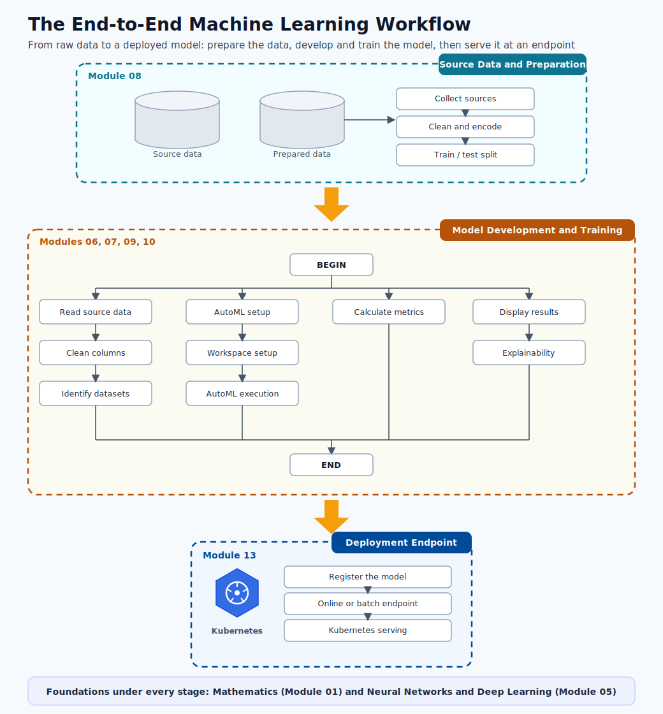

# End-to-End ML Overview

Before diving into the individual building blocks, it helps to see the whole picture at once.
This page is a map of the entire machine learning workflow: the parts that make up an ML
solution and how they connect, from framing a business problem all the way to monitoring a
model running in production.

Use it as a reference you can return to. Each stage below links to the deep-dive module that
covers it in full.

## Included from your model-creation source

This module explicitly incorporates the implementation flow from `azML-modelcreation`:

- Workspace setup and compute instance preparation.
- Dataset registration and schema verification.
- Notebook-driven model training and evaluation.
- Model registration plus endpoint-oriented scoring script pattern (`score.py`).

---

## The big picture

> **Note - Read the diagram as a loop, not a line:** Real ML projects are iterative. Results from
> evaluation and monitoring feed back into data and model work, so the pipeline is a cycle that
> keeps improving rather than a one-way path that finishes.

The workflow has six working stages, all resting on two foundations (mathematics and neural
networks) that show up in every stage.

---

## The stages at a glance

| # | Stage | What happens here | Where to learn it |
|---|-------|-------------------|-------------------|
| 1 | Problem framing | Turn a business goal into a precise prediction target: the decision, the unit, the label, the success KPI, and the cost of each error. | [Introduction and Lifecycle](03-introduction.md) |
| 2 | Data preparation | Collect source data, clean and encode it, identify the right datasets, and split into train and test sets without leakage. | [Data Preparation](08-data-preparation.md) |
| 3 | Model development | Set up the workspace and environment, choose a model family, configure AutoML, and run training and hyperparameter search. | [Model Types](09-model-types.md), [Training and AutoML](10-training-automl.md) |
| 4 | Evaluation | Compute the right metrics, analyze where the model wins and loses, and explain its predictions. | [Performance Metrics](11-performance-metrics.md), [Results and Explainability](12-results-explainability.md) |
| 5 | Deployment | Register the model and serve it as an online or batch endpoint, including on Kubernetes. | [Deployment](13-deployment.md) |
| 6 | Monitoring | Track data and model drift, debug live endpoints, and trigger retraining when quality drops. | [Deployment Debugging](14-deployment-debug-k8s.md) |

---

## How the parts connect

**1. Problem framing.** Everything starts with a clear question. If you cannot state the decision
the prediction will change, the unit you predict on, and how success is measured as a number, the
rest of the pipeline has no target to aim at. This is covered in
[Introduction and Lifecycle](03-introduction.md).

**2. Data preparation.** Models are only as good as the data behind them. This stage gathers the
source data, cleans and encodes it, identifies which datasets matter, and carves out an honest
train and test split. See [Data Preparation](08-data-preparation.md), with workspace and tooling
in [Azure ML Environment](06-azure-ml-environment.md) and [Environment Setup](07-environment-setup.md).

**3. Model development.** With clean data ready, you choose an algorithm family, configure the
training job (often through AutoML), and search for the best model. The theory behind the choices
lives in [ML Foundations](04-ml-foundations.md) and
[Neural Networks and Deep Learning](05-neural-networks.md); the practice lives in
[Model Types](09-model-types.md) and [Training and AutoML](10-training-automl.md).

**4. Evaluation.** A trained model is not done until you have measured it with the right metrics,
understood its mistakes, and explained its behavior. See
[Performance Metrics](11-performance-metrics.md) and
[Results and Explainability](12-results-explainability.md).

**5. Deployment.** A good model only creates value once it serves predictions. You register the
model and expose it as a real-time or batch endpoint, including Kubernetes-based serving. See
[Deployment](13-deployment.md).

**6. Monitoring.** Production is where the work continues. You watch for drift, debug endpoint and
infrastructure issues, and retrain when quality slips. This closes the loop back to data and model
development. See [Deployment Debugging](14-deployment-debug-k8s.md).

---

## The foundations under every stage

Two areas appear again and again, no matter which stage you are in:

- **Mathematics** ([Math Prerequisites](01-math-prerequisites.md)): probability, linear algebra,
  calculus, and statistics power every loss function, metric, and optimization step.
- **Neural networks and deep learning** ([Neural Networks and Deep Learning](05-neural-networks.md)):
  the dominant model family for images, text, and large-scale problems.

> **Note - Why an overview first:** Knowing where each topic fits in the larger flow makes the
> detailed modules easier to absorb. When you study data splitting or a specific metric later, you
> will already know which stage it belongs to and what comes before and after it.
