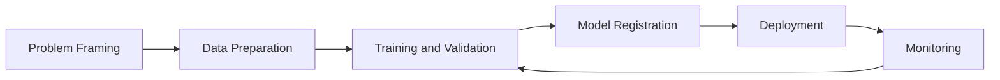
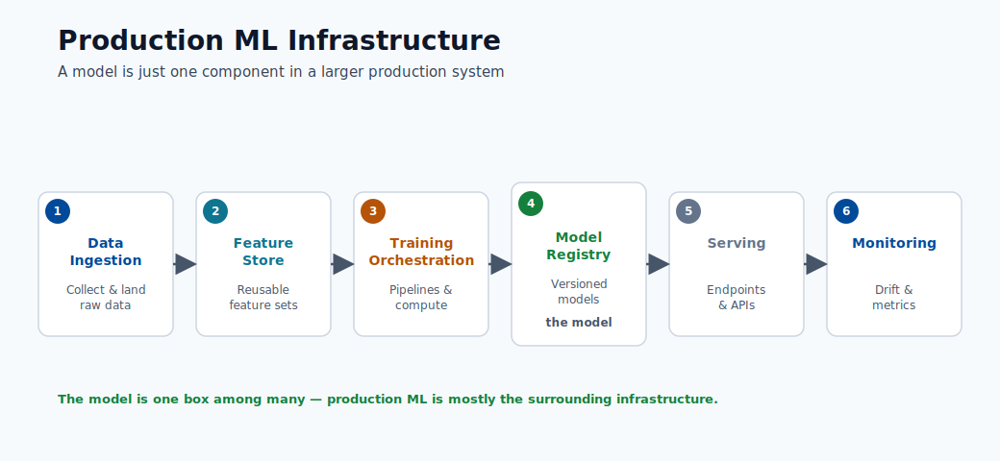
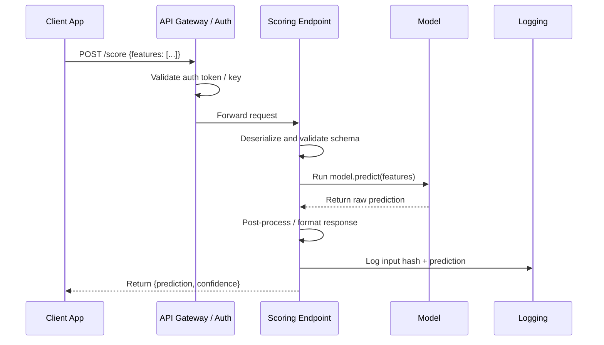
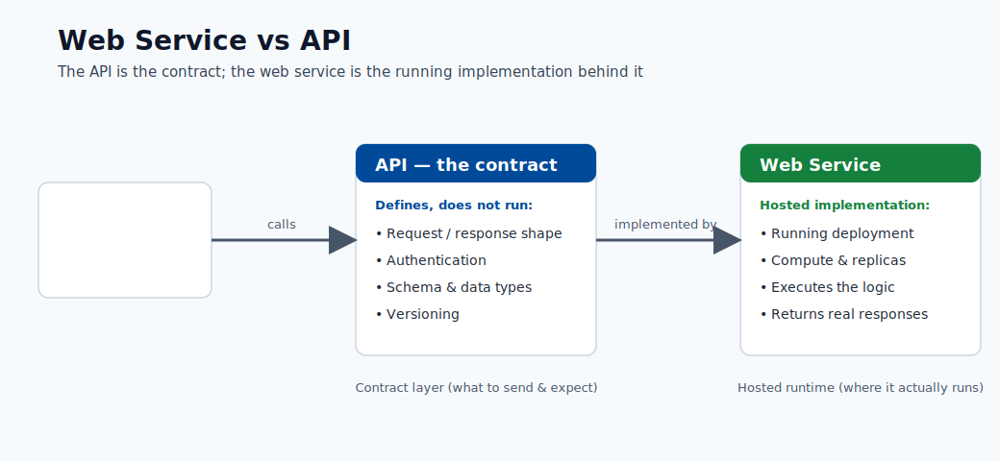
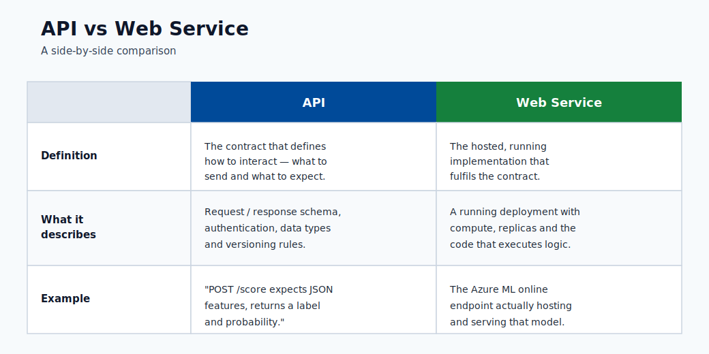

# Introduction and ML Lifecycle

This course is built for learners starting from scratch and progressing to production  
MLOps thinking. The goal is not only to define terms, but to build intuition for how  
real ML systems are designed, shipped, and operated.

## Who this is for

- Beginners who know little or nothing about ML.
- Engineers who can code but need end-to-end ML platform understanding.
- Teams preparing to deploy Azure ML workloads in production.

## Learning outcomes

By the end of this module, you should be able to:

1. Explain the difference between AI, ML, and data science.
2. Identify major AI and ML categories.
3. Describe the Azure ML lifecycle from problem framing to monitoring.
4. Explain how a deployed model is exposed as an API/web service.

## AI vs ML vs Data Science

| Topic                        | What it is                                                                           | Goal                                     | Typical output               |
| ---------------------------- | ------------------------------------------------------------------------------------ | ---------------------------------------- | ---------------------------- |
| AI (Artificial Intelligence) | Broad field of building systems that perform tasks requiring human-like intelligence | Reason, plan, perceive, generate, decide | Intelligent behavior         |
| ML (Machine Learning)        | Subset of AI where systems learn patterns from data                                  | Predict/estimate outcomes from examples  | Trained model                |
| Data Science                 | Interdisciplinary practice of extracting insight from data                           | Understand data and support decisions    | Analysis, dashboards, models |

Key relationship for beginners:

- **AI** is the umbrella.
- **ML** is one major way to build AI systems.
- **Data science** uses statistics, ML, and domain knowledge to solve business problems  
and communicate insights.

In short: AI is the mission, ML is one method, and data science is the broader practice.

## Major AI categories

| Category                  | Description                                  | Real-world examples                                |
| ------------------------- | -------------------------------------------- | -------------------------------------------------- |
| Symbolic / Rule-based AI  | Explicit rules and logic created by humans   | Expert systems, business rule engines              |
| Machine Learning AI       | Learns from data instead of hard-coded rules | Fraud scoring, demand forecasting                  |
| Generative AI             | Learns to generate new content               | Text generation, image generation, code assistants |
| Classical Search/Planning | Finds actions to optimize a goal             | Route planning, scheduling                         |

Practical note: many enterprise solutions combine categories. Example: a fraud system can  
use supervised ML scoring plus rule-based guardrails.

## Types of ML at a glance

| Type                     | Data requirement                  | Typical task                      |
| ------------------------ | --------------------------------- | --------------------------------- |
| Supervised learning      | Labeled data $(X, y)$             | Classification, regression        |
| Unsupervised learning    | Unlabeled data $X$                | Clustering, anomaly detection     |
| Reinforcement learning   | Environment + reward signal       | Sequential decision/control       |
| Semi-supervised learning | Small labeled + large unlabeled   | Classification with sparse labels |
| Self-supervised learning | Labels generated from data itself | Representation learning (NLP/CV)  |

## Common confusion points

- A model can be "accurate" but still unusable if latency is too high.
- A model can be statistically strong but fail fairness/compliance checks.
- A model is not a product by itself; the surrounding data and ops system matters.
- Deep learning is a subset of ML, not a separate thing; it uses neural networks with many layers.
- "Training" a model means finding parameter values that minimise a loss function on data, not teaching in the human sense.

## Real-world example: e-commerce recommendation

To make this concrete, here is how the full technology stack maps to a product:

| Concern               | Technology choice                  | ML lifecycle stage |
| --------------------- | ---------------------------------- | ------------------ |
| Collect user events   | Event streaming (Kafka, Event Hub) | Data ingestion     |
| Store features        | Feature store or Azure Data Lake   | Data preparation   |
| Train model           | Azure ML training job              | Training           |
| Serve recommendations | Online endpoint (AKS)              | Deployment         |
| Detect stale model    | Azure ML data drift monitor        | Monitoring         |

The model is one component. The pipeline around it is what makes it reliable.

## Why Azure ML matters

Azure Machine Learning gives you the managed platform to run the full lifecycle with  
reproducibility and governance: versioned data/model assets, tracked runs, deployment  
endpoints, and monitoring.

Azure Machine Learning organizes the end-to-end lifecycle:

1. Problem framing
2. Data preparation
3. Training and validation
4. Model registration
5. Deployment
6. Monitoring and retraining

This is not a linear path. Production systems continuously loop from monitoring back to  
data and training when model quality or data distributions change.

### What each stage does

| Stage            | Main question                               | Key output                                   |
| ---------------- | ------------------------------------------- | -------------------------------------------- |
| Problem framing  | What decision are we trying to improve?     | Business KPI definition, success criteria    |
| Data preparation | Do we trust the data and labels?            | Validated, versioned dataset                 |
| Training         | Which model learns the signal best?         | Candidate models with tracked metrics        |
| Registration     | Is the artifact versioned and reproducible? | Registered model with lineage                |
| Deployment       | Can consumers call this model safely?       | Live endpoint with auth and monitoring       |
| Monitoring       | Is quality stable over time in production?  | Drift and quality alerts, retraining signals |

Note: Stage 1 (problem framing) is often underinvested. The single most common reason ML projects fail is a poorly defined business objective, not a weak model.

> **Note - What this shows:** The production ML stack is far larger than the model itself: ingestion, feature storage,  
> training orchestration, serving, and monitoring are all distinct tools. The takeaway for Azure  
> ML learners is that choosing a model is one box among many : most reliability work happens in  
> the surrounding infrastructure.

> **Note - What this shows:** The workflow stages map one-to-one onto the Azure ML lifecycle (problem framing → data →  
> training → registration → deployment → monitoring). Notice the loop back from monitoring to  
> data/training: production ML is iterative, not a one-way pipeline.

> **Note - What this shows:** An end-to-end view of how raw data becomes a served prediction. Use it to locate where each  
> later module fits: data preparation, model training, deployment, and monitoring are all stages  
> on this single flow.

## Web Service vs API

- A deployed Azure ML model is typically exposed as a REST API endpoint.
- In practice, teams often say "web service" for the deployed scoring interface.

## Deep dive: every concept, explained

This section expands the terms used above so that no concept is left as a black box.

### What "learning from data" actually means

A classical program is a fixed function written by a human: `output = program(input)`.  
Machine learning **inverts** this. You provide examples of inputs and desired outputs, and  
an optimization procedure searches for a function that reproduces them and, crucially,  
*generalizes* to unseen inputs. Formally, ML assumes the data is drawn from an unknown  
joint distribution $P(X, Y)$, and the goal is to learn a function $f$ that minimizes the  
**expected risk** over that distribution:

$$  
R(f) = \mathbb{E}_{(x,y)\sim P}\big[\mathcal{L}(f(x), y)\big]  
$$

Because $P$ is unknown, we minimize the **empirical risk** on a finite sample instead  
(the training set). The entire discipline of ML is about making that approximation  
trustworthy : which is why data quality, validation, and monitoring matter as much as the  
algorithm.

### AI, ML, deep learning, and GenAI as nested sets

| Term                    | Precise scope                                                                 | What distinguishes it                                     |
| ----------------------- | ----------------------------------------------------------------------------- | --------------------------------------------------------- |
| Artificial Intelligence | Any system exhibiting goal-directed "intelligent" behavior                    | Includes hand-written logic, search, and learning         |
| Machine Learning        | AI systems that improve from data                                             | Parameters are *fit*, not hand-coded                      |
| Deep Learning           | ML using multi-layer neural networks                                          | Learns hierarchical feature representations automatically |
| Generative AI           | Models that learn $P(X)$ (or $P(X\mid \text{prompt})$) to synthesize new data | Produces content rather than only labels/scores           |

The mental model: each is a strict subset of the one before it. A logistic regression is  
ML but not deep learning; a CNN is deep learning; a diffusion model or LLM is deep learning  
*and* generative AI.

### Supervised, unsupervised, and reinforcement : the signal that drives learning

The families differ only in **what feedback signal is available**:

- **Supervised**: every example carries a correct answer $y$. The loss directly measures the  
gap between prediction and truth, so the gradient "knows" which direction to move.
- **Unsupervised**: there is no $y$. The objective instead rewards structure the model  
discovers itself : minimizing reconstruction error, maximizing cluster compactness, or  
maximizing likelihood of the data under a density model.
- **Reinforcement**: feedback is a delayed, scalar **reward** earned by interacting with an  
environment. The hard part is *credit assignment* : deciding which earlier actions caused  
a later reward.
- **Self-supervised** is the bridge that powers foundation models: it manufactures a  
supervised signal *from the data itself* (predict the masked word, the next token, the  
missing image patch), giving the scale benefits of supervised learning without manual labels.

### Why "the pipeline matters more than the model"

The lifecycle diagram is a closed loop on purpose. In production the dominant failure mode is  
not a weak algorithm but a **distribution shift**: the data the model sees in production  
drifts away from the data it was trained on (`P_train(X) ≠ P_prod(X)`), so a model that was  
accurate at launch silently degrades. The monitoring → training feedback edge exists to  
detect this and retrain. This is the core idea of **MLOps**: treating data, models, and  
deployments as versioned, testable, observable assets rather than one-off artifacts.

### Latency, throughput, and why a "good" model can be unusable

Two operational terms appear throughout the course:

- **Latency** : time to serve a single request (often measured at the p95 or p99  
percentile, not the average, because tail latency is what users feel).
- **Throughput** : requests served per second (QPS) at acceptable latency.

A model that scores 0.99 AUC but needs 800 ms per call may be useless for a checkout flow  
with a 100 ms budget. Model selection is therefore always a *joint* optimization over  
accuracy, latency, cost, and governance constraints : a theme repeated in every later module.

### Problem framing in practice: turning a business goal into an ML task

Problem framing is the stage where most projects are silently won or lost, so it deserves a  
concrete checklist. The job is to translate a vague business wish ("reduce churn") into a  
precise, measurable learning task. Five questions force that translation:

1. **What decision changes because of the prediction?** If no human or system will act
  differently, the model has no value. "Predict churn" is only useful if it triggers a  
   retention offer. The decision defines the whole project.
2. **What is the unit of prediction?** One row per customer? Per customer per month? Per
  session? This fixes the granularity of your data and labels.
3. **What exactly is the label?** "Churn" must become a rule: for example, "no purchase in
  the next 60 days". Ambiguous labels produce models that learn the wrong thing.
4. **What does success look like as a number?** Tie the model to a business KPI (retained
  revenue, fraud caught, cost avoided), not just accuracy. This is the metric the project is  
   judged on.
5. **What is the cost of each error type?** A false positive (flagging a loyal customer) and
  a false negative (missing a leaver) rarely cost the same. This asymmetry drives the loss  
   function and the decision threshold in later modules.

> **Note - The framing trap:** A technically excellent model built on a poorly framed problem  
> is worse than useless: it produces confident, well-validated answers to the wrong question.  
> Spend real time here before touching data or algorithms.

### A concrete numeric walk-through

To demystify "the model is just math", here is the smallest possible end-to-end example. Suppose  
we predict whether an email is spam from one feature, the number of suspicious links $x$. A  
logistic-regression model learns two numbers, a weight $w$ and a bias $b$, and computes:

$$  
\hat{p} = \frac{1}{1 + e^{-(wx + b)}}  
$$

Say training settles on $w = 1.2$ and $b = -2.0$. For an email with $x = 3$ links, the score is  
$wx + b = 1.6$, and $\hat{p} = 1/(1 + e^{-1.6}) \approx 0.83$. With a decision threshold of  
$0.5$, the email is flagged as spam. Every model in this course is a richer version of exactly  
this: learn parameters from examples, combine them with the input to get a score, then apply a  
threshold to make a decision.

### REST API, endpoint, and web service : the same idea at different layers

- A **REST API** is an HTTP contract: a client sends a request (usually JSON) to a URL and  
gets a structured response. "REST" means it uses standard HTTP verbs and is stateless.
- An **endpoint** in Azure ML is the concrete, addressable deployment of that API, with  
authentication, scaling, and traffic-routing attached.
- "**Web service**" is the informal name teams give the running endpoint. All three describe  
the same thing seen from the contract, the platform, and the team's vocabulary respectively.

Practical distinction:

- **API** describes the contract (request/response schema, authentication, versioning).
- **Web service** is the hosted implementation of that API.
- In Azure ML online endpoints, you design the API contract through the scoring payload  
and endpoint auth, and Azure hosts the service.

### Inference request flow (simple)

1. Client sends JSON payload to endpoint URI.
2. Endpoint auth validates identity/key.
3. Scoring script parses input and runs model.
4. API returns prediction response + metadata.

### Inference request flow (detailed)

Key production considerations for this flow:

- **Schema validation in the scoring script** protects against unexpected input shapes.
- **Logging input hashes** (not raw PII) enables later drift analysis and auditing.
- **Timeouts and retries** must be defined at both the gateway and client layers to avoid silent failures.

> **Tip - Mental model:** A *web service* is the running deployment; the *API* is the contract clients use to call it.  
> In Azure ML a model is wrapped behind a REST endpoint : clients send JSON and receive a  
> prediction, without knowing which model or framework runs underneath.

> **Note - Quick comparison:** The table contrasts the informal term *web service* with the technical term *API*. They  
> describe the same deployed scoring interface from two angles : the running process versus the  
> HTTP contract it exposes.

## Key terms glossary

This glossary collects the vocabulary introduced above in one place so later modules can assume  
it. Each term is defined in one plain sentence.

| Term                | Meaning                                                                                |
| ------------------- | -------------------------------------------------------------------------------------- |
| Model               | A function with learned numbers (parameters) that turns inputs into predictions.       |
| Parameter / weight  | One of the numbers the training process adjusts; together they store what was learned. |
| Feature             | A single input column (a measurable property) the model reads.                         |
| Label / target      | The correct answer attached to each training example in supervised learning.           |
| Loss function       | A single number measuring how wrong the model is; training tries to make it small.     |
| Training            | The optimization process that searches for parameters that minimize the loss.          |
| Generalization      | How well the model performs on data it never saw during training.                      |
| Overfitting         | Memorizing training noise so accuracy drops on new data.                               |
| Inference / scoring | Using a trained model to make predictions on new inputs.                               |
| Endpoint            | The deployed, addressable service that serves a model over HTTP.                       |
| Drift               | A change in production data distribution that degrades model quality over time.        |
| MLOps               | Treating data, models, and deployments as versioned, tested, monitored assets.         |

## Quick self-check

| # | Question | Answer |
|---|----------|--------|
| 1 | Is every AI system an ML system? | No. ML is a subset of AI; rule-based and symbolic AI systems make decisions without learning from data. |
| 2 | In production, which stage catches drift issues? | The monitoring stage, which watches the live data distribution and model quality and flags drift over time. |
| 3 | What is the difference between API and web service? | The API is the contract (request/response schema, authentication, versioning); the web service is the hosted, running implementation of that API (the endpoint). |
| 4 | Given a business goal, what are the five problem-framing questions you must answer first? | (1) What decision changes because of the prediction? (2) What is the unit of prediction? (3) What exactly is the label? (4) What does success look like as a number (business KPI)? (5) What is the cost of each error type? |
| 5 | Why can a model with excellent accuracy still be the wrong choice for production? | Accuracy ignores error costs, class imbalance, fairness, latency, and the business KPI; a high-accuracy model can still miss rare positives or be too slow, costly, or unfair to deploy. |

---

## Probability foundations for ML

Machine learning is fundamentally applied probability. Every loss function, every metric, and every generalization guarantee has a probabilistic argument behind it. This section builds the minimum required vocabulary.

### Joint and marginal probability

The **joint probability** $P(X = x, Y = y)$ is the probability that a randomly drawn example has feature value $x$ *and* label $y$ simultaneously. Supervised learning assumes your dataset is sampled i.i.d. from this joint distribution.

The **marginal probability** of $X$ is obtained by summing (or integrating) out $Y$:

$$
P(X = x) = \sum_{y} P(X = x, Y = y)
$$

This tells you nothing about the label — only what the input looks like.

### Conditional probability

The **conditional probability** $P(Y = y \mid X = x)$ is the probability of label $y$ given that the input is $x$. This is exactly what a classifier learns to estimate. Formally:

$$
P(Y \mid X) = \frac{P(X, Y)}{P(X)}
$$

The denominator $P(X)$ normalizes the joint so that probabilities over all $y$ sum to 1. When a model outputs a "probability" of class 1, it is estimating $P(Y=1 \mid X=x)$.

### Bayes' theorem

Bayes' theorem is the central engine of probabilistic reasoning. It inverts conditioning:

$$
P(Y \mid X) = \frac{P(X \mid Y) \cdot P(Y)}{P(X)}
$$

- $P(Y)$ is the **prior**: what you believe about $Y$ before seeing $X$. For spam, this might be "5% of all emails are spam."
- $P(X \mid Y)$ is the **likelihood**: how probable is this input given the label? E.g., how likely is the word "lottery" in a spam email?
- $P(Y \mid X)$ is the **posterior**: your updated belief after seeing $X$. This is what you want.
- $P(X)$ is the **evidence**: a normalizing constant.

A **Naive Bayes classifier** directly applies this theorem, assuming features are conditionally independent given the class. Despite this unrealistic assumption, it performs surprisingly well on text classification because the relative ordering of posteriors is preserved.

### Why probabilistic thinking is essential for ML

- **Calibration**: a model predicting 0.9 probability should be right 90% of the time. Miscalibrated models mislead downstream decision systems.
- **Uncertainty quantification**: knowing *how confident* the model is matters as much as the prediction itself in medical and financial settings.
- **Loss derivation**: most standard loss functions (cross-entropy, MSE) fall out naturally as maximum likelihood objectives under specific probabilistic assumptions.
- **Handling class imbalance**: imbalanced datasets have a skewed prior $P(Y)$; understanding this prevents naive accuracy from being a misleading metric.

> **Note - Probability vs statistics:** Probability reasons forward from a known model to data. Statistics reasons backward from data to unknown parameters. ML does both simultaneously: it uses statistical estimation to learn a probabilistic model, then uses that model to reason forward at inference time.

---

## Information theory and entropy in ML

Information theory, developed by Claude Shannon in 1948, provides the mathematical language for measuring uncertainty. It turns out to be the natural foundation for classification losses.

### Entropy: measuring uncertainty

The **entropy** of a discrete probability distribution $P$ over $K$ classes measures the average surprise (unpredictability) of drawing a sample:

$$
H(P) = -\sum_{k=1}^{K} p_k \log_2 p_k
$$

Entropy is measured in **bits** when using $\log_2$, and in **nats** when using $\ln$. Key properties:

- $H = 0$ when one class has probability 1 (no uncertainty).
- $H$ is maximized at $\log_2 K$ bits when all $K$ classes are equally likely (maximum uncertainty).
- For a fair coin (binary, $p = 0.5$): $H = -0.5 \log_2 0.5 - 0.5 \log_2 0.5 = 1$ bit.

### Cross-entropy as the natural classification loss

Suppose the true distribution over classes is $P$ (the one-hot label vector), and your model produces a predicted distribution $Q$ (the softmax outputs). The **cross-entropy** between $P$ and $Q$ is:

$$
H(P, Q) = -\sum_{k=1}^{K} p_k \log q_k
$$

For a single example with true class $c$, the one-hot vector makes $p_k = 1$ only for $k = c$, so this reduces to:

$$
H(P, Q) = -\log q_c
$$

This is exactly the **negative log-likelihood** of the correct class under the model's distribution. Minimizing cross-entropy is equivalent to maximizing the probability the model assigns to the true labels — the most principled objective possible.

The averaged cross-entropy over a dataset is the standard **categorical cross-entropy loss** used in virtually every classification model:

$$
\mathcal{L}_{CE} = -\frac{1}{N} \sum_{i=1}^{N} \sum_{k=1}^{K} y_{ik} \log \hat{p}_{ik}
$$

### KL divergence: measuring distribution mismatch

The **Kullback-Leibler (KL) divergence** from distribution $Q$ to $P$ measures how much information is lost when $Q$ is used to approximate $P$:

$$
D_{KL}(P \| Q) = \sum_{k} p_k \log \frac{p_k}{q_k} = H(P, Q) - H(P)
$$

Key facts:

- $D_{KL}(P \| Q) \geq 0$ always, with equality only when $P = Q$ (Gibbs inequality).
- It is **asymmetric**: $D_{KL}(P \| Q) \neq D_{KL}(Q \| P)$ in general.
- Minimizing cross-entropy $H(P, Q)$ with respect to model parameters is identical to minimizing $D_{KL}(P \| Q)$, because $H(P)$ does not depend on the model.

KL divergence appears throughout ML: in variational autoencoders (as the regularization term), in knowledge distillation (aligning student and teacher distributions), and in monitoring (measuring how much a production distribution has drifted from training).

> **Tip - Intuition for cross-entropy:** Think of $-\log q_c$ as the "cost" of encoding the true class using your model's probability distribution. If the model is very confident and correct ($q_c \approx 1$), the cost is near zero. If the model is confidently wrong ($q_c \approx 0$), the cost is enormous. This is why cross-entropy strongly penalizes overconfident mistakes.

---

## Statistical learning theory overview

Statistical learning theory is the branch of mathematics that asks: *when does empirical risk minimization actually work?* It provides formal guarantees connecting what we observe on training data to what we can expect on unseen data.

### The generalization problem formally

We want to learn a function $f$ from a hypothesis class $\mathcal{H}$ such that the **true risk** $R(f)$ is small. We only have access to the **empirical risk** on $N$ samples:

$$
\hat{R}(f) = \frac{1}{N} \sum_{i=1}^{N} \mathcal{L}(f(x_i), y_i)
$$

The generalization gap $R(f) - \hat{R}(f)$ is the core quantity theory tries to bound.

### PAC learning

**Probably Approximately Correct (PAC) learning**, introduced by Leslie Valiant (1984), formalizes what it means for a learning algorithm to succeed. An algorithm PAC-learns a concept class $\mathcal{C}$ if: for any target concept, any distribution over inputs, and any $\epsilon, \delta > 0$, the algorithm outputs a hypothesis $h$ such that:

$$
P\big[R(h) \leq \epsilon\big] \geq 1 - \delta
$$

using a number of samples that is polynomial in $1/\epsilon$, $1/\delta$, and the complexity of the concept class. Intuitively: with enough data, the algorithm will (with high probability) find a hypothesis whose true error is small.

### VC dimension

The **Vapnik-Chervonenkis (VC) dimension** of a hypothesis class $\mathcal{H}$ is the largest set of points that $\mathcal{H}$ can **shatter** — classify in all $2^n$ possible binary labelings. It measures the expressive power of the model class.

Examples:

- Linear classifiers in $\mathbb{R}^2$ (half-planes): VC dimension = 3. Any 3 non-collinear points can be shattered; no set of 4 can.
- Decision stumps (threshold on one feature): VC dimension = 2.
- $k$-nearest-neighbor: VC dimension = $\infty$ (infinitely expressive).

The fundamental sample complexity bound:

$$
N = O\!\left(\frac{d_{VC} + \log(1/\delta)}{\epsilon^2}\right)
$$

where $d_{VC}$ is the VC dimension. To halve the allowed error $\epsilon$, you need roughly **four times as much data**.

### Generalization bounds

A uniform convergence bound states that with probability at least $1 - \delta$:

$$
R(f) \leq \hat{R}(f) + O\!\left(\sqrt{\frac{d_{VC} \log N + \log(1/\delta)}{N}}\right)
$$

Practical implications:

- **More data** ($N$ increases): the bound tightens — variance falls.
- **More complex model** ($d_{VC}$ increases): the bound loosens — variance rises.
- **Bias** is not captured by this bound; it only describes how much the model can overfit.

### Why more data helps variance but not bias

Increasing $N$ reduces the generalization gap by concentrating the empirical distribution around the true distribution (law of large numbers). However, if the hypothesis class is too simple (small $d_{VC}$), no amount of data will allow the model to express the true function — that is bias, a structural limitation of the model family.

> **Note - Practical implication:** If your model plateaus despite adding data, the problem is bias (capacity). If train and test error diverge, the problem is variance (complexity). These two diagnostics drive all model selection decisions.

---

## The scientific method as ML workflow

Good ML practice is good science. The scientific method provides the epistemological discipline that prevents teams from fooling themselves.

### Mapping science to ML

| Scientific step      | ML equivalent                                      | Risk if skipped                              |
| -------------------- | -------------------------------------------------- | -------------------------------------------- |
| Hypothesis           | Define the problem and success metric precisely    | Building a model that answers the wrong question |
| Experimental design  | Design the train/val/test split and evaluation     | Data leakage; optimistic results that do not transfer |
| Experiment           | Train model with controlled hyperparameters        | Uninterpretable results; cannot isolate causes |
| Measurement          | Record metrics on held-out data                    | Overfitting the reported number to the test set |
| Conclusion           | Accept/reject the hypothesis; decide next step     | Premature deployment or abandoned good models |
| Replication          | Version code, data, and environment                | Results that cannot be reproduced by teammates or auditors |

### Controlled experiments in ML

A **controlled experiment** changes one variable at a time. In ML this means:

- When comparing models, hold the dataset, preprocessing, and evaluation metric constant.
- When comparing feature sets, hold the model architecture and hyperparameters constant.
- When comparing hyperparameters, use the same random seed and data split.

Azure ML **experiment tracking** enforces this discipline by logging every run with its hyperparameters, data version, code commit, and metrics.

### Reproducibility and its enemies

A result is **reproducible** if anyone with the same inputs can get the same outputs. Reproducibility is threatened by:

- **Random seeds**: randomness in weight initialization, data shuffling, or augmentation must be fixed and logged.
- **Library versions**: a different version of scikit-learn or PyTorch may produce numerically different results.
- **Data version**: if the training dataset changes without versioning, you cannot re-create historical runs.
- **Hardware**: GPU non-determinism means bit-identical reproduction sometimes requires pinning hardware.

Azure ML addresses these with dataset versioning, environment snapshots, and run reproducibility metadata.

> **Tip - The reproducibility checklist:** Before publishing or deploying a result, verify: (1) the data version is pinned, (2) the code commit is tagged, (3) the environment is containerized, (4) random seeds are logged. A result that cannot be reproduced is not a result.

---

## Responsible AI and ethical framing

Responsible AI is not a box to check at the end of a project — it is a design discipline that must be embedded from problem framing onwards.

### Why ethics is a first-class engineering concern

A model encodes decisions. Those decisions affect people. When a credit-scoring model denies a loan, a hiring model ranks résumés, or a medical triage model allocates attention, the downstream consequences are real and potentially discriminatory. The question "is this model accurate?" is incomplete without also asking "accurate for whom, and at what cost to which group?"

### Fairness definitions

There is no single agreed definition of fairness. The three most common statistical definitions are:

**Demographic parity (statistical parity):** The positive prediction rate is equal across groups $A$ and $B$:

$$
P(\hat{Y} = 1 \mid G = A) = P(\hat{Y} = 1 \mid G = B)
$$

This ensures equal representation of positive outcomes. It does not require equal accuracy.

**Equalized odds:** Both the true positive rate (TPR) and false positive rate (FPR) are equal across groups:

$$
P(\hat{Y} = 1 \mid Y = y, G = A) = P(\hat{Y} = 1 \mid Y = y, G = B) \quad \text{for } y \in \{0, 1\}
$$

This is stricter: the model must be equally accurate *and* equally inaccurate across groups.

**Calibration:** The predicted probability $\hat{p}$ matches the true positive rate within each group. A model calibrated at the population level may be miscalibrated within sub-groups — a common failure mode in medical scoring.

> **Note - The impossibility theorem:** It is mathematically impossible to satisfy demographic parity, equalized odds, and calibration simultaneously when base rates differ across groups (Chouldechova 2017; Kleinberg et al. 2016). Choosing a fairness criterion is a value judgment that must involve stakeholders, not just engineers.

### Transparency and explainability

- **Transparency** refers to the ability to understand *why* a model made a specific decision. Opaque "black box" models create accountability gaps in regulated industries.
- **Explainability** techniques (SHAP, LIME, attention visualization) approximate or expose feature attributions. These are covered in the Results and Explainability module.
- Regulations such as GDPR (Article 22) and the EU AI Act require that automated decisions affecting individuals be explainable on request.

### Privacy and data minimization

- **Data minimization**: only collect and use the features necessary for the task. Every additional personal attribute is a liability.
- **Differential privacy**: a formal mathematical guarantee that the presence or absence of any single individual in the training data cannot be inferred from the model's output.
- **Federated learning**: train models on data that never leaves the device or institution. Gradients are aggregated centrally but raw data stays local.

### Accountability and governance

- Every model deployed in production should have a named owner responsible for monitoring, retraining, and decommissioning.
- **Model cards** document a model's intended use, performance across sub-groups, known limitations, and out-of-scope uses. They are the audit trail that regulated organizations require.
- In the EU AI Act framework, high-risk AI systems (hiring, credit, biometric identification, critical infrastructure) face mandatory conformity assessments, logging requirements, and human-oversight mechanisms.

> **Note - GDPR and Azure ML:** If training data includes personal data of EU residents, the data controller must document the legal basis, retention period, and processing purpose. Model outputs that constitute automated decisions triggering legal effects require a human review pathway. Azure ML's audit logs and dataset lineage features directly support this compliance requirement.

---

## Industry applications taxonomy

The table below catalogs 22 real-world ML applications across major industries. For each application the relevant ML problem type, typical model family, data type, and a key deployment risk are listed.

| # | Industry | Application | Problem type | Model family | Data type | Key risk |
|---|----------|-------------|--------------|--------------|-----------|----------|
| 1 | Healthcare | Disease risk scoring | Binary classification | Gradient boosting, logistic regression | Tabular (EHR) | Disparate performance across demographic groups |
| 2 | Healthcare | Medical image diagnosis | Multi-class classification | CNN, Vision Transformer | Images (X-ray, MRI) | Distribution shift between hospital systems |
| 3 | Healthcare | Length-of-stay prediction | Regression | XGBoost, RNN | Tabular + time series | Temporal leakage from future observations |
| 4 | Healthcare | Drug discovery | Generative / regression | Graph neural networks | Molecular graphs | Out-of-distribution extrapolation |
| 5 | Finance | Credit default scoring | Binary classification | Logistic regression, XGBoost | Tabular (bureau data) | Regulatory fairness (ECOA); model explainability |
| 6 | Finance | Fraud detection | Anomaly detection / binary | Isolation Forest, XGBoost | Tabular + graph | Severe class imbalance; adversarial evolution |
| 7 | Finance | Algorithmic trading | Time-series forecasting | LSTM, Transformer | Market tick data | Non-stationarity; regime change |
| 8 | Finance | Document processing (KYC) | NER / classification | BERT, LayoutLM | Text + PDF layout | Hallucination risk from LLMs |
| 9 | Retail | Product recommendation | Collaborative filtering | Matrix factorization, two-tower neural net | Interaction logs | Popularity bias; cold-start problem |
| 10 | Retail | Demand forecasting | Time-series regression | LightGBM, N-BEATS | Tabular + calendar features | Promotions causing distributional breaks |
| 11 | Retail | Dynamic pricing | Regression + RL | Bandit models, policy gradient | Tabular | Price elasticity model errors amplify losses |
| 12 | Retail | Churn prediction | Binary classification | XGBoost, logistic regression | Tabular (CRM) | Label ambiguity; what counts as churned? |
| 13 | Manufacturing | Predictive maintenance | Anomaly detection / binary | Autoencoder, LSTM | Sensor time series | Rare event class imbalance; cost of false negatives |
| 14 | Manufacturing | Visual quality inspection | Object detection | YOLO, ResNet | Images | Lighting / background shift across production lines |
| 15 | Manufacturing | Supply chain optimization | Combinatorial optimization | Reinforcement learning, OR solvers | Mixed (tabular + graph) | Reward shaping errors; sim-to-real gap |
| 16 | Government | Document classification | Multi-class classification | BERT fine-tune | Text | Sensitive categories; privacy regulations |
| 17 | Government | Benefits fraud detection | Anomaly detection | Graph analytics + XGBoost | Tabular + relational | Disparate impact on vulnerable populations |
| 18 | Government | Traffic flow prediction | Time-series regression | GNN, LSTM | Sensor + GPS data | Sensor failures causing silent covariate shift |
| 19 | Energy | Renewable output forecasting | Time-series regression | Prophet, TCN | Weather + grid sensors | Distribution shift from climate trends |
| 20 | Media | Content moderation | Multi-label classification | BERT, CLIP | Text + images | Adversarial bypass; language/dialect fairness |
| 21 | HR / Talent | Résumé screening | Ranking / classification | BERT, logistic regression | Text | Historical hiring bias encoded in labels |
| 22 | Logistics | Route optimization | Combinatorial + regression | Reinforcement learning | Graph + spatial | Objective function mismatch with real cost |

> **Note - Using this table:** Before selecting a model family, identify your industry row. The "Key risk" column is the most valuable: it contains the specific failure mode most commonly observed in production for that application type. Ignoring it is the most frequent cause of ML projects that succeed in offline evaluation but fail in deployment.

---

## A complete numeric walkthrough: spam classification from scratch

This section walks through an end-to-end spam classification example with full arithmetic at every step. No step is left as "and then magic happens."

### Step 1: Problem definition and features

**Task**: classify an email as spam (1) or not spam (0).

**Features** (two, for clarity):

- $x_1$: number of suspicious links in the email.
- $x_2$: 1 if the subject contains the word "FREE", 0 otherwise.

**Training dataset** (four examples):

| Email | $x_1$ | $x_2$ | Label $y$ |
|-------|--------|--------|-----------|
| A     | 3      | 1      | 1 (spam)  |
| B     | 0      | 0      | 0 (not)   |
| C     | 5      | 1      | 1 (spam)  |
| D     | 1      | 0      | 0 (not)   |

### Step 2: The logistic regression model

Logistic regression learns weights $w_1, w_2$ and a bias $b$ to compute:

$$
z_i = w_1 x_{i1} + w_2 x_{i2} + b
$$

$$
\hat{p}_i = \sigma(z_i) = \frac{1}{1 + e^{-z_i}}
$$

The sigmoid function $\sigma$ squashes any real number to $(0, 1)$, making it interpretable as a probability.

**Initialize:** $w_1 = 0,\; w_2 = 0,\; b = 0$.

### Step 3: Forward pass — compute predictions

With all parameters at zero, $z_i = 0$ for all emails, so $\hat{p}_i = \sigma(0) = 0.5$ for all four examples.

### Step 4: Compute the binary cross-entropy loss

$$
\mathcal{L} = -\frac{1}{N} \sum_{i=1}^{N} \left[ y_i \log \hat{p}_i + (1 - y_i) \log(1 - \hat{p}_i) \right]
$$

For $\hat{p}_i = 0.5$ and $N = 4$, each term equals $-\log 0.5 = \log 2 \approx 0.693$.

Total: $\mathcal{L} = 0.693$. This is the maximum-entropy baseline — the model knows nothing.

### Step 5: Compute gradients

For logistic regression with binary cross-entropy, the gradient with respect to $w_j$ is:

$$
\frac{\partial \mathcal{L}}{\partial w_j} = \frac{1}{N} \sum_{i=1}^{N} (\hat{p}_i - y_i) x_{ij}
$$

**Gradient for $w_1$:**

$$
\frac{\partial \mathcal{L}}{\partial w_1} = \frac{1}{4}\big[(0.5-1)(3) + (0.5-0)(0) + (0.5-1)(5) + (0.5-0)(1)\big]
= \frac{-1.5 + 0 - 2.5 + 0.5}{4} = -0.875
$$

**Gradient for $w_2$:**

$$
\frac{\partial \mathcal{L}}{\partial w_2} = \frac{1}{4}\big[(0.5-1)(1) + (0.5-0)(0) + (0.5-1)(1) + (0.5-0)(0)\big]
= \frac{-0.5 + 0 - 0.5 + 0}{4} = -0.25
$$

**Gradient for $b$:**

$$
\frac{\partial \mathcal{L}}{\partial b} = \frac{1}{4}\big[-0.5 + 0.5 - 0.5 + 0.5\big] = 0
$$

### Step 6: Gradient descent update

With learning rate $\eta = 0.5$:

$$
w_1 \leftarrow 0 - 0.5 \times (-0.875) = +0.4375
$$

$$
w_2 \leftarrow 0 - 0.5 \times (-0.25) = +0.125
$$

$$
b \leftarrow 0 - 0.5 \times 0 = 0
$$

Both $w_1$ and $w_2$ became positive, which makes sense: more links and "FREE" in the subject both increase the spam probability.

### Step 7: Second forward pass

Recompute predictions with the updated weights:

| Email | $z_i = 0.4375 x_1 + 0.125 x_2$ | $\hat{p}_i = \sigma(z_i)$ | Label |
|-------|----------------------------------|---------------------------|-------|
| A     | $0.4375(3) + 0.125(1) = 1.4375$ | $\approx 0.808$           | 1     |
| B     | $0.4375(0) + 0.125(0) = 0.000$  | $= 0.500$                 | 0     |
| C     | $0.4375(5) + 0.125(1) = 2.3125$ | $\approx 0.910$           | 1     |
| D     | $0.4375(1) + 0.125(0) = 0.4375$ | $\approx 0.607$           | 0     |

The spam emails (A, C) now have probabilities above 0.5. After more gradient descent iterations the model will cleanly separate the classes.

### Step 8: Evaluate with a confusion matrix

After full convergence, predictions at threshold $0.5$:

| | Predicted spam | Predicted not spam |
|---|---|---|
| **Actual spam** | TP = 2 | FN = 0 |
| **Actual not spam** | FP = 0 | TN = 2 |

Derived metrics:

- **Precision** $= \frac{TP}{TP + FP} = \frac{2}{2} = 1.0$
- **Recall** $= \frac{TP}{TP + FN} = \frac{2}{2} = 1.0$
- **F1** $= 2 \cdot \frac{1.0 \times 1.0}{1.0 + 1.0} = 1.0$

> **Note - What this walkthrough teaches:** The entire ML pipeline — define features, initialize weights, forward pass, compute loss, compute gradients, update, repeat — is arithmetic. Every deep-learning model, no matter how large, is doing exactly this sequence. The complexity grows but the principle does not change.

---

## Quick self-check (extended)

| # | Question | Answer |
|---|----------|--------|
| 1 | Is every AI system an ML system? | No. ML is a subset of AI; rule-based and symbolic AI systems make decisions without learning from data. |
| 2 | In production, which stage catches drift issues? | The monitoring stage, which watches the live data distribution and model quality and flags drift over time. |
| 3 | What is the difference between API and web service? | The API is the contract (request/response schema, authentication, versioning); the web service is the hosted, running implementation of that API (the endpoint). |
| 4 | Given a business goal, what are the five problem-framing questions you must answer first? | (1) What decision changes because of the prediction? (2) What is the unit of prediction? (3) What exactly is the label? (4) What does success look like as a number (business KPI)? (5) What is the cost of each error type? |
| 5 | Why can a model with excellent accuracy still be the wrong choice for production? | Accuracy ignores error costs, class imbalance, fairness, latency, and the business KPI; a high-accuracy model can still miss rare positives or be too slow, costly, or unfair to deploy. |
| 6 | What does entropy measure, and what is its minimum and maximum value for a binary distribution? | It measures the average uncertainty (surprise) of a distribution; for a binary distribution it is minimized at 0 bits (one outcome certain) and maximized at 1 bit (when $p = 0.5$). |
| 7 | Why is minimizing cross-entropy equivalent to maximizing the likelihood of the training labels? | For the true class the cross-entropy reduces to $-\log q_c$, the negative log-likelihood of the correct label, so minimizing it maximizes the probability the model assigns to the true labels. |
| 8 | What is the VC dimension of a linear classifier in two dimensions? | 3 — any 3 non-collinear points can be shattered, but no set of 4 can. |
| 9 | Name two fairness definitions and explain why they cannot all be satisfied simultaneously when base rates differ. | Demographic parity and equalized odds (and calibration). When base rates differ across groups the impossibility theorem (Chouldechova; Kleinberg et al.) shows they cannot all hold at once, so choosing one is a value judgment. |
| 10 | In the spam walkthrough, why did $w_1$ receive a larger gradient update than $w_2$ after the first step? | Because $x_1$ (number of links) has larger feature values than $x_2$, so the gradient $\frac{1}{N}\sum_i(\hat{p}_i - y_i)x_{ij}$ was bigger in magnitude for $w_1$ ($-0.875$ vs $-0.25$). |
