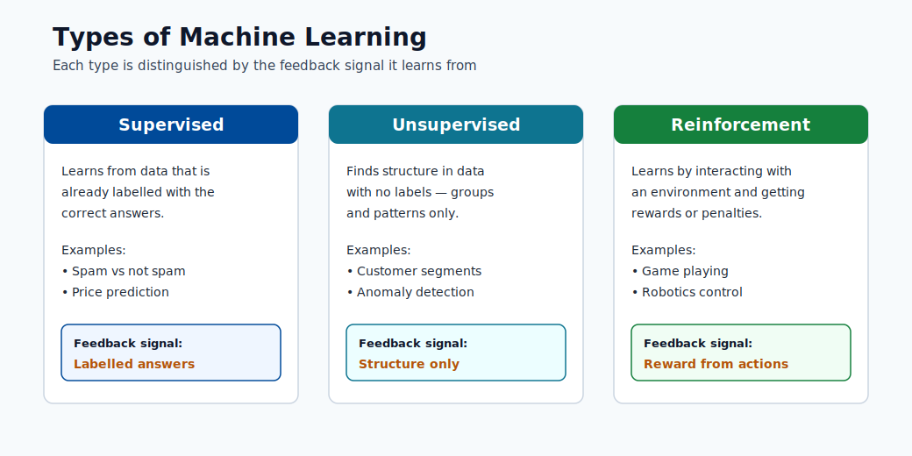
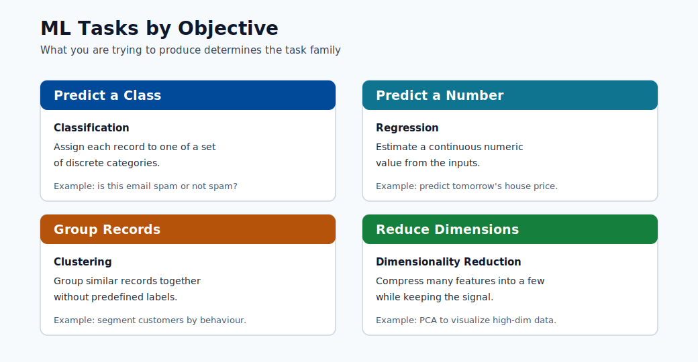

# ML Foundations

This module builds the mathematical and conceptual base needed for all later modules.  
It starts from first principles and then moves into model families and selection logic.

## Core learning families

- Supervised learning: classification and regression
- Unsupervised learning: clustering and association
- Reinforcement learning: policy learning from rewards

Additional modern families used in production:

- Semi-supervised learning: combine a small labeled set with a large unlabeled set.
- Self-supervised learning: create supervisory signals from the data itself.
- Online learning: update models continuously from streaming/new data.

What to remember:

- Supervised learns from known answers.
- Unsupervised discovers structure without labels.
- Reinforcement learns through interaction and reward.

> **Note - What this shows:** The major learning families side by side. The distinguishing axis is the *feedback signal*:
> labeled answers (supervised), structure-only (unsupervised), or reward from interaction
> (reinforcement). Identifying which signal your data provides is the first step in choosing an
> approach.

> **Note - What this shows:** ML tasks organized by *objective* (predict a class, predict a number, group records, reduce
> dimensions). Map your business question to one of these objectives before picking an algorithm :
> the objective constrains both the model family and the evaluation metric.

## Problem Types

- Supervised: classification and regression
- Unsupervised: clustering and association
- Reinforcement: control and policy optimization

## Data and notation basics

- Dataset: $D = (x_i, y_i)_{i=1}^{N}$ for supervised learning.
- Feature vector: $x_i \in \mathbb{R}^{d}$.
- Target/label: $y_i$.
- Model: $f_{\theta}(x)$ with parameters $\theta$.

## Supervised learning categories

| Category                   | Output type                 | Examples                          | Typical metrics              |
| -------------------------- | --------------------------- | --------------------------------- | ---------------------------- |
| Binary classification      | 0/1 class                   | Fraud yes/no, churn yes/no        | Precision, Recall, F1, AUC   |
| Multi-class classification | One of $K$ classes          | Product category, diagnosis class | Macro-F1, accuracy, log loss |
| Multi-label classification | Multiple classes per sample | Tagging documents/topics          | Micro-F1, Hamming loss       |
| Regression                 | Continuous value            | Price, demand, latency            | MAE, RMSE, $R^2$             |
| Time-series forecasting    | Future values over time     | Sales, energy, traffic            | MAPE, RMSE, sMAPE            |

### Classification vs regression intuition

- Classification predicts which class.
- Regression predicts how much.

The same feature set can support both depending on business objective.

## Unsupervised learning categories

| Category                 | Purpose                                     | Typical methods                          |
| ------------------------ | ------------------------------------------- | ---------------------------------------- |
| Clustering               | Group similar observations                  | K-Means, DBSCAN, hierarchical clustering |
| Dimensionality reduction | Compress features while retaining structure | PCA, UMAP, autoencoders                  |
| Association mining       | Find co-occurrence rules                    | Apriori, FP-growth                       |
| Anomaly detection        | Detect rare/abnormal patterns               | Isolation Forest, One-Class SVM          |

## Semi-supervised and self-supervised

- Semi-supervised is useful when labels are expensive. Example: you have 1,000 labelled medical images and 50,000 unlabelled ones. A semi-supervised approach trains on both, propagating labels from confident predictions.
- Self-supervised is common in foundation models (GPT, BERT, CLIP) and pretraining pipelines. The model is trained on a proxy task whose labels come from the data itself, for example predict the next word or reconstruct a masked patch.
- Both reduce dependence on manual labeling, which is expensive and slow at scale.

| Approach        | Label requirement       | Common algorithms                         |
| --------------- | ----------------------- | ----------------------------------------- |
| Supervised      | All samples labelled    | Logistic regression, XGBoost, NN          |
| Semi-supervised | Small fraction labelled | Label propagation, pseudo-labelling       |
| Self-supervised | No labels needed        | Masked autoencoders, contrastive learning |

## Reinforcement learning components

RL is usually modeled as a Markov Decision Process (MDP):

$$  
(\mathcal{S},\mathcal{A},P,R,\gamma)  
$$

where:

- $\mathcal{S}$: set of states
- $\mathcal{A}$: set of actions
- $P$: transition dynamics
- $R$: reward function
- $\gamma$: discount factor

Value function concept:

$$  
V^{\pi}(s)=\mathbb{E}*{\pi}\left[\sum*{t=0}^{\infty}\gamma^t r_t\mid s_0=s\right]  
$$

Goal:

$$  
\max_{\pi}\mathbb{E}*{\pi}\left[\sum*{t=0}^{\infty}\gamma^t r_t\right]  
$$

Supervised objective:

$$  
\min_{\theta} \frac{1}{N}\sum_{i=1}^{N}\mathcal{L}(f_{\theta}(x_i), y_i)  
$$

This is empirical risk minimization: find parameters minimizing average training loss.

Common loss functions:

$$  
\mathcal{L}*{MSE}=\frac{1}{N}\sum*{i=1}^{N}(y_i-\hat{y}_i)^2  
$$

$$  
\mathcal{L}*{BCE}=-\frac{1}{N}\sum*{i=1}^{N}\left[y_i\log(\hat{p}_i)+(1-y_i)\log(1-\hat{p}_i)\right]  
$$

Multiclass cross-entropy:

$$  
\mathcal{L}*{CE}=-\frac{1}{N}\sum*{i=1}^{N}\sum_{k=1}^{K}y_{ik}\log(\hat{p}_{ik})  
$$

Optimization objective with regularization:

$$  
\min_{\theta}\frac{1}{N}\sum_{i=1}^{N}\mathcal{L}(f_{\theta}(x_i),y_i)+\lambda R(\theta)  
$$

Gradient descent update:

$$  
\theta_{t+1}=\theta_t-\eta\nabla_{\theta}\mathcal{L}  
$$

Regularization:

$$  
\min_{\theta}\frac{1}{N}\sum_{i=1}^{N}\mathcal{L}(f_{\theta}(x_i),y_i)+\lambda R(\theta)  
$$

Common choices:

- L1 regularization: $R(\theta)=\lVert\theta\rVert_1$ (sparsity, feature selection)
- L2 regularization: $R(\theta)=\lVert\theta\rVert_2^2$ (weight shrinkage, stability)

## Overfitting and generalization

- Training error can decrease while test error increases (overfitting).
- Use train/validation/test separation and cross-validation.
- Prefer simpler models when performance is comparable.

Practical split sizes (rule of thumb):

| Split      | Typical proportion | Purpose                                     |
| ---------- | ------------------ | ------------------------------------------- |
| Train      | 60-80%             | Fit model parameters                        |
| Validation | 10-20%             | Tune hyperparameters and compare models     |
| Test       | 10-20%             | Final unbiased evaluation before deployment |

The test set must **never** be used during model selection. Using it for selection is a form of data leakage that makes offline scores over-optimistic.

Cross-validation: when data is limited, k-fold CV uses all data for both training and validation by rotating folds. K=5 or K=10 is typical.

## Bias-variance intuition

> **Note - How to read this chart:** As complexity grows, **bias squared** falls (the model can fit more) while **variance** rises
> (the model reacts more to the particular training sample). Their sum : total error : is a U-shape
> minimized at an intermediate complexity. Left of the minimum you underfit; right of it you
> overfit. The floor of the curve never reaches zero because of irreducible noise $\sigma^2$.

- High bias: model too simple, underfits. Symptom: low training accuracy and low test accuracy.
- High variance: model too complex, overfits. Symptom: high training accuracy, much lower test accuracy.

The expected test error decomposes as:

$$  
\mathbb{E}[(y-\hat{f}(x))^2] = \text{Bias}^2 + \text{Variance} + \sigma^2  
$$

where $\sigma^2$ is irreducible noise.

The practical goal is to balance both:

| Technique                     | Addresses                          |
| ----------------------------- | ---------------------------------- |
| More training data            | Reduces variance                   |
| Regularization (L1/L2)        | Reduces variance                   |
| Feature selection/engineering | Can reduce bias and variance       |
| More complex model            | Reduces bias (risk: more variance) |
| Ensemble methods              | Reduces both (usually)             |

## How to choose an ML type quickly

| If your question is...                             | Use...                   |
| -------------------------------------------------- | ------------------------ |
| Can I predict this known target?                   | Supervised learning      |
| Can I group similar records without labels?        | Unsupervised learning    |
| Can an agent learn through interaction and reward? | Reinforcement learning   |
| I have few labels but lots of unlabeled data       | Semi-supervised learning |

## Typical mistakes to avoid

- Using accuracy alone on highly imbalanced datasets.
- Mixing train/test data during preprocessing (data leakage).
- Ignoring concept drift after deployment.
- Treating model score as the only KPI without business impact validation.

## Deep dive: every concept, explained

This section unpacks the notation and objectives above so each symbol has a clear meaning  
and a reason for existing.

### Reading the supervised setup $D = (x_i, y_i)_{i=1}^{N}$

- $N$ is the number of training examples. More examples reduce **variance** (see below) because  
the empirical average is a tighter estimate of the true expectation.
- $x_i \in \mathbb{R}^{d}$ is a **feature vector**: a row of $d$ numbers describing one example.  
The dimension $d$ is the *feature space size*; high $d$ with small $N$ is the classic  
"curse of dimensionality", where data becomes sparse and distances lose meaning.
- $y_i$ is the **label**. Its type decides the task: discrete → classification, continuous →  
regression, ordered-over-time → forecasting.
- $f_\theta$ is the **model**: a parameterized function. $\theta$ are the **parameters**  
(weights) the optimizer adjusts. Anything you set *before* training (tree depth, learning  
rate, regularization strength) is a **hyperparameter**, tuned on validation data, not learned.

### Empirical risk minimization (ERM), step by step

The objective $\min_\theta \frac{1}{N}\sum_i \mathcal{L}(f_\theta(x_i), y_i)$ says:  
"choose parameters that make the average mistake on the training data as small as possible."

- $\mathcal{L}$ is the **loss function** : it scores how wrong a single prediction is.
- The $\frac{1}{N}\sum$ turns per-example losses into an **average** (the *empirical risk*),  
which is our computable stand-in for the true expected risk over $P(X,Y)$.
- ERM only works if the training sample resembles production data. When it does not, low  
training risk does not imply low real-world risk : this is exactly why we hold out test data.

### Why each loss function has the shape it does

- **MSE** $\frac{1}{N}\sum (y_i-\hat y_i)^2$ squares errors, so large mistakes dominate. It is  
the maximum-likelihood loss when noise is Gaussian, which is why it pairs with regression.
- **Binary cross-entropy (BCE)** $-\frac{1}{N}\sum [y\log\hat p + (1-y)\log(1-\hat p)]$  
measures the *surprise* of the true label under the predicted probability. It explodes when  
the model is confidently wrong ($\hat p \to 0$ while $y=1$), which strongly discourages  
overconfidence. It is the maximum-likelihood loss for a Bernoulli target.
- **Categorical cross-entropy** generalizes BCE to $K$ classes by summing surprise over the  
one-hot label $y_{ik}$.

### Gradient descent: what each symbol controls

The update $\theta_{t+1} = \theta_t - \eta\nabla_\theta\mathcal{L}$ is the workhorse of ML.

- $\nabla_\theta\mathcal{L}$ is the **gradient**: the direction of steepest *increase* of the  
loss. Moving in the *negative* gradient direction reduces loss.
- $\eta$ is the **learning rate** (step size). Too large → the optimizer overshoots and  
diverges; too small → training is slow and may stall in flat regions. In practice it is the  
single most important hyperparameter to tune.
- Variants matter operationally: **batch** GD uses all data per step (stable, slow);  
**stochastic** GD uses one example (noisy, fast); **mini-batch** GD (the standard) trades off  
both and is what deep-learning frameworks use.

### L1 vs L2 regularization: geometry and effect

Regularization adds a penalty $\lambda R(\theta)$ to discourage complex models:

- **L1** ($\lVert\theta\rVert_1$) has corners on its constraint region, so the optimum often  
lands exactly on an axis → some weights become **exactly zero** → automatic feature selection  
and sparse models.
- **L2** ($\lVert\theta\rVert_2^2$) shrinks all weights smoothly toward zero without forcing  
any to vanish → more stable, better-conditioned solutions.
- $\lambda$ is the **regularization strength**: higher $\lambda$ → simpler model → more bias,  
less variance. It is tuned on validation data, never on the test set.

### Bias: variance decomposition, in plain terms

$\mathbb{E}[(y-\hat f(x))^2] = \text{Bias}^2 + \text{Variance} + \sigma^2$ splits a model's  
expected error into three sources:

- **Bias** : error from wrong assumptions (model too simple to capture the pattern). High bias  
shows as *both* low train and low test accuracy (underfitting).
- **Variance** : error from sensitivity to the particular training sample. High variance shows  
as a large gap between high train accuracy and lower test accuracy (overfitting).
- $\sigma^2$ : **irreducible noise** in the labels themselves. No model can beat this floor; it  
is set by data quality, not algorithm choice.

The art of modeling is moving along this trade-off : adding capacity to cut bias, adding data  
or regularization to cut variance : until the *sum* is minimized.

### Cross-validation and why the test set is sacred

- **k-fold cross-validation** rotates which fold is held out, so every example is used for both  
training and validation across folds. The averaged score is a lower-variance estimate of  
generalization than a single split, essential when data is scarce.
- The **test set** is touched exactly once, at the very end. Any decision (model choice,  
threshold, hyperparameter) influenced by test performance leaks information and makes the  
reported score optimistically biased, a subtle but common form of **data leakage**.

### Putting it together: diagnosing underfitting vs overfitting

The theory becomes actionable when you can read a learning curve. Plot training and validation
error as you increase model capacity (or training time), and the gap between the two curves
tells you exactly what to do next:

| What you observe | Diagnosis | What to do |
|---|---|---|
| Train error high, validation error high (close together) | Underfitting (high bias) | Add capacity: richer model, more features, less regularization, train longer |
| Train error low, validation error much higher (big gap) | Overfitting (high variance) | Reduce variance: more data, stronger regularization, simpler model, early stopping |
| Train and validation error both low and close | Good fit | Stop; this is the sweet spot of the bias-variance curve |
| Both errors stuck above an acceptable floor | Irreducible noise or label problems | Improve data/label quality; no algorithm can pass the $\sigma^2$ floor |

> **Tip - Read the gap, not the absolute number:** The *distance* between training and validation
> error diagnoses the problem. A small gap means a bias problem (add capacity); a large gap means
> a variance problem (add data or regularization). This single habit guides most model debugging.

### A concrete bias-variance example

Imagine fitting a curve to noisy points sampled from a gentle wave:

- A **straight line** (degree-1 polynomial) cannot bend to follow the wave: it is wrong in the
  same way no matter which sample you draw. That is **high bias, low variance**.
- A **degree-15 polynomial** wiggles through every point, including the noise. Draw a new sample
  and it wiggles completely differently. That is **low bias, high variance**.
- A **degree-3 polynomial** captures the wave's shape while ignoring the noise. It is stable
  across samples and accurate: the minimum of the total-error curve.

Regularization, more data, and ensembling are simply tools that let you use a flexible model
(low bias) while taming its wiggle (controlling variance).

## Quick self-check

| # | Question | Answer |
|---|----------|--------|
| 1 | Given a feature vector $x_i \in \mathbb{R}^d$ and label $y_i$, how do you tell whether the task is classification, regression, or forecasting? | Look at the target: a discrete categorical label means classification, a continuous real value means regression, and a value indexed by future time (a time-ordered series) means forecasting. |
| 2 | Why does binary cross-entropy punish a confident wrong prediction so heavily? | The loss for the true class is $-\log \hat{p}$; as the probability assigned to the correct class approaches 0, $-\log \hat{p} \to \infty$, so a confident wrong prediction incurs an unbounded penalty. |
| 3 | What is the practical difference between L1 and L2 regularization on the learned weights? | L1 ($\lVert\theta\rVert_1$) drives many weights exactly to zero, giving sparsity and feature selection; L2 ($\lVert\theta\rVert_2^2$) shrinks all weights smoothly toward zero for stability without making them exactly zero. |
| 4 | You see 99% train accuracy and 74% validation accuracy. Which part of the bias-variance trade-off is the problem, and what are two fixes? | The large gap signals high variance (overfitting); fixes include adding regularization or reducing model complexity, and collecting more training data (also early stopping or dropout). |
| 5 | Why must the test set be used only once, and what is it called when you violate this? | Reusing it for model selection leaks information and makes scores optimistically biased; this is data leakage (overfitting to the test set). |

---

## Online learning and streaming

### Formal definition

In **batch learning** the model is trained once on a fixed dataset $D = (x_i, y_i)_{i=1}^N$ and then deployed. In **online learning** the model is updated continuously as each new example $(x_t, y_t)$ arrives, without storing the full history. The update rule at time $t$ is:

$$
\theta_{t+1} = \theta_t - \eta \nabla_\theta \mathcal{L}(f_{\theta_t}(x_t), y_t)
$$

This is stochastic gradient descent with a batch size of 1 — online learning is simply SGD applied in the most extreme case.

### When batch training fails

Batch retraining has a fundamental limitation: it requires you to collect a new dataset, retrain from scratch (or fine-tune), re-validate, and redeploy. This cycle typically takes hours to days. In domains where the world changes faster than this cycle, batch models silently degrade:

- **Financial markets**: price distributions shift intraday; a model trained on yesterday's data may already be stale.
- **Recommender systems**: user interests evolve continuously; stale recommendations lose engagement.
- **Intrusion detection**: attackers adapt their patterns faster than periodic retraining cycles.
- **Language and trending content**: topics emerge and disappear within hours.

### SGD as an online learner

Mini-batch SGD can be applied in online mode by treating each incoming micro-batch as a training step. The key property of SGD that makes it suitable for online settings is that it does not require seeing the full dataset to make progress — each step only needs a small local gradient estimate.

The **regret** of an online learning algorithm over $T$ rounds is:

$$
\text{Regret}(T) = \sum_{t=1}^T \mathcal{L}(f_{\theta_t}(x_t), y_t) - \min_\theta \sum_{t=1}^T \mathcal{L}(f_\theta(x_t), y_t)
$$

A good online learner achieves **sublinear regret**: $\text{Regret}(T) = o(T)$, meaning it converges on average to the best fixed model in hindsight. Online gradient descent achieves $O(\sqrt{T})$ regret under standard assumptions.

### Vowpal Wabbit and the river library

**Vowpal Wabbit (VW)** is an industrial-scale online learning system developed at Yahoo/Microsoft Research. Its design choices reflect the demands of streaming ML:

- Passes each example only once through memory (true online mode).
- Uses a hashing trick to handle extremely high-dimensional sparse feature spaces without storing a feature dictionary.
- Supports contextual bandits, reductions, and active learning natively.
- Typical throughput: tens of millions of examples per second on a single core.

The **river** Python library provides a modern, scikit-learn-compatible API for online learning, supporting incremental versions of decision trees, naive Bayes, regression, clustering, and drift detection. It is the standard choice for streaming pipelines built in Python.

### Real examples

| Domain | Why online learning | Model |
|--------|---------------------|-------|
| Click-through rate prediction | Billions of ad impressions daily; model staleness has direct revenue cost | Online logistic regression (VW) |
| Network anomaly detection | New attack signatures appear faster than retraining cycles | Adaptive LSTM, RRCF |
| Real-time fraud scoring | Card fraud patterns evolve within hours of a new attack vector | Online gradient boosting |
| Trending topic detection | Topics have a lifespan of hours; batch vocabulary is always stale | Streaming LDA, online embeddings |

> **Note - Online vs continual learning:** Online learning updates on a stream in order. Continual (lifelong) learning also concerns how to add new tasks without forgetting previous ones — a related but distinct problem called catastrophic forgetting.

---

## Multi-armed bandit and exploration-exploitation

### The exploration-exploitation dilemma

A **multi-armed bandit** (MAB) models the situation where you must repeatedly choose one of $K$ options (arms), each yielding a stochastic reward, with the goal of maximizing cumulative reward. The core tension is:

- **Exploitation**: choose the arm with the highest estimated mean reward so far.
- **Exploration**: try less-tested arms because their true means may be higher.

Greedy exploitation ignores potentially better options. Pure exploration wastes pulls on arms already known to be poor. Good algorithms balance both.

### Epsilon-greedy

The simplest policy: with probability $\epsilon$ choose a random arm (explore); with probability $1 - \epsilon$ choose the best known arm (exploit).

$$
a_t = \begin{cases} \text{random arm} & \text{with probability } \epsilon \\ \arg\max_k \hat{\mu}_k & \text{with probability } 1-\epsilon \end{cases}
$$

where $\hat{\mu}_k$ is the current empirical mean reward of arm $k$. Despite its simplicity, $\epsilon$-greedy with $\epsilon$ decayed over time achieves $O(\log T)$ regret.

### Upper Confidence Bound (UCB)

UCB algorithms choose the arm that maximizes the sum of the estimated mean and an **uncertainty bonus**:

$$
a_t = \arg\max_k \left[ \hat{\mu}_k + \sqrt{\frac{2 \ln t}{n_k}} \right]
$$

where $n_k$ is the number of times arm $k$ has been pulled and $t$ is the total number of rounds. The bonus $\sqrt{2 \ln t / n_k}$ is large for rarely-pulled arms and shrinks as $n_k$ grows. UCB1 achieves $O(\log T)$ regret with a tighter constant than $\epsilon$-greedy.

### Thompson sampling

Thompson sampling takes a Bayesian approach. Maintain a posterior distribution over the mean reward of each arm. At each step, **sample** a reward estimate from each arm's posterior and choose the arm with the highest sample:

$$
\tilde{\mu}_k \sim \text{Posterior}(\mu_k \mid \text{observations})
$$
$$
a_t = \arg\max_k \tilde{\mu}_k
$$

For Bernoulli rewards, the natural conjugate posterior is a Beta distribution. Thompson sampling matches or outperforms UCB empirically and is the dominant choice in modern production bandit systems.

### Difference from full reinforcement learning

| Aspect | Multi-armed bandit | Full RL |
|--------|-------------------|---------|
| State | Stateless (or single state) | Full state space $\mathcal{S}$ |
| Action consequence | Reward only; no state transition | Action changes state; affects future |
| Credit assignment | Immediate | Delayed over trajectories |
| Complexity | Low; analytically tractable | High; requires value functions or policy gradient |

Bandits are the right tool when decisions are independent — each choice does not affect the context for the next choice. Full RL is needed when actions have lasting consequences on the environment.

### A/B testing vs bandits

Classic **A/B testing** splits traffic 50/50 between control and treatment for a fixed duration, then picks a winner. This is statistically rigorous but wasteful: during the entire experiment, half the traffic is exposed to the potentially inferior variant.

A **bandit** continuously reallocates traffic toward the better-performing variant as evidence accumulates. This reduces the opportunity cost of exploration. However, bandit results are harder to interpret under classical null-hypothesis testing frameworks because the stopping rule is adaptive.

> **Tip - When to use bandits vs A/B tests:** Use A/B testing when statistical rigor and clean causal inference matter (e.g., regulatory submissions, large organizational decisions). Use bandits when minimizing regret during the experiment period is the primary concern (e.g., web UI optimization, personalized content ranking, real-time ad selection).

---

## Transfer learning and domain adaptation

### Formal setup

Let the **source domain** $\mathcal{S}$ consist of a feature space $\mathcal{X}_S$, marginal distribution $P_S(X)$, and task $\mathcal{T}_S$. Let the **target domain** $\mathcal{T}$ be defined analogously with subscript $T$. Transfer learning is useful when $\mathcal{X}_S = \mathcal{X}_T$ but $P_S(X) \neq P_T(X)$, or when $\mathcal{T}_S \neq \mathcal{T}_T$, and labeled data in the target domain is scarce.

The central insight is that representations learned in the source domain (e.g., low-level edges in image classification, syntactic patterns in NLP) are reusable in the target domain even when the specific task differs.

### Covariate shift

**Covariate shift** is the most common form of domain mismatch: $P_S(X) \neq P_T(X)$ while $P(Y \mid X)$ remains the same. The model learned on source data may perform poorly on target data not because the labeling function changed but because the input distribution changed.

Correction approaches:

- **Importance weighting**: reweight source examples by $\frac{P_T(x)}{P_S(x)}$ during training so that source examples resembling target distribution are emphasized.
- **Domain adversarial training**: add a discriminator that tries to distinguish source from target examples; the feature extractor is trained to fool the discriminator (DANN: Domain-Adversarial Neural Network).

### Fine-tuning mechanics

The standard transfer learning workflow for deep networks:

1. **Pretrain** a large model $f_\theta$ on a large source dataset (e.g., ImageNet for vision, large text corpora for NLP).
2. **Replace** the task-specific head (final layer) with a new head matching the target task.
3. **Freeze** early layers (which capture universal low-level features) and fine-tune only the later layers and new head on the target dataset.
4. Optionally **unfreeze** all layers and fine-tune with a very small learning rate if sufficient target data is available.

The learning rate schedule for fine-tuning typically uses **layer-wise learning rate decay**: lower learning rates for earlier layers (whose features should change little) and higher rates for later layers and the new head.

### Why pretrained features transfer

In vision, early layers of CNNs learn Gabor-like edge detectors and color blobs that are universal across image domains — they appear regardless of whether the network was trained on cats, cars, or X-rays. Only deeper, more task-specific layers specialize to the source task. This hierarchy of abstraction is what makes transfer learning possible: the general-purpose low-level features are free to reuse.

In NLP, pretrained language models (BERT, GPT) learn syntactic and semantic representations over massive corpora. Fine-tuning repurposes these representations for downstream tasks (classification, NER, QA) with as few as hundreds of labeled examples, because the model already "understands" language structure.

> **Note - When transfer learning fails:** Transfer learning degrades when the source and target domains are too dissimilar (e.g., fine-tuning a natural image model on satellite thermal imagery). In these cases, features from the source domain are not just unhelpful — they can actively harm training through negative transfer. The solution is to use fewer frozen layers or train from scratch on the target domain if sufficient data is available.

---

## Causal inference vs correlation

### Correlation does not imply causation

A model that finds a statistical association between $X$ and $Y$ does not tell you that changing $X$ will change $Y$. This distinction is critical in settings where the goal is not prediction but **intervention** — deciding what action to take.

Classic illustration: sales of ice cream are correlated with drowning rates. A model predicting drowning from ice cream sales would be accurate but entirely useless for intervention. The correct model is $\text{temperature} \to \text{ice cream sales}$ and $\text{temperature} \to \text{swimming}$, where temperature is a **confounder**.

### Simpson's paradox

Simpson's paradox is a concrete demonstration of why aggregate correlations can be misleading:

| Group | Treatment A success rate | Treatment B success rate |
|-------|--------------------------|--------------------------|
| Small stones | 93% (81/87) | 87% (234/270) |
| Large stones | 73% (192/263) | 69% (55/80) |
| **Overall** | **78% (273/350)** | **83% (289/350)** |

Treatment B appears better overall, but Treatment A is better in **both** sub-groups. The reversal occurs because large stones (harder cases) were more often assigned to Treatment A. The confounder — stone size — reverses the conclusion.

A machine learning model trained on the aggregate data would learn the misleading pattern. Without causal analysis, it would recommend Treatment B and cause harm.

### Observational vs experimental data

- **Experimental data** (randomized controlled trials, A/B tests): treatment is randomly assigned, so confounders are balanced across groups by design. Causal claims are valid.
- **Observational data**: treatment is assigned based on factors that may also affect the outcome. Causal claims require additional assumptions.

Most ML training data is observational. A churn model trained on historical retention-offer assignments will reflect the company's (biased) policy of who to offer discounts to, not the causal effect of discounts on retention.

### The potential outcomes framework

The **Rubin causal model** defines the causal effect of treatment $T$ on unit $i$ in terms of **potential outcomes**:

$$
\text{ITE}_i = Y_i(T=1) - Y_i(T=0)
$$

The fundamental problem of causal inference is that only one potential outcome is ever observed for each unit — you cannot simultaneously treat and not treat the same person. The **average treatment effect (ATE)** is:

$$
\text{ATE} = \mathbb{E}[Y(T=1) - Y(T=0)]
$$

Estimation of ATE from observational data requires assumptions about which confounders have been measured (**ignorability/unconfoundedness**). Methods include:

- **Propensity score matching**: match treated and control units with similar probabilities of treatment.
- **Instrumental variables**: exploit a variable that affects treatment but not the outcome directly.
- **Double ML / causal forests**: use ML to remove confounding, then estimate the treatment effect in a second stage.

### When ML is not enough

Pure predictive ML optimizes $P(Y \mid X)$ — the association between inputs and outputs. It cannot answer questions of the form "what would happen if we intervened and set $X = x$?" (interventional queries) or "what would have happened if $X$ had been different?" (counterfactual queries). These require a causal model.

> **Note - Practical implication:** When the goal of an ML project is to support an intervention decision (run a promotion, change a treatment, modify a policy), involve causal reasoning from the outset. A purely predictive model may select the wrong treatment or reinforce existing selection biases, leading to worse outcomes than no model at all.

---

## The No Free Lunch theorem

### Statement

The **No Free Lunch (NFL) theorem** (Wolpert and Macready, 1997) states that averaged over all possible problem distributions, every optimization algorithm performs equally well. More precisely: for any two algorithms $A_1$ and $A_2$, there exists a family of problems for which $A_1$ outperforms $A_2$ and another family for which $A_2$ outperforms $A_1$ — and these families are equally large.

Formally, if we average expected loss over all possible target functions $f: \mathcal{X} \to \mathcal{Y}$:

$$
\sum_f \mathcal{L}(A_1, f) = \sum_f \mathcal{L}(A_2, f)
$$

No algorithm is universally better than any other when evaluated across all possible problems.

### Why this is not pessimistic in practice

The NFL theorem applies to a uniform distribution over all possible functions, including random noise and pathological adversarial functions that never appear in practice. Real-world ML problems are not drawn from this uniform distribution — they have **structure** (smooth decision boundaries, locality, compositionality) that certain algorithm families exploit better than others.

The practical implication is:

- There is no single algorithm that wins on every real dataset (this is empirically verified on benchmarks like OpenML-CC18).
- Algorithm choice must be informed by **domain knowledge** and **inductive bias** — your prior belief about what kind of function you are approximating.
- Gradient boosted trees tend to dominate on structured tabular data; CNNs dominate on 2D spatial data; transformers dominate on sequence data. These are empirical regularities about the structure of specific domains.

### Implications for model selection and evaluation

- **Always compare against baselines**: a new algorithm is only meaningful if it outperforms simpler alternatives on your specific problem, not in general.
- **Evaluation protocol determines validity**: a model selection result is valid only if it was performed on data with the same distribution as the deployment context.
- **Domain knowledge is a competitive advantage**: teams that can encode structural assumptions (via architecture choice, feature engineering, or loss design) gain a free lunch that the NFL theorem does not prohibit — it only rules out free lunches *without* assumptions.

> **Tip - NFL and AutoML:** This is why AutoML systems search over a space of algorithms rather than defaulting to one. Azure AutoML evaluates dozens of algorithm-hyperparameter combinations precisely because no single choice dominates across all datasets. The NFL theorem is the mathematical justification for algorithm search.

---

## Computational complexity of ML

Understanding the computational cost of ML algorithms is essential for production: a theoretically excellent algorithm that does not scale is not deployable.

### Training complexity

| Algorithm | Training complexity | Key variables |
|-----------|-------------------|---------------|
| Linear / logistic regression (GD) | $O(N \cdot d \cdot T)$ | $N$ = samples, $d$ = features, $T$ = iterations |
| Decision tree (CART) | $O(N \cdot d \cdot \log N)$ per tree | Sort cost at each node |
| Random forest ($B$ trees) | $O(B \cdot N \cdot d' \cdot \log N)$ | $d' = \sqrt{d}$ features per split |
| Gradient boosted trees ($B$ rounds) | $O(B \cdot N \cdot d \cdot \log N)$ | Sequential; harder to parallelize than RF |
| $k$-nearest neighbor | $O(1)$ training (lazy learner) | All cost at prediction time |
| Neural network (SGD, $T$ steps) | $O(T \cdot b \cdot P)$ | $b$ = batch size, $P$ = parameters |
| SVM (kernel) | $O(N^2 d)$ to $O(N^3)$ | Quadratic program over support vectors |

### Prediction complexity

| Algorithm | Prediction complexity per query | Notes |
|-----------|---------------------------------|-------|
| Linear model | $O(d)$ | Dot product; cache-friendly; fastest |
| Decision tree / RF | $O(d \cdot \log N)$ per tree; $O(B \cdot d \cdot \log N)$ for forest | Tree traversal depth $\approx \log N$ |
| $k$-NN (exact) | $O(N \cdot d)$ | Must compute distance to every training point |
| $k$-NN (ANN) | $O(d \log N)$ | Approximate nearest neighbor (FAISS, HNSW) |
| Neural network | $O(P)$ | Forward pass through all $P$ parameters |

The $k$-NN $O(Nd)$ prediction cost is the most important complexity fact to know for production deployment: a $k$-NN with $N = 10^7$ training points and $d = 512$ features requires $5 \times 10^9$ floating-point operations per query, which is around 5 seconds on a CPU — completely unusable for real-time serving without approximate indexing.

### Why complexity matters for production

- **Batch vs real-time**: a model with $O(N^2)$ prediction cost can serve offline batch scoring but cannot serve real-time requests.
- **Memory footprint**: $k$-NN requires storing all $N$ training vectors in memory. For $N = 10^8$ and $d = 256$ float32 features: $N \cdot d \cdot 4$ bytes $= 100$GB — exceeding the RAM of a single server.
- **Scaling laws**: neural network training cost scales with both the number of parameters $P$ and the amount of data $N$. Doubling both roughly doubles cost, which is why large model training requires distributed compute.
- **Feature dimension curse**: for tree models, adding features increases cost linearly. For $k$-NN, adding features degrades both time complexity and statistical efficiency (curse of dimensionality).

> **Note - Practical rule of thumb:** For latency-sensitive serving, linear models and shallow trees are the default unless accuracy requirements demand otherwise. For batch offline scoring, gradient boosting and neural networks are acceptable. For retrieval at scale ($k$-NN lookups over large corpora), approximate nearest neighbor indexes (FAISS, ScaNN, Azure Cognitive Search vector) are mandatory.

---

## Deep dive additions

### Derivation of the bias-variance decomposition

We derive the expected squared error of a model $\hat{f}$ trained on a dataset $D$ sampled from a distribution where $y = f(x) + \epsilon$, with $\epsilon \sim (0, \sigma^2)$ (zero-mean noise independent of $x$).

**Setup.** Fix a test point $x$. The expected prediction is:

$$
\bar{f}(x) = \mathbb{E}_D[\hat{f}(x)]
$$

the average prediction across all possible training sets $D$ of size $N$. We want to compute:

$$
\mathbb{E}_D\!\left[\mathbb{E}_\epsilon\big[(y - \hat{f}(x))^2\big]\right]
$$

**Step 1.** Expand the squared error by adding and subtracting $\bar{f}(x)$:

$$
(y - \hat{f}(x))^2 = \big[(y - \bar{f}(x)) + (\bar{f}(x) - \hat{f}(x))\big]^2
$$

$$
= (y - \bar{f}(x))^2 + 2(y - \bar{f}(x))(\bar{f}(x) - \hat{f}(x)) + (\bar{f}(x) - \hat{f}(x))^2
$$

**Step 2.** Take expectation over $D$ (which randomizes $\hat{f}$). The middle cross-term:

$$
\mathbb{E}_D\big[2(y - \bar{f}(x))(\bar{f}(x) - \hat{f}(x))\big] = 2(y - \bar{f}(x)) \cdot \underbrace{\mathbb{E}_D[\bar{f}(x) - \hat{f}(x)]}_{= 0}
$$

because $\bar{f}(x) = \mathbb{E}_D[\hat{f}(x)]$ by definition. So:

$$
\mathbb{E}_D\big[(y - \hat{f}(x))^2\big] = (y - \bar{f}(x))^2 + \mathbb{E}_D\big[(\bar{f}(x) - \hat{f}(x))^2\big]
$$

**Step 3.** Now take expectation over $\epsilon$ (which randomizes $y = f(x) + \epsilon$). Expand $y - \bar{f}(x) = (f(x) - \bar{f}(x)) + \epsilon$:

$$
\mathbb{E}_\epsilon\big[(y - \bar{f}(x))^2\big] = (f(x) - \bar{f}(x))^2 + 2(f(x) - \bar{f}(x))\underbrace{\mathbb{E}_\epsilon[\epsilon]}_{=0} + \mathbb{E}_\epsilon[\epsilon^2]
$$

$$
= (f(x) - \bar{f}(x))^2 + \sigma^2
$$

**Step 4.** Combine:

$$
\mathbb{E}\big[(y - \hat{f}(x))^2\big] = \underbrace{(f(x) - \bar{f}(x))^2}_{\text{Bias}^2} + \underbrace{\mathbb{E}_D\big[(\hat{f}(x) - \bar{f}(x))^2\big]}_{\text{Variance}} + \underbrace{\sigma^2}_{\text{Irreducible noise}}
$$

**Interpretation of each term:**

- **Bias$^2$** $= (f(x) - \bar{f}(x))^2$: the squared difference between the true function and the average prediction across all training sets. A linear model fitting a quadratic relationship always has non-zero bias regardless of how much data you add.
- **Variance** $= \mathbb{E}_D[(\hat{f}(x) - \bar{f}(x))^2]$: how much the model's prediction fluctuates around its own mean as the training set varies. A degree-15 polynomial trained on 20 points has enormous variance — it wiggles wildly depending on which 20 points were selected.
- **$\sigma^2$**: the irreducible noise in the labels. No model, regardless of complexity, can beat this floor — it represents genuine randomness in the data-generating process.

The total error $\text{Bias}^2 + \text{Variance} + \sigma^2$ is a U-shaped function of model complexity: the first term falls as complexity rises, the second rises, and their sum achieves a minimum at an intermediate complexity. This is the **bias-variance trade-off**.

> **Note - Algebraic completeness:** Every step above used only three facts: linearity of expectation, the definition of variance as $\mathbb{E}[(Z - \mathbb{E}[Z])^2]$, and the independence of noise $\epsilon$ from $D$ and $x$. No distributional assumption beyond zero-mean $\epsilon$ with finite variance $\sigma^2$ was required.

### Why cross-entropy is the right loss for classification

#### Setup: maximum likelihood estimation

Suppose we have $N$ training examples $\{(x_i, y_i)\}_{i=1}^N$ where $y_i \in \{1, \ldots, K\}$. Our model $f_\theta$ produces a probability distribution over classes via softmax:

$$
\hat{p}_{ik} = \frac{e^{z_{ik}}}{\sum_{j=1}^K e^{z_{ij}}}
$$

where $z_{ik}$ is the $k$-th logit for example $i$.

#### The likelihood of the training data

Assuming examples are i.i.d. from $P(Y \mid X)$, the likelihood of observing the entire training set is:

$$
\mathcal{L}(\theta) = \prod_{i=1}^N P(Y = y_i \mid X = x_i;\, \theta) = \prod_{i=1}^N \hat{p}_{i,y_i}
$$

Each factor is the probability the model assigned to the true class of example $i$.

#### Log-likelihood

Taking the logarithm (which is monotone, so maximizing log-likelihood = maximizing likelihood):

$$
\log \mathcal{L}(\theta) = \sum_{i=1}^N \log \hat{p}_{i,y_i}
$$

#### Equivalence to minimizing cross-entropy

**Minimizing** (negative log-likelihood) over $\theta$ is equivalent to **maximizing** log-likelihood:

$$
\min_\theta -\frac{1}{N}\sum_{i=1}^N \log \hat{p}_{i,y_i}
$$

Now write $y_i$ in one-hot form: $y_{ik} = \mathbf{1}[y_i = k]$. Then $\log \hat{p}_{i,y_i} = \sum_k y_{ik} \log \hat{p}_{ik}$, and:

$$
\min_\theta -\frac{1}{N}\sum_{i=1}^N \sum_{k=1}^K y_{ik} \log \hat{p}_{ik}
$$

This is exactly the **categorical cross-entropy loss** $\mathcal{L}_{CE}$. We have shown that:

$$
\boxed{\text{Minimizing cross-entropy} = \text{Maximizing log-likelihood of the training labels}}
$$

#### Why other losses are suboptimal for classification

- **MSE on probabilities** $\frac{1}{N}\sum_i (\hat{p}_{i,y_i} - 1)^2$: the gradient is linear in the error $(\hat{p} - 1)$. When the model is confidently wrong ($\hat{p} \approx 0$), the gradient is near $(-1)^2 = 1$ — a small signal. Cross-entropy's gradient is $(\hat{p} - 1)/\hat{p}$, which is large and negative when $\hat{p}$ is small, giving a much stronger learning signal precisely when the model is most wrong.
- **Hinge loss** (SVM): maximizes margin rather than likelihood. This is geometrically motivated and does not produce calibrated probabilities.
- **Cross-entropy** produces calibrated probability outputs (with a temperature parameter or Platt scaling), which is essential for downstream decision systems that need to act on model confidence.

> **Tip - Binary case:** For binary classification with $K=2$, the categorical cross-entropy reduces to **binary cross-entropy**: $\mathcal{L}_{BCE} = -\frac{1}{N}\sum_i [y_i \log \hat{p}_i + (1-y_i)\log(1-\hat{p}_i)]$, which is the MLE loss for a Bernoulli random variable. The two formulations are the same thing expressed differently.

---

## Quick self-check (extended)

| # | Question | Answer |
|---|----------|--------|
| 1 | Given a feature vector $x_i \in \mathbb{R}^d$ and label $y_i$, how do you tell whether the task is classification, regression, or forecasting? | Look at the target: a discrete categorical label means classification, a continuous real value means regression, and a value indexed by future time (a time-ordered series) means forecasting. |
| 2 | Why does binary cross-entropy punish a confident wrong prediction so heavily? | The loss for the true class is $-\log \hat{p}$; as the probability assigned to the correct class approaches 0, $-\log \hat{p} \to \infty$, so a confident wrong prediction incurs an unbounded penalty. |
| 3 | What is the practical difference between L1 and L2 regularization on the learned weights? | L1 ($\lVert\theta\rVert_1$) drives many weights exactly to zero, giving sparsity and feature selection; L2 ($\lVert\theta\rVert_2^2$) shrinks all weights smoothly toward zero for stability without making them exactly zero. |
| 4 | You see 99% train accuracy and 74% validation accuracy. Which part of the bias-variance trade-off is the problem, and what are two fixes? | The large gap signals high variance (overfitting); fixes include adding regularization or reducing model complexity, and collecting more training data (also early stopping or dropout). |
| 5 | Why must the test set be used only once, and what is it called when you violate this? | Reusing it for model selection leaks information and makes scores optimistically biased; this is data leakage (overfitting to the test set). |
| 6 | What is the formal definition of regret in online learning, and what does sublinear regret mean? | Regret is the learner's cumulative loss over $T$ rounds minus the loss of the best fixed model in hindsight; sublinear regret, $\text{Regret}(T) = o(T)$, means the average regret per round goes to zero, so it converges to that best fixed model. |
| 7 | Explain the epsilon-greedy exploration policy. What is the main weakness of a fixed $\epsilon$? | With probability $\epsilon$ it picks a random arm (explore) and with probability $1-\epsilon$ the best known arm (exploit); a fixed $\epsilon$ keeps exploring at a constant rate forever, wasting pulls on inferior arms, so $\epsilon$ should be decayed over time. |
| 8 | In the bias-variance decomposition derivation, why does the cross-term $\mathbb{E}_D[\bar{f}(x) - \hat{f}(x)]$ equal zero? | Because $\bar{f}(x) = \mathbb{E}_D[\hat{f}(x)]$ by definition, so $\mathbb{E}_D[\bar{f}(x) - \hat{f}(x)] = \bar{f}(x) - \bar{f}(x) = 0$. |
| 9 | State the No Free Lunch theorem in your own words. Does it mean there is no point in comparing algorithms? Why or why not? | Averaged over all possible problems, every algorithm performs equally well. It does not make comparison pointless: real problems are a structured, non-uniform subset, so matching a model's inductive bias to the problem still matters. |
| 10 | A $k$-NN model with $N = 10^6$ and $d = 256$ is deployed for real-time scoring. Estimate the number of floating-point operations per query and explain why this is a problem. | About $N \cdot d \approx 2.56 \times 10^8$ FLOPs per query, since every training point is scanned at prediction time; this latency is far too high for real-time serving without approximate nearest-neighbor indexing. |
