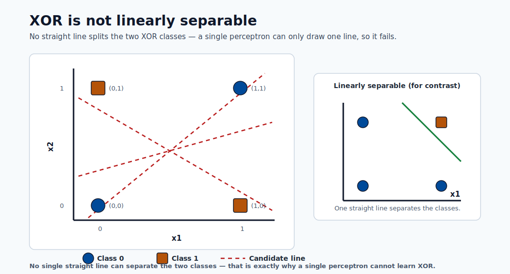

# Neural Networks and Deep Learning

Neural networks are universal function approximators inspired loosely by biological neurons.
Over the past decade they have become the dominant paradigm for images, speech, text, and
increasingly for tabular data at scale. This module builds the entire subject from the
single perceptron — invented in 1957 — all the way to the Transformer architecture that
powers modern foundation models, with full mathematical derivations throughout.

---

## Learning objectives

By the end of this module you will be able to:

1. Derive the perceptron learning rule from first principles and explain its XOR limitation.
2. Define the multi-layer perceptron (MLP) and perform a forward pass with real numbers.
3. Derive backpropagation via the chain rule and write the weight-update equations for every layer.
4. Explain vanishing and exploding gradients and describe at least four mitigation strategies.
5. Describe dropout, batch normalisation, weight initialisation, and learning rate scheduling.
6. Explain the convolution operation and identify the role of each building block in a CNN.
7. Describe the LSTM gating mechanism and explain why it solves the long-range credit assignment problem.
8. Derive the scaled dot-product attention formula and explain multi-head attention.
9. Outline the Transformer encoder and decoder and explain pretraining strategies (BERT, GPT).
10. Configure and launch a PyTorch training job on a GPU cluster using Azure ML SDK v2.

---

## From biology to math: the neuron analogy

A biological neuron receives electrochemical signals through dendrites, accumulates them in
the cell body (soma), and fires an action potential down the axon if the accumulated signal
exceeds a threshold. The signal travels across synaptic junctions to downstream neurons.

The artificial model reduces this to three operations:

1. **Weighted summation** — each incoming value $x_j$ is multiplied by a synaptic weight $w_j$.
2. **Bias shift** — a scalar bias $b$ moves the activation threshold.
3. **Non-linear activation** — a function $\phi$ decides whether/how strongly the neuron fires.

Formally, for a single artificial neuron:

$$z = \sum_{j=1}^{d} w_j x_j + b = \mathbf{w}^\top \mathbf{x} + b$$

$$\hat{y} = \phi(z)$$

The vector $\mathbf{x} \in \mathbb{R}^d$ is the input, $\mathbf{w} \in \mathbb{R}^d$ the weight vector, $b \in \mathbb{R}$ the
bias, and $\phi$ the activation function. Everything in deep learning is built from repeated
application of this pattern.


> **Note - Reading the neuron:** Inputs flow left to right — each is scaled by a weight, summed into Σ, shifted by the bias b to form z, then passed through φ to produce ŷ.

> **Note - Why the analogy is imperfect:** Real neurons communicate via spike timing, not continuous values;
> they have thousands of dendritic compartments; and Hebbian plasticity is far more complex than
> gradient descent. The biological metaphor is motivational, not mechanistic. Focus on the math.

---

## The Perceptron (1957)

Frank Rosenblatt's perceptron (1957) is the earliest trainable artificial neuron.
It uses a step activation function:

$$\hat{y} = \begin{cases} 1 & \text{if } \mathbf{w}^\top \mathbf{x} + b \geq 0 \\ 0 & \text{otherwise} \end{cases}$$

The perceptron can learn any **linearly separable** binary classification problem; i.e., one
where a single hyperplane $\mathbf{w}^\top \mathbf{x} + b = 0$ separates the two classes in input space.

**The XOR limitation.** The logical XOR function is not linearly separable:

| $x_1$ | $x_2$ | XOR |
|-------|-------|-----|
| 0     | 0     | 0   |
| 0     | 1     | 1   |
| 1     | 0     | 1   |
| 1     | 1     | 0   |

No single line in 2-D can separate the two 1-outputs from the two 0-outputs.



> **Note - Why XOR breaks the perceptron:** The two classes sit on opposite diagonals, so any single straight boundary misclassifies at least one point.

This limitation, highlighted by Minsky and Papert in 1969, temporarily stalled neural network
research until multi-layer networks with non-linear activations were studied in the 1980s.

### Perceptron learning rule

Given a training example $(\mathbf{x}, y)$ where $y \in \{0, 1\}$, the weight update is:

$$\mathbf{w} \leftarrow \mathbf{w} + \eta \,(y - \hat{y})\,\mathbf{x}$$
$$b \leftarrow b + \eta\,(y - \hat{y})$$

where $\eta > 0$ is the learning rate. When the prediction is correct ($\hat{y} = y$) the update
is zero. When the prediction is wrong, the weights shift in the direction of $\mathbf{x}$ (for a
false negative) or opposite (for a false positive), by a magnitude proportional to $\eta$.

**Worked example — AND gate with 2 inputs.**

Initialise: $w_1 = 0,\; w_2 = 0,\; b = 0,\; \eta = 1$.

Training data (AND): $(0,0)\to 0$, $(0,1)\to 0$, $(1,0)\to 0$, $(1,1)\to 1$.

*Epoch 1, example $(1,1)\to 1$:*
- $z = 0 \cdot 1 + 0 \cdot 1 + 0 = 0 \Rightarrow \hat{y} = 0$  (wrong, $y=1$)
- $w_1 \leftarrow 0 + 1 \cdot (1-0) \cdot 1 = 1$
- $w_2 \leftarrow 0 + 1 \cdot (1-0) \cdot 1 = 1$
- $b   \leftarrow 0 + 1 \cdot (1-0) = 1$

*Next, example $(0,1)\to 0$:*
- $z = 1 \cdot 0 + 1 \cdot 1 + 1 = 2 \Rightarrow \hat{y} = 1$ (wrong, $y=0$)
- $w_1 \leftarrow 1 + 1\cdot(0-1)\cdot 0 = 1$
- $w_2 \leftarrow 1 + 1\cdot(0-1)\cdot 1 = 0$
- $b   \leftarrow 1 + 1\cdot(0-1) = 0$

This continues until all four examples are classified correctly.
The perceptron convergence theorem guarantees convergence in finite steps for any linearly
separable dataset.

> **Note - Convergence guarantee:** The perceptron convergence theorem states: if the data is linearly separable
> with margin $\gamma > 0$ and all inputs satisfy $\|\mathbf{x}\| \leq R$, then the number of
> mistakes is bounded by $(R/\gamma)^2$. There is no such guarantee for non-separable data.

---

## The Multi-Layer Perceptron (MLP)

### Architecture

An MLP stacks multiple layers of neurons. Denote the number of layers as $L$ (excluding the
input). Standard notation:

- $a^{(0)} = \mathbf{x}$: the raw input (layer 0).
- $a^{(l)} \in \mathbb{R}^{n_l}$: activation vector at layer $l$, where $n_l$ is the width.
- $W^{(l)} \in \mathbb{R}^{n_l \times n_{l-1}}$: weight matrix for layer $l$.
- $b^{(l)} \in \mathbb{R}^{n_l}$: bias vector for layer $l$.
- $z^{(l)} = W^{(l)} a^{(l-1)} + b^{(l)}$: pre-activation (linear combination).
- $a^{(l)} = \phi\!\left(z^{(l)}\right)$: post-activation.

The final layer $a^{(L)}$ is the network output $\hat{\mathbf{y}}$.

**Depth vs width.** A *deep* network has many layers (large $L$); a *wide* network has many
neurons per layer (large $n_l$). Depth allows learning hierarchical feature representations:
early layers learn simple patterns, later layers combine them. Width provides capacity within
a layer. Empirically, depth matters more than width for complex functions such as image
classification, though very wide networks have interesting theoretical properties (neural
tangent kernel regime).

### Activation functions

Without non-linear activation functions, any composition of linear transformations collapses
to a single linear transformation — no matter how many layers you stack:

$$W^{(L)}\!\left(W^{(L-1)}\!\cdots\!\left(W^{(1)}\mathbf{x} + b^{(1)}\right)\!\cdots\right) + b^{(L)} = \tilde{W}\mathbf{x} + \tilde{b}$$

Non-linearity is what grants the Universal Approximation Theorem its force.

| Function | Formula | Range | Notes |
|---|---|---|---|
| Sigmoid | $\sigma(z) = \frac{1}{1+e^{-z}}$ | $(0,1)$ | Saturates; vanishing gradient |
| Tanh | $\tanh(z) = \frac{e^z - e^{-z}}{e^z + e^{-z}}$ | $(-1,1)$ | Zero-centred; still saturates |
| ReLU | $\max(0, z)$ | $[0, \infty)$ | Sparse; fast; dead-neuron risk |
| Leaky ReLU | $\max(\alpha z, z),\;\alpha \ll 1$ | $(-\infty,\infty)$ | Fixes dead neurons |
| GELU | $z \,\Phi(z)$ where $\Phi$ is the Normal CDF | $\approx(-0.17,\infty)$ | Used in BERT, GPT |
| Softmax | $\sigma(\mathbf{z})_k = \frac{e^{z_k}}{\sum_j e^{z_j}}$ | $(0,1)$, sums to 1 | Output layer, multiclass |


> **Note - Shape matters:** Sigmoid and Tanh saturate at the extremes (vanishing gradients), while ReLU and Leaky ReLU stay linear for positive z, keeping gradients alive.

**Why ReLU dominates.** For $z > 0$, $\frac{d}{dz}\text{ReLU}(z) = 1$, so the gradient does not
saturate for positive pre-activations. This makes training deep networks dramatically faster.
The downside is the "dying ReLU" problem: if a neuron's pre-activation is permanently
negative (e.g., due to a large negative bias), its gradient is exactly zero and it stops
learning. Leaky ReLU and Parametric ReLU address this by allowing a small slope for $z < 0$.

**Vanishing gradient with sigmoid.** The sigmoid derivative is $\sigma'(z) = \sigma(z)(1-\sigma(z))$,
with a maximum of $0.25$ at $z=0$ and approaching zero for large $|z|$. During backpropagation
through $L$ layers each multiplying by $\leq 0.25$, gradients shrink by a factor of at most
$(0.25)^L$: for $L = 10$ layers this is $\approx 10^{-6}$.

### Forward pass

The complete forward pass for a network with $L$ layers:

$$z^{(l)} = W^{(l)} a^{(l-1)} + b^{(l)}, \quad l = 1, \ldots, L$$
$$a^{(l)} = \phi\!\left(z^{(l)}\right), \quad l = 1, \ldots, L-1$$
$$\hat{\mathbf{y}} = a^{(L)} = \phi_{\text{out}}\!\left(z^{(L)}\right)$$

where $\phi_{\text{out}}$ is the output activation (softmax for multiclass, sigmoid for binary,
identity for regression).

**Worked 2-layer numeric example.**

Network: 2 inputs → 2 hidden neurons (ReLU) → 1 output (sigmoid).

$$W^{(1)} = \begin{pmatrix} 0.5 & -0.3 \\ 0.1 & 0.8 \end{pmatrix}, \quad b^{(1)} = \begin{pmatrix} 0.1 \\ -0.2 \end{pmatrix}$$
$$W^{(2)} = \begin{pmatrix} 0.6 & -0.4 \end{pmatrix}, \quad b^{(2)} = (0.05)$$

Input: $\mathbf{x} = (1.0,\; 0.5)^\top$, true label $y = 1$.

*Layer 1 pre-activation:*
$$z^{(1)} = \begin{pmatrix} 0.5\cdot1 + (-0.3)\cdot0.5 + 0.1 \\ 0.1\cdot1 + 0.8\cdot0.5 + (-0.2) \end{pmatrix} = \begin{pmatrix} 0.45 \\ 0.30 \end{pmatrix}$$

*Layer 1 activation (ReLU):* $a^{(1)} = (0.45,\; 0.30)^\top$ (both positive, unchanged).

*Layer 2 pre-activation:*
$$z^{(2)} = 0.6\cdot0.45 + (-0.4)\cdot0.30 + 0.05 = 0.27 - 0.12 + 0.05 = 0.20$$

*Output:* $\hat{y} = \sigma(0.20) = \frac{1}{1+e^{-0.20}} \approx 0.550$.

Binary cross-entropy loss: $\mathcal{L} = -\ln(0.550) \approx 0.598$.

---

## Backpropagation: the algorithm that trains networks

Backpropagation (Rumelhart, Hinton, Williams 1986) is simply an efficient application of the
**chain rule of calculus** to compute $\frac{\partial \mathcal{L}}{\partial W^{(l)}}$ and
$\frac{\partial \mathcal{L}}{\partial b^{(l)}}$ for every layer $l$ simultaneously, reusing
intermediate results rather than recomputing them.

### The chain rule revisited

For a scalar loss $\mathcal{L}$ depending on $W^{(l)}$ through the chain
$W^{(l)} \to z^{(l)} \to a^{(l)} \to \cdots \to \mathcal{L}$, the chain rule gives:

$$\frac{\partial \mathcal{L}}{\partial W^{(l)}} = \frac{\partial \mathcal{L}}{\partial z^{(l)}} \cdot \frac{\partial z^{(l)}}{\partial W^{(l)}}$$

Define the **error signal** (delta) at layer $l$:

$$\delta^{(l)} \triangleq \frac{\partial \mathcal{L}}{\partial z^{(l)}} \in \mathbb{R}^{n_l}$$

Since $z^{(l)} = W^{(l)} a^{(l-1)} + b^{(l)}$, we have $\frac{\partial z^{(l)}}{\partial W^{(l)}} = a^{(l-1)}$,
so the weight gradient is the outer product:

$$\frac{\partial \mathcal{L}}{\partial W^{(l)}} = \delta^{(l)} \left(a^{(l-1)}\right)^\top$$

### Backprop derivation step by step

**Output layer delta** (for binary cross-entropy with sigmoid output):

$$\mathcal{L} = -y \ln \hat{y} - (1-y)\ln(1-\hat{y}), \quad \hat{y} = \sigma(z^{(L)})$$

$$\delta^{(L)} = \hat{y} - y$$

This clean result arises because the sigmoid and binary cross-entropy are conjugate pairs.

**Hidden layer delta** (propagating backwards):

$$\delta^{(l)} = \left(W^{(l+1)}\right)^\top \delta^{(l+1)} \odot \phi'\!\left(z^{(l)}\right)$$

where $\odot$ denotes element-wise multiplication and $\phi'(z^{(l)})$ is the element-wise
derivative of the activation function evaluated at the pre-activations of layer $l$.

**Weight and bias gradients:**

$$\frac{\partial \mathcal{L}}{\partial W^{(l)}} = \delta^{(l)} \left(a^{(l-1)}\right)^\top, \qquad \frac{\partial \mathcal{L}}{\partial b^{(l)}} = \delta^{(l)}$$

**Gradient descent update:**

$$W^{(l)} \leftarrow W^{(l)} - \eta \,\frac{\partial \mathcal{L}}{\partial W^{(l)}}, \qquad b^{(l)} \leftarrow b^{(l)} - \eta \,\frac{\partial \mathcal{L}}{\partial b^{(l)}}$$

**Full algorithm pseudocode:**

```
forward pass:
  a[0] = x
  for l = 1 to L:
    z[l] = W[l] @ a[l-1] + b[l]
    a[l] = activation(z[l])   # softmax at output layer

compute loss L = loss_fn(a[L], y)

backward pass:
  delta[L] = a[L] - y          # for cross-entropy + softmax/sigmoid
  for l = L-1 down to 1:
    delta[l] = (W[l+1].T @ delta[l+1]) * activation_derivative(z[l])

update:
  for l = 1 to L:
    W[l] -= lr * outer(delta[l], a[l-1])
    b[l] -= lr * delta[l]
```

> **Note - Automatic differentiation:** Modern frameworks (PyTorch, JAX, TensorFlow) implement
> backprop via automatic differentiation (autograd), which builds a computation graph and applies
> the chain rule symbolically. You never write backprop by hand; understanding the math tells you
> what the framework computes.

### Vanishing and exploding gradients

During backprop through $L$ layers, the delta signals are multiplied by weight matrices and
activation derivatives repeatedly. Two failure modes arise:

**Vanishing gradients** — if activation derivatives are $< 1$ (as with sigmoid/tanh) and
weights are small, the product $\prod_{l} \phi'(z^{(l)})$ shrinks exponentially. Early layers
receive near-zero gradients and essentially stop learning while later layers over-fit.

**Exploding gradients** — if weights are large, products of weight matrices can grow without
bound, leading to NaN losses. Common in RNNs processing long sequences.

Remedies:

- Use ReLU (derivative 1 for positive values) instead of sigmoid/tanh.
- Gradient clipping: if $\|\nabla\| > \tau$ then $\nabla \leftarrow \tau \nabla / \|\nabla\|$.
- Careful weight initialisation (Xavier, He — see below).
- Residual connections (ResNet) that provide gradient highways.
- Batch normalisation that re-scales activations at each layer.

---

## Training deep networks

### Loss functions recap

The loss function $\mathcal{L}(\hat{\mathbf{y}}, \mathbf{y})$ measures prediction quality and provides the
gradient signal for learning. Choosing the right loss is as important as choosing the architecture.

**Binary cross-entropy** (binary classification, sigmoid output):

$$\mathcal{L} = -\frac{1}{N}\sum_{i=1}^{N}\left[y_i \ln \hat{y}_i + (1-y_i)\ln(1-\hat{y}_i)\right]$$

**Categorical cross-entropy** (multiclass, softmax output):

$$\mathcal{L} = -\frac{1}{N}\sum_{i=1}^{N}\sum_{k=1}^{K} y_{ik} \ln \hat{y}_{ik}$$

where $y_{ik} \in \{0,1\}$ is the one-hot label.

**Mean squared error** (regression, linear output):

$$\mathcal{L} = \frac{1}{N}\sum_{i=1}^{N} \left(y_i - \hat{y}_i\right)^2$$

> **Tip - Loss-activation pairing:** Always pair cross-entropy with a softmax/sigmoid output layer,
> and MSE with a linear output layer. Mismatching leads to numerical instability or poor gradients.
> PyTorch's `nn.CrossEntropyLoss` expects raw logits (no softmax) and applies log-softmax internally
> for numerical stability.

### Optimizers

**Stochastic Gradient Descent (SGD):**

$$\theta \leftarrow \theta - \eta \nabla_\theta \mathcal{L}_{\text{batch}}$$

Uses a random mini-batch at each step rather than the full dataset. Mini-batch noise acts
as an implicit regulariser. However, plain SGD is sensitive to the learning rate and converges
slowly in ravines (elongated loss landscapes).

**SGD with momentum:**

$$v \leftarrow \beta v - \eta \nabla_\theta \mathcal{L}$$
$$\theta \leftarrow \theta + v$$

The velocity $v$ accumulates a weighted history of past gradients ($\beta \approx 0.9$).
This accelerates traversal of consistent gradient directions and dampens oscillations.

**RMSProp:**

$$s \leftarrow \rho s + (1-\rho)(\nabla_\theta \mathcal{L})^2$$
$$\theta \leftarrow \theta - \frac{\eta}{\sqrt{s + \epsilon}} \nabla_\theta \mathcal{L}$$

Maintains a per-parameter running mean of squared gradients, effectively giving frequently
updated parameters a smaller effective learning rate. Particularly effective for RNNs.

**Adam (Adaptive Moment Estimation):**

$$m \leftarrow \beta_1 m + (1-\beta_1) \nabla_\theta \mathcal{L}$$
$$v \leftarrow \beta_2 v + (1-\beta_2)(\nabla_\theta \mathcal{L})^2$$
$$\hat{m} = \frac{m}{1-\beta_1^t}, \quad \hat{v} = \frac{v}{1-\beta_2^t}$$
$$\theta \leftarrow \theta - \eta \frac{\hat{m}}{\sqrt{\hat{v}} + \epsilon}$$

$\hat{m}$ and $\hat{v}$ are bias-corrected estimates (important in early training when $m, v$
are near zero). Default hyperparameters: $\beta_1 = 0.9$, $\beta_2 = 0.999$, $\epsilon = 10^{-8}$.
Adam is the default choice for most deep learning tasks.

| Optimizer | Best for | Weakness |
|---|---|---|
| SGD + momentum | CV (often best final accuracy with careful tuning) | Sensitive to LR; slow start |
| RMSProp | RNNs, non-stationary objectives | No momentum by default |
| Adam | General purpose; fast convergence | Can generalise slightly worse than tuned SGD |
| AdamW | Transformers | Weight-decay fix over Adam |

### Batch normalization

Proposed by Ioffe and Szegedy (2015), batch normalisation addresses **internal covariate shift**:
the distribution of each layer's activations changes during training because the parameters
of all prior layers change. This forces later layers to constantly adapt to a shifting input
distribution, slowing learning.

For a mini-batch $\mathcal{B} = \{x_1, \ldots, x_m\}$, the batch norm transformation is:

$$\mu_\mathcal{B} = \frac{1}{m}\sum_{i=1}^m x_i, \qquad \sigma_\mathcal{B}^2 = \frac{1}{m}\sum_{i=1}^m (x_i - \mu_\mathcal{B})^2$$

$$\hat{x}_i = \frac{x_i - \mu_\mathcal{B}}{\sqrt{\sigma_\mathcal{B}^2 + \epsilon}}$$

$$y_i = \gamma \hat{x}_i + \beta$$

The parameters $\gamma$ and $\beta$ are **learned** per-feature scale and shift, allowing the
network to undo the normalisation if it is beneficial. At inference time, running statistics
collected during training replace $\mu_\mathcal{B}$ and $\sigma_\mathcal{B}^2$.

Benefits: allows higher learning rates; reduces sensitivity to initialisation; provides mild
regularisation; often eliminates the need for dropout.

> **Note - Layer norm vs batch norm:** In Transformers and RNNs, batch normalisation is replaced by
> **layer normalisation**, which normalises across the feature dimension rather than the batch
> dimension. This is necessary because sequence lengths vary and batch sizes may be 1 at inference.

### Dropout

Srivastava et al. (2014) proposed randomly zeroing each neuron's output during training with
probability $p$ (a hyperparameter, typically $0.1$–$0.5$). The surviving activations are
scaled by $\frac{1}{1-p}$ (inverted dropout) to keep expected values unchanged.

At **inference** time, dropout is disabled (all neurons active, no scaling needed because
training used inverted dropout).

**Regularisation intuition.** Dropout prevents neurons from co-adapting: no neuron can rely on
any specific other neuron always being present, so each must independently encode useful features.
This is equivalent to training an exponential number of thinned sub-networks and averaging their
predictions at test time — an implicit ensemble.

**Practical tips:**

- Dropout after fully-connected layers ($p = 0.5$) and before the output.
- Lower $p$ for convolutional layers ($0.1$–$0.2$) since spatial sharing already regularises.
- Disable dropout (or use `model.eval()` in PyTorch) when computing validation metrics.

### Weight initialization

All-zero initialisation causes symmetry: every neuron in a layer computes the same output
and receives the same gradient, so they all update identically and never differentiate.
Random initialisation breaks this symmetry.

**Xavier / Glorot initialisation** (for sigmoid/tanh activations):

$$W \sim \mathcal{U}\!\left(-\frac{\sqrt{6}}{\sqrt{n_{\text{in}} + n_{\text{out}}}},\; +\frac{\sqrt{6}}{\sqrt{n_{\text{in}} + n_{\text{out}}}}\right)$$

Derivation: choose the variance $\text{Var}(w) = \frac{2}{n_{\text{in}} + n_{\text{out}}}$ so that
the variance of activations and gradients are equal across layers.

**He (Kaiming) initialisation** (for ReLU activations):

$$W \sim \mathcal{N}\!\left(0,\; \sqrt{\frac{2}{n_{\text{in}}}}\right)$$

ReLU zeros out half the activations on average, so variance needs to be doubled relative to
Xavier. PyTorch `nn.Linear` uses Kaiming uniform by default.

### Learning rate scheduling

The learning rate $\eta$ is the most important hyperparameter. Too large: loss diverges or
oscillates. Too small: training is unnecessarily slow and may get stuck in sharp minima.

**Step decay:** multiply $\eta$ by a factor $\gamma < 1$ every $k$ epochs. Simple but abrupt.

**Cosine annealing:**

$$\eta_t = \eta_{\min} + \frac{1}{2}(\eta_{\max} - \eta_{\min})\left(1 + \cos\frac{\pi t}{T}\right)$$

Smoothly decays from $\eta_{\max}$ to $\eta_{\min}$ over $T$ steps. Often combined with warm
restarts (SGDR) for improved exploration.

**Linear warm-up:** start with a very small $\eta$ and linearly ramp up for the first
$k$ steps (e.g., 1–10 % of total training), then decay. Prevents large early updates from
destabilising a randomly initialised network. Standard practice for Transformers.

> **Tip - One-cycle policy:** The 1-cycle learning rate policy (Smith 2018) combines a warm-up phase
> where LR and momentum are tuned to complement each other, with strong regularisation effects.
> It consistently achieves good results in fewer epochs and is available as
> `torch.optim.lr_scheduler.OneCycleLR`.

---

## Convolutional Neural Networks (CNNs)

### The convolution operation

A 2-D discrete convolution of an input feature map $I$ (height $H$, width $W$) with a kernel
$K$ of size $k_h \times k_w$ produces an output $O$:

$$O[i, j] = \sum_{m=0}^{k_h-1}\sum_{n=0}^{k_w-1} I[i \cdot s + m,\; j \cdot s + n] \cdot K[m, n]$$

where $s$ is the **stride**. For a multi-channel input with $C_{\text{in}}$ channels, each
kernel extends through all channels and multiple kernels (filters) produce multiple output channels.

**Output size formula** for a single spatial dimension:

$$O_{\text{size}} = \left\lfloor \frac{I_{\text{size}} + 2p - k}{s} \right\rfloor + 1$$

where $p$ is zero-padding and $k$ is kernel size.

**Example:** input $32\times32$, kernel $3\times3$, stride 1, padding 1:
$O = \lfloor (32 + 2 - 3)/1 \rfloor + 1 = 32$. Same-padding preserves spatial dimensions.

### CNN architecture building blocks

A standard CNN block consists of:

1. **Convolutional layer** — learns spatial filters; apply to input feature map.
2. **Activation** — typically ReLU, applied element-wise.
3. **Pooling** — reduces spatial dimensions; retains dominant features.
4. **Batch normalisation** — stabilises training (placed after conv, before or after activation).

**Max pooling** takes the maximum value in each pooling window (e.g., $2 \times 2$, stride 2),
halving spatial dimensions. It provides translational invariance within the window.

**Global average pooling (GAP)** averages each feature map to a single scalar, drastically
reducing parameters before the classification head and acting as a strong regulariser.

**Flattening** reshapes the 3-D feature maps (channels × height × width) into a 1-D vector
for input to fully-connected layers.

### Why convolutions work for images

**Parameter sharing.** A single $3\times3$ filter with $C_{\text{in}}$ channels has only
$9 C_{\text{in}}$ parameters, shared across all spatial positions. A fully connected layer
over a $32\times32\times3$ image would need $3072$ weights per output neuron.

**Local connectivity.** Each output neuron depends on a small local patch of the input, matching
the locality of natural image features (edges, textures).

**Translation equivariance.** If the input shifts by $(dx, dy)$, the output feature map shifts
by $(dx/s, dy/s)$. This means the network detects features regardless of their position.

### Classic architectures

**LeNet-5 (LeCun, 1998):** First practical CNN; two conv layers, two pooling layers, three FC
layers. Achieved human-competitive performance on MNIST.

**AlexNet (Krizhevsky, 2012):** Won ImageNet LSVRC 2012 by a large margin. Key innovations:
ReLU activations, dropout, data augmentation, multi-GPU training.

**VGG-16 (Simonyan, 2014):** Demonstrated that depth with small ($3\times3$) kernels outperforms
shallow networks with large kernels. Two stacked $3\times3$ convolutions have the same receptive
field as a $5\times5$ convolution but fewer parameters and an extra non-linearity.

**ResNet (He, 2015):** Introduced the **residual (skip) connection**:

$$a^{(l+2)} = \phi\!\left(W^{(l+2)}\phi\!\left(W^{(l+1)} a^{(l)} + b^{(l+1)}\right) + b^{(l+2)} + a^{(l)}\right)$$

The identity shortcut $+ a^{(l)}$ allows gradients to flow directly through many layers during
backpropagation (the gradient of $\mathcal{L}$ w.r.t. $a^{(l)}$ includes a direct path of 1
from the skip connection). This enabled training networks with 50, 101, and even 152 layers.

---

## Recurrent Neural Networks (RNNs)

Sequences — text, audio, time-series — have variable length and temporal dependencies that
fixed-input-size MLPs cannot handle. RNNs process sequences step by step, maintaining a
**hidden state** $h_t$ that summarises the history up to time $t$.

### Processing sequences

At each time step $t$, the RNN receives input $x_t$ and the previous hidden state $h_{t-1}$:

$$h_t = \phi\!\left(W_h h_{t-1} + W_x x_t + b\right)$$

The same parameters $(W_h, W_x, b)$ are shared across all time steps (**parameter sharing
in time**). Unrolling the recurrence over $T$ steps produces a deep feed-forward network
with weight tying. The output at step $t$ is optionally $\hat{y}_t = W_o h_t + b_o$.

**Backpropagation Through Time (BPTT)** unrolls the RNN and applies standard backprop.
Gradients flow backwards in time, multiplying by $W_h^\top$ at each step.

### The vanishing gradient problem in RNNs

For long sequences ($T$ large), the gradient of the loss at time $T$ w.r.t. the hidden state
at time $t \ll T$ involves the product:

$$\frac{\partial h_T}{\partial h_t} = \prod_{k=t}^{T-1} \frac{\partial h_{k+1}}{\partial h_k} = \prod_{k=t}^{T-1} W_h \cdot \text{diag}\!\left(\phi'(z_k)\right)$$

If the spectral norm of $W_h$ is less than 1 and $\phi'$ saturates, this product vanishes
exponentially fast in $(T - t)$. The RNN cannot learn dependencies spanning many time steps.

### LSTM and GRU

**Long Short-Term Memory (LSTM)** (Hochreiter & Schmidhuber 1997) introduces a separate
**cell state** $c_t$ (a "memory tape") alongside the hidden state $h_t$, controlled by
three multiplicative gates:

**Forget gate** — decides what to erase from cell state:
$$f_t = \sigma\!\left(W_f [h_{t-1}, x_t] + b_f\right)$$

**Input gate** — decides what new information to write:
$$i_t = \sigma\!\left(W_i [h_{t-1}, x_t] + b_i\right), \qquad \tilde{c}_t = \tanh\!\left(W_c [h_{t-1}, x_t] + b_c\right)$$

**Cell state update:**
$$c_t = f_t \odot c_{t-1} + i_t \odot \tilde{c}_t$$

**Output gate:**
$$o_t = \sigma\!\left(W_o [h_{t-1}, x_t] + b_o\right), \qquad h_t = o_t \odot \tanh(c_t)$$

The cell state $c_t$ flows with only element-wise operations (no matrix multiply), so gradients
can flow back through time with far less attenuation — the so-called **constant error carousel**.

**Gated Recurrent Unit (GRU)** (Cho et al. 2014) simplifies the LSTM by merging the forget and
input gates into a single **update gate** $z_t$, and eliminating the separate cell state:

$$r_t = \sigma\!\left(W_r [h_{t-1}, x_t]\right) \quad \text{(reset gate)}$$
$$z_t = \sigma\!\left(W_z [h_{t-1}, x_t]\right) \quad \text{(update gate)}$$
$$\tilde{h}_t = \tanh\!\left(W [r_t \odot h_{t-1}, x_t]\right)$$
$$h_t = (1 - z_t) \odot h_{t-1} + z_t \odot \tilde{h}_t$$

GRU has fewer parameters and often performs comparably to LSTM. Both are largely superseded
by Transformers for most NLP tasks, but remain relevant for streaming time-series applications.

---

## The Transformer Architecture

The Transformer (Vaswani et al., "Attention Is All You Need", 2017) replaces recurrence with
**self-attention**, enabling full parallelisation over sequences and capturing long-range
dependencies in a single operation. It underpins virtually every modern large language model.

### Attention mechanism

Given a query matrix $Q \in \mathbb{R}^{T \times d_k}$, key matrix $K \in \mathbb{R}^{T \times d_k}$,
and value matrix $V \in \mathbb{R}^{T \times d_v}$:

$$\text{Attention}(Q, K, V) = \text{softmax}\!\left(\frac{QK^\top}{\sqrt{d_k}}\right)V$$

**Intuition.** For each query (a representation of one token), the dot product $QK^\top$ measures
compatibility with all keys (representations of all tokens in the sequence). After softmax, these
scores become a probability distribution — the **attention weights** — over the values.
The output for each position is a weighted combination of all value vectors, allowing every
token to directly "attend to" every other token.

**Why divide by $\sqrt{d_k}$?** For large $d_k$, the dot products $q \cdot k$ grow in variance
($\approx d_k$ if $q, k$ are unit-normal). Large magnitude inputs push softmax into its saturation
region where gradients vanish. Dividing by $\sqrt{d_k}$ normalises the variance to 1.

**Computational complexity:** $O(T^2 d)$ per layer, which is quadratic in sequence length.
For very long sequences ($T \gg 1024$), this becomes a bottleneck, motivating efficient
attention variants (Longformer, Flash Attention, etc.).

### Multi-head attention

Rather than performing a single attention function, multi-head attention runs $h$ attention
heads in parallel, each with its own projection matrices:

$$\text{head}_i = \text{Attention}\!\left(Q W_i^Q,\; K W_i^K,\; V W_i^V\right)$$

$$\text{MultiHead}(Q, K, V) = \text{Concat}(\text{head}_1, \ldots, \text{head}_h)\,W^O$$

where $W_i^Q \in \mathbb{R}^{d_{\text{model}} \times d_k}$, $W_i^K \in \mathbb{R}^{d_{\text{model}} \times d_k}$,
$W_i^V \in \mathbb{R}^{d_{\text{model}} \times d_v}$, and $W^O \in \mathbb{R}^{hd_v \times d_{\text{model}}}$.

Different heads learn to attend to different relationship types simultaneously:
syntactic dependencies, coreference, semantic proximity, etc.
With $d_{\text{model}} = 512$ and $h = 8$, each head operates in $d_k = d_v = 64$ dimensions.

### Positional encoding

Self-attention is **permutation equivariant**: shuffling the input tokens produces a shuffled
output. Sequences have order; attention has none. Positional encodings inject position
information by adding a vector $\text{PE}(t) \in \mathbb{R}^{d_{\text{model}}}$ to each token embedding:

$$\text{PE}(t, 2i) = \sin\!\left(\frac{t}{10000^{2i/d_{\text{model}}}}\right)$$
$$\text{PE}(t, 2i+1) = \cos\!\left(\frac{t}{10000^{2i/d_{\text{model}}}}\right)$$

Different frequencies in different dimensions allow the model to attend to relative positions
via dot products of positional encodings. Modern architectures often use **learned positional
embeddings** or **rotary positional embeddings (RoPE)** instead.

### The full Transformer block

A single Transformer **encoder** layer consists of:

1. **Multi-head self-attention** over the sequence.
2. **Add & norm** — residual connection + layer normalisation: $\text{LN}(x + \text{MHA}(x))$.
3. **Position-wise feed-forward network (FFN):** $\text{FFN}(x) = \max(0, xW_1 + b_1)W_2 + b_2$, applied independently to each position with hidden dimension $4d_{\text{model}}$.
4. **Add & norm** again: $\text{LN}(x + \text{FFN}(x))$.

The **decoder** additionally has:

- **Masked self-attention** — future positions are masked ($-\infty$ before softmax) for
  autoregressive generation; a token cannot attend to tokens not yet generated.
- **Cross-attention** — queries come from the decoder, keys and values from the encoder output,
  enabling the decoder to attend over the full source sequence.

**Autoregressive generation.** At each step, the decoder appends the most probable next token
(or samples) to the sequence and runs a forward pass to generate the subsequent token until an
end-of-sequence token is produced or a maximum length is reached.

### Foundation models and pretraining

Training a Transformer from scratch on task-specific data is expensive and data-hungry.
**Self-supervised pretraining** on massive text corpora allows learning general language
representations that transfer to many downstream tasks.

**BERT (Bidirectional Encoder Representations from Transformers, Devlin et al. 2018):**
Uses only the Transformer encoder. Pretraining objectives:
- *Masked Language Modelling (MLM)*: randomly mask 15 % of tokens; predict the masked tokens.
- *Next Sentence Prediction (NSP)*: predict whether sentence B follows sentence A.

BERT representations are contextual and bidirectional.
Fine-tune by adding a task-specific head (linear classifier for sentiment, span extractor for QA).

**GPT (Generative Pre-trained Transformer, Radford et al. 2018):**
Uses only the Transformer decoder. Pretraining: causal language modelling — predict the next
token given all prior tokens. Naturally suited to text generation. GPT-3 (175B parameters)
demonstrated remarkable **few-shot** and **zero-shot** generalisation: the model can perform
tasks described in the prompt without any gradient updates.

**Scaling laws (Hoffmann et al. 2022 — Chinchilla):** For a fixed compute budget $C$, optimal
performance is achieved by training a model of size $N$ on $D \approx 20N$ tokens, where
$\mathcal{L} \propto N^{-\alpha} + D^{-\beta} + \text{const}$. Scaling both model size and data
jointly is critical; prior models (GPT-3) were significantly under-trained relative to their size.

> **Note - Emergent abilities:** Certain capabilities (chain-of-thought reasoning, multi-step arithmetic)
> appear abruptly at specific model scales rather than improving smoothly. This non-linearity is
> called emergence and is a subject of active research.

---

## Neural Networks in Azure ML

### When to use deep learning vs gradient boosting

Deep learning does not always win. Choosing the right paradigm depends on several factors:

| Factor | Favour gradient boosting (XGBoost, LightGBM) | Favour neural networks |
|---|---|---|
| Data modality | Tabular, structured | Image, text, audio, video |
| Dataset size | Small-medium ($< 100\text{k}$) | Large ($> 100\text{k}$, better with millions) |
| Feature engineering | Rich domain features available | Raw/unstructured inputs |
| Training time budget | Minutes | Hours-days (GPU required) |
| Interpretability | SHAP values straightforward | Harder; requires extra tools |
| Transfer learning | Not applicable | Powerful; large pretrained models exist |

For tabular competitions (Kaggle), gradient boosting wins the majority of benchmarks.
For vision, NLP, and audio, neural networks are the default.

### Training at scale in Azure ML

**GPU clusters.** Create a compute cluster with GPU VMs (NC/ND series) via the Azure ML SDK:

```python
from azure.ai.ml.entities import AmlCompute

compute = AmlCompute(
    name="gpu-cluster",
    type="amlcompute",
    size="Standard_NC6s_v3",   # 1x V100 16 GB
    min_instances=0,
    max_instances=4,
    idle_time_before_scale_down=120,
)
ml_client.begin_create_or_update(compute).result()
```

**Distributed training.** For models or datasets that do not fit on a single GPU:

- **Data parallel:** each GPU holds the full model and processes a shard of the mini-batch;
  gradients are averaged across GPUs via `AllReduce` (NCCL backend). Implemented with
  PyTorch `DistributedDataParallel` (DDP).
- **Model parallel:** layers are split across GPUs. Necessary when the model itself exceeds
  VRAM (e.g., GPT-3 class models).
- **Pipeline parallel:** micro-batches flow through a pipeline of model stages.

**Mixed precision training (fp16/bf16).** Using 16-bit floats for activations and gradients
approximately halves memory and doubles throughput on Tensor Core GPUs.
Loss scaling prevents underflow of small gradients. PyTorch: `torch.cuda.amp.autocast()`.

### Code example: MLP in Azure ML training job

```python
# train.py  (uploaded to the job's source_directory)
import argparse
import torch
import torch.nn as nn
from torch.utils.data import DataLoader, TensorDataset
import mlflow

def build_model(input_dim, hidden_dim, output_dim, dropout_p):
    return nn.Sequential(
        nn.Linear(input_dim, hidden_dim),
        nn.BatchNorm1d(hidden_dim),
        nn.ReLU(),
        nn.Dropout(dropout_p),
        nn.Linear(hidden_dim, hidden_dim),
        nn.BatchNorm1d(hidden_dim),
        nn.ReLU(),
        nn.Dropout(dropout_p),
        nn.Linear(hidden_dim, output_dim),
    )

def train(args):
    # --- data (replace with real data loading) ---
    X = torch.randn(1000, args.input_dim)
    y = (X[:, 0] + X[:, 1] > 0).long()
    loader = DataLoader(TensorDataset(X, y), batch_size=args.batch_size, shuffle=True)

    device = torch.device("cuda" if torch.cuda.is_available() else "cpu")
    model = build_model(args.input_dim, args.hidden_dim, 2, args.dropout).to(device)
    optimizer = torch.optim.AdamW(model.parameters(), lr=args.lr, weight_decay=1e-4)
    scheduler = torch.optim.lr_scheduler.OneCycleLR(
        optimizer, max_lr=args.lr, steps_per_epoch=len(loader), epochs=args.epochs
    )
    criterion = nn.CrossEntropyLoss()

    mlflow.autolog()
    model.train()
    for epoch in range(args.epochs):
        total_loss = 0.0
        for xb, yb in loader:
            xb, yb = xb.to(device), yb.to(device)
            optimizer.zero_grad()
            loss = criterion(model(xb), yb)
            loss.backward()
            torch.nn.utils.clip_grad_norm_(model.parameters(), max_norm=1.0)
            optimizer.step()
            scheduler.step()
            total_loss += loss.item()
        avg = total_loss / len(loader)
        mlflow.log_metric("train_loss", avg, step=epoch)
        print(f"Epoch {epoch+1}/{args.epochs}  loss={avg:.4f}")

    torch.save(model.state_dict(), "outputs/model.pt")

if __name__ == "__main__":
    parser = argparse.ArgumentParser()
    parser.add_argument("--input_dim",  type=int,   default=20)
    parser.add_argument("--hidden_dim", type=int,   default=128)
    parser.add_argument("--epochs",     type=int,   default=20)
    parser.add_argument("--batch_size", type=int,   default=64)
    parser.add_argument("--lr",         type=float, default=1e-3)
    parser.add_argument("--dropout",    type=float, default=0.3)
    train(parser.parse_args())
```

```python
# submit_job.py  (run locally / in a notebook)
from azure.ai.ml import MLClient, command, Input
from azure.ai.ml.entities import Environment
from azure.identity import DefaultAzureCredential

ml_client = MLClient(
    DefaultAzureCredential(),
    subscription_id="<sub>",
    resource_group_name="<rg>",
    workspace_name="<ws>",
)

env = Environment(
    image="mcr.microsoft.com/azureml/curated/acft-hf-nlp-gpu:latest",
    conda_file="conda.yml",  # torch, mlflow, azure-ai-ml
)

job = command(
    code="./src",
    command=(
        "python train.py "
        "--input_dim ${{inputs.input_dim}} "
        "--hidden_dim ${{inputs.hidden_dim}} "
        "--epochs ${{inputs.epochs}}"
    ),
    inputs={
        "input_dim":  Input(type="integer", default=20),
        "hidden_dim": Input(type="integer", default=128),
        "epochs":     Input(type="integer", default=20),
    },
    environment=env,
    compute="gpu-cluster",
    display_name="mlp-training-demo",
    experiment_name="neural-networks-module",
)

returned_job = ml_client.jobs.create_or_update(job)
ml_client.jobs.stream(returned_job.name)
```

> **Tip - MLflow autolog:** `mlflow.autolog()` automatically logs loss curves, hyperparameters,
> and the model artifact to the Azure ML experiment. View the run in the Azure ML Studio UI under
> **Experiments** without writing any extra logging code.

### Transfer learning workflow

Transfer learning reuses representations learned by a large model trained on a large dataset
and adapts them to a new, smaller dataset or domain.

**Standard workflow:**

1. Load a pretrained backbone (e.g., ResNet-50 from `torchvision.models`, or a HuggingFace BERT).
2. **Freeze** the backbone weights initially by setting `param.requires_grad = False`.
3. Replace the final classification head with a new head matching your task's number of classes.
4. Train only the new head for a few epochs to avoid corrupting pretrained features.
5. **Unfreeze** the last few layers (or all layers) and fine-tune end-to-end with a small learning
   rate ($\eta \approx 10^{-5}$) to adapt features to the new domain.

```python
import torchvision.models as models
import torch.nn as nn

# Step 1: load pretrained ResNet-50
backbone = models.resnet50(weights=models.ResNet50_Weights.IMAGENET1K_V2)

# Step 2: freeze all layers
for param in backbone.parameters():
    param.requires_grad = False

# Step 3: replace the head (original: 1000 ImageNet classes)
num_classes = 10
backbone.fc = nn.Linear(backbone.fc.in_features, num_classes)

# Step 4: train only the head (backbone.fc.parameters() are trainable)
optimizer = torch.optim.Adam(backbone.fc.parameters(), lr=1e-3)

# Step 5 (after a few epochs): unfreeze and fine-tune
for param in backbone.layer4.parameters():
    param.requires_grad = True
optimizer = torch.optim.Adam(
    filter(lambda p: p.requires_grad, backbone.parameters()), lr=1e-5
)
```

**Azure ML + HuggingFace:** The Azure ML curated environments include HuggingFace Transformers.
Use `AutoModelForSequenceClassification.from_pretrained("bert-base-uncased")` and run the
training loop as a standard Azure ML command job, or use the built-in HuggingFace fine-tuning
pipelines.

---

## Deep dive: every concept, explained

### Universal approximation theorem

The Universal Approximation Theorem (Cybenko 1989, Hornik 1991) states that a feed-forward
network with at least one hidden layer containing sufficiently many neurons and a non-polynomial
activation function can approximate any continuous function $f : \mathbb{R}^d \to \mathbb{R}$ on
a compact domain to arbitrary precision. Formally: for any $\epsilon > 0$ there exists a network
$\hat{f}$ such that $\sup_x |f(x) - \hat{f}(x)| < \epsilon$.

**What the theorem does NOT say:**
- It does not specify how many neurons are needed (could be exponential in $d$).
- It does not say gradient descent finds the approximating network.
- It does not say a finite dataset is sufficient to identify the weights.

The theorem justifies using neural networks as function approximators but says nothing about
the practical challenges of training.

### Why depth beats width for certain functions

A deep network with $k$ layers of width $n$ can represent functions that would require a
single-layer network of width exponential in $k$ to match (Montufar et al. 2014). The intuition
is that depth enables **function composition**: each layer folds the input space, and deeper
networks create exponentially more linear regions (pieces) in the piecewise-linear function
defined by ReLU networks. For hierarchically structured data (images, language), depth matches
the natural hierarchical structure of the data — features of features of features.

### Backprop as automatic differentiation

Backpropagation is a specific algorithm for automatic differentiation (AD) in **reverse mode**.
Reverse mode AD computes $\frac{\partial \mathcal{L}}{\partial \theta}$ for all parameters
$\theta$ simultaneously in one backward pass, at roughly the same cost as the forward pass.
This is optimal when the number of outputs ($= 1$ for a scalar loss) is much smaller than
the number of inputs (millions of parameters). Forward mode AD is efficient for the opposite
case (many outputs, few inputs). PyTorch's `autograd` engine builds a dynamic computation
graph at runtime and applies reverse mode AD.

### Double descent phenomenon

Classical statistics: more parameters than data leads to overfitting and high test error —
bias-variance tradeoff. Modern deep learning contradicts this: as model capacity increases
beyond the interpolation threshold (where training error reaches zero), test error
**decreases again** rather than continuing to rise. This is the **double descent** curve
(Belkin et al. 2019). Explanations involve implicit regularisation by gradient descent
(which biases solutions towards low-norm, smooth functions) and the geometry of
overparameterised loss landscapes (many flat directions, few sharp minima).

### Neural tangent kernel (NTK)

In the limit of infinite width, a neural network trained with gradient descent converges to a
kernel regression solution with a fixed kernel called the Neural Tangent Kernel (NTK)
(Jacot et al. 2018). In this regime, the network's weights barely move from initialisation
(the "lazy training" regime), and the function class is essentially that of a kernel machine.
At finite width, features evolve during training ("feature learning" regime), enabling the
network to adapt its representations — which is where the practical power of neural networks
lies. The NTK framework provides a mathematical handle on infinitely wide networks and helps
explain generalisation, but practical networks operate in the feature learning regime.

---

## Quick self-check

Test your understanding with the following questions. Each has a definite, derivable answer.

| # | Question | Answer |
|---|----------|--------|
| 1 | Perceptron limit: why can a single perceptron not learn XOR but a 2-layer MLP can, and what is the minimum architecture? | XOR is not linearly separable, so a single perceptron's one straight boundary always misclassifies a point; a 2-layer MLP composes boundaries to carve a non-linear region. Minimum architecture: 2 inputs, 2 hidden neurons, 1 output (2-2-1). |
| 2 | Forward pass: write the complete forward-pass equations for a 3-layer MLP with ReLU hidden layers and softmax output. | $\mathbf{h}^{(1)}=\text{ReLU}(W^{(1)}\mathbf{x}+\mathbf{b}^{(1)})$, then $\mathbf{h}^{(2)}=\text{ReLU}(W^{(2)}\mathbf{h}^{(1)}+\mathbf{b}^{(2)})$, then $\hat{\mathbf{y}}=\text{softmax}(W^{(3)}\mathbf{h}^{(2)}+\mathbf{b}^{(3)})$. |
| 3 | Backprop: derive the output-layer error $\delta^{(L)}$ for softmax combined with categorical cross-entropy. | The softmax Jacobian and the cross-entropy derivative cancel, leaving $\delta^{(L)}=\hat{\mathbf{y}}-\mathbf{y}$ (predicted minus true probabilities). |
| 4 | Vanishing gradients: estimate the gradient magnitude reaching layer 1 of a 20-layer sigmoid network (derivative $\le 0.25$). | About $0.25^{20}\approx 9\times10^{-13}$, i.e. order $10^{-12}$ — effectively vanished, so layer 1 barely learns. |
| 5 | Batch normalisation: why does it allow a higher learning rate, and what changes if the batch size is 1? | It normalises layer inputs, reducing internal covariate shift and smoothing the loss surface so larger steps stay stable. With batch size 1 the batch statistics are undefined, so BatchNorm breaks — use LayerNorm/GroupNorm instead. |
| 6 | Attention: compute the output for one head with $Q = K = V = I_3$ and $d_k = 3$. | Scores are $QK^\top/\sqrt{d_k}=I_3/\sqrt{3}$; the softmax of each row $[0.577,0,0]$ gives $\approx[0.47,0.26,0.26]$. Since $V=I_3$, the output equals this weight matrix — a near-uniform average that only mildly favours the matching position. |
| 7 | Transfer learning: what strategy for 2,000 medical images with an ImageNet-pretrained ResNet-50? | Replace the final classification head, freeze the early generic conv layers, train the new head first, then fine-tune the last block(s) with a low learning rate while using heavy augmentation. Reusing pretrained features avoids overfitting on the small dataset. |

---

> **Note - Further reading:** Neural Networks and Deep Learning — Michael Nielsen (online, free).
> Deep Learning — Goodfellow, Bengio, Courville (MIT Press). The original Transformer paper:
> Vaswani et al. 2017. ResNet: He et al. 2015. Adam: Kingma & Ba 2014. Batch Norm: Ioffe & Szegedy 2015.
