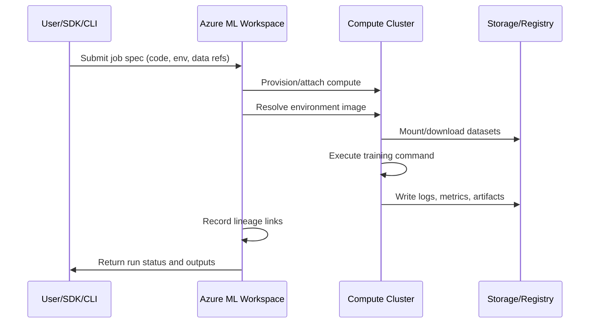
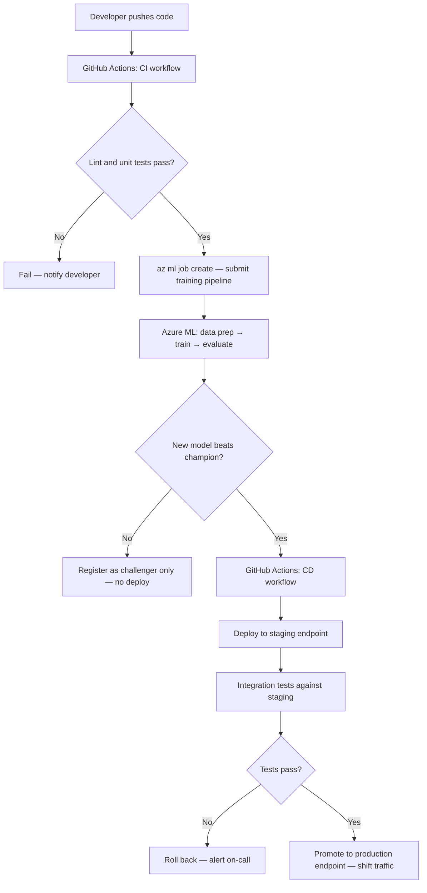
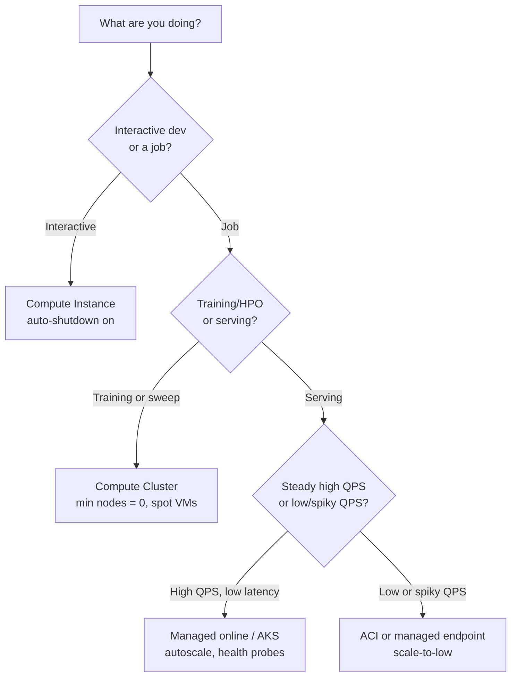

# Azure ML Environment

This module explains Azure ML platform building blocks and how to choose compute and
serving options based on scale, latency, and cost.

## Main workspace assets

- Workspace
- Compute Instance
- Compute Cluster
- Data assets
- Model registry
- Endpoints

## Control plane vs data plane

| Plane | Responsibility |
|---|---|
| Control plane | Asset metadata, run history, permissions, governance |
| Data plane | Actual compute execution, model inference, data movement |

## Workspace Taxonomy


> **Note - What this shows:** The Azure ML workspace taxonomy : how the workspace contains compute, data assets, models, and
> endpoints under one governance boundary. Use it to see which asset type owns each artifact you
> will create in later modules.


> **Note - What this shows:** How a versioned *environment* (base image + pinned dependencies) is reused across both training
> and inference. Sharing one environment is what prevents training/serving skew : the same code
> behaving differently in production than in training.

Key concepts:

- Experiment: a tracked training run.
- Registered model: trained artifact stored with version and lineage.
- Endpoint: deployment surface for scoring requests.

Additional key terms:

- Environment: pinned runtime dependencies and base image.
- Datastore: registered storage connection.
- Dataset/Data asset: versioned data reference used by jobs.


> **Note - What this shows:** The anatomy of an Azure ML endpoint: the deployment surface that receives scoring requests,
> applies authentication, and routes traffic to one or more model versions. This is the object
> consumers actually call.

## Compute guidance

- Compute Instance for development
- Compute Cluster for scalable training
- ACI or AKS for serving

Practical split:

- AML Compute Cluster: training, sweeps, AutoML parallel iterations.
- AKS Inference Cluster: production-grade deployment and autoscaling.

## Compute decision matrix

| Need | Recommended option |
|---|---|
| Notebook exploration and debugging | Compute Instance |
| Parallelized training and HPO | Compute Cluster |
| Quick endpoint prototype | ACI |
| Production, autoscale, high availability | AKS |

## Security and governance baseline

- Use managed identities for data access.
- Restrict network paths with private endpoints where possible.
- Use least-privilege RBAC.
- Keep lineage from data to model to endpoint for auditability.

## Backend execution flow (what happens after submit)



## Asset lineage map

| Asset | Versioned | Produced by | Consumed by |
|---|---|---|---|
| Data asset | Yes | Data registration job | Training/inference jobs |
| Environment | Yes | Environment build/pin | Training and deployment |
| Model | Yes | Training run output | Online/Batch endpoints |
| Endpoint deployment | Yes (revisioned) | Deploy pipeline | Consumers (apps/APIs) |

## Enterprise considerations

- Multi-workspace strategy: separate `dev`, `test`, `prod` with promotion gates.
- Registry strategy: central model registry for cross-workspace sharing.
- Access model: human access via RBAC groups; workload access via managed identity.
- Compliance trail: preserve run IDs, model versions, dataset versions, and deployment revisions.

## Azure ML RBAC roles reference

| Role | Typical assignee | Permissions |
|---|---|---|
| Owner | Platform team leads | Full control including role assignments |
| Contributor | ML engineers | Create/manage all assets, no role changes |
| AzureML Data Scientist | Data scientists | Run experiments, register models, deploy |
| AzureML Compute Operator | Ops team | Start/stop compute, view runs |
| Reader | Stakeholders | View assets and run history only |

## Deep dive: every concept, explained

This section explains *why* each Azure ML building block exists and what problem it solves,
not just what it is called.

### The workspace as the unit of governance

A **workspace** is the top-level container that ties together compute, data, models, and
endpoints under one identity and access boundary. It exists so that everything about a project
: who can touch it, which runs produced which model, which data version trained it : is
recorded in one auditable place. Behind the scenes a workspace provisions associated Azure
resources: a **storage account** (artifacts, datasets), **Key Vault** (secrets), **Container
Registry** (environment images), and **Application Insights** (telemetry). Understanding this
mapping explains most permissions and networking issues you will hit later.

### Control plane vs data plane : why the split matters

- The **control plane** handles *metadata and intent*: "register this dataset", "start this
  job", "who is allowed to deploy". It is lightweight, always-on, and is where governance,
  lineage, and RBAC live.
- The **data plane** handles *actual work*: spinning up VMs, moving gigabytes, running training
  loops, serving inference. It is where cost and performance are determined.

This separation is why you can submit a job (control plane) and have it queue until compute
(data plane) is available, and why permission to *see* an asset is distinct from permission to
*run* expensive compute with it.

### Compute Instance vs Compute Cluster vs inference cluster

| Compute | Lifecycle | Why it exists |
|---|---|---|
| Compute Instance | Single, always-on dev VM | Interactive notebooks, debugging, attached to one user identity |
| Compute Cluster | Auto-scales 0→N nodes per job, then back to 0 | Parallel training, hyperparameter sweeps, AutoML trials; you pay only while jobs run |
| AKS / managed inference | Long-lived, autoscaling pods | Low-latency, high-availability serving with health probes |

The key economic idea: **training compute should scale to zero when idle** (bursty, batch),
while **serving compute stays warm** (steady, latency-sensitive). Choosing the wrong one is a
top cause of surprise cloud bills.

### Assets, versioning, and lineage

Every first-class asset (data, environment, model, endpoint deployment) is **versioned**. This
is not bureaucracy : it is what makes an ML system *reproducible* and *auditable*:

- **Data asset** : a versioned pointer to data in a datastore, so a run records *exactly* which
  snapshot it trained on.
- **Environment** : a pinned runtime (base image + dependency versions). Reusing the same
  environment for training and inference prevents the "works in training, breaks in production"
  class of bugs.
- **Model** : the trained artifact plus metadata linking it back to the run, data, and
  environment that produced it (its **lineage**).
- **Endpoint deployment** : a revisioned serving configuration, so traffic can be split or
  rolled back between versions.

Lineage is the chain `data v → run → model v → endpoint revision`. When a production prediction
is questioned (audit, incident, fairness review), lineage lets you reconstruct precisely how it
was produced.

### Identity and access concepts

- **Managed identity** : an Azure-managed credential attached to a workload (not a person) so
  jobs can read data or registries *without embedded secrets*. This is the secure default.
- **RBAC (role-based access control)** : permissions granted to identities via roles. The
  **least-privilege** principle means giving each identity the minimum role needed (e.g.
  Contributor for engineers, not Owner), limiting blast radius if credentials are compromised.
- **Private endpoint** : routes traffic to the workspace over a private network path instead of
  the public internet, reducing exposure for regulated workloads.

### The submit-to-result flow, demystified

When you submit a job, the control plane validates the spec, provisions or attaches data-plane
compute, resolves the environment image (pulling or building the container), mounts the
referenced data version, runs your command, streams logs/metrics/artifacts back to storage, and
records lineage. Knowing this sequence is what lets you debug a stuck run: each arrow in the
sequence diagram above is a place a job can fail (quota, image build, data mount, code error).

---

## MLOps maturity model

MLOps (Machine Learning Operations) is the discipline of applying DevOps principles to machine
learning workflows. Microsoft defines a four-level maturity model that describes how
organizations evolve from ad-hoc experimentation toward fully automated, self-healing ML
systems. Understanding where your team sits today, and what the next level requires, is the
starting point for any platform investment decision.

### The four levels

| Level | Name | Training | Deployment | Monitoring | Retraining |
|---|---|---|---|---|---|
| 0 | Manual | Scripts run on a laptop | Manual copy of model artifact | None | Ad hoc, on request |
| 1 | Automated training pipeline | ML pipeline on compute cluster | Semi-manual or scripted | Basic metrics | Manual trigger |
| 2 | Full CI/CD ML | Pipeline triggered by code commit | Model deployed via release pipeline | Drift detection alerts | Threshold-triggered |
| 3 | Automated retraining | Triggered by data drift or schedule | Blue/green, canary, automated rollback | Full observability stack | Fully autonomous |

### Level 0 — Manual

At Level 0 a data scientist runs Python scripts locally, stores the model as a pickle file, and
emails it to an engineer who deploys it by hand. There is no versioning, no lineage, and no
rollback path. The model is effectively a black box attached to tribal knowledge.

**Azure ML components that lift you out of Level 0:**
- Registering your workspace forces all assets (data, model, endpoint) into a governed store.
- Using `mlflow.log_metric` and `mlflow.log_artifact` inside your script turns a local run into
  a tracked experiment without changing the training logic.

### Level 1 — Automated training pipeline

At Level 1 training is a repeatable, parameterised pipeline. Any engineer can re-run the
pipeline from the same data and get the same model. Deployment still requires human action.

**Azure ML components that enable Level 1:**
- **Compute Cluster** with `min_instances=0` so the pipeline runs on-demand and shuts down.
- **Azure ML Pipelines** (component DAGs) to wire data preparation → training → evaluation →
  model registration as discrete, rerunnable steps.
- **Registered environments** so every step uses an immutable runtime image.
- **Data assets** with version pinning so the pipeline records exactly which data version it
  trained on.

### Level 2 — Full CI/CD ML

At Level 2 a code commit or data-drift event triggers the entire train-evaluate-deploy pipeline
via a CI/CD orchestrator. A gate (automated test or approval) prevents bad models from
reaching production.

**Azure ML components that enable Level 2:**
- **GitHub Actions / Azure DevOps** integrated with `azure/aml-run` or CLI v2 `az ml job create`
  actions.
- **Model evaluation step** in the pipeline that compares new model metrics against the current
  champion; the deploy step only proceeds if the challenger wins.
- **Managed online endpoints** with blue/green traffic splitting so deployment is zero-downtime.

### Level 3 — Automated retraining

At Level 3 the system monitors its own predictions, detects drift, and automatically kicks off
a retraining pipeline without human involvement. Models are continuously current.

**Azure ML components that enable Level 3:**
- **Data drift monitor** on the online endpoint that emits an alert or directly triggers a
  pipeline via Event Grid.
- **Schedule-based pipeline triggers** as a simpler baseline for periodic retraining.
- **Model promotion registry** across `dev/test/prod` workspaces with automated promotion gates.

> **Note - Maturity is not a race:** Most production ML teams operate effectively at Level 2.
> Level 3 automation is appropriate when retraining latency is a business-critical KPI (e.g.
> fraud models where data distribution shifts daily). Choose the level that matches your
> business cadence, not the one that sounds most impressive.

---

## Azure ML pipelines as first-class assets

### The component concept

A **component** in Azure ML is a self-contained, reusable unit of computation. It is analogous
to a function: it declares typed inputs, typed outputs, and a command to execute. Components are
defined in YAML and versioned in the workspace registry, so they can be shared across projects
and reused without copy-pasting code.

The key benefit is **composability**: a pipeline is just a DAG (directed acyclic graph) of
component invocations wired together by connecting outputs of one component to inputs of the
next. Azure ML handles scheduling, data movement, and lineage recording for you.

### YAML component definition example

```yaml
# components/prep_data/component.yml
$schema: https://azuremlschemas.azureedge.net/latest/commandComponent.schema.json
name: prep_data
display_name: Prepare Training Data
version: "1"
type: command

inputs:
  raw_data:
    type: uri_folder
    description: Raw CSV files from the data lake
  validation_split:
    type: number
    default: 0.2

outputs:
  train_data:
    type: uri_folder
  val_data:
    type: uri_folder

code: ./src
environment: azureml:fraud-train@latest

command: >-
  python prep.py
  --raw_data ${{inputs.raw_data}}
  --validation_split ${{inputs.validation_split}}
  --train_data ${{outputs.train_data}}
  --val_data ${{outputs.val_data}}
```

> **Note - Input/output types:** `uri_folder` is a path to a directory (blob container path or
> local path); `uri_file` is a single file. Azure ML resolves these references and mounts or
> downloads the data before your script runs. Use `mlflow_model` as an output type when the
> step produces a registered model artifact.

### Pipeline composition in YAML

```yaml
# pipelines/fraud_pipeline.yml
$schema: https://azuremlschemas.azureedge.net/latest/pipelineJob.schema.json
type: pipeline
display_name: Fraud Detection Training Pipeline
experiment_name: fraud-detection

inputs:
  raw_data:
    type: uri_folder
    path: azureml:fraud-raw-data@latest

jobs:
  prep_step:
    type: command
    component: azureml:prep_data@1
    inputs:
      raw_data: ${{parent.inputs.raw_data}}
      validation_split: 0.2
    outputs:
      train_data:
        mode: rw_mount
      val_data:
        mode: rw_mount

  train_step:
    type: command
    component: azureml:train_model@1
    inputs:
      train_data: ${{parent.jobs.prep_step.outputs.train_data}}
      val_data: ${{parent.jobs.prep_step.outputs.val_data}}
      learning_rate: 0.01
      n_estimators: 500
    outputs:
      model_output:
        mode: rw_mount

  evaluate_step:
    type: command
    component: azureml:evaluate_model@1
    inputs:
      model: ${{parent.jobs.train_step.outputs.model_output}}
      val_data: ${{parent.jobs.prep_step.outputs.val_data}}
```

Submit the pipeline:

```bash
az ml job create \
  --file pipelines/fraud_pipeline.yml \
  --workspace-name my-workspace \
  --resource-group my-rg \
  --stream
```

### How pipelines enable reproducible workflows

Each pipeline run stores:
1. The **component version** used at each step.
2. The **data asset version** consumed.
3. The **environment version** each step ran in.
4. All **inputs, outputs, and metrics** per step.

This means any historical run can be **exactly reproduced** by re-submitting with the same
component and data versions — no manual reconstruction required. Lineage links from data →
component → model → endpoint are recorded automatically.

### Difference from Azure Pipelines / DevOps pipelines

| Azure ML Pipeline | Azure DevOps / GitHub Actions Pipeline |
|---|---|
| Runs on ML compute (GPU/CPU clusters) | Runs on CI/CD agents (lightweight VMs) |
| Orchestrates data + model steps | Orchestrates code build, test, deploy steps |
| First-class ML lineage and experiment tracking | Source control and artifact management |
| Can be triggered *by* a DevOps pipeline | Cannot run ML training jobs natively |

The correct architecture is **nested**: a GitHub Actions workflow (DevOps pipeline) responds to
a code commit and calls `az ml job create` to submit an Azure ML Pipeline. The DevOps layer
handles CI/CD; the Azure ML layer handles ML execution.

> **Tip - Reusability:** Register frequently-used components (data validation, model evaluation,
> feature engineering) once in a shared component registry. Teams can pull them by name and
> version instead of duplicating code, and improvements propagate to all pipelines that reference
> the latest version.

---

## Feature stores: concept and motivation

### What is a feature store?

A **feature store** is a centralised repository for storing, serving, and reusing engineered
features — the transformed, business-meaningful signals derived from raw data that you feed into
ML models. It exists to solve a class of problems that arise when the same feature (e.g.
"30-day transaction velocity for customer X") needs to be computed consistently for both
training and real-time inference.

Without a feature store, teams typically:
- Reimplement the same feature logic in two places (training notebook and production service).
- Discover months later that the implementations diverged, producing **training/serving skew**.
- Cannot reuse features across projects, so every new model duplicates data engineering work.

### Online store vs offline store

| Store | Latency | Contents | Used for |
|---|---|---|---|
| **Offline store** | Minutes–hours | Historical feature values, columnar format (Parquet) | Model training, batch scoring |
| **Online store** | Milliseconds | Latest feature values, key-value format (Redis/CosmosDB) | Real-time inference |

The offline store enables you to build training datasets by retrieving historical feature values
as they existed **at the time of each training label** (point-in-time correctness). The online
store serves the most recent value at inference time.

### The training/serving consistency problem

Suppose you train a fraud model with the feature "number of transactions in the last 30 days for
this card". Your training code queries a data warehouse and aggregates correctly. Your inference
service, written by a different engineer, queries a different table with a slightly different
window definition. The feature values differ systematically — and the model's performance in
production degrades in ways that are very hard to diagnose.

A feature store enforces one canonical implementation of each feature transformation. The
**same pipeline** that writes features to the offline store also writes them to the online store,
guaranteeing both are derived from identical logic.

### Point-in-time correctness

When building a training dataset you must not "look into the future". If label $y_i$ was
assigned at time $t_i$, the feature vector $\mathbf{x}_i$ must contain only information
available at $t_i$. A naive join on entity ID without time filtering causes **label leakage**,
producing training metrics far better than production performance.

Feature stores solve this with **time-travel queries**:

$$\mathbf{x}_i = \text{FeatureStore.get\_historical\_features}(\text{entity}=e_i,\ t=t_i)$$

The store returns the feature value as it was stored at (or before) $t_i$, not the current value.

### How it connects to Azure ML

Azure ML integrates with **Microsoft Fabric Feature Store** and the **Azure ML managed feature
store** (preview). You can:
- Define feature sets as Python transformation code registered in the feature store.
- Generate training datasets by joining feature sets with a label table using point-in-time
  joins via the Azure ML SDK.
- Serve features at inference time from the online store behind a managed online endpoint.

```python
# Retrieve historical features for training (SDK v2 preview)
from azureml.featurestore import FeatureStoreClient, get_offline_features
from azure.identity import DefaultAzureCredential

fs_client = FeatureStoreClient(
    credential=DefaultAzureCredential(),
    subscription_id="<sub>",
    resource_group_name="<rg>",
    name="my-feature-store",
)

feature_set = fs_client.feature_sets.get("transactions", "1")
obs_df = spark.read.parquet("abfss://labels@datalake.dfs.core.windows.net/labels.parquet")

training_df = get_offline_features(
    features=[feature_set.get_feature("tx_velocity_30d")],
    observation_data=obs_df,
    timestamp_column="event_time",
)
```

> **Note - Maturity:** The Azure ML managed feature store reached general availability in 2024.
> For simpler projects, a well-designed feature engineering pipeline (with strict versioning and
> identical logic in training and inference) provides most of the benefits before you commit to a
> full feature store adoption.

---

## Distributed training concepts in Azure ML

### Why distributed training?

For large models or large datasets, a single GPU becomes the bottleneck. Distributed training
spreads computation across multiple GPUs (or multiple nodes of GPUs). The two fundamental
strategies are **data parallelism** and **model parallelism**.

### Data parallelism

In data parallelism each GPU holds a **complete copy of the model** but processes a different
mini-batch of data. After each forward and backward pass, the gradients are synchronised
(averaged) across all GPUs before the weight update.

$$\text{Effective batch size} = B \times N_{\text{GPU}}$$

where $B$ is the per-GPU batch size and $N_{\text{GPU}}$ is the number of GPUs. Larger effective
batch size means fewer gradient synchronisation rounds per epoch, but may require learning-rate
scaling (linear scaling rule: $\eta' = \eta \times N_{\text{GPU}}$).

**PyTorch Distributed Data Parallel (DDP)** is the standard implementation:

```python
# train.py (DDP entry point — called by Azure ML on each rank)
import os
import torch
import torch.distributed as dist
from torch.nn.parallel import DistributedDataParallel as DDP

def setup():
    dist.init_process_group(backend="nccl")  # NCCL = GPU-to-GPU via NVLink/InfiniBand
    torch.cuda.set_device(int(os.environ["LOCAL_RANK"]))

def main():
    setup()
    model = MyModel().cuda()
    model = DDP(model, device_ids=[int(os.environ["LOCAL_RANK"])])
    # ... training loop unchanged from single-GPU code
```

### Model parallelism

In model parallelism the model is too large to fit on a single GPU, so **different layers are
placed on different GPUs**. Data flows sequentially through the pipeline of devices. This
requires more careful engineering (pipeline parallelism, tensor parallelism) and is typically
used for LLM pre-training (e.g. GPT-style models with billions of parameters).

| Strategy | Use when | Framework support |
|---|---|---|
| Data parallelism (DDP) | Model fits on one GPU; need faster training | PyTorch DDP, Horovod |
| Model parallelism | Model does NOT fit on one GPU | DeepSpeed, Megatron-LM |
| Pipeline parallelism | Very deep models; balance layer latency | DeepSpeed, FairScale |
| Tensor parallelism | Very wide layers (large attention heads) | Megatron-LM, NeMo |

### Parameter server architecture

An older alternative to DDP is the **parameter server** model: some nodes act as servers storing
the global parameter state, while worker nodes compute gradients and push them to the servers.
This is less favoured for GPU training today (all-reduce is more bandwidth-efficient) but is
still used in distributed CPU training and some sparse embedding workloads.

### Configuring a distributed training job in Azure ML

```yaml
# jobs/distributed_train.yml
$schema: https://azuremlschemas.azureedge.net/latest/commandJob.schema.json
type: command
display_name: DDP Training Job

code: ./src
command: >-
  python train.py
  --epochs 50
  --batch_size 64

environment: azureml:pytorch-gpu-env@latest
compute: azureml:gpu-cluster

distribution:
  type: pytorch           # Azure ML injects MASTER_ADDR, MASTER_PORT, RANK, WORLD_SIZE
  process_count_per_instance: 4  # GPUs per node

resources:
  instance_count: 2       # 2 nodes × 4 GPUs = 8-way DDP

experiment_name: distributed-training
```

Azure ML sets the `MASTER_ADDR`, `MASTER_PORT`, `RANK`, `LOCAL_RANK`, and `WORLD_SIZE`
environment variables automatically, so your script calls `dist.init_process_group()` without
hard-coded addresses.

### GPU cluster setup

```bash
# Create a GPU compute cluster (Standard_NC6s_v3 = 1x V100)
az ml compute create \
  --name gpu-cluster \
  --type AmlCompute \
  --min-instances 0 \
  --max-instances 8 \
  --size Standard_NC24s_v3 \   # 4x V100 per node
  --workspace-name my-workspace \
  --resource-group my-rg
```

> **Tip - Spot VMs for distributed training:** GPU spot (low-priority) VMs cost ~60–80% less
> than dedicated. For fault-tolerant training jobs (with checkpointing), always use
> `--tier LowPriority`. Azure ML automatically requeuess the job if the VM is evicted.

---

## Networking and private deployment

### Why network isolation matters

In regulated industries (banking, healthcare, government), data must never traverse the public
internet. Even with TLS encryption, traffic that touches a public IP creates an audit finding.
Azure ML's private networking features allow you to deploy a workspace and all associated
resources entirely within a private address space.

### Virtual network (VNet) injection

When you **VNet-inject** an Azure ML workspace, the associated resources (storage, key vault,
container registry, Application Insights) all receive **private endpoints** — network interfaces
within your VNet with private IP addresses. Traffic between compute and storage stays entirely
within the Azure backbone, never leaving your VNet.

```bash
# Create a VNet-injected workspace
az ml workspace create \
  --name secure-workspace \
  --resource-group my-rg \
  --location eastus \
  --managed-network allow_only_approved_outbound
```

### Private endpoint for the workspace

A **private endpoint** for the workspace itself means the Azure ML Studio UI and all SDK/CLI
calls route through a private IP in your VNet. External access requires either:
- A **jumpbox VM** inside the VNet, or
- **Azure Bastion** for browser-based access, or
- A **VPN / ExpressRoute** connecting your corporate network to the VNet.

### Private DNS zones

When a private endpoint is created, the workspace FQDN (e.g.
`my-workspace.api.azureml.ms`) must resolve to the private IP, not the public one. This requires:
1. A **private DNS zone** (`privatelink.api.azureml.ms`) linked to the VNet.
2. An **A record** mapping the workspace hostname to the private endpoint IP.

Azure can create these automatically during workspace provisioning (`--public-network-access
disabled`) or you can manage them manually for complex hub-spoke topologies.

### Outbound rules (managed VNet)

Azure ML's **managed VNet** feature (generally available 2024) handles egress without you
managing NSGs and route tables. You declare allowed outbound destinations:

```yaml
# workspace_managed_vnet.yml
managed_network:
  isolation_mode: allow_only_approved_outbound
  outbound_rules:
    - name: allow-pypi
      type: fqdn
      destination: pypi.org
    - name: allow-conda-forge
      type: fqdn
      destination: conda.anaconda.org
    - name: allow-storage
      type: private_endpoint
      destination:
        service_resource_id: /subscriptions/<sub>/resourceGroups/<rg>/providers/Microsoft.Storage/storageAccounts/mydatalake
        subresource_type: blob
```

### Summary: why financial and healthcare orgs require this

| Requirement | Azure ML feature |
|---|---|
| Data never leaves private network | VNet injection + private endpoints |
| No public IP on workspace | `--public-network-access disabled` |
| Audit trail of network paths | NSG flow logs + Azure Monitor |
| Encryption in transit | TLS 1.2+ enforced on all private endpoints |
| Encryption at rest | Storage + KV with customer-managed keys (CMK) |

> **Note - Planning:** Private networking must be planned **before** workspace creation. Retrofitting
> private endpoints onto an existing public workspace is possible but requires re-deploying
> associated resources. Design the network topology upfront to avoid downtime.

---

## Cost optimization patterns

Azure ML costs fall into two buckets: **compute** (VMs running training or inference) and
**storage + egress** (data, artifacts, logs). Compute is almost always the dominant cost.

### Spot VMs for training

Spot (low-priority) VMs use spare Azure capacity at 60–80% discount. They can be evicted with
2 minutes notice. For ML training, the mitigation is **checkpointing**:

```python
# Save checkpoint every N epochs
if epoch % checkpoint_every == 0:
    torch.save({
        "epoch": epoch,
        "model_state": model.state_dict(),
        "optimizer_state": optimizer.state_dict(),
    }, f"outputs/checkpoint_epoch_{epoch}.pt")
```

Azure ML automatically requeues the job on eviction; the job resumes from the last checkpoint.

```bash
az ml compute create \
  --name spot-cluster \
  --type AmlCompute \
  --size Standard_NC6s_v3 \
  --min-instances 0 \
  --max-instances 4 \
  --tier LowPriority          # <-- spot pricing
```

### Auto-shutdown for compute instances

A compute instance left running overnight costs ~$50–200/day depending on VM size. Set an
auto-shutdown schedule:

```bash
az ml compute update \
  --name my-instance \
  --workspace-name my-workspace \
  --resource-group my-rg \
  --idle-time-before-shutdown-minutes 30
```

### Compute cluster min=0

Cluster nodes are billed per minute. Setting `min-instances=0` means the cluster scales to zero
when idle. The trade-off is a **cold-start delay** of ~3–5 minutes to provision the first node.
For development clusters this is almost always the right trade-off.

### ACI vs AKS cost

| Serving option | Billing model | Best for | Avoid when |
|---|---|---|---|
| ACI | Per-second CPU+memory | Prototype, <5 RPS | High throughput, GPU inference |
| Managed Online Endpoint | Per-minute VM uptime | Production REST API | Batch scoring |
| Serverless Online Endpoint | Per-token / per-request (models) | Sporadic LLM traffic | Consistent high throughput |
| Batch Endpoint + Cluster | Per-minute compute only while scoring | Large offline batch jobs | Real-time SLA required |

### Reserved instances for inference

If a production inference endpoint runs 24/7, a **1-year reserved instance** reduces the VM
cost by approximately 40%. A **3-year reservation** reduces it by ~60%.

### Real cost calculation example

Suppose you run a monthly retraining pipeline on a `Standard_NC6s_v3` spot VM (1× V100, ~$0.90/h
spot price) and serve a model on a `Standard_DS3_v2` (4 vCPU, 14 GB, ~$0.20/h on-demand):

| Item | Duration | Spot/On-demand | Monthly cost |
|---|---|---|---|
| Prep + training pipeline | 4 h/month | Spot $0.90/h | $3.60 |
| Evaluation + registration | 0.5 h/month | Spot $0.90/h | $0.45 |
| Online endpoint (inference) | 730 h/month | On-demand $0.20/h | $146 |
| Storage (50 GB artifacts) | 730 h/month | $0.018/GB/month | $0.90 |
| **Total** | | | **~$151/month** |

The inference VM is 97% of the cost. This is typical and explains why right-sizing the inference
VM SKU and using autoscale (scale to 0 with `scale_settings.scale_down_as_needed`) matters far
more than optimising training compute.

> **Tip - Cost alerts:** Create an Azure Budget alert at 80% of your expected monthly spend so
> you are notified before costs spiral. Set a second alert at 100%. Training jobs that get stuck
> in an infinite loop on a non-spot cluster are a common cause of surprise bills.

---

## Azure ML and DevOps: the MLOps CI/CD pipeline

### Architecture overview

A production MLOps pipeline combines **two orchestrators**:
1. **GitHub Actions** (or Azure DevOps) — responds to source control events (code push, PR
   merge, scheduled trigger) and orchestrates the overall release workflow.
2. **Azure ML Pipelines** — runs the ML-specific work (data prep, training, evaluation) on ML
   compute with full lineage tracking.



### GitHub Actions integration

```yaml
# .github/workflows/train-and-deploy.yml
name: Train and Deploy Fraud Model

on:
  push:
    branches: [main]
    paths:
      - "src/**"
      - "pipelines/**"
      - "components/**"

env:
  AZURE_SUBSCRIPTION: ${{ secrets.AZURE_SUBSCRIPTION_ID }}
  AZURE_RESOURCE_GROUP: my-rg
  AML_WORKSPACE: my-workspace

jobs:
  train:
    runs-on: ubuntu-latest
    steps:
      - uses: actions/checkout@v4

      - name: Azure login
        uses: azure/login@v2
        with:
          creds: ${{ secrets.AZURE_CREDENTIALS }}

      - name: Install Azure ML CLI extension
        run: az extension add --name ml --yes

      - name: Submit training pipeline
        id: train_job
        run: |
          JOB_NAME=$(az ml job create \
            --file pipelines/fraud_pipeline.yml \
            --workspace-name $AML_WORKSPACE \
            --resource-group $AZURE_RESOURCE_GROUP \
            --query name -o tsv)
          echo "job_name=$JOB_NAME" >> $GITHUB_OUTPUT
          az ml job stream --name $JOB_NAME \
            --workspace-name $AML_WORKSPACE \
            --resource-group $AZURE_RESOURCE_GROUP

      - name: Check job outcome
        run: |
          STATUS=$(az ml job show \
            --name ${{ steps.train_job.outputs.job_name }} \
            --workspace-name $AML_WORKSPACE \
            --resource-group $AZURE_RESOURCE_GROUP \
            --query status -o tsv)
          if [ "$STATUS" != "Completed" ]; then
            echo "Training job failed with status: $STATUS"
            exit 1
          fi

  deploy-staging:
    needs: train
    runs-on: ubuntu-latest
    environment: staging
    steps:
      - uses: actions/checkout@v4

      - name: Azure login
        uses: azure/login@v2
        with:
          creds: ${{ secrets.AZURE_CREDENTIALS }}

      - name: Deploy to staging endpoint
        run: |
          az ml online-deployment create \
            --file deployments/staging_deployment.yml \
            --workspace-name $AML_WORKSPACE \
            --resource-group $AZURE_RESOURCE_GROUP \
            --all-traffic

      - name: Run integration tests
        run: python tests/integration/test_endpoint.py --env staging

  deploy-production:
    needs: deploy-staging
    runs-on: ubuntu-latest
    environment: production   # requires manual approval in GitHub Environments
    steps:
      - uses: actions/checkout@v4

      - name: Azure login
        uses: azure/login@v2
        with:
          creds: ${{ secrets.AZURE_CREDENTIALS }}

      - name: Shift 100% traffic to new deployment
        run: |
          az ml online-endpoint update \
            --name fraud-endpoint \
            --traffic "new-deployment=100" \
            --workspace-name $AML_WORKSPACE \
            --resource-group $AZURE_RESOURCE_GROUP
```

### Model training triggered by code change

The `paths` filter on the workflow ensures that **only relevant changes trigger training**.
Changes to documentation or unrelated configuration files do not burn GPU budget. The `paths`
filter checks for changes in `src/`, `pipelines/`, and `components/` — the three directories
that affect model behaviour.

### Promotion gates

In the GitHub Actions example, the `production` environment is configured in GitHub repository
settings to **require a reviewer approval** before the job runs. This creates a manual gate
between staging validation and production deployment. For fully automated Level 3 MLOps, this
gate can be replaced by an automated test suite that checks:

- Prediction latency $\leq$ SLA threshold (e.g. $p99 \leq 100\text{ ms}$).
- Model accuracy $\geq$ champion accuracy on a held-out evaluation set.
- No data drift detected on the new model's shadow predictions.

### Model testing in the pipeline

The evaluation component in the Azure ML pipeline should produce a JSON file with metrics that
the GitHub Actions workflow reads to make the promotion decision:

```python
# evaluate.py — runs inside Azure ML pipeline
import json, mlflow
from sklearn.metrics import roc_auc_score

# ... load model and validation data ...
auc = roc_auc_score(y_val, model.predict_proba(X_val)[:, 1])
mlflow.log_metric("val_auc", auc)

# Write a machine-readable result for the CI gate
result = {"val_auc": auc, "promoted": auc >= CHAMPION_AUC_THRESHOLD}
with open("outputs/eval_result.json", "w") as f:
    json.dump(result, f)
```

The GitHub Actions step downloads this artifact and fails the pipeline if `promoted` is `False`,
preventing the deployment job from running.

> **Tip - Secrets in Actions:** Never hard-code subscription IDs or connection strings in YAML
> files. Use GitHub Encrypted Secrets (`${{ secrets.NAME }}`) for credentials and
> `${{ vars.NAME }}` for non-sensitive configuration. The `AZURE_CREDENTIALS` secret is a
> service principal JSON created with `az ad sp create-for-rbac --role Contributor --scopes
> /subscriptions/<sub>` and stored as a repository secret.

## Environment versioning strategy

Azure ML environments are immutable once published. Recommended versioning approach:

1. Pin all packages with exact versions in `conda.yml` or `requirements.txt`.
2. Use environment name + version (e.g., `fraud-train:3`) as the reference in jobs.
3. Rebuild the environment when any dependency changes, never mutate existing versions.
4. Reuse the **same** environment for training and inference to guarantee compatibility.

```yaml
# Example conda.yml
name: fraud-train
channels:
  - defaults
dependencies:
  - python=3.10
  - pip:
    - scikit-learn==1.3.0
    - azureml-sdk==1.55.0
    - pandas==2.0.3
    - lightgbm==4.0.0
```

## Cost management tips

| Practice | Saves |
|---|---|
| Set compute cluster min nodes = 0 | Avoids idle compute charges |
| Use spot/low-priority VMs for training | 60-80% compute cost reduction |
| Set auto-shutdown on compute instances | Prevents overnight idle spend |
| Use ACI for low-QPS endpoints instead of AKS | Eliminates cluster overhead |

## Choosing compute: a decision flow

Picking compute is mostly a function of two questions: is the work *interactive or batch*, and
is it *latency-sensitive or throughput-oriented*. This flow captures the common path.



## Common environment and compute pitfalls

These are the issues that most often block a first Azure ML deployment. Recognizing the symptom
saves hours of debugging.

| Symptom | Likely cause | Fix |
|---|---|---|
| Job stuck in "Queued" for a long time | Cluster at max nodes or quota exhausted | Raise quota, increase max nodes, or use a smaller VM SKU |
| "Image build failed" before training starts | Unpinned or conflicting dependencies in the environment | Pin exact versions; build and test the environment image once, then reuse it |
| Model works in a notebook but fails at the endpoint | Training/serving environment skew | Reuse the *same* registered environment for training and inference |
| Endpoint returns 401/403 | Missing key or token, or RBAC too restrictive | Use the endpoint key/token; grant the caller the right role |
| Surprise monthly bill | Compute instance left running, or AKS over-provisioned | Enable auto-shutdown; set cluster min nodes to 0; right-size serving |

> **Tip - Reproducibility checklist:** Before you call a result "done", confirm three versions are
> pinned and recorded: the **data** version, the **environment** version, and the **code** commit.
> With those three, any run on this workspace can be reproduced exactly, which is the whole point
> of the asset model.

## Quick self-check

| # | Question | Answer |
|---|----------|--------|
| 1 | What is the difference between the control plane and the data plane, and which one determines cost? | The control plane handles asset metadata, run history, permissions, and governance; the data plane performs the actual compute execution, inference, and data movement. The data plane (compute) determines cost. |
| 2 | Why should a training compute cluster scale to zero but a serving cluster stay warm? | Training is bursty/batch, so scaling to zero when idle avoids paying for unused compute; serving must stay warm to meet low-latency requirements and avoid cold-start delays. |
| 3 | What three versioned things must be recorded to reproduce a training run? | The data version, the environment version, and the code commit. |
| 4 | Why does reusing one environment for training and inference prevent a whole class of bugs? | Identical pinned library versions at train and serve time eliminate train/serve skew caused by version mismatches. |

