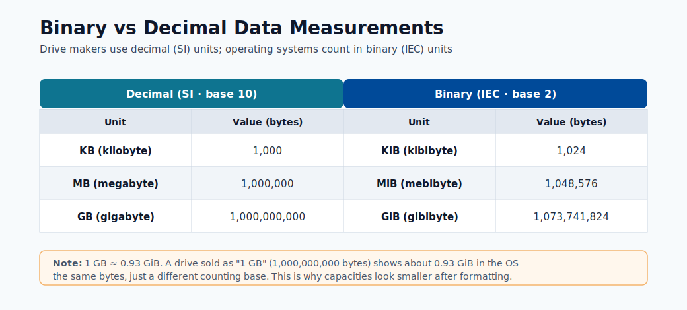
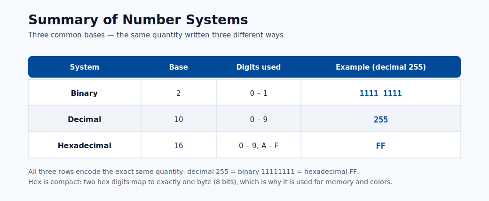

# Environment Setup

This module helps beginners build a reproducible runtime from zero. Reproducibility is
critical because model behavior depends on package versions, OS libraries, and Python
runtime details.

## Why environment reproducibility matters

- Same code can produce different results under different dependency versions.
- Training and inference must share compatible libraries.
- Teams need deterministic rebuilds for audits and incident recovery.

The diagrams below show how Azure ML assets are organized and how environments are reused
across training and inference.


> **Note - What this shows:** The workspace taxonomy again, here to emphasize *where environments live*. The environment you
> build locally becomes a registered, versioned asset inside this structure so remote jobs can
> reuse it.


> **Note - What this shows:** How one environment definition flows into both training and inference jobs. Pinning it once and
> reusing it is the core mechanism behind reproducible runs and deterministic rebuilds.

## Typical setup (from scratch)

```console
conda env create --name aml-env --file ./dependencies/environment.yml --force
conda activate aml-env
pip install -r ./dependencies/requirements.txt
```

## Validation checklist

1. Confirm critical libraries are installed.
2. Confirm Python version is what your project expects.
3. Confirm notebook kernel points to the same environment.

Validation:

```console
pip show scikit-learn
pip show azureml-sdk
conda env list
```

Optional kernel registration:

```console
python -m ipykernel install --user --name aml-env --display-name "AML Env"
```

## Common setup failures and fixes

| Symptom | Likely cause | Fix |
|---|---|---|
| Package import error | Dependency missing or version mismatch | Reinstall pinned version from requirements |
| Different results across machines | Unpinned dependencies | Pin versions in environment files |
| Notebook using wrong interpreter | Kernel mismatch | Re-select kernel and restart |
| `conda activate` has no effect | Conda not initialised in shell | Run `conda init bash` (or `zsh`), then reopen terminal |
| pip installs to wrong env | Virtualenv active but pip resolves globally | Use `python -m pip install` instead of bare `pip` |
| Azure ML job uses wrong image | Environment not registered before job submit | Register env first or use `Environment.from_conda_specification` |

## Azure ML environment registration

Registering a local environment to Azure ML so it can be used in remote training jobs:

```python
from azureml.core import Workspace, Environment

ws = Workspace.from_config()
env = Environment.from_conda_specification(
    name="fraud-train",
    file_path="./environment.yml"
)
env.register(workspace=ws)
```

After registration, reference it in job config by name and version:

```python
from azureml.core import ScriptRunConfig
from azureml.core.runconfig import RunConfiguration

rc = RunConfiguration()
rc.environment = Environment.get(ws, name="fraud-train", version="1")

config = ScriptRunConfig(
    source_directory="./src",
    script="train.py",
    run_config=rc,
    compute_target="gpu-cluster"
)
```

## Deep dive: every concept, explained

This section explains the moving parts of a reproducible environment and why each one can
silently change model behavior.

### What "environment" actually contains

An ML environment is a stack of layers, and a mismatch in *any* layer can change results:

| Layer | Example | Failure if it drifts |
|---|---|---|
| OS / system libraries | glibc, CUDA, BLAS | Numeric differences, GPU ops fail |
| Language runtime | Python 3.10 vs 3.11 | Syntax/ABI breaks, pickled models won't load |
| Packages | scikit-learn 1.3 vs 1.4 | Different defaults → different predictions |
| Random seeds | NumPy/PyTorch seed | Non-deterministic training runs |

Reproducibility means pinning *all* of these, which is why Azure ML packages them into a single
**versioned environment** (a container image) rather than relying on whatever is installed on a
machine.

### conda vs pip vs the environment files

- **conda** manages *both* Python and non-Python system dependencies (CUDA, MKL, compilers),
  which is why it is preferred for the base environment in data science.
- **pip** installs Python packages from PyPI; it does not manage system libraries.
- `environment.yml` declares the conda environment (channels + packages); `requirements.txt`
  pins pip packages installed *into* that environment. Using both lets conda handle the heavy
  system layer and pip handle pure-Python packages.

### Why `python -m pip` instead of bare `pip`

`pip` is just a script that points at *some* Python. If multiple Pythons exist, bare `pip` can
install into the wrong one. `python -m pip` runs pip *as a module of the exact interpreter you
invoked*, guaranteeing the package lands in the environment you think it does. The same logic
applies to `python -m ipykernel install`, which registers *this* interpreter as a notebook
kernel : preventing the common "notebook uses the wrong environment" bug.

### Pinning, lockfiles, and determinism

- **Pinning** means specifying exact versions (`scikit-learn==1.3.2`) instead of ranges
  (`scikit-learn>=1.3`). Ranges let a rebuild silently pull a newer package whose changed
  defaults alter predictions.
- A **lockfile** captures the *entire resolved dependency tree* (including transitive
  dependencies) so a rebuild is byte-for-byte reproducible. This is what auditors and incident
  responders rely on to recreate a past model exactly.

### Registering an environment to Azure ML

`Environment.from_conda_specification(...).register(workspace=ws)` builds a container image from
your spec and stores it as a *versioned* asset in the workspace. The benefit: the **same image**
is reused across remote training jobs and the inference deployment, eliminating training/serving
skew. Referencing it by `name` + `version` in `ScriptRunConfig` makes the run fully reproducible
: the run record then points at an immutable environment version, not a mutable local machine.

## Conda vs pip vs Docker: when to use each

| Tool | Best for | Avoid when |
|---|---|---|
| Conda | Mixed Python + native library deps | Simple pure-Python projects |
| pip + venv | Pure Python projects | Complex C/CUDA dependencies |
| Docker | Full system reproducibility | Team unfamiliar with containers |
| Azure ML curated images | Standard frameworks (PyTorch, TF) | Custom low-level system libs |

These references help when sizing compute and understanding memory/number representation
concepts that affect performance decisions.



> **Note - What this shows:** The difference between binary (1 KiB = 1024 bytes) and decimal (1 KB = 1000 bytes) measures.
> It matters when sizing datasets, memory, and compute : a mismatch explains many "why is my data
> bigger than expected?" surprises.



> **Note - What this shows:** A summary of number systems (binary, decimal, hexadecimal). Useful background when reading
> memory addresses, byte sizes, and encoded data formats during environment and data debugging.

## The modern SDK v2 equivalent

The registration snippets above use the v1 SDK (`azureml.core`). New projects should prefer the
v2 SDK (`azure-ai-ml`), which models the environment as a declarative object and is the basis of
the CLI v2 and YAML workflows used across this hub. The concepts are identical: pin dependencies,
build a versioned image, reuse it everywhere.

```python
from azure.ai.ml import MLClient
from azure.ai.ml.entities import Environment
from azure.identity import DefaultAzureCredential

ml_client = MLClient.from_config(DefaultAzureCredential())

env = Environment(
    name="fraud-train",
    description="Pinned training/inference environment",
    conda_file="./environment.yml",
    image="mcr.microsoft.com/azureml/openmpi4.1.0-ubuntu20.04:latest",
)
ml_client.environments.create_or_update(env)
```

The same environment can be declared as YAML and version-controlled alongside your code, which
is the recommended pattern for auditable, GitOps-style pipelines:

```yaml
# environment.yml (Azure ML CLI v2 asset)
$schema: https://azuremlschemas.azureedge.net/latest/environment.schema.json
name: fraud-train
image: mcr.microsoft.com/azureml/openmpi4.1.0-ubuntu20.04:latest
conda_file: ./conda.yml
description: Pinned training/inference environment
```

> **Tip - v1 vs v2:** If you see `from azureml.core import ...` you are on the v1 SDK; if you see
> `from azure.ai.ml import ...` you are on v2. Pick one per project and stay consistent. v2 is the
> forward-looking choice and aligns with the CLI/YAML examples in the deployment modules.

## End-to-end verification script

Run this short script after building an environment to fail fast on the most common problems:
wrong Python version, missing libraries, and non-deterministic seeds. Catching these locally is
far cheaper than discovering them inside a remote job.

```python
import sys, importlib

# 1) Python version must match what the project pins
assert sys.version_info[:2] == (3, 10), f"Expected Python 3.10, got {sys.version}"

# 2) Critical libraries must import at the pinned versions
expected = {"sklearn": "1.3.0", "pandas": "2.0.3", "lightgbm": "4.0.0"}
for mod, want in expected.items():
    got = importlib.import_module(mod).__version__
    assert got == want, f"{mod}: expected {want}, got {got}"

# 3) Seeds must make a run reproducible
import numpy as np
np.random.seed(42)
first = np.random.rand(3)
np.random.seed(42)
assert np.allclose(first, np.random.rand(3)), "Seeding is not deterministic"

print("Environment verification passed.")
```

## Quick self-check

| # | Question | Answer |
|---|----------|--------|
| 1 | Why should train and inference share a pinned environment? | So the exact library versions used in training are reproduced at serving, eliminating train/serve skew and a whole class of version-mismatch bugs. |
| 2 | What command shows all conda environments? | `conda env list` (equivalently `conda info --envs`). |
| 3 | When should you register a Jupyter kernel? | When you want a specific conda/virtual environment to be selectable as a notebook kernel, via `python -m ipykernel install --user --name ...`, preventing the "notebook uses the wrong environment" bug. |
| 4 | How do you tell whether a code sample uses SDK v1 or v2? | By the imports: `from azureml.core import ...` is v1, while `from azure.ai.ml import ...` (with `MLClient`) is v2. |
| 5 | Which dependency layers (OS, runtime, packages, seeds) must be pinned for full reproducibility? | All of them: the OS/base image, the language runtime (Python version), the packages (exact versions), and the random seeds. |

---

## Containerization fundamentals

### What is Docker?

**Docker** is a platform for packaging an application and all of its dependencies — OS
libraries, language runtime, Python packages, configuration files — into a single, portable
unit called a **container image**. A container is a running instance of an image. The key
insight is that the image is **immutable and self-contained**: once built, it behaves identically
on a developer laptop, a CI/CD agent, and an Azure ML compute cluster.

### Dockerfile

A `Dockerfile` is a text file that defines the layers of a container image:

```dockerfile
# Example Dockerfile for an Azure ML training job
FROM mcr.microsoft.com/azureml/openmpi4.1.0-cuda11.8-cudnn8-ubuntu22.04:latest

# System dependencies
RUN apt-get update && apt-get install -y --no-install-recommends \
    libgomp1 \
    && rm -rf /var/lib/apt/lists/*

# Copy and install Python dependencies
COPY requirements.txt /tmp/requirements.txt
RUN pip install --no-cache-dir -r /tmp/requirements.txt

# Copy training code (for inference images; omit for training where code is mounted)
COPY src/ /app/src/
WORKDIR /app
```

Each `RUN`, `COPY`, and `FROM` instruction creates a new **layer**. Docker caches layers, so
rebuilding after changing only `requirements.txt` only re-runs the pip install layer — the OS
layer is reused from cache, making iterative builds fast.

### Why containers solve "works on my machine"

The classic problem: a model trained on a developer's MacBook behaves differently when deployed
to a Linux server because of different BLAS implementations, different glibc versions, or a
different numpy that was silently installed by a conflicting package.

Containers eliminate this by bundling the **entire execution environment** as a versioned
artifact. When you say "this model runs in image `fraud-train:1.4.2`", that is an exact,
reproducible specification — not a list of instructions that might be followed differently on
different machines.

### Relationship between Docker and Azure ML environments

Azure ML **environment** objects are essentially a managed abstraction over Docker images:

| Azure ML concept | Docker concept |
|---|---|
| `Environment(image=..., conda_file=...)` | `FROM base_image` + `RUN conda env create` |
| `ml_client.environments.create_or_update(env)` | `docker build` + `docker push` to ACR |
| `azureml:fraud-train@latest` in a job | `image: myacr.azurecr.io/fraud-train:latest` |
| Environment version | Image tag |

When you register an Azure ML environment, the platform builds the Docker image and pushes it to
the workspace's **Azure Container Registry**. Every job that references that environment version
pulls the exact same image — no ambiguity, no drift.

> **Note - You rarely write raw Dockerfiles in Azure ML:** Azure ML handles the Docker build
> process for you when you provide a `conda_file` or `pip_requirements`. You only write a
> custom Dockerfile when you need non-Python system libraries that conda cannot install (e.g.
> proprietary GPU drivers or compiled C extensions).

---

## The Azure ML curated environments

### What they are

Azure ML **curated environments** are pre-built, Microsoft-maintained container images for the
most common ML frameworks. They are tested on Azure ML infrastructure, ship with the
`azureml-mlflow` SDK pre-installed for automatic logging, and are updated with each framework
release. Using a curated environment is the fastest path from zero to a working training job.

### Common curated environments

| Name | Framework | Typical use case |
|---|---|---|
| `AzureML-sklearn-1.5-ubuntu22.04-py310-cpu` | scikit-learn 1.5 | Classical ML, tabular data |
| `AzureML-pytorch-2.2-ubuntu22.04-py310-cuda121-gpu` | PyTorch 2.2 | Deep learning, CV, NLP |
| `AzureML-tensorflow-2.16-ubuntu22.04-py311-cuda121-gpu` | TensorFlow 2.16 | Deep learning, Keras |
| `AzureML-lightgbm-3.3-ubuntu20.04-py38-cpu` | LightGBM 3.3 | Gradient boosting, structured data |
| `AzureML-automl` | AutoML dependencies | Azure ML AutoML runs |
| `AzureML-responsibleai-0.25-ubuntu22.04-py38-cpu` | RAI Toolbox | Fairness, explainability |

### Listing and pinning curated environments

```bash
# List all curated environments
az ml environment list --workspace-name my-workspace --resource-group my-rg \
  --query "[?contains(tags.type, 'curated')].[name, version]" -o table

# Get the full spec of a specific curated environment
az ml environment show \
  --name AzureML-sklearn-1.5-ubuntu22.04-py310-cpu \
  --version 1 \
  --workspace-name my-workspace \
  --resource-group my-rg
```

```python
# Use a curated environment in a job (SDK v2)
from azure.ai.ml import command
from azure.ai.ml.entities import ResourceConfiguration

job = command(
    code="./src",
    command="python train.py --data ${{inputs.training_data}}",
    inputs={"training_data": Input(type="uri_folder")},
    environment="azureml://registries/azureml/environments/AzureML-sklearn-1.5-ubuntu22.04-py310-cpu/versions/1",
    compute="cpu-cluster",
)
```

> **Tip - Pin the version:** Always pin the curated environment **version** (not `@latest`) in
> production pipelines. Microsoft updates curated environments; pulling `@latest` in two runs
> separated by an update can produce different dependency sets and non-reproducible results.

### When to use curated vs custom

| Situation | Recommendation |
|---|---|
| Standard framework (PyTorch, TF, sklearn) | Start with curated; add pip extras if needed |
| Need package not in curated image | Inherit from curated image, add pip/conda packages |
| Need specific older package version | Build a custom environment from scratch |
| Need proprietary system library | Custom Dockerfile |
| Fastest possible build time | Curated (pre-built, no build step) |

---

## Advanced conda and pip management

### Conda channels

A **conda channel** is a repository server that hosts conda packages. The default channel is
`defaults` (Anaconda). **conda-forge** is a community-maintained channel with broader and often
more up-to-date package coverage:

```yaml
# conda.yml with explicit channel priority
channels:
  - conda-forge      # checked first
  - defaults         # fallback
dependencies:
  - python=3.10.*
  - numpy=1.26.*
  - scikit-learn=1.5.*
  - pip:
      - azureml-mlflow==1.57.*
      - lightgbm==4.3.*
```

Setting `channel_priority: strict` in `.condarc` prevents conda from mixing packages from
different channels with potentially incompatible C library versions:

```yaml
# ~/.condarc
channel_priority: strict
```

### Conda-forge vs defaults

- **conda-forge** packages are community-built and often have more recent versions.
- **defaults** packages are built by Anaconda Inc. and may lag but are more conservatively
  tested together.
- **Mixing channels without strict priority** is a common source of `GLIBC_2.x not found`
  errors because packages from different channels may be compiled against different system
  library versions.

> **Note - Rule of thumb:** Choose one primary channel (`conda-forge` for most data science
> work, `defaults` for corporate environments with Anaconda licensing) and stick to it. Only mix
> channels when a package is available in one but not the other, and always test the combined
> environment before committing it.

### Dependency solver conflicts

The conda solver (and pip's resolver) must find a set of package versions that satisfies all
declared constraints simultaneously. With hundreds of packages this becomes an NP-hard
constraint satisfaction problem. Symptoms of solver failure:

```
UnsatisfiableError: The following specifications were found to be incompatible with each other:
  - scikit-learn==1.5.0 -> numpy[version='>=1.17.3,<2.0a0']
  - numpy==2.0.0
```

**Debugging steps:**
1. Read the error message: it usually names the conflicting constraint chain.
2. Relax the tightest constraint to a compatible range.
3. Use `conda install --dry-run` to test without committing.
4. Use `mamba` (a faster drop-in conda solver) which gives better conflict diagnostics.
5. If conda is stuck, try creating the environment with only the core packages first, then
   adding extras incrementally.

### pip editable installs

```bash
# Install your own package in editable mode (changes to src/ are reflected immediately)
pip install -e ./my_package[dev,test]
```

An **editable install** (`-e`) does not copy files into `site-packages`; it adds a `.pth` file
that points Python at your source directory. This is the correct pattern for developing a shared
utility library alongside a training script — changes are picked up without reinstalling.

### extras_require

In `setup.py` or `pyproject.toml`, **extras** let users install optional dependency groups:

```toml
# pyproject.toml
[project.optional-dependencies]
dev = ["pytest>=7.0", "black", "mypy"]
gpu = ["torch>=2.0+cu121", "triton"]
all = ["my-package[dev,gpu]"]
```

In Azure ML, you might use this to keep a lightweight base package and install GPU extras only
on GPU compute:

```yaml
# conda.yml for GPU training environment
dependencies:
  - python=3.10.*
  - pip:
      - my-ml-lib[gpu]==1.2.3
```

### Debugging dependency hell

When a job fails with `ImportError` or `ModuleNotFoundError` inside a remote Azure ML run:

```bash
# 1. Start an interactive session on the same compute
az ml compute connect --name gpu-cluster

# 2. Activate the conda environment manually (or check the Docker image)
conda activate /azureml-envs/fraud-train

# 3. Check installed versions
pip show lightgbm scikit-learn numpy

# 4. Check for import errors interactively
python -c "import lightgbm; print(lightgbm.__version__)"

# 5. Check for version conflicts
pip check
```

> **Tip - pip check:** `pip check` reports packages with missing or incompatible dependencies
> in the current environment. Run it as part of your environment validation pipeline to catch
> issues before they surface as cryptic runtime errors.

---

## Environment validation pipeline

Validating an environment before running expensive training jobs saves compute time and surfaces
configuration issues early. A robust validation pipeline has three layers: **import tests**,
**version assertion tests**, and a **smoke test** that runs a mini training loop.

### Automated testing of environments

Structure your environment tests as a standard `pytest` suite so they can be run locally and in
CI:

```
tests/
  environment/
    test_imports.py
    test_versions.py
    test_smoke.py
```

### Testing package imports

```python
# tests/environment/test_imports.py
"""Verify that all required packages import without error."""

import pytest

REQUIRED_PACKAGES = [
    "numpy",
    "pandas",
    "sklearn",
    "lightgbm",
    "mlflow",
    "azure.ai.ml",
    "azure.identity",
]

@pytest.mark.parametrize("package", REQUIRED_PACKAGES)
def test_package_imports(package):
    """Each critical package must import cleanly."""
    import importlib
    mod = importlib.import_module(package)
    assert mod is not None, f"Failed to import {package}"
```

### Version assertion tests

```python
# tests/environment/test_versions.py
"""Verify that pinned package versions are installed."""

import importlib
import pytest

# Update this dict when you update environment.yml
EXPECTED_VERSIONS = {
    "numpy": "1.26.4",
    "pandas": "2.2.2",
    "sklearn": "1.5.0",      # sklearn.__version__ exposed via scikit-learn
    "lightgbm": "4.3.0",
    "mlflow": "2.13.0",
}

@pytest.mark.parametrize("package,expected", EXPECTED_VERSIONS.items())
def test_version(package, expected):
    mod = importlib.import_module(package)
    actual = getattr(mod, "__version__", None)
    assert actual == expected, (
        f"{package}: expected {expected}, got {actual}. "
        f"Update environment.yml or fix the pin."
    )
```

### How to build a smoke test for an ML environment

A **smoke test** runs the full training loop on a tiny dataset to verify that compute,
data loading, model fitting, and metric logging all work end-to-end without errors:

```python
# tests/environment/test_smoke.py
"""Smoke test: run a mini training loop to verify the environment end-to-end."""

import numpy as np
import mlflow
from sklearn.ensemble import GradientBoostingClassifier
from sklearn.metrics import roc_auc_score

def test_smoke_training():
    """Full train → evaluate → log loop on synthetic data must complete in <30s."""
    rng = np.random.default_rng(42)
    X = rng.standard_normal((200, 10))
    y = (X[:, 0] + rng.standard_normal(200) > 0).astype(int)

    with mlflow.start_run(run_name="smoke_test"):
        model = GradientBoostingClassifier(n_estimators=10, random_state=42)
        model.fit(X[:160], y[:160])
        auc = roc_auc_score(y[160:], model.predict_proba(X[160:])[:, 1])
        mlflow.log_metric("smoke_auc", auc)

    assert 0.5 <= auc <= 1.0, f"Unreasonable AUC in smoke test: {auc}"
```

Run all environment tests:

```bash
pytest tests/environment/ -v --timeout=120
```

Integrate this into your CI workflow so the environment is validated on every change to
`environment.yml` or `requirements.txt`:

```yaml
# .github/workflows/validate-env.yml
on:
  push:
    paths:
      - "dependencies/**"

jobs:
  validate:
    runs-on: ubuntu-latest
    steps:
      - uses: actions/checkout@v4
      - name: Set up conda
        uses: conda-incubator/setup-miniconda@v3
        with:
          environment-file: dependencies/environment.yml
          activate-environment: fraud-train
      - name: Run environment tests
        run: pytest tests/environment/ -v
```

---

## GPU environment setup

### Why GPU environment setup is harder

A GPU training environment requires not just Python packages but a precisely matched stack of
**system-level components**:

$$\text{Application (PyTorch)} \rightarrow \text{CUDA Toolkit} \rightarrow \text{cuDNN} \rightarrow \text{GPU Driver}$$

Each arrow is a compatibility constraint. A mismatch at any level causes `RuntimeError: CUDA
error: no kernel image is available for execution on the device` or silent fallback to CPU.

### CUDA version compatibility matrix

| PyTorch version | Required CUDA | Recommended cuDNN | Notes |
|---|---|---|---|
| 2.3.x | 11.8 or 12.1 | 8.7+ | Production recommended |
| 2.2.x | 11.8 or 12.1 | 8.7+ | LTS-like stability |
| 2.1.x | 11.8 or 12.1 | 8.7 | |
| 2.0.x | 11.7 or 11.8 | 8.5 | Torch.compile introduced |
| TensorFlow 2.16.x | 12.3 | 8.9 | |
| TensorFlow 2.13.x | 11.8 | 8.6 | Last to support Python 3.8 |

> **Note - GPU driver vs CUDA Toolkit:** The **GPU driver** (installed on the host) must support
> the CUDA version you target. The CUDA Toolkit is bundled inside the Docker image — you do not
> install it on the host VM. The driver must be $\geq$ the minimum required for the CUDA version.
> For CUDA 12.1, the minimum driver version is 525.60.13 (Linux).

### cuDNN

**cuDNN** (CUDA Deep Neural Network library) provides optimised implementations of convolution,
attention, and activation functions. Without cuDNN, GPU training is possible but significantly
slower. The cuDNN version must be compatible with both the CUDA version and the framework
version — mismatches produce `Could not find cudnn` errors at runtime.

### How Azure ML handles CUDA automatically

Azure ML curated GPU environments ship with pre-compiled, pre-tested combinations of CUDA
Toolkit, cuDNN, and the ML framework. The base images follow the naming convention:

```
mcr.microsoft.com/azureml/openmpi4.1.0-cuda<CUDA_VERSION>-cudnn<CUDNN_MAJOR>-ubuntu<UBUNTU_VERSION>
```

Example:
```
mcr.microsoft.com/azureml/openmpi4.1.0-cuda11.8-cudnn8-ubuntu22.04:latest
```

When you use a curated PyTorch environment, you do not install CUDA or cuDNN manually — they
are already in the base image. The only version you control is the **PyTorch version** and your
own packages.

### Building a custom GPU environment

If you need a non-standard CUDA/PyTorch combination, specify it explicitly:

```yaml
# conda.yml for custom CUDA 12.1 + PyTorch 2.3 environment
channels:
  - pytorch
  - nvidia
  - conda-forge
dependencies:
  - python=3.11.*
  - pytorch=2.3.*
  - pytorch-cuda=12.1     # installs CUDA runtime from nvidia channel
  - cudnn=8.9.*
  - pip:
      - torchvision==0.18.*
      - torchaudio==2.3.*
      - azureml-mlflow==1.57.*
```

```yaml
# Azure ML environment spec referencing a CUDA base image
$schema: https://azuremlschemas.azureedge.net/latest/environment.schema.json
name: pytorch-cuda121
image: mcr.microsoft.com/azureml/openmpi4.1.0-cuda12.1-cudnn8-ubuntu22.04:latest
conda_file: ./conda.yml
description: PyTorch 2.3 with CUDA 12.1 for distributed GPU training
```

### Verifying GPU availability at runtime

```python
# Add this to the top of your training script to fail fast if GPU is missing
import torch

assert torch.cuda.is_available(), (
    "CUDA is not available. Check that: "
    "(1) the compute target has GPUs, "
    "(2) the environment image includes CUDA, "
    "(3) the job distribution config is correct."
)
print(f"Using {torch.cuda.device_count()} GPU(s): {torch.cuda.get_device_name(0)}")
print(f"CUDA version: {torch.version.cuda}")
print(f"cuDNN version: {torch.backends.cudnn.version()}")
```

> **Tip - Mixed precision:** For most deep learning training, enable **automatic mixed precision
> (AMP)** to use FP16 for most operations while maintaining FP32 for stability-critical
> computations. This typically doubles training throughput on modern GPUs with no accuracy loss:
> `scaler = torch.cuda.amp.GradScaler()` + `with torch.autocast("cuda"):`.

---

## Secrets and credentials management

### Never put credentials in code

Hardcoding passwords, connection strings, or API keys directly in source code is one of the
most common — and most serious — security mistakes in ML projects. Secrets in code end up in:
- Version control history (even after deletion, they exist in old commits).
- Docker image layers (visible with `docker history`).
- Log files streamed back from training jobs.
- Screenshots, demos, and documentation.

The correct approach is to **inject secrets at runtime** from a managed secret store.

### Azure Key Vault integration

Azure Key Vault is a managed service for storing and accessing secrets, certificates, and
cryptographic keys. The Azure ML workspace provisions a Key Vault automatically — use it:

```python
# Access a Key Vault secret from inside an Azure ML job
# (job runs with a managed identity that has Key Vault Secrets User role)
from azure.identity import ManagedIdentityCredential
from azure.keyvault.secrets import SecretClient

credential = ManagedIdentityCredential()
kv_client = SecretClient(
    vault_url="https://my-keyvault.vault.azure.net/",
    credential=credential,
)

db_password = kv_client.get_secret("database-password").value
api_key = kv_client.get_secret("external-api-key").value
```

No password is stored in the code or in the environment file. The managed identity credential
is automatically provided by the Azure ML compute runtime — no login required.

### Managed identity for data access

The cleanest approach for data access is **system-assigned managed identity** on the compute
cluster, combined with **RBAC role assignments** on the data sources:

```bash
# Grant the compute cluster's managed identity read access to the data lake
az role assignment create \
  --assignee-object-id <compute-cluster-principal-id> \
  --assignee-principal-type ServicePrincipal \
  --role "Storage Blob Data Reader" \
  --scope /subscriptions/<sub>/resourceGroups/<rg>/providers/Microsoft.Storage/storageAccounts/mydatalake
```

With this assignment, jobs running on the cluster can read from the data lake using
`DefaultAzureCredential()` with no secrets at all:

```python
from azure.identity import DefaultAzureCredential
from azure.storage.blob import BlobServiceClient

credential = DefaultAzureCredential()
client = BlobServiceClient(
    account_url="https://mydatalake.blob.core.windows.net",
    credential=credential,
)
```

### Environment variables for secrets in local development

For local development where managed identity is not available, inject secrets as environment
variables rather than hardcoding them. Use a `.env` file (never committed to git) and the
`python-dotenv` package:

```bash
# .env (in .gitignore)
DATABASE_PASSWORD=super-secret-password
API_KEY=another-secret
AZURE_STORAGE_CONNECTION_STRING=DefaultEndpointsProtocol=https;...
```

```python
# load_secrets.py
from dotenv import load_dotenv
import os

load_dotenv()  # reads .env file into environment variables

db_password = os.environ["DATABASE_PASSWORD"]  # KeyError if missing — fail fast
```

Add `.env` to `.gitignore` immediately when creating a project. Add a `.env.example` file with
placeholder values to document which variables are needed:

```bash
# .env.example (committed to git)
DATABASE_PASSWORD=<your-database-password>
API_KEY=<your-api-key>
```

### DefaultAzureCredential chain

`DefaultAzureCredential` tries a sequence of credential sources and uses the first that
succeeds:

| Order | Credential type | When it is used |
|---|---|---|
| 1 | `EnvironmentCredential` | `AZURE_CLIENT_ID` + `AZURE_CLIENT_SECRET` env vars set |
| 2 | `WorkloadIdentityCredential` | Running in Kubernetes with workload identity |
| 3 | `ManagedIdentityCredential` | Running on Azure VM / Azure ML compute |
| 4 | `SharedTokenCacheCredential` | Cached token from `az login` |
| 5 | `VisualStudioCodeCredential` | VS Code Azure account extension |
| 6 | `AzureCliCredential` | `az login` session active |
| 7 | `InteractiveBrowserCredential` | Opens browser for interactive login |

This chain means the **same code** works locally (picks up `az login` token) and in production
(picks up managed identity) without any changes or secrets in the codebase.

> **Note - Principle of least privilege:** Grant the managed identity only the roles it needs.
> A training job that only reads data needs `Storage Blob Data Reader`, not `Contributor`.
> Overly broad permissions increase the blast radius if the compute is compromised.

---

## Full working example: complete project environment

The following is a production-grade environment specification for a **fraud detection project**,
demonstrating all the patterns covered in this module: conda base, pip extras, environment
registration, validation, and Key Vault integration.

### Project structure

```
fraud-detection/
├── dependencies/
│   ├── environment.yml        # conda environment spec
│   ├── requirements.txt       # pip packages (locked)
│   └── register_env.py        # environment registration script
├── src/
│   └── train.py
├── tests/
│   └── environment/
│       ├── test_imports.py
│       ├── test_versions.py
│       └── test_smoke.py
└── .env.example
```

### environment.yml

```yaml
name: fraud-train
channels:
  - conda-forge
  - defaults
dependencies:
  - python=3.11.9
  - numpy=1.26.4
  - pandas=2.2.2
  - scikit-learn=1.5.0
  - lightgbm=4.3.0
  - imbalanced-learn=0.12.3   # for SMOTE on imbalanced fraud data
  - shap=0.45.1               # for explainability
  - matplotlib=3.9.0
  - pip:
      - azureml-mlflow==1.57.0
      - azure-ai-ml==1.17.0
      - azure-identity==1.16.1
      - azure-keyvault-secrets==4.8.0
      - python-dotenv==1.0.1
      - pytest==8.2.2
      - pytest-timeout==2.3.1
```

### requirements.txt (locked, for pip audit)

```text
# Generated by: pip freeze > requirements.txt
# Date: 2024-06-26
# Python: 3.11.9
azureml-mlflow==1.57.0
azure-ai-ml==1.17.0
azure-core==1.30.2
azure-identity==1.16.1
azure-keyvault-secrets==4.8.0
azure-storage-blob==12.20.0
lightgbm==4.3.0
imbalanced-learn==0.12.3
mlflow==2.13.0
numpy==1.26.4
pandas==2.2.2
python-dotenv==1.0.1
scikit-learn==1.5.0
shap==0.45.1
```

### register_env.py — environment registration script

```python
"""
register_env.py
Register the fraud-train conda environment to an Azure ML workspace.

Usage:
    python register_env.py \
        --workspace my-workspace \
        --resource-group my-rg \
        --subscription <subscription-id> \
        [--version 1.0.0]
"""

import argparse
from pathlib import Path

from azure.ai.ml import MLClient
from azure.ai.ml.entities import Environment
from azure.identity import DefaultAzureCredential


CONDA_FILE = Path(__file__).parent / "environment.yml"
BASE_IMAGE = "mcr.microsoft.com/azureml/openmpi4.1.0-ubuntu22.04:latest"


def parse_args() -> argparse.Namespace:
    parser = argparse.ArgumentParser()
    parser.add_argument("--workspace", required=True)
    parser.add_argument("--resource-group", required=True)
    parser.add_argument("--subscription", required=True)
    parser.add_argument("--version", default="1.0.0")
    return parser.parse_args()


def main() -> None:
    args = parse_args()

    ml_client = MLClient(
        credential=DefaultAzureCredential(),
        subscription_id=args.subscription,
        resource_group_name=args.resource_group,
        workspace_name=args.workspace,
    )

    env = Environment(
        name="fraud-train",
        version=args.version,
        description=(
            "Production environment for fraud detection training and inference. "
            "Pinned to exact package versions for reproducibility."
        ),
        conda_file=str(CONDA_FILE),
        image=BASE_IMAGE,
        tags={
            "project": "fraud-detection",
            "owner": "ml-platform-team",
            "python": "3.11.9",
        },
    )

    registered = ml_client.environments.create_or_update(env)
    print(f"Registered environment: {registered.name} version {registered.version}")
    print(f"Image build status will appear in: Azure ML Studio > Environments")


if __name__ == "__main__":
    main()
```

### Complete validation run

```bash
# 1. Create the local conda environment
conda env create --name fraud-train --file dependencies/environment.yml --force
conda activate fraud-train

# 2. Install pip packages into the conda environment
pip install -r dependencies/requirements.txt --no-deps

# 3. Run import and version tests
pytest tests/environment/test_imports.py tests/environment/test_versions.py -v

# 4. Run smoke test
pytest tests/environment/test_smoke.py -v --timeout=60

# 5. Register to Azure ML workspace
python dependencies/register_env.py \
  --workspace my-workspace \
  --resource-group my-rg \
  --subscription 00000000-0000-0000-0000-000000000000 \
  --version 1.0.0

# 6. Verify registration
az ml environment show \
  --name fraud-train \
  --version 1.0.0 \
  --workspace-name my-workspace \
  --resource-group my-rg
```

### train.py skeleton (showing secrets and MLflow patterns)

```python
"""
train.py — Fraud detection model training script.
Designed to run as an Azure ML job with managed identity.
"""

import os
import argparse
import numpy as np
import pandas as pd
import mlflow
import mlflow.sklearn
from sklearn.ensemble import GradientBoostingClassifier
from sklearn.metrics import roc_auc_score, average_precision_score
from azure.identity import DefaultAzureCredential
from azure.keyvault.secrets import SecretClient


def get_secret(vault_url: str, secret_name: str) -> str:
    """Retrieve a secret from Key Vault using the ambient credential."""
    client = SecretClient(vault_url=vault_url, credential=DefaultAzureCredential())
    return client.get_secret(secret_name).value


def parse_args() -> argparse.Namespace:
    p = argparse.ArgumentParser()
    p.add_argument("--train_data", type=str, required=True)
    p.add_argument("--val_data", type=str, required=True)
    p.add_argument("--n_estimators", type=int, default=500)
    p.add_argument("--learning_rate", type=float, default=0.05)
    p.add_argument("--max_depth", type=int, default=5)
    p.add_argument("--keyvault_url", type=str, default="")
    return p.parse_args()


def main() -> None:
    args = parse_args()

    # Retrieve external API key from Key Vault if URL is provided
    if args.keyvault_url:
        _ = get_secret(args.keyvault_url, "fraud-db-password")  # example usage

    # Load data
    train_df = pd.read_parquet(args.train_data)
    val_df = pd.read_parquet(args.val_data)

    feature_cols = [c for c in train_df.columns if c != "is_fraud"]
    X_train, y_train = train_df[feature_cols].values, train_df["is_fraud"].values
    X_val, y_val = val_df[feature_cols].values, val_df["is_fraud"].values

    with mlflow.start_run():
        # Log hyperparameters
        mlflow.log_params({
            "n_estimators": args.n_estimators,
            "learning_rate": args.learning_rate,
            "max_depth": args.max_depth,
        })

        # Train
        model = GradientBoostingClassifier(
            n_estimators=args.n_estimators,
            learning_rate=args.learning_rate,
            max_depth=args.max_depth,
            random_state=42,
        )
        model.fit(X_train, y_train)

        # Evaluate
        proba = model.predict_proba(X_val)[:, 1]
        auc = roc_auc_score(y_val, proba)
        ap = average_precision_score(y_val, proba)

        mlflow.log_metrics({"val_roc_auc": auc, "val_avg_precision": ap})
        print(f"val_roc_auc={auc:.4f}  val_avg_precision={ap:.4f}")

        # Register model with MLflow (Azure ML captures this automatically)
        mlflow.sklearn.log_model(
            sk_model=model,
            artifact_path="model",
            registered_model_name="fraud-detection-gbm",
        )


if __name__ == "__main__":
    main()
```

> **Tip - Zero-secret training:** With managed identity on the compute cluster and Key Vault
> RBAC configured, the `train.py` script above requires **zero hardcoded credentials**. The
> `DefaultAzureCredential()` call inside `get_secret()` automatically uses the compute's managed
> identity at runtime and your `az login` session during local development — the same code path
> works in both contexts without modification.

