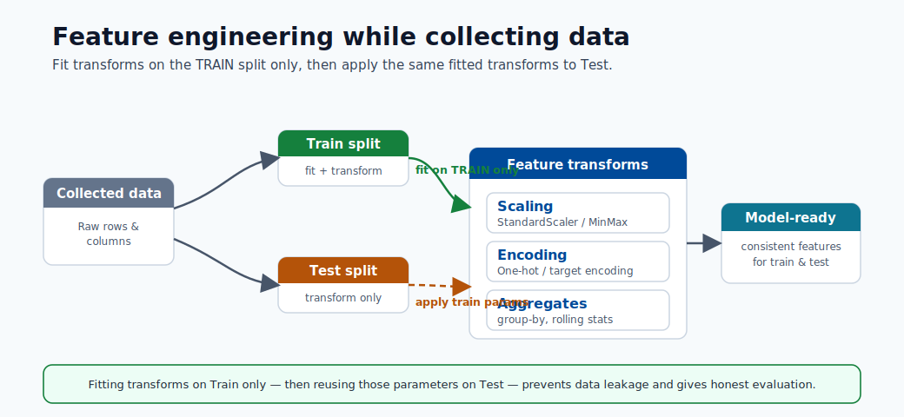
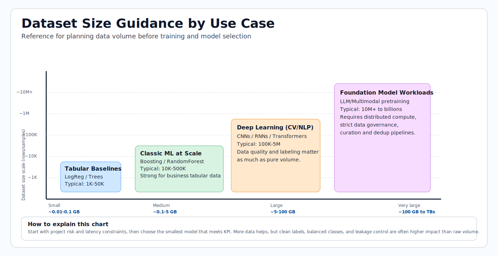

# Data Preparation

Data preparation is often the highest-effort stage of ML delivery. This module teaches
how to move from raw data to model-ready data with quality, reproducibility, and
leakage prevention.

## Data lifecycle overview

This sequence illustrates the lifecycle: business framing, data collection, feature
engineering, and dataset sizing for reliable model training.


> **Note - What this shows:** The data lifecycle by stage : from business framing through collection and feature engineering.
> Most delivery effort lives in these early stages, and defects here cap the quality any model
> can reach.


> **Note - What this shows:** How primary and secondary targets are collected alongside features. Defining the target
> precisely (and when it becomes known) is what later prevents target leakage.



> **Tip - Practical point:** Feature engineering should happen *while* you understand the data, but transforms must be fit
> on the training split only. Designing features and the split strategy together is how you keep
> preprocessing leakage-free.



> **Tip - How to use this chart:** Match your use case to a dataset-size band before committing to a model family. Tabular
> baselines need far less data than deep learning; foundation-model workloads need orders of
> magnitude more. Sizing data first avoids choosing a model you cannot feed.

> **Note - GB reference:** In dataset planning, vendor storage is typically decimal units:
> 1 KB = 1,000 bytes, 1 MB = 1,000,000 bytes, 1 GB = 1,000,000,000 bytes.
> Memory tools may show binary units instead: 1 GiB = 1,073,741,824 bytes,
> so 1 GB is approximately 0.93 GiB.

## Preparation checklist

- Remove duplicates and nulls
- Validate schema and dtypes
- Split train and test sets
- Register datasets in Azure ML

## Data quality dimensions

| Dimension | Why it matters |
|---|---|
| Completeness | Missing values can bias training |
| Consistency | Schema/type drift breaks pipelines |
| Accuracy | Noisy labels reduce model ceiling |
| Timeliness | Stale data hurts production relevance |

## Minimal preprocessing pipeline

1. Remove duplicates and invalid records.
2. Define feature and target columns.
3. Handle missing values (imputation strategy).
4. Encode categorical features.
5. Split data with leakage-safe strategy.

Useful split:

```python
from sklearn.model_selection import train_test_split
X_train, X_test, y_train, y_test = train_test_split(X, y, test_size=0.33, random_state=1)
```

For time-series forecasting, use chronological splits (never random shuffle across time).

The next visuals reinforce how supervised datasets are split and validated before
training, plus a dtype reference to prevent schema and conversion errors.


> **Note - What this shows:** The flow of data through training and testing stages. The test set branches off early and is
> untouched until final evaluation : the discipline that keeps offline scores honest.


> **Note - What this shows:** A train/test split. For class imbalance use a *stratified* split to preserve class ratios; for
> time series use a *chronological* split so the model never trains on future data.


> **Note - What this shows:** A reference of Python/pandas data types. Validating dtypes against your data contract catches
> schema drift and silent conversion bugs before they corrupt training.

## Data leakage warning

Leakage happens when future/target information enters training features. Typical causes:

- Fitting preprocessors on full data before split.
- Including post-outcome fields.
- Random split on temporal data.

Leakage creates inflated offline metrics and poor production behavior.

### Correct vs incorrect pipeline pattern

```python
# WRONG: fit scaler on full dataset before split
scaler = StandardScaler()
X_scaled = scaler.fit_transform(X)  # leaks test statistics into train
X_train, X_test = train_test_split(X_scaled, ...)

# CORRECT: fit scaler only on training data
X_train, X_test, y_train, y_test = train_test_split(X, y, test_size=0.2, random_state=42)
scaler = StandardScaler()
X_train_scaled = scaler.fit_transform(X_train)  # fit on train only
X_test_scaled = scaler.transform(X_test)         # transform test using train stats
```

Wrap this into a `sklearn.pipeline.Pipeline` so that fit/transform are always applied consistently:

```python
from sklearn.pipeline import Pipeline
from sklearn.preprocessing import StandardScaler
from sklearn.linear_model import LogisticRegression

pipeline = Pipeline([
    ("scaler", StandardScaler()),
    ("model", LogisticRegression())
])
pipeline.fit(X_train, y_train)   # scaler.fit only on X_train inside
pipeline.score(X_test, y_test)   # scaler.transform on X_test
```

## Data contract (recommended)

Define a contract before training so all producers/consumers align:

| Field | Type | Nullable | Allowed range/pattern | Notes |
|---|---|---|---|---|
| `customer_id` | string | No | UUID regex | Unique identifier |
| `event_ts` | datetime | No | ISO-8601 | Event timestamp (UTC) |
| `label` | int | Yes | 0 or 1 | Null for inference-only rows |
| `amount` | float | No | >= 0 | Monetary feature |

## Validation gates before training

1. **Schema gate**: columns and dtypes match contract.
2. **Quality gate**: null rates, duplicate rates, outlier checks within thresholds.
3. **Drift gate**: feature distribution shift below configured limits.
4. **Leakage gate**: no post-outcome features in training set.

## Split strategies by problem type

| Problem | Recommended split | Notes |
|---|---|---|
| IID tabular classification/regression | Random train/val/test split | Use stratified split if class imbalance exists |
| Time series | Chronological split (rolling/expanding windows) | Random shuffle destroys temporal order |
| Entity-correlated data (users/devices) | Group split by entity key | Prevents entity bleed-through |
| Rare event detection | Stratified random split | Ensures minority class in each fold |

## Deep dive: every concept, explained

This section explains the reasoning behind each preparation step so the rules become
principles you can apply to new datasets.

### Why data preparation dominates the effort

A model can only learn the signal that survives in the data. Every defect : a mislabeled row,
a leaked feature, an inconsistent unit : sets a hard ceiling on achievable quality that no
algorithm can break through. This is the practical meaning of "garbage in, garbage out", and
it is why teams spend most of their time here.

### Imputation: choosing how to fill missing values

**Imputation** replaces missing values so models that cannot accept nulls can run. The method
encodes an assumption about *why* the value is missing:

| Strategy | Assumption | Risk |
|---|---|---|
| Mean/median fill | Missing at random; central value is representative | Shrinks variance, hides structure |
| Mode fill (categorical) | Most frequent category is a safe default | Over-represents the majority |
| Model-based (kNN/MICE) | Missingness predictable from other features | Costlier, can leak if fit on full data |
| "Missing" indicator | Missingness itself is informative | Adds dimensionality |

Crucially, the imputer must be **fit on the training split only**, then applied to validation
and test : otherwise statistics from held-out data leak into training.

### Encoding categorical features

Models operate on numbers, so categories must be converted:

- **One-hot encoding** creates a binary column per category. Safe for low-cardinality features;
  explodes dimensionality for high-cardinality ones.
- **Ordinal encoding** maps categories to integers. Only valid when categories have a true
  order (e.g. small/medium/large), otherwise it invents a fake ranking.
- **Target/mean encoding** replaces a category with the mean target for that category. Powerful
  for high cardinality but a *prime leakage source* : it must be computed within cross-validation
  folds, never on the full dataset.

Tree-based models (and CatBoost natively) tolerate raw categoricals better than linear models,
which is part of why they dominate tabular problems.

### Why scaling, and why fit-on-train only

**Feature scaling** (e.g. `StandardScaler`: subtract mean, divide by standard deviation) puts
features on comparable ranges. It matters for distance- and gradient-based models (kNN, SVM,
linear models, neural nets) where a large-magnitude feature would otherwise dominate; tree
models are scale-invariant and do not need it. The scaler's mean and standard deviation are
*learned parameters* : fitting them on the full dataset before splitting lets test-set
statistics influence the training transform, the leakage shown in the WRONG example above.

### Data leakage, formalized

**Leakage** is any situation where information unavailable at prediction time enters training.
It inflates offline metrics and collapses in production. Three mechanisms recur:

1. **Preprocessing leakage** : fitting scalers/imputers/encoders on data that includes the test
   split. Fixed by fitting transforms inside a `Pipeline` *after* the split.
2. **Target leakage** : a feature that is a proxy for, or computed from, the outcome (e.g.
   "account_closed_date" when predicting churn). Fixed by auditing each feature's availability
   timing relative to the prediction moment.
3. **Temporal leakage** : randomly shuffling time-ordered data so the model "sees the future".
   Fixed by chronological splits.

The `Pipeline` pattern is the structural defense: because `fit` only ever sees training data and
`transform` is reapplied identically to new data, leakage through preprocessing becomes
impossible by construction.

### Train / validation / test, and stratification

- **Train** fits parameters, **validation** tunes hyperparameters and compares models, **test**
  gives one final unbiased estimate.
- **Stratified splitting** preserves the class ratio in each split. Without it, a rare positive
  class (e.g. 1% fraud) can be under-represented or missing from a fold, making metrics noisy or
  undefined. Stratify on the label for classification; for time series, never shuffle at all.

### The data contract and validation gates as a quality firewall

The **data contract** (schema, types, nullability, ranges) turns implicit assumptions into an
enforceable agreement between data producers and the training pipeline. The four **validation
gates** (schema, quality, drift, leakage) are automated checks that *block* a bad dataset from
ever reaching training : the data-engineering equivalent of unit tests. This shifts failures
left, where they are cheap to fix, instead of discovering them as degraded production
predictions weeks later.

### Handling imbalanced data

Many high-value problems (fraud, churn, defects) have a rare positive class. A naive model can
score 99% accuracy by always predicting "negative" while catching zero positives, so imbalance
must be handled deliberately:

| Technique | How it works | Watch out for |
|---|---|---|
| Class weights | Penalize errors on the rare class more in the loss | Simplest, no data change; tune the weight |
| Oversampling (e.g. SMOTE) | Synthesize more minority examples | Fit only on the training split, never before the split |
| Undersampling | Drop majority examples | Throws away data; use when majority is huge |
| Threshold tuning | Move the decision cutoff after training | Decouples the model from the business cutoff |

> **Note - Resample after splitting:** Any resampling (SMOTE, under/oversampling) must happen
> *inside* the training fold only. Resampling before the split leaks synthetic neighbors of test
> rows into training and produces over-optimistic offline scores.

### Stratified split example

```python
from sklearn.model_selection import train_test_split

# stratify= ensures label proportions are preserved in each split
X_train, X_test, y_train, y_test = train_test_split(
    X, y, test_size=0.2, random_state=42, stratify=y
)
```

## Feature engineering patterns

- Numeric: scaling, clipping, log transforms.
- Categorical: one-hot, target encoding (with leakage-safe folds).
- Time: lags, rolling aggregates, calendar/seasonality features.
- Text: tokenization, TF-IDF, embeddings.

### Log transform example (skewed numeric)

```python
import numpy as np
import pandas as pd

df["amount_log"] = np.log1p(df["amount"])  # log1p = log(1+x), safe for 0 values
```

### Rolling aggregate (time-series features)

```python
df = df.sort_values("event_ts")
df["spend_7d"] = df.groupby("customer_id")["amount"].transform(
    lambda x: x.rolling(window=7, min_periods=1).sum()
)
```

### Target encoding with leakage protection (cross-fold)

```python
from category_encoders import TargetEncoder
from sklearn.model_selection import cross_val_score

enc = TargetEncoder(smoothing=10)
X_encoded = enc.fit_transform(X_train[["category"]], y_train)
# The encoder estimates within-fold statistics when used inside a cross-validation pipeline
```

## Reproducibility checklist

- Persist transformation pipeline with model artifacts.
- Version dataset snapshots and schema definitions.
- Store split seeds and split indices for exact reruns.
- Record feature list and feature order used for training.

## Quick self-check

| # | Question | Answer |
|---|----------|--------|
| 1 | Why is random split wrong for most forecasting tasks? | Forecasting data is time-ordered, so a random split leaks future information into training; you must split chronologically. |
| 2 | Which quality dimension is impacted by schema mismatch? | Validity — the data no longer conforms to the expected types/schema. |
| 3 | What is one common source of data leakage? | Fitting transforms (or using target/future information) on the full dataset before splitting train and test. |
| 4 | Why must a scaler or imputer be fit on the training split only? | Fitting on all data leaks test statistics into training, giving an optimistically biased evaluation; fit on train and apply to validation/test. |
| 5 | Where in the pipeline must SMOTE/oversampling happen, and why? | Only on the training fold after splitting (inside cross-validation), so synthetic samples never leak into validation/test. |

---

## Exploratory Data Analysis (EDA) workflow

EDA is the systematic investigation of a dataset before modeling. Its purpose is to understand
the structure and quality of data, surface anomalies, reveal distributional properties, and
generate feature engineering hypotheses. Skipping EDA leads to surprises during training and
unexplained model failures in production.

A disciplined EDA follows this sequence:

```
1. Shape and dtypes audit
2. Univariate distributions
3. Bivariate relationships
4. Correlation matrix
5. Outlier detection
6. Target analysis
7. Missing value map
```

### Step 1: Shape and dtypes audit

The first action is always to understand what you have.

```python
import pandas as pd

df = pd.read_csv("dataset.csv")

print(df.shape)          # (rows, columns)
print(df.dtypes)         # type of each column
print(df.head())         # first five rows
print(df.describe())     # count, mean, std, min, quartiles, max for numerics
print(df.info())         # non-null counts and dtypes together
```

Check for columns that are read as `object` when they should be numeric (often signals encoding
issues), and for datetime columns parsed as strings. Fix dtypes before any other analysis.

```python
# Fix common dtype problems
df["event_ts"] = pd.to_datetime(df["event_ts"])
df["amount"] = pd.to_numeric(df["amount"], errors="coerce")  # coerce bad values to NaN
```

### Step 2: Univariate distributions

For each feature, understand the marginal distribution independently of other features.

```python
import matplotlib.pyplot as plt

# Numeric: histogram + KDE
df["amount"].plot(kind="hist", bins=50, figsize=(8, 4), title="Amount distribution")
plt.show()

# Categorical: bar chart of value counts
df["category"].value_counts().plot(kind="bar", figsize=(8, 4), title="Category frequency")
plt.show()

# Summary stats for all numerics
print(df.describe(percentiles=[0.01, 0.05, 0.25, 0.5, 0.75, 0.95, 0.99]))
```

Key things to note: heavy right skew (signals log transform), multimodality (may indicate
subpopulations), and near-zero variance (near-constant features carry no signal).

### Step 3: Bivariate plots

Explore relationships between feature pairs and between each feature and the target.

```python
import seaborn as sns

# Scatter: numeric vs numeric
sns.scatterplot(data=df, x="feature_a", y="feature_b", hue="label", alpha=0.4)
plt.show()

# Box plot: numeric vs categorical target
sns.boxplot(data=df, x="label", y="amount")
plt.show()

# Violin plot for richer distribution comparison
sns.violinplot(data=df, x="label", y="amount", inner="quartile")
plt.show()
```

> **Tip - Overplotting on large datasets:** When `n > 100,000`, sample before plotting to avoid
> rendering bottlenecks: `df.sample(10_000, random_state=42)`.

### Step 4: Correlation matrix

The Pearson correlation matrix shows pairwise linear relationships between numeric features.

```python
import seaborn as sns
import matplotlib.pyplot as plt

corr = df.select_dtypes(include="number").corr()

plt.figure(figsize=(12, 10))
sns.heatmap(corr, annot=True, fmt=".2f", cmap="coolwarm", center=0,
            linewidths=0.5, vmin=-1, vmax=1)
plt.title("Pearson Correlation Matrix")
plt.tight_layout()
plt.show()
```

Values close to $\pm 1$ indicate near-collinear features; one can often be dropped without
losing information. High correlation between a feature and the target is a strong signal of
predictive power — but verify it is not target leakage.

> **Note - Pearson limitations:** Pearson measures only *linear* association. Use Spearman rank
> correlation (`corr(method='spearman')`) for monotonic non-linear relationships, and mutual
> information for arbitrary dependencies.

### Step 5: Outlier detection

Outliers are extreme observations that can distort model training, particularly for linear models
and distance-based methods.

```python
# Z-score method: flag observations more than 3 std devs from mean
from scipy import stats
import numpy as np

z_scores = np.abs(stats.zscore(df.select_dtypes(include="number")))
outlier_mask = (z_scores > 3).any(axis=1)
print(f"Outlier rows (z > 3): {outlier_mask.sum()}")

# IQR method: more robust to heavy tails
Q1 = df["amount"].quantile(0.25)
Q3 = df["amount"].quantile(0.75)
IQR = Q3 - Q1
lower = Q1 - 1.5 * IQR
upper = Q3 + 1.5 * IQR
print(df[(df["amount"] < lower) | (df["amount"] > upper)].shape[0], "IQR outliers")
```

Outlier treatment options: clipping (cap at 99th percentile), removal (only if clearly erroneous),
or robust modeling (tree models tolerate outliers well).

### Step 6: Target analysis

Understanding the target distribution is critical before any modeling decision.

```python
# Classification: check class imbalance
print(df["label"].value_counts(normalize=True))
# If minority class < 5%, plan for imbalance handling

# Regression: check target skew
print(f"Target skewness: {df['target'].skew():.3f}")
# |skew| > 1 suggests log-transforming the target for linear models

# Plot target distribution
df["target"].plot(kind="hist", bins=40, title="Target distribution")
plt.show()
```

> **Note - Imbalance threshold:** A class imbalance below 10% minority deserves explicit
> handling. Below 1% (rare events), standard accuracy is meaningless; use precision-recall
> AUC instead.

### Step 7: Missing value map

Visualize and quantify missingness to decide on imputation strategies.

```python
import missingno as msno   # pip install missingno

# Matrix plot: shows missingness pattern across rows
msno.matrix(df, figsize=(12, 6))
plt.show()

# Bar chart: fraction missing per column
msno.bar(df, figsize=(12, 4))
plt.show()

# Summary table
missing_summary = df.isnull().mean().sort_values(ascending=False)
print(missing_summary[missing_summary > 0])
```

If two columns are missing in the same rows, they may share a common cause — this can inform
a "missingness" indicator feature that itself has predictive power.

---

## Feature engineering deep dive

Feature engineering is the process of transforming raw columns into representations that expose
signal to the model. It is the largest single lever for improving performance on tabular data.
The following subsections cover numeric transforms, interaction construction, temporal features,
and text representations.

### Numeric feature transformations

Raw numeric features are rarely in the optimal form for learning. The most common issue is
**skewness**: a long right tail means most values cluster near zero while a few extreme values
dominate the scale.

**Log transform** is the simplest fix for right-skewed, strictly positive features:

$$
x' = \log(1 + x)
$$

Using $\log(1+x)$ (implemented as `np.log1p`) avoids undefined values at $x=0$.

```python
import numpy as np

df["revenue_log"] = np.log1p(df["revenue"])
print(f"Before: skew={df['revenue'].skew():.2f}")
print(f"After:  skew={df['revenue_log'].skew():.2f}")
```

**Box-Cox transform** finds the optimal power $\lambda$ to normalize a distribution. It requires
strictly positive values:

$$
x'(\lambda) = \begin{cases} \frac{x^\lambda - 1}{\lambda} & \lambda \neq 0 \\ \ln x & \lambda = 0 \end{cases}
$$

```python
from scipy.stats import boxcox

df["revenue_bc"], lambda_bc = boxcox(df["revenue"] + 1)  # +1 ensures positivity
print(f"Optimal lambda: {lambda_bc:.4f}")
```

**Yeo-Johnson transform** extends Box-Cox to handle zero and negative values:

$$
x'(\lambda) = \begin{cases}
\frac{(x+1)^\lambda - 1}{\lambda} & x \geq 0,\, \lambda \neq 0 \\
\ln(x+1) & x \geq 0,\, \lambda = 0 \\
\frac{-((-x+1)^{2-\lambda} - 1)}{2 - \lambda} & x < 0,\, \lambda \neq 2 \\
-\ln(-x+1) & x < 0,\, \lambda = 2
\end{cases}
$$

```python
from sklearn.preprocessing import PowerTransformer

pt = PowerTransformer(method="yeo-johnson")
df_transformed = pt.fit_transform(df[["revenue", "spend"]])
```

**When to use which:**

| Transform | Requirements | Best for |
|---|---|---|
| Log / log1p | $x \geq 0$ | Revenue, counts, prices |
| Box-Cox | $x > 0$ | Strictly positive, unknown distribution |
| Yeo-Johnson | Any sign | General purpose, recommended default |
| Quantile transform | Any | When rank-based normality matters |

> **Note - Scale before linear models, not trees:** Tree-based models are invariant to monotonic
> transformations of individual features. Power transforms matter most for linear models, SVMs,
> and neural networks where the scale and distribution of inputs affect optimization.

### Interaction features

Some predictive signal only exists in the *combination* of two features. A single feature may
be uninformative; multiplied or divided, it becomes highly predictive.

**Product features** capture multiplicative effects:

```python
df["length_x_width"] = df["length"] * df["width"]       # area proxy
df["price_x_qty"]    = df["unit_price"] * df["quantity"] # revenue proxy
```

**Ratio features** normalize one feature by another:

```python
df["spend_per_visit"]    = df["total_spend"] / (df["visit_count"] + 1)
df["click_through_rate"] = df["clicks"] / (df["impressions"] + 1)
```

**Polynomial features** expand all features to degree $d$, including cross-products:

```python
from sklearn.preprocessing import PolynomialFeatures

poly = PolynomialFeatures(degree=2, interaction_only=False, include_bias=False)
X_poly = poly.fit_transform(X[["age", "income", "tenure"]])
print(f"Original: 3 features -> Polynomial degree-2: {X_poly.shape[1]} features")
```

> **Note - Curse of dimensionality:** Polynomial features at degree 2 with $p$ original
> features produce $O(p^2)$ new features. At degree 3, $O(p^3)$. With $p=100$ features and
> degree 2, you get roughly 5,000 features — more than most datasets can support. Use
> domain knowledge to select interactions manually, or use `interaction_only=True` with a
> regularized model to let the penalty prune uninformative ones.

When interactions matter: use them when domain knowledge suggests a combined effect (e.g.
area = length × width), when bivariate EDA shows a non-additive pattern, or when a linear
model underfits while tree models do not.

### Date and time features

Raw timestamps are opaque to most models. Decomposing them into numeric calendar fields exposes
seasonal and cyclical patterns.

```python
import pandas as pd
import numpy as np

df["event_ts"] = pd.to_datetime(df["event_ts"])

# Calendar decomposition
df["year"]       = df["event_ts"].dt.year
df["month"]      = df["event_ts"].dt.month       # 1–12
df["day"]        = df["event_ts"].dt.day         # 1–31
df["hour"]       = df["event_ts"].dt.hour        # 0–23
df["weekday"]    = df["event_ts"].dt.dayofweek   # 0=Monday, 6=Sunday
df["is_weekend"] = (df["weekday"] >= 5).astype(int)
df["quarter"]    = df["event_ts"].dt.quarter
```

**Cyclical encoding** prevents the model from treating hour 23 as "far" from hour 0. Encode
circular features with sine and cosine projections:

$$
\text{hour\_sin} = \sin\!\left(\frac{2\pi \cdot \text{hour}}{24}\right), \quad
\text{hour\_cos} = \cos\!\left(\frac{2\pi \cdot \text{hour}}{24}\right)
$$

```python
df["hour_sin"]  = np.sin(2 * np.pi * df["hour"] / 24)
df["hour_cos"]  = np.cos(2 * np.pi * df["hour"] / 24)

# Same pattern for month (period=12) and weekday (period=7)
df["month_sin"] = np.sin(2 * np.pi * df["month"] / 12)
df["month_cos"] = np.cos(2 * np.pi * df["month"] / 12)
```

**Days since event** captures recency:

```python
reference_date = pd.Timestamp("2024-01-01")
df["days_since_signup"]    = (df["event_ts"] - df["signup_ts"]).dt.days
df["days_since_reference"] = (df["event_ts"] - reference_date).dt.days
```

**Holiday flags** using the `holidays` library:

```python
import holidays

us_holidays = holidays.US(years=range(2020, 2026))
df["is_holiday"] = df["event_ts"].dt.date.astype(str).map(
    lambda d: 1 if d in us_holidays else 0
)
```

### Text features

When features include free-text columns, they must be numerically encoded before training.

**Bag of Words (BoW)** counts term occurrences per document:

```python
from sklearn.feature_extraction.text import CountVectorizer

cv = CountVectorizer(max_features=5000, stop_words="english")
X_bow = cv.fit_transform(df["description"])   # sparse matrix (n_docs, vocab_size)
```

**TF-IDF** down-weights terms that appear in nearly every document (low discriminative value):

$$
\text{TF-IDF}(t, d) = \text{TF}(t, d) \cdot \log\frac{N}{df(t)}
$$

where $\text{TF}(t,d)$ is the frequency of term $t$ in document $d$, $N$ is the total number
of documents, and $df(t)$ is the number of documents containing term $t$.

```python
from sklearn.feature_extraction.text import TfidfVectorizer

tfidf = TfidfVectorizer(max_features=10_000, ngram_range=(1, 2), sublinear_tf=True)
X_tfidf = tfidf.fit_transform(df["description"])
```

**N-grams** extend BoW/TF-IDF to capture multi-word phrases. `ngram_range=(1, 2)` includes
unigrams and bigrams, e.g. "not good" as a single token alongside "not" and "good".

**Embeddings** map text into a dense low-dimensional semantic space (e.g. sentence-transformers
or OpenAI embeddings). They capture meaning rather than just term overlap:

```python
from sentence_transformers import SentenceTransformer

model = SentenceTransformer("all-MiniLM-L6-v2")
embeddings = model.encode(df["description"].tolist(), show_progress_bar=True)
# embeddings shape: (n_docs, 384)
```

**When to use each:**

| Method | Dimensionality | Captures semantics | Training cost | Best for |
|---|---|---|---|---|
| Bag of Words | High (vocab size) | No | Very low | Keyword-dominated problems |
| TF-IDF | High (vocab size) | Partially | Very low | Document classification baseline |
| N-grams (bi/tri) | Very high | Partially | Low | Sentiment, phrase detection |
| Pretrained embeddings | Low (128–1536) | Yes | Low (inference only) | Semantic similarity, low data |

---

## Dimensionality reduction

High-dimensional feature spaces cause several problems: sparsity, multicollinearity, slow
training, and overfitting. Dimensionality reduction condenses the space while preserving
as much useful structure as possible.

### PCA from scratch

Principal Component Analysis finds the directions (principal components) of maximum variance in
the data and projects the data onto a lower-dimensional subspace.

**Algorithm:**

1. Center the data: $\tilde{X} = X - \bar{X}$
2. Compute the covariance matrix: $C = \frac{1}{n-1}\tilde{X}^T\tilde{X}$
3. Compute eigenvectors and eigenvalues: $C v_k = \lambda_k v_k$
4. Sort by eigenvalue descending; keep the top $k$ eigenvectors.
5. Project: $Z = \tilde{X} W_k$ where $W_k$ contains the top-$k$ eigenvectors as columns.

The **explained variance ratio** of component $k$ is $\frac{\lambda_k}{\sum_j \lambda_j}$.

```python
import numpy as np
import matplotlib.pyplot as plt
from sklearn.preprocessing import StandardScaler
from sklearn.decomposition import PCA

# Scale first: PCA is sensitive to feature magnitude
scaler = StandardScaler()
X_scaled = scaler.fit_transform(X_train)

# Fit PCA on training data only
pca = PCA()
pca.fit(X_scaled)

# Scree plot: visualize explained variance per component
plt.figure(figsize=(9, 4))
plt.plot(np.cumsum(pca.explained_variance_ratio_), marker="o")
plt.axhline(0.95, color="red", linestyle="--", label="95% threshold")
plt.xlabel("Number of components")
plt.ylabel("Cumulative explained variance")
plt.title("PCA Scree Plot")
plt.legend()
plt.tight_layout()
plt.show()

# Choose k components that explain 95% of variance
k = np.argmax(np.cumsum(pca.explained_variance_ratio_) >= 0.95) + 1
print(f"Components for 95% variance: {k}")

pca_k = PCA(n_components=k)
X_train_pca = pca_k.fit_transform(X_scaled)
X_test_pca  = pca_k.transform(scaler.transform(X_test))
```

**Limitations of PCA:**

- Only captures *linear* variance structure; cannot unroll a manifold.
- Principal components are linear combinations of all original features, so they are
  not directly interpretable.
- Sensitive to outliers (which distort the covariance matrix).
- Does not account for the target variable; components that explain variance in $X$ may not
  be the components that explain variance in $y$.

> **Tip - Supervised alternatives:** When labels are available, use Linear Discriminant
> Analysis (LDA) for classification or supervised PCA variants that maximize class
> separability rather than total variance.

### Feature selection methods

Feature selection retains a subset of original features, preserving interpretability unlike
PCA. Three families exist:

**Filter methods** rank features by a univariate statistic, independent of any model:

```python
from sklearn.feature_selection import SelectKBest, mutual_info_classif, f_classif

# Mutual information: works for non-linear relationships
selector_mi = SelectKBest(score_func=mutual_info_classif, k=20)
X_train_mi = selector_mi.fit_transform(X_train, y_train)

# F-statistic (ANOVA): linear relationship assumption
selector_f = SelectKBest(score_func=f_classif, k=20)
X_train_f = selector_f.fit_transform(X_train, y_train)
```

**Wrapper methods** evaluate subsets by model performance:

```python
from sklearn.feature_selection import RFE
from sklearn.ensemble import RandomForestClassifier

rfe = RFE(estimator=RandomForestClassifier(n_estimators=50, random_state=42),
          n_features_to_select=20, step=5)
rfe.fit(X_train, y_train)
selected_features = X_train.columns[rfe.support_].tolist()
print("RFE-selected features:", selected_features)
```

**Embedded methods** perform selection during model training:

```python
# LASSO (L1) drives small coefficients to exactly zero
from sklearn.linear_model import LassoCV
import numpy as np

lasso = LassoCV(cv=5, random_state=42)
lasso.fit(X_train_scaled, y_train)
selected = np.where(lasso.coef_ != 0)[0]
print(f"LASSO kept {len(selected)} of {X_train.shape[1]} features")

# Tree-based importance
import pandas as pd
from sklearn.ensemble import RandomForestClassifier

rf = RandomForestClassifier(n_estimators=100, random_state=42)
rf.fit(X_train, y_train)
importances = pd.Series(rf.feature_importances_, index=X_train.columns)
print(importances.sort_values(ascending=False).head(20))
```

**Comparison:**

| Method | Speed | Interactions | Overfitting risk | Best for |
|---|---|---|---|---|
| Filter (mutual info) | Very fast | No | None | Quick screening, large feature sets |
| Wrapper (RFE) | Slow | Partial | Medium | Medium datasets, interpretability |
| Embedded (LASSO) | Fast | No | Low | Linear models, sparse solutions |
| Embedded (tree importance) | Medium | Yes | Low | Tree pipelines |

---

## Advanced split strategies

### Time-series cross-validation

For time-ordered data, standard $k$-fold cross-validation is invalid because it allows models to
train on future data. Two corrected strategies exist:

**Expanding window**: the training set grows with each fold; the validation set is always
the next contiguous window.

**Rolling window**: both training and validation windows move forward; training size stays fixed.

A **gap** between train and validation is often necessary to avoid temporal leakage from features
that look back (e.g. rolling 7-day sums would include validation-period rows if no gap exists).

```python
from sklearn.model_selection import TimeSeriesSplit

tscv = TimeSeriesSplit(n_splits=5, gap=7)  # gap=7 periods between train and val

for fold, (train_idx, val_idx) in enumerate(tscv.split(X)):
    X_tr, X_val = X.iloc[train_idx], X.iloc[val_idx]
    y_tr, y_val = y.iloc[train_idx], y.iloc[val_idx]
    print(f"Fold {fold}: train [{train_idx[0]}:{train_idx[-1]}]  "
          f"val [{val_idx[0]}:{val_idx[-1]}]")
```

> **Note - Gap selection:** Set the gap to match the prediction horizon. If you are predicting
> 7 days ahead, the gap should be at least 7 periods so the validation set only contains
> observations the model would never have seen at the training cutoff.

### Stratified k-fold in detail

`StratifiedKFold` divides the dataset into $k$ folds while preserving the class distribution
in each fold. This is critical for imbalanced datasets where a fold could otherwise contain
zero positive examples.

```python
from sklearn.model_selection import StratifiedKFold
from sklearn.metrics import roc_auc_score
import numpy as np

skf = StratifiedKFold(n_splits=5, shuffle=True, random_state=42)
oof_preds = np.zeros(len(y))

for fold, (train_idx, val_idx) in enumerate(skf.split(X, y)):
    X_tr, X_val = X.iloc[train_idx], X.iloc[val_idx]
    y_tr, y_val = y.iloc[train_idx], y.iloc[val_idx]

    model.fit(X_tr, y_tr)
    oof_preds[val_idx] = model.predict_proba(X_val)[:, 1]

    fold_auc = roc_auc_score(y_val, oof_preds[val_idx])
    print(f"Fold {fold}: AUC = {fold_auc:.4f}")

overall_auc = roc_auc_score(y, oof_preds)
print(f"OOF AUC: {overall_auc:.4f}")
```

Why stratification is critical: in a 1% positive-class dataset, an unstratified fold of 1,000
rows has an expected 10 positives — but with bad luck it can have 0, making AUC undefined and
the fold's gradient meaningless for resampling methods.

For rare events (positive rate < 0.5%), consider grouping multiple positive examples before
stratifying, or use a Monte Carlo cross-validation scheme with very small test fractions.

### Nested cross-validation

Standard cross-validation conflates model evaluation with hyperparameter selection, producing
**selection bias**: the score is optimistic because the hyperparameters were chosen to maximise
it on the same folds used to estimate performance.

**Nested cross-validation** separates the two concerns:

- **Outer loop** evaluates the entire fitted-and-tuned model on held-out data → unbiased
  performance estimate.
- **Inner loop** searches hyperparameters on the training portion of the outer fold → fair
  tuning.

```python
from sklearn.model_selection import cross_val_score, GridSearchCV, KFold
from sklearn.ensemble import RandomForestClassifier

outer_cv = KFold(n_splits=5, shuffle=True, random_state=42)
inner_cv  = KFold(n_splits=3, shuffle=True, random_state=0)

param_grid = {"n_estimators": [50, 100], "max_depth": [3, 5, None]}

# GridSearchCV wraps the inner loop
clf = GridSearchCV(RandomForestClassifier(random_state=0),
                   param_grid=param_grid, cv=inner_cv, scoring="roc_auc")

# cross_val_score wraps the outer loop
nested_scores = cross_val_score(clf, X, y, cv=outer_cv, scoring="roc_auc")
print(f"Nested CV AUC: {nested_scores.mean():.4f} ± {nested_scores.std():.4f}")
```

The cost of nested CV is $k_{\text{outer}} \times k_{\text{inner}} \times |\text{grid}|$ model
fits. For large grids and datasets, use `RandomizedSearchCV` in the inner loop.

---

## Data versioning and lineage in Azure ML

### Why version data, not just models

A trained model is only as reproducible as the data it was trained on. If the upstream dataset
changes, an identical training script will produce a different model. Versioning data assets
alongside model artifacts creates an unbroken chain of custody from raw input to deployed model:
a requirement for regulated industries (financial services, healthcare) and a best practice
for every production ML system.

In Azure ML, data versions are tracked through **Data Assets** (formerly called Datasets). A
Data Asset is a pointer — with version — to data stored in Azure Blob Storage, Azure Data Lake,
or any accessible URI. The data is never copied into Azure ML; only the reference and its
metadata are stored.

### Registering a dataset as a Data Asset

```python
from azure.ai.ml import MLClient
from azure.ai.ml.entities import Data
from azure.ai.ml.constants import AssetTypes
from azure.identity import DefaultAzureCredential

ml_client = MLClient(
    credential=DefaultAzureCredential(),
    subscription_id="<subscription_id>",
    resource_group_name="<resource_group>",
    workspace_name="<workspace_name>"
)

data_asset = Data(
    name="churn_features_v1",
    version="2",
    description="Churn model training data — Q1 2025 snapshot",
    path="azureml://datastores/workspaceblobstore/paths/churn/2025Q1/",
    type=AssetTypes.URI_FOLDER
)

registered = ml_client.data.create_or_update(data_asset)
print(f"Registered: {registered.name} version {registered.version}")
```

### Referencing a versioned Data Asset in a training job

```python
from azure.ai.ml import command, Input
from azure.ai.ml.constants import AssetTypes

job = command(
    code="./src",
    command="python train.py --data_path ${{inputs.training_data}}",
    inputs={
        "training_data": Input(
            type=AssetTypes.URI_FOLDER,
            path="azureml:churn_features_v1:2"   # name:version pinned
        )
    },
    environment="azureml:sklearn-env:1",
    compute="cpu-cluster"
)

returned_job = ml_client.jobs.create_or_update(job)
```

### Lineage: data version to run to model

Azure ML automatically records lineage when a Data Asset is used as a job input. This means:

- Every model registered from a job has a traceable path back to the exact data version
  used for training.
- If a data issue is discovered (mislabeled rows, schema drift), you can identify every
  downstream model trained on that data and retrain or retract them.
- The lineage graph is visible in Azure ML Studio under the model's **Lineage** tab.

```
Data Asset v2  →  Training Run (job_id=abc123)  →  Model (churn_model v3)
                        ↓
                  Metrics, parameters, code snapshot also linked
```

> **Tip - Version on every pipeline run:** Automate data registration as the first step of
> every ML pipeline, with the version derived from the data timestamp or content hash. This
> ensures reproducibility without manual intervention.

---

## Data validation with Great Expectations or Pydantic

### The case for schema-level validation

Validation gates in code (`if df.isnull().sum() > 0: raise`) are fragile — they catch one
condition at a time. Schema-level validation frameworks define a *contract* as structured rules,
run all rules in one pass, and produce a human-readable report of all violations. This makes
failures actionable and shareable across the team.

### Great Expectations: defining and running expectations

**Great Expectations (GX)** defines expectations on a dataset and runs them in a validation
suite. A failed expectation blocks downstream processing.

```python
import great_expectations as gx

context = gx.get_context()

# Create a Data Source pointing to a pandas DataFrame
ds = context.sources.add_pandas("my_source")
da = ds.add_dataframe_asset("churn_asset")

# Build a batch request
batch_request = da.build_batch_request(dataframe=df)

validator = context.get_validator(
    batch_request=batch_request,
    expectation_suite_name="churn_suite"
)

# Define expectations
validator.expect_column_values_to_not_be_null("customer_id")
validator.expect_column_values_to_not_be_null("label")
validator.expect_column_values_to_be_between("amount", min_value=0, max_value=1_000_000)
validator.expect_column_values_to_match_regex("customer_id", r"^[0-9a-f-]{36}$")
validator.expect_column_to_exist("event_ts")
validator.expect_column_values_to_be_in_set("label", [0, 1])

# Save suite and run validation
validator.save_expectation_suite()
results = validator.validate()
print("Validation passed:", results["success"])
```

**Common expectation types:**

| Expectation | What it checks |
|---|---|
| `expect_column_values_to_not_be_null` | No missing values |
| `expect_column_values_to_be_between` | Numeric range bounds |
| `expect_column_values_to_match_regex` | Pattern / format check |
| `expect_column_values_to_be_in_set` | Categorical vocabulary |
| `expect_column_pair_values_a_to_be_greater_than_b` | Relational constraint |
| `expect_table_row_count_to_be_between` | Row count bounds |

### Pydantic for row-level schema validation

When data enters as records (e.g. from an API), **Pydantic** enforces types and constraints
on a per-row basis with Python's type system:

```python
from pydantic import BaseModel, Field, field_validator
from typing import Literal
import uuid

class ChurnRecord(BaseModel):
    customer_id: str
    amount: float = Field(ge=0.0)            # must be >= 0
    label: Literal[0, 1]                      # only 0 or 1 allowed
    tenure_days: int = Field(ge=0, le=36500)  # 0–100 years

    @field_validator("customer_id")
    @classmethod
    def must_be_uuid(cls, v: str) -> str:
        try:
            uuid.UUID(v)
        except ValueError:
            raise ValueError("customer_id must be a valid UUID")
        return v

# Validate a row — raises ValidationError immediately on bad data
record = ChurnRecord(
    customer_id="550e8400-e29b-41d4-a716-446655440000",
    amount=99.5,
    label=1,
    tenure_days=365
)
```

> **Tip - Fail fast at the boundary:** Place Pydantic validation at the pipeline's data
> ingestion boundary — before any transforms run. This surfaces schema drift as an explicit,
> actionable error rather than a silent corruption that propagates to model predictions.

### Choosing between Great Expectations and Pydantic

| Criterion | Great Expectations | Pydantic |
|---|---|---|
| Data shape | Batch / DataFrame | Row / record |
| Report output | HTML / JSON report | Exception with field details |
| Statistical checks | Yes (distributions, counts) | No |
| Integration | CI/CD pipelines, Azure ML | FastAPI, streaming ingestion |
| Learning curve | Medium-high | Low |

