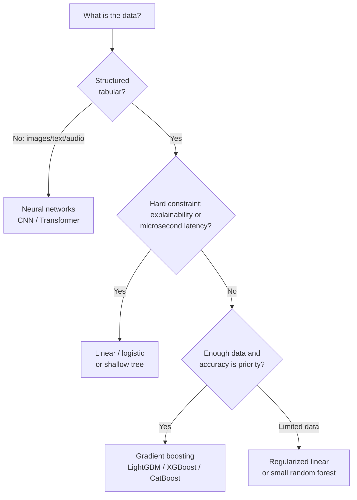

# Model Types


> **Note - What this shows:** A logical schema for implementing a model : from problem type to algorithm family to deployment
> constraints. Use it to trace how a business question narrows down to a specific model choice.

This module connects algorithm families to problem types and deployment constraints.

## Common algorithms by task

- Classification: logistic regression, random forest, gradient boosting, SVM
- Regression: linear regression, random forest regressor, XGBoost
- Forecasting: AutoARIMA, Prophet, gradient boosting variants

## Model family quick guide

| Family | Strength | Weakness | Typical use |
|---|---|---|---|
| Linear models | Fast, interpretable | Limited nonlinear capacity | Baselines, tabular regression |
| Tree ensembles | Strong tabular performance | Larger memory/latency | Structured business data |
| Kernel methods | Good margin-based behavior | Poor scaling on very large data | Medium-size classification |
| Neural networks | High representational power | Data and tuning intensive | Vision, NLP, complex patterns |

Regularized objective:

$$
\min_{\theta} \frac{1}{N}\sum_{i=1}^{N}\mathcal{L}(f_{\theta}(x_i), y_i) + \lambda R(\theta)
$$

## Representative Mathematical Forms

Logistic regression probability:

$$
\hat{p}=\sigma(\theta^T x)=\frac{1}{1+e^{-\theta^T x}}
$$

Decision boundary interpretation:

- If $\hat{p} > \tau$, predict positive class.
- Threshold $\tau$ should be tuned by business cost trade-off.

Naive Bayes decision rule:

$$
P(y\mid x_1,\dots,x_n)\propto P(y)\prod_{i=1}^{n}P(x_i\mid y)
$$

Assumption note: Naive Bayes assumes feature conditional independence.

Elastic Net objective:

$$
\min_{\theta}\frac{1}{2N}\|y-X\theta\|_2^2+\lambda\left(\alpha\|\theta\|_1+\frac{1-\alpha}{2}\|\theta\|_2^2\right)
$$

LightGBM and gradient boosting models build additive trees:

$$
F_m(x)=F_{m-1}(x)+\nu\,h_m(x)
$$

where $h_m(x)$ is the fitted weak learner at stage $m$ and $\nu$ is the learning rate.

## Practical model selection

| Constraint | Preference |
|---|---|
| Need explainability | Linear models, shallow trees |
| Best tabular accuracy | Gradient boosting (LightGBM/XGBoost/CatBoost) |
| Very low latency | Linear or optimized tree model |
| Limited training data | Simpler regularized models |
| High-dimensional sparse features | Sparse linear models (SGDClassifier, Elastic Net) |
| Mixed numeric + categorical | Tree ensembles or CatBoost (native cat handling) |

## Decision tree intuition

Decision trees split data by maximizing a purity measure at each node:

$$
\text{Gini impurity} = 1 - \sum_{k=1}^{K} p_k^2
$$

$$
\text{Information gain} = H(S) - \sum_{v} \frac{|S_v|}{|S|} H(S_v)
$$

where $H(S) = -\sum_k p_k \log_2 p_k$ is the entropy of set $S$.

Deep trees overfit. Random forests average many trees trained on bootstrap samples and random feature subsets. This reduces variance without much increase in bias.

## Gradient boosting mechanics

Gradient boosting builds trees iteratively to correct residual errors:

| Iteration | What is learned |
|---|---|
| 0 | Base prediction (mean or class frequency) |
| 1 | Tree fitted to gradient of loss (first-order residuals) |
| 2 | Tree fitted to remaining residuals |
| ... | Each step shrinks residuals towards zero |

Key hyperparameters that matter most:

| Parameter | Effect |
|---|---|
| `n_estimators` | More trees = more capacity (risk: overfit without early stopping) |
| `learning_rate` (shrinkage $\nu$) | Smaller = more conservative, usually better with more trees |
| `max_depth` / `num_leaves` | Controls tree complexity (main overfit knob) |
| `min_child_samples` | Regularises leaf size |
| `subsample` / `colsample_bytree` | Stochastic column/row sampling, reduces variance |

## Bias, variance, and complexity

- Increasing model complexity usually reduces bias but increases variance.
- Regularization, pruning, and early stopping are practical controls.

## Advanced considerations

- Calibration: predicted probabilities should reflect real event frequency.
- Fairness: evaluate group-wise performance, not only global score.
- Robustness: test under noise, missingness, and shifted distributions.

## Ensemble methods in practice

Three main ensemble patterns beyond gradient boosting:

| Method | Idea | Benefit |
|---|---|---|
| Bagging | Train models on bootstrap samples, average predictions | Reduces variance |
| Boosting | Train models sequentially, each correcting the last | Reduces bias iteratively |
| Stacking | Train a meta-model on out-of-fold predictions of base models | Often best final accuracy |

Stacking example (2-layer):

```python
from sklearn.ensemble import StackingClassifier
from sklearn.linear_model import LogisticRegression
from sklearn.ensemble import RandomForestClassifier
from lightgbm import LGBMClassifier

estimators = [
    ("rf", RandomForestClassifier(n_estimators=100)),
    ("lgbm", LGBMClassifier(n_estimators=200)),
]
stacker = StackingClassifier(estimators=estimators, final_estimator=LogisticRegression())
stacker.fit(X_train, y_train)
```

## Algorithm complexity and latency trade-off

| Model type | Inference latency | Memory footprint | Notes |
|---|---|---|---|
| Logistic regression | Very low (us) | Very small | Single matrix multiply |
| Shallow decision tree | Low (us) | Small | Tree traversal |
| Random forest (100 trees) | Medium (ms) | Medium | N tree traversals |
| LightGBM (1000 trees) | Low-medium | Medium | Leaf-wise, well optimised |
| Deep neural network | High (ms-s on CPU) | Large | Batch inference preferred |

## Deep dive: every concept, explained

This section connects the equations above to the intuition and the engineering trade-offs.

### Linear and logistic models : the interpretable baseline

A **linear model** predicts $\hat y = \theta^T x$: each feature contributes a weighted vote, and
the weight $\theta_j$ is directly readable as "effect of feature $j$". **Logistic regression**
wraps this in the **sigmoid** $\sigma(z) = \tfrac{1}{1+e^{-z}}$, which squashes any real number
into $(0,1)$ so the output is a valid probability. The model is linear in *log-odds*: a unit
change in $x_j$ multiplies the odds by $e^{\theta_j}$. This transparency is why linear models
remain the default baseline and the choice when regulators require explainable decisions.

### The decision threshold $\tau$ is a business lever, not a constant

A classifier outputs a probability; turning it into a yes/no needs a **threshold** $\tau$
(default 0.5). Moving $\tau$ trades precision against recall: a fraud team that fears missed
fraud lowers $\tau$ (catch more, accept more false alarms); a team that fears blocking good
customers raises it. The right $\tau$ is set by the *relative cost* of the two error types, not
by the algorithm : which is why thresholds are tuned after training, against business cost.

### Naive Bayes and the independence assumption

$P(y\mid x) \propto P(y)\prod_i P(x_i\mid y)$ comes straight from Bayes' rule, with one
simplifying ("naive") assumption: features are **conditionally independent given the class**.
This is almost never literally true, yet the model works surprisingly well for text/spam because
it needs very little data and training is just counting frequencies. Knowing the assumption tells
you its failure mode: strongly correlated features get their evidence double-counted.

### Trees, impurity, and why ensembles beat single trees

A **decision tree** repeatedly splits the data to make each resulting group more "pure":

- **Gini impurity** $1-\sum_k p_k^2$ and **entropy** $-\sum_k p_k\log_2 p_k$ both measure how
  mixed a node's labels are; a split is chosen to reduce this the most (**information gain**).
- A single deep tree memorizes the training data → **high variance / overfitting**.
- **Random forests** fix this by **bagging**: train many trees on bootstrap samples with random
  feature subsets and average them. Averaging decorrelated trees cancels their individual errors,
  cutting variance with little added bias.
- **Gradient boosting** takes the opposite route: build trees **sequentially**, each one fitted
  to the *residual errors* (the gradient of the loss) of the current ensemble. The update
  $F_m(x) = F_{m-1}(x) + \nu\,h_m(x)$ adds each new weak learner scaled by the **shrinkage**
  $\nu$. Small $\nu$ with many trees is the well-known recipe for top tabular accuracy.

### The boosting hyperparameters, and what they really control

- `n_estimators` is *capacity*: more trees fit finer structure but overfit without early
  stopping on a validation set.
- `learning_rate` ($\nu$) is *caution per step*: lower means each tree corrects less, so the
  ensemble generalizes better : but needs proportionally more trees.
- `max_depth` / `num_leaves` is the *main overfit knob*: it caps how complex any single tree can
  get.
- `subsample` / `colsample_bytree` inject **stochasticity** (row/column sampling) that
  decorrelates trees and reduces variance, much like a random forest does.

### Bagging vs boosting vs stacking : one sentence each

- **Bagging** reduces **variance** by averaging independent models (random forest).
- **Boosting** reduces **bias** by sequentially correcting mistakes (XGBoost/LightGBM).
- **Stacking** trains a **meta-model** on the out-of-fold predictions of diverse base models to
  exploit their complementary strengths : usually the highest accuracy, at the cost of complexity
  and latency.

### Calibration, fairness, robustness : the production-grade concerns

- **Calibration**: a model is calibrated if, among predictions of "70% probability", about 70%
  are actually positive. Boosted trees are often *mis-calibrated* and benefit from Platt scaling
  or isotonic regression before probabilities are used in decisions.
- **Fairness**: aggregate accuracy can hide that a model performs worse for a subgroup. Always
  evaluate metrics *per segment*, not just globally.
- **Robustness**: production data is noisier than training data; test the model under injected
  noise, missing fields, and shifted distributions before trusting it.

### Why latency and memory belong in model selection

The latency/footprint table above is a reminder that the "best" model is the one that meets
*all* constraints. A 1000-tree ensemble that adds 30 ms per call may break a real-time SLA, while
a single matrix-multiply logistic regression serves in microseconds. Accuracy is necessary but
never sufficient : cost, latency, interpretability, and maintainability are co-equal selection
criteria.

## A model-selection flowchart

Most tabular model choices collapse to a few questions about data type, size, and constraints.
This flow is a fast first pass; always confirm with a validated baseline.



> **Tip - Start simple, escalate with evidence:** Always fit a cheap baseline (logistic
> regression or a small tree) first. Only move to boosting or deep learning when the baseline's
> error is genuinely the bottleneck and the extra accuracy is worth the added cost and latency.

## When to actually reach for deep learning

Deep learning is not a default for tabular data; gradient boosting usually matches or beats it
there at a fraction of the cost. Reach for neural networks when one of these holds:

| Situation | Why neural nets win |
|---|---|
| Unstructured input (images, audio, raw text) | They learn the feature representation automatically |
| Very large datasets (millions+ examples) | Capacity scales with data; boosting plateaus |
| Complex feature interactions hand-engineering can't capture | Deep layers compose features hierarchically |
| Transfer learning from a pretrained model is available | Fine-tuning beats training from scratch on small data |

## Quick self-check

| # | Question | Answer |
|---|----------|--------|
| 1 | Why is logistic regression still the default baseline despite its simplicity? | It is fast, interpretable, and well-calibrated, setting a strong reference that more complex models must beat. |
| 2 | What does the shrinkage parameter $\nu$ (learning_rate) trade off in gradient boosting? | Learning speed vs accuracy/overfitting: a smaller $\nu$ needs more trees but generalizes better. |
| 3 | In one sentence each, how do bagging, boosting, and stacking differ? | Bagging trains independent models in parallel on bootstraps and averages them to cut variance; boosting trains models sequentially, each correcting the previous one's errors to cut bias; stacking trains a meta-model on base learners' predictions. |
| 4 | A boosted model outputs "0.7" but only 50% of such cases are positive: what is wrong and how do you fix it? | The model is miscalibrated; apply Platt scaling or isotonic regression to correct its probabilities. |
| 5 | Name two reasons to choose a neural network over gradient boosting. | Unstructured data such as images, text, or audio, and very large datasets where representation/transfer learning helps. |

---

## Support Vector Machines: full derivation

### The margin maximization problem

A Support Vector Machine (SVM) finds the hyperplane that separates two classes with the
**maximum margin** — the distance from the hyperplane to the nearest training point on each
side. Maximizing the margin produces better generalization: the wider the street between classes,
the less sensitive the decision boundary is to small perturbations in training data.

For a binary classification problem with labels $y_i \in \{-1, +1\}$ and feature vectors $x_i$,
the **primal formulation** is:

$$
\min_{w, b} \frac{1}{2}\|w\|^2 \quad \text{subject to} \quad y_i(w^T x_i + b) \geq 1 \quad \forall i
$$

The margin width is $\frac{2}{\|w\|}$, so minimizing $\|w\|^2$ maximizes the margin. Points
where the constraint is active ($y_i(w^T x_i + b) = 1$) are the **support vectors** — they are
the only training points that define the boundary.

### Soft-margin extension

Real data is rarely linearly separable. The **soft-margin SVM** allows constraint violations
via slack variables $\xi_i \geq 0$:

$$
\min_{w, b, \xi} \frac{1}{2}\|w\|^2 + C \sum_{i=1}^n \xi_i
\quad \text{s.t.} \quad y_i(w^T x_i + b) \geq 1 - \xi_i, \quad \xi_i \geq 0
$$

The hyperparameter $C$ controls the trade-off: large $C$ penalizes misclassification heavily
(low bias, high variance); small $C$ allows more violations for a wider margin (high bias, low
variance).

### Lagrangian and KKT conditions

Introduce Lagrange multipliers $\alpha_i \geq 0$ for each constraint. The Lagrangian is:

$$
\mathcal{L}(w, b, \alpha) = \frac{1}{2}\|w\|^2 - \sum_{i=1}^n \alpha_i \left[y_i(w^T x_i + b) - 1\right]
$$

Setting $\nabla_w \mathcal{L} = 0$ gives $w = \sum_i \alpha_i y_i x_i$, and
$\nabla_b \mathcal{L} = 0$ gives $\sum_i \alpha_i y_i = 0$.

The **KKT complementarity condition** states $\alpha_i [y_i(w^T x_i + b) - 1] = 0$. This means
$\alpha_i > 0$ only for support vectors — all other training points do not contribute to the
decision boundary.

### Dual problem

Substituting $w = \sum_i \alpha_i y_i x_i$ back into the Lagrangian and maximizing over
$\alpha$ yields the **dual formulation**:

$$
\max_{\alpha} \sum_{i=1}^n \alpha_i - \frac{1}{2} \sum_{i,j} \alpha_i \alpha_j y_i y_j x_i^T x_j
\quad \text{s.t.} \quad 0 \leq \alpha_i \leq C, \quad \sum_i \alpha_i y_i = 0
$$

The dual is a quadratic program solved efficiently by algorithms like SMO (Sequential Minimal
Optimization). Crucially, the objective depends only on **dot products** $x_i^T x_j$.

### Kernel trick

The dual's dependence on $x_i^T x_j$ enables the **kernel trick**: replace the inner product
with a kernel function $K(x, z)$ that implicitly computes the dot product in a higher-dimensional
(possibly infinite-dimensional) feature space $\phi$:

$$
K(x, z) = \phi(x)^T \phi(z)
$$

This allows SVMs to learn non-linear decision boundaries without ever explicitly computing $\phi$.

**Common kernels:**

| Kernel | Formula | When to use |
|---|---|---|
| Linear | $x^T z$ | Linearly separable, high-dimensional sparse features |
| Polynomial (degree $d$) | $(x^T z + c)^d$ | Moderate nonlinearity, image features |
| RBF (Gaussian) | $\exp\!\left(-\gamma \|x - z\|^2\right)$ | General-purpose nonlinear classification |
| Sigmoid | $\tanh(\kappa x^T z + c)$ | Rarely preferred; neural-network analogy |

The **RBF kernel** is the most common default for nonlinear SVMs. The hyperparameter
$\gamma = \frac{1}{2\sigma^2}$ controls the width of the Gaussian: high $\gamma$ means the
kernel decays quickly (local decision boundary, high variance); low $\gamma$ means the boundary
is smooth and global (lower variance).

```python
from sklearn.svm import SVC
from sklearn.preprocessing import StandardScaler
from sklearn.pipeline import Pipeline

# SVM is sensitive to scale: always standardize
svm_pipeline = Pipeline([
    ("scaler", StandardScaler()),
    ("svm", SVC(kernel="rbf", C=1.0, gamma="scale", probability=True))
])
svm_pipeline.fit(X_train, y_train)
print(svm_pipeline.score(X_test, y_test))
```

### When SVM beats tree ensembles

| Scenario | SVM advantage |
|---|---|
| High-dimensional sparse features (text, genomics) | Dual formulation is efficient in feature-sparse space |
| Small-to-medium datasets (< 50k rows) | Maximum-margin solution generalizes well with limited data |
| Non-linear boundary with RBF kernel | Kernel implicitly enriches feature space cheaply |
| Need a principled probabilistic output | Platt scaling on top of SVM margins |

> **Note - Scaling is mandatory:** SVMs minimize $\|w\|^2$; a feature with magnitude 1000
> dominates one with magnitude 1. Always standardize before fitting an SVM.

---

## Bayesian methods

### Bayesian linear regression

In classical linear regression, $\theta$ is a point estimate. **Bayesian linear regression**
treats $\theta$ as a random variable with a prior distribution, then updates it via Bayes'
rule given the observed data:

$$
P(\theta \mid X, y) = \frac{P(y \mid X, \theta)\, P(\theta)}{P(y \mid X)}
$$

With a Gaussian prior $\theta \sim \mathcal{N}(0, \sigma_\theta^2 I)$ and Gaussian likelihood,
the posterior is also Gaussian (conjugacy), and the posterior mean reduces to the ridge
regression estimate:

$$
\hat{\theta}_{\text{MAP}} = (X^T X + \lambda I)^{-1} X^T y, \quad \lambda = \frac{\sigma^2}{\sigma_\theta^2}
$$

The **posterior predictive distribution** for a new point $x^*$ is:

$$
p(y^* \mid x^*, X, y) = \mathcal{N}(x^{*T}\hat{\theta},\; \sigma^2 + x^{*T}(X^T X + \lambda I)^{-1} x^*)
$$

The second term in the variance is the **epistemic uncertainty** — it grows when $x^*$ is far
from training data. This is what frequentist point estimates cannot provide.

### Uncertainty quantification

The Bayesian framework naturally answers: "How confident are we in this prediction?" rather than
just "What is our best prediction?" This matters enormously in:

- **Medical decisions**: a prediction with high uncertainty should trigger human review.
- **Finance**: model uncertainty informs position sizing.
- **Active learning**: query the points where the model is most uncertain.

### Gaussian processes (high level)

A **Gaussian process (GP)** generalizes Bayesian linear regression to non-parametric function
estimation. A GP defines a distribution over *functions*, where any finite collection of
function values is jointly Gaussian:

$$
f(x) \sim \mathcal{GP}(m(x),\; k(x, x'))
$$

where $m(x)$ is the mean function (often 0) and $k(x, x')$ is the kernel (covariance) function
specifying how function values at nearby points are correlated.

The posterior GP given observations $(X, y)$ gives both a mean prediction and a confidence
interval at every input point. GPs are exact for small datasets (GP inference scales as $O(n^3)$)
and are the gold standard for Bayesian optimization of expensive black-box functions
(e.g. hyperparameter search).

### When Bayesian methods outperform frequentist approaches

| Situation | Why Bayesian wins |
|---|---|
| Small datasets | Prior regularizes and prevents overfitting |
| Need calibrated uncertainty | Posterior gives probability distribution, not just point estimate |
| Sequential decision-making | Posterior updates as new data arrives (online learning) |
| Hyperparameter optimization | Bayesian optimization (GP surrogate) is more sample-efficient than grid search |

**Computational cost** is the key limitation: exact Bayesian inference is often intractable for
large models. Variational inference and MCMC methods provide approximations, but they add
implementation complexity and computational overhead. For most large-scale tabular problems,
gradient boosting with Platt-scaled probabilities is a practical substitute.

---

## Neural networks preview

### What an MLP adds over logistic regression

A **multi-layer perceptron (MLP)** extends logistic regression by stacking multiple linear
transformations interleaved with non-linear activation functions:

$$
h^{(1)} = \sigma(W^{(1)} x + b^{(1)}), \quad
h^{(2)} = \sigma(W^{(2)} h^{(1)} + b^{(2)}), \quad \ldots
$$

where $\sigma$ is a non-linear activation (ReLU, sigmoid, tanh). Each layer learns a new
*representation* of the input. Logistic regression is the special case of depth 0 hidden layers:
it can only learn a linear boundary. An MLP with one hidden layer can learn any boundary that is
expressible as a finite composition of linear thresholds.

### Universal approximation theorem

The **Universal Approximation Theorem** (Cybenko, 1989; Hornik, 1991) states that a feedforward
network with at least one hidden layer and a sufficiently large number of hidden units can
approximate any continuous function on a compact subset of $\mathbb{R}^n$ to arbitrary
precision, given enough capacity.

This does **not** mean:

- That neural networks are always the right choice.
- That the network can be trained efficiently to find that approximation.
- That the approximation generalizes to unseen data without sufficient training examples.

For tabular data, gradient boosting typically achieves competitive or superior performance at
far lower computational cost. The universal approximation guarantee becomes practically relevant
for unstructured data (images, audio, text) where hand-crafted features cannot capture the
necessary structure.

> **Tip - Full neural network coverage:** Deep architectures, backpropagation, convolutional
> networks, transformers, training regularization, and Azure ML GPU training are covered in full
> in the [Neural Networks module](05-neural-networks.md).

---

## Anomaly detection models

Anomaly detection identifies observations that deviate significantly from the expected pattern.
It is a fundamentally different problem from supervised classification: in most real-world
deployments, labeled anomaly examples are scarce or absent entirely.

### Isolation Forest

**Isolation Forest** (Liu et al., 2008) detects anomalies by random partitioning. The key
insight: anomalies are rare and different, so they are isolated by fewer random splits than
normal points.

**Algorithm:**

1. Build $T$ isolation trees, each by randomly selecting a feature and a random split value
   within the feature's range.
2. For each sample, record the path length $h(x)$ (number of splits) to isolate it.
3. The **anomaly score** normalizes path length against the expected path length $c(n)$ for a
   binary search tree over $n$ samples:

$$
s(x, n) = 2^{-\frac{\mathbb{E}[h(x)]}{c(n)}}, \quad c(n) = 2H(n-1) - \frac{2(n-1)}{n}
$$

where $H(k) = \ln k + 0.5772$ (Euler-Mascheroni constant). Scores near 1 indicate anomalies;
near 0.5 indicate normal points.

```python
from sklearn.ensemble import IsolationForest
import numpy as np

iso = IsolationForest(n_estimators=100, contamination=0.05, random_state=42)
iso.fit(X_train)

scores = iso.decision_function(X_test)   # higher = more normal
labels = iso.predict(X_test)             # +1 = normal, -1 = anomaly
anomaly_count = (labels == -1).sum()
print(f"Detected anomalies: {anomaly_count} ({anomaly_count/len(labels)*100:.1f}%)")
```

### One-Class SVM

**One-Class SVM** learns the smallest hypersphere (or half-space in kernel space) enclosing
the training data. Points outside the boundary are flagged as anomalies.

```python
from sklearn.svm import OneClassSVM
from sklearn.preprocessing import StandardScaler
from sklearn.pipeline import Pipeline

ocsvm = Pipeline([
    ("scaler", StandardScaler()),
    ("ocsvm", OneClassSVM(nu=0.05, kernel="rbf", gamma="scale"))
])
ocsvm.fit(X_train)
preds = ocsvm.predict(X_test)   # +1 = normal, -1 = anomaly
```

Best used when the normal data has a compact, relatively well-defined structure in feature space.
Scales poorly with large datasets (quadratic in training examples).

### Local Outlier Factor

**Local Outlier Factor (LOF)** compares the local density of each point to the densities of
its $k$ nearest neighbors. A point in a sparse neighborhood surrounded by dense neighbors is
anomalous.

$$
\text{LOF}_k(x) = \frac{\frac{1}{|N_k(x)|}\sum_{o \in N_k(x)} \text{lrd}_k(o)}{\text{lrd}_k(x)}
$$

where $\text{lrd}_k$ is the local reachability density. LOF > 1 indicates the point is less
dense than its neighbors (anomalous).

```python
from sklearn.neighbors import LocalOutlierFactor

lof = LocalOutlierFactor(n_neighbors=20, contamination=0.05)
preds = lof.fit_predict(X_test)   # +1 = normal, -1 = anomaly
```

LOF is transductive (no `predict` on unseen data); use `novelty=True` for an inductive version.

### Autoencoder reconstruction error

An **autoencoder** is a neural network trained to reconstruct its input through a bottleneck
layer. Normal data reconstructs well; anomalies have high reconstruction error because the
bottleneck has not learned to represent their unusual structure.

```python
import torch
import torch.nn as nn

class Autoencoder(nn.Module):
    def __init__(self, input_dim: int, latent_dim: int):
        super().__init__()
        self.encoder = nn.Sequential(
            nn.Linear(input_dim, 64), nn.ReLU(),
            nn.Linear(64, latent_dim)
        )
        self.decoder = nn.Sequential(
            nn.Linear(latent_dim, 64), nn.ReLU(),
            nn.Linear(64, input_dim)
        )

    def forward(self, x):
        return self.decoder(self.encoder(x))

# Anomaly score = mean squared reconstruction error per sample
def reconstruction_error(model, X_tensor):
    with torch.no_grad():
        X_hat = model(X_tensor)
        return ((X_tensor - X_hat) ** 2).mean(dim=1)
```

### Comparison and evaluation challenge

| Method | Training data | Scales to large data | Interpretability | Best for |
|---|---|---|---|---|
| Isolation Forest | Normal only | Yes ($O(n \log n)$) | Medium (path length) | General-purpose, fast baseline |
| One-Class SVM | Normal only | No ($O(n^2)$) | Low | Compact normal distributions |
| LOF | Normal only | Medium | Medium (density ratio) | Density-based anomalies |
| Autoencoder | Normal only | Yes (GPU) | Low | High-dimensional, sequential data |

**Evaluation challenge:** Without labels, standard classification metrics are undefined. Practical
approaches include: (1) expert review of a sample of flagged anomalies, (2) precision at top-$k$
flagged examples, (3) retrospective labeling from incident records for a historical holdout.

> **Note - Contamination hyperparameter:** Most methods require an estimate of the anomaly rate
> (`contamination`). If this is unknown, sweep over `[0.01, 0.05, 0.10]` and review the
> flagged examples with domain experts to calibrate.

---

## Survival analysis

### Time-to-event modeling

Survival analysis studies *how long until an event occurs*. Canonical applications include:
time to customer churn, time to machine failure, time to loan default, and time to patient
relapse. The "event" might be death, failure, or conversion — and the key challenge is
**censoring**.

### Censoring

A sample is **right-censored** if the event has not occurred by the end of the observation
window. The customer who signed up 2 months ago and has not yet churned is censored: we know
they survived at least 2 months, but we do not know when (or if) they will churn.

Discarding censored examples — treating them as non-events — biases all estimates. Survival
models handle censoring explicitly by incorporating the fact that these observations contribute
"survived at least $t$" information.

### Kaplan-Meier estimator

The **Kaplan-Meier (KM) estimator** is the nonparametric estimate of the survival function
$S(t) = P(T > t)$, i.e. the probability that an individual survives beyond time $t$:

$$
\hat{S}(t) = \prod_{t_i \leq t} \left(1 - \frac{d_i}{n_i}\right)
$$

where $d_i$ is the number of events at time $t_i$ and $n_i$ is the number of individuals at
risk just before $t_i$. The KM curve provides a visual summary of survival over time for a
cohort, and the log-rank test compares curves across groups.

```python
from lifelines import KaplanMeierFitter
import matplotlib.pyplot as plt

kmf = KaplanMeierFitter()
kmf.fit(durations=df["tenure_days"], event_observed=df["churned"])

kmf.plot_survival_function(ci_show=True, figsize=(9, 5))
plt.title("Kaplan-Meier Survival Curve: Customer Churn")
plt.xlabel("Days since signup")
plt.ylabel("Survival probability S(t)")
plt.tight_layout()
plt.show()

print(f"Median survival time: {kmf.median_survival_time_} days")
```

### Cox proportional hazards model

The **Cox model** is the most widely used semi-parametric regression model for survival data.
It models the **hazard function** — the instantaneous rate of the event at time $t$ given
survival to $t$:

$$
h(t \mid x) = h_0(t) \exp(\beta^T x)
$$

where $h_0(t)$ is the **baseline hazard** (left unspecified, making the model semi-parametric)
and $\exp(\beta^T x)$ is the covariate effect. The model is "proportional hazards" because the
hazard ratio between two individuals is constant over time:

$$
\frac{h(t \mid x_1)}{h(t \mid x_2)} = \frac{\exp(\beta^T x_1)}{\exp(\beta^T x_2)} = \exp(\beta^T(x_1 - x_2))
$$

Coefficients $\beta$ are estimated by maximizing the **partial likelihood** (Cox, 1972), which
removes $h_0(t)$ from the estimation.

```python
from lifelines import CoxPHFitter

cox = CoxPHFitter(penalizer=0.1)
cox.fit(df[["tenure_days", "churned", "feature_1", "feature_2", "feature_3"]],
        duration_col="tenure_days",
        event_col="churned")

cox.print_summary()

# Predict expected survival time for new customers
cox.predict_median(df_new[["feature_1", "feature_2", "feature_3"]])
```

**Interpreting coefficients:** $e^{\beta_j}$ is the **hazard ratio** for a one-unit increase in
feature $j$. $e^{\beta_j} = 1.5$ means a 50% higher instantaneous event rate — a 50% higher
risk at any time point.

### Applications

| Domain | Outcome event | Censoring reason |
|---|---|---|
| SaaS / e-commerce | Subscription cancellation | Still active at analysis date |
| Predictive maintenance | Machine failure | Machine still running |
| Credit risk | Loan default | Loan paid off early |
| Clinical trials | Patient relapse | Lost to follow-up or study end |

---

## Model selection framework: a statistical perspective

Choosing between models based on a single holdout score is unreliable: the difference may be
due to chance rather than genuine superiority. Statistical tests quantify whether observed
performance differences exceed what random variation can explain.

### Paired t-test for model comparison

When two models produce per-fold scores from the same cross-validation folds, use the
**paired t-test** to test whether the mean difference is significantly different from zero.

```python
from scipy import stats
import numpy as np

# 5-fold CV AUC scores for two models
model_a_scores = np.array([0.812, 0.819, 0.804, 0.821, 0.809])
model_b_scores = np.array([0.825, 0.831, 0.818, 0.835, 0.822])

t_stat, p_value = stats.ttest_rel(model_a_scores, model_b_scores)
print(f"t={t_stat:.3f}, p={p_value:.4f}")
# p < 0.05 → reject H0: models perform equally
```

> **Note - 5x2 CV test:** With only 5 folds, the paired t-test has low power. The **5×2 CV
> paired t-test** (Dietterich, 1998) runs 5 independent 2-fold splits and uses a
> variance-adjusted statistic with better Type I error control.

### McNemar's test for classifiers

When comparing two classifiers on the same test set, **McNemar's test** uses the contingency
table of disagreements rather than individual accuracy scores. It is more powerful than
comparing accuracy directly because it conditions on the cases where models disagree.

```python
from statsmodels.stats.contingency_tables import mcnemar
import numpy as np

# n01: A wrong, B correct; n10: A correct, B wrong
n01 = ((preds_a == 0) & (preds_b == 1)).sum()
n10 = ((preds_a == 1) & (preds_b == 0)).sum()

result = mcnemar([[n10, n01], [n01, n10]], exact=False, correction=True)
print(f"McNemar statistic={result.statistic:.3f}, p={result.pvalue:.4f}")
```

### DeLong test for AUC comparison

When comparing ROC-AUC scores, the **DeLong test** accounts for the correlation between AUC
estimates derived from the same test set — a critical correction that naive z-tests ignore.

```python
# Using the scikit-learn compatible implementation from 'compare_auc_delong_xu'
# Install: pip install scipy
# Reference: DeLong et al. (1988)
from scipy import stats

# Approximate: use bootstrap to estimate AUC variance
def bootstrap_auc_diff(y_true, prob_a, prob_b, n_boot=1000, seed=42):
    from sklearn.metrics import roc_auc_score
    rng = np.random.default_rng(seed)
    diffs = []
    for _ in range(n_boot):
        idx = rng.integers(0, len(y_true), len(y_true))
        diffs.append(roc_auc_score(y_true[idx], prob_a[idx]) -
                     roc_auc_score(y_true[idx], prob_b[idx]))
    diffs = np.array(diffs)
    p = 2 * min((diffs > 0).mean(), (diffs < 0).mean())
    return np.mean(diffs), p

diff, p = bootstrap_auc_diff(y_test, probs_a, probs_b)
print(f"AUC difference: {diff:.4f}, p-value: {p:.4f}")
```

### Multiple comparisons problem

When comparing $k > 2$ models, each pairwise test at $\alpha = 0.05$ has a 5% false positive
rate. With 10 models, there are $\binom{10}{2} = 45$ pairwise tests — at $\alpha=0.05$, you
expect $0.05 \times 45 \approx 2$ false discoveries even if all models are equal.

**Corrections:**

- **Bonferroni**: divide $\alpha$ by the number of tests. Conservative; safe.
- **Holm-Bonferroni**: stepwise version of Bonferroni; more powerful.
- **Friedman test + Nemenyi post-hoc**: designed for comparing multiple classifiers across
  datasets; the standard in ML benchmarking.

### Why you need holdout data

Cross-validation scores estimate expected performance but are still influenced by the choices
made during model development. Every time you look at CV scores and make a decision (feature,
algorithm, hyperparameter), the CV scores become slightly optimistic. A **held-out test set**
that is never examined until the final model is chosen provides the only truly unbiased estimate.

> **Note - No peeking:** The test set must be used exactly once. If you tune based on test
> set feedback and then report the test score, you have implicitly overfit to the test set
> and the reported score is no longer unbiased.

---

## Full model comparison: from simple to complex

The table below summarizes the major algorithm families on dimensions that matter for real
deployment decisions. Complexity is expressed in $n$ (training examples) and $p$ (features).

| Algorithm | Train complexity | Inference complexity | Memory | Interpretability | Min data | Typical rank (tabular) |
|---|---|---|---|---|---|---|
| Logistic Regression | $O(np)$ per iteration | $O(p)$ | Very small | High (coefficients) | Low (100s) | Baseline |
| Naive Bayes | $O(np)$ | $O(p)$ | Very small | High (per-class probs) | Very low | Below baseline on complex data |
| Decision Tree (single) | $O(np \log n)$ | $O(\log n)$ | Small | High (tree rules) | Low | Below RF/GBT |
| Random Forest | $O(T \cdot np \log n)$ | $O(T \log n)$ | Medium | Medium (importance) | Medium (1k+) | Good |
| Gradient Boosting (GBT) | $O(T \cdot np \log n)$ | $O(T \log n)$ | Medium | Medium (importance) | Medium (1k+) | Best on tabular |
| SVM (linear kernel) | $O(np)$ – $O(n^2p)$ | $O(p)$ | Small–medium | Low | Low–medium | Competitive (sparse) |
| SVM (RBF kernel) | $O(n^2)$ – $O(n^3)$ | $O(n_{\text{sv}} \cdot p)$ | Large for big data | Low | Low | Competitive (small data) |
| Isolation Forest | $O(T \cdot n \log n)$ | $O(T \log n)$ | Small | Medium | Low (unsupervised) | Anomaly only |
| MLP (shallow) | $O(n \cdot p \cdot h)$ per epoch | $O(p \cdot h)$ | Medium | Low | Medium (10k+) | Below GBT on tabular |
| Deep Neural Network | $O(n \cdot \text{params})$ per epoch | $O(\text{params})$ | Large | Very low | High (100k+) | Best on unstructured |
| Cox PH Model | $O(n^2)$ naive | $O(p)$ | Small | High (hazard ratios) | Medium | Survival tasks |
| Gaussian Process | $O(n^3)$ | $O(n^2)$ | Large | High (posterior) | Very low | Small data + uncertainty |

**Key takeaways:**

- For **tabular data with > 1,000 examples and no latency constraint**, gradient boosting
  (LightGBM / XGBoost / CatBoost) is the default best starting point.
- For **high-dimensional sparse features** (text, genomics), linear models and SVMs often
  match or beat tree methods at a fraction of the memory cost.
- For **interpretability requirements**, logistic regression and shallow decision trees
  remain the only options that produce human-readable explanations by construction.
- For **uncertainty quantification**, Bayesian methods and Gaussian processes are necessary;
  calibrated GBT probabilities are an acceptable approximation for most applications.
- For **survival / time-to-event** outcomes, Cox PH or accelerated failure time (AFT) models
  are the correct tool; applying standard classifiers discards censoring information.
- **Deep learning dominates only on unstructured data** or when dataset scale exceeds what
  tree methods can effectively exploit (typically > 1 million labeled examples for tabular).

> **Tip - Rank on your data, not on benchmarks:** Published benchmark rankings shift
> significantly across dataset types and sizes. Always run a fast baseline (logistic
> regression or a 100-tree random forest) on your own data before committing to a complex
> model. The cost of running a baseline is an hour; the cost of training a deep net on the
> wrong problem is weeks.
