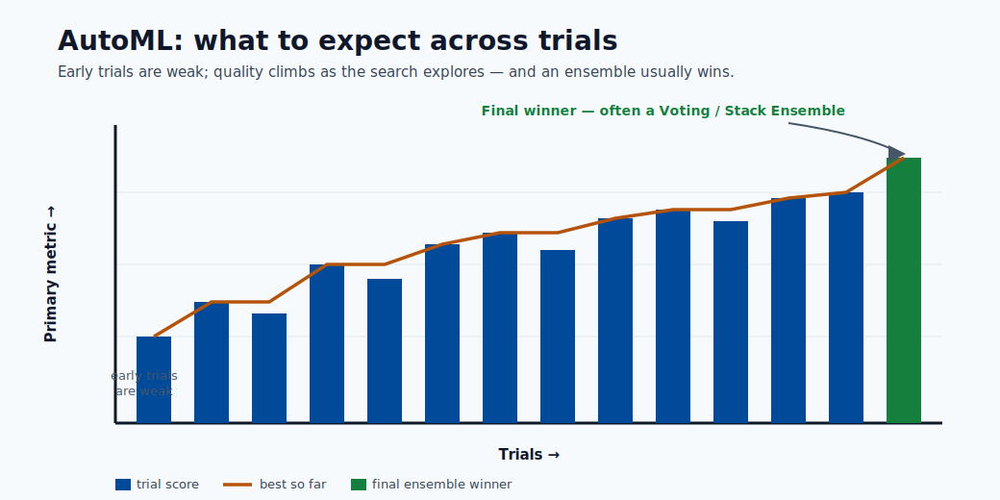

# Training and AutoML

This module explains how models are trained in Azure ML, what AutoML does in the backend,
and how to move from baseline experiments to reliable model selection.

## Learning goals

1. Understand manual training vs AutoML.
2. Configure an AutoML run with useful constraints.
3. Interpret run outputs and choose a production candidate.


> **Note - What this shows:** The AutoML loop: try algorithm + hyperparameter combinations, score each with cross-validation,
> and rank by the primary metric. AutoML does not invent algorithms : it allocates a fixed search
> budget across known ones.



> **Tip - What to expect:** Early trials are weak baselines; quality climbs as the search explores, and the final winner is
> often a voting/stack ensemble of the best runs. Budget enough iterations before trusting the
> leaderboard.


> **Note - What this shows:** The detailed steps of an ML-based time-series forecast. Note the *rolling-origin* validation:
> plain k-fold would leak future values, so temporal data is validated by advancing through time.

## AutoML workflow

1. Choose task type
2. Provide training data
3. Select compute target
4. Set metric and constraints
5. Submit run and compare candidates

## What AutoML does behind the scenes

- Tries multiple algorithms and hyperparameters.
- Runs cross-validation/validation scoring.
- Applies feature transformations when configured.
- Logs metrics, artifacts, and lineage.
- Returns best run/model based on chosen primary metric.

### AutoML algorithm candidates (tabular classification)

AutoML typically evaluates some or all of the following:

| Candidate model | Notes |
|---|---|
| LightGBM | Often best on tabular; fast and memory-efficient |
| XGBoost | Strong competition; more hyperparams |
| LogisticRegression | Fast baseline; reveals if linear structure is sufficient |
| RandomForest | Good stability, less tuning |
| ExtraTrees | Faster training variant of random forest |
| Voting Ensemble | AutoML-specific ensemble of top runs |
| Stack Ensemble | AutoML-specific meta-model over top runs |

The `VotingEnsemble` or `StackEnsemble` at the end is AutoML's way of squeezing extra performance beyond single models, they are often the final winner.

## AutoML vs manual training: when to use which

AutoML is a powerful default, but it is not always the right tool. The choice is about how much
domain control you need versus how much search you want automated.

| Use AutoML when | Prefer manual training when |
|---|---|
| You need a strong baseline fast | You have a specific architecture in mind (e.g. a custom neural net) |
| The problem is standard tabular/forecasting | You need full control of the training loop or loss |
| You want leakage-safe featurization handled for you | You require bespoke feature engineering or custom CV logic |
| You want many algorithms compared objectively | Compute budget is tight and the model family is already decided |

In practice many teams use both: AutoML to discover a strong candidate and validate the
achievable accuracy, then a hand-built pipeline to refine, optimize latency, and productionize it.

## Compute and performance

Performance relation:

$$
\text{Performance}=\frac{1}{\text{Execution Time}}
$$
Execution time is affected by:

- Data volume and feature dimensionality
- Algorithm complexity
- Compute size (CPU/GPU, memory)
- Parallelization and max concurrent iterations

## Minimal AutoML configuration checklist

| Setting | Why it matters |
|---|---|
| task | Defines candidate model family |
| primary metric | Aligns optimization with business objective |
| iterations/timeout | Controls search budget |
| cross-validation | Improves robustness of ranking |
| featurization settings | Impacts model quality and reproducibility |

### Minimal AutoML code example (Azure SDK v2)

```python
from azure.ai.ml import MLClient, automl
from azure.ai.ml.entities import AmlCompute
from azure.identity import DefaultAzureCredential

ml_client = MLClient(
    credential=DefaultAzureCredential(),
    subscription_id="<sub-id>",
    resource_group_name="<rg>",
    workspace_name="<ws>"
)

classification_job = automl.classification(
    compute="cpu-cluster",
    experiment_name="fraud-automl",
    training_data=ml_client.data.get("fraud-train", version="1"),
    target_column_name="is_fraud",
    primary_metric="AUC_weighted",
    n_cross_validations=5,
    enable_model_explainability=True,
    timeout_minutes=60,
    max_concurrent_trials=4,
)

returned_job = ml_client.jobs.create_or_update(classification_job)
```

Key flags:
- `AUC_weighted` is safer than `accuracy` for fraud (imbalanced classes).
- `enable_model_explainability=True` generates SHAP-based feature importance.
- `max_concurrent_trials` should match compute cluster core count.

## Common mistakes

- Choosing accuracy for imbalanced classification.
- Running too few iterations and over-trusting the first winner.
- Ignoring latency/cost while selecting best score.

## Search-space design (important)

AutoML quality depends on search space, not only iteration count.

| Parameter | Too narrow | Too wide | Practical approach |
|---|---|---|---|
| Model families | Misses better model type | Wastes budget | Start broad, prune after baseline |
| Learning rate | Can miss convergence sweet spot | Slow exploration | Use log-scale ranges |
| Tree depth/leaves | Underfit risk | Overfit + latency risk | Constrain by latency budget |
| Regularization | Under-regularized noise fit | Over-regularized underfit | Tune with CV and holdout checks |

## Validation strategy choices

| Context | Validation approach |
|---|---|
| Standard tabular | K-fold cross-validation |
| Temporal forecasting | Rolling-origin validation |
| Grouped entities | GroupKFold-like entity splits |

## Experiment tracking fields to persist

Minimum metadata for reproducibility:

- Run ID, parent run ID
- Code snapshot/version
- Dataset asset version
- Environment version
- Feature set/hash
- Hyperparameters
- Metrics by split
- Output model URI/version

## Candidate selection policy

Select deployment candidate using multi-objective criteria:

$$
\text{Score}_{deploy}=w_1\cdot\text{Quality}-w_2\cdot\text{Latency}-w_3\cdot\text{Cost}+w_4\cdot\text{Stability}
$$

where weights $w_i$ reflect business priorities.

## Promotion gates (dev to prod)

1. Offline metric threshold met.
2. Inference latency under SLO on representative hardware.
3. Security scan and dependency policy passed.
4. Explainability/fairness review completed.
5. Approval workflow sign-off recorded.

## Quick self-check

| # | Question | Answer |
|---|----------|--------|
| 1 | Why is primary metric choice critical in AutoML? | It defines the objective AutoML optimizes; the wrong metric (e.g. accuracy on imbalanced data) makes AutoML select the wrong model. |
| 2 | What trade-off does max concurrent iterations control? | Parallelism vs cost and search quality: more concurrency finishes faster but uses more compute and gives the optimizer fewer prior results to learn from. |
| 3 | Why should deployment constraints be considered during model selection? | The model must meet production latency, size, and interpretability limits; the most accurate model is useless if it cannot be deployed within those constraints. |

## Deep dive: every concept, explained

This section explains what AutoML automates, what it does *not*, and why each control exists.

### What AutoML actually searches

AutoML is structured search over three coupled choices: **featurization** (how raw columns
become model inputs), **algorithm** (which model family), and **hyperparameters** (the settings
within that family). Conceptually it is solving an outer optimization:

$$
\min_{a \in \text{algorithms},\; h \in \text{hyperparams}(a)}\; \text{ValidationLoss}(a, h)
$$

It does not invent new algorithms : it intelligently *allocates a fixed budget* of trials across
known ones, using results so far to decide what to try next. This is why "search-space design"
matters more than raw iteration count: a good space contains the winning region; a bad one never
does.

### Featurization, demystified

When enabled, AutoML automatically handles missing-value imputation, categorical encoding,
text vectorization, and feature scaling : the same steps from the data-preparation module, applied
consistently inside cross-validation folds so they do not leak. The benefit is leakage-safe,
reproducible preprocessing; the cost is less manual control, which is why `featurization` settings
are explicit and logged for reproducibility.

### Cross-validation inside AutoML and why it ranks models fairly

`n_cross_validations=5` means every candidate is scored on 5 rotating validation folds and the
results averaged. This reduces the chance that one lucky split crowns the wrong model. For
**temporal** data, plain k-fold leaks the future, so **rolling-origin** validation is used
instead; for **grouped** entities (e.g. multiple rows per customer), group-aware splits prevent
the same entity appearing in both train and validation.

### Primary metric: aligning the optimizer with the business

AutoML optimizes exactly one **primary metric**, so choosing it *is* choosing what "best" means.
On imbalanced problems, `accuracy` is misleading (a model predicting "never fraud" scores 99%),
so `AUC_weighted` or `average_precision` are used instead. The lesson generalizes: the optimizer
will ruthlessly exploit whatever metric you give it, so the metric must encode the real cost
structure.

### Ensembles: why the winner is often a `VotingEnsemble`

After trying individual models, AutoML builds two meta-models:

- **Voting ensemble** : averages the predictions of the top runs. Diverse models make
  *uncorrelated* errors, so the average is more accurate and stable than any single member.
- **Stack ensemble** : trains a small meta-model on the base models' out-of-fold predictions to
  learn *how* to combine them.

These usually win because combining diverse learners reduces variance : the same bagging/stacking
principle from the model-types module, applied automatically.

### Concurrency, budget, and the cost/time trade-off

`max_concurrent_trials` controls how many candidates train in parallel; setting it to the
cluster's node count keeps compute busy and shortens wall-clock time, but does **not** reduce
total compute cost (you pay for the same number of trials, just faster). `timeout_minutes` and
iteration caps bound the search **budget** : the central knob trading off thoroughness against
time and money.

### The multi-objective selection score, explained

The candidate score $\text{Score}_{deploy}=w_1\text{Quality}-w_2\text{Latency}-w_3\text{Cost}+w_4\text{Stability}$
formalizes a real-world truth: the deployable model maximizes quality *and* stability while being
penalized for latency and cost. The weights $w_i$ encode business priorities : a real-time API
weights latency heavily; a nightly batch job weights it near zero. AutoML ranks by the primary
metric, but the *human* promotion decision should use this fuller objective, which is exactly why
the **promotion gates** check latency-under-SLO, security, and fairness, not just offline score.

### Why experiment tracking metadata is non-negotiable

The list of fields to persist (run ID, data version, environment version, feature hash,
hyperparameters, per-split metrics, model URI) is what makes a result **reproducible** and
**auditable**. If you cannot answer "which data, code, and environment produced this model?", you
cannot debug a regression, pass an audit, or safely retrain : so this metadata is the backbone of
MLOps, not optional bookkeeping.

## Hyperparameter optimization (HPO) in depth

Hyperparameter optimization is the process of searching for the configuration of a model (learning
rate, tree depth, regularization strength, etc.) that minimizes validation loss. Unlike model
parameters (weights learned during gradient descent), hyperparameters are set *before* training
and cannot be learned by the standard optimization algorithm.

### Grid search, random search, and why random wins

**Grid search** enumerates every combination of a discrete hyperparameter grid. If you have 5
values for learning rate and 5 for regularization, grid search runs 25 trials. For 10 hyperparameters
with 5 values each, it runs $5^{10} \approx 10^7$ trials: computationally infeasible.

**Random search** (Bergstra & Bengio, 2012) samples each hyperparameter independently from a
distribution over its range. The critical insight is **low effective dimensionality**: in practice,
model performance is sensitive to only a small number of hyperparameters at a time. When 8 of 10
hyperparameters barely affect the loss, grid search wastes most of its budget varying those 8,
whereas random search covers the 2 that matter across many more distinct values.

> **Note - Bergstra & Bengio result:** Random search matches or beats grid search in the same number of trials
> because it never "wastes" a trial by duplicating a value of an unimportant hyperparameter.
> For a budget of $n$ trials, random search explores $n$ distinct values of every hyperparameter;
> grid search explores only $n^{1/d}$ values per dimension in a $d$-dimensional grid.

| Method | Complexity | Handles continuous ranges | Parallelizable | Adapts to results |
|---|---|---|---|---|
| Grid search | Exponential in $d$ | No (requires discretization) | Yes | No |
| Random search | Linear in budget | Yes | Yes | No |
| Bayesian optimization | Sub-linear in practice | Yes | Partially | Yes |

**Practical rule:** For budgets under ~20 trials and fewer than 4 hyperparameters, grid search is
fine. For larger spaces, use random search as the baseline and Bayesian as the upgrade.

### Bayesian optimization

Bayesian optimization is **sequential model-based optimization (SMBO)**. It maintains a
probabilistic **surrogate model** of the true objective function (expensive to evaluate) and uses
it to decide *where to sample next* by balancing exploration (trying uncertain regions) and
exploitation (trying regions predicted to be good).

**Gaussian process (GP) surrogate:**

A GP places a distribution over functions. After observing evaluations at points
$x_1, \ldots, x_n$, the GP posterior gives a predicted mean $\mu(x)$ and uncertainty $\sigma(x)$
at any new point $x$. This uncertainty is the key asset: it quantifies where the model is
confident vs. where it needs more data.

**Acquisition functions** guide the next query point. The most common is **Expected Improvement (EI)**:

$$
\text{EI}(x) = \mathbb{E}[\max(f(x) - f^+, 0)]
$$

where $f^+$ is the best observed value so far. EI is high where the surrogate predicts a value
above $f^+$ or where uncertainty is high. Evaluated in closed form under the GP:

$$
\text{EI}(x) = (\mu(x) - f^+)\Phi(Z) + \sigma(x)\phi(Z), \quad Z = \frac{\mu(x) - f^+}{\sigma(x)}
$$

where $\Phi$ is the standard normal CDF and $\phi$ is the PDF.

**Tree-structured Parzen Estimator (TPE)** is an alternative used by Hyperopt and Azure ML. Instead
of fitting a single GP, TPE models two densities:

- $l(x)$: distribution of hyperparameters that produced *good* results (below a quantile threshold $\gamma$)
- $g(x)$: distribution of hyperparameters that produced *bad* results

The acquisition is maximized by sampling from $l(x)/g(x)$, which is fast even for high-dimensional,
conditional, and categorical spaces — making TPE practical where GP struggles.

> **Tip - When Bayesian beats random:** The advantage of Bayesian optimization grows with evaluation cost. When a
> single trial takes hours (deep learning training), saving 30% of trials matters enormously.
> When a trial takes seconds, random search is often sufficient and simpler.

**How Azure ML HPO uses Bayesian optimization:**

Azure ML HyperDrive supports `BayesianParameterSampling`, which uses TPE internally. After each
completed trial the surrogate is updated and the next candidate is chosen to maximize EI. Azure ML
runs the acquisition step server-side so the user only specifies the search space and budget.

### HyperDrive in Azure ML

HyperDrive is Azure ML's native HPO service. It wraps any training script and manages the trial
lifecycle: sampling, launching, monitoring, early termination, and result aggregation.

**Full HyperDrive example (Azure SDK v2 compatible pattern):**

```python
from azure.ai.ml import MLClient, command
from azure.ai.ml.sweep import (
    Choice, Uniform, LogUniform,
    BayesianParameterSampling,
    BanditPolicy
)
from azure.identity import DefaultAzureCredential

ml_client = MLClient(
    credential=DefaultAzureCredential(),
    subscription_id="<sub-id>",
    resource_group_name="<rg>",
    workspace_name="<ws>"
)

# Base training command
base_command = command(
    code="./src",
    command=(
        "python train.py "
        "--learning_rate ${{search_space.learning_rate}} "
        "--num_leaves ${{search_space.num_leaves}} "
        "--min_data_in_leaf ${{search_space.min_data_in_leaf}}"
    ),
    environment="azureml:lightgbm-env:1",
    compute="cpu-cluster",
    inputs={"train_data": ml_client.data.get("fraud-train", version="1")},
)

# Define search space
sweep_job = base_command.sweep(
    sampling_algorithm=BayesianParameterSampling(),
    search_space={
        "learning_rate": LogUniform(min_value=-4, max_value=-1),  # 10^-4 to 10^-1
        "num_leaves": Choice(values=[31, 63, 127, 255]),
        "min_data_in_leaf": Choice(values=[10, 20, 50, 100]),
    },
    primary_metric="val_auc",
    goal="Maximize",
    max_total_trials=40,
    max_concurrent_trials=8,
    early_termination_policy=BanditPolicy(
        evaluation_interval=5,
        slack_factor=0.1,
        delay_evaluation=10,
    ),
)

returned_sweep = ml_client.jobs.create_or_update(sweep_job)
```

**Parameter sampling methods compared:**

| Class | Strategy | Use when |
|---|---|---|
| `RandomParameterSampling` | Independent uniform/log-uniform draws | Fast baseline; always works; supports early stopping |
| `BayesianParameterSampling` | TPE-guided sequential sampling | Expensive trials; continuous search spaces |
| `GridParameterSampling` | Exhaustive enumeration | Small discrete grids; need full coverage |

> **Note - Bayesian limitation:** `BayesianParameterSampling` does not support early termination policies in Azure ML
> because the surrogate model relies on *completed* trial results to fit the next point. Terminating
> trials early produces incomplete information that degrades the surrogate fit.

**Early termination policies:**

- **Bandit policy:** Terminates a trial at evaluation interval $k$ if its primary metric is not within
  `slack_factor` (relative) or `slack_amount` (absolute) of the best run so far. Aggressive but
  effective: cuts clearly bad trials early.
- **Median stopping policy:** Terminates a trial if its running average is below the median of all
  completed trials at the same step. More conservative; useful when training curves are noisy.
- **Truncation selection:** Terminates the bottom $X\%$ of runs at each interval.
- **No policy (None):** Every trial runs to completion. Use only when trials are cheap or when
  using Bayesian sampling.

**How HyperDrive connects to AutoML:**

AutoML internally uses a HyperDrive-like search to tune the hyperparameters of each candidate
algorithm. When you set `max_concurrent_trials` in an AutoML job, that setting maps directly to
HyperDrive's concurrency. Advanced users can run HyperDrive *after* AutoML: use AutoML to identify
the best algorithm family, then run a focused HyperDrive sweep on that family's full hyperparameter
space for an extra performance gain.

## Neural architecture search (NAS) briefly

Neural architecture search extends the AutoML idea from *which hyperparameters* to *what network
structure*. Instead of tuning learning rate and dropout, NAS searches over the architecture itself:
number of layers, layer widths, skip connections, attention head counts, activation functions.

**Two main paradigms:**

- **Differentiable NAS (DARTS):** Relaxes the discrete architecture choice into a continuous weight
  over candidate operations. The architecture parameters are optimized jointly with the network
  weights via gradient descent, making NAS trainable on a single GPU.
- **Evolutionary / population-based NAS:** Maintains a population of architectures, applies
  mutation and selection operators, and evaluates fitness by training each candidate. Expensive
  but effective; used in AmoebaNet and EfficientNet discovery.

> **Note - NAS vs AutoML:** AutoML searches over *fixed* algorithm families (LightGBM, logistic regression, etc.).
> NAS searches over the *space of possible neural network topologies*. NAS is therefore the
> extension of the AutoML idea to deep learning architectures, but it requires orders of magnitude
> more compute.

**Azure ML support for NAS:**

Azure ML does not expose a first-party NAS interface, but it supports NAS workflows through:

- HyperDrive with conditional search spaces (architecture choices as categorical hyperparameters).
- Integration with Neural Network Intelligence (NNI), an open-source NAS toolkit from Microsoft
  Research, deployable on Azure ML compute clusters.
- Custom training loops using PyTorch or TensorFlow with HyperDrive for parameter-efficient
  architecture search (e.g. weight sharing).

## Experiment tracking best practices

Experiment tracking is the discipline of logging every trial's inputs, configuration, and outputs
so that results are reproducible, comparable, and auditable. In Azure ML, the standard is
**MLflow**, which is natively integrated and requires no extra infrastructure.

**MLflow integration with Azure ML:**

Azure ML automatically configures an MLflow tracking URI pointing to your workspace. Any training
script that calls the MLflow API will log to Azure ML without extra setup:

```python
import mlflow
import mlflow.sklearn
from sklearn.ensemble import GradientBoostingClassifier
from sklearn.metrics import roc_auc_score

# Azure ML sets MLFLOW_TRACKING_URI automatically on compute
mlflow.set_experiment("fraud-detection-v2")

with mlflow.start_run(run_name="gbm-baseline") as run:
    # Log hyperparameters
    mlflow.log_params({
        "n_estimators": 200,
        "max_depth": 5,
        "learning_rate": 0.05,
        "subsample": 0.8,
    })

    model = GradientBoostingClassifier(
        n_estimators=200, max_depth=5,
        learning_rate=0.05, subsample=0.8
    )
    model.fit(X_train, y_train)

    # Log metrics
    val_auc = roc_auc_score(y_val, model.predict_proba(X_val)[:, 1])
    mlflow.log_metric("val_auc", val_auc)

    # Log artifact (feature importance plot, confusion matrix, etc.)
    mlflow.log_artifact("confusion_matrix.png")

    # Log the model itself (enables one-step registration)
    mlflow.sklearn.log_model(model, artifact_path="model")

    print(f"Run ID: {run.info.run_id}")
```

**Comparing runs in the Azure ML UI:**

Navigate to **Experiments → [experiment name] → Runs** in Azure ML Studio. Select multiple runs
and click **Compare** to view a parallel-coordinates chart of hyperparameters vs. metrics. This
view reveals which hyperparameters correlate most strongly with performance.

**Retrieve best run programmatically:**

```python
from azure.ai.ml import MLClient
from azure.identity import DefaultAzureCredential

ml_client = MLClient(
    credential=DefaultAzureCredential(),
    subscription_id="<sub-id>",
    resource_group_name="<rg>",
    workspace_name="<ws>"
)

# For a completed sweep job
sweep_job = ml_client.jobs.get("sweep-job-name")
best_child_run_id = sweep_job.properties.get("best_child_run_id")

# Retrieve the run and its metrics
import mlflow
mlflow.set_tracking_uri(ml_client.workspaces.get(ml_client.workspace_name).mlflow_tracking_uri)

best_run = mlflow.get_run(best_child_run_id)
print(best_run.data.metrics)   # {'val_auc': 0.9412, ...}
print(best_run.data.params)    # {'learning_rate': '0.05', ...}

# Download the best model
mlflow.artifacts.download_artifacts(
    run_id=best_child_run_id,
    artifact_path="model",
    dst_path="./best_model"
)
```

> **Tip - MLflow as the standard:** MLflow is the de facto standard for ML experiment tracking because it is framework-agnostic,
> open source, and natively integrated into Azure ML, Databricks, and many CI/CD platforms.
> Writing MLflow-idiomatic logging code means your training scripts are portable across
> environments without modification.

## Model checkpointing and resuming

Long training runs — multi-hour deep learning jobs, large AutoML sweeps — are vulnerable to
preemption (spot VM reclamation), hardware failures, and out-of-memory errors. Without
checkpointing, any interruption discards all progress and forces a full restart.

**Why checkpoint periodically:**

A checkpoint is a serialized snapshot of model weights, optimizer state, learning rate scheduler
state, and the current epoch/step counter. With a checkpoint every $k$ epochs, the worst-case
loss on failure is $k$ epochs of compute rather than the entire run.

**Saving state during long training (PyTorch example):**

```python
import torch
import os

def save_checkpoint(model, optimizer, scheduler, epoch, val_loss, checkpoint_dir):
    os.makedirs(checkpoint_dir, exist_ok=True)
    checkpoint_path = os.path.join(checkpoint_dir, f"checkpoint_epoch_{epoch}.pt")
    torch.save({
        "epoch": epoch,
        "model_state_dict": model.state_dict(),
        "optimizer_state_dict": optimizer.state_dict(),
        "scheduler_state_dict": scheduler.state_dict(),
        "val_loss": val_loss,
    }, checkpoint_path)
    # Keep only the latest 3 checkpoints to save disk space
    existing = sorted(
        [f for f in os.listdir(checkpoint_dir) if f.startswith("checkpoint_epoch_")],
        key=lambda x: int(x.split("_")[-1].split(".")[0])
    )
    for old in existing[:-3]:
        os.remove(os.path.join(checkpoint_dir, old))
    return checkpoint_path

# In the training loop
for epoch in range(start_epoch, num_epochs):
    train_one_epoch(model, optimizer, train_loader)
    val_loss = evaluate(model, val_loader)
    scheduler.step(val_loss)
    if (epoch + 1) % checkpoint_interval == 0:
        save_checkpoint(model, optimizer, scheduler, epoch, val_loss, "./outputs/checkpoints")
```

**Resuming from checkpoint after preemption:**

```python
def load_checkpoint(checkpoint_path, model, optimizer, scheduler):
    checkpoint = torch.load(checkpoint_path, map_location="cpu")
    model.load_state_dict(checkpoint["model_state_dict"])
    optimizer.load_state_dict(checkpoint["optimizer_state_dict"])
    scheduler.load_state_dict(checkpoint["scheduler_state_dict"])
    return checkpoint["epoch"] + 1, checkpoint["val_loss"]

# At job start: check for existing checkpoint
checkpoint_dir = "./outputs/checkpoints"
start_epoch = 0
if os.path.exists(checkpoint_dir) and os.listdir(checkpoint_dir):
    latest = sorted(os.listdir(checkpoint_dir))[-1]
    start_epoch, _ = load_checkpoint(
        os.path.join(checkpoint_dir, latest),
        model, optimizer, scheduler
    )
    print(f"Resuming from epoch {start_epoch}")
```

**Spot VM + checkpointing = cheap training:**

Azure ML Spot (low-priority) compute instances cost 60–80% less than on-demand but can be
preempted with ~30 seconds notice. With robust checkpointing every 1–2 epochs:

1. The job resumes automatically on a new node (configure with `max_run_duration_seconds` and
   retry policies).
2. At most 1–2 epochs of work are lost per preemption.
3. Total cost savings over a multi-day training job typically outweigh the overhead of occasional
   restarts.

> **Note - Azure ML outputs folder:** When running on Azure ML compute, write checkpoints to `./outputs/` or `./logs/`. These
> directories are automatically synced to Azure Blob Storage, making checkpoints available even
> after the compute node is released. Restart jobs can then download the latest checkpoint
> from the run's artifact store before resuming.

## Distributed training in depth

Distributed training parallelizes the compute required to train large models across multiple GPUs
or nodes. Two key techniques that make modern large-model training practical are gradient
accumulation and mixed-precision training.

**Gradient accumulation:**

When a batch does not fit in GPU memory, gradient accumulation simulates a larger effective batch
by accumulating gradients over $k$ micro-batches before calling `optimizer.step()`:

```python
accumulation_steps = 8   # Effective batch size = micro_batch_size * 8
optimizer.zero_grad()
for i, (inputs, labels) in enumerate(train_loader):
    outputs = model(inputs)
    loss = criterion(outputs, labels) / accumulation_steps
    loss.backward()   # Accumulate gradients
    if (i + 1) % accumulation_steps == 0:
        optimizer.step()
        optimizer.zero_grad()
```

This gives the stability benefits of large-batch training (smoother gradients, lower variance)
without requiring proportionally larger GPU memory.

**Mixed-precision training (FP16 / BF16):**

Standard training uses 32-bit floats (FP32) for both weights and activations. Mixed-precision
training uses 16-bit formats for most operations and FP32 only where needed for numerical
stability:

- **FP16 (half precision):** Range $\approx 6 \times 10^{-8}$ to $65504$. Fast on tensor cores; requires
  loss scaling to avoid underflow of small gradients.
- **BF16 (bfloat16):** Same exponent range as FP32, reduced mantissa. More numerically stable than
  FP16; available on NVIDIA Ampere+ (A100, H100) and all Google TPUs. Preferred for large models.

**Why it works — FP16 multiply, FP32 accumulate:**

Matrix multiply operations compute in FP16 (fast, using Tensor Cores on NVIDIA GPUs) but
accumulate partial sums into FP32 registers. This avoids catastrophic cancellation in the
accumulation while still getting the Tensor Core speedup. The result:

- $\approx 2\times$ memory saving (16-bit activations halve activation memory)
- $\approx 2\times$ throughput (Tensor Cores operate at 2$\times$ to 8$\times$ higher FLOPs/s in FP16/BF16)
- Model weights are maintained in FP32 (a "master copy") and cast to FP16 for forward/backward

**`torch.autocast` in PyTorch:**

```python
from torch.cuda.amp import autocast, GradScaler

scaler = GradScaler()   # Required for FP16 to handle gradient underflow

for inputs, labels in train_loader:
    optimizer.zero_grad()
    with autocast(device_type="cuda", dtype=torch.float16):
        outputs = model(inputs)
        loss = criterion(outputs, labels)
    scaler.scale(loss).backward()
    scaler.unscale_(optimizer)
    torch.nn.utils.clip_grad_norm_(model.parameters(), max_norm=1.0)
    scaler.step(optimizer)
    scaler.update()
```

> **Tip - BF16 simplification:** With BF16 (on Ampere+ GPUs), `GradScaler` is not needed because BF16 has the same
> exponent range as FP32 and does not underflow. Use `autocast(dtype=torch.bfloat16)` and
> omit the scaler entirely for cleaner code on modern hardware.

**Azure ML distributed training configuration:**

```python
from azure.ai.ml import MLClient, command
from azure.ai.ml.entities import MpiDistribution

distributed_job = command(
    code="./src",
    command="python train_distributed.py --epochs 50 --batch_size 64",
    environment="azureml:pytorch-gpu-env:3",
    compute="gpu-cluster",
    distribution=MpiDistribution(process_count_per_instance=4),  # 4 GPUs per node
    instance_count=2,      # 2 nodes = 8 GPUs total
    inputs={"train_data": ml_client.data.get("imagenet-subset", version="1")},
)
ml_client.jobs.create_or_update(distributed_job)
```

Azure ML supports `MpiDistribution` (classic MPI, PyTorch DDP), `PyTorchDistribution`
(native PyTorch elastic training), and `TensorFlowDistribution`. For most PyTorch workloads,
`PyTorchDistribution` with `process_count_per_instance` matching the GPU count per node is
the recommended setup.

## The full AutoML lifecycle: production scenario

This section walks through an end-to-end production scenario: starting from a registered data
asset, running AutoML, selecting the best model, registering it, evaluating it against
promotion gates, and promoting it to a production endpoint.

**Overview of stages:**

```
Data asset (versioned)
    → AutoML job (classification / regression / forecasting)
    → Best run identified (primary metric + multi-objective selection)
    → Model registered in Azure ML Model Registry
    → Evaluation pipeline (offline quality + fairness + latency)
    → Promotion decision (promotion gates met?)
    → Deployed to managed online endpoint (blue/green)
```

**Stage 1 — Register the training data asset:**

```python
from azure.ai.ml.entities import Data
from azure.ai.ml.constants import AssetTypes

train_data = Data(
    name="fraud-train",
    version="3",
    description="Fraud detection training set, Q1 2025, deduplicated",
    path="azureml://datastores/training_data/paths/fraud/train_v3/",
    type=AssetTypes.MLTABLE,
)
ml_client.data.create_or_update(train_data)
```

**Stage 2 — Submit the AutoML job:**

```python
from azure.ai.ml import automl

classification_job = automl.classification(
    compute="cpu-cluster",
    experiment_name="fraud-automl-prod",
    training_data=ml_client.data.get("fraud-train", version="3"),
    target_column_name="is_fraud",
    primary_metric="AUC_weighted",
    n_cross_validations=5,
    enable_model_explainability=True,
    timeout_minutes=120,
    max_concurrent_trials=8,
    max_trials=50,
    featurization="auto",
)
returned_job = ml_client.jobs.create_or_update(classification_job)
ml_client.jobs.stream(returned_job.name)   # Block until complete
```

**Stage 3 — Retrieve and register the best model:**

```python
# Get the best child run
best_run = ml_client.jobs.get(returned_job.name + "_best_child")

# Register with lineage metadata
from azure.ai.ml.entities import Model
from azure.ai.ml.constants import ModelType

registered_model = ml_client.models.create_or_update(
    Model(
        name="fraud-classifier",
        version="5",
        description="AutoML best model, Q1 2025 data, AUC_weighted=0.9521",
        path=f"azureml://jobs/{best_run.name}/outputs/mlflow-model/",
        type=ModelType.MLFLOW_MODEL,
        tags={
            "experiment": returned_job.name,
            "data_version": "3",
            "primary_metric": "AUC_weighted",
            "metric_value": "0.9521",
        },
    )
)
print(f"Registered: {registered_model.name}:{registered_model.version}")
```

**Stage 4 — Evaluate against promotion gates:**

```python
import mlflow
import json

# Load model and run on held-out test set
model = mlflow.sklearn.load_model(f"models:/fraud-classifier/5")
y_pred_proba = model.predict_proba(X_test)[:, 1]

from sklearn.metrics import roc_auc_score
from sklearn.inspection import permutation_importance

test_auc = roc_auc_score(y_test, y_pred_proba)
print(f"Test AUC: {test_auc:.4f}")

# Promotion gate 1: offline quality
assert test_auc >= 0.94, f"AUC {test_auc} below threshold 0.94"

# Promotion gate 2: latency check (batch inference on 1k records)
import time
sample = X_test.iloc[:1000]
start = time.perf_counter()
_ = model.predict_proba(sample)
latency_ms = (time.perf_counter() - start) * 1000 / len(sample)
assert latency_ms < 5.0, f"Latency {latency_ms:.2f}ms exceeds 5ms SLO"

print("All promotion gates passed.")
```

**Stage 5 — Deploy to managed online endpoint:**

```python
from azure.ai.ml.entities import (
    ManagedOnlineEndpoint, ManagedOnlineDeployment, Model
)

endpoint = ManagedOnlineEndpoint(
    name="fraud-endpoint",
    description="Fraud detection production endpoint",
    auth_mode="key",
)
ml_client.online_endpoints.begin_create_or_update(endpoint).wait()

deployment = ManagedOnlineDeployment(
    name="fraud-v5-blue",
    endpoint_name="fraud-endpoint",
    model=registered_model.id,
    instance_type="Standard_DS3_v2",
    instance_count=2,
)
ml_client.online_deployments.begin_create_or_update(deployment).wait()

# Route 100% traffic to the new deployment
endpoint.traffic = {"fraud-v5-blue": 100}
ml_client.online_endpoints.begin_create_or_update(endpoint).wait()
print("Deployment complete. Endpoint ready.")
```

> **Tip - Decision checkpoints:** At each stage, pause and validate before proceeding. Common failure modes:
> test AUC significantly below validation AUC (data leakage), latency in production higher than
> on dev hardware (different instance types), or fairness disparity across demographic segments
> that appeared only on the test set. Catching these before promotion is the purpose of the
> evaluation pipeline.

**Full lifecycle summary:**

| Stage | Tool | Decision checkpoint |
|---|---|---|
| Data registration | Azure ML Data SDK | Schema and row-count validation |
| AutoML job | `automl.classification()` | Primary metric beats baseline |
| Best run selection | Primary metric + multi-objective score | Latency and stability within budget |
| Model registration | `ml_client.models` | Metadata completeness check |
| Evaluation pipeline | sklearn + custom assertions | All promotion gates met |
| Deployment | `ManagedOnlineDeployment` | Canary traffic test passes |

