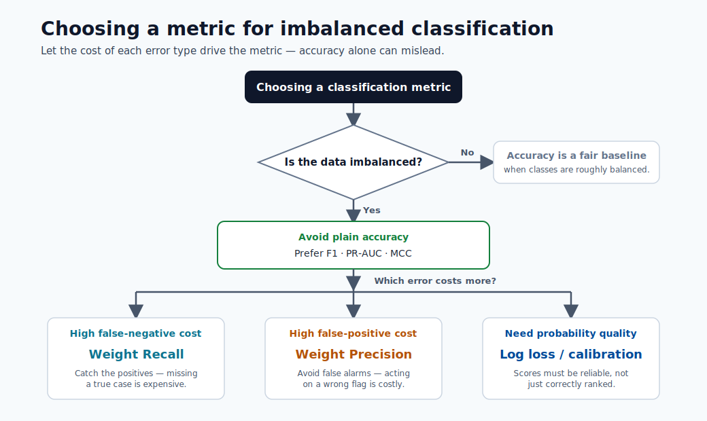

# Performance Metrics

Choosing the right metric is one of the most important decisions in ML. A model can look
excellent on one metric and fail on the real business objective.



> **Tip - How to use this chart:** Pick the metric from the *cost of errors*, not habit. On imbalanced problems prefer F1, PR-AUC,
> or MCC over accuracy; weight recall when missed positives are costly, precision when false
> alarms are costly.

## Confusion matrix basics

Counts:

- $TP$: true positives
- $FP$: false positives
- $TN$: true negatives
- $FN$: false negatives

Rates:

$$
\text{TPR}=\frac{TP}{TP+FN},\quad
\text{FPR}=\frac{FP}{FP+TN},\quad
\text{TNR}=\frac{TN}{TN+FP}
$$

### Reading the confusion matrix

| Actual \ Predicted | Positive | Negative |
|---|---|---|
| Positive | TP | FN |
| Negative | FP | TN |

| Cell | Meaning | Example (fraud model) |
|---|---|---|
| TP | Correctly flagged positive | Real fraud caught |
| FP | False alarm | Legitimate tx blocked |
| TN | Correctly cleared negative | Legit tx passes |
| FN | Missed positive | Fraud slips through |

For a fraud use case, **FN is the more dangerous error** (missed fraud). This means recall should be weighted heavily in metric choice.

## Classification metrics

- Precision: $\frac{TP}{TP+FP}$
- Recall: $\frac{TP}{TP+FN}$
- F1: $2\cdot\frac{PR}{P+R}$
- AUC

Additional formulas:

$$
\text{Accuracy}=\frac{TP+TN}{TP+TN+FP+FN}
$$

$$
\mathrm{MCC}=\frac{TP\cdot TN-FP\cdot FN}{\sqrt{(TP+FP)(TP+FN)(TN+FP)(TN+FN)}}
$$

$$
\mathrm{AUC}=\int_0^1 \mathrm{TPR}(\mathrm{FPR})\,d\mathrm{FPR}
$$

When to use what:

| Scenario | Better metric choices |
|---|---|
| Class imbalance | F1, PR-AUC, MCC, balanced accuracy |
| High false-negative cost | Recall, F2 |
| High false-positive cost | Precision |
| Probability quality | Log loss, calibration metrics |

## Regression metrics

- MAE
- RMSE
- R2

Formulas:

$$
\mathrm{MAE}=\frac{1}{N}\sum_{i=1}^{N}|y_i-\hat{y}_i|,
\quad
\mathrm{RMSE}=\sqrt{\frac{1}{N}\sum_{i=1}^{N}(y_i-\hat{y}_i)^2}
$$

$$
R^2=1-\frac{\sum_{i=1}^{N}(y_i-\hat{y}_i)^2}{\sum_{i=1}^{N}(y_i-\bar{y})^2}
$$

Interpretation tips:

- MAE is robust and easy to explain in original units.
- RMSE penalizes large errors more strongly.
- $R^2$ compares against a mean-prediction baseline.

## Forecasting metrics (practical)

- MAPE: intuitive percentage error, unstable near zero values.
- sMAPE: symmetric variant for better comparability.
- RMSE/MAE: still useful for forecast quality.

Formulas:

$$
\text{MAPE}=\frac{100}{N}\sum_{i=1}^{N}\left|\frac{y_i-\hat{y}_i}{y_i}\right|
$$

$$
\text{sMAPE}=\frac{100}{N}\sum_{i=1}^{N}\frac{2|y_i-\hat{y}_i|}{|y_i|+|\hat{y}_i|}
$$

Guidance: prefer RMSE/MAE for comparing models on the same scale. Use MAPE/sMAPE only when communicating errors as percentages to business stakeholders.

## Pitfalls to avoid

- Reporting one metric without confidence intervals.
- Comparing models on different validation splits.
- Ignoring threshold tuning in classification.
- Using accuracy as the primary metric for imbalanced data.
- Evaluating only globally when segment-level performance may diverge significantly.

## Threshold optimization (classification)

Production classification decisions require threshold policy, not default $0.5$.

Expected business cost at threshold $\tau$:

$$
\mathbb{E}[\text{Cost}(\tau)] = C_{FP}\cdot FP(\tau)+C_{FN}\cdot FN(\tau)
$$

Choose $\tau$ that minimizes expected cost under business constraints.

## Calibration and reliability

A classifier can rank well (high AUC) but produce poorly calibrated probabilities.

Calibration checks:

- Reliability curve
- Brier score
- Expected calibration error (ECE)

Use calibration methods (Platt scaling, isotonic regression) when decision systems rely
on probability values, not just rank ordering.

## SLI/SLO examples for model quality

| SLI | SLO example |
|---|---|
| Weekly macro-F1 | >= 0.82 |
| Weekly RMSE | <= 5.0 |
| Calibration error | <= 0.03 |
| Segment disparity ratio | <= 1.25 |

## Quick self-check

| # | Question | Answer |
|---|----------|--------|
| 1 | Which metric is safer than accuracy for imbalanced data? | F1 (or PR-AUC, MCC, or balanced accuracy), which stop the majority class from dominating the score. |
| 2 | Why can RMSE be much larger than MAE? | RMSE squares errors, so a few large errors are penalized disproportionately; a big RMSE–MAE gap signals heavy-tailed/outlier errors. |
| 3 | What does a negative $R^2$ imply? | The model is worse than simply predicting the mean — a clear sign something is broken. |

## Deep dive: every concept, explained

This section explains *why* each metric is built the way it is and when it misleads.

### The confusion matrix is the source of every classification metric

All classification metrics are ratios of the four cells $TP, FP, TN, FN$. Memorizing the cells
is enough to reconstruct any metric:

- **Precision** $\tfrac{TP}{TP+FP}$ answers "when the model says positive, how often is it right?"
  : it is the metric you care about when **false positives are expensive** (blocking good
  customers, flagging healthy patients).
- **Recall / TPR** $\tfrac{TP}{TP+FN}$ answers "of all real positives, how many did we catch?" :
  the metric when **false negatives are expensive** (missed fraud, missed disease).
- **F1** $2\tfrac{PR}{P+R}$ is the **harmonic mean** of the two. The harmonic mean (not the
  ordinary average) is used because it stays low unless *both* precision and recall are high : it
  refuses to reward a model that sacrifices one for the other.

### Why accuracy fails on imbalanced data

Accuracy $\tfrac{TP+TN}{\text{all}}$ weights every example equally, so when 99% of cases are
negative, predicting "always negative" scores 99% while catching zero positives. This is why the
course repeatedly steers toward **F1, PR-AUC, MCC, or balanced accuracy** for skewed problems :
they all, in different ways, stop the majority class from dominating the score.

### ROC-AUC vs PR-AUC, and what "threshold-free" means

- **AUC** is the area under the ROC curve (TPR vs FPR as the threshold sweeps from 1 to 0). It
  equals the probability that the model ranks a random positive above a random negative : a pure
  measure of **ranking quality**, independent of any chosen threshold.
- On heavy imbalance, ROC-AUC can look deceptively high because the huge negative count keeps FPR
  low. **PR-AUC** (precision vs recall) focuses on the positive class and is the more honest
  summary when positives are rare.
- **MCC** (Matthews correlation coefficient) uses all four cells in a single balanced number from
  −1 to +1, which is why it is robust even under severe imbalance.

### Threshold optimization as cost minimization

A model outputs probabilities; the **threshold** $\tau$ converts them to decisions. Because false
positives and false negatives usually have *different* costs, the optimal threshold minimizes
expected cost $\mathbb{E}[\text{Cost}(\tau)] = C_{FP}\cdot FP(\tau) + C_{FN}\cdot FN(\tau)$ rather
than maximizing accuracy. Concretely: if a missed fraud costs 20 times as much as a false alarm, you lower $\tau$
to trade many false positives for fewer false negatives. The default 0.5 is almost never optimal
in production.

### Regression metrics: MAE vs RMSE vs $R^2$

- **MAE** averages absolute errors : it is in the target's units and treats all errors linearly,
  so it is **robust to outliers** and easy to explain ("off by \$5 on average").
- **RMSE** averages *squared* errors then square-roots, so large errors are penalized
  disproportionately. RMSE ≥ MAE always; a *large gap* between them signals a few big misses
  (heavy-tailed errors) worth investigating.
- $R^2 = 1 - \tfrac{SS_{res}}{SS_{tot}}$ compares the model against the trivial "predict the mean"
  baseline. $R^2=1$ is perfect, $0$ means no better than the mean, and **negative $R^2$ means the
  model is *worse* than predicting the mean** : a clear signal something is broken.

### Forecasting metrics and the zero-denominator trap

**MAPE** expresses error as a percentage, which stakeholders find intuitive, but it **divides by
the actual value**, so it explodes or is undefined near zero and over-penalizes under-forecasts.
**sMAPE** symmetrizes the denominator to bound the value and treat over/under-forecasts more
evenly. The practical rule from the module: optimize and compare models on RMSE/MAE (stable),
and translate to MAPE/sMAPE only for *communication*.

### Calibration: ranking well is not the same as being right

A model with high AUC ranks examples correctly but may still output probabilities that do not
match reality (e.g. its "90%" predictions are right only 70% of the time). When downstream
decisions use the probability *value* (expected-loss calculations, pricing, triage), you need
**calibration**:

- **Reliability curve** plots predicted vs observed frequency; the diagonal is perfect.
- **Brier score** is the mean squared error of the probabilities themselves.
- **ECE** (expected calibration error) summarizes the average gap between confidence and accuracy.
- **Platt scaling** (fit a logistic on the scores) and **isotonic regression** (fit a monotonic
  step function) are the standard post-hoc fixes.

### From metrics to SLIs/SLOs : closing the loop to operations

An offline metric becomes a production **SLI** (service level indicator) when it is measured
continuously, and an **SLO** (objective) when a threshold is attached (e.g. "weekly macro-F1 ≥
0.82"). This is how model quality joins latency and availability as a monitored, alertable
property : the bridge from this module to drift monitoring and deployment SLOs later in the
course.

## Quick self-check (deep dive)

| # | Question | Answer |
|---|----------|--------|
| 1 | Why is F1 the harmonic mean of precision and recall rather than the ordinary average? | The harmonic mean stays low unless both precision and recall are high, so it refuses to reward a model that sacrifices one for the other. |
| 2 | On a 99%-negative dataset, why can ROC-AUC look great while PR-AUC is poor? | The huge negative count keeps FPR low so ROC-AUC stays high, while PR-AUC focuses on the rare positive class and exposes weak positive-class performance. |
| 3 | What does a negative $R^2$ tell you about the model? | It performs worse than the trivial mean predictor — a clear signal something is broken. |
| 4 | Why is the default 0.5 threshold almost never optimal in production? | Because false positives and false negatives have different costs; the optimal threshold minimizes expected cost, not accuracy. |
| 5 | A model has high AUC but its "90%" predictions are right only 70% of the time: what is the problem and which fixes apply? | It ranks well but is miscalibrated; fix it with Platt scaling or isotonic regression. |

## Multi-class and multi-label metrics in depth

Binary classification metrics extend to multi-class settings, but the aggregation strategy —
how individual class scores are combined into a single number — dramatically changes what the
final score means.

### Macro, micro, and weighted averaging

Consider a 3-class problem (classes A, B, C) with the following per-class counts and
precision/recall:

| Class | Support ($n_k$) | Precision ($P_k$) | Recall ($R_k$) | $F1_k$ |
|---|---|---|---|---|
| A | 1000 | 0.90 | 0.85 | 0.874 |
| B | 100 | 0.70 | 0.75 | 0.724 |
| C | 20 | 0.50 | 0.60 | 0.545 |
| **Total** | **1120** | — | — | — |

**Macro averaging** computes the unweighted mean of per-class scores:

$$
F1_{\text{macro}} = \frac{1}{K}\sum_{k=1}^{K} F1_k = \frac{0.874 + 0.724 + 0.545}{3} = 0.714
$$

Macro averaging treats every class equally regardless of size. It is appropriate when all
classes matter equally, especially when minority classes are important (e.g. rare disease
detection). A poor score on the rarest class tanks the macro average.

**Micro averaging** pools all TP, FP, FN counts across classes before computing the metric:

$$
F1_{\text{micro}} = \frac{2\cdot\sum_k TP_k}{2\cdot\sum_k TP_k + \sum_k FP_k + \sum_k FN_k}
$$

Micro averaging is dominated by the largest class. In the example above, class A (1000 samples)
dominates, so micro-F1 will be close to $F1_A = 0.874$. Use micro averaging when the overall
fraction of correctly classified instances is the primary concern.

**Weighted averaging** scales each class score by its support:

$$
F1_{\text{weighted}} = \frac{\sum_k n_k \cdot F1_k}{\sum_k n_k}
= \frac{1000\cdot 0.874 + 100\cdot 0.724 + 20\cdot 0.545}{1120} = 0.858
$$

Weighted averaging accounts for class imbalance while still reflecting per-class performance.
It is the default in `sklearn.metrics.f1_score(average='weighted')` and the most commonly
reported variant in imbalanced multi-class problems.

> **Note - Choosing the averaging strategy:** Use macro when minority class performance is critical. Use micro when
> you care about overall instance-level accuracy. Use weighted as a balanced default that
> naturally reflects the class distribution in your data.

**Multi-class confusion matrix:**

For $K$ classes, the confusion matrix is $K \times K$ where entry $(i, j)$ counts instances
of true class $i$ predicted as class $j$. The diagonal holds correct predictions:

```python
from sklearn.metrics import confusion_matrix, ConfusionMatrixDisplay
import matplotlib.pyplot as plt

cm = confusion_matrix(y_true, y_pred, labels=["A", "B", "C"])
disp = ConfusionMatrixDisplay(confusion_matrix=cm, display_labels=["A", "B", "C"])
disp.plot(cmap="Blues")
plt.title("Multi-class Confusion Matrix")
plt.show()
```

Off-diagonal entries reveal *which* classes are confused with each other — far more diagnostic
than any single scalar metric.

**Code for all three averaging modes:**

```python
from sklearn.metrics import f1_score, precision_score, recall_score, classification_report

print(classification_report(y_true, y_pred, target_names=["A", "B", "C"]))

f1_macro    = f1_score(y_true, y_pred, average="macro")
f1_micro    = f1_score(y_true, y_pred, average="micro")
f1_weighted = f1_score(y_true, y_pred, average="weighted")
print(f"Macro F1: {f1_macro:.3f}, Micro F1: {f1_micro:.3f}, Weighted F1: {f1_weighted:.3f}")
```

### Cohen's kappa

Cohen's kappa measures inter-rater (or classifier vs. ground truth) agreement while correcting
for the agreement expected by chance:

$$
\kappa = \frac{p_o - p_e}{1 - p_e}
$$

where:

- $p_o$ = observed agreement = fraction of instances correctly classified (accuracy)
- $p_e$ = expected agreement by chance = $\sum_k p_{\text{pred},k} \cdot p_{\text{true},k}$

**When to use kappa over accuracy:**

When class priors are highly skewed, accuracy is inflated by chance agreement. Kappa removes
this inflation. For example, if the positive class is 5% of the data, a naive "always negative"
classifier achieves 95% accuracy but $\kappa \approx 0$ (no better than chance). Kappa is
widely used in medical diagnosis and NLP annotation tasks.

**Interpretation scale:**

| $\kappa$ range | Interpretation |
|---|---|
| $< 0$ | Worse than chance |
| $0.01 – 0.20$ | Slight agreement |
| $0.21 – 0.40$ | Fair agreement |
| $0.41 – 0.60$ | Moderate agreement |
| $0.61 – 0.80$ | Substantial agreement |
| $0.81 – 1.00$ | Almost perfect agreement |

```python
from sklearn.metrics import cohen_kappa_score
kappa = cohen_kappa_score(y_true, y_pred)
print(f"Cohen's kappa: {kappa:.3f}")
```

> **Tip - Kappa in multi-class settings:** Cohen's kappa generalizes naturally to multi-class problems. It is also available as
> a weighted variant (`weights="linear"` or `weights="quadratic"`) for ordinal classes, where
> disagreements on adjacent classes are penalized less than disagreements on distant classes.

## Ranking metrics

Ranking metrics evaluate ordered lists of predictions, not binary decisions. They are the primary
metrics in information retrieval, recommendation systems, and learning-to-rank problems.

### NDCG (Normalized Discounted Cumulative Gain)

NDCG measures the quality of a ranked list of items, rewarding relevant items that appear
earlier in the list. The "discounting" penalizes relevance placed lower in the ranking.

**Discounted Cumulative Gain at rank $k$:**

$$
\text{DCG}_k = \sum_{i=1}^{k} \frac{2^{rel_i} - 1}{\log_2(i + 1)}
$$

where $rel_i \in \{0, 1, 2, \ldots\}$ is the relevance grade of the item at rank $i$. The
$2^{rel_i}$ numerator exponentially amplifies highly relevant items; the $\log_2(i+1)$
denominator discounts items appearing later.

**Ideal DCG (IDCG):** The DCG of the perfect ranking (all items sorted by relevance descending).

**NDCG normalization:**

$$
\text{NDCG}_k = \frac{\text{DCG}_k}{\text{IDCG}_k}
$$

NDCG ranges from 0 to 1, where 1 means the system returned the ideal ranking. Normalization
makes scores comparable across queries with different numbers of relevant items.

**Example computation:**

Suppose a query has 4 returned items with relevance grades $[3, 2, 3, 0]$:

$$
\text{DCG}_4 = \frac{2^3-1}{\log_2 2} + \frac{2^2-1}{\log_2 3} + \frac{2^3-1}{\log_2 4} + \frac{2^0-1}{\log_2 5}
= \frac{7}{1} + \frac{3}{1.585} + \frac{7}{2} + 0 = 7 + 1.893 + 3.5 = 12.393
$$

The ideal ranking would be $[3, 3, 2, 0]$:

$$
\text{IDCG}_4 = \frac{7}{1} + \frac{7}{1.585} + \frac{3}{2} + 0 = 7 + 4.416 + 1.5 = 12.916
$$

$$
\text{NDCG}_4 = \frac{12.393}{12.916} = 0.959
$$

```python
from sklearn.metrics import ndcg_score
import numpy as np

# True relevance labels (one query)
y_true = np.array([[3, 2, 3, 0]])
# Predicted scores (higher = more relevant)
y_score = np.array([[0.9, 0.7, 0.8, 0.1]])

ndcg = ndcg_score(y_true, y_score, k=4)
print(f"NDCG@4: {ndcg:.3f}")
```

**When NDCG is used:**

- Search engine result ranking (Google, Bing)
- Recommendation system evaluation (top-$k$ item lists)
- Learning-to-rank models (LambdaMART, RankNet)
- Any scenario where items have graded relevance (not just binary)

> **Note - Binary vs graded relevance:** When relevance is binary (0 or 1), NDCG simplifies and AP (average precision)
> is often preferred. NDCG's advantage is graded relevance: it can distinguish between a
> mediocre result and a very good result at the same rank position.

### Mean Average Precision (MAP)

**Average Precision (AP)** for a single query summarizes the precision-recall tradeoff across
all relevant items in the ranked list:

$$
\text{AP} = \frac{1}{|R|} \sum_{k: \text{item}_k \text{ is relevant}} P(k)
$$

where $|R|$ is the number of relevant items and $P(k)$ is the precision at the rank of the
$k$-th relevant item.

**Mean Average Precision (MAP)** averages AP over all queries:

$$
\text{MAP} = \frac{1}{|Q|} \sum_{q=1}^{|Q|} \text{AP}(q)
$$

**MAP vs AUC:**

| Property | MAP | AUC (ROC) |
|---|---|---|
| Ranking-based | Yes (penalizes relevant items ranked low) | Yes (rank of positives vs negatives) |
| Graded relevance | No (binary: relevant / not relevant) | No |
| Positional discount | Yes (earlier positions matter more) | No (all ranks equal) |
| Multi-query | Yes (averaged over queries) | Typically single classifier |
| Common domain | Information retrieval, recommendation | Binary classification |

```python
from sklearn.metrics import average_precision_score

# Binary relevance case
ap = average_precision_score(y_true_binary, y_scores)
print(f"Average Precision: {ap:.3f}")

# MAP over multiple queries
aps = [average_precision_score(y_true_q, y_scores_q)
       for y_true_q, y_scores_q in zip(all_y_true, all_y_scores)]
map_score = np.mean(aps)
print(f"MAP: {map_score:.3f}")
```

> **Tip - AP vs PR-AUC:** `average_precision_score` in sklearn computes the area under the precision-recall
> curve using a step interpolation, which is slightly different from MAP as defined in IR
> (which averages precision at each relevant rank). For IR tasks, use MAP. For binary
> classification tasks, use `average_precision_score`.

## Regression metrics deep dive

### Huber loss

Huber loss combines the best properties of MAE and MSE. For errors smaller than a threshold
$\delta$ it behaves like MSE (smooth, differentiable); for larger errors it behaves like MAE
(linear, robust to outliers):

$$
\mathcal{L}_\delta(y, \hat{y}) =
\begin{cases}
\frac{1}{2}(y - \hat{y})^2 & \text{if } |y - \hat{y}| \leq \delta \\
\delta\left(|y - \hat{y}| - \frac{1}{2}\delta\right) & \text{otherwise}
\end{cases}
$$

**The $\delta$ parameter** determines the boundary between quadratic and linear behavior. A
smaller $\delta$ makes the loss more MAE-like (more robust); a larger $\delta$ makes it more
MSE-like (more sensitive to large errors). Common defaults are $\delta = 1.0$ or tuned as a
hyperparameter.

**When to prefer Huber over RMSE:**

| Scenario | Prefer |
|---|---|
| Clean data, errors roughly Gaussian | RMSE (simple, efficient) |
| Outliers present but meaningful | Huber (robust, still smooth) |
| Outliers are labeling errors | MAE or Huber |
| Need gradient smoothness at zero | Huber or RMSE (MAE has undefined gradient at 0) |

```python
from sklearn.linear_model import HuberRegressor
from sklearn.metrics import mean_absolute_error, mean_squared_error
import numpy as np

model = HuberRegressor(epsilon=1.35)   # epsilon = delta in sklearn's parameterization
model.fit(X_train, y_train)
y_pred = model.predict(X_test)

huber_loss = np.mean([
    0.5 * e**2 if abs(e) <= 1.35 else 1.35 * (abs(e) - 0.5 * 1.35)
    for e in (y_test - y_pred)
])
print(f"Huber loss: {huber_loss:.4f}")
print(f"MAE: {mean_absolute_error(y_test, y_pred):.4f}")
print(f"RMSE: {np.sqrt(mean_squared_error(y_test, y_pred)):.4f}")
```

### MASE (Mean Absolute Scaled Error)

MASE (Hyndman & Koehler, 2006) addresses a key weakness of MAPE: it is undefined or explosive
when actual values are near zero. MASE scales the MAE by the MAE of a naive in-sample forecast
(predict the previous observation), making it unit-free and comparable across time series with
different scales:

$$
\text{MASE} = \frac{\text{MAE}}{\frac{1}{T-1}\sum_{t=2}^{T}|y_t - y_{t-1}|}
$$

where the denominator is the mean absolute one-step error of the naive (seasonal random walk)
forecast on the training series of length $T$.

- $\text{MASE} < 1$: the model beats the naive forecast (good).
- $\text{MASE} = 1$: equivalent to the naive forecast.
- $\text{MASE} > 1$: worse than the naive forecast.

**Why MASE for cross-series comparison:**

MAPE and sMAPE can still produce misleading averages when comparing series with different error
distributions. MASE normalizes by *each series' own difficulty* (how hard it is to forecast
relative to a naive baseline), making averages across series meaningful.

```python
def mase(y_true, y_pred, y_train):
    """
    y_true, y_pred: test period actuals and predictions
    y_train: training period actuals (for naive forecast denominator)
    """
    mae = np.mean(np.abs(y_true - y_pred))
    naive_mae = np.mean(np.abs(np.diff(y_train)))   # one-step naive errors
    return mae / naive_mae

score = mase(y_test, y_pred, y_train)
print(f"MASE: {score:.3f} ({'better' if score < 1 else 'worse'} than naive)")
```

### Quantile metrics and prediction intervals

Standard regression metrics evaluate point predictions. Quantile regression and quantile loss
evaluate *distributional* predictions — estimates of specific percentiles of the target
distribution rather than its expected value.

**Pinball loss (quantile loss):**

$$
\mathcal{L}_q(y, \hat{y}) =
\begin{cases}
q(y - \hat{y}) & \text{if } y \geq \hat{y} \\
(q - 1)(y - \hat{y}) & \text{if } y < \hat{y}
\end{cases}
$$

For the median ($q = 0.5$), pinball loss reduces to $\frac{1}{2}$MAE. For $q = 0.9$, the loss
asymmetrically penalizes under-predictions (positive errors) 9 times more than
over-predictions, causing the model to learn the 90th percentile.

**Why quantile regression produces calibrated intervals:**

A prediction interval $[\hat{y}_{0.05}, \hat{y}_{0.95}]$ formed by the 5th and 95th percentile
models is *calibrated* if it contains 90% of actual values. Quantile regression achieves
this directly by optimizing the pinball loss for each quantile, without assuming a parametric
error distribution.

```python
from sklearn.ensemble import GradientBoostingRegressor
import numpy as np

# Train models for lower, median, and upper quantiles
quantiles = [0.05, 0.50, 0.95]
models = {}
for q in quantiles:
    model = GradientBoostingRegressor(
        loss="quantile", alpha=q,
        n_estimators=200, max_depth=4
    )
    model.fit(X_train, y_train)
    models[q] = model

lower = models[0.05].predict(X_test)
median = models[0.50].predict(X_test)
upper = models[0.95].predict(X_test)

# Empirical coverage: should be ~90%
coverage = np.mean((y_test >= lower) & (y_test <= upper))
print(f"90% interval empirical coverage: {coverage:.1%}")

# Pinball loss for the 0.9 quantile
def pinball_loss(y, y_hat, q):
    errors = y - y_hat
    return np.mean(np.where(errors >= 0, q * errors, (q - 1) * errors))

print(f"Pinball loss (q=0.9): {pinball_loss(y_test, upper, 0.9):.4f}")
```

**Applications in forecasting confidence:**

- Energy demand forecasting: intervals guide reserve capacity planning.
- Supply chain: upper quantile of demand drives safety stock calculation.
- Financial risk: Value at Risk (VaR) is formally a quantile of the loss distribution.
- Azure ML AutoML for forecasting: reports quantile predictions when `forecast_quantiles`
  is specified in the forecasting configuration.

> **Note - Interval calibration check:** Always verify empirical coverage. If a 90% interval covers only 70% of test
> points, the model is overconfident (intervals too narrow). If it covers 99%, the model is
> underconfident (intervals too wide and less useful). Calibrated intervals are the goal.

## Business metric alignment

Choosing the right ML metric is necessary but not sufficient. The ultimate measure of a model's
value is its impact on the business objective. This section bridges the gap from statistical
metrics to business decisions.

### Lift and gain curves

Lift curves answer: "compared to randomly selecting customers/records, how much better does
the model do?" They are foundational tools in direct marketing, credit scoring, and fraud
detection, where the model is used to prioritize a fixed-size intervention budget.

**Cumulative gain** at decile $d$: the fraction of all positives captured by targeting the
top $d \times 10\%$ of records scored by the model.

**Lift** at decile $d$: cumulative gain divided by what random selection would achieve:

$$
\text{Lift}(d) = \frac{\text{Cumulative Gain}(d)}{d/10}
$$

A lift of 3.0 at decile 1 means the top 10% of model scores contains 3$\times$ the positives
of a random 10% sample.

**Worked example — marketing campaign:**

Suppose 10,000 customers, 500 buyers (5% base rate). The model ranks all customers.

| Decile | Customers | Buyers in decile | Cumul. gain | Lift |
|---|---|---|---|---|
| 1 | 1,000 | 200 | 40% | 4.0 |
| 2 | 1,000 | 100 | 60% | 3.0 |
| 3 | 1,000 | 75 | 75% | 2.5 |
| 5 | 1,000 | 25 | 90% | 1.8 |
| 10 | 1,000 | 10 | 100% | 1.0 |

If the campaign budget allows contacting only 2,000 customers (top 2 deciles), targeting with
the model captures 60% of all buyers vs. 20% with random selection — a 3× lift on ROI.

```python
import numpy as np
import pandas as pd

def lift_table(y_true, y_scores, n_deciles=10):
    df = pd.DataFrame({"y": y_true, "score": y_scores})
    df = df.sort_values("score", ascending=False).reset_index(drop=True)
    df["decile"] = pd.qcut(df.index, n_deciles, labels=False) + 1
    total_pos = df["y"].sum()
    rows = []
    cumul = 0
    for d in range(1, n_deciles + 1):
        group = df[df["decile"] == d]
        pos = group["y"].sum()
        cumul += pos
        gain = cumul / total_pos
        lift = gain / (d / n_deciles)
        rows.append({"decile": d, "positives": int(pos), "cumul_gain": gain, "lift": lift})
    return pd.DataFrame(rows)

print(lift_table(y_test_binary, y_pred_proba).to_string(index=False))
```

### Expected value framework

The expected value (EV) framework converts a confusion matrix into business value by attaching
dollar amounts (or any utility) to each cell:

$$
\text{EV} = TP \cdot v_{TP} - FP \cdot c_{FP} - FN \cdot c_{FN} + TN \cdot v_{TN}
$$

where $v_{TP}$ is the value of a true positive (fraud caught), $c_{FP}$ is the cost of a false
positive (legitimate customer inconvenienced), $c_{FN}$ is the cost of a missed positive
(fraud loss), and $v_{TN}$ is typically zero or negligible.

**Optimizing threshold for EV, not accuracy:**

For a fixed model, the threshold $\tau$ determines the TP/FP/FN/TN counts. The optimal
threshold maximizes EV:

$$
\tau^* = \arg\max_\tau \; \text{EV}(\tau)
$$

**Full worked example — fraud detection:**

Assumptions:
- 10,000 transactions per day, 1% fraud rate (100 fraudulent)
- $v_{TP} = \$200$ (average fraud loss prevented per caught fraud)
- $c_{FP} = \$10$ (cost of blocking a legitimate transaction — customer friction)
- $c_{FN} = \$200$ (fraud loss for a missed fraud)
- $v_{TN} \approx 0$

```python
import numpy as np

def expected_value(y_true, y_scores, threshold, v_tp, c_fp, c_fn, v_tn=0):
    y_pred = (y_scores >= threshold).astype(int)
    tp = np.sum((y_pred == 1) & (y_true == 1))
    fp = np.sum((y_pred == 1) & (y_true == 0))
    fn = np.sum((y_pred == 0) & (y_true == 1))
    tn = np.sum((y_pred == 0) & (y_true == 0))
    return tp * v_tp - fp * c_fp - fn * c_fn + tn * v_tn

# Sweep thresholds and find the EV-maximizing one
thresholds = np.linspace(0.01, 0.99, 99)
evs = [expected_value(y_test, y_scores, t, v_tp=200, c_fp=10, c_fn=200)
       for t in thresholds]

best_thresh = thresholds[np.argmax(evs)]
best_ev = max(evs)
print(f"Optimal threshold: {best_thresh:.2f}, Daily EV: ${best_ev:,.0f}")

# Compare with default threshold 0.5
default_ev = expected_value(y_test, y_scores, 0.5, v_tp=200, c_fp=10, c_fn=200)
print(f"Default (0.5) threshold EV: ${default_ev:,.0f}")
print(f"EV gain from optimal threshold: ${best_ev - default_ev:,.0f} per day")
```

> **Note - Scale before comparing:** EV depends on the scale of your data. If the test set is 1,000 transactions and
> production volume is 100,000, scale the EV by 100 to get the daily production impact.
> The threshold is scale-independent; the absolute EV is not.

> **Tip - EV framework in Azure ML AutoML:** AutoML's `primary_metric` optimizes a statistical metric. After AutoML
> selects the best model, apply the EV framework post-hoc to tune the threshold. This
> two-step approach separates model selection (statistical quality) from threshold setting
> (business value optimization).

## Statistical significance of metric differences

Two models score 0.923 and 0.918 AUC on the same test set. Is the difference real or noise?
Statistical significance tests answer this question before promoting a new model to production.

**Bootstrap confidence interval for AUC:**

The bootstrap resamples the test set with replacement many times, computing AUC on each
resample. The 2.5th and 97.5th percentiles of the resampled AUC distribution form a 95% CI:

```python
import numpy as np
from sklearn.metrics import roc_auc_score

def bootstrap_auc_ci(y_true, y_scores, n_bootstrap=2000, ci=0.95, seed=42):
    rng = np.random.default_rng(seed)
    n = len(y_true)
    auc_samples = []
    for _ in range(n_bootstrap):
        idx = rng.integers(0, n, size=n)
        if len(np.unique(y_true[idx])) < 2:
            continue   # skip degenerate samples
        auc_samples.append(roc_auc_score(y_true[idx], y_scores[idx]))
    alpha = (1 - ci) / 2
    return np.percentile(auc_samples, [100 * alpha, 100 * (1 - alpha)])

ci_model_a = bootstrap_auc_ci(y_true, scores_model_a)
ci_model_b = bootstrap_auc_ci(y_true, scores_model_b)
print(f"Model A AUC 95% CI: [{ci_model_a[0]:.4f}, {ci_model_a[1]:.4f}]")
print(f"Model B AUC 95% CI: [{ci_model_b[0]:.4f}, {ci_model_b[1]:.4f}]")
```

If the CIs overlap substantially, the difference is not statistically significant.

**Permutation test for metric difference:**

The permutation test asks: "if both models were identical, how often would we see a difference
this large by chance?"

```python
def permutation_test_auc(y_true, scores_a, scores_b, n_permutations=10000, seed=42):
    rng = np.random.default_rng(seed)
    observed_diff = roc_auc_score(y_true, scores_a) - roc_auc_score(y_true, scores_b)
    null_diffs = []
    for _ in range(n_permutations):
        # Randomly swap scores between models for each instance
        swap = rng.random(len(y_true)) > 0.5
        perm_a = np.where(swap, scores_b, scores_a)
        perm_b = np.where(swap, scores_a, scores_b)
        null_diffs.append(roc_auc_score(y_true, perm_a) - roc_auc_score(y_true, perm_b))
    p_value = np.mean(np.abs(null_diffs) >= np.abs(observed_diff))
    return p_value, observed_diff

p_val, diff = permutation_test_auc(y_true, scores_model_a, scores_model_b)
print(f"AUC difference: {diff:+.4f}, p-value: {p_val:.4f}")
print(f"Significant at 0.05: {'Yes' if p_val < 0.05 else 'No'}")
```

**Bonferroni correction for multiple tests:**

If you compare $m$ pairs of models or $m$ evaluation segments, the probability of at least one
false positive at significance level $\alpha$ is approximately $m\alpha$. The Bonferroni
correction adjusts the per-test threshold:

$$
\alpha_{\text{adjusted}} = \frac{\alpha}{m}
$$

For $m = 10$ comparisons at $\alpha = 0.05$: use $\alpha_{\text{adjusted}} = 0.005$.

```python
# Bonferroni-corrected significance test for 5 segment comparisons
m = 5
alpha = 0.05
alpha_bonferroni = alpha / m
print(f"Use p < {alpha_bonferroni:.3f} for each individual segment test")
```

> **Note - Practical vs statistical significance:** A statistically significant difference ($p < 0.05$) does not imply the
> difference is large enough to matter. An AUC improvement of 0.001 may be statistically
> significant on a large test set but economically negligible. Always report both the
> p-value and the effect size (actual metric difference), and assess whether the business
> impact of the improvement justifies the cost of retraining and redeploying.

**When to trust an improvement:**

| Condition | Action |
|---|---|
| CI of model A entirely above CI of model B | Proceed with confidence |
| CIs overlap slightly, p < 0.05 | Probably real; sanity-check on a second held-out set |
| CIs overlap substantially, p > 0.05 | Treat models as equivalent; prefer simpler/cheaper |
| Improvement on overall metric but degradation on key segment | Investigate segment; do not promote blindly |

## Metric implementation reference

This section provides copy-paste-ready code for every major metric discussed in this module,
using `sklearn.metrics`. All examples assume `y_true` are ground truth labels and `y_scores`
are continuous scores (for threshold-dependent metrics, `y_pred` are binary predictions).

```python
import numpy as np
from sklearn.metrics import (
    # Classification
    accuracy_score, balanced_accuracy_score,
    precision_score, recall_score, f1_score,
    roc_auc_score, average_precision_score,
    log_loss, brier_score_loss,
    matthews_corrcoef, cohen_kappa_score,
    confusion_matrix, classification_report,
    # Regression
    mean_absolute_error, mean_squared_error,
    mean_absolute_percentage_error, r2_score,
    # Ranking
    ndcg_score,
)

# ── Binary classification ──────────────────────────────────────────────────────
print("=== Binary Classification ===")
print(f"Accuracy:           {accuracy_score(y_true, y_pred):.4f}")
print(f"Balanced accuracy:  {balanced_accuracy_score(y_true, y_pred):.4f}")
print(f"Precision:          {precision_score(y_true, y_pred):.4f}")
print(f"Recall:             {recall_score(y_true, y_pred):.4f}")
print(f"F1:                 {f1_score(y_true, y_pred):.4f}")
print(f"F2 (beta=2):        {f1_score(y_true, y_pred, beta=2):.4f}")
print(f"ROC-AUC:            {roc_auc_score(y_true, y_scores):.4f}")
print(f"PR-AUC (Avg Prec):  {average_precision_score(y_true, y_scores):.4f}")
print(f"Log loss:           {log_loss(y_true, y_scores):.4f}")
print(f"Brier score:        {brier_score_loss(y_true, y_scores):.4f}")
print(f"MCC:                {matthews_corrcoef(y_true, y_pred):.4f}")
print(f"Cohen's kappa:      {cohen_kappa_score(y_true, y_pred):.4f}")

# ── Multi-class classification ──────────────────────────────────────────────────
print("\n=== Multi-class Classification ===")
print(classification_report(y_true_mc, y_pred_mc))
print(f"Macro F1:           {f1_score(y_true_mc, y_pred_mc, average='macro'):.4f}")
print(f"Micro F1:           {f1_score(y_true_mc, y_pred_mc, average='micro'):.4f}")
print(f"Weighted F1:        {f1_score(y_true_mc, y_pred_mc, average='weighted'):.4f}")
print(f"Cohen's kappa:      {cohen_kappa_score(y_true_mc, y_pred_mc):.4f}")

# ── Regression ─────────────────────────────────────────────────────────────────
print("\n=== Regression ===")
print(f"MAE:   {mean_absolute_error(y_true_r, y_pred_r):.4f}")
print(f"RMSE:  {np.sqrt(mean_squared_error(y_true_r, y_pred_r)):.4f}")
print(f"MAPE:  {mean_absolute_percentage_error(y_true_r, y_pred_r):.4f}")
print(f"R²:    {r2_score(y_true_r, y_pred_r):.4f}")

# Huber loss (manual, delta=1.0)
delta = 1.0
errors = y_true_r - y_pred_r
huber = np.mean(np.where(np.abs(errors) <= delta,
                          0.5 * errors**2,
                          delta * (np.abs(errors) - 0.5 * delta)))
print(f"Huber (δ=1.0): {huber:.4f}")

# ── Ranking ────────────────────────────────────────────────────────────────────
print("\n=== Ranking ===")
# y_relevance shape: (n_queries, n_items); y_score shape: (n_queries, n_items)
print(f"NDCG@10: {ndcg_score(y_relevance, y_score_matrix, k=10):.4f}")
```

**Common mistakes to avoid:**

| Mistake | Impact | Fix |
|---|---|---|
| Using `accuracy_score` on imbalanced data | Misleading high score | Use F1, MCC, or balanced accuracy |
| Comparing MAPE across series with different scales | Invalid comparison | Use MASE or scale-normalized MAE |
| Computing AUC on the training set | Optimistically biased | Always use held-out or CV validation set |
| Using default `f1_score(average='binary')` for multi-class | Error or wrong metric | Specify `average='macro'/'micro'/'weighted'` |
| Not checking empirical coverage of prediction intervals | Overconfident intervals | Validate coverage on held-out test set |
| Reporting a metric without specifying the averaging method | Ambiguous results | Always state macro/micro/weighted |
