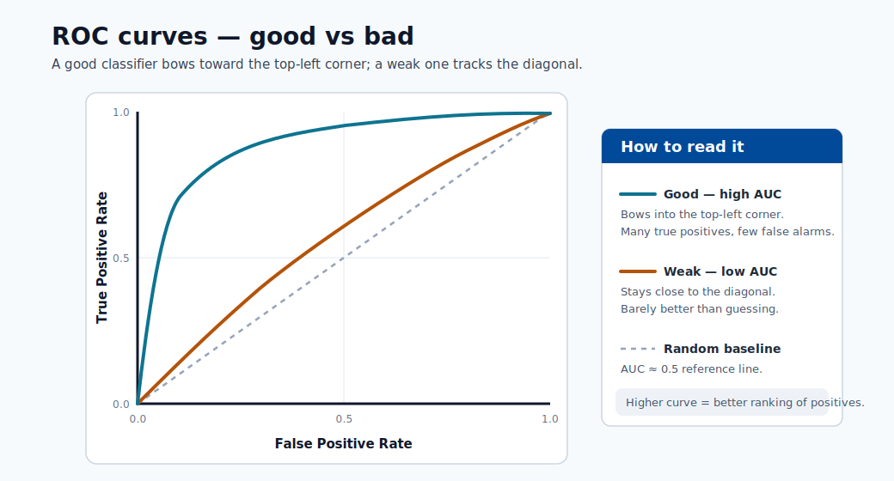
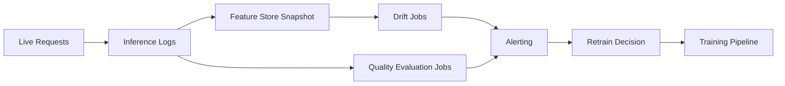

# Results and Explainability

This module teaches how to move from model score reporting to trustworthy model behavior
analysis for technical and non-technical stakeholders.

## Model review artifacts

- Confusion matrix
- ROC and precision-recall curves
- Feature importance
- SHAP and LIME explanations

## Global vs local explainability

| Type | Purpose | Example |
|---|---|---|
| Global | Explain overall model behavior | Top features across all samples |
| Local | Explain a single prediction | Why customer A was predicted high risk |

Use both:

- Global explains strategy-level behavior and helps data scientists verify that the model learned real signals (not leakage artifacts).
- Local supports case-level reviews, appeals, and regulatory audit trails.

### SHAP summary example (tabular model)

```python
import shap
import lightgbm as lgb

model = lgb.LGBMClassifier().fit(X_train, y_train)
explainer = shap.TreeExplainer(model)
shap_values = explainer.shap_values(X_test)

# Global importance plot
shap.summary_plot(shap_values[1], X_test, plot_type="bar")

# Local explanation for one prediction
shap.force_plot(explainer.expected_value[1], shap_values[1][0], X_test.iloc[0])
```

### Interpreting SHAP values

- SHAP value for feature $j$ on sample $i$: the change in model output attributable to feature $j$.
- Positive SHAP = pushes prediction higher. Negative SHAP = pushes prediction lower.
- The sum of all SHAP values equals the model output minus the expected value.

## Monitoring and Drift

Covariate drift (input distribution shift):

$$
P_t(X)\neq P_{t+\Delta}(X)
$$

Concept drift (mapping shift):

$$
P_t(Y\mid X)\neq P_{t+\Delta}(Y\mid X)
$$

Population Stability Index (PSI):

$$
\mathrm{PSI}=\sum_{b=1}^{B}(a_b-e_b)\ln\frac{a_b}{e_b}
$$

where $a_b$ and $e_b$ are actual and expected bin proportions.

Operational guidance:

- Set baseline windows from stable data periods.
- Alert on both drift metrics and business KPI changes.
- Trigger retraining only when thresholds persist, not from single spikes.



> **Note - How to read it:** Good vs bad ROC curves. A model whose curve bows toward the top-left separates classes well
> (high AUC); one near the diagonal is little better than random. Compare candidates on the same
> validation split.


> **Note - How to read it:** Good vs bad precision-recall curves. On imbalanced data PR curves are more honest than ROC : a
> curve staying high as recall increases means the model holds precision while catching more
> positives.

Use both global and local explanations before production release.

## Explainability stack in practice

- SHAP: strong for tabular model interpretability. Exact for tree models (TreeSHAP); approximate for others (KernelSHAP).
- LIME: local approximation around one prediction using a surrogate linear model.
- Permutation importance: model-agnostic global signal. Measures accuracy drop when a feature's values are randomly shuffled.

### Choosing between SHAP and LIME

| Criteria | SHAP | LIME |
|---|---|---|
| Consistency of explanations | High (game-theoretically grounded) | Varies with random sample |
| Speed for tree models | Fast (TreeSHAP is $O(TLD^2)$) | Slow (requires repeated prediction) |
| Works with any model | Yes (KernelSHAP) | Yes |
| Suitable for debugging | Yes | Yes, especially for black-box models |

### Permutation importance in code

```python
from sklearn.inspection import permutation_importance

result = permutation_importance(model, X_test, y_test, n_repeats=10, random_state=42)
for i in result.importances_mean.argsort()[::-1]:
    print(f"{X_test.columns[i]:<25} {result.importances_mean[i]:.4f} +/- {result.importances_std[i]:.4f}")
```

## Governance checklist

1. Document model assumptions and known limitations.
2. Validate performance by important user segments.
3. Track model version and explanation artifacts together.
4. Define escalation path for model incidents.

## Model card template (recommended)

| Section | What to document |
|---|---|
| Intended use | Business goal, target users, non-goals |
| Data | Sources, sampling, known biases |
| Metrics | Primary/secondary metrics and thresholds |
| Explainability | Methods used (SHAP/LIME/PFI) |
| Fairness | Segment-level results and mitigation notes |
| Safety limits | Conditions where model should not be used |
| Operations | Retraining cadence, alert thresholds, rollback plan |

## Monitoring architecture



## Response policy for drift alerts

1. Validate alert quality (rule out logging or pipeline issues).
2. Check business KPI movement vs statistical drift.
3. Trigger shadow retrain before production switch.
4. Use canary rollout for replacement model.

### Retraining cadence decision guide

| Signal | Recommended action |
|---|---|
| PSI > 0.2 on key features | Trigger drift investigation, consider retraining |
| Prediction quality SLO missed for 2+ consecutive weeks | Mandatory retrain + root cause |
| Label feedback lag (stale labels) | Collect fresh labels, then retrain |
| Regulatory audit or fairness review | Retrain on refreshed, audited dataset |
| No drift signal for 3+ months | Scheduled proactive retrain anyway |

### Monitoring checklist for new deployments

1. Baseline dataset stored and fingerprinted.
2. Feature drift monitor configured (PSI or KS-test per feature).
3. Prediction distribution monitor configured.
4. Alert thresholds set and PagerDuty/Teams webhook attached.
5. Model quality evaluation job scheduled (weekly or monthly).
6. Rollback deployment is tagged and accessible.

## Deep dive: every concept, explained

This section explains the theory behind the explainability and drift tools so you can trust
and defend their outputs.

### Why explainability is a requirement, not a nicety

A model that cannot be explained cannot be debugged, audited, or legally defended. Explainability
serves three distinct audiences: **data scientists** verifying the model learned real signal (not
a leakage artifact), **business stakeholders** trusting and adopting it, and **regulators/affected
users** who have a right to know why a decision was made. This is why the module separates global
from local explanations : they answer different questions for different people.

### Global vs local, precisely

- **Global** explanations describe the model's *overall* behavior: which features matter across
  all predictions. They answer "what did the model learn?"
- **Local** explanations describe *one* prediction: why this customer was scored high-risk. They
  answer "why this decision?" and are what an appeals or audit process needs.

A model can have sensible global behavior yet a wrong local explanation for an edge case, so both
views are required before release.

### SHAP: a fair division of credit

**SHAP (SHapley Additive exPlanations)** borrows the **Shapley value** from cooperative game
theory. The idea: treat each feature as a "player" and the prediction as the "payout", then
fairly distribute the payout among features by averaging each feature's marginal contribution
over *all possible orderings* of the others. This yields the **additivity property** the module
notes: the SHAP values for one example sum to (model output − expected output). Concretely, a
positive SHAP value pushed the prediction up; a negative one pushed it down; their total explains
the entire gap from the baseline.

Why SHAP is preferred for tabular models:

- It is **consistent and locally accurate** (grounded in axioms), so explanations do not change
  arbitrarily.
- **TreeSHAP** computes exact Shapley values for tree ensembles in polynomial time
  ($O(TLD^2)$ for $T$ trees, $L$ leaves, depth $D$), making it fast enough for production.
- For non-tree models, **KernelSHAP** approximates the same values model-agnostically (slower).

### LIME and permutation importance : the complementary tools

- **LIME** (Local Interpretable Model-agnostic Explanations) explains one prediction by sampling
  perturbed points around it and fitting a simple **surrogate** (usually linear) model locally.
  It works on any black box but, because it relies on random sampling, its explanations can vary
  between runs : the consistency weakness noted in the comparison table.
- **Permutation importance** is a global, model-agnostic signal: shuffle one feature's values and
  measure how much accuracy drops. A large drop means the model relied on that feature. It is
  cheap and intuitive but can be misled by correlated features (shuffling one when its correlate
  remains intact understates importance).

### Drift: the two distributions that can shift

Production failure usually traces to a distribution changing out from under the model:

- **Covariate (data) drift** : the inputs change: $P_t(X) \neq P_{t+\Delta}(X)$. Example: a new
  customer segment with different spending patterns. The mapping may still be valid, but the model
  sees inputs unlike its training data.
- **Concept drift** : the *relationship* changes: $P_t(Y\mid X) \neq P_{t+\Delta}(Y\mid X)$.
  Example: fraud tactics evolve, so the same features now imply a different risk. This is more
  dangerous because the learned function is now simply wrong.

Distinguishing them matters: covariate drift may be fixed by re-weighting or collecting new data;
concept drift generally requires retraining on fresh labels.

### PSI, intuitively

The **Population Stability Index** $\text{PSI}=\sum_b (a_b-e_b)\ln\tfrac{a_b}{e_b}$ compares a
feature's *current* binned distribution ($a_b$) against a *baseline* ($e_b$). Each term grows when
a bin's share moves away from its baseline share, so PSI is a single number measuring "how much
has this distribution moved?" Common thresholds: **< 0.1** no meaningful shift, **0.1–0.2**
moderate (investigate), **> 0.2** significant (likely retrain). It is essentially a symmetrized
relative-entropy measure, which is why it pairs naturally with KS-tests in drift monitors.

### Why retraining is threshold-and-persistence based, not reflexive

The operational guidance : alert on persistent drift, validate against business KPIs, shadow-test
before switching : exists because retraining is costly and risky. A single drift spike may be a
logging glitch; reacting to it churns models needlessly. The discipline is: confirm the signal is
real *and* sustained *and* tied to a KPI movement, then retrain into a **shadow** or **canary**
deployment before promoting. This ties explainability/monitoring back to the deployment module's
release strategies.

## Quick self-check

| # | Question | Answer |
|---|----------|--------|
| 1 | What different question does a *local* explanation answer compared to a *global* one? | A local explanation answers "why this decision?" for one prediction; a global explanation answers "what did the model learn?" across all predictions. |
| 2 | Why do SHAP values for a single prediction sum to "model output minus expected value"? | SHAP fairly distributes the prediction (the payout) among features via Shapley values, and its additivity axiom guarantees the contributions add up to the gap between the output and the baseline expected value. |
| 3 | When would you choose LIME over TreeSHAP, and what is LIME's main weakness? | Use LIME for a quick, model-agnostic local explanation of a non-tree black box; its main weakness is instability – random sampling makes explanations vary between runs. |
| 4 | What is the difference between covariate drift and concept drift, and which usually forces retraining? | Covariate drift is a change in the inputs $P(X)$; concept drift is a change in the relationship $P(Y \mid X)$. Concept drift usually forces retraining because the learned function is now wrong. |
| 5 | A key feature shows PSI = 0.27: what does that indicate and what should you do before retraining? | PSI > 0.2 signals a significant distribution shift; before retraining, confirm the signal is real and sustained (not a logging glitch) and tied to a KPI movement, then shadow/canary the new model. |

---

## Advanced explainability methods

The methods covered so far (SHAP, LIME, permutation importance) handle most tabular use cases.
This section extends the toolkit to neural networks, counterfactual reasoning, and
concept-based explanations — three approaches required when tabular explanations are insufficient
or when regulatory frameworks demand richer justification.

### Integrated gradients (neural networks)

TreeSHAP is exact but model-specific. For differentiable models such as deep neural networks,
**Integrated Gradients (IG)** provides an axiomatic attribution method that requires only
gradient access.

The formal definition for feature $i$ given input $x$ and baseline $x'$ is:

$$
\text{IG}_i(x) = (x_i - x'_i) \times \int_0^1 \frac{\partial F(x' + \alpha(x-x'))}{\partial x_i} \, d\alpha
$$

where $F$ is the neural network output and $\alpha \in [0,1]$ interpolates between the baseline
and the actual input. In practice the integral is approximated with a Riemann sum over $m$ steps:

$$
\text{IG}_i(x) \approx (x_i - x'_i) \times \sum_{k=1}^{m} \frac{\partial F\!\left(x' + \frac{k}{m}(x - x')\right)}{\partial x_i} \cdot \frac{1}{m}
$$

**Baseline choice matters.** The baseline $x'$ represents "absence of information" for the model.
Common choices:

| Baseline | When to use |
|---|---|
| All-zeros vector | Normalized tabular features where 0 is meaningful |
| Feature mean vector | Removes individual sample bias; good default |
| Black image (zeros) | Image models where no signal is the natural zero |
| Random blurred input | More robust, averaged over multiple baselines |

**Completeness property.** Like SHAP, IG satisfies the completeness axiom:

$$
\sum_{i=1}^{d} \text{IG}_i(x) = F(x) - F(x')
$$

The sum of all attributions equals the model output minus the baseline output. This lets
stakeholders verify that the explanation accounts for the full prediction gap.

```python
import torch
from captum.attr import IntegratedGradients

model.eval()
ig = IntegratedGradients(model)

# baseline: feature-mean tensor
baseline = X_train_tensor.mean(dim=0, keepdim=True)

attributions, delta = ig.attribute(
    X_test_tensor[:1],
    baselines=baseline,
    n_steps=200,
    return_convergence_delta=True
)
print("Convergence delta (should be near 0):", delta.item())
```

> **Note - Convergence delta:** The convergence delta measures how well the integral approximation
> satisfies the completeness property. A delta near zero confirms the attribution is reliable.
> If it is large, increase `n_steps`.

> **Tip - Azure ML integration:** Log IG attributions as MLflow artifacts alongside every
> registered model version so that explanations are traceable to the exact model state.

### Counterfactual explanations

A **counterfactual explanation** answers: *"What is the minimum change to the input that would
flip the model's prediction?"* Rather than explaining why a decision was made, it explains what
would need to be different — making it directly actionable for the affected user.

**Example.** A loan applicant is denied. A SHAP explanation says "income was the most negative
factor." A counterfactual says "if your income were £2,400/month instead of £1,800/month, the
prediction would change to approved." The second is what the applicant can act on.

**The DiCE algorithm** (Diverse Counterfactual Explanations) generates a set of $k$ diverse
counterfactuals rather than a single minimum-distance one:

$$
\underset{c_1,\ldots,c_k}{\text{minimize}} \;\; \underbrace{\sum_{j} \text{yloss}(F(c_j), y_{\text{target}})}_{\text{prediction loss}} + \lambda_1 \underbrace{\sum_j d(x, c_j)}_{\text{proximity}} - \lambda_2 \underbrace{\text{diversity}(c_1,\ldots,c_k)}_{\text{spread}}
$$

where $d(x, c_j)$ is a feature-wise distance (often $L_1$ normalized by MAD), and the diversity
term pushes counterfactuals apart so multiple distinct recourse paths are offered.

```python
import dice_ml
from dice_ml import Dice

data = dice_ml.Data(dataframe=train_df, continuous_features=cont_cols, outcome_name="label")
model_d = dice_ml.Model(model=clf, backend="sklearn")

exp = Dice(data, model_d, method="random")
cf = exp.generate_counterfactuals(
    query_instances=X_test.iloc[:1],
    total_CFs=4,
    desired_class="opposite"
)
cf.visualize_as_dataframe()
```

**Key properties of good counterfactuals:**

| Property | Meaning |
|---|---|
| Validity | The counterfactual actually changes the prediction |
| Proximity | Features change as little as possible |
| Sparsity | Few features change (easier to act on) |
| Actionability | Only mutable features change (not age, race, etc.) |
| Diversity | Multiple paths exist so the user has real choice |

**Regulatory use case.** The EU AI Act and GDPR Article 22 both establish rights to explanation
for automated decisions. Counterfactuals directly satisfy the "right to recourse" interpretation
because they show the affected individual what they could change — not just a post-hoc
attribution that only data scientists can interpret.

### Concept-based explanations (TCAV)

**TCAV (Testing with Concept Activation Vectors)** answers a different question: *"How
sensitive is the model's predictions to a human-defined concept?"* It is particularly valuable
for vision and language models where raw feature attributions are individual pixels or tokens
rather than meaningful constructs.

The method works in three steps:

1. **Define a concept** using a small set of labeled examples (e.g., images of "striped texture"
   vs. random non-striped images).
2. **Train a linear classifier** (Concept Activation Vector) in the latent space of a target
   layer to separate concept-positive from concept-negative examples.
3. **Measure TCAV score** — the directional derivative of the model output along the CAV direction
   for a class of interest:

$$
S_{\text{TCAV}}(k, l, c) = \frac{\left|\left\{x \in X_k : \nabla h_{l,k}(f_l(x)) \cdot v_l^c > 0 \right\}\right|}{|X_k|}
$$

where $v_l^c$ is the CAV at layer $l$ for concept $c$, $f_l(x)$ is the activation at that layer,
and $X_k$ is the set of inputs in class $k$.

**When to use TCAV:**

- Auditing whether a medical imaging model relies on "skin tone" when diagnosing a condition.
- Verifying that a fraud model is not proxying a protected attribute through an engineered feature.
- Debugging a classifier that learned a spurious correlation (e.g., "background grass" as a
  concept activated strongly by an "outdoor sports" class).

> **Note - TCAV vs SHAP:** SHAP explains a prediction in terms of raw input features. TCAV explains
> a class in terms of human-defined semantic concepts. Use SHAP for debugging specific predictions;
> use TCAV when you need to audit whether the model encodes a concept at all.

---

## Fairness assessment in depth

Explainability tells you *what* the model learned; fairness assessment tells you whether
what it learned is equitable across protected groups. These are distinct but complementary:
a model can have high SHAP transparency and still systematically disadvantage a demographic.

### Protected attributes and proxy features

A **protected attribute** is a characteristic that should not be the basis of a decision
(race, gender, age, disability status, etc.). The challenge in ML is that models can
*proxy* protected attributes through seemingly neutral features:

- Zip code → race (due to residential segregation)
- Name or language → ethnicity
- Purchase history → gender

A fairness audit must consider both direct and proxy discrimination.

### Four fairness criteria

Let $\hat{Y}$ be the prediction, $Y$ the true label, and $A$ the protected attribute.

**1. Demographic parity** (statistical parity):

$$
P(\hat{Y}=1 \mid A=0) = P(\hat{Y}=1 \mid A=1)
$$

The positive prediction rate is equal across groups. Use when the positive outcome is itself
beneficial (e.g., loan approval) and equal access is the goal.

**2. Equalized odds:**

$$
P(\hat{Y}=1 \mid Y=y, A=0) = P(\hat{Y}=1 \mid Y=y, A=1) \quad \forall y \in \{0,1\}
$$

Both true-positive rate and false-positive rate are equal across groups. Stronger than
demographic parity — it conditions on actual label so the constraint is label-aware.

**3. Individual fairness:**

$$
d_{\text{output}}(F(x), F(x')) \leq L \cdot d_{\text{input}}(x, x')
$$

Similar individuals should receive similar predictions. The challenge is defining the input
metric $d_{\text{input}}$ in a way that captures "morally relevant similarity" for the problem.

**4. Calibration:**

$$
P(Y=1 \mid \hat{p}=p, A=a) = p \quad \forall p, a
$$

For each group, the predicted probability matches the true event rate at that probability level.
A model that outputs 0.8 for high-risk loans should see 80% of those loans default, in every
demographic group.

### The impossibility theorem

A critical result in algorithmic fairness (Chouldechova 2017; Kleinberg et al. 2016) states that
**no classifier can simultaneously satisfy demographic parity, equalized odds, and calibration**
unless base rates are equal across groups or the classifier is perfect. Formally, if
$P(Y=1|A=0) \neq P(Y=1|A=1)$, you cannot achieve all three.

This is not a failure of technique — it is a mathematical constraint. The implication is that
**fairness requires a normative choice**: decide which criterion is most important for the specific
application and document that choice as part of the model card.

### Fairlearn toolkit

```python
from fairlearn.metrics import MetricFrame, selection_rate, false_positive_rate, true_positive_rate
from sklearn.metrics import accuracy_score

mf = MetricFrame(
    metrics={
        "accuracy": accuracy_score,
        "selection_rate": selection_rate,
        "fpr": false_positive_rate,
        "tpr": true_positive_rate,
    },
    y_true=y_test,
    y_pred=y_pred,
    sensitive_features=A_test["gender"]
)

print(mf.by_group)
print("Max disparity in FPR:", mf.difference(method="between_groups")["fpr"])
```

```python
# Mitigation: threshold optimizer for equalized odds
from fairlearn.postprocessing import ThresholdOptimizer

optimizer = ThresholdOptimizer(
    estimator=clf,
    constraints="equalized_odds",
    objective="balanced_accuracy_score"
)
optimizer.fit(X_train, y_train, sensitive_features=A_train["gender"])
y_fair = optimizer.predict(X_test, sensitive_features=A_test["gender"])
```

> **Note - Mitigation trade-off:** Post-processing mitigation (threshold optimization) reduces
> group disparity but typically reduces overall accuracy. Document both the pre- and post-mitigation
> metrics in the model card. The trade-off is a business and ethics decision, not a technical one.

---

## Model debugging workflow

The **Responsible AI dashboard** in Azure ML consolidates explainability, error analysis, fairness,
and causal insights into a single interactive surface. This section walks the full debugging
workflow an ML engineer would run before signing off a model for production.

### Responsible AI dashboard components

| Component | Question it answers |
|---|---|
| Error analysis | Which subgroups have the highest error rate? |
| Model overview | Overall performance metrics (accuracy, AUC, F1) |
| Data explorer | Feature distributions across cohorts |
| Feature importance | Global SHAP values |
| Individual predictions | Local SHAP + counterfactuals |
| Fairness | Disparity metrics across protected groups |
| Causal analysis | Estimated causal effect of features on outcome |

### Error analysis: cohort-driven debugging

Error analysis identifies **where** the model fails, not just how much. It builds a decision tree
over the feature space to find subgroups with the highest error concentration.

```python
from raiwidgets import ResponsibleAIDashboard
from responsibleai import RAIInsights

rai = RAIInsights(
    model=model,
    train=train_df,
    test=test_df,
    target_column="label",
    task_type="classification",
    protected_features=["age_group", "region"]
)

# Add components
rai.explainer.add()
rai.error_analysis.add()
rai.counterfactual.add(total_CFs=5, desired_class="opposite")
rai.fairlearn.add(
    sensitive_features=["age_group"],
    fairness_evaluate_model_list=[model]
)

rai.compute()
ResponsibleAIDashboard(rai)
```

### Cohort analysis workflow

1. **Start global.** Review overall metrics and SHAP importance. Confirm the model learned
   the intended signal and not a leakage artifact.
2. **Identify error hotspots.** Run error analysis to surface the feature partition with the
   highest error concentration. Common finding: the model performs well on the majority segment
   but poorly on an underrepresented subgroup.
3. **Drill into the cohort.** Filter to the high-error subgroup. Inspect feature distributions
   to understand whether the training data underrepresents this group.
4. **Generate counterfactuals for false negatives.** For misclassified cases, generate
   counterfactuals to understand what feature values would have changed the outcome.
5. **Fairness audit.** Compare FPR and TPR across protected groups. Document any disparity and
   decide on a mitigation strategy.
6. **Sign-off or iterate.** If the error hotspot is a known data gap, plan for targeted data
   collection. If it is a fairness violation, apply mitigation and re-evaluate.

> **Tip - Export the dashboard:** The Responsible AI dashboard can be exported as a static HTML
> report for regulatory submissions using `rai.export_to_html("rai_report.html")`.

---

## Monitoring architecture deep dive

The monitoring architecture flowchart in the earlier section gives the pipeline; this section
provides the statistical and operational detail behind each stage.

### Azure ML monitoring jobs

Azure ML monitoring jobs run on a schedule (typically daily or weekly) and compare a
**reference window** (baseline data) against a **target window** (recent production data).

```yaml
# monitoring_job.yml
$schema: https://azuremlschemas.azureedge.net/latest/monitorSchedule.schema.json
name: fraud-model-monitor
trigger:
  type: recurrence
  frequency: week
  interval: 1
create_monitor:
  compute:
    instance_type: Standard_DS3_v2
  monitoring_target:
    endpoint_deployment_id: azureml:fraud-endpoint:blue
  signals:
    data_drift:
      type: data_drift
      reference_data:
        input_data:
          path: azureml:fraud-baseline:1
          type: mltable
      features:
        top_n_feature_importance: 20
      alert_enabled: true
      alert_notification_emails: ["ml-ops@company.com"]
    prediction_drift:
      type: prediction_drift
      reference_data:
        input_data:
          path: azureml:fraud-baseline:1
          type: mltable
      alert_enabled: true
```

### Statistical drift tests in depth

The module introduced PSI as the primary drift metric. Production monitoring stacks use
multiple tests because each has different sensitivity characteristics.

**Wasserstein distance (Earth Mover's Distance):**

$$
W_1(P, Q) = \inf_{\gamma \in \Gamma(P,Q)} \mathbb{E}_{(x,y) \sim \gamma}[|x - y|]
$$

Intuitively, the minimum "work" needed to transform distribution $P$ into distribution $Q$.
It is sensitive to the full distribution shape and particularly good for detecting subtle mean
shifts that PSI's binning might miss.

**Kolmogorov-Smirnov (KS) test:**

$$
D_{KS} = \sup_x |F_P(x) - F_Q(x)|
$$

The maximum absolute difference between the two empirical CDFs. It is nonparametric and
distribution-free. The KS test provides a $p$-value, which PSI does not, making it useful
for statistically principled alerts.

**PSI vs KS vs Wasserstein — when to use each:**

| Metric | Sensitive to | Output | Best for |
|---|---|---|---|
| PSI | Bin-level proportion shifts | Scalar index | Tabular feature dashboards, interpretable thresholds |
| KS test | CDF-level differences | $D$ statistic + $p$-value | Statistical significance testing per feature |
| Wasserstein | Full distribution geometry | Distance in feature units | Detecting subtle continuous shifts |

> **Note - Using all three:** A production monitoring stack typically runs all three and alerts when
> at least two agree. This reduces false positives (PSI alone can trigger on sampling noise)
> while maintaining sensitivity to genuine drift.

### Model quality monitoring

Feature drift alone does not prove that predictions have degraded — the model may be robust to
the observed shift. **Model quality monitoring** evaluates prediction quality on labeled
samples collected from production.

```python
# Evaluate quality on recent labeled batch
from sklearn.metrics import roc_auc_score, f1_score

recent_df = pd.read_parquet("production_labels_last_30d.parquet")
y_true = recent_df["actual_label"]
y_score = recent_df["predicted_probability"]

auc = roc_auc_score(y_true, y_score)
f1 = f1_score(y_true, (y_score >= 0.5).astype(int))

mlflow.log_metrics({"monitor_auc": auc, "monitor_f1": f1})
if auc < 0.80:
    trigger_retrain_pipeline()
```

### Alert policies and webhook integration

```yaml
# alert_policy.yml — Azure Monitor action group
type: Microsoft.Insights/actionGroups
properties:
  groupShortName: ml-alerts
  webhookReceivers:
    - name: pagerduty
      serviceUri: "https://events.pagerduty.com/integration/<key>/enqueue"
      useCommonAlertSchema: true
  emailReceivers:
    - name: ml-team
      emailAddress: ml-ops@company.com
      useCommonAlertSchema: true
```

Alert severity tiers for ML monitoring:

| Metric | Warning threshold | Critical threshold | Action |
|---|---|---|---|
| PSI (key feature) | 0.10 – 0.20 | > 0.20 | Warning: investigate; Critical: trigger shadow retrain |
| KS $p$-value | < 0.05 | < 0.01 | Confirm with Wasserstein before acting |
| AUC vs baseline | Drop > 2 pp | Drop > 5 pp | Mandatory retrain + incident review |
| Prediction volume | ±20% baseline | ±40% baseline | Check upstream pipeline health |

---

## Retraining pipelines

Monitoring tells you *when* to retrain; this section defines *how* to do it safely.

### Triggered vs scheduled retraining

| Approach | Trigger | Pros | Cons |
|---|---|---|---|
| **Threshold-triggered** | Drift alert or SLO miss | Reacts to actual degradation | Can retrain too often on noisy signals |
| **Scheduled** | Calendar (weekly, monthly) | Predictable, auditable cadence | May miss sudden concept drift between cycles |
| **Hybrid** | Schedule + early trigger | Best coverage | More complex pipeline logic |

The recommended approach is **hybrid**: schedule a full retrain monthly, but allow an early
trigger if drift metrics exceed critical thresholds for two consecutive monitoring periods.

### Champion-challenger pattern

The champion-challenger pattern ensures the new model (challenger) is validated against the
incumbent (champion) on real traffic before any promotion. The process:

1. **Train challenger** on refreshed data.
2. **Evaluate offline** — challenger must meet or exceed champion on the holdout set.
3. **Shadow deploy** challenger alongside champion (see shadow release in Deployment module).
4. **Compare on production traffic** — collect predictions from both; compare quality once labels
   are available.
5. **Promote** challenger to champion only if the quality delta exceeds the minimum detectable
   improvement threshold.
6. **Retire** old champion and keep it archived for rollback for 30 days.

### Shadow deployment for new model validation

```python
# Shadow scoring: run both models, log challenger predictions without serving them
def run(raw_data: str) -> str:
    data = json.loads(raw_data)
    features = np.array(data["features"])

    # Champion prediction — served to caller
    champion_pred = champion_model.predict_proba(features)

    # Challenger prediction — logged only, never returned
    try:
        challenger_pred = challenger_model.predict_proba(features)
        mlflow.log_metric("challenger_score", float(challenger_pred[0][1]))
    except Exception as e:
        logging.warning("Challenger inference failed: %s", e)

    return json.dumps({
        "prediction": champion_model.predict(features).tolist(),
        "probability": champion_pred.tolist()
    })
```

> **Note - Shadow cost:** Shadow deployment approximately doubles compute cost during the evaluation
> period. Budget accordingly and set a maximum shadow evaluation window (e.g., two weeks).

### Full retraining pipeline YAML (Azure ML)

```yaml
# retrain_pipeline.yml
$schema: https://azuremlschemas.azureedge.net/latest/pipelineJob.schema.json
type: pipeline
display_name: fraud-retrain-pipeline
experiment_name: fraud-model-retraining

inputs:
  training_data:
    type: mltable
    path: azureml:fraud-features-latest:1
  validation_data:
    type: mltable
    path: azureml:fraud-features-validation:1
  champion_model_name: fraud-model
  min_auc_improvement: 0.005

jobs:
  data_validation:
    type: command
    component: azureml:data_quality_check:1
    inputs:
      data: ${{parent.inputs.training_data}}

  feature_engineering:
    type: command
    component: azureml:fraud_feature_pipeline:3
    inputs:
      raw_data: ${{parent.jobs.data_validation.outputs.validated_data}}

  train_challenger:
    type: command
    component: azureml:lgbm_train:2
    inputs:
      training_data: ${{parent.jobs.feature_engineering.outputs.features}}
      validation_data: ${{parent.inputs.validation_data}}
    resources:
      instance_type: Standard_DS4_v2

  evaluate_and_promote:
    type: command
    component: azureml:champion_challenger_eval:1
    inputs:
      challenger_model: ${{parent.jobs.train_challenger.outputs.model}}
      champion_model_name: ${{parent.inputs.champion_model_name}}
      min_improvement: ${{parent.inputs.min_auc_improvement}}
    outputs:
      promoted_model:
        type: mlflow_model
```

> **Tip - Gated promotion:** The `evaluate_and_promote` step should fail the pipeline (exit
> code non-zero) if the challenger does not beat the champion by the minimum improvement threshold.
> This prevents inadvertent regression through automation.

## Quick self-check (advanced)

| # | Question | Answer |
|---|----------|--------|
| 1 | In $\text{IG}_i(x) = (x_i - x'_i) \int_0^1 \frac{\partial F}{\partial x_i} d\alpha$, what does the integral term measure and why multiply by $(x_i - x'_i)$? | The integral accumulates the feature's gradient along the straight path from baseline to input (its average sensitivity); multiplying by $(x_i - x'_i)$ scales that sensitivity by how far the feature actually moved, so attributions satisfy completeness and sum to $F(x)-F(x')$. |
| 2 | A counterfactual flips a loan denial by changing two features, but the fairness team flags one as a proxy for a protected attribute. What should you do? | Drop that feature from the recourse and regenerate a counterfactual using only actionable, non-proxy features; offering recourse via a protected-attribute proxy is unfair and not actionable for the applicant. |
| 3 | A model satisfies demographic parity but not equalized odds. Give a scenario where this matters and which criterion should take precedence. | If qualified applicants in one group are approved at the same overall rate but with a higher false-negative rate, demographic parity hides unequal error rates; equalized odds should take precedence because it is label-aware. |
| 4 | Error analysis shows 35% error on users aged 65+ versus 8% overall. What are the three next steps? | Slice and quantify the gap to confirm it is significant, diagnose the cause (under-representation in training data or missing/leaky features for that group), then mitigate by collecting/re-weighting data or adjusting the model and re-audit. |
| 5 | The KS test gives $p < 0.001$ but the Wasserstein distance is small. How do you interpret this, and does it warrant retraining? | With large samples KS becomes hypersensitive and flags a statistically significant but tiny shift; the small Wasserstein distance shows it is not practically meaningful, so it does not by itself warrant retraining. |

