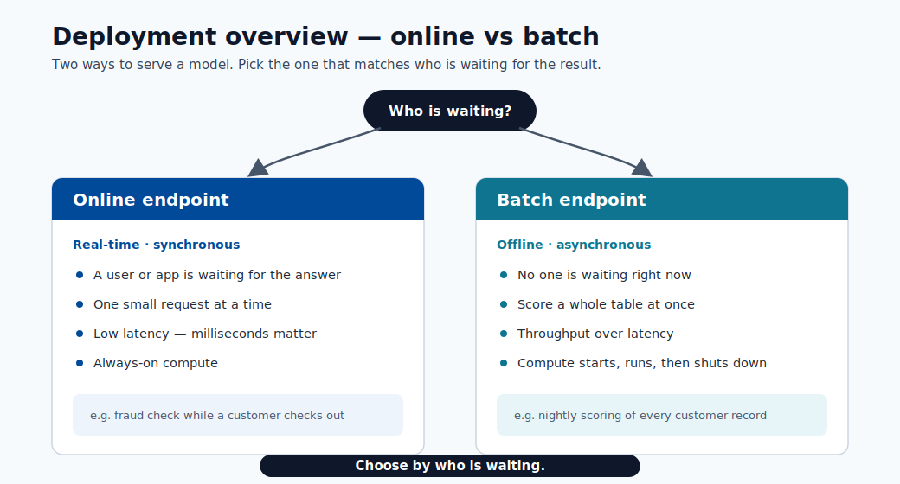
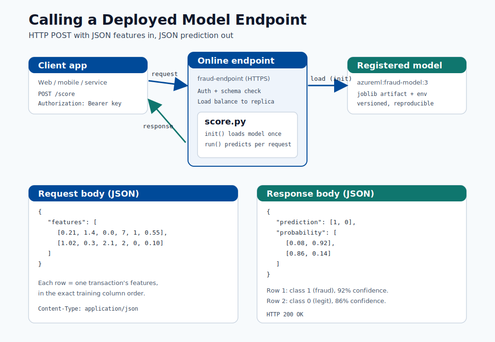
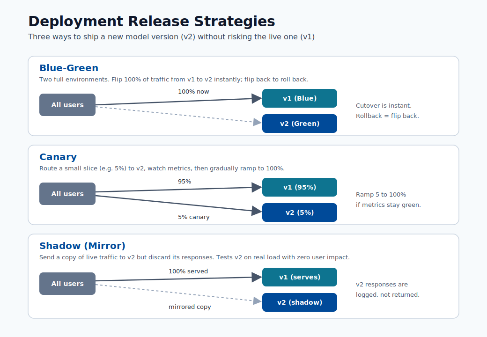
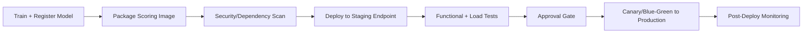
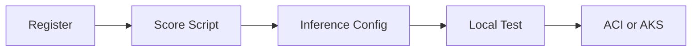
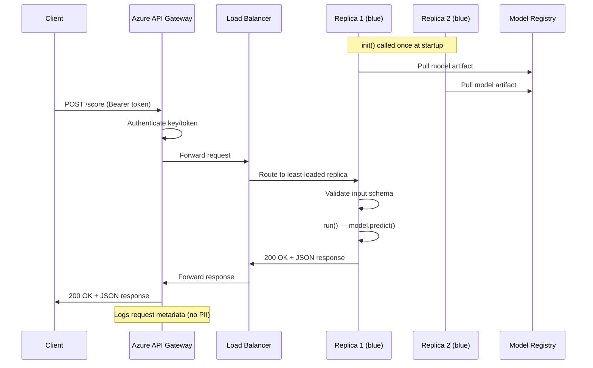
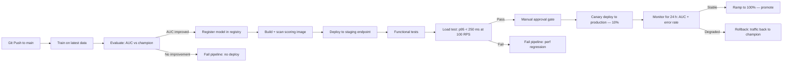

# Deployment

This module covers the path from model artifact to production endpoint, including
deployment patterns, release strategies, and operational safeguards.


> **Note - What this shows:** The contrast between the *training* model (offline, batch, optimized for accuracy) and the
> *deployment* model (online, stateless, optimized for latency). The same artifact serves two very
> different runtime contexts.


> **Note - What this shows:** The deployment flow from registered model to live endpoint. Each stage : package, validate
> locally, deploy, route traffic : is a checkpoint where a release can be caught before customers
> are affected.



> **Note - What this shows:** A high-level overview of deployment options (online vs batch endpoints). Choose by *who is
> waiting*: a user/app in real time → online endpoint; a whole table scored overnight → batch
> endpoint.

## Deployment steps

1. Register model
2. Build scoring script with init and run
3. Create inference environment
4. Validate local deployment
5. Deploy to ACI or AKS

### Scoring script structure (Azure ML SDK v2)

```python
import json
import numpy as np
import joblib
from azureml.core.model import Model

def init():
    global model
    model_path = Model.get_model_path("fraud-model")
    model = joblib.load(model_path)

def run(raw_data: str) -> str:
    data = json.loads(raw_data)
    features = np.array(data["features"])
    prediction = model.predict(features)
    probability = model.predict_proba(features)
    return json.dumps({
        "prediction": prediction.tolist(),
        "probability": probability.tolist()
    })
```

Key rules for a production-grade scoring script:

- `init()` runs once at startup; load model here, not in `run()`.
- `run()` is called for every request; keep it stateless.
- Validate input schema inside `run()` before calling the model.
- Never log raw PII; log hashed IDs and prediction metadata only.

## Endpoint types

| Type | Best for | Trade-off |
|---|---|---|
| Online endpoint | Real-time predictions | Requires low-latency ops |
| Batch endpoint | Large offline scoring jobs | Not real-time |

## End-to-end example: calling a deployed model

This walks through exactly what a deployed model looks like in practice : the API, what you send,
how to call it, and what comes back : using the `fraud-endpoint` from the scoring script above.



> **Note - How to read this diagram:** The client sends an HTTPS `POST` with a JSON body of feature
> rows. The endpoint authenticates the call, validates the schema, and routes it to a warm replica.
> Inside, `init()` has already loaded the registered model once, so `run()` only does the fast
> prediction and returns a JSON body with the predicted class and per-class probability.

### 1. What the API looks like

After deployment, Azure ML gives you two things:

| Item | Example | Where to get it |
|---|---|---|
| Scoring URI | `https://fraud-endpoint.eastus.inference.ml.azure.com/score` | `az ml online-endpoint show -n fraud-endpoint --query scoring_uri` |
| Auth key/token | `Bearer <primary-key>` | `az ml online-endpoint get-credentials -n fraud-endpoint` |

The contract is a simple HTTP POST:

| Field | Value |
|---|---|
| Method | `POST` |
| Path | `/score` |
| Headers | `Content-Type: application/json`, `Authorization: Bearer <key>` |
| Body | JSON object: `{"features": [[...], [...]]}` |

### 2. The request you send

```json
{
  "features": [
    [0.21, 1.4, 0.0, 7, 1, 0.55],
    [1.02, 0.3, 2.1, 2, 0, 0.10]
  ]
}
```

Each inner array is one record, with values in the **exact same column order used during training**.
Here we send two transactions in a single call (batching reduces per-request overhead).

### 3. How to call it

=== "curl"

    ```bash
    curl -X POST "https://fraud-endpoint.eastus.inference.ml.azure.com/score" \
      -H "Content-Type: application/json" \
      -H "Authorization: Bearer $ENDPOINT_KEY" \
      -d '{"features": [[0.21, 1.4, 0.0, 7, 1, 0.55], [1.02, 0.3, 2.1, 2, 0, 0.10]]}'
    ```

=== "Python"

    ```python
    import os
    import requests

    url = "https://fraud-endpoint.eastus.inference.ml.azure.com/score"
    headers = {
        "Content-Type": "application/json",
        "Authorization": f"Bearer {os.environ['ENDPOINT_KEY']}",
    }
    payload = {"features": [[0.21, 1.4, 0.0, 7, 1, 0.55],
                            [1.02, 0.3, 2.1, 2, 0, 0.10]]}

    response = requests.post(url, json=payload, headers=headers, timeout=10)
    response.raise_for_status()
    result = response.json()

    for i, (label, proba) in enumerate(zip(result["prediction"], result["probability"])):
        confidence = max(proba)
        print(f"row {i}: class={label} confidence={confidence:.0%}")
    ```

=== "JavaScript"

    ```javascript
    const res = await fetch("https://fraud-endpoint.eastus.inference.ml.azure.com/score", {
      method: "POST",
      headers: {
        "Content-Type": "application/json",
        Authorization: `Bearer ${process.env.ENDPOINT_KEY}`,
      },
      body: JSON.stringify({
        features: [
          [0.21, 1.4, 0.0, 7, 1, 0.55],
          [1.02, 0.3, 2.1, 2, 0, 0.10],
        ],
      }),
    });
    const result = await res.json();
    console.log(result.prediction, result.probability);
    ```

### 4. The response you get back

```json
{
  "prediction": [1, 0],
  "probability": [
    [0.08, 0.92],
    [0.86, 0.14]
  ]
}
```

### 5. How to read the result

| Row | `prediction` | `probability` `[P(class0), P(class1)]` | Meaning |
|---|---|---|---|
| 0 | `1` | `[0.08, 0.92]` | Flagged as **fraud** with 92% confidence |
| 1 | `0` | `[0.86, 0.14]` | Predicted **legitimate** with 86% confidence |

- `prediction` is the model's chosen class per row (here `1 = fraud`, `0 = legitimate`).
- `probability` gives the confidence per class; the values in each row sum to `1.0`.
- Your application decides the **action threshold**: e.g. auto-block at `P(fraud) >= 0.90`, send to
  manual review between `0.50` and `0.90`, and allow below `0.50`. The model returns scores; the
  business rule turns them into decisions.

> **Tip - Handle errors in the client:** Expect non-`200` responses too : `401/403` (bad or expired
> key), `400` (schema/shape mismatch), `429` (throttling, back off and retry), and `503` (replica
> cold-start or overload). Always set a timeout and a small retry with backoff, as noted in the
> reliability checklist below.

## Release strategies



> **Tip - How to choose:** All three protect the live model (v1) while validating a new one (v2). **Blue-green** flips 100%
> of traffic at once and rolls back by flipping back : simplest, but the blast radius is the whole
> user base for the moment of the switch. **Canary** sends a small slice (e.g. 5%) to v2 and ramps
> up only while metrics stay healthy : the safest progressive rollout. **Shadow** mirrors real
> traffic to v2 but discards its responses, so you can test on production load with zero customer
> impact before any real cutover.

- Blue/green: switch traffic to a fully prepared new version.
- Canary: send a small percentage of traffic to new version first.
- Shadow: mirror traffic for observation without serving responses.

### When to use each strategy

| Strategy | Use when | Risk level |
|---|---|---|
| Blue/green | Rollback must be instant; new version is well-tested | Low (with rollback ready) |
| Canary | Need to validate new model on real traffic at low exposure | Medium |
| Shadow | Need to compare new model with zero customer exposure | Very low (no production impact) |
| Rolling update | Stateless microservice with no model-specific state | Low |

### Configuring canary traffic split (Azure ML managed online endpoint)

```yaml
# deployment.yml
$schema: https://azuremlschemas.azureedge.net/latest/managedOnlineDeployment.schema.json
name: blue
endpoint_name: fraud-endpoint
model: azureml:fraud-model:3
code_configuration:
  code: ./src
  scoring_script: score.py
environment: azureml:fraud-infer:2
instance_type: Standard_DS2_v2
instance_count: 1
```

After deploying both `blue` and `green`:

```bash
# Route 10% traffic to canary (green)
az ml online-endpoint update \
  --name fraud-endpoint \
  --traffic "blue=90 green=10"
```

## Reliability checklist

1. Health probes and liveness checks configured.
2. Request/response schema validation in scoring script.
3. Timeouts and retries defined at client and service layer.
4. Rollback criteria defined before release.

## Security checklist

- Enforce auth keys/tokens and rotate credentials.
- Restrict network exposure (private endpoints when possible).
- Log access and prediction metadata for audits.

## CI/CD deployment pipeline (recommended)



## Capacity planning basics

Required replica estimate:

$$
R \approx \left\lceil \frac{QPS\cdot t_{p95}}{u}\right\rceil
$$

where:

- $QPS$: expected requests per second
- $t_{p95}$: p95 service time (seconds)
- $u$: target utilization per replica (e.g., 0.6 to 0.8)

## Runtime SLI/SLO table

| SLI | Typical SLO |
|---|---|
| Availability | >= 99.9% |
| p95 latency | <= 250 ms |
| Error rate | <= 1% |
| Freshness of model version | <= 30 days (policy dependent) |



## Quick self-check

| # | Question | Answer |
|---|----------|--------|
| 1 | When is a batch endpoint better than an online endpoint? | When no user is waiting on the response: high-throughput, offline scoring of large datasets (e.g., scoring an entire table overnight). |
| 2 | Why run a local validation step before cloud deployment? | It catches cheap, common failures (bad dependencies, model-load errors, schema mismatches) in seconds, before paying for cloud provisioning or risking a failed production rollout. |
| 3 | What is the advantage of a canary release? | It routes a small slice of real traffic to the new version and watches metrics before ramping up, limiting blast radius and catching problems offline tests miss. |

## Deep dive: every concept, explained

This section explains the deployment concepts so each operational choice has a clear rationale.

### Why `init()` and `run()` are split

The scoring script has two functions by design:

- **`init()`** runs **once** when the container starts. Loading the model (often hundreds of MB)
  is expensive, so doing it here : into a global : means it happens a single time, not per request.
- **`run()`** executes **per request** and must be **stateless**: no shared mutable state between
  calls, so concurrent requests cannot corrupt each other. Statelessness is also what makes the
  service horizontally scalable : any replica can handle any request.

This separation directly determines latency: model load is a one-time **cold-start** cost;
`run()` is the **warm** per-request path you optimize.

### Online vs batch endpoints : matching shape to workload

| Dimension | Online endpoint | Batch endpoint |
|---|---|---|
| Trigger | Synchronous HTTP request | Scheduled / on-demand job |
| Latency goal | Milliseconds per request | Throughput over millions of rows |
| Scaling | Keep replicas warm | Spin up, process, scale to zero |
| Use when | A user/app waits for the answer | Scoring a whole table overnight |

The decision is about *who is waiting*: a checkout fraud check needs an online endpoint; scoring
yesterday's entire transaction log is cheaper and simpler as a batch job.

### Release strategies and the risk they manage

All three strategies exist to limit the blast radius of a bad model:

- **Blue/green** keeps the old version (blue) fully running while the new (green) is prepared,
  then flips 100% of traffic at once. Rollback is instant : flip back. Best when you trust the new
  version and need zero-downtime cutover.
- **Canary** routes a *small* slice (e.g. 10%) to the new version and watches metrics before
  ramping up. It validates on **real traffic** at controlled exposure : the safest way to catch
  problems that offline tests miss.
- **Shadow** sends a copy of traffic to the new model but discards its responses, so it is
  evaluated against production inputs with **zero customer impact**. Ideal for high-stakes models
  where even 10% exposure is too risky.

The Azure traffic-split (`blue=90 green=10`) is the concrete mechanism that implements canary on a
managed online endpoint.

### Capacity planning: where the replica formula comes from

$R \approx \lceil \tfrac{QPS\cdot t_{p95}}{u}\rceil$ is **Little's Law** applied to serving.
$QPS\cdot t_{p95}$ is the average number of requests *in flight* at any moment (arrival rate times
service time); dividing by target utilization $u$ (e.g. 0.7, leaving headroom for bursts and
tail latency) gives the replica count, rounded up. Using $t_{p95}$ rather than the mean sizes the
fleet for realistic worst-case service time, so the SLO holds under load rather than only on
average.

### SLIs, SLOs, and why model freshness is one of them

An **SLI** is a measured signal (availability, p95 latency, error rate); an **SLO** attaches a
target ("p95 ≤ 250 ms"). Including **model-version freshness** as an SLO is what distinguishes ML
serving from ordinary web serving : a perfectly available endpoint serving a stale, drifted model
is still failing its job. This connects deployment health back to the drift monitoring from the
previous module.

### Why local validation precedes cloud deployment

Validating the scoring container locally catches the cheap, common failures : bad dependencies,
model-load errors, schema mismatches : in seconds, before paying for cloud provisioning and
before risking a failed production rollout. It is the deployment analog of running unit tests
before merging: fail fast, fail cheap.

### Security concepts in serving

- **Auth keys/tokens** ensure only authorized callers reach the endpoint; **rotating** them
  limits damage from a leaked credential.
- **Private endpoints** keep traffic off the public internet for regulated data.
- Logging **prediction metadata but never raw PII** (log hashed IDs, not personal fields) gives
  auditability without creating a data-protection liability : the same principle the scoring-script
  rules enforce.

## Quick self-check (deep dive)

| # | Question | Answer |
|---|----------|--------|
| 1 | Why is the model loaded in `init()` and not in `run()`? | `init()` runs once at container startup, so the expensive model load happens a single time instead of on every request. |
| 2 | What property must `run()` have to allow horizontal scaling, and why? | It must be stateless (no shared mutable state), so any replica can handle any request and concurrent requests cannot corrupt each other. |
| 3 | Compare canary and shadow releases: which exposes customers to the new model, and which does not? | Canary exposes customers (a small slice of real traffic hits the new model); shadow does not, because its responses are discarded for zero customer impact. |
| 4 | In the replica formula $R \approx \lceil QPS \cdot t_{p95} / u \rceil$, why use p95 service time instead of the mean? | p95 sizes the fleet for realistic worst-case service time, so the SLO holds under load rather than only on average. |
| 5 | Why is model-version freshness treated as an SLO alongside latency and availability? | A perfectly available endpoint serving a stale, drifted model is still failing its job, so freshness is a quality target just like latency and availability. |

---

## Online vs batch endpoints: deep dive

Azure ML offers two endpoint families. Choosing the wrong one at the start of a project is an
expensive mistake to reverse, so this section provides the full decision criteria and
configuration detail.

### Managed online endpoint vs Kubernetes online endpoint

| Dimension | Managed online endpoint | Kubernetes online endpoint |
|---|---|---|
| Infrastructure management | Azure-managed (fully serverless) | Customer-managed AKS cluster |
| Traffic splitting | Native (percentage-based per deployment) | Via Kubernetes Service/Ingress rules |
| Custom networking | Private endpoint supported | Full VNet integration and custom CNI |
| GPU support | Available (A100, V100 instance types) | Any GPU node pool in AKS |
| Observability | Azure Monitor + built-in metrics | Bring-your-own Prometheus/Grafana |
| Cost model | Pay per instance-hour + reserved | AKS node pool cost (always-on) |
| Best for | Teams that want zero cluster ops | Platform teams with existing AKS governance |

### Batch endpoint triggers

Batch endpoints process large data volumes asynchronously. They support two trigger modes:

- **On-demand invocation** via `az ml batch-endpoint invoke` or SDK call.
- **Scheduled invocation** via an Azure ML schedule job linked to the batch endpoint.

```bash
# On-demand batch invocation
az ml batch-endpoint invoke \
  --name fraud-batch-endpoint \
  --input azureml:transactions-nov:1 \
  --mini-batch-size 100 \
  --instance-count 5
```

### Managed identity and traffic rules

Managed online endpoints support **system-assigned managed identity** to authenticate against
Azure services (Key Vault, Storage, ACR) without credentials in code.

```yaml
# endpoint.yml
$schema: https://azuremlschemas.azureedge.net/latest/managedOnlineEndpoint.schema.json
name: fraud-endpoint
auth_mode: key
identity:
  type: system_assigned
```

Traffic rules allow multiple simultaneous deployments with controlled splits:

```bash
# Split traffic 90/10 between blue and green deployments
az ml online-endpoint update \
  --name fraud-endpoint \
  --traffic "blue=90 green=10"

# Mirror traffic to shadow deployment (no response served from shadow)
az ml online-endpoint update \
  --name fraud-endpoint \
  --traffic "blue=100" \
  --mirror-traffic "shadow=50"
```

### Deployment configuration YAML in detail

```yaml
# deployment_blue.yml
$schema: https://azuremlschemas.azureedge.net/latest/managedOnlineDeployment.schema.json
name: blue
endpoint_name: fraud-endpoint
model: azureml:fraud-model:5
code_configuration:
  code: ./src
  scoring_script: score.py
environment: azureml:fraud-infer:3
instance_type: Standard_DS3_v2
instance_count: 2
request_settings:
  request_timeout_ms: 3000
  max_concurrent_requests_per_instance: 10
  max_queue_wait_ms: 500
liveness_probe:
  initial_delay: 30
  period: 10
  timeout: 2
  success_threshold: 1
  failure_threshold: 30
readiness_probe:
  initial_delay: 30
  period: 10
  timeout: 2
  success_threshold: 1
  failure_threshold: 10
data_collector:
  collections:
    request:
      enabled: true
    response:
      enabled: true
```

### Request path sequence diagram



---

## Autoscaling and load management

Autoscaling prevents both over-provisioning (wasting money) and under-provisioning (causing
timeouts). Azure ML managed online endpoints use **Horizontal Pod Autoscaling (HPA)** backed by
Azure Monitor metrics.

### Scale-out trigger logic

The autoscaler monitors two primary signals:

- **CPU utilization** — scale out when average CPU across replicas exceeds a target percentage.
- **Request queue depth** — scale out when pending requests exceed a threshold, even before CPU
  is fully saturated. This is critical for models with variable inference latency.

The scale-out decision uses the formula:

$$
N_{\text{target}} = \left\lceil N_{\text{current}} \times \frac{\text{current metric}}{\text{target metric}} \right\rceil
$$

Example: 3 replicas at 85% CPU with a 60% target → target = $\lceil 3 \times 85/60 \rceil = 5$ replicas.

### Autoscaling YAML for Azure ML managed online endpoint

```yaml
# autoscale_policy.yml — applied via az ml online-deployment update
$schema: https://azuremlschemas.azureedge.net/latest/managedOnlineDeployment.schema.json
name: blue
endpoint_name: fraud-endpoint
scale_settings:
  type: target_utilization
  min_instances: 2
  max_instances: 10
  target_utilization_percentage: 70
  polling_interval: 30
  cooldown_period: 120
```

| Parameter | Recommended value | Rationale |
|---|---|---|
| `min_instances` | ≥ 2 | Survive a single replica failure without downtime |
| `max_instances` | Cost ceiling / burst capacity | Cap spend; set based on quota |
| `target_utilization_percentage` | 60–75% | Leave headroom for request bursts and tail latency |
| `cooldown_period` | 120 s | Prevent oscillation (scale-in too fast after brief burst) |

### Why autoscaling requires stateless scoring

The autoscaler can add or remove replicas at any time. If a replica holds state (open
database connections per request, cached per-user context), routing a request to a new replica
would lose that state. **Statelessness** — every replica handles every request independently
using only the loaded model and the request payload — is the architectural prerequisite that
makes horizontal scaling correct and safe.

> **Tip - Pre-warm replicas:** Set `min_instances` to the number that handles your sustained
> non-peak traffic. This avoids cold-start latency spikes at the beginning of business hours
> when traffic ramps up faster than the autoscaler can provision.

---

## Model serving performance optimization

Latency and throughput are engineering problems with concrete techniques. This section covers
the five most impactful optimizations in order of implementation effort.

### ONNX export for cross-framework portability

**ONNX (Open Neural Network Exchange)** is a vendor-neutral model format. Exporting to ONNX
decouples the serving runtime from the training framework, enabling use of ONNX Runtime — a
highly optimized inference engine — regardless of whether the model was trained in PyTorch,
scikit-learn, or LightGBM.

```python
# Export LightGBM to ONNX
from skl2onnx import convert_sklearn
from skl2onnx.common.data_types import FloatTensorType
import onnx

initial_type = [("float_input", FloatTensorType([None, X_train.shape[1]]))]
onnx_model = convert_sklearn(lgbm_pipeline, initial_types=initial_type)

with open("model.onnx", "wb") as f:
    f.write(onnx_model.SerializeToString())
```

```python
# Serve with ONNX Runtime in scoring script
import onnxruntime as rt
import numpy as np

def init():
    global session
    model_path = os.path.join(os.getenv("AZUREML_MODEL_DIR"), "model.onnx")
    opts = rt.SessionOptions()
    opts.intra_op_num_threads = 4
    session = rt.InferenceSession(model_path, opts, providers=["CPUExecutionProvider"])

def run(raw_data: str) -> str:
    data = json.loads(raw_data)
    features = np.array(data["features"], dtype=np.float32)
    input_name = session.get_inputs()[0].name
    result = session.run(None, {input_name: features})
    return json.dumps({"prediction": result[0].tolist()})
```

Typical latency improvement from switching to ONNX Runtime: **20–60%** on CPU, depending on
model complexity.

### Model quantization: INT8

**Quantization** reduces model weight precision from FP32 to INT8, shrinking model size by
approximately 4× and reducing inference latency by 2–3× on supported hardware, at the cost of
a small accuracy drop (typically < 1% on well-calibrated models).

$$
x_q = \text{round}\!\left(\frac{x}{s}\right) + z
$$

where $s$ is the scale factor and $z$ is the zero point, computed from the weight distribution.

```python
# Dynamic quantization (no calibration data needed)
from onnxruntime.quantization import quantize_dynamic, QuantType

quantize_dynamic(
    model_input="model.onnx",
    model_output="model_int8.onnx",
    weight_type=QuantType.QInt8
)
```

| Format | Model size | Latency | Accuracy impact |
|---|---|---|---|
| FP32 (original) | 100% | Baseline | None |
| FP16 | ~50% | ~10–20% faster | Negligible |
| INT8 | ~25% | ~50–70% faster | < 1% on most tabular |

### Batching at inference time

Batching multiple requests together amortizes fixed per-call overhead (memory allocation,
ONNX session setup, feature preprocessing) across many rows.

```yaml
# Enable micro-batching in deployment
request_settings:
  max_concurrent_requests_per_instance: 20
  request_timeout_ms: 5000
```

For batch-tolerant applications, implement **client-side batching**: accumulate requests for
up to 50 ms and send them as a single payload. The scoring script then vectorizes the call:

```python
def run(raw_data: str) -> str:
    data = json.loads(raw_data)
    # Accepts a list of feature rows; vectorize in one call
    features = np.array(data["features"], dtype=np.float32)  # shape: (N, D)
    result = session.run(None, {input_name: features})
    return json.dumps({"prediction": result[0].tolist()})
```

### Connection pooling and dependency caching

If the scoring script calls downstream services (feature store, database), open the connection
in `init()` and reuse it across requests. Creating a new connection per request adds 20–200 ms
and exhausts database connection limits under load.

```python
def init():
    global model, feature_store_client
    model = load_model()
    feature_store_client = FeatureStoreClient(
        endpoint=os.environ["FEATURE_STORE_URI"],
        credential=DefaultAzureCredential(),
        pool_maxsize=20
    )
```

> **Note - Profiling inference latency:** Use `az ml online-endpoint get-logs` combined with
> custom timing logs in `run()` to identify which step dominates latency (feature fetch, model
> predict, serialization). Fix the dominant bottleneck first; optimizing a 2 ms step when feature
> fetch takes 150 ms yields negligible improvement.

---

## Multi-model endpoints and model routing

A single scoring endpoint can serve multiple models — for example, one model per customer
segment, geography, or product line. This reduces endpoint proliferation while maintaining
segment-specific accuracy.

### When to use multi-model endpoints

| Scenario | Pattern |
|---|---|
| 10+ segment models, same features, same schema | Load all models in `init()`; route in `run()` |
| Models differ by input schema | Separate endpoints (schema mismatch breaks batching) |
| A/B testing two algorithms | Multi-model with random routing + logging |
| Latency-critical path | Single model (multiple model loads increase cold-start) |

### Routing logic in scoring script

```python
import joblib
import json
import os
import threading
import numpy as np

_models = {}
_lock = threading.Lock()

def init():
    global _models
    model_dir = os.getenv("AZUREML_MODEL_DIR")
    # Load all segment models at startup
    for segment in ["retail", "corporate", "sme"]:
        model_path = os.path.join(model_dir, f"fraud_model_{segment}.pkl")
        if os.path.exists(model_path):
            _models[segment] = joblib.load(model_path)

def run(raw_data: str) -> str:
    data = json.loads(raw_data)
    segment = data.get("segment", "retail")

    with _lock:
        # Read is safe without a lock for already-loaded models,
        # but use lock if lazy-loading is added later
        model = _models.get(segment)

    if model is None:
        return json.dumps({"error": f"Unknown segment: {segment}"}), 400

    features = np.array(data["features"])
    prediction = model.predict(features)
    return json.dumps({"prediction": prediction.tolist(), "segment": segment})
```

### Thread safety with multiple models

When models are fully loaded in `init()` and only read (not mutated) in `run()`, concurrent
access is safe without a lock. A lock is required only if:

- Models are **lazy-loaded** on first request for a segment (mutable `_models` dict).
- The model uses **stateful inference** (e.g., an RNN with a carry state per sequence).

The pattern above uses `threading.Lock()` defensively in case lazy-loading is added later,
with negligible overhead because the critical section only resolves the dict lookup.

> **Note - Memory budget:** Each model loaded in `init()` consumes RAM continuously. For
> instance types with 8 GB RAM, loading 20 × 300 MB models will OOMKill the container. Profile
> total model size before choosing the instance type, or implement LRU eviction for rarely
> used segment models.

---

## Deployment security hardening

Security for ML endpoints goes beyond standard API security because the model artifact itself
and the input/output data carry unique risks.

### Network isolation

```yaml
# Private endpoint for managed online endpoint
az ml online-endpoint create \
  --file endpoint.yml \
  --set public_network_access=disabled \
  --set egress_public_network_access=disabled
```

With `public_network_access=disabled`, the endpoint is accessible only from within the
virtual network via a private endpoint. Combine with a Network Security Group rule that
allows only the application subnet to reach the private endpoint.

### Customer-managed keys (CMK)

By default, Azure ML encrypts stored artifacts with Microsoft-managed keys. For regulated
workloads, use CMK with Azure Key Vault:

```bash
az ml workspace update \
  --name ml-workspace \
  --resource-group ml-rg \
  --encryption-key-identifier "https://kv-mlops.vault.azure.net/keys/ml-cmk/abc123"
```

### PII scrubbing in scoring script

```python
import hashlib
import logging

def run(raw_data: str) -> str:
    data = json.loads(raw_data)

    # Validate required fields (reject at boundary, not deep in logic)
    if "features" not in data or not isinstance(data["features"], list):
        return json.dumps({"error": "Invalid request schema"}), 400

    if len(data["features"]) == 0 or len(data["features"]) > 1000:
        return json.dumps({"error": "Batch size must be between 1 and 1000"}), 400

    # Log hashed ID, never raw customer fields
    customer_id = data.get("customer_id", "")
    hashed_id = hashlib.sha256(customer_id.encode()).hexdigest()[:12]
    logging.info("Scoring request cid=%s batch_size=%d", hashed_id, len(data["features"]))

    features = np.array(data["features"])
    prediction = model.predict(features)
    return json.dumps({"prediction": prediction.tolist()})
```

### Input validation and schema enforcement

```python
from pydantic import BaseModel, validator
from typing import List
import numpy as np

class ScoringRequest(BaseModel):
    features: List[List[float]]

    @validator("features")
    def validate_shape(cls, v):
        if not v:
            raise ValueError("features list must not be empty")
        n_cols = len(v[0])
        if n_cols != 6:  # expected feature count
            raise ValueError(f"Expected 6 features per row, got {n_cols}")
        if len(v) > 1000:
            raise ValueError("Maximum batch size is 1000")
        return v

def run(raw_data: str) -> str:
    try:
        request = ScoringRequest.parse_raw(raw_data)
    except Exception as e:
        return json.dumps({"error": str(e)}), 400

    features = np.array(request.features)
    prediction = model.predict(features)
    return json.dumps({"prediction": prediction.tolist()})
```

### Auth key rotation policy

```bash
# Regenerate primary key (invalidates current primary; secondary key continues to work)
az ml online-endpoint regenerate-keys \
  --name fraud-endpoint \
  --key-type primary

# Update application secrets in Key Vault
az keyvault secret set \
  --vault-name kv-mlops \
  --name fraud-endpoint-key \
  --value "$(az ml online-endpoint get-credentials -n fraud-endpoint --query primaryKey -o tsv)"
```

> **Tip - Rotation cadence:** Rotate keys on a 90-day cycle at minimum. Automate rotation using
> an Azure Function triggered by an Event Grid event from Key Vault's near-expiry notification.
> Always update the secondary key first, then the primary, to avoid a brief auth outage.

---

## End-to-end deployment pipeline (CI/CD)

A fully automated CI/CD pipeline eliminates manual deployment steps, enforces quality gates,
and provides a documented audit trail from code commit to production endpoint.

### Pipeline architecture



### Full GitHub Actions YAML

```yaml
# .github/workflows/deploy.yml
name: Train-Evaluate-Deploy

on:
  push:
    branches: [main]
  workflow_dispatch:

env:
  AZURE_ML_WORKSPACE: ml-workspace
  AZURE_RESOURCE_GROUP: ml-rg
  ENDPOINT_NAME: fraud-endpoint

jobs:
  train-and-evaluate:
    runs-on: ubuntu-latest
    outputs:
      model_version: ${{ steps.register.outputs.model_version }}
      promoted: ${{ steps.evaluate.outputs.promoted }}
    steps:
      - uses: actions/checkout@v4
      - uses: azure/login@v2
        with:
          creds: ${{ secrets.AZURE_CREDENTIALS }}
      - name: Submit training job
        run: |
          az ml job create -f jobs/train.yml \
            --workspace-name $AZURE_ML_WORKSPACE \
            --resource-group $AZURE_RESOURCE_GROUP \
            --stream
      - name: Evaluate vs champion
        id: evaluate
        run: |
          RESULT=$(python scripts/evaluate_champion_challenger.py)
          echo "promoted=$RESULT" >> "$GITHUB_OUTPUT"
      - name: Register model
        id: register
        if: steps.evaluate.outputs.promoted == 'true'
        run: |
          VERSION=$(az ml model create -f model/model.yml \
            --workspace-name $AZURE_ML_WORKSPACE \
            --resource-group $AZURE_RESOURCE_GROUP \
            --query version -o tsv)
          echo "model_version=$VERSION" >> "$GITHUB_OUTPUT"

  deploy-staging:
    needs: train-and-evaluate
    if: needs.train-and-evaluate.outputs.promoted == 'true'
    runs-on: ubuntu-latest
    steps:
      - uses: actions/checkout@v4
      - uses: azure/login@v2
        with:
          creds: ${{ secrets.AZURE_CREDENTIALS }}
      - name: Deploy to staging
        run: |
          az ml online-deployment create \
            --file deployments/staging.yml \
            --workspace-name $AZURE_ML_WORKSPACE \
            --resource-group $AZURE_RESOURCE_GROUP
      - name: Run functional tests
        run: python tests/test_endpoint.py --env staging
      - name: Run load test
        run: |
          python tests/load_test.py \
            --endpoint staging-fraud-endpoint \
            --rps 100 \
            --duration 120 \
            --p95-threshold 250

  promote-to-production:
    needs: deploy-staging
    runs-on: ubuntu-latest
    environment:
      name: production
      url: https://fraud-endpoint.eastus.inference.ml.azure.com
    steps:
      - uses: actions/checkout@v4
      - uses: azure/login@v2
        with:
          creds: ${{ secrets.AZURE_CREDENTIALS }}
      - name: Canary deploy — 10%
        run: |
          az ml online-deployment create \
            --file deployments/canary.yml \
            --workspace-name $AZURE_ML_WORKSPACE \
            --resource-group $AZURE_RESOURCE_GROUP
          az ml online-endpoint update \
            --name $ENDPOINT_NAME \
            --traffic "blue=90 canary=10"
      - name: Wait and validate canary (24 h)
        run: python scripts/monitor_canary.py --duration 86400 --fail-on-degradation
      - name: Promote canary to 100%
        run: |
          az ml online-endpoint update \
            --name $ENDPOINT_NAME \
            --traffic "canary=100"
          az ml online-deployment delete \
            --name blue \
            --endpoint-name $ENDPOINT_NAME \
            --yes
```

### Environment promotion gates

| Gate | Check | Failure action |
|---|---|---|
| Champion-challenger eval | Challenger AUC ≥ champion AUC + 0.005 | Abort pipeline, keep champion |
| Staging functional test | All test cases pass | Abort, notify team |
| Staging load test | p95 < 250 ms @ 100 RPS | Abort, log perf regression |
| Manual approval | Human sign-off in GitHub environment | Block until approved or rejected |
| Canary health check | Error rate < 2% and AUC within 3% of baseline | Auto-rollback if degraded |

### Rollback trigger

```python
# scripts/monitor_canary.py — simplified rollback logic
import time
import subprocess

def get_canary_metrics(endpoint):
    # Query Azure Monitor for error rate and AUC over last 30 min
    ...

def rollback(endpoint):
    subprocess.run([
        "az", "ml", "online-endpoint", "update",
        "--name", endpoint,
        "--traffic", "blue=100 canary=0"
    ], check=True)

def monitor_canary(endpoint, duration_s, fail_on_degradation):
    start = time.time()
    while time.time() - start < duration_s:
        metrics = get_canary_metrics(endpoint)
        if metrics["error_rate"] > 0.02 or metrics["auc_delta"] < -0.03:
            print(f"Canary degraded: {metrics}. Rolling back.")
            rollback(endpoint)
            if fail_on_degradation:
                raise SystemExit(1)
        time.sleep(300)  # check every 5 minutes
```

> **Note - Immutable deployments:** Never mutate a running deployment. Instead, create a new
> deployment with the updated artifact and shift traffic. This ensures every production state
> is reproducible and rollback is always available by shifting traffic back to the previous
> named deployment.

## Quick self-check (advanced deployment)

| # | Question | Answer |
|---|----------|--------|
| 1 | You need to serve 15 segment-specific models from a single endpoint. What instance memory must you budget for, and what is the thread-safety risk to address? | Budget RAM at least equal to all 15 models resident simultaneously (15 × per-model size) to avoid an OOMKill; the thread-safety risk is the mutable `_models` dict under lazy-loading, which must be guarded with a lock. |
| 2 | A managed online endpoint returns 429 errors during a traffic spike before the autoscaler adds replicas. Which two autoscaler parameters control responsiveness, and how would you tune them? | `polling_interval` (how often the autoscaler checks) and `cooldown_period` (delay before further scaling): lower both so it detects and reacts to the spike faster, and lower `target_utilization_percentage` to leave more headroom. |
| 3 | Staging functional tests pass but the load test reports p95 = 380 ms. What are the three most likely causes and which ONNX/batching technique addresses each? | Slow model predict → export to ONNX Runtime; large FP32 weights/compute → INT8 quantization; fixed per-request overhead → micro-batching (vectorized batch scoring). |
| 4 | Why is `public_network_access=disabled` alone insufficient for full network isolation, and what additional resource is required? | It only blocks public inbound access; full isolation also needs a private endpoint in the VNet (plus NSG rules and `egress_public_network_access=disabled`) so traffic stays on the private network. |
| 5 | Why is monitoring the AUC delta during canary the right signal, and what would be wrong with monitoring accuracy instead? | AUC measures ranking quality independent of threshold and class balance; accuracy is misleading on imbalanced fraud data, where predicting all-negative scores high accuracy yet is useless. |

