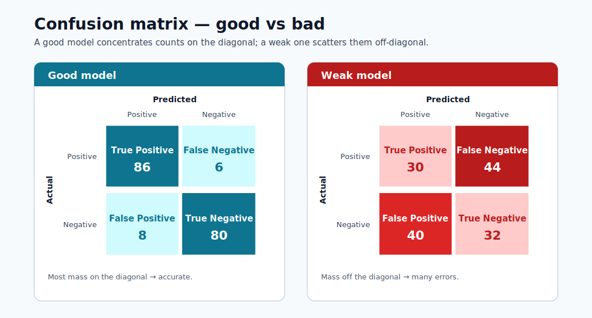
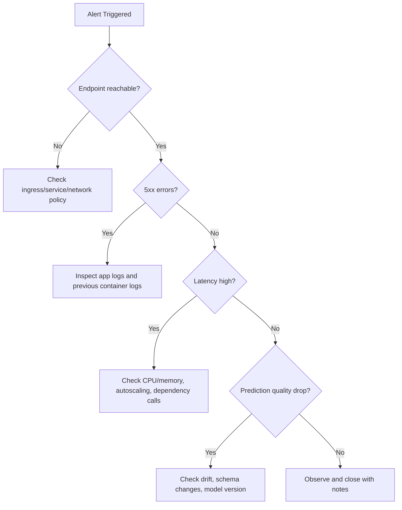

# Deployment Debugging with Kubernetes

This module provides a practical incident-response path for ML endpoints running on
Kubernetes-backed infrastructure.



> **Note - How to read it:** A good vs bad confusion matrix. A strong model concentrates mass on the diagonal (correct
> predictions); off-diagonal mass shows which error type dominates : the first clue when debugging
> a quality regression.


> **Note - How to read it:** A lift curve shows how much better the model ranks positives than random selection. A curve
> hugging the top-left captures most positives in the highest-scoring fraction : valuable for
> prioritized review queues.


> **Note - How to read it:** The ROC curve plots true-positive vs false-positive rate across thresholds. A curve bowing
> toward the top-left (higher AUC) ranks better; the diagonal is random guessing.

## Key tools

- kubectl
- kind
- minikube
- kubeadm

## Debugging workflow

1. Confirm deployment and pod status.
2. Inspect pod events and restart causes.
3. Inspect container logs (current and previous).
4. Validate service/endpoints and ingress paths.
5. Validate model input payload and schema.
6. Confirm model version and environment alignment.

## Useful commands

```bash
kubectl get pods
kubectl describe pod <pod-name>
kubectl logs <pod-name>
```

Additional high-value commands:

```bash
kubectl get events --sort-by=.lastTimestamp
kubectl logs <pod-name> --previous
kubectl get svc
kubectl get endpoints
```

### Systematic triage sequence

```bash
# 1. Check pod state
kubectl get pods -n <namespace>

# 2. If any pods are not Running, describe to see events
kubectl describe pod <pod-name> -n <namespace>

# 3. Check container logs (running)
kubectl logs <pod-name> -n <namespace> -c <container-name>

# 4. Check previous container logs (if CrashLoopBackOff)
kubectl logs <pod-name> -n <namespace> --previous

# 5. Check service endpoints are populated
kubectl get endpoints <service-name> -n <namespace>

# 6. Port-forward for direct endpoint test
kubectl port-forward svc/<service-name> 8080:80 -n <namespace>
curl -X POST http://localhost:8080/score -d '{"features":[...]}' -H 'Content-Type: application/json'
```

## Common failure patterns

| Symptom | Likely cause | First check |
|---|---|---|
| CrashLoopBackOff | Bad dependency/model load failure | `kubectl logs --previous` |
| 5xx from endpoint | Scoring code exception | container logs + payload schema |
| Timeout errors | Resource pressure or cold start | CPU/memory, readiness probes |
| Wrong predictions after release | Model/version mismatch | image tag + model registry version |

## SRE-style runbook basics

- Define severity levels and escalation contacts.
- Keep rollback commands ready.
- Capture post-incident timeline and root cause.
- Convert incident learnings into tests/alerts.

## Incident severity matrix

| Severity | Criteria | Typical response target |
|---|---|---|
| Sev-1 | Production outage or major business impact | Immediate response |
| Sev-2 | Partial degradation with workaround | <= 1 hour |
| Sev-3 | Non-critical defect or low-impact issue | Planned fix |

## Troubleshooting decision tree



## What to capture in postmortem

1. Detection time and symptom timeline.
2. Root cause and contributing factors.
3. What worked/failed in response.
4. Corrective actions and owners.

### Postmortem template

| Section | Content |
|---|---|
| Incident title | One-line description |
| Date/time | Detection → mitigation → full resolution |
| Severity | Sev-1 / 2 / 3 and impact scope |
| Detection | How was it found (alert, user report, monitoring)? |
| Root cause | Technical root cause (not blame) |
| Contributing factors | Infrastructure, process, or tooling gaps |
| Timeline | Minute-by-minute key actions |
| Impact | Customers / SLO breach duration / data gap |
| What went well | Positive signals in the response |
| What went wrong | Process or tooling failures |
| Action items | Specific, owned, time-bound fixes |

### Turning incidents into improvements

Every Sev-1 and Sev-2 incident should produce at least one concrete prevention action:

| Root cause pattern | Prevention action |
|---|---|
| Model version mismatch | Add version hash check to deployment script |
| Missing schema validation | Add input schema check to scoring script |
| No liveness probe | Add readiness and liveness probes to deployment YAML |
| Stale model drift | Automate weekly drift check + alert |
| Unreproducible environment | Pin all dependencies + register environment version |

## Quick self-check

| # | Question | Answer |
|---|----------|--------|
| 1 | Which command helps diagnose why a pod restarted? | `kubectl describe pod <name>` (events and last state) together with `kubectl logs --previous` to read the crashed container's output. |
| 2 | Why should you check `--previous` logs? | A restarted container may be too young to have logs; `--previous` shows the output of the crashed instance, which contains the actual failure (e.g., an `init()` exception). |
| 3 | What is one sign of a model/version mismatch? | Correct, healthy infrastructure but wrong predictions after a release – the deployed image tag points at a different model version than intended. |

## Deep dive: every concept, explained

This section explains the Kubernetes primitives and failure modes behind the commands so the
runbook becomes understandable rather than memorized.

### The Kubernetes objects you are actually debugging

| Object | What it is | Why it matters for ML serving |
|---|---|---|
| **Pod** | Smallest deployable unit; one or more containers sharing network/storage | Your scoring container runs here; pod health = endpoint health |
| **Deployment** | Controller that maintains N pod replicas | Handles rolling updates and self-healing |
| **Service** | Stable virtual IP/DNS load-balancing across pods | Clients hit the Service, not individual pods |
| **Endpoints** | The list of *ready* pod IPs behind a Service | Empty endpoints = traffic has nowhere to go (a common "503") |
| **Ingress** | HTTP routing from outside the cluster to Services | Where external URL → internal Service mapping lives |

The triage sequence in this module walks *outside-in* along this chain (ingress → service →
endpoints → pod → container), because a request fails at whichever link is broken.

### Pod lifecycle and what the states mean

A pod moves through phases, and the failing phase points at the cause:

- **Pending** : scheduler cannot place the pod (insufficient CPU/memory quota, no matching node).
- **ContainerCreating** : image is being pulled or a volume is mounting; a stall here usually
  means a registry/auth or storage problem.
- **Running** : containers started; the app may still be unhealthy if probes fail.
- **CrashLoopBackOff** : the container starts, exits, and Kubernetes restarts it with increasing
  backoff. For ML this almost always means **`init()` failed**: a missing dependency or a model
  that won't load. This is why `kubectl logs --previous` is essential : the current container may
  be too young to have logs, so you read the *crashed* container's output.

### Liveness vs readiness probes

- A **readiness probe** decides whether a pod should receive traffic. Until it passes, the pod is
  kept out of the Service's **Endpoints** list : which is why a slow model load (long cold start)
  shows up as empty endpoints and timeouts rather than errors.
- A **liveness probe** decides whether to *restart* a stuck pod. A deadlocked scoring process with
  no liveness probe will hang forever; with one, Kubernetes recycles it.

Missing probes is a recurring root cause in the prevention table precisely because without them
Kubernetes cannot tell a warming-up pod from a broken one.

### Mapping the common failures to their mechanism

| Symptom | Underlying mechanism | Why the listed check works |
|---|---|---|
| `CrashLoopBackOff` | `init()` raised (bad dep / model load) | `--previous` logs show the exception from the dead container |
| 5xx from endpoint | `run()` raised on a request | Container logs + payload schema reveal the bad input or bug |
| Timeouts | Resource pressure or cold start | CPU/memory + readiness probe state show saturation or slow start |
| Wrong predictions after release | Image tag points at the wrong model version | Compare deployed image tag against the model-registry version |

### Why model/version mismatch is uniquely an ML failure

In ordinary microservices, "the code is the artifact". In ML, the **model is a separate versioned
artifact** baked into (or mounted by) the image. A deploy can succeed, the service can be healthy,
and predictions can still be silently wrong because the image references model `v2` while the
intended one was `v3`. This is why the prevention action is a **version-hash check** at deploy
time, and why lineage (from the environment module) matters: it lets you prove which model version
is actually serving.

### From incident to prevention : the reliability flywheel

The postmortem template and "incident → prevention" table encode an **SRE** principle: every
Sev-1/Sev-2 must yield at least one durable safeguard (a probe, a schema check, a version
assertion, an automated drift alert). Over time this converts painful one-off outages into
permanent tests and alerts, steadily lowering the rate of repeat incidents : the operational
counterpart to the validation gates and SLOs introduced earlier in the course.

## Quick self-check (deep dive)

| # | Question | Answer |
|---|----------|--------|
| 1 | Why is the "outside-in" triage order (ingress → service → endpoints → pod → container) more efficient than starting at the pod? | A request fails at whichever link is broken, so following the chain from the outside isolates the broken link directly instead of guessing at the deepest layer first. |
| 2 | A Service returns 503 but every pod shows `Running`. Which object would you inspect next, and what would empty contents tell you? | Inspect the Service's `Endpoints`; an empty list means no pod is `Ready` (failing readiness probe / slow model load), so traffic has nowhere to go. |
| 3 | Why does `CrashLoopBackOff` for an ML container almost always point at `init()` rather than `run()`? | `init()` runs at container start and loads the model/dependencies; a missing dependency or unloadable model makes the container exit immediately and restart in a loop. |
| 4 | What is the difference between a readiness probe and a liveness probe, and which does a slow model load affect first? | Readiness decides whether a pod receives traffic; liveness decides whether to restart a stuck pod. A slow model load affects readiness first (pod stays out of Endpoints until it passes). |
| 5 | Why can a deployment be "healthy" yet still serve wrong predictions, and what single deploy-time check prevents it? | The model is a separate versioned artifact, so a healthy service can reference the wrong model version; a version-hash check at deploy time prevents it. |

---

## Kubernetes fundamentals for ML engineers

ML engineers interact with Kubernetes primarily through `kubectl` output and YAML manifests.
This section explains the four core objects you will encounter when deploying and debugging ML
endpoints — not just as definitions but as things you will read and diagnose in practice.

### Pods

A **Pod** is the smallest deployable unit in Kubernetes. It wraps one or more containers that
share a network namespace and storage volumes. For ML serving, a pod typically contains one
scoring container (and sometimes an init container that performs model pre-checks).

Reading `kubectl get pods` output:

```
NAME                            READY   STATUS    RESTARTS   AGE
fraud-scorer-7d4b9f-xk2pq       1/1     Running   0          3d
fraud-scorer-7d4b9f-mp9wz       1/1     Running   2          3d
fraud-scorer-7d4b9f-nt8rs       0/1     Pending   0          5m
```

| Column | What it means |
|---|---|
| `READY` | `1/1` = all containers in the pod are ready. `0/1` = not ready (readiness probe failing or not yet started) |
| `STATUS` | `Running` = at least one container is executing; `Pending` = not scheduled; `CrashLoopBackOff` = restarting repeatedly |
| `RESTARTS` | Non-zero restarts indicate liveness probe failures or container crashes |
| `AGE` | A very recent pod after a deployment rollout is the one most likely to have a new issue |

### Deployments

A **Deployment** tells Kubernetes how many pod replicas to maintain and what template to use.
It handles rolling updates and self-healing. Reading `kubectl get deployment` output:

```
NAME            READY   UP-TO-DATE   AVAILABLE   AGE
fraud-scorer    3/3     3            3           10d
```

| Column | What it means for ML |
|---|---|
| `READY` | `3/3` = all desired replicas are ready to serve traffic |
| `UP-TO-DATE` | Number of replicas that have the latest template (e.g., new model image); less than desired = rollout in progress |
| `AVAILABLE` | Replicas passing readiness probes; this is the number actually serving requests |

Inspecting the rollout status during a model update:

```bash
kubectl rollout status deployment/fraud-scorer -n ml-serving
# Waiting for deployment "fraud-scorer" rollout to finish: 1 out of 3 new replicas have been updated...
```

### Services

A **Service** provides a stable virtual IP and DNS name that load-balances across pod replicas.
Clients send traffic to the Service, never to individual pods. Reading `kubectl get svc`:

```
NAME             TYPE        CLUSTER-IP     EXTERNAL-IP   PORT(S)   AGE
fraud-scorer     ClusterIP   10.96.44.120   <none>        80/TCP    10d
fraud-scorer-lb  LoadBalancer 10.96.44.121  20.42.0.10   443/TCP   10d
```

`ClusterIP` is internal-only; `LoadBalancer` has an external IP for outside-cluster access.

### Ingress

An **Ingress** maps external HTTP(S) hostnames and paths to Services inside the cluster. It is
where TLS termination and host-based routing live:

```yaml
apiVersion: networking.k8s.io/v1
kind: Ingress
metadata:
  name: ml-ingress
  annotations:
    nginx.ingress.kubernetes.io/proxy-read-timeout: "30"
spec:
  rules:
    - host: fraud-api.company.com
      http:
        paths:
          - path: /score
            pathType: Prefix
            backend:
              service:
                name: fraud-scorer
                port:
                  number: 80
```

Reading `kubectl get ingress`:

```
NAME         CLASS   HOSTS                   ADDRESS        PORTS   AGE
ml-ingress   nginx   fraud-api.company.com   20.42.0.10    80,443  10d
```

An empty `ADDRESS` field means the ingress controller did not assign an IP — the endpoint is
unreachable from outside the cluster.

### Resource requests and limits

Resource requests and limits are defined per container in the pod spec. They have outsized
importance for ML workloads where models can be hundreds of MB to GB.

```yaml
resources:
  requests:
    memory: "2Gi"
    cpu: "500m"
  limits:
    memory: "4Gi"
    cpu: "2"
```

| Field | Meaning | Effect if set wrong |
|---|---|---|
| `requests.memory` | Minimum memory the scheduler reserves | Too low: pod scheduled on a node with insufficient actual memory → OOMKill at runtime |
| `limits.memory` | Hard ceiling | Too low: model doesn't fit → OOMKilled on load |
| `requests.cpu` | Scheduling weight | Too low: pod may starve under load |
| `limits.cpu` | CPU throttle ceiling | CPU throttling adds latency even when nodes have spare capacity |

> **Note - CPU limits and ML:** Setting CPU limits too aggressively causes the Linux CFS scheduler
> to throttle the container mid-inference, adding unpredictable tail latency. A common production
> practice is to set CPU requests but leave CPU limits unset (or very generous), and rely on
> node auto-provisioning to prevent starvation.

### Namespaces

Namespaces partition cluster resources and access controls. In ML platforms, common namespace
conventions are:

| Namespace | Purpose |
|---|---|
| `ml-serving-prod` | Production inference endpoints |
| `ml-serving-staging` | Staging/canary endpoints |
| `ml-training` | Training job pods |
| `monitoring` | Prometheus, Grafana, alert manager |

Always specify `-n <namespace>` in `kubectl` commands or set your default namespace:

```bash
kubectl config set-context --current --namespace=ml-serving-prod
```

---

## Common Kubernetes failure modes in ML, explained

Each failure mode has a characteristic symptom, a root cause, and a definitive diagnostic
command sequence. Know all five.

### OOMKilled: memory limit exceeded

**Symptom:** Pod status shows `OOMKilled` or the restart count increments with no application
error in logs.

**Root cause:** The container exceeded the `limits.memory` value. For ML, this almost always
means the model artifact is larger than anticipated, or the scoring container accumulates memory
during batch requests.

```bash
# Confirm OOM
kubectl describe pod <pod-name> -n ml-serving-prod | grep -A5 "Last State"
# Output:
# Last State: Terminated
#   Reason: OOMKilled
#   Exit Code: 137
```

**Fix:**

```yaml
# Increase memory limit in deployment YAML
resources:
  requests:
    memory: "4Gi"
  limits:
    memory: "8Gi"
```

To find the actual model memory footprint before deploying:

```python
import tracemalloc
tracemalloc.start()
model = joblib.load("model.pkl")
current, peak = tracemalloc.get_traced_memory()
print(f"Model peak memory: {peak / 1024**2:.1f} MB")
```

### ImagePullBackOff: registry authentication failure

**Symptom:** Pod status `ImagePullBackOff` or `ErrImagePull`, container never starts.

**Root cause:** The node cannot pull the scoring container image, usually due to a missing or
expired imagePullSecret, an incorrect image tag, or a private registry not listed in the
pod spec.

```bash
# Diagnose
kubectl describe pod <pod-name> -n ml-serving-prod
# Look for: "Failed to pull image ... unauthorized: ..."

# Fix: create or refresh the registry secret
kubectl create secret docker-registry acr-secret \
  --docker-server=mlregistry.azurecr.io \
  --docker-username=$ACR_USERNAME \
  --docker-password=$ACR_PASSWORD \
  -n ml-serving-prod

# Reference in deployment spec
imagePullSecrets:
  - name: acr-secret
```

> **Tip - Use managed identity:** Attach the AKS node pool's managed identity to the Azure
> Container Registry with `AcrPull` role. This eliminates static credentials entirely and
> prevents `ImagePullBackOff` from credential expiry.

### Init:Error: init container failed

**Symptom:** Pod status `Init:Error` or `Init:CrashLoopBackOff`. The main container never starts.

**Root cause:** An init container — typically used to download a model artifact from blob
storage or run a migration — exited non-zero.

```bash
kubectl describe pod <pod-name> -n ml-serving-prod
# Look for init container "model-downloader" exit code

kubectl logs <pod-name> -c model-downloader -n ml-serving-prod
# Shows the actual error: 403 Forbidden, or model file not found
```

Common causes and fixes:

| Error | Cause | Fix |
|---|---|---|
| `403 Forbidden` on blob storage | Managed identity not assigned Storage Blob Data Reader | Assign RBAC role to pod identity |
| `model.pkl not found` | Wrong blob path or model version not registered | Verify model version in registry; fix init container args |
| Python import error | Missing package in init container image | Rebuild init container image with required packages |

### Pending: quota or node selector mismatch

**Symptom:** Pod remains in `Pending` state indefinitely.

```bash
kubectl describe pod <pod-name> -n ml-serving-prod
# Look for: "0/5 nodes are available: 5 Insufficient memory" or
#           "0/5 nodes are available: node(s) didn't match node selector"
```

**Root causes:**

- **Resource quota exceeded:** The namespace has a `ResourceQuota` that caps total memory/CPU.
  Check: `kubectl describe resourcequota -n ml-serving-prod`
- **Node selector mismatch:** The deployment requests a node labeled `gpu=true` but no such
  node exists in the pool. Check: `kubectl get nodes --show-labels`
- **Taints without tolerations:** GPU nodes are tainted; the pod spec is missing the toleration.

```yaml
# Add toleration for GPU node taint
tolerations:
  - key: "nvidia.com/gpu"
    operator: "Exists"
    effect: "NoSchedule"
nodeSelector:
  accelerator: nvidia-a100
```

### Full diagnosis command reference

```bash
# 1. Pod not Running — get the reason
kubectl describe pod <pod-name> -n <ns> | grep -E "Status|Reason|Message|Events" -A 3

# 2. OOMKilled confirmation
kubectl get pod <pod-name> -n <ns> -o jsonpath='{.status.containerStatuses[0].lastState.terminated}'

# 3. ImagePullBackOff — see registry error
kubectl describe pod <pod-name> -n <ns> | grep "Failed\|Error\|Back-off"

# 4. Pending — find scheduling blocker
kubectl describe pod <pod-name> -n <ns> | grep -A 10 "Events:"

# 5. Running but unhealthy — check readiness
kubectl get pod <pod-name> -n <ns> -o jsonpath='{.status.conditions}'
```

---

## Observability stack

A production ML endpoint requires more than pod logs. A full observability stack provides
metrics, logs, and traces — the three pillars — so you can answer "what happened, when, and why"
without SSH access to nodes.

### Prometheus metrics

Prometheus scrapes metrics from instrumented endpoints. For ML scoring containers, expose
custom metrics using the `prometheus_client` library:

```python
from prometheus_client import Counter, Histogram, start_http_server
import time

PREDICTION_COUNTER = Counter("ml_predictions_total", "Total predictions", ["segment", "class"])
INFERENCE_LATENCY = Histogram(
    "ml_inference_duration_seconds",
    "Inference latency",
    buckets=[0.01, 0.025, 0.05, 0.1, 0.25, 0.5, 1.0]
)

def init():
    start_http_server(8001)  # Prometheus scrapes :8001/metrics
    global model
    model = load_model()

def run(raw_data: str) -> str:
    start = time.time()
    data = json.loads(raw_data)
    prediction = model.predict(np.array(data["features"]))

    duration = time.time() - start
    INFERENCE_LATENCY.observe(duration)
    for label in prediction:
        PREDICTION_COUNTER.labels(segment="default", class=str(label)).inc()

    return json.dumps({"prediction": prediction.tolist()})
```

Prometheus ServiceMonitor (via Prometheus Operator):

```yaml
apiVersion: monitoring.coreos.com/v1
kind: ServiceMonitor
metadata:
  name: fraud-scorer-metrics
  namespace: monitoring
spec:
  selector:
    matchLabels:
      app: fraud-scorer
  endpoints:
    - port: metrics
      interval: 15s
      path: /metrics
```

### Grafana dashboards

A production ML Grafana dashboard should include these panels:

| Panel | Metric | Alert threshold |
|---|---|---|
| Request rate | `rate(ml_predictions_total[5m])` | < 10% of baseline → upstream issue |
| p50/p95/p99 latency | `histogram_quantile(0.95, ml_inference_duration_seconds_bucket)` | p95 > 250 ms |
| Error rate | `rate(http_requests_total{status=~"5.."}[5m]) / rate(http_requests_total[5m])` | > 2% |
| Pod restarts | `kube_pod_container_status_restarts_total` | > 0 in last 30 min |
| Memory utilization | `container_memory_working_set_bytes / container_spec_memory_limit_bytes` | > 85% |
| Prediction class distribution | `ml_predictions_total by (class)` | Any class drops to 0 |

> **Note - Class distribution alert:** Monitoring the distribution of predicted classes is
> a lightweight proxy for model quality. If a fraud model suddenly predicts 0 fraudulent
> transactions, the model has likely stopped working — this alert catches it before a business
> KPI review would.

### Jaeger distributed tracing

For ML pipelines that call a feature store, cache, or downstream API, distributed tracing
identifies which dependency is adding latency:

```python
from opentelemetry import trace
from opentelemetry.exporter.jaeger.thrift import JaegerExporter
from opentelemetry.sdk.trace import TracerProvider
from opentelemetry.sdk.trace.export import BatchSpanProcessor

provider = TracerProvider()
provider.add_span_processor(BatchSpanProcessor(JaegerExporter(
    agent_host_name="jaeger-agent.monitoring.svc.cluster.local",
    agent_port=6831
)))
trace.set_tracer_provider(provider)
tracer = trace.get_tracer("fraud-scorer")

def run(raw_data: str) -> str:
    with tracer.start_as_current_span("score-request") as span:
        data = json.loads(raw_data)
        span.set_attribute("batch_size", len(data["features"]))

        with tracer.start_as_current_span("feature-enrichment"):
            enriched = feature_store_client.get_features(data)

        with tracer.start_as_current_span("model-predict"):
            prediction = model.predict(enriched)

        return json.dumps({"prediction": prediction.tolist()})
```

### Azure Monitor integration

```bash
# Enable Container Insights on AKS cluster
az aks enable-addons \
  --resource-group ml-rg \
  --name ml-aks-cluster \
  --addons monitoring \
  --workspace-resource-id /subscriptions/<sub>/resourceGroups/ml-rg/providers/Microsoft.OperationalInsights/workspaces/ml-logs
```

Azure Monitor Container Insights provides:

- **Live log streaming** from pods without `kubectl exec`.
- **Container CPU/memory** metrics with historical retention.
- **Node health** and pool-level metrics.
- **KQL queries** over pod logs for structured log analysis:

```kql
ContainerLogV2
| where ContainerName == "fraud-scorer"
| where LogMessage contains "ERROR"
| summarize count() by bin(TimeGenerated, 5m)
| render timechart
```

---

## Chaos engineering for ML endpoints

Chaos engineering is the practice of deliberately injecting failures to verify that the system
handles them gracefully. For ML endpoints, this is more important than for typical microservices
because model inference adds unique failure modes (memory spikes during large batches, cold
starts from model reloading) that only appear under realistic conditions.

### Why chaos testing matters for ML

Standard functional tests check that the model returns correct predictions on valid inputs.
They do not answer:

- What happens when a pod is killed mid-request?
- Does the service recover when a replica is suddenly unavailable?
- Does the autoscaler react before latency SLOs are breached during a traffic spike?
- What happens when the feature store is slow?

Chaos engineering answers these questions before an on-call engineer discovers them at 2 am.

### Pod disruption budget

A **Pod Disruption Budget (PDB)** sets a floor on the number of replicas that must remain
available during voluntary disruptions (node drains, rolling updates):

```yaml
apiVersion: policy/v1
kind: PodDisruptionBudget
metadata:
  name: fraud-scorer-pdb
  namespace: ml-serving-prod
spec:
  minAvailable: 2
  selector:
    matchLabels:
      app: fraud-scorer
```

With this PDB, a `kubectl drain` operation on a node will not proceed if it would leave fewer
than 2 replicas available. This prevents a node maintenance window from accidentally making
the endpoint unavailable.

### Simulate pod kill

```bash
# Kill one replica and verify the service remains available
kubectl delete pod fraud-scorer-7d4b9f-xk2pq -n ml-serving-prod

# Simultaneously run load against the endpoint
ab -n 1000 -c 10 -H "Authorization: Bearer $ENDPOINT_KEY" \
   -p payload.json -T application/json \
   https://fraud-api.company.com/score

# Verify: error rate should be < 1% during the pod replacement window
```

Expected behavior: Kubernetes immediately detects the missing pod via the Deployment controller,
schedules a replacement, and traffic is routed to the remaining healthy replicas. The PDB
ensures at least 2 replicas are always available.

### Simulate high load

```bash
# Use k6 for a realistic load ramp
cat > load_test.js << 'EOF'
import http from "k6/http";
import { check, sleep } from "k6";

export const options = {
  stages: [
    { duration: "2m", target: 50 },   // ramp up
    { duration: "5m", target: 200 },  // sustained high load
    { duration: "2m", target: 0 },    // ramp down
  ],
  thresholds: {
    "http_req_duration": ["p(95)<250"],
    "http_req_failed": ["rate<0.02"],
  },
};

export default function () {
  const res = http.post(
    "https://fraud-api.company.com/score",
    JSON.stringify({ features: [[0.21, 1.4, 0.0, 7, 1, 0.55]] }),
    { headers: { "Content-Type": "application/json", Authorization: `Bearer ${__ENV.ENDPOINT_KEY}` } }
  );
  check(res, { "status 200": (r) => r.status === 200 });
  sleep(0.1);
}
EOF

k6 run load_test.js
```

### Circuit breakers

A circuit breaker pattern prevents a degraded downstream dependency (e.g., a slow feature store)
from cascading into a full endpoint failure. Implement using `pybreaker`:

```python
import pybreaker

feature_store_breaker = pybreaker.CircuitBreaker(
    fail_max=5,          # open after 5 consecutive failures
    reset_timeout=30,    # try again after 30 s
)

@feature_store_breaker
def get_features_safe(data):
    return feature_store_client.get_features(data)

def run(raw_data: str) -> str:
    data = json.loads(raw_data)
    try:
        enriched = get_features_safe(data)
    except pybreaker.CircuitBreakerError:
        # Fallback: use only request features, skip enrichment
        enriched = data["features"]

    prediction = model.predict(np.array(enriched))
    return json.dumps({"prediction": prediction.tolist()})
```

### What chaos engineering validates for ML

| Chaos scenario | What it validates |
|---|---|
| Pod kill | PDB prevents total outage; Deployment self-heals |
| Node drain | Rolling update does not drop requests |
| High load ramp | Autoscaler reacts before p95 SLO breach |
| Feature store latency injection | Circuit breaker activates; fallback path works |
| Model artifact unavailable at init | Error is logged and pod enters CrashLoopBackOff (not silent wrong predictions) |
| Large batch payload (1000 rows) | OOM does not occur; batch size validation triggers |

> **Tip - Run chaos tests in staging:** Always run chaos tests against the staging endpoint
> first. Validate that your PDB, autoscaler, and circuit breakers behave as expected before
> promoting to production. The blast radius of a failed chaos experiment in production is
> your entire user base.

---

## SRE practices applied to ML

Site Reliability Engineering (SRE) provides a principled framework for managing the operational
lifecycle of ML systems. This section maps SRE concepts to ML-specific implementations.

### SLI, SLO, and SLA definitions

| Term | Definition | ML example |
|---|---|---|
| **SLI** (Service Level Indicator) | A quantitative measurement of a system behavior | p95 inference latency; prediction AUC; error rate |
| **SLO** (Service Level Objective) | A target value or range for an SLI | p95 latency ≤ 250 ms; error rate ≤ 1%; AUC ≥ 0.82 |
| **SLA** (Service Level Agreement) | A contractual commitment, usually to customers | 99.9% availability; formal consequence if breached |

ML adds two SLIs that ordinary web services do not have:

- **Model quality SLI:** Measured AUC or F1 on recent labeled production data.
- **Model freshness SLI:** Age of the currently deployed model version (days since last retrain).

### Error budget

The error budget is the amount of unreliability the SLO allows:

$$
\text{Error budget} = 1 - \text{SLO}
$$

For an availability SLO of 99.9%, the error budget is 0.1% of time (~43.8 minutes/month).
The error budget is the team's license to take risk (deploy new models, change infrastructure).
When the budget is exhausted, no more risky changes until it recovers.

```python
# Simple error budget tracker
def compute_error_budget(slo_fraction, requests_total, errors_total):
    actual_success_rate = 1 - (errors_total / requests_total)
    budget_consumed = (slo_fraction - actual_success_rate) / (1 - slo_fraction)
    return max(0, 1 - budget_consumed)  # fraction of budget remaining

budget_remaining = compute_error_budget(
    slo_fraction=0.999,
    requests_total=10_000_000,
    errors_total=12_000  # 0.12% error rate
)
print(f"Error budget remaining: {budget_remaining:.1%}")
# Error budget remaining: 0.0% (budget exhausted)
```

### Toil reduction

**Toil** is manual, repetitive, automatable work that grows linearly with scale. For ML operations,
common toil sources and their automation:

| Toil | Automation |
|---|---|
| Manual model promotion after evaluation | Champion-challenger pipeline with automated gate |
| Checking drift dashboards daily | Alerting rules trigger; humans only engage on alerts |
| Rotating endpoint keys manually | Azure Function triggered by Key Vault near-expiry event |
| Running load tests before each release | Load test step in CI/CD pipeline |
| Updating monitoring thresholds when model retrained | Thresholds stored as model metadata; monitoring job reads them |

SRE practice: engineers should spend no more than 50% of time on toil. The remainder goes to
reducing the toil itself.

### Blameless postmortems

A blameless postmortem focuses on **system factors**, not individual blame. The cognitive
basis: humans make predictable mistakes when systems make it easy to make mistakes. The fix
is the system design, not the person.

Blameless postmortem principles:

1. **Assume competence:** The people involved made sensible decisions with the information available at the time.
2. **Focus on contributing factors:** What system conditions made the failure possible?
3. **Produce durable action items:** Each item must be specific, owned, and time-bound.
4. **Share findings:** Publish postmortems internally so others can learn.

What a blameless postmortem does NOT include:

- Naming an individual as the root cause.
- Disciplinary language.
- "Human error" as a root cause without explaining the system conditions that made the error likely.

### Game days

A **game day** is a structured, planned test of your incident response process. Unlike chaos
engineering (which tests system resilience), a game day tests *people and process*:

- Can the on-call engineer find the runbook?
- Does the runbook still work after infrastructure changes?
- How long does escalation take in practice?
- Are the monitoring alerts actually firing to the right people?

Game day template for an ML endpoint:

| Phase | Activity | Duration |
|---|---|---|
| Announce | Notify all stakeholders; define scope | 30 min before |
| Inject | Inject a realistic failure (pod kill, bad model version) | T+0 |
| Respond | On-call team responds as if it were real | T+0 to T+resolution |
| Review | Debrief: what worked, what was slow, what was missing | Post-incident |
| Improve | Update runbooks, alerts, and automation based on gaps | 1 week after |

### Runbook automation

A runbook should be executable, not just documented. Convert manual steps to scripts:

```bash
#!/bin/bash
# runbook: rollback-fraud-endpoint.sh
# Use: When canary metrics degrade; rolls back to previous champion deployment.

set -euo pipefail

ENDPOINT="${1:-fraud-endpoint}"
CHAMPION="${2:-blue}"
CANARY="${3:-canary}"
NAMESPACE="${4:-ml-serving-prod}"

echo "[RUNBOOK] Rolling back $ENDPOINT: shifting all traffic to $CHAMPION"

az ml online-endpoint update \
  --name "$ENDPOINT" \
  --traffic "$CHAMPION=100 $CANARY=0"

echo "[RUNBOOK] Verifying endpoint health..."
sleep 30

STATUS=$(az ml online-endpoint show -n "$ENDPOINT" --query "provisioning_state" -o tsv)
if [ "$STATUS" != "Succeeded" ]; then
  echo "[RUNBOOK] ERROR: Endpoint provisioning state is $STATUS. Escalate to Sev-1."
  exit 1
fi

echo "[RUNBOOK] Rollback complete. Monitor for 15 minutes before closing incident."
```

### On-call rotation

| Practice | Implementation |
|---|---|
| Primary + secondary rotation | PagerDuty or OpsGenie rotation; secondary auto-escalates if primary does not acknowledge in 10 min |
| Runbook ownership | Each runbook has an owner responsible for keeping it current |
| On-call handoff | Written handoff with open incidents, recent deployments, and known risks |
| Post-shift review | Brief written summary of incidents and action items after each on-call week |
| Toil tracking | Log time spent on each on-call task; surface to engineering manager for prioritization |

> **Note - On-call health:** SRE best practice caps on-call-induced interruptions at 2 per
> 12-hour shift on average. If the ML endpoint is generating more pages than this, the team is
> in a toil spiral. The correct response is to dedicate a sprint to reducing alert noise and
> automating the most common runbook steps — not to simply staff more people.

## Quick self-check (SRE and chaos)

| # | Question | Answer |
|---|----------|--------|
| 1 | A pod is `Pending` with "0/6 nodes available: 6 Insufficient memory" but the namespace ResourceQuota is not exhausted. What command do you run next and what do you look for? | Run `kubectl describe nodes` (or check node allocatable vs requests) to see actual node memory pressure; the cluster lacks a node with enough free memory, so you scale the node pool or lower the pod's memory request. |
| 2 | A Grafana panel shows the `fraud` prediction class dropping to 0 at 14:32 UTC. What three things would you check first, in order? | Upstream feature/data pipeline health (nulls or schema change), a recent deployment or model-version change around 14:32, and input drift on key features feeding that class. |
| 3 | Your error budget is 75% consumed with 10 days left and a team wants to canary a new model. Should you approve, and what would change your answer? | Be cautious: with only 25% budget left a risky deploy can exhaust it; approve only if the change is low-risk behind a tight canary with auto-rollback, or wait until the budget recovers. |
| 4 | A game day shows the on-call engineer took 22 minutes to find the rollback runbook. Name two concrete improvements to the runbook process. | Make runbooks discoverable and linked directly from the alert, and convert manual steps into an executable, owned script that is tested regularly (e.g., during game days). |
| 5 | Why is "human error" not an acceptable root cause in a blameless postmortem, and how would you reframe it? | Systems make predictable mistakes easy, so blame hides the real cause; reframe "engineer ran the wrong command" as "the tool allowed an unguarded destructive command" – a missing confirmation/guardrail. |

