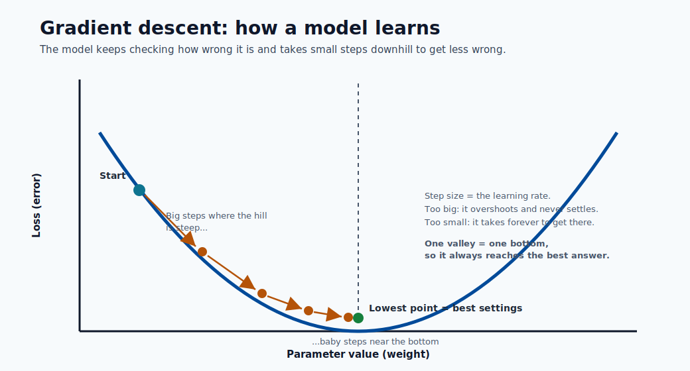
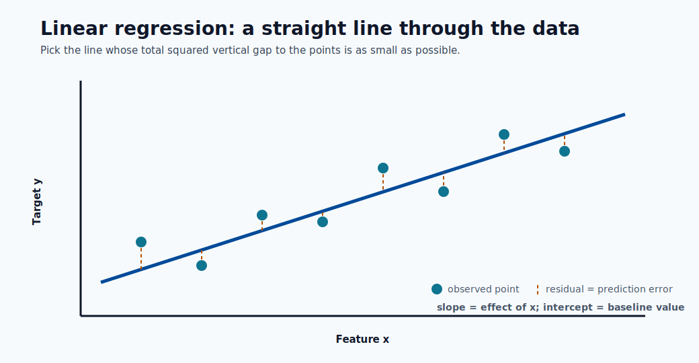
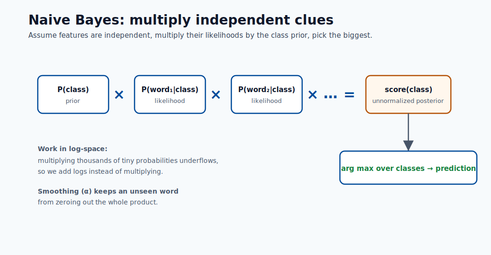
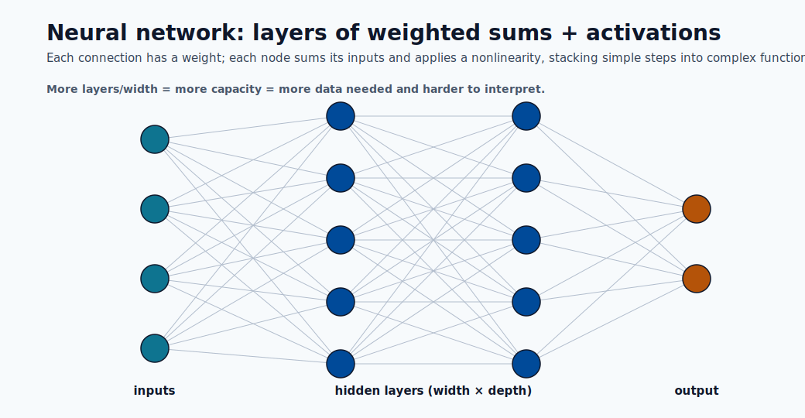
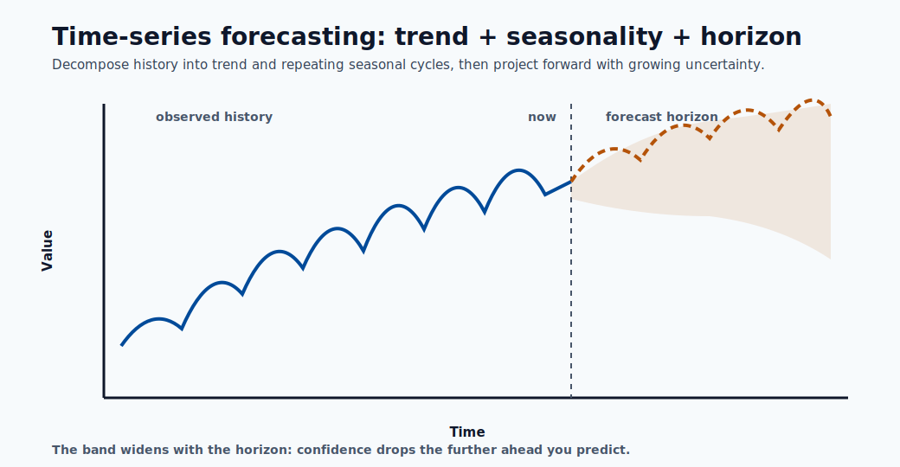

# Mathematical Deep Dive: Core ML Models

This page is an expanded mathematical deep dive of the model families used across
this training hub. It is designed as a practical reference for engineers who want
both formula-level understanding and production intuition. Every section follows the
same rhythm: **what the model assumes**, **the objective it optimizes**, **how it is
trained**, **the kinds/variants it comes in**, **how to tune it**, and **how it fails**.

## How to use this page

1. Start with the objective function and assumptions.
2. Review optimization behavior and regularization knobs.
3. Check failure modes before deployment.
4. Connect to metric choice in the performance module.

## What this page covers (overview)

The table below is a map of everything explained later on. Read it top-to-bottom as a
rough order of increasing capacity (and increasing risk of overfitting): linear models
are the simplest and most interpretable, neural networks the most flexible and the most
data-hungry. "Where it shines" is the single best reason to reach for each family.

| #  | Model family | Learning type | Output | Where it shines | Main weakness | Key hyperparameters |
|----|--------------|---------------|--------|-----------------|---------------|---------------------|
| 1  | Linear Regression | Supervised (regression) | Continuous value | Interpretable tabular baselines, trend estimation | Misses nonlinearity, sensitive to outliers | regularization $\lambda$, penalty type |
| 2  | Logistic Regression | Supervised (classification) | Class probability | Calibrated probabilities, interpretable risk scoring | Linear decision boundary only | $\lambda$, class weights, threshold $\tau$ |
| 3  | Naive Bayes | Supervised (classification) | Class probability | Text/spam, very high-dimensional sparse data | Independence assumption, weak calibration | smoothing $\alpha$, distribution choice |
| 4  | Support Vector Machine | Supervised (class./regr.) | Class or value | Clear margins, medium-size complex boundaries | Scales poorly to large $N$, needs scaling | $C$, kernel, $\gamma$ |
| 5  | Decision Tree | Supervised (class./regr.) | Class or value | Human-readable rules, mixed data types | Overfits, unstable to small data changes | max depth, min samples, criterion |
| 6  | Random Forest | Supervised ensemble (bagging) | Class or value | Robust tabular baseline with little tuning | Larger memory/latency, less interpretable | n_estimators, max_features, depth |
| 7  | Gradient Boosting | Supervised ensemble (boosting) | Class or value | Best-in-class tabular accuracy | Tuning sensitivity, overfit risk | learning_rate, n_estimators, depth/leaves |
| 8  | Neural Network (MLP) | Supervised (class./regr.) | Class or value | Unstructured data, complex interactions | Data hunger, harder to interpret/operate | layers, width, learning rate, dropout |
| 9  | Time-Series Models | Supervised (forecasting) | Future values | Temporal/seasonal data, demand & capacity | Needs chronological care, drift-prone | order $(p,d,q)$, seasonality, horizon |

Families 1-3 are **parametric and convex** (a single global optimum, fast to train).
Families 4-9 trade that guarantee for **flexibility**: trees and ensembles capture
nonlinear interactions, and neural networks approximate almost any function given enough
data. Sections 10 and 11 then compare them side-by-side and give an Azure ML selection
workflow.

> **Tip - Reading the math:** Throughout, $X$ is the feature matrix ($N$ rows, $d$ columns),
> $y$ the target, $\theta$ or $w$ the learned weights, and $\mathcal{L}$ a loss. "Convex" means
> gradient descent cannot get stuck in a bad local optimum; "non-convex" (trees, deep nets) means
> training is a heuristic search and results depend on initialization and data order.

## What the mathematical components actually mean (in action and in value)

Every model below is built from the same handful of mathematical ideas. The formulas look
different, but they are doing the same jobs. This section decodes each recurring component:
what it **is**, what it **does in action** during training or prediction, and what **value** it
delivers to a real project. Read this once and the rest of the page becomes pattern-matching.

### The model function $f_\theta(x)$ : the thing that makes predictions

- **What it is:** a formula with adjustable numbers (parameters $\theta$) that maps an input
  $x$ to an output $\hat{y}$. For linear regression it is a weighted sum; for a neural network
  it is layers of weighted sums and nonlinearities.
- **In action:** at **prediction time** this is literally the arithmetic your endpoint runs on
  each request: plug in the features, get a number out. The weights $\theta$ are frozen after
  training, so serving is just fast, deterministic math.
- **Its value:** the parameters are where the "learning" is stored. A 50 MB model file is just a
  big list of these numbers. Interpretable parameters (a regression coefficient) double as
  business insight: "each extra year of tenure lowers churn risk by X".

### The objective / loss function $\mathcal{L}$ : the definition of "wrong"

- **What it is:** a single number that measures how badly the current model fits the data.
  Squared error for regression, cross-entropy for classification, hinge loss for SVMs.
- **In action:** training is nothing more than **searching for parameters that make this number
  small**. The loss is the scoreboard the optimizer plays against; change the loss and you change
  what the model considers a good answer.
- **Its value:** this is your main lever for **encoding business priorities into math**. Caring
  more about rare fraud than common legit traffic? Weight the loss. Big errors much worse than
  small ones? Use squared error. The loss is where strategy becomes a number a computer can chase.

### Optimization and the gradient $\nabla_\theta \mathcal{L}$ : how the model learns

- **What it is:** the gradient is the slope of the loss with respect to every parameter : a vector
  pointing in the direction that **increases** error fastest. Gradient descent steps the opposite
  way: $\theta_{t+1} = \theta_t - \eta\,\nabla_\theta\mathcal{L}$.
- **In action:** training repeats "measure error, compute gradient, nudge weights downhill"
  thousands of times. The learning rate $\eta$ is the step size: too big and training diverges,
  too small and it crawls. This loop is what consumes your GPU hours.
- **Its value:** gradients are why models can have **millions of parameters** and still train :
  you never search blindly, you always know which way is downhill. Understanding this explains
  most training failures (loss exploding, loss stuck, loss oscillating).

The picture above is the whole idea in one image: the curve is the loss, the dots are successive
training steps, and the gradient is just the slope under each dot. Steps are large where the
slope is steep and shrink to nothing at the bottom, which is the model arriving at its best
weights.

### Convexity : the guarantee that training "just works"

- **What it is:** a convex loss is bowl-shaped : it has exactly one bottom. Non-convex losses
  (trees, deep nets) are a mountain range with many valleys.
- **In action:** for convex models (linear, logistic, SVM) the optimizer **always lands at the
  single best answer**, regardless of where it starts. For non-convex models, different random
  seeds give different results, so you set seeds, run multiple times, and validate carefully.
- **Its value:** convexity buys **reproducibility and trust** with almost no tuning : a huge
  reason simple models are still the right call for many production systems and audits.

### Regularization ($\lambda\|\theta\|$) : the brake that prevents memorizing

- **What it is:** an extra penalty added to the loss that grows when weights get large, so the
  model is rewarded for staying simple. $L_2$ shrinks weights smoothly; $L_1$ zeroes some out.
- **In action:** during training it pulls back on parameters that only fit noise, trading a bit
  of training accuracy for better performance on **unseen** data. The strength $\lambda$ is the
  single knob that moves the model along the underfit-to-overfit spectrum.
- **Its value:** this is the **generalization dial**. It is the difference between a model that
  scores 99% in the demo and fails in production, and one that scores 92% everywhere. Tuning
  $\lambda$ is often the highest-ROI thing you do.

### Probability, likelihood, and $\arg\max$ : turning scores into decisions

- **What it is:** many models output a probability $P(y\mid x)$ (sigmoid/softmax) and pick the
  class with the highest one via $\arg\max$. Training often **maximizes likelihood** : finding
  parameters that make the observed data most probable.
- **In action:** at prediction time the model emits a confidence (e.g. 0.83), and a threshold
  $\tau$ or $\arg\max$ converts it into an action (approve/deny). That threshold is a business
  choice applied *after* the math.
- **Its value:** probabilities let you **rank, prioritize, and set cost-aware cutoffs** instead
  of getting a bare yes/no. Calibrated probabilities are what make pricing, triage, and
  risk-scoring systems possible.

This is what "a score becomes a decision" looks like: the S-curve squashes any raw score into a
probability, and the dashed threshold line is the business rule that turns that probability into
a concrete Yes or No. Sliding the threshold left or right is how you trade catching more cases
against raising fewer false alarms.

### Linear algebra ($X\theta$, $X^TX$, kernels) : why any of this is fast

- **What it is:** stacking data into matrices and expressing predictions as matrix products.
  $X\theta$ computes every row's prediction at once; kernels compute similarities in bulk.
- **In action:** vectorized matrix operations run on optimized BLAS/GPU hardware, so scoring a
  million rows is one matrix multiply, not a million loops.
- **Its value:** this is the **engineering reason** ML is practical at scale. It also explains
  cost and latency: model size and feature count translate directly into FLOPs per request.

> **Note - The one-sentence summary:** A model is a **function** ($f_\theta$) whose **parameters**
> are chosen by an **optimizer** (gradient descent) to minimize a **loss** (your definition of
> wrong), kept honest by **regularization** (so it generalizes), and turned into **decisions** via
> **probabilities and thresholds**. Every section below is a specific choice of those five pieces.

Use this diagram as a mental checklist: when you meet any model below, ask which function it
uses, what loss it minimizes, how it optimizes, how it regularizes, and how it makes the final
call. Those five answers fully describe it.

---

## 1) Linear Regression

Linear regression is the foundational regression model and the mental anchor for almost
everything else: it predicts a continuous target as a **weighted sum of features**. It is
the model you reach for first because it is fast, interpretable, and gives a baseline that
more complex models must beat to justify their cost.

The line is the model and the dashed segments are the residuals : least squares simply picks the
line whose squared residuals add up to the smallest total. The slope is each feature's effect and
the intercept is the baseline value when every feature is zero.

Model form:

$$
\hat{y} = X\theta + b
$$

Each coefficient $\theta_j$ is the expected change in $\hat{y}$ for a one-unit increase in
feature $j$, **holding all other features fixed** : this is exactly why the model is so
interpretable, and also why correlated features make individual coefficients hard to trust.

Least-squares objective:

$$
\min_{\theta,b}\;\frac{1}{N}\|y-(X\theta+b)\|_2^2
$$

We square the residuals for two reasons: it penalizes large errors disproportionately, and
it yields a smooth, convex objective with a unique minimum. Minimizing squared error is also
equivalent to **maximum-likelihood estimation under Gaussian noise**, which is the formal
justification for the method.

Closed-form (normal equation, centered form):

$$
\hat{\theta}=(X^TX)^{-1}X^Ty
$$

This exact solution exists only because the problem is convex and quadratic. In practice we
rarely invert $X^TX$ directly (it is $O(d^3)$ and numerically unstable when features are
correlated); libraries use QR decomposition or, for large data, iterative gradient descent.

Assumptions and notes:

- **Linearity**: the target is a linear function of the features (you can still model curves
  by adding polynomial or interaction features).
- **Independent, homoscedastic errors**: residuals have constant variance and are uncorrelated.
- **Low multicollinearity**: highly correlated features inflate coefficient variance and make
  $X^TX$ near-singular.
- **Outlier sensitivity**: because errors are squared, a few extreme points can dominate the fit.
- It remains a **great baseline** for tabular regression and a diagnostic tool even when a
  fancier model ships.

Regularized variants (the "kinds" of linear regression):

- **Ridge (L2)**: adds $\lambda\|\theta\|_2^2$. Shrinks coefficients smoothly toward zero,
  stabilizes correlated features, and never sets weights exactly to zero. Best when many
  features each contribute a little.
- **Lasso (L1)**: adds $\lambda\|\theta\|_1$. Drives some coefficients exactly to zero, so it
  performs **automatic feature selection**. Best when you expect only a few features to matter.
- **Elastic Net**: combines L1 and L2, $\lambda_1\|\theta\|_1 + \lambda_2\|\theta\|_2^2$. Gets
  Lasso's sparsity while handling correlated feature groups gracefully.
- **Polynomial / basis-expansion regression**: still "linear in the parameters" but fits
  curves by transforming inputs ($x, x^2, x^3, \dots$).

> **Note - Azure ML connection:** Linear models train in seconds, so they make ideal
> smoke-test baselines in an AutoML run. If a heavily tuned boosting model barely beats ridge
> regression, the extra serving cost and complexity may not be worth it.

---

## 2) Logistic Regression

Despite the name, logistic regression is a **classification** model. It takes the same linear
score as linear regression and squashes it through the sigmoid function to produce a
probability between 0 and 1. It is the default first model for binary classification because
its outputs are calibrated, interpretable, and cheap to compute.

The boundary is the line where the predicted probability equals 0.5; points get more confidently
classified the further they sit from it. The shaded band is the uncertain zone where small feature
changes flip the prediction, which is exactly where threshold tuning matters most.

Binary probability:

$$
P(y=1\mid x)=\sigma(\theta^Tx+b)=\frac{1}{1+e^{-(\theta^Tx+b)}}
$$

The linear part $\theta^Tx+b$ is called the **logit** or log-odds. Rearranging gives
$\log\frac{p}{1-p}=\theta^Tx+b$, so each coefficient $\theta_j$ is the change in **log-odds**
per unit of feature $j$; exponentiating, $e^{\theta_j}$ is an **odds ratio**, which is how
these models are reported in risk and medical settings.

Binary cross-entropy loss:

$$
\min_{\theta,b}\;-\frac{1}{N}\sum_{i=1}^{N}\left[y_i\log\hat{p}_i+(1-y_i)\log(1-\hat{p}_i)\right]
$$

This is the negative log-likelihood of the data under a Bernoulli model. It is convex, so
there is a single global optimum, but unlike linear regression there is **no closed form** :
it is solved iteratively with gradient descent, Newton's method, or L-BFGS.

Decision rule:

$$
\hat{y}=\mathbb{1}[\hat{p}>\tau]
$$

The threshold $\tau$ is a **business decision, not a model parameter**. The default $0.5$ is
rarely optimal under class imbalance or asymmetric error costs; it is tuned afterward using
the precision/recall trade-off from the performance-metrics module.

Kinds and extensions:

- **Binary logistic regression**: the base two-class case above.
- **Multinomial (softmax) regression**: generalizes to $K$ classes with
  $P(y=k\mid x)=\frac{e^{\theta_k^Tx}}{\sum_j e^{\theta_j^Tx}}$.
- **Ordinal logistic regression**: for ordered categories (low/medium/high).
- **Regularized logistic regression**: L1/L2/Elastic-Net penalties, exactly as in linear
  regression, to control overfitting in high dimensions.

Practical points:

- Coefficients are interpretable in log-odds space, which auditors and domain experts like.
- Class imbalance requires threshold tuning and often **class weights** (penalize errors on the
  rare class more heavily).
- Always run **calibration checks** (reliability curves) when probabilities, not just labels,
  drive downstream decisions such as pricing or triage.
- Features should be scaled when using regularization, so the penalty treats them comparably.

> **Note - Azure ML connection:** Because the output is a probability, logistic regression
> pairs naturally with a threshold/cost policy at the endpoint: the model returns $\hat{p}$, and
> the application decides the action (block, review, allow) based on tuned cutoffs.

---

## 3) Naive Bayes

Naive Bayes is a **probabilistic classifier** built directly from Bayes' theorem. Its "naive"
simplifying assumption : that features are conditionally independent given the class : makes it
extremely fast and surprisingly effective on high-dimensional sparse data such as text.

The picture is the whole model: multiply the class prior by one likelihood per feature, do that
for every class, and take the largest. The independence assumption is what lets those per-feature
terms simply multiply, and working in log-space turns the product into a safe sum.

Bayes rule with conditional independence:

$$
P(y\mid x_1,\dots,x_d)\propto P(y)\prod_{j=1}^{d}P(x_j\mid y)
$$

$P(y)$ is the **prior** (how common each class is), and each $P(x_j\mid y)$ is the
**likelihood** of seeing a feature value given the class. The product over features is exactly
where the independence assumption enters : it lets us estimate $d$ simple one-dimensional
distributions instead of one intractable $d$-dimensional joint distribution.

Prediction:

$$
\hat{y}=\arg\max_y\left[\log P(y)+\sum_{j=1}^{d}\log P(x_j\mid y)\right]
$$

We work in **log-space** to turn the product into a sum, avoiding numerical underflow when
multiplying thousands of tiny probabilities (common in text with large vocabularies).

Kinds of Naive Bayes (the variant matches the feature distribution):

- **Gaussian NB**: continuous features modeled as normal distributions per class. Use for
  real-valued tabular data.
- **Multinomial NB**: discrete counts (e.g. word frequencies). The default for document/topic
  classification.
- **Bernoulli NB**: binary presence/absence features. Good for short texts where a word either
  appears or not.
- **Complement NB**: a multinomial variant that corrects for class imbalance, often better on
  skewed text corpora.

Why it works despite the assumption:

- Independence is often false, but the model only needs the **correct class to get the highest
  score** : accurate ranking survives even when the probability estimates are biased.
- It performs well for sparse high-dimensional text tasks (spam, sentiment, topic tagging) and
  trains in a single pass over the data.

Practical notes and failure modes:

- **Laplace/additive smoothing** ($\alpha$) is essential : without it, a single unseen
  feature-class combination produces a zero probability that wipes out the whole product.
- Correlated features **double-count evidence**, pushing probabilities toward 0 or 1, so the
  outputs are poorly calibrated even when labels are right.
- Treat its probabilities as scores, not trustworthy confidences, unless you recalibrate.

---

## 4) Support Vector Machines (SVM)

An SVM finds the decision boundary that **maximizes the margin** : the distance between the
boundary and the nearest points of each class. The intuition is that the widest possible
"street" between classes generalizes best. Only the points on the edge of that street (the
**support vectors**) determine the boundary; everything else is irrelevant.

The solid line is the boundary and the dashed lines mark the edges of the widest "street" that
still separates the classes. Only the circled support vectors touch those edges and define the
fit; the parameter $C$ decides how many points are allowed to sit inside the street.

Hard-margin formulation:

$$
\min_{w,b}\;\frac{1}{2}\|w\|^2 \quad \text{s.t.}\; y_i(w^Tx_i+b)\ge 1
$$

Minimizing $\|w\|^2$ is equivalent to **maximizing the margin** $2/\|w\|$. The hard-margin form
assumes the data is perfectly separable : a fragile assumption that breaks on any noisy dataset.

Soft-margin (hinge loss):

$$
\min_{w,b,\xi}\;\frac{1}{2}\|w\|^2 + C\sum_i\xi_i
\quad \text{s.t.}\; y_i(w^Tx_i+b)\ge 1-\xi_i,\;\xi_i\ge 0
$$

The **slack variables** $\xi_i$ allow some points to violate the margin, and $C$ controls the
trade-off: large $C$ punishes violations hard (low bias, high variance, risk of overfitting),
small $C$ tolerates them (wider margin, more regularization). This is the single most important
knob.

Kernel trick:

$$
K(x_i,x_j)=\phi(x_i)^T\phi(x_j)
$$

The kernel computes inner products in a high-dimensional feature space **without ever forming
that space explicitly**, letting a linear margin in the transformed space become a curved
boundary in the original one. Common kernels (the "kinds" of SVM):

- **Linear**: $K=x_i^Tx_j$. Fast, best when data is already high-dimensional (e.g. text).
- **Polynomial**: $K=(x_i^Tx_j+c)^p$. Captures feature interactions up to degree $p$.
- **RBF / Gaussian**: $K=\exp(-\gamma\|x_i-x_j\|^2)$. The flexible default; $\gamma$ sets how
  far each point's influence reaches.
- **Sigmoid**: behaves like a two-layer neural net for certain parameters.

Related forms:

- **SVR (Support Vector Regression)** applies the same margin idea to regression using an
  $\epsilon$-insensitive tube around the prediction.
- **One-Class SVM** is used for novelty/anomaly detection.

Practical notes:

- Strong on **medium-size** datasets with clear class structure.
- Kernel SVM scales **poorly on very large $N$** (training is between $O(N^2)$ and $O(N^3)$).
- Features **must be scaled** : distance-based kernels are dominated by large-magnitude features.
- Hyperparameters $C$ and the kernel parameters (e.g. $\gamma$) dominate behavior and require
  cross-validated tuning.

---

## 5) Decision Trees

A decision tree splits the data into ever-smaller regions by asking a sequence of yes/no
questions on features, producing a flowchart that a human can read directly. It is the building
block of the most powerful tabular models (forests and boosting), so understanding it is key.

Each internal box is a yes/no question on one feature and each leaf is a prediction; following a
row's answers from root to leaf is the entire inference process. The tree greedily picks the
question that most reduces impurity at every node, which is why deeper trees fit more detail but
risk memorizing noise.

Split criterion examples:

$$
\text{Gini}(S)=1-\sum_{k=1}^{K}p_k^2
$$

$$
H(S)=-\sum_{k=1}^{K}p_k\log_2 p_k
$$

Both measure **impurity** : how mixed the class labels are in a node. Gini and entropy behave
similarly; Gini is slightly cheaper to compute, entropy comes from information theory. A pure
node (all one class) has impurity 0.

Information gain for split $v$:

$$
IG=H(S)-\sum_v\frac{|S_v|}{|S|}H(S_v)
$$

The tree is grown **greedily**: at each node it tries every feature and threshold and picks the
split that most reduces impurity (largest information gain). It never reconsiders earlier
splits, which is why trees are fast but not globally optimal.

Kinds and criteria:

- **Classification trees** use Gini or entropy and predict the majority class in a leaf.
- **Regression trees** split to minimize variance (or MSE) and predict the **mean** of the
  leaf's targets.
- Classic algorithms differ in detail: **CART** (binary splits, the scikit-learn default),
  **ID3/C4.5** (multi-way splits, gain ratio).

Regularization (how you stop a tree from memorizing):

- **max_depth**: hard cap on how many questions deep the tree can go.
- **min_samples_split / min_samples_leaf**: require enough data in a node before/after a split.
- **Cost-complexity pruning** ($\alpha$): grow fully, then trim branches that add little.

Pros and risks:

- Highly **interpretable**, handles mixed numeric/categorical data, needs no feature scaling,
  and is insensitive to monotonic transforms.
- **Unpruned trees overfit quickly** : a deep tree can carve out a leaf for every training row.
- **High variance**: a small change in the data can produce a very different tree, which is the
  exact weakness that ensembles (Sections 6-7) were invented to fix.

---

## 6) Random Forest

A random forest is an **ensemble of decision trees** combined by averaging (regression) or
voting (classification). It directly attacks the single tree's high-variance weakness: many
decorrelated trees, each slightly wrong in a different way, average out to a stable prediction.

Each tree trains on its own random sample of rows and features, so they make different mistakes;
the vote (or average) cancels those mistakes out. This is bagging : it lowers variance without
increasing bias, which is why a forest is far more stable than any single tree.

Ensemble prediction (regression):

$$
\hat{y}=\frac{1}{T}\sum_{t=1}^{T}f_t(x)
$$

Classification via majority vote:

$$
\hat{y}=\text{mode}(f_1(x),\dots,f_T(x))
$$

Core idea : two sources of randomness make the trees different:

- **Bagging (bootstrap aggregation)**: each tree trains on a random sample of rows drawn with
  replacement, so no two trees see the same data.
- **Random feature subsets**: at each split a tree may only choose from a random subset of
  features, which prevents a few dominant features from making all trees look alike.

Averaging independent estimators reduces variance roughly in proportion to how **decorrelated**
they are : that is the whole reason for injecting randomness, not just bagging.

Useful properties:

- **Out-of-bag (OOB) error**: rows not sampled for a tree act as a built-in validation set,
  giving a free generalization estimate without a separate hold-out.
- **Feature importance**: averaged impurity reduction (or permutation importance) ranks which
  features the forest relied on : though correlated features can share/dilute importance.

Related variant:

- **Extremely Randomized Trees (Extra-Trees)** also randomize the split thresholds, trading a
  little more bias for even lower variance and faster training.

Trade-offs and tuning:

- **Strong baseline** for tabular data with minimal tuning : often competitive out of the box.
- More trees (`n_estimators`) only help (never overfit from count alone) but cost memory and
  inference latency; `max_features`, `max_depth`, and `min_samples_leaf` control each tree.
- Higher memory and inference cost than linear models; less interpretable than a single tree,
  though still explainable via importances and SHAP.

---

## 7) Gradient Boosting (XGBoost / LightGBM)

Gradient boosting builds an ensemble **sequentially**: each new tree focuses on the errors the
current ensemble still makes. Where a random forest builds independent trees in parallel and
averages them, boosting builds dependent trees in series and adds them : this is the difference
between reducing variance (forests) and reducing bias (boosting), and it is why boosting tends
to win accuracy contests on tabular data.

Unlike a forest's parallel vote, boosting adds trees in sequence: every new tree predicts the
leftover error of the running sum, scaled down by the learning rate. Summing these corrections
drives bias down step by step, while shrinkage and regularization keep it from chasing noise.

Additive stage-wise model:

$$
F_m(x)=F_{m-1}(x)+\nu h_m(x)
$$

where $h_m$ is a small tree fit to the **negative gradient** of the loss (the direction that
most reduces error), and $\nu$ is the **learning rate** (shrinkage). A small $\nu$ means each
tree contributes a little, so you need more trees but generalize better : the classic
`learning_rate` vs `n_estimators` trade-off.

Generic regularized objective:

$$
\mathcal{L}=\sum_{i=1}^{N}\ell(y_i,\hat{y}_i)+\sum_{m}\Omega(h_m)
$$

The second term $\Omega$ penalizes tree complexity (number of leaves, leaf weights). Modern
implementations such as XGBoost also use a **second-order (Newton) expansion** of the loss,
using both gradients and Hessians to choose splits more precisely.

Kinds and implementations (the "flavors" of boosting):

- **AdaBoost**: the original, reweights misclassified points each round.
- **Gradient Boosting Machines (GBM)**: the general gradient-descent-in-function-space view.
- **XGBoost**: regularized, second-order, level-wise tree growth; very robust.
- **LightGBM**: leaf-wise growth with histogram binning : fastest on large data, controlled by
  `num_leaves`.
- **CatBoost**: native, ordered handling of categorical features with less leakage.

Why it wins often on tabular data:

- Captures nonlinear interactions and feature thresholds automatically.
- Handles heterogeneous feature scales and missing values gracefully.
- Rich regularization and shrinkage controls let you trade bias for variance precisely.

Most important knobs (and what they do):

- `learning_rate` and `n_estimators`: lower rate + more trees = better but slower.
- `max_depth` or `num_leaves`: tree capacity; the main overfitting lever.
- `subsample`, `colsample_bytree`: row/column sampling for regularization and speed.
- `lambda_l1`, `lambda_l2`, `min_child_weight`: penalize complexity.

> **Note - Azure ML connection:** Boosting is the workhorse of AutoML's tabular runs. Because
> it is tuning-sensitive, pair it with early stopping on a validation set and HyperDrive/sweep
> search rather than hand-tuning.

---

## 8) Neural Networks (MLP basics)

A neural network stacks layers of linear transforms followed by nonlinear activations, letting
it approximate almost any function given enough capacity and data (the universal approximation
property). The multilayer perceptron (MLP) is the simplest form and the foundation for deep
learning architectures.

Every connection carries a weight and every node computes a weighted sum followed by a nonlinear
activation; stacking these simple steps is what lets the network represent complex functions. More
width and depth add capacity, which is powerful but demands more data and makes the model harder
to interpret and operate.

Layer mapping (forward pass):

$$
a^{(l)}=\phi\left(W^{(l)}a^{(l-1)}+b^{(l)}\right)
$$

Each layer applies weights $W^{(l)}$, a bias, and a nonlinearity $\phi$. The **nonlinearity is
essential** : without it, stacking layers would collapse into a single linear map. Common
choices are ReLU (fast, default for hidden layers), sigmoid/tanh (older, prone to vanishing
gradients), and softmax (output layer for multiclass probabilities).

Empirical risk minimization:

$$
\min_{\Theta}\frac{1}{N}\sum_{i=1}^{N}\mathcal{L}(f_{\Theta}(x_i),y_i)
$$

Gradient descent update:

$$
\Theta_{t+1}=\Theta_t-\eta\nabla_{\Theta}\mathcal{L}
$$

Gradients are computed by **backpropagation** (the chain rule applied layer by layer). The
objective is **non-convex**, so training finds a good local optimum, not a guaranteed global
one : results depend on initialization, data order, and the optimizer. In practice $\eta$ (the
learning rate) is the single most important hyperparameter, and adaptive optimizers like
**Adam** adjust it per-parameter for faster, more stable convergence than plain SGD.

Kinds of neural networks (beyond the MLP):

- **MLP / fully-connected**: tabular data and as building blocks.
- **CNN (convolutional)**: images and spatial data; share weights across locations.
- **RNN / LSTM / GRU**: sequences and time series with memory of past steps.
- **Transformers**: attention-based; dominate language and increasingly vision.

Regularization options (capacity is high, so controlling it is mandatory):

- **Weight decay ($L_2$)**: shrinks weights to reduce overfitting.
- **Dropout**: randomly zeros activations during training to prevent co-adaptation.
- **Early stopping**: halt when validation loss stops improving.
- **Batch normalization** and **data augmentation**: stabilize and enrich training.

Operational note:

- Capacity is high, so validation strategy and monitoring are mandatory.
- Neural nets are **data-hungry and compute-hungry**; for small/medium tabular data, boosting
  usually matches or beats them at a fraction of the cost.
- They are harder to interpret and operate (GPU serving, versioning), so reserve them for
  unstructured data (text, images, audio) or genuinely complex interactions.

---

## 9) Time-Series Forecasting Models

Time-series models predict future values from a sequence ordered in time. The defining
difference from every other model on this page is that **observations are not independent** :
today depends on yesterday, so order matters and the usual random train/test split is invalid.

Forecasting decomposes the past into a trend plus repeating seasonal cycles, then projects them
forward. The widening band past "now" is the key message : uncertainty grows with the horizon, so
longer-range forecasts must report intervals, not just a single line.

Autoregressive family (AR):

$$
y_t=c+\sum_{i=1}^{p}\phi_i y_{t-i}+\epsilon_t
$$

An AR($p$) model predicts the current value as a weighted sum of the previous $p$ values plus
noise. The companion **MA($q$)** model instead regresses on the previous $q$ forecast errors.

ARIMA combines them and adds differencing:

$$
\phi(B)(1-B)^d y_t = c + \theta(B)\epsilon_t
$$

where $B$ is the **backshift operator** ($B y_t = y_{t-1}$). The three orders $(p,d,q)$ are:
$p$ autoregressive terms, $d$ rounds of differencing to remove trend (make the series
**stationary**), and $q$ moving-average terms.

Kinds of forecasting models:

- **AR / MA / ARMA**: stationary series without/with trend handling.
- **ARIMA**: adds differencing for trending data.
- **SARIMA**: adds seasonal terms for repeating cycles (weekly, yearly).
- **Exponential smoothing (ETS / Holt-Winters)**: weights recent observations more heavily,
  with explicit trend and seasonal components.
- **Prophet**: decomposes into trend + seasonality + holidays; robust and easy to use.
- **ML/DL approaches**: gradient boosting on lag features, or LSTMs/Transformers for complex,
  multivariate series.

Practical forecasting constraints:

- Use **chronological (rolling/expanding) validation** only : never shuffle, or you leak the
  future into the past.
- Check **stationarity** (e.g. ADF test) and difference or transform as needed.
- Evaluate both **scale-dependent** (MAE, RMSE) and **percentage** (MAPE, sMAPE) metrics.
- Refit cadence should follow drift and seasonality changes; forecasts degrade as the horizon
  lengthens, so report uncertainty intervals, not just point predictions.

---

## 10) Model Comparison from a Mathematical Lens

The table below summarizes the trade-offs that recur throughout this page. The single most
useful pattern: **convex models** (top rows) give you stability and speed, while **non-convex,
high-capacity models** (lower rows) give you flexibility at the cost of tuning effort and
overfitting risk.

| Family | Main objective | Typical optimization | Common risk |
|---|---|---|---|
| Linear/Logistic | Convex loss + optional regularization | Deterministic convex methods | Underfitting nonlinear patterns |
| Naive Bayes | Maximize class posterior | Closed-form counting | Independence assumption, poor calibration |
| SVM | Margin maximization + hinge loss | Quadratic optimization | Scaling on large datasets |
| Trees/Forests | Impurity minimization | Greedy recursive splitting | Overfit without constraints |
| Boosting | Additive loss reduction | Gradient-based stage updates | Overfit if too many deep trees |
| Neural Nets | Non-convex empirical risk minimization | SGD/Adam backprop | Instability, data hunger |
| Time-Series | Minimize forecast error on ordered data | Likelihood / least squares | Leakage if not validated chronologically |

A few cross-cutting themes worth internalizing:

- **Bias-variance**: linear/Naive Bayes are high-bias/low-variance; deep trees and neural nets
  are low-bias/high-variance. Ensembles (forests, boosting) deliberately engineer a better
  middle ground.
- **Interpretability vs accuracy**: roughly decreases as you move down the table. Pick the
  least complex model that meets the accuracy bar.
- **Scaling sensitivity**: distance- and gradient-based models (SVM, neural nets, regularized
  linear) need feature scaling; tree-based models do not.

---

## 11) Choosing the Right Model in Azure ML

Suggested workflow:

1. Start with linear/logistic and tree baselines.
2. Move to boosting for tabular accuracy gains.
3. Use neural architectures for unstructured data.
4. Validate with business-aligned metrics and threshold policy.
5. Deploy with monitoring for drift, latency, and calibration.

A practical decision guide based on the data you have:

- **Small tabular, interpretability required**: linear/logistic regression or a single shallow
  tree. Cheap, auditable, fast.
- **Medium tabular, accuracy matters**: gradient boosting (XGBoost/LightGBM) is usually the
  best default; a random forest is the no-tuning fallback.
- **High-dimensional sparse text**: Naive Bayes or linear models as baselines, then move up.
- **Clear margins, medium $N$**: SVM with an RBF kernel.
- **Unstructured data (images, audio, language)**: neural networks (CNNs, RNNs, Transformers).
- **Time-ordered data**: ARIMA/SARIMA or Prophet first, then boosting on lag features or
  sequence models if needed.

A mathematically elegant model is not automatically the best production model. In
practice, the best model maximizes business value under latency, cost, governance,
and maintainability constraints. The disciplined path is to **establish a simple baseline
first**, then only add complexity when it earns its keep on a metric that the business actually
cares about.
