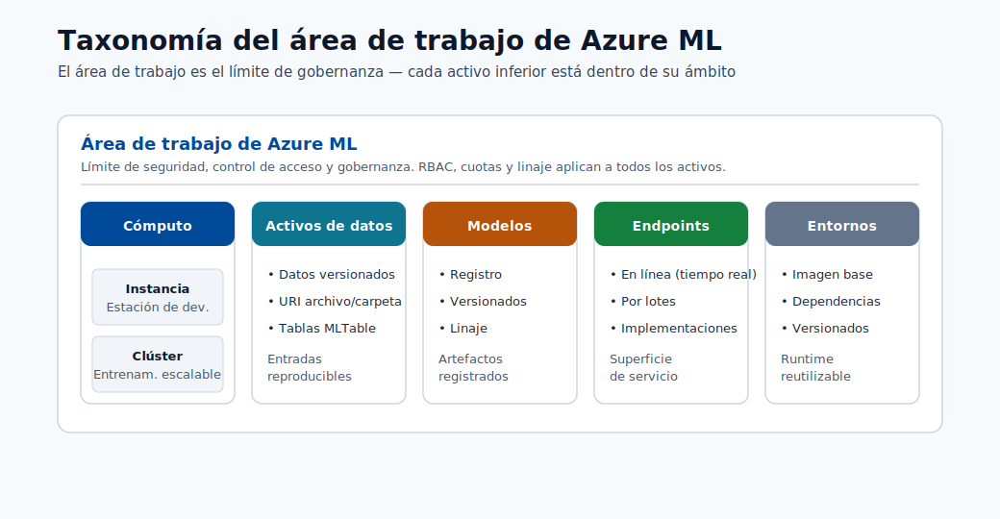
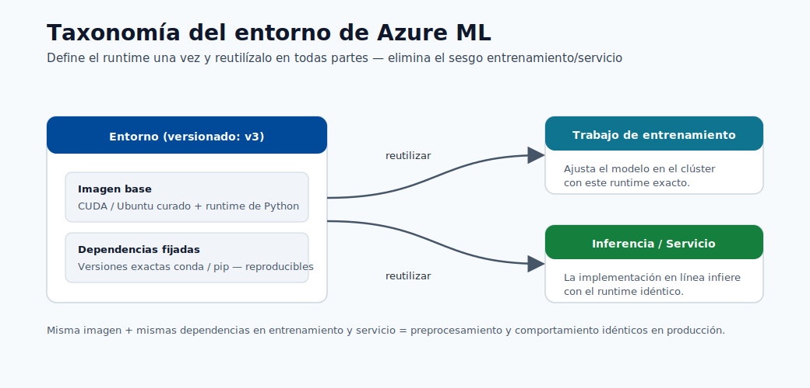
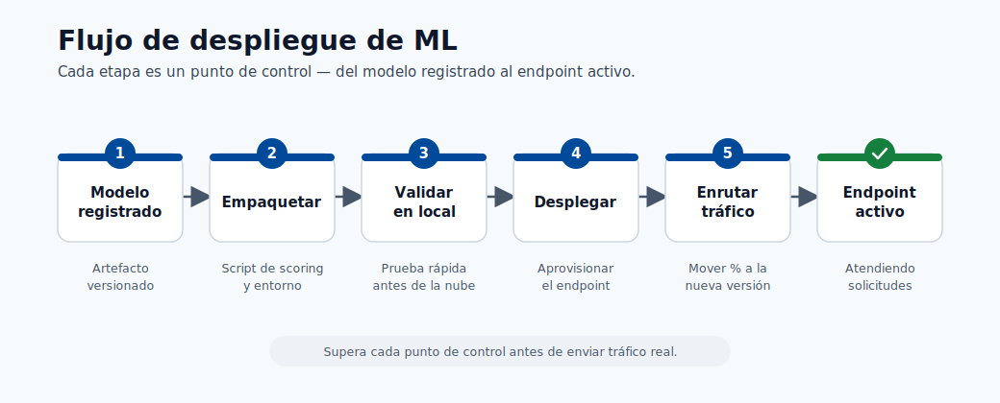

# Machine Learning 103 - Centro Avanzado de Implementación

Este centro se enfoca en patrones avanzados de implementación para Azure ML e integración con Fabric.

## Qué agrega 103 frente a 101/102

- Configuración de plataforma en Azure y estrategia de entornos.
- Disciplina de creación de modelos desde notebook hasta endpoint.
- Infraestructura como código para Azure ML y Fabric.
- Confiabilidad de despliegue y gobernanza operativa.

## Ruta de Aprendizaje

  <a class="home-card" href="modules/01-math-prerequisites/">01<h3>Plataforma y Configuración de Azure</h3>
Suscripción, RBAC, red y preparación inicial del workspace.
</a>
  <a class="home-card" href="modules/02-e2e-overview/">02<h3>Pipeline de Creación de Modelos</h3>
Desde registro de datos hasta artefactos reproducibles.
</a>
  <a class="home-card" href="modules/03-introduction/">03<h3>Integración de Fabric y Azure ML</h3>
Arquitectura de datos + IA y límites de ejecución.
</a>
  <a class="home-card" href="modules/04-ml-foundations/">04<h3>Estrategia de Entornos en Azure ML</h3>
Runtimes versionados, control de dependencias y prevención de drift.
</a>
  <a class="home-card" href="modules/05-neural-networks/">05<h3>Preparación Avanzada de Datos</h3>
Contratos, prevención de fugas y lógica de features escalable.
</a>
  <a class="home-card" href="modules/06-azure-ml-environment/">06<h3>Entrenamiento y Experimentación a Escala</h3>
Tracking, ejecución paralela y gobernanza de AutoML.
</a>
  <a class="home-card" href="modules/07-environment-setup/">07<h3>Terraform para Azure ML</h3>
Despliegue repetible de recursos de plataforma AML.
</a>
  <a class="home-card" href="modules/08-data-preparation/">08<h3>Terraform para Fabric</h3>
Provisionamiento de infraestructura de soporte para Fabric.
</a>
  <a class="home-card" href="modules/09-model-types/">09<h3>Confiabilidad de Despliegue y SRE</h3>
Blue/green, canary, rollback y respuesta a incidentes.
</a>
  <a class="home-card" href="modules/10-training-automl/">10<h3>Arquitectura Final y Gobernanza</h3>
Arquitectura de referencia y modelo operativo de ML.
</a>

## Visuales Clave

