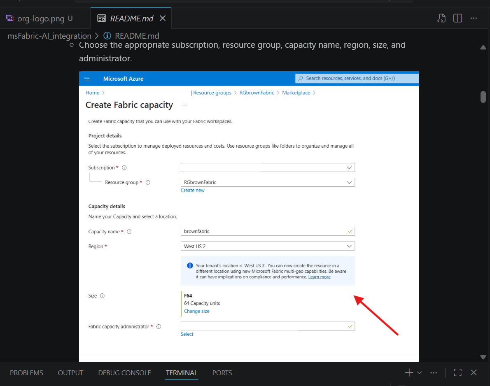

# 01. Setup de Entorno y Acceso

## Objetivo

Preparar la plataforma para ejecutar **una ruta completa de modelo** sin bloqueos.

## A. Setup de Azure ML Studio

1. Abrir Azure Portal y crear/seleccionar el resource group.
2. Crear **Machine Learning workspace** en la región objetivo.
3. Abrir Azure ML Studio y confirmar acceso al workspace.
4. Crear una compute instance para ejecución de notebooks.
5. Activar controles de costo (auto-stop y convención de nombres).

## B. Setup de dataset

1. Ir a **Data** en Azure ML Studio.
2. Subir `sample_data.csv`.
3. Registrar como data asset versionado.
4. Validar esquema y columna objetivo antes de entrenar.

## C. Setup de Fabric (si usarás ruta Fabric)

1. Confirmar proveedor/capacidad de Fabric en Azure.
2. Asignar capacidad al workspace de Fabric.
3. Abrir notebook y validar instalación de dependencias.

### Ejemplo: pantalla de configuración de capacidad Fabric

## Criterios de salida

- [ ] Workspace y cómputo operativos
- [ ] Dataset registrado y versionado
- [ ] Asignación capacidad-workspace de Fabric confirmada
- [ ] El equipo puede iniciar Módulo 02 o Módulo 04 inmediatamente
