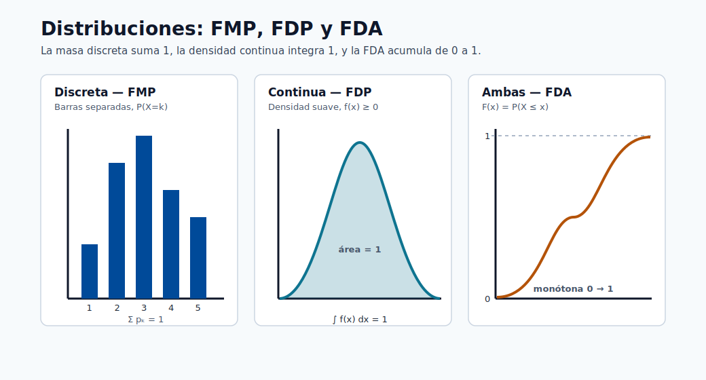
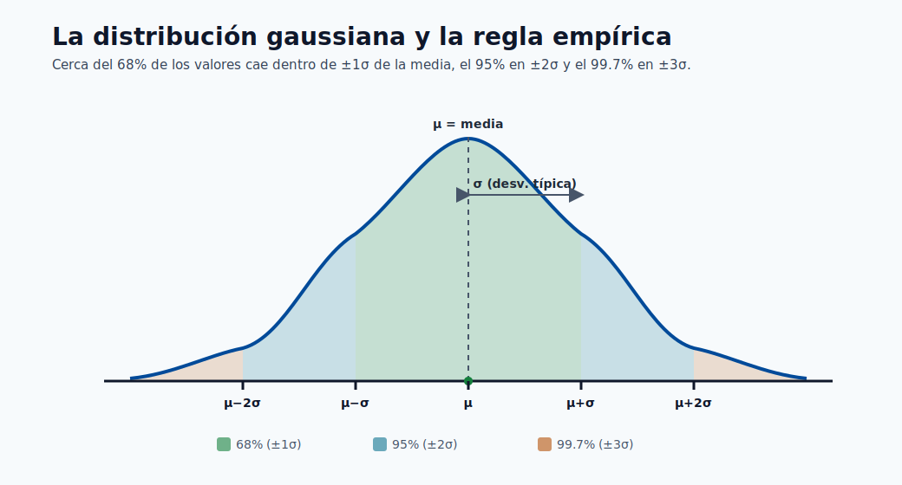
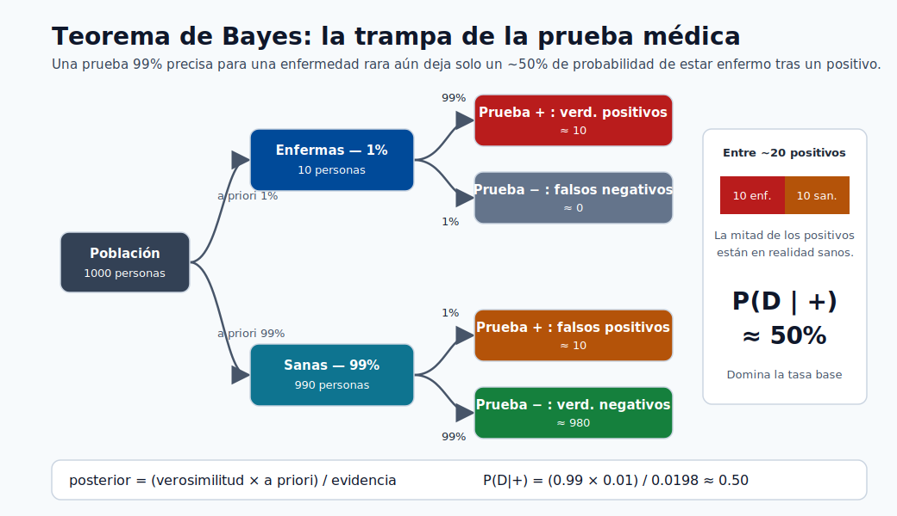

# Prerrequisitos Matemáticos para el Aprendizaje Automático

Este módulo construye cada fundamento matemático que necesitas antes de abordar cualquier otro
módulo del curso. Comienza desde álgebra básica y avanza hasta las matemáticas de nivel de
posgrado que sustentan la optimización, la probabilidad y la teoría del aprendizaje.

No se requiere conocimiento previo más allá del álgebra de preparatoria. Al final serás capaz
de leer y derivar las ecuaciones clave en cada otro módulo.

---

## Por qué las Matemáticas son el Fundamento del ML

El aprendizaje automático es, en esencia, **matemáticas aplicadas**. Cada algoritmo es una
solución a un problema de optimización enunciado con precisión, y el lenguaje de ese problema
son las matemáticas.

Considera lo que sucede cuando entrenas un modelo de regresión lineal:

1. Representas tus datos como una matriz $X \in \mathbb{R}^{N \times d}$ — **álgebra lineal**.
2. Defines una función de pérdida $\mathcal{L}(\theta)$ que mide qué tan equivocadas son tus predicciones — **cálculo y probabilidad**.
3. Minimizas esa pérdida calculando gradientes y actualizando parámetros — **cálculo multivariado**.
4. Evalúas si el resultado es estadísticamente significativo — **estadística**.

Elimina cualquiera de esos cuatro pilares y el algoritmo se rompe o se convierte en una caja
negra sobre la que no puedes razonar. Cuando un modelo falla en producción, los ingenieros que
lo reparan son quienes pueden rastrear el fallo hasta una causa matemática: un gradiente que
desaparece, un desplazamiento de distribución, un objetivo que no era convexo.

> **Nota - El beneficio:** No necesitas derivar todo desde cero cada día. Pero entender las
> matemáticas significa que puedes leer un artículo, comprender qué hace un nuevo optimizador,
> depurar una inestabilidad durante el entrenamiento y elegir el regularizador correcto. Esa es
> la diferencia entre aplicar ML y comprenderlo.

La siguiente tabla relaciona cada área de las matemáticas con los conceptos de ML que habilita:

| Área matemática  | Lo que habilita en ML                                                         |
| ---------------- | ----------------------------------------------------------------------------- |
| Álgebra lineal   | Representación de características, capas de redes neuronales, PCA, atención   |
| Probabilidad     | Funciones de pérdida, inferencia bayesiana, modelos generativos, incertidumbre |
| Cálculo          | Descenso de gradiente, retropropagación, algoritmos de optimización           |
| Estadística      | Evaluación de modelos, pruebas de hipótesis, intervalos de confianza, MLE/MAP |

---

## Teoría de la Probabilidad

### ¿Qué es la Probabilidad?

La probabilidad es un número entre 0 y 1 que cuantifica **qué tan probable** es que ocurra
un evento.

**Espacio muestral y eventos**

- El **espacio muestral** $\Omega$ es el conjunto de todos los resultados posibles. Para el lanzamiento de una moneda, $\Omega = \{H, T\}$.
- Un **evento** $A$ es un subconjunto de $\Omega$. Para un dado, el evento "par" es $A = \{2, 4, 6\}$.
- La **probabilidad** del evento $A$ se escribe $P(A)$.

**Axiomas de Kolmogórov** (las tres reglas de las que se derivan todas las demás):

1. No negatividad: $P(A) \geq 0$ para cualquier evento $A$.
2. Normalización: $P(\Omega) = 1$ (algo debe ocurrir).
3. Aditividad: si $A$ y $B$ son mutuamente excluyentes, $P(A \cup B) = P(A) + P(B)$.

A partir de estos tres axiomas únicamente se deriva toda la teoría de la probabilidad.

**Dos interpretaciones de la probabilidad:**

| Interpretación | "P(lluvia mañana) = 0.7" significa...                             | Usada para...                                         |
| -------------- | ----------------------------------------------------------------- | ----------------------------------------------------- |
| Frecuentista   | A largo plazo, el 70 % de los días similares tienen lluvia        | Estadística clásica, pruebas de hipótesis             |
| Bayesiana      | Mi grado de creencia de que lloverá es del 70 %                   | Inferencia bayesiana, prior/posterior, incertidumbre  |

El ML usa ambas. La validación cruzada y los p-valores son frecuentistas. Las redes neuronales
bayesianas y la estimación MAP son bayesianas.

> **Nota - Por qué esto importa:** La interpretación que eliges afecta cómo reportas la
> incertidumbre. Un intervalo de confianza frecuentista y un intervalo creíble bayesiano tienen
> significados distintos, aunque a menudo produzcan números similares.

---

### Variables Aleatorias y Distribuciones

Una **variable aleatoria** $X$ es una función que asigna un número real a cada resultado del
espacio muestral. Es el puente entre la probabilidad abstracta y los números concretos.

**Discreta vs continua:**

- **Discreta**: $X$ toma valores contables (0, 1, 2, ...). Descrita por una **función de masa de probabilidad (FMP)**:
  $P(X = k) = p_k$, donde $\sum_k p_k = 1$.
- **Continua**: $X$ toma cualquier valor real en un intervalo. Descrita por una **función de densidad de probabilidad (FDP)**:
  $f(x) \geq 0$, y $\int_{-\infty}^{\infty} f(x)\, dx = 1$.

**Función de Distribución Acumulada (FDA):** funciona para ambos tipos:

$$F(x) = P(X \leq x)$$

Para una variable continua, $F(x) = \int_{-\infty}^{x} f(t)\, dt$.



> **Nota - Tres vistas de una distribución:** La FMP coloca probabilidad en puntos discretos, la FDP la reparte como área bajo una curva, y la FDA acumula esa probabilidad de 0 a 1.

**Distribuciones clave:**

| Distribución           | Tipo       | Parámetros         | FMP / FDP                                                                      | Uso en ML                                        |
| ---------------------- | ---------- | ------------------ | ------------------------------------------------------------------------------ | ------------------------------------------------ |
| Bernoulli              | Discreta   | $p \in [0,1]$      | $P(X=1)=p,\ P(X=0)=1-p$                                                       | Salida de clasificación binaria                  |
| Binomial               | Discreta   | $n, p$             | $\binom{n}{k} p^k (1-p)^{n-k}$                                                | Conteo de éxitos en $n$ ensayos                  |
| Gaussiana (Normal)     | Continua   | $\mu, \sigma^2$    | $\frac{1}{\sqrt{2\pi\sigma^2}} \exp\!\left(-\frac{(x-\mu)^2}{2\sigma^2}\right)$ | Residuos, inicialización de pesos, ruido         |
| Uniforme               | Continua   | $a, b$             | $\frac{1}{b-a}$ en $[a,b]$                                                     | Inicialización de pesos, búsqueda aleatoria      |
| Poisson                | Discreta   | $\lambda > 0$      | $\frac{\lambda^k e^{-\lambda}}{k!}$                                            | Datos de conteo, tasas de llegada, conteos en NLP|
| Categórica             | Discreta   | $p_1,\dots,p_K$    | $P(X=k) = p_k$                                                                 | Salida de clasificación multiclase               |



> **Nota - La regla empírica:** Para cualquier gaussiana, ~68% de los valores está dentro de ±1σ de la media μ, ~95% dentro de ±2σ y ~99.7% dentro de ±3σ.

**Esperanza** — el valor promedio a largo plazo de una variable aleatoria:

$$E[X] = \sum_k k \cdot P(X=k) \quad \text{(discreta)}$$

$$E[X] = \int_{-\infty}^{\infty} x \cdot f(x)\, dx \quad \text{(continua)}$$

*Ejemplo resuelto (discreta):* Sea $X$ un dado justo. Entonces:

$$E[X] = 1 \cdot \frac{1}{6} + 2 \cdot \frac{1}{6} + 3 \cdot \frac{1}{6} + 4 \cdot \frac{1}{6} + 5 \cdot \frac{1}{6} + 6 \cdot \frac{1}{6} = \frac{21}{6} = 3.5$$

**Varianza** — qué tan dispersos están los valores alrededor de la media:

$$\text{Var}(X) = E\!\left[(X - E[X])^2\right] = E[X^2] - (E[X])^2$$

**Desviación estándar:** $\sigma = \sqrt{\text{Var}(X)}$. Tiene las mismas unidades que $X$, lo que la hace más interpretable.

*Ejemplo resuelto:* Para una variable Bernoulli$(p)$: $E[X] = p$, $E[X^2] = p$,
por lo que $\text{Var}(X) = p - p^2 = p(1-p)$. La varianza se maximiza en $p = 0.5$ (máxima incertidumbre).

> **Nota - Por qué la varianza importa en ML:** El equilibrio sesgo-varianza trata literalmente
> sobre la varianza de tu estimador en distintos conjuntos de entrenamiento. Alta varianza =
> sobreajuste. Entender esto matemáticamente te permite razonar sobre regularización y métodos
> de ensamble.

---

### Probabilidad Conjunta, Marginal y Condicional

Los problemas reales de ML involucran múltiples variables aleatorias. Necesitamos razonar
sobre sus relaciones.

**Probabilidad conjunta** $P(X, Y)$ (o $P(X=x, Y=y)$) es la probabilidad de que tanto $X=x$
como $Y=y$ ocurran simultáneamente.

**Probabilidad marginal** se obtiene sumando (o integrando) la otra variable:

$$P(X = x) = \sum_y P(X = x, Y = y)$$

Esto se llama **marginalización** — colapsar una dimensión de la distribución conjunta.

**Probabilidad condicional** es la probabilidad de $X$ dado que ya se sabe que $Y=y$:

$$P(X = x \mid Y = y) = \frac{P(X = x,\, Y = y)}{P(Y = y)}$$

*Ejemplo resuelto:* Supón 100 correos: 40 spam, 60 no-spam. De los 40 spam, 30 contienen la
palabra "gratis". ¿Cuál es $P(\text{gratis} \mid \text{spam})$?

$$P(\text{gratis} \mid \text{spam}) = \frac{P(\text{gratis},\, \text{spam})}{P(\text{spam})} = \frac{30/100}{40/100} = \frac{30}{40} = 0.75$$

**Independencia:** $X$ e $Y$ son independientes si conocer $Y$ no te dice nada sobre $X$:

$$X \perp Y \iff P(X, Y) = P(X) \cdot P(Y)$$

De manera equivalente, $P(X \mid Y) = P(X)$.

**Regla de la cadena de probabilidad** — factorizar una distribución conjunta en condicionales:

$$P(X_1, X_2, X_3) = P(X_1) \cdot P(X_2 \mid X_1) \cdot P(X_3 \mid X_1, X_2)$$

Esto se generaliza a cualquier número de variables y es el fundamento de los modelos gráficos
dirigidos (redes bayesianas) usados en ML causal.

---

### Teorema de Bayes

El teorema de Bayes es la piedra angular del aprendizaje automático probabilístico. Te indica
cómo actualizar tus creencias cuando observas nueva evidencia.

**Derivación:** Partiendo de la definición de probabilidad condicional:

$$P(A \mid B) = \frac{P(A, B)}{P(B)}, \quad P(B \mid A) = \frac{P(A, B)}{P(A)}$$

Despejando $P(A, B)$ en ambas e igualando:

$$\boxed{P(A \mid B) = \frac{P(B \mid A)\, P(A)}{P(B)}}$$

**En términos de ML, con parámetro $\theta$ y datos $D$:**

$$P(\theta \mid D) = \frac{P(D \mid \theta)\, P(\theta)}{P(D)}$$

| Término | Nombre | Significado |
| ------- | ------ | ----------- |
| $P(\theta)$ | Prior (a priori) | Tu creencia sobre $\theta$ antes de ver los datos |
| $P(D \mid \theta)$ | Verosimilitud | ¿Qué tan probable es el dato si $\theta$ es verdadero? |
| $P(\theta \mid D)$ | Posterior (a posteriori) | Creencia actualizada sobre $\theta$ tras los datos |
| $P(D)$ | Evidencia (verosimilitud marginal) | Constante normalizadora; a menudo intratable |

**Ejemplo intuitivo:** Prueba médica. Una enfermedad afecta al 1 % de la población. Una prueba
tiene 99 % de precisión (sensibilidad 99 %, especificidad 99 %). Resultas positivo. ¿Cuál es
la probabilidad de que tengas la enfermedad?

Sea $D$ = enfermedad, $+$ = prueba positiva.

- $P(D) = 0.01$, $P(\neg D) = 0.99$
- $P(+ \mid D) = 0.99$, $P(+ \mid \neg D) = 0.01$

$$P(D \mid +) = \frac{0.99 \times 0.01}{0.99 \times 0.01 + 0.01 \times 0.99} = \frac{0.0099}{0.0198} = 0.5$$

¡Solo el 50 %! La baja tasa base ($P(D) = 0.01$) domina. Por eso las pruebas de cribado en
condiciones raras generan muchos falsos positivos — una perspectiva crítica para ML con
conjuntos de datos desbalanceados.



> **Nota - Por qué el posterior es solo del 50%:** Entre ~20 pruebas positivas, cerca de 10 provienen de las 10 personas realmente enfermas y cerca de 10 son falsos positivos de las 990 personas sanas, así que un positivo es como lanzar una moneda.

**MLE vs MAP:**

- **Estimación de Máxima Verosimilitud (MLE):** $\hat{\theta}_{MLE} = \arg\max_\theta P(D \mid \theta)$. Ignora el prior.
- **Máximo A Posteriori (MAP):** $\hat{\theta}_{MAP} = \arg\max_\theta P(\theta \mid D) = \arg\max_\theta \left[\log P(D \mid \theta) + \log P(\theta)\right]$. Incluye el prior — equivalente a regularización.

---

### Distribuciones Clave para ML

**Distribución Gaussiana (Normal):** La distribución más importante en estadística y ML.

$$\mathcal{N}(x;\, \mu,\, \sigma^2) = \frac{1}{\sqrt{2\pi\sigma^2}} \exp\!\left(-\frac{(x - \mu)^2}{2\sigma^2}\right)$$

Propiedades:

- Campana simétrica centrada en $\mu$.
- El 68 % de la masa dentro de $\mu \pm \sigma$; el 95 % dentro de $\mu \pm 2\sigma$; el 99.7 % dentro de $\mu \pm 3\sigma$.
- La suma de dos gaussianas es gaussiana: si $X \sim \mathcal{N}(\mu_1, \sigma_1^2)$ y $Y \sim \mathcal{N}(\mu_2, \sigma_2^2)$, entonces $X + Y \sim \mathcal{N}(\mu_1 + \mu_2,\, \sigma_1^2 + \sigma_2^2)$.
- Totalmente caracterizada solo por $\mu$ y $\sigma^2$.

**Normal estándar:** $Z = \frac{X - \mu}{\sigma} \sim \mathcal{N}(0, 1)$. Esta estandarización (puntuación-z) es la normalización de características en ML.

**Distribución de Bernoulli:** Modela un resultado binario único.

$$P(X=1) = p, \quad P(X=0) = 1-p, \quad E[X] = p, \quad \text{Var}(X) = p(1-p)$$

En regresión logística, el modelo produce $\hat{p} = \sigma(w^\top x)$ y la distribución de la
etiqueta es $y \sim \text{Bernoulli}(\hat{p})$.

**Softmax y Categórica:** Para clasificación de $K$ clases, el modelo produce un vector de
logits $z = (z_1, \dots, z_K)$. La función softmax convierte los logits en probabilidades:

$$\text{softmax}(z_k) = \frac{e^{z_k}}{\sum_{j=1}^K e^{z_j}}$$

La salida es una distribución Categórica. Cada $\text{softmax}(z_k) \geq 0$ y suman 1.

> **Nota - Estabilidad numérica:** En la práctica, calcula $\text{softmax}(z - \max(z))$ para
> evitar desbordamiento en $e^{z_k}$ cuando los logits son grandes. Esta identidad se cumple
> porque el máximo se cancela en el numerador y el denominador.

---

### Teorema Central del Límite

**Enunciado:** Sean $X_1, X_2, \dots, X_n$ variables aleatorias independientes e idénticamente
distribuidas con media $\mu$ y varianza $\sigma^2$. Entonces, cuando $n \to \infty$:

$$\bar{X}_n = \frac{1}{n}\sum_{i=1}^n X_i \xrightarrow{d} \mathcal{N}\!\left(\mu,\, \frac{\sigma^2}{n}\right)$$

En palabras: la media muestral de $n$ observaciones es aproximadamente Normal, **independientemente
de la distribución original**, para $n$ suficientemente grande.

**Por qué la Gaussiana aparece en todas partes del ML:**

1. Muchas mediciones reales son la suma de muchos efectos independientes pequeños — de ahí que sean Gaussianas por el TCL.
2. Máxima entropía: la Gaussiana maximiza la entropía entre todas las distribuciones con media y varianza fijas — es la suposición "menos informativa".
3. Prior conjugado para la media: si tu verosimilitud es Gaussiana, tu posterior también es Gaussiana.

**Por qué el TCL importa para la evaluación de ML:**

Cuando reportas una precisión de prueba de 0.87 sobre 1 000 muestras de prueba, el TCL te
dice que la distribución muestral de esa estimación de precisión es aproximadamente Normal.
Esto te permite calcular un intervalo de confianza:

$$\text{IC}_{95\%} \approx \hat{p} \pm 1.96 \sqrt{\frac{\hat{p}(1-\hat{p})}{n}}$$

Para $\hat{p} = 0.87$, $n = 1000$: $\text{IC} \approx 0.87 \pm 0.021 = (0.849,\, 0.891)$.

Dos modelos que difieren en menos de este margen son estadísticamente indistinguibles.

---

### Fundamentos de Teoría de la Información

La teoría de la información cuantifica la **incertidumbre** y el **contenido de información** —
el fundamento matemático de las funciones de pérdida.

**Entropía** $H(X)$ mide la incertidumbre esperada de una variable aleatoria:

$$H(X) = -\sum_{k} P(X=k) \log_2 P(X=k)$$

- La entropía es 0 cuando un resultado es seguro ($P = 1$) — sin sorpresa.
- La entropía se maximiza cuando todos los resultados son igualmente probables — máxima incertidumbre.
- Para una moneda justa: $H = -(0.5 \log_2 0.5 + 0.5 \log_2 0.5) = 1$ bit.
- Para una moneda sesgada $p = 0.9$: $H = -(0.9 \log_2 0.9 + 0.1 \log_2 0.1) \approx 0.469$ bits.

**Entropía cruzada** $H(p, q)$ mide qué tan bien la distribución $q$ aproxima la distribución
real $p$:

$$H(p, q) = -\sum_k p_k \log q_k$$

**Por qué la entropía cruzada es la pérdida de clasificación:** Si la distribución real de
etiquetas es $p = (0, 1, 0)$ (la clase 2 es la correcta) y nuestro modelo produce $q = (0.1, 0.7, 0.2)$:

$$H(p, q) = -\log(0.7) \approx 0.357$$

Minimizar la entropía cruzada empuja al modelo a asignar alta probabilidad a la clase correcta,
que es exactamente lo que queremos. Minimizar $H(p, q)$ es equivalente a maximizar la
log-verosimilitud.

**Divergencia KL** $D_{KL}(p \| q)$ mide cuánto diverge $q$ de $p$:

$$D_{KL}(p \| q) = \sum_k p_k \log \frac{p_k}{q_k} = H(p, q) - H(p)$$

Propiedades: $D_{KL}(p \| q) \geq 0$, con igualdad si y solo si $p = q$. No es simétrica:
$D_{KL}(p \| q) \neq D_{KL}(q \| p)$.

La divergencia KL aparece en los autoencoders variacionales (VAE) como término de regularización,
y en el aprendizaje por refuerzo como restricción sobre las actualizaciones de la política
(PPO, TRPO).

---

## Álgebra Lineal

### Escalares, Vectores, Matrices, Tensores

Estos son los cuatro objetos fundamentales en los cálculos de ML.

| Objeto  | Símbolo | Dimensiones ejemplo | Significado |
| ------- | ------- | ------------------- | ----------- |
| Escalar | $x \in \mathbb{R}$ | $1 \times 1$ | Un número único: tasa de aprendizaje, valor de pérdida |
| Vector  | $\mathbf{x} \in \mathbb{R}^d$ | $d \times 1$ | Un vector de características con $d$ características |
| Matriz  | $W \in \mathbb{R}^{m \times n}$ | $m \times n$ | Una matriz de pesos; un conjunto de datos $X \in \mathbb{R}^{N \times d}$ |
| Tensor  | $\mathcal{T} \in \mathbb{R}^{d_1 \times d_2 \times d_3}$ | arbitraria | Lote de imágenes: $(B, H, W, C)$ |

**Notación de vector:**

$$\mathbf{x} = \begin{pmatrix} x_1 \\ x_2 \\ \vdots \\ x_d \end{pmatrix} \in \mathbb{R}^d$$

Por convención, los vectores son columnas a menos que se indique lo contrario.

**Notación de matriz:**

$$W = \begin{pmatrix} w_{11} & w_{12} & \cdots & w_{1n} \\ w_{21} & w_{22} & \cdots & w_{2n} \\ \vdots & & \ddots & \vdots \\ w_{m1} & w_{m2} & \cdots & w_{mn} \end{pmatrix} \in \mathbb{R}^{m \times n}$$

La entrada en la fila $i$, columna $j$ es $W_{ij}$ o $w_{ij}$.

---

### Operaciones con Vectores

**Suma:** Los vectores de la misma dimensión se suman elemento a elemento.

$$\mathbf{u} + \mathbf{v} = \begin{pmatrix} u_1 + v_1 \\ u_2 + v_2 \end{pmatrix}$$

**Multiplicación escalar:** $c \cdot \mathbf{x} = (c x_1, c x_2, \dots, c x_d)^\top$.

**Producto punto (producto interno):** Fundamental para todo en ML.

$$\mathbf{x} \cdot \mathbf{y} = \mathbf{x}^\top \mathbf{y} = \sum_{i=1}^d x_i y_i$$

*Ejemplo resuelto:* $\mathbf{x} = (1, 2, 3)^\top$, $\mathbf{y} = (4, 5, 6)^\top$:

$$\mathbf{x}^\top \mathbf{y} = 1 \cdot 4 + 2 \cdot 5 + 3 \cdot 6 = 4 + 10 + 18 = 32$$

En regresión lineal, la predicción es $\hat{y} = \mathbf{w}^\top \mathbf{x}$ — un único producto punto.

**Interpretación geométrica:** $\mathbf{x}^\top \mathbf{y} = \|\mathbf{x}\|_2 \|\mathbf{y}\|_2 \cos\theta$,
donde $\theta$ es el ángulo entre los vectores.

- $\mathbf{x}^\top \mathbf{y} > 0$: los vectores apuntan en una dirección similar (ángulo $< 90°$).
- $\mathbf{x}^\top \mathbf{y} = 0$: los vectores son **ortogonales** (perpendiculares).
- $\mathbf{x}^\top \mathbf{y} < 0$: los vectores apuntan en direcciones opuestas.

**Normas — midiendo el tamaño de un vector:**

- **Norma L2 (Euclidiana):** $\|\mathbf{x}\|_2 = \sqrt{\sum_{i=1}^d x_i^2}$. La más común.
- **Norma L1 (Manhattan):** $\|\mathbf{x}\|_1 = \sum_{i=1}^d |x_i|$.
- **Norma L$\infty$:** $\|\mathbf{x}\|_\infty = \max_i |x_i|$.

*Ejemplo:* $\mathbf{x} = (3, 4)^\top$: $\|\mathbf{x}\|_2 = \sqrt{9+16} = 5$, $\|\mathbf{x}\|_1 = 7$.

**Similitud coseno** mide la dirección, ignorando la magnitud:

$$\text{cos\_sim}(\mathbf{x}, \mathbf{y}) = \frac{\mathbf{x}^\top \mathbf{y}}{\|\mathbf{x}\|_2 \|\mathbf{y}\|_2}$$

Esta es la base de la similitud de textos, los sistemas de recomendación y el mecanismo de
atención en los Transformers.

> **Nota - Regularización L1 vs L2:** La regularización L2 penaliza $\|\mathbf{w}\|_2^2$ y
> produce pesos uniformemente pequeños. La regularización L1 penaliza $\|\mathbf{w}\|_1$ y
> produce pesos **dispersos** (muchos exactamente cero), habilitando la selección de características.

---

### Operaciones con Matrices

**Multiplicación de matrices:** Si $A \in \mathbb{R}^{m \times n}$ y $B \in \mathbb{R}^{n \times p}$,
su producto $C = AB \in \mathbb{R}^{m \times p}$ tiene entradas:

$$C_{ij} = \sum_{k=1}^n A_{ik} B_{kj}$$

Las dimensiones internas deben coincidir: $m \times \mathbf{n}$ por $\mathbf{n} \times p$.

*Ejemplo resuelto:*

$$A = \begin{pmatrix} 1 & 2 \\ 3 & 4 \end{pmatrix}, \quad B = \begin{pmatrix} 5 & 6 \\ 7 & 8 \end{pmatrix}$$

$$AB = \begin{pmatrix} 1\cdot5 + 2\cdot7 & 1\cdot6 + 2\cdot8 \\ 3\cdot5 + 4\cdot7 & 3\cdot6 + 4\cdot8 \end{pmatrix} = \begin{pmatrix} 19 & 22 \\ 43 & 50 \end{pmatrix}$$

La multiplicación de matrices **no es conmutativa**: $AB \neq BA$ en general.

**Transpuesta:** $(A^\top)_{ij} = A_{ji}$. Intercambia filas y columnas. Si $A \in \mathbb{R}^{m \times n}$, entonces $A^\top \in \mathbb{R}^{n \times m}$.

Identidad clave: $(AB)^\top = B^\top A^\top$.

**Matriz identidad $I$:** Una matriz cuadrada con 1s en la diagonal y 0s en el resto. $AI = IA = A$.

**Inversa:** La inversa de la matriz cuadrada $A$ es $A^{-1}$ tal que $A A^{-1} = A^{-1} A = I$.
No toda matriz tiene inversa. Una matriz es **invertible** (no singular) si y solo si su
determinante es distinto de cero.

La solución en forma cerrada de la regresión lineal utiliza la inversa de la matriz:

$$\hat{\mathbf{w}} = (X^\top X)^{-1} X^\top \mathbf{y}$$

Estas son las **Ecuaciones Normales** — válidas cuando $X^\top X$ es invertible (es decir,
las características no son linealmente dependientes).

**Determinante:** Un escalar $\det(A)$ que codifica cómo una matriz escala los volúmenes.

- $\det(A) = 0$: la matriz es singular, no invertible, las columnas son linealmente dependientes.
- $|\det(A)| > 1$: la transformación expande el espacio.
- $|\det(A)| < 1$: la transformación contrae el espacio.

---

### Transformaciones Lineales

Una matriz $A \in \mathbb{R}^{m \times n}$ define una **transformación lineal** $f(\mathbf{x}) = A\mathbf{x}$
que mapea vectores de $\mathbb{R}^n$ a $\mathbb{R}^m$.

Propiedades de las transformaciones lineales:

- $f(\mathbf{u} + \mathbf{v}) = f(\mathbf{u}) + f(\mathbf{v})$ (aditividad)
- $f(c\mathbf{u}) = c f(\mathbf{u})$ (homogeneidad)

Geométricamente, una matriz de $2 \times 2$ puede:

- **Rotar** vectores (la matriz de rotación preserva las longitudes)
- **Escalar** vectores a lo largo de los ejes (matriz diagonal)
- **Reflejar** vectores a través de un eje
- **Cizallar** vectores (desplaza filas de puntos lateralmente)
- **Proyectar** vectores sobre un subespacio

En una red neuronal, cada capa aplica una transformación lineal $W\mathbf{x} + \mathbf{b}$ seguida de
una activación no lineal. Sin la no linealidad, apilar capas lineales seguiría siendo una
gran transformación lineal — la red no podría aprender patrones no lineales.

---

### Valores Propios y Vectores Propios

Un **vector propio** de la matriz $A$ es un vector no nulo $\mathbf{v}$ que solo es **escalado**
(sin rotar) al multiplicarse por $A$:

$$A\mathbf{v} = \lambda \mathbf{v}$$

El escalar $\lambda$ es el **valor propio** correspondiente. El vector propio $\mathbf{v}$ apunta
en una dirección que $A$ no cambia — es una dirección "preferida" de la transformación.

**Encontrar los valores propios:** Reorganizando $(A - \lambda I)\mathbf{v} = \mathbf{0}$; esto tiene
una solución no nula si y solo si $\det(A - \lambda I) = 0$. Este es el **polinomio característico**.

*Ejemplo resuelto:* Sea $A = \begin{pmatrix} 3 & 1 \\ 0 & 2 \end{pmatrix}$.

$$\det(A - \lambda I) = (3-\lambda)(2-\lambda) - 0 = \lambda^2 - 5\lambda + 6 = 0$$

$$\lambda_1 = 3, \quad \lambda_2 = 2$$

Para $\lambda_1 = 3$: $(A - 3I)\mathbf{v} = \mathbf{0}$ da $\mathbf{v}_1 = (1, 0)^\top$.
Para $\lambda_2 = 2$: $(A - 2I)\mathbf{v} = \mathbf{0}$ da $\mathbf{v}_2 = (1, -1)^\top$.

**Conexión con PCA:** El Análisis de Componentes Principales encuentra las direcciones
(componentes principales) de máxima varianza en los datos. Esas direcciones son exactamente
los vectores propios de la **matriz de covarianza** $\Sigma = \frac{1}{N} X^\top X$. El valor
propio $\lambda_i$ te dice cuánta varianza explica el componente $i$.

**Teorema espectral:** Una matriz real simétrica (como una matriz de covarianza) tiene:

- Todos los valores propios reales.
- Vectores propios ortogonales.
- Puede escribirse como $A = Q \Lambda Q^\top$ donde $Q$ tiene los vectores propios como columnas y $\Lambda$ es diagonal.

---

### Descomposiciones de Matrices

**Descomposición en Valores Singulares (DVS):** Toda matriz $A \in \mathbb{R}^{m \times n}$ puede
factorizarse como:

$$A = U \Sigma V^\top$$

donde:

- $U \in \mathbb{R}^{m \times m}$: matriz ortogonal; las columnas son **vectores singulares izquierdos**.
- $\Sigma \in \mathbb{R}^{m \times n}$: matriz diagonal de **valores singulares** $\sigma_1 \geq \sigma_2 \geq \cdots \geq 0$.
- $V \in \mathbb{R}^{n \times n}$: matriz ortogonal; las columnas son **vectores singulares derechos**.

Los valores singulares $\sigma_i$ indican qué tan "importante" es cada componente. Truncar a
los $k$ valores singulares superiores da la **mejor aproximación de rango $k$** de $A$.

**PCA mediante DVS:** Centra la matriz de datos $X$ (sustrae las medias de columnas), luego
calcula la DVS. Los $k$ vectores singulares derechos superiores $V_k$ definen los $k$
componentes principales. Proyectando los datos: $Z = X V_k$ da la representación de $k$ dimensiones.

```python
import numpy as np

X = np.array([[1, 2], [3, 4], [5, 6]], dtype=float)
X -= X.mean(axis=0)          # centrar
U, S, Vt = np.linalg.svd(X, full_matrices=False)
Z = X @ Vt[:1].T             # proyectar sobre el primer componente principal
print("Valores singulares:", S)
print("Datos proyectados:", Z.ravel())
```

**Por qué la DVS importa en ML:**

- **PCA:** reducción de dimensionalidad, eliminación de ruido, visualización.
- **Filtrado colaborativo (sistemas de recomendación):** factorización de la matriz de valoraciones usuario-ítem.
- **Pseudoinversa:** $A^+ = V \Sigma^+ U^\top$ resuelve sistemas de mínimos cuadrados establemente.
- **Incrustaciones de palabras:** la DVS sobre una matriz de co-ocurrencia fue el precursor de Word2Vec.

---

### Por qué el Álgebra Lineal Está en Todas Partes del ML

| Operación de ML | Objeto de álgebra lineal |
| --- | --- |
| Vector de características de una muestra | $\mathbf{x} \in \mathbb{R}^d$ |
| Conjunto de datos completo | $X \in \mathbb{R}^{N \times d}$ |
| Capa de red neuronal | $\mathbf{h} = \sigma(W\mathbf{x} + \mathbf{b})$, multiplicación matricial |
| Paso hacia adelante por lote | $H = \sigma(XW^\top + \mathbf{b})$, multiplicación matricial |
| Normalización de características (puntuación-z) | $\mathbf{x} \leftarrow (\mathbf{x} - \boldsymbol{\mu}) / \boldsymbol{\sigma}$, operaciones vectoriales |
| Similitud coseno (atención) | $\text{softmax}(QK^\top / \sqrt{d_k})\,V$ |
| Reducción de dimensionalidad (PCA) | DVS de $X$ centrado |
| Matriz de Gram (SVM con kernel) | $K = XX^\top$ |
| Penalización de regularización L2 | $\|\mathbf{w}\|_2^2 = \mathbf{w}^\top \mathbf{w}$ |

El mecanismo de auto-atención del Transformer está construido completamente de multiplicaciones
de matrices y softmax. Comprender las formas y los productos de matrices es lo que te permite
depurar errores de dimensión en PyTorch o TensorFlow, que están entre los errores más comunes
en la práctica.

---

## Cálculo y Optimización

### Funciones y Derivadas

Una **función** $f: \mathbb{R} \to \mathbb{R}$ mapea una entrada $x$ a una salida $f(x)$.

La **derivada** $f'(x)$ (también escrita $\frac{df}{dx}$) mide la **tasa de cambio instantánea**
de $f$ en el punto $x$ — cuánto cambia la salida para un cambio infinitesimalmente pequeño en
la entrada.

Formalmente:

$$f'(x) = \lim_{h \to 0} \frac{f(x+h) - f(x)}{h}$$

Geométricamente, la derivada es la **pendiente de la recta tangente** a la gráfica de $f$ en $x$.

**Reglas básicas de diferenciación:**

| Regla | Fórmula |
| ----- | ------- |
| Constante | $\frac{d}{dx} c = 0$ |
| Potencia | $\frac{d}{dx} x^n = n x^{n-1}$ |
| Suma | $\frac{d}{dx}[f + g] = f' + g'$ |
| Producto | $\frac{d}{dx}[fg] = f'g + fg'$ |
| Regla de la cadena | $\frac{d}{dx}[f(g(x))] = f'(g(x)) \cdot g'(x)$ |
| Exponencial | $\frac{d}{dx} e^x = e^x$ |
| Logaritmo | $\frac{d}{dx} \ln x = \frac{1}{x}$ |

*Ejemplos resueltos:*

- $f(x) = x^3$: $f'(x) = 3x^2$.
- $f(x) = 5x^2 + 3x + 7$: $f'(x) = 10x + 3$.
- $f(x) = e^{-x^2}$: $f'(x) = e^{-x^2} \cdot (-2x) = -2x e^{-x^2}$ (regla de la cadena).

**Puntos críticos:** Donde $f'(x) = 0$ (la pendiente es cero). Son candidatos a mínimos y máximos.
Un mínimo tiene $f''(x) > 0$ (la curva es cóncava hacia arriba); un máximo tiene $f''(x) < 0$.

---

### Derivadas Parciales y Gradientes

Cuando una función tiene múltiples entradas $f(\theta_1, \theta_2, \dots, \theta_n)$, la
**derivada parcial** $\frac{\partial f}{\partial \theta_i}$ mide la tasa de cambio respecto a
$\theta_i$ manteniendo todas las demás entradas constantes.

*Ejemplo resuelto:* $f(\theta_1, \theta_2) = \theta_1^2 + 3\theta_1\theta_2 + \theta_2^3$.

$$\frac{\partial f}{\partial \theta_1} = 2\theta_1 + 3\theta_2, \qquad \frac{\partial f}{\partial \theta_2} = 3\theta_1 + 3\theta_2^2$$

**El gradiente** $\nabla_\theta f$ es el vector de todas las derivadas parciales:

$$\nabla_\theta f = \begin{pmatrix} \frac{\partial f}{\partial \theta_1} \\ \frac{\partial f}{\partial \theta_2} \\ \vdots \\ \frac{\partial f}{\partial \theta_n} \end{pmatrix}$$

**Hecho geométrico clave:** El gradiente apunta en la dirección de **mayor aumento** de $f$.
Su negativo, $-\nabla_\theta f$, apunta en la dirección de mayor **descenso** — y esa es
exactamente la dirección en la que nos movemos en el descenso de gradiente para minimizar
una función de pérdida.

**Gradiente para la pérdida del error cuadrático medio:**

$$\mathcal{L}(\mathbf{w}) = \frac{1}{N}\sum_{i=1}^N (y_i - \mathbf{w}^\top \mathbf{x}_i)^2$$

$$\nabla_\mathbf{w} \mathcal{L} = -\frac{2}{N} \sum_{i=1}^N (y_i - \mathbf{w}^\top \mathbf{x}_i)\, \mathbf{x}_i = -\frac{2}{N} X^\top (\mathbf{y} - X\mathbf{w})$$

Igualar a cero da las Ecuaciones Normales, conectando el cálculo con el álgebra lineal.

---

### La Regla de la Cadena (Retropropagación)

La regla de la cadena es el motor matemático del entrenamiento de redes neuronales.

**Regla de la cadena univariada:** Si $z = f(y)$ e $y = g(x)$, entonces:

$$\frac{dz}{dx} = \frac{dz}{dy} \cdot \frac{dy}{dx}$$

**Regla de la cadena multivariada:** Si $z = f(y_1, y_2)$ donde $y_1 = g_1(x)$ e $y_2 = g_2(x)$:

$$\frac{dz}{dx} = \frac{\partial z}{\partial y_1}\frac{dy_1}{dx} + \frac{\partial z}{\partial y_2}\frac{dy_2}{dx}$$

**En una red neuronal:** Considera una red de dos capas:

$$\mathbf{h} = \sigma(W_1 \mathbf{x}),\quad \hat{y} = W_2 \mathbf{h},\quad \mathcal{L} = (\hat{y} - y)^2$$

Para actualizar $W_1$, necesitamos $\frac{\partial \mathcal{L}}{\partial W_1}$. Aplicando la regla de la cadena:

$$\frac{\partial \mathcal{L}}{\partial W_1} = \frac{\partial \mathcal{L}}{\partial \hat{y}} \cdot \frac{\partial \hat{y}}{\partial \mathbf{h}} \cdot \frac{\partial \mathbf{h}}{\partial W_1}$$

La **retropropagación** es simplemente el cálculo eficiente de esta regla de la cadena, pasando
los gradientes **hacia atrás** a través de la red desde la pérdida hasta los parámetros. Los
marcos modernos (PyTorch, TensorFlow) construyen un **grafo computacional** durante el paso
hacia adelante y lo recorren en sentido inverso durante el paso hacia atrás.

*Por qué importa la profundidad:* En una red con $L$ capas, el gradiente de $W_1$ involucra un
producto de $L$ jacobianos. Si esos jacobianos tienen valores propios pequeños, los gradientes
se vuelven exponencialmente pequeños (**gradientes que desaparecen**). Si son grandes, los
gradientes explotan. La normalización por lotes, las conexiones residuales y la inicialización
cuidadosa existen todas para abordar esta consecuencia de la regla de la cadena.

---

### Derivación del Descenso de Gradiente

Queremos encontrar parámetros $\theta$ que minimicen la pérdida $\mathcal{L}(\theta)$:

$$\hat{\theta} = \arg\min_\theta \mathcal{L}(\theta)$$

**Derivación a partir de la expansión de Taylor:** La aproximación de Taylor de primer orden de
$\mathcal{L}$ cerca de los parámetros actuales $\theta_t$ es:

$$\mathcal{L}(\theta_t + \Delta\theta) \approx \mathcal{L}(\theta_t) + \nabla_\theta \mathcal{L}(\theta_t)^\top \Delta\theta$$

Para disminuir $\mathcal{L}$, queremos $\nabla_\theta \mathcal{L}^\top \Delta\theta < 0$. La dirección que
maximalmente disminuye $\mathcal{L}$ por unidad de paso es $\Delta\theta = -\nabla_\theta \mathcal{L}$.
Escalando por el tamaño de paso $\eta$ obtenemos la **regla de actualización del descenso de gradiente**:

$$\boxed{\theta_{t+1} = \theta_t - \eta\, \nabla_\theta \mathcal{L}(\theta_t)}$$

donde $\eta > 0$ es la **tasa de aprendizaje**.

**Variantes del descenso de gradiente:**

| Variante | Actualización usa | Ventajas | Desventajas |
| --- | --- | --- | --- |
| GD por lotes | Todas las $N$ muestras | Gradiente exacto, estable | Lento para $N$ grande |
| GD estocástico (SGD) | 1 muestra aleatoria | Actualizaciones rápidas, escapa de mínimos locales | Ruidoso, inestable |
| GD mini-lote | $B$ muestras (p. ej., $B=32$) | Equilibrio entre velocidad y estabilidad | La elección de $B$ importa |

**Intuición sobre la tasa de aprendizaje:**

- $\eta$ demasiado pequeño: el entrenamiento es muy lento; puede quedarse atascado.
- $\eta$ demasiado grande: la pérdida oscila o diverge.
- Los programas de tasa de aprendizaje (decaimiento coseno, calentamiento) adaptan $\eta$ durante el entrenamiento.

**Puntos de silla y mínimos locales:**

- Un **mínimo local** tiene $\nabla_\theta \mathcal{L} = 0$ y una Hessiana definida positiva.
- Un **punto de silla** tiene $\nabla_\theta \mathcal{L} = 0$ pero la Hessiana es indefinida (positiva en algunas direcciones, negativa en otras).
- Para redes profundas, los puntos de silla son más comunes que los mínimos locales. El ruido del SGD ayuda a escapar de ellos.

---

### Convexidad

Una función $f$ es **convexa** si para cualesquiera dos puntos $a, b$ y cualquier $\lambda \in [0, 1]$:

$$f(\lambda a + (1-\lambda)b) \leq \lambda f(a) + (1-\lambda)f(b)$$

Geométricamente: la función está **por debajo de la cuerda** que conecta dos puntos cualesquiera
de su gráfica.

**Por qué la convexidad importa para la optimización:**

- Una función convexa **no tiene mínimos locales que no sean globales**.
- Si $f$ es estrictamente convexa, tiene exactamente un mínimo global.
- El descenso de gradiente sobre una función convexa tiene garantía de convergencia al mínimo global.

**Ejemplos:**

| Función | ¿Convexa? | Razón |
| --- | --- | --- |
| $f(x) = x^2$ | Sí | Parábola que abre hacia arriba |
| Pérdida MSE con modelo lineal | Sí | La segunda derivada es semidefinida positiva |
| Pérdida de entropía cruzada con softmax | Sí | log-sum-exp es convexa |
| Pérdida de red neuronal | No | Las múltiples capas crean un paisaje no convexo |

> **Nota - Implicación práctica:** Dado que las pérdidas de las redes neuronales son no convexas,
> el descenso de gradiente encuentra un mínimo local, no necesariamente el global. Notablemente,
> en la práctica esto no es un problema — los mínimos locales encontrados por SGD tienden a
> generalizar bien. Esta es un área activa de investigación teórica.

---

### Aproximación de Series de Taylor

La serie de Taylor aproxima una función suave $f$ cerca de un punto $a$ usando sus derivadas:

$$f(x) \approx f(a) + f'(a)(x-a) + \frac{f''(a)}{2!}(x-a)^2 + \frac{f'''(a)}{3!}(x-a)^3 + \cdots$$

La **aproximación de primer orden** (lineal) es la que usa el descenso de gradiente.
La **aproximación de segundo orden** (cuadrática) usa la Hessiana $H = \nabla^2 \mathcal{L}$:

$$\mathcal{L}(\theta + \Delta\theta) \approx \mathcal{L}(\theta) + \nabla_\theta\mathcal{L}^\top \Delta\theta + \frac{1}{2}\Delta\theta^\top H\, \Delta\theta$$

**El método de Newton** minimiza esta aproximación cuadrática de manera exacta:

$$\theta_{t+1} = \theta_t - H^{-1} \nabla_\theta \mathcal{L}(\theta_t)$$

El método de Newton converge más rápido que el descenso de gradiente (convergencia cuadrática
vs lineal) pero requiere calcular e invertir la Hessiana de $d \times d$ — inviable para redes
neuronales con miles de millones de parámetros.

**El optimizador Adam** es un método de segundo orden aproximado. Mantiene estimaciones en
curso del primer momento (media de gradientes, $m_t$) y del segundo momento (media de gradientes
al cuadrado, $v_t$) para adaptar la tasa de aprendizaje por parámetro:

$$\theta_{t+1} = \theta_t - \frac{\eta}{\sqrt{v_t} + \epsilon}\, m_t$$

El término $v_t$ juega el papel de información diagonal de curvatura (una aproximación de $H$),
dando a Adam su ventaja de velocidad sobre el SGD puro.

---

## Estadística

### Estadística Descriptiva

La estadística descriptiva resume un conjunto de datos con unos pocos números representativos.

**Medidas de tendencia central:**

- **Media:** $\bar{x} = \frac{1}{N}\sum_{i=1}^N x_i$. Sensible a valores atípicos.
- **Mediana:** El valor central cuando los datos están ordenados. Robusta a valores atípicos.
- **Moda:** El valor que ocurre con más frecuencia. Útil para datos categóricos.

*Ejemplo:* Salarios = $[30, 35, 40, 45, 500]$ (en miles).

- Media $= 130$: dominada por el valor atípico.
- Mediana $= 40$: una mejor representación del salario típico.

**Medidas de dispersión:**

- **Varianza:** $s^2 = \frac{1}{N-1}\sum_{i=1}^N (x_i - \bar{x})^2$. El $N-1$ (corrección de Bessel) la hace insesgada.
- **Desviación estándar:** $s = \sqrt{s^2}$. Mismas unidades que los datos.
- **Rango intercuartílico (RIC):** $Q_3 - Q_1$. Robusto a valores atípicos.
- **Asimetría:** Mide la asimetría de la distribución.
  - Asimetría positiva: cola larga a la derecha (distribución de ingresos).
  - Asimetría negativa: cola larga a la izquierda.
- **Curtosis:** Mide el peso de las colas relativo a la distribución Normal.

> **Nota - Cuándo preferir la mediana sobre la media:** Siempre que tus datos tengan colas
> pesadas o valores atípicos — precios de casas, ingresos, tiempos de respuesta. Reporta ambos,
> pero usa la mediana para valores "típicos" y la media cuando necesitas preservar sumas totales
> (p. ej., ingresos totales).

---

### Fundamentos de Pruebas de Hipótesis

Las pruebas de hipótesis son el método para determinar si una diferencia observada es **real**
o podría haber surgido por azar.

**Marco:**

1. **Hipótesis nula $H_0$:** La suposición predeterminada (p. ej., "los dos modelos tienen igual precisión").
2. **Hipótesis alternativa $H_1$:** Lo que quieres demostrar (p. ej., "El Modelo A es mejor que el Modelo B").
3. Calcula un **estadístico de prueba** a partir de los datos.
4. Calcula el **valor p**: la probabilidad de observar un estadístico de prueba al menos tan extremo como el observado, asumiendo que $H_0$ es verdadera.
5. Si $p < \alpha$ (nivel de significancia, típicamente 0.05), **rechaza $H_0$**.

**Errores de Tipo I y Tipo II:**

| | $H_0$ es realmente verdadera | $H_0$ es realmente falsa |
| --- | --- | --- |
| Rechazar $H_0$ | **Error Tipo I** (falso positivo) $\alpha$ | Correcto (potencia) |
| No rechazar $H_0$ | Correcto | **Error Tipo II** (falso negativo) $\beta$ |

- $\alpha$ = P(Error Tipo I) = nivel de significancia (tú lo estableces).
- $\beta$ = P(Error Tipo II); **potencia** = $1 - \beta$.

**En la comparación de modelos de ML:** Al comparar dos modelos en un conjunto de prueba, usa
siempre una prueba estadística (prueba de McNemar para clasificación, prueba t pareada para
métricas de regresión) antes de afirmar que un modelo es mejor. Una diferencia del 0.2 % en
precisión podría no ser estadísticamente significativa.

---

### Intervalos de Confianza

Un **intervalo de confianza del 95 %** para un parámetro $\mu$ es un intervalo $[L, U]$
construido de modo que si repitieras el experimento muchas veces, el 95 % de los intervalos
contendrían el verdadero $\mu$.

> **Nota - Concepto erróneo común:** Un IC del 95 % NO significa "hay un 95 % de probabilidad
> de que el verdadero valor esté en este intervalo." El verdadero valor es fijo; el intervalo
> es aleatorio. La interpretación correcta es sobre el procedimiento, no sobre ningún intervalo
> en particular.

**IC para una proporción (p. ej., precisión del modelo):**

Dados $n$ muestras de prueba con precisión $\hat{p}$, el IC del 95 % (intervalo de Wald) es:

$$\hat{p} \pm 1.96 \sqrt{\frac{\hat{p}(1-\hat{p})}{n}}$$

*Ejemplo resuelto:* $\hat{p} = 0.92$, $n = 500$.

$$\text{SE} = \sqrt{\frac{0.92 \times 0.08}{500}} = \sqrt{0.0001472} \approx 0.01213$$

$$\text{IC}_{95\%} = 0.92 \pm 1.96 \times 0.01213 = 0.92 \pm 0.0238 = (0.896,\, 0.944)$$

**Conclusión clave para reportes de ML:** Siempre reporta intervalos de confianza junto con
estimaciones puntuales. Un modelo con 92 % ± 2.4 % de precisión en 500 muestras podría estar
en cualquier punto entre 89.6 % y 94.4 % en un nuevo despliegue — la estimación puntual sola
es engañosa.

---

### Estimación de Máxima Verosimilitud (MLE)

La MLE es el método más fundamental para ajustar un modelo de probabilidad a los datos.

**Configuración:** Tenemos datos $D = \{x_1, x_2, \dots, x_N\}$ extraídos i.i.d. de una
distribución con parámetro $\theta$. Queremos encontrar el $\theta$ que hace que los datos
observados sean más probables.

**Función de verosimilitud:**

$$\mathcal{L}(\theta;\, D) = \prod_{i=1}^N P(x_i;\, \theta)$$

Dado que los productos de probabilidades pequeñas causan desbordamiento numérico hacia abajo,
maximizamos la **log-verosimilitud**:

$$\ell(\theta) = \log \mathcal{L}(\theta;\, D) = \sum_{i=1}^N \log P(x_i;\, \theta)$$

Esto es equivalente porque $\log$ es monótonamente creciente.

*Ejemplo resuelto — MLE para una Gaussiana:*

Dados $N$ observaciones $x_1, \dots, x_N \sim \mathcal{N}(\mu, \sigma^2)$:

$$\ell(\mu, \sigma^2) = -\frac{N}{2}\log(2\pi\sigma^2) - \frac{1}{2\sigma^2}\sum_{i=1}^N (x_i - \mu)^2$$

Tomando $\frac{\partial \ell}{\partial \mu} = 0$ se obtiene $\hat{\mu}_{MLE} = \frac{1}{N}\sum_i x_i = \bar{x}$.

Tomando $\frac{\partial \ell}{\partial \sigma^2} = 0$ se obtiene $\hat{\sigma}^2_{MLE} = \frac{1}{N}\sum_i (x_i - \bar{x})^2$.

**Conexión con la minimización de pérdida:**

Para clasificación con pérdida de entropía cruzada $\mathcal{L}_{CE} = -\sum_i \log \hat{p}_{y_i}$:

$$\arg\min_\theta \mathcal{L}_{CE}(\theta) = \arg\max_\theta \sum_i \log P(y_i \mid x_i;\, \theta) = \hat{\theta}_{MLE}$$

Minimizar la pérdida de entropía cruzada **es** la estimación de máxima verosimilitud. Esto
justifica por qué la entropía cruzada es la pérdida correcta para clasificación.

Para regresión con pérdida MSE $\mathcal{L}_{MSE} = \sum_i (y_i - \hat{y}_i)^2$:

Minimizar MSE es equivalente a MLE bajo la suposición de que los residuos $\epsilon_i = y_i - \hat{y}_i$
son i.i.d. Gaussianos.

---

### Estimación Máximo A Posteriori (MAP)

MAP extiende MLE incorporando una distribución **prior** sobre los parámetros.

$$\hat{\theta}_{MAP} = \arg\max_\theta P(\theta \mid D) = \arg\max_\theta \left[\log P(D \mid \theta) + \log P(\theta)\right]$$

El término $\log P(\theta)$ es un **regularizador**. Distintos priors conducen a distintos regularizadores:

**Prior Gaussiano sobre los pesos** $\theta \sim \mathcal{N}(0, \tau^2 I)$:

$$\log P(\theta) = -\frac{1}{2\tau^2}\|\theta\|_2^2 + \text{const}$$

MAP con prior Gaussiano $\Rightarrow$ **Regularización L2** (Regresión Ridge, decaimiento de pesos):

$$\hat{\theta}_{MAP} = \arg\min_\theta \left[\mathcal{L}_{MLE}(\theta) + \frac{\lambda}{2}\|\theta\|_2^2\right], \quad \lambda = \frac{1}{\tau^2}$$

**Prior de Laplace sobre los pesos** $P(\theta_j) \propto e^{-|\theta_j|/b}$:

$$\log P(\theta) = -\frac{1}{b}\|\theta\|_1 + \text{const}$$

MAP con prior de Laplace $\Rightarrow$ **Regularización L1** (Lasso):

$$\hat{\theta}_{MAP} = \arg\min_\theta \left[\mathcal{L}_{MLE}(\theta) + \lambda\|\theta\|_1\right]$$

La regularización L1 produce soluciones dispersas porque el prior de Laplace tiene un pico
agudo en cero, alentando fuertemente a los parámetros a ser exactamente cero.

> **Nota - Regularización como conocimiento previo:** Cada vez que añades regularización L2 o L1,
> estás haciendo implícitamente una afirmación bayesiana: tus pesos están a priori centrados en
> cero, con una dispersión Gaussiana o de Laplace controlada por $\lambda$. Elegir $\lambda$ es
> elegir qué tan fuertemente crees que los pesos deberían ser pequeños.

---

## Cómo se Conectan con el ML

### El Problema de Aprendizaje Supervisado como Optimización

Cada algoritmo de aprendizaje supervisado puede escribirse como:

$$\hat{\theta} = \arg\min_\theta \underbrace{\frac{1}{N}\sum_{i=1}^N \mathcal{L}(f_\theta(x_i),\, y_i)}_{\text{riesgo empírico}} + \underbrace{\Omega(\theta)}_{\text{regularizador}}$$

Esto es la **Minimización del Riesgo Empírico (MRE)** — el marco unificador del aprendizaje supervisado.

Los cuatro pilares de las matemáticas aparecen de la siguiente manera:

| Pilar | Dónde aparece |
| --- | --- |
| **Álgebra lineal** | $f_\theta(x) = \sigma(Wx + b)$: las características son vectores, las capas son multiplicaciones matriciales |
| **Probabilidad** | La pérdida $\mathcal{L}$ se deriva de un modelo probabilístico (MLE). Entropía cruzada = log-verosimilitud negativa |
| **Cálculo** | Minimizamos $\mathcal{L}$ mediante descenso de gradiente: $\theta \leftarrow \theta - \eta \nabla_\theta \mathcal{L}$ |
| **Estadística** | Evaluamos usando conjuntos de prueba, intervalos de confianza y pruebas de hipótesis sobre datos no vistos |

**Uniéndolo todo — ejemplo de regresión lineal:**

1. Modelo: $f_\theta(x) = \mathbf{w}^\top \mathbf{x} + b$. (Álgebra lineal — producto punto)
2. Pérdida: $\mathcal{L}(\mathbf{w}) = \frac{1}{N}\|X\mathbf{w} - \mathbf{y}\|_2^2$. (Estadística — MLE bajo ruido Gaussiano)
3. Gradiente: $\nabla_\mathbf{w} \mathcal{L} = \frac{2}{N}X^\top(X\mathbf{w} - \mathbf{y})$. (Cálculo)
4. Actualización: $\mathbf{w} \leftarrow \mathbf{w} - \eta \nabla_\mathbf{w}\mathcal{L}$. (Cálculo — descenso de gradiente)
5. Evaluación: reportar RMSE con intervalo de confianza del 95 % en un conjunto de prueba no visto. (Estadística)

---

### Tabla de Referencia de Notación

La siguiente tabla consolida todos los símbolos utilizados en este curso:

| Símbolo | Significado | Ejemplo |
| --- | --- | --- |
| $N$ | Número de muestras de entrenamiento | $N = 10{,}000$ |
| $d$ | Número de características (dimensión de entrada) | $d = 128$ |
| $K$ | Número de clases | $K = 10$ (MNIST) |
| $x_i \in \mathbb{R}^d$ | Vector de características para la muestra $i$ | Valores de píxeles aplanados |
| $y_i$ | Etiqueta para la muestra $i$ | Clase entera o valor real |
| $\hat{y}_i$ | Predicción del modelo para la muestra $i$ | Vector de probabilidades o escalar |
| $X \in \mathbb{R}^{N \times d}$ | Matriz de diseño (todas las muestras) | Conjunto de datos completo |
| $\theta$ | Todos los parámetros del modelo | Pesos y sesgos |
| $\mathbf{w} \in \mathbb{R}^d$ | Vector de pesos | Coeficientes del modelo lineal |
| $W \in \mathbb{R}^{m \times n}$ | Matriz de pesos | Capa de red neuronal |
| $b$ | Término de sesgo | Intercepto |
| $\eta$ | Tasa de aprendizaje | $\eta = 0.001$ |
| $\mathcal{L}$ | Función de pérdida | Entropía cruzada, MSE |
| $\nabla_\theta \mathcal{L}$ | Gradiente de la pérdida respecto a $\theta$ | Vector de derivadas parciales |
| $H$ | Matriz Hessiana | Matriz de segundas derivadas |
| $\sigma(\cdot)$ | Función de activación | Sigmoide, ReLU |
| $\mu$ | Media | $E[X]$ |
| $\sigma^2$ | Varianza | $\text{Var}(X)$ |
| $\Sigma$ | Matriz de covarianza | $E[(X-\mu)(X-\mu)^\top]$ |
| $P(A)$ | Probabilidad del evento $A$ | $P(\text{spam}) = 0.3$ |
| $P(A \mid B)$ | Probabilidad condicional | $P(\text{spam} \mid \text{"gratis"})$ |
| $\mathcal{N}(\mu, \sigma^2)$ | Distribución Gaussiana | Inicialización de pesos |
| $D_{KL}(p \| q)$ | Divergencia KL de $p$ a $q$ | Regularización de VAE |
| $H(p)$ | Entropía de la distribución $p$ | Contenido de información |
| $H(p, q)$ | Entropía cruzada | Pérdida de clasificación |
| $\lambda$ | Intensidad de regularización | Peso de penalización L1/L2 |
| $\hat{\theta}$ | Parámetro estimado | Solución MLE o MAP |
| $\arg\min_\theta$ | Valor de $\theta$ que minimiza la expresión | Parámetros óptimos |
| $\mathbb{R}^d$ | Espacio vectorial real de $d$ dimensiones | Espacio de características |
| $\|v\|_2$ | Norma L2 (Euclidiana) | $\sqrt{\sum v_i^2}$ |
| $\|v\|_1$ | Norma L1 | $\sum |v_i|$ |
| $A^\top$ | Transpuesta de la matriz $A$ | Filas y columnas intercambiadas |
| $A^{-1}$ | Inversa de la matriz $A$ | $(A^{-1}A = I)$ |
| $\det(A)$ | Determinante de $A$ | Factor de escala de volumen |

---

## Autoevaluación Rápida

Pon a prueba tu comprensión antes de pasar al siguiente módulo.

| # | Pregunta | Respuesta |
|---|----------|-----------|
| 1 | **Probabilidad** — Un conjunto de datos tiene 1 000 muestras; 200 son clase A y 800 son clase B. Un modelo predice la clase A con probabilidad 0.6 para una muestra dada. ¿Cuál es la pérdida de entropía cruzada si la etiqueta verdadera es clase A? | La entropía cruzada para una sola muestra con clase verdadera $k$ es $-\log \hat{p}_k$, así que $-\log(0.6) \approx 0.511$. |
| 2 | **Teorema de Bayes** — El 5% de las piezas son defectuosas; una prueba de sensor tiene 90% de sensibilidad y 95% de especificidad. Una pieza falla la prueba: ¿cuál es la probabilidad de que sea realmente defectuosa? | $P(\text{defectuosa} \mid \text{falla}) = \frac{0.90 \times 0.05}{0.90 \times 0.05 + 0.05 \times 0.95} = \frac{0.045}{0.045 + 0.0475} \approx 0.486$ — solo ~49%, porque la baja tasa base domina. |
| 3 | **Álgebra lineal** — Calcula el producto punto $\mathbf{w}^\top \mathbf{x}$ para $\mathbf{w} = (2, -1, 3)^\top$ y $\mathbf{x} = (1, 4, 2)^\top$, y la norma L2 de $\mathbf{w}$. | $\mathbf{w}^\top \mathbf{x} = 2 - 4 + 6 = 4$; $\lVert\mathbf{w}\rVert_2 = \sqrt{4+1+9} = \sqrt{14} \approx 3.742$. |
| 4 | **Cálculo — gradiente** — Para $\mathcal{L}(w) = (3 - 2w)^2$, calcula $\frac{d\mathcal{L}}{dw}$; ¿en qué $w$ es el gradiente cero y cuál es la pérdida ahí? | $\frac{d\mathcal{L}}{dw} = -4(3 - 2w)$; es cero en $w = 1.5$, donde $\mathcal{L}(1.5) = 0$. |
| 5 | **Paso de descenso de gradiente** — Comenzando desde $w_0 = 0$, $\eta = 0.1$ y $\mathcal{L}(w) = (3-2w)^2$, calcula $w_1$ después de un paso. | $\nabla \mathcal{L}(0) = -12$, así que $w_1 = 0 - 0.1 \times (-12) = 1.2$. |
| 6 | **MLE y regularización** — Para regresión logística, ¿qué cambia matemáticamente al pasar de sin regularización, a L2, a L1? | Sin regularización = MLE pura (maximizar log-verosimilitud); L2 = MAP con prior Gaussiano (añade $-\frac{\lambda}{2}\lVert w\rVert_2^2$, contrae todos los pesos hacia cero); L1 = MAP con prior de Laplace (añade $-\lambda\lVert w\rVert_1$, contrae muchos pesos exactamente a cero). |
| 7 | **Teoría de la información** — Un clasificador de 3 clases produce $[0.7, 0.2, 0.1]$ para una muestra cuya clase verdadera es el índice 0. Calcula la pérdida de entropía cruzada. | $-\log(0.7) \approx 0.357$; solo la probabilidad asignada a la clase verdadera entra en la entropía cruzada para una etiqueta one-hot. |
