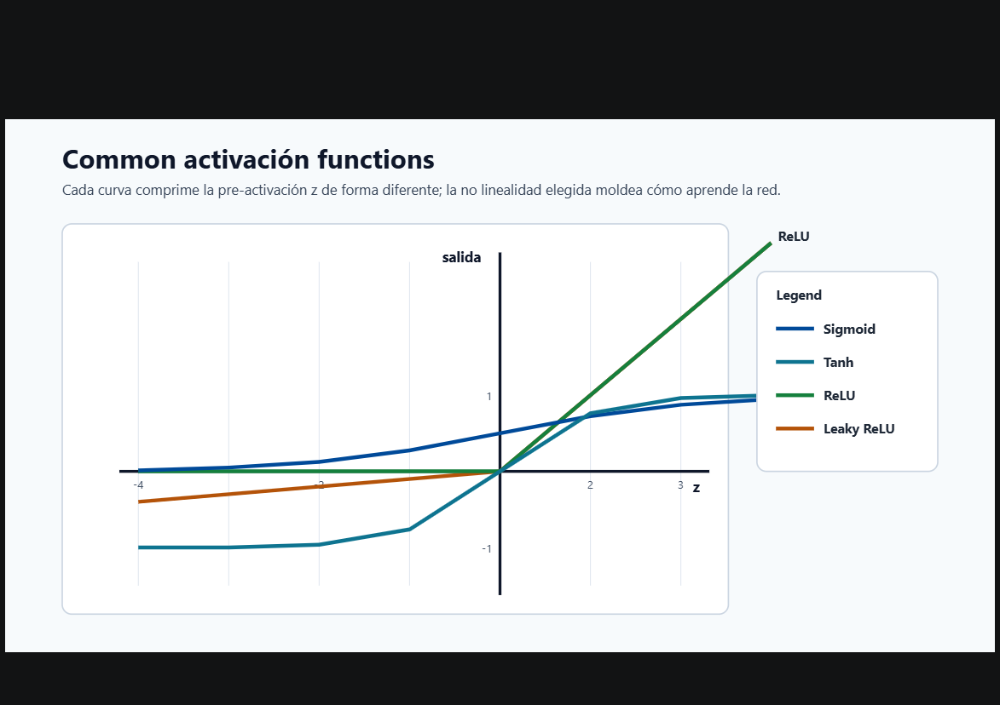
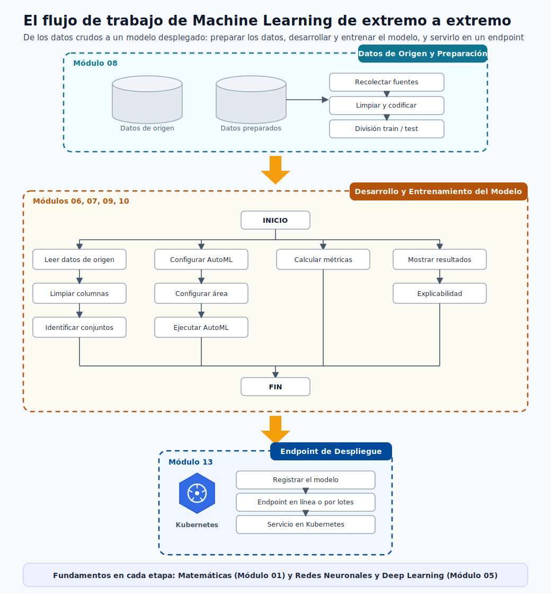

# Visión General de ML de Extremo a Extremo

Antes de profundizar en cada bloque por separado, conviene ver el panorama completo de una vez.
Esta página es un mapa de todo el flujo de trabajo de machine learning: las partes que componen
una solución de ML y cómo se conectan, desde plantear un problema de negocio hasta monitorear un
modelo en producción.

Úsala como una referencia a la que puedas volver. Cada etapa de abajo enlaza con el módulo
detallado que la cubre por completo.

## Incluido desde tu fuente de creación de modelos

Este módulo incorpora explícitamente el flujo de implementación de `azML-modelcreation`:

- Configuración de workspace y cómputo.
- Registro del dataset y verificación de esquema.
- Entrenamiento y evaluación desde notebook.
- Registro de modelo y patrón de script de scoring (`score.py`).

---

## El panorama general

> **Nota - Lee el diagrama como un ciclo, no como una línea:** Los proyectos reales de ML son
> iterativos. Los resultados de la evaluación y el monitoreo retroalimentan el trabajo de datos y
> de modelado, así que la canalización es un ciclo que sigue mejorando en lugar de un camino de un
> solo sentido que termina.

El flujo tiene seis etapas de trabajo, todas apoyadas en dos fundamentos (matemáticas y redes
neuronales) que aparecen en cada etapa.

---

## Las etapas de un vistazo

| # | Etapa | Qué ocurre aquí | Dónde aprenderlo |
|---|-------|-----------------|------------------|
| 1 | Planteamiento del problema | Convertir un objetivo de negocio en un objetivo de predicción preciso: la decisión, la unidad, la etiqueta, el KPI de éxito y el costo de cada error. | [Introducción y Ciclo de Vida](03-introduction.md) |
| 2 | Preparación de datos | Recolectar datos de origen, limpiarlos y codificarlos, identificar los conjuntos correctos y dividir en train y test sin fugas. | [Preparación de Datos](08-data-preparation.md) |
| 3 | Desarrollo del modelo | Configurar el área de trabajo y el entorno, elegir una familia de modelos, configurar AutoML y ejecutar el entrenamiento y la búsqueda de hiperparámetros. | [Tipos de Modelos](09-model-types.md), [Entrenamiento y AutoML](10-training-automl.md) |
| 4 | Evaluación | Calcular las métricas correctas, analizar dónde acierta y falla el modelo y explicar sus predicciones. | [Métricas de Rendimiento](11-performance-metrics.md), [Resultados y Explicabilidad](12-results-explainability.md) |
| 5 | Despliegue | Registrar el modelo y servirlo como un endpoint en línea o por lotes, incluso en Kubernetes. | [Despliegue](13-deployment.md) |
| 6 | Monitoreo | Seguir la deriva de datos y del modelo, depurar endpoints en vivo y disparar el reentrenamiento cuando baja la calidad. | [Depuración de Despliegue](14-deployment-debug-k8s.md) |

---

## Cómo se conectan las partes

**1. Planteamiento del problema.** Todo empieza con una pregunta clara. Si no puedes enunciar la
decisión que cambiará la predicción, la unidad sobre la que predices y cómo se mide el éxito como
un número, el resto de la canalización no tiene un objetivo al que apuntar. Esto se cubre en
[Introducción y Ciclo de Vida](03-introduction.md).

**2. Preparación de datos.** Los modelos solo son tan buenos como los datos que los respaldan.
Esta etapa reúne los datos de origen, los limpia y codifica, identifica qué conjuntos importan y
construye una división honesta de train y test. Consulta
[Preparación de Datos](08-data-preparation.md), con el área de trabajo y las herramientas en
[Entorno de Azure ML](06-azure-ml-environment.md) y [Configuración del Entorno](07-environment-setup.md).

**3. Desarrollo del modelo.** Con los datos limpios listos, eliges una familia de algoritmos,
configuras el trabajo de entrenamiento (a menudo mediante AutoML) y buscas el mejor modelo. La
teoría detrás de las decisiones está en [Fundamentos de ML](04-ml-foundations.md) y
[Redes Neuronales y Deep Learning](05-neural-networks.md); la práctica está en
[Tipos de Modelos](09-model-types.md) y [Entrenamiento y AutoML](10-training-automl.md).

**4. Evaluación.** Un modelo entrenado no está terminado hasta que lo has medido con las métricas
correctas, has entendido sus errores y has explicado su comportamiento. Consulta
[Métricas de Rendimiento](11-performance-metrics.md) y
[Resultados y Explicabilidad](12-results-explainability.md).

**5. Despliegue.** Un buen modelo solo crea valor cuando sirve predicciones. Registras el modelo y
lo expones como un endpoint en tiempo real o por lotes, incluido el servicio basado en Kubernetes.
Consulta [Despliegue](13-deployment.md).

**6. Monitoreo.** La producción es donde continúa el trabajo. Vigilas la deriva, depuras
incidencias de endpoints e infraestructura, y reentrenas cuando la calidad cae. Esto cierra el
ciclo de regreso a los datos y al desarrollo del modelo. Consulta
[Depuración de Despliegue](14-deployment-debug-k8s.md).

---

## Los fundamentos bajo cada etapa

Dos áreas aparecen una y otra vez, sin importar en qué etapa estés:

- **Matemáticas** ([Prerrequisitos Matemáticos](01-math-prerequisites.md)): probabilidad, álgebra
  lineal, cálculo y estadística impulsan cada función de pérdida, métrica y paso de optimización.
- **Redes neuronales y deep learning** ([Redes Neuronales y Deep Learning](05-neural-networks.md)):
  la familia de modelos dominante para imágenes, texto y problemas a gran escala.

> **Nota - Por qué una visión general primero:** Saber dónde encaja cada tema en el flujo general
> hace que los módulos detallados sean más fáciles de asimilar. Cuando más adelante estudies la
> división de datos o una métrica específica, ya sabrás a qué etapa pertenece y qué viene antes y
> después.
