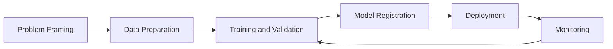
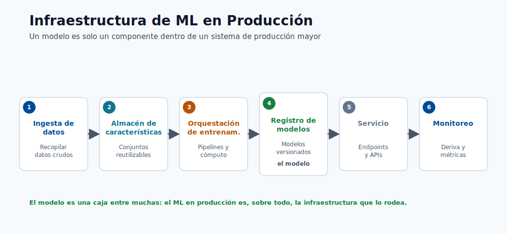
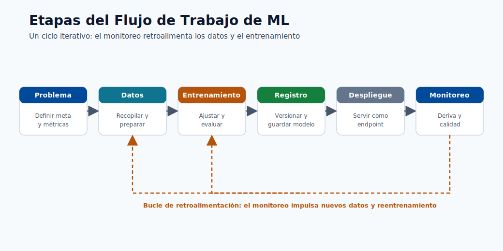
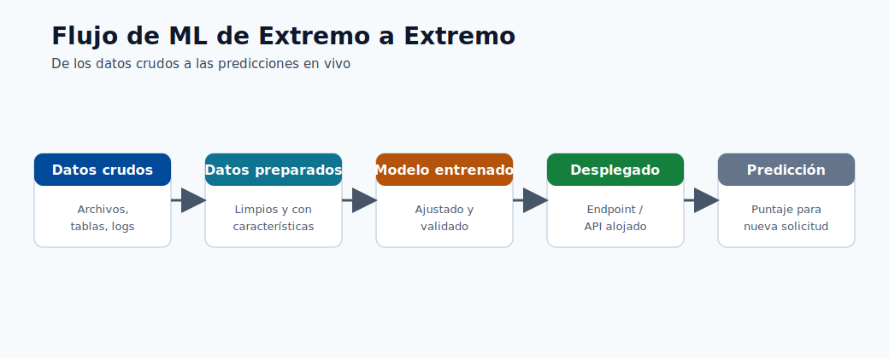
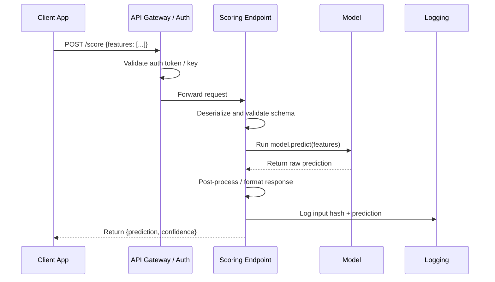
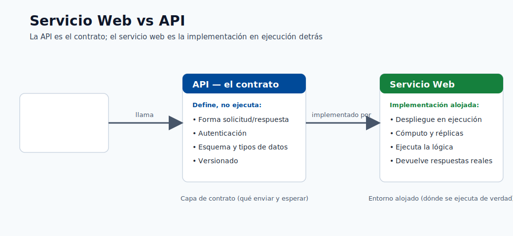
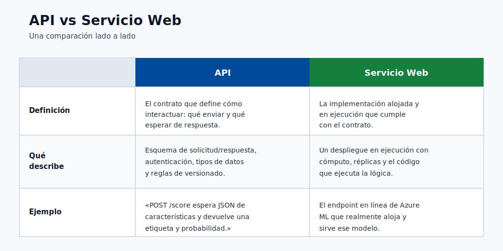

# Introducción y ciclo de vida del ML

Este curso está diseñado para estudiantes que comienzan desde cero y avanzan hacia el  
pensamiento de MLOps en producción. El objetivo no es solo definir términos, sino construir intuición sobre cómo  
se diseñan, se entregan y se operan los sistemas reales de ML.

## Para quién es esto

- Principiantes que saben poco o nada sobre ML.
- Ingenieros que saben programar pero necesitan comprender la plataforma de ML de extremo a extremo.
- Equipos que se preparan para desplegar cargas de trabajo de Azure ML en producción.

## Resultados de aprendizaje

Al finalizar este módulo, deberías ser capaz de:

1. Explicar la diferencia entre IA, ML y ciencia de datos.
2. Identificar las principales categorías de IA y ML.
3. Describir el ciclo de vida de Azure ML desde el planteamiento del problema hasta el monitoreo.
4. Explicar cómo un modelo desplegado se expone como una API o servicio web.

## IA vs ML vs ciencia de datos

| Tema                         | Qué es                                                                                | Objetivo                                  | Salida típica                |
| ---------------------------- | ------------------------------------------------------------------------------------- | ----------------------------------------- | ---------------------------- |
| IA (Inteligencia Artificial) | Campo amplio de construcción de sistemas que realizan tareas que requieren inteligencia similar a la humana | Razonar, planear, percibir, generar, decidir | Comportamiento inteligente   |
| ML (Aprendizaje Automático)  | Subconjunto de la IA donde los sistemas aprenden patrones a partir de datos           | Predecir/estimar resultados a partir de ejemplos | Modelo entrenado          |
| Ciencia de datos             | Práctica interdisciplinaria de extraer conocimiento a partir de datos                 | Comprender los datos y apoyar las decisiones | Análisis, tableros, modelos |

Relación clave para principiantes:

- La **IA** es el paraguas que abarca todo.
- El **ML** es una de las principales formas de construir sistemas de IA.
- La **ciencia de datos** usa estadística, ML y conocimiento del dominio para resolver problemas de negocio  
y comunicar hallazgos.

En resumen: la IA es la misión, el ML es un método y la ciencia de datos es la práctica más amplia.

## Principales categorías de IA

| Categoría                          | Descripción                                        | Ejemplos del mundo real                                      |
| ---------------------------------- | -------------------------------------------------- | ------------------------------------------------------------ |
| IA simbólica / basada en reglas    | Reglas y lógica explícitas creadas por humanos     | Sistemas expertos, motores de reglas de negocio              |
| IA de aprendizaje automático       | Aprende a partir de datos en lugar de reglas codificadas a mano | Puntuación de fraude, pronóstico de demanda       |
| IA generativa                      | Aprende a generar contenido nuevo                  | Generación de texto, generación de imágenes, asistentes de código |
| Búsqueda/planificación clásica     | Encuentra acciones para optimizar un objetivo      | Planificación de rutas, programación                         |

Nota práctica: muchas soluciones empresariales combinan categorías. Ejemplo: un sistema de fraude puede  
usar puntuación de ML supervisado más barreras de protección basadas en reglas.

## Tipos de ML de un vistazo

| Tipo                          | Requisito de datos                      | Tarea típica                          |
| ----------------------------- | --------------------------------------- | ------------------------------------- |
| Aprendizaje supervisado       | Datos etiquetados $(X, y)$              | Clasificación, regresión              |
| Aprendizaje no supervisado    | Datos sin etiquetar $X$                 | Agrupamiento, detección de anomalías  |
| Aprendizaje por refuerzo      | Entorno + señal de recompensa           | Decisión/control secuencial           |
| Aprendizaje semisupervisado   | Pocos etiquetados + muchos sin etiquetar | Clasificación con etiquetas escasas  |
| Aprendizaje autosupervisado   | Etiquetas generadas a partir de los propios datos | Aprendizaje de representaciones (NLP/CV) |

## Puntos de confusión comunes

- Un modelo puede ser "preciso" pero aun así inutilizable si la latencia es demasiado alta.
- Un modelo puede ser estadísticamente sólido pero fallar en las comprobaciones de equidad/cumplimiento.
- Un modelo no es un producto por sí solo; el sistema de datos y operaciones que lo rodea importa.
- El aprendizaje profundo es un subconjunto del ML, no algo separado; usa redes neuronales con muchas capas.
- "Entrenar" un modelo significa encontrar valores de parámetros que minimicen una función de pérdida sobre los datos, no enseñar en el sentido humano.

## Ejemplo del mundo real: recomendación de comercio electrónico

Para concretar esto, así es como toda la pila tecnológica se asigna a un producto:

| Aspecto                      | Elección tecnológica                    | Etapa del ciclo de vida del ML |
| ---------------------------- | --------------------------------------- | ------------------------------ |
| Recolectar eventos de usuario | Transmisión de eventos (Kafka, Event Hub) | Ingesta de datos             |
| Almacenar características    | Feature store o Azure Data Lake         | Preparación de datos           |
| Entrenar el modelo           | Trabajo de entrenamiento de Azure ML    | Entrenamiento                  |
| Servir recomendaciones       | Endpoint en línea (AKS)                 | Despliegue                     |
| Detectar modelo obsoleto     | Monitor de data drift de Azure ML       | Monitoreo                      |

El modelo es un componente. El pipeline que lo rodea es lo que lo hace confiable.

## Por qué importa Azure ML

Azure Machine Learning te ofrece la plataforma administrada para ejecutar el ciclo de vida completo con  
reproducibilidad y gobernanza: activos de datos/modelos versionados, ejecuciones rastreadas, endpoints de  
despliegue y monitoreo.

Azure Machine Learning organiza el ciclo de vida de extremo a extremo:

1. Planteamiento del problema
2. Preparación de datos
3. Entrenamiento y validación
4. Registro del modelo
5. Despliegue
6. Monitoreo y reentrenamiento

Esto no es un camino lineal. Los sistemas de producción hacen un ciclo continuo desde el monitoreo de vuelta a  
los datos y el entrenamiento cuando la calidad del modelo o las distribuciones de datos cambian.

### Qué hace cada etapa

| Etapa                      | Pregunta principal                                      | Salida clave                                               |
| -------------------------- | ------------------------------------------------------- | ---------------------------------------------------------- |
| Planteamiento del problema | ¿Qué decisión estamos tratando de mejorar?              | Definición de KPI de negocio, criterios de éxito           |
| Preparación de datos       | ¿Confiamos en los datos y las etiquetas?                | Conjunto de datos validado y versionado                    |
| Entrenamiento              | ¿Qué modelo aprende mejor la señal?                     | Modelos candidatos con métricas rastreadas                 |
| Registro                   | ¿El artefacto está versionado y es reproducible?        | Modelo registrado con linaje                               |
| Despliegue                 | ¿Los consumidores pueden llamar a este modelo de forma segura? | Endpoint activo con autenticación y monitoreo       |
| Monitoreo                  | ¿La calidad es estable a lo largo del tiempo en producción? | Alertas de drift y de calidad, señales de reentrenamiento |

Nota: la etapa 1 (planteamiento del problema) a menudo recibe poca inversión. La razón más común por la que los proyectos de ML fallan es un objetivo de negocio mal definido, no un modelo débil.

> **Nota - Qué muestra esto:** La pila de ML de producción es mucho más grande que el modelo en sí: la ingesta, el almacenamiento de características,  
> la orquestación del entrenamiento, el servicio y el monitoreo son todas herramientas distintas. La conclusión para quienes aprenden Azure  
> ML es que elegir un modelo es una casilla entre muchas: la mayor parte del trabajo de confiabilidad ocurre en  
> la infraestructura circundante.

> **Nota - Qué muestra esto:** Las etapas del flujo de trabajo se asignan una a una al ciclo de vida de Azure ML (planteamiento del problema → datos →  
> entrenamiento → registro → despliegue → monitoreo). Observa el bucle de regreso del monitoreo a  
> los datos/entrenamiento: el ML de producción es iterativo, no un pipeline unidireccional.

> **Nota - Qué muestra esto:** Una vista de extremo a extremo de cómo los datos en bruto se convierten en una predicción servida. Úsala para ubicar dónde encaja cada  
> módulo posterior: la preparación de datos, el entrenamiento del modelo, el despliegue y el monitoreo son todas etapas  
> de este único flujo.

## Servicio web vs API

- Un modelo de Azure ML desplegado normalmente se expone como un endpoint de API REST.
- En la práctica, los equipos suelen decir "servicio web" para referirse a la interfaz de scoring desplegada.

## Análisis a fondo: cada concepto, explicado

Esta sección amplía los términos usados arriba para que ningún concepto quede como una caja negra.

### Qué significa realmente "aprender a partir de datos"

Un programa clásico es una función fija escrita por un humano: `output = program(input)`.  
El aprendizaje automático **invierte** esto. Tú proporcionas ejemplos de entradas y salidas deseadas, y  
un procedimiento de optimización busca una función que las reproduzca y, lo que es crucial,  
*generalice* a entradas no vistas. Formalmente, el ML asume que los datos provienen de una distribución  
conjunta desconocida $P(X, Y)$, y el objetivo es aprender una función $f$ que minimice el  
**riesgo esperado** sobre esa distribución:

$$  
R(f) = \mathbb{E}_{(x,y)\sim P}\big[\mathcal{L}(f(x), y)\big]  
$$

Como $P$ es desconocida, en su lugar minimizamos el **riesgo empírico** sobre una muestra finita  
(el conjunto de entrenamiento). Toda la disciplina del ML consiste en hacer que esa aproximación  
sea confiable: por eso la calidad de los datos, la validación y el monitoreo importan tanto como el  
algoritmo.

### IA, ML, aprendizaje profundo y GenAI como conjuntos anidados

| Término                 | Alcance preciso                                                                  | Qué lo distingue                                            |
| ----------------------- | -------------------------------------------------------------------------------- | ----------------------------------------------------------- |
| Inteligencia Artificial | Cualquier sistema que exhibe un comportamiento "inteligente" orientado a objetivos | Incluye lógica escrita a mano, búsqueda y aprendizaje     |
| Aprendizaje Automático  | Sistemas de IA que mejoran a partir de datos                                     | Los parámetros se *ajustan*, no se codifican a mano         |
| Aprendizaje Profundo    | ML que usa redes neuronales multicapa                                            | Aprende representaciones jerárquicas de características de forma automática |
| IA Generativa           | Modelos que aprenden $P(X)$ (o $P(X\mid \text{prompt})$) para sintetizar datos nuevos | Produce contenido en lugar de solo etiquetas/puntuaciones |

El modelo mental: cada uno es un subconjunto estricto del anterior. Una regresión logística es  
ML pero no aprendizaje profundo; una CNN es aprendizaje profundo; un modelo de difusión o un LLM es aprendizaje profundo  
*y* IA generativa.

### Supervisado, no supervisado y por refuerzo: la señal que impulsa el aprendizaje

Las familias difieren solo en **qué señal de retroalimentación está disponible**:

- **Supervisado**: cada ejemplo lleva una respuesta correcta $y$. La pérdida mide directamente la  
brecha entre la predicción y la verdad, de modo que el gradiente "sabe" en qué dirección moverse.
- **No supervisado**: no hay $y$. En su lugar, el objetivo recompensa la estructura que el modelo  
descubre por sí mismo: minimizar el error de reconstrucción, maximizar la compacidad de los grupos o  
maximizar la verosimilitud de los datos bajo un modelo de densidad.
- **Por refuerzo**: la retroalimentación es una **recompensa** escalar y retardada obtenida al interactuar con un  
entorno. La parte difícil es la *asignación de crédito*: decidir qué acciones anteriores causaron  
una recompensa posterior.
- El **autosupervisado** es el puente que impulsa los modelos fundacionales: fabrica una  
señal supervisada *a partir de los propios datos* (predecir la palabra enmascarada, el siguiente token, el  
parche de imagen faltante), brindando los beneficios de escala del aprendizaje supervisado sin etiquetas manuales.

### Por qué "el pipeline importa más que el modelo"

El diagrama del ciclo de vida es un bucle cerrado a propósito. En producción, el modo de falla dominante es  
no un algoritmo débil, sino un **cambio de distribución**: los datos que el modelo ve en producción  
se alejan de los datos con los que fue entrenado (`P_train(X) ≠ P_prod(X)`), de modo que un modelo que era  
preciso al lanzarse se degrada silenciosamente. La arista de retroalimentación monitoreo → entrenamiento existe para  
detectar esto y reentrenar. Esta es la idea central de **MLOps**: tratar los datos, los modelos y los  
despliegues como activos versionados, comprobables y observables en lugar de artefactos de un solo uso.

### Latencia, rendimiento y por qué un "buen" modelo puede ser inutilizable

Dos términos operativos aparecen a lo largo del curso:

- **Latencia**: tiempo para atender una sola solicitud (a menudo medido en el percentil p95 o p99,  
no en el promedio, porque la latencia de cola es lo que los usuarios sienten).
- **Rendimiento**: solicitudes atendidas por segundo (QPS) con una latencia aceptable.

Un modelo que obtiene 0.99 de AUC pero necesita 800 ms por llamada puede ser inútil para un flujo de pago  
con un presupuesto de 100 ms. Por lo tanto, la selección del modelo es siempre una optimización *conjunta* sobre  
la exactitud, la latencia, el costo y las restricciones de gobernanza: un tema que se repite en cada módulo posterior.

### Planteamiento del problema en la práctica: convertir un objetivo de negocio en una tarea de ML

El planteamiento del problema es la etapa donde la mayoría de los proyectos se ganan o se pierden silenciosamente, así que merece una  
lista de verificación concreta. El trabajo consiste en traducir un deseo de negocio vago ("reducir la fuga de clientes") en una  
tarea de aprendizaje precisa y medible. Cinco preguntas fuerzan esa traducción:

1. **¿Qué decisión cambia a causa de la predicción?** Si ningún humano o sistema actuará  
  de manera diferente, el modelo no tiene valor. "Predecir la fuga de clientes" solo es útil si activa una  
   oferta de retención. La decisión define todo el proyecto.
2. **¿Cuál es la unidad de predicción?** ¿Una fila por cliente? ¿Por cliente por mes? ¿Por  
  sesión? Esto fija la granularidad de tus datos y etiquetas.
3. **¿Qué es exactamente la etiqueta?** "Fuga de clientes" debe convertirse en una regla: por ejemplo, "ninguna compra en  
  los próximos 60 días". Las etiquetas ambiguas producen modelos que aprenden lo incorrecto.
4. **¿Cómo se ve el éxito como un número?** Vincula el modelo a un KPI de negocio (ingresos  
  retenidos, fraude detectado, costo evitado), no solo a la exactitud. Esta es la métrica por la que se juzga el  
   proyecto.
5. **¿Cuál es el costo de cada tipo de error?** Un falso positivo (marcar a un cliente leal) y  
  un falso negativo (pasar por alto a uno que se va) rara vez cuestan lo mismo. Esta asimetría impulsa la función  
   de pérdida y el umbral de decisión en los módulos posteriores.

> **Nota - La trampa del planteamiento:** Un modelo técnicamente excelente construido sobre un problema mal planteado  
> es peor que inútil: produce respuestas seguras y bien validadas a la pregunta equivocada.  
> Dedica tiempo real aquí antes de tocar los datos o los algoritmos.

### Un recorrido numérico concreto

Para desmitificar que "el modelo es solo matemáticas", aquí está el ejemplo de extremo a extremo más pequeño posible. Supongamos  
que predecimos si un correo electrónico es spam a partir de una sola característica, el número de enlaces sospechosos $x$. Un  
modelo de regresión logística aprende dos números, un peso $w$ y un sesgo $b$, y calcula:

$$  
\hat{p} = \frac{1}{1 + e^{-(wx + b)}}  
$$

Digamos que el entrenamiento se estabiliza en $w = 1.2$ y $b = -2.0$. Para un correo electrónico con $x = 3$ enlaces, la puntuación es  
$wx + b = 1.6$, y $\hat{p} = 1/(1 + e^{-1.6}) \approx 0.83$. Con un umbral de decisión de  
$0.5$, el correo electrónico se marca como spam. Cada modelo en este curso es una versión más rica de exactamente  
esto: aprender parámetros a partir de ejemplos, combinarlos con la entrada para obtener una puntuación y luego aplicar un  
umbral para tomar una decisión.

### API REST, endpoint y servicio web: la misma idea en distintas capas

- Una **API REST** es un contrato HTTP: un cliente envía una solicitud (normalmente JSON) a una URL y  
obtiene una respuesta estructurada. "REST" significa que usa verbos HTTP estándar y es sin estado.
- Un **endpoint** en Azure ML es el despliegue concreto y direccionable de esa API, con  
autenticación, escalado y enrutamiento de tráfico incorporados.
- "**Servicio web**" es el nombre informal que los equipos dan al endpoint en ejecución. Los tres describen  
lo mismo visto desde el contrato, la plataforma y el vocabulario del equipo respectivamente.

Distinción práctica:

- La **API** describe el contrato (esquema de solicitud/respuesta, autenticación, versionado).
- El **servicio web** es la implementación alojada de esa API.
- En los endpoints en línea de Azure ML, diseñas el contrato de la API a través del payload de scoring  
y la autenticación del endpoint, y Azure aloja el servicio.

### Flujo de una solicitud de inferencia (simple)

1. El cliente envía un payload JSON al URI del endpoint.
2. La autenticación del endpoint valida la identidad/clave.
3. El script de scoring analiza la entrada y ejecuta el modelo.
4. La API devuelve la respuesta de predicción + metadatos.

### Flujo de una solicitud de inferencia (detallado)

Consideraciones clave de producción para este flujo:

- **La validación de esquema en el script de scoring** protege contra formas de entrada inesperadas.
- **El registro de hashes de entrada** (no PII en crudo) permite el análisis de drift y la auditoría posteriores.
- **Los tiempos de espera y los reintentos** deben definirse tanto en la capa de gateway como en la del cliente para evitar fallos silenciosos.

> **Consejo - Modelo mental:** Un *servicio web* es el despliegue en ejecución; la *API* es el contrato que usan los clientes para llamarlo.  
> En Azure ML un modelo se envuelve detrás de un endpoint REST: los clientes envían JSON y reciben una  
> predicción, sin saber qué modelo o framework se ejecuta por debajo.

> **Nota - Comparación rápida:** La tabla contrasta el término informal *servicio web* con el término técnico *API*. Describen  
> la misma interfaz de scoring desplegada desde dos ángulos: el proceso en ejecución frente al  
> contrato HTTP que expone.

## Glosario de términos clave

Este glosario reúne en un solo lugar el vocabulario introducido arriba para que los módulos posteriores puedan asumirlo.  
Cada término se define en una frase sencilla.

| Término                  | Significado                                                                                  |
| ------------------------ | -------------------------------------------------------------------------------------------- |
| Modelo                   | Una función con números aprendidos (parámetros) que convierte entradas en predicciones.      |
| Parámetro / peso         | Uno de los números que el proceso de entrenamiento ajusta; juntos almacenan lo que se aprendió. |
| Característica           | Una sola columna de entrada (una propiedad medible) que el modelo lee.                       |
| Etiqueta / objetivo      | La respuesta correcta adjunta a cada ejemplo de entrenamiento en el aprendizaje supervisado. |
| Función de pérdida       | Un solo número que mide cuánto se equivoca el modelo; el entrenamiento trata de minimizarlo. |
| Entrenamiento            | El proceso de optimización que busca los parámetros que minimizan la pérdida.                |
| Generalización           | Qué tan bien funciona el modelo con datos que nunca vio durante el entrenamiento.            |
| Sobreajuste              | Memorizar el ruido del entrenamiento de modo que la exactitud baje en datos nuevos.          |
| Inferencia / scoring     | Usar un modelo entrenado para hacer predicciones sobre entradas nuevas.                      |
| Endpoint                 | El servicio desplegado y direccionable que sirve un modelo a través de HTTP.                 |
| Drift                    | Un cambio en la distribución de los datos de producción que degrada la calidad del modelo con el tiempo. |
| MLOps                    | Tratar los datos, los modelos y los despliegues como activos versionados, probados y monitoreados. |

## Verificación rápida

| # | Pregunta | Respuesta |
|---|----------|-----------|
| 1 | ¿Todo sistema de IA es un sistema de ML? | No. El ML es un subconjunto de la IA; los sistemas de IA basados en reglas o simbólicos toman decisiones sin aprender de los datos. |
| 2 | En producción, ¿qué etapa detecta los problemas de drift? | La etapa de monitoreo, que vigila la distribución de los datos en vivo y la calidad del modelo y detecta el drift con el tiempo. |
| 3 | ¿Cuál es la diferencia entre API y servicio web? | La API es el contrato (esquema de petición/respuesta, autenticación, versionado); el servicio web es la implementación alojada y en ejecución de esa API (el endpoint). |
| 4 | Dado un objetivo de negocio, ¿cuáles son las cinco preguntas de planteamiento del problema que debes responder primero? | (1) ¿Qué decisión cambia gracias a la predicción? (2) ¿Cuál es la unidad de predicción? (3) ¿Qué es exactamente la etiqueta? (4) ¿Cómo se ve el éxito como número (KPI de negocio)? (5) ¿Cuál es el costo de cada tipo de error? |
| 5 | ¿Por qué un modelo con excelente exactitud puede ser de todas formas la elección incorrecta para producción? | La exactitud ignora los costos de error, el desbalance de clases, la equidad, la latencia y el KPI de negocio; un modelo muy exacto puede no detectar los positivos raros o ser demasiado lento, costoso o injusto para desplegar. |

---

## Fundamentos de probabilidad para el ML

El aprendizaje automático es fundamentalmente probabilidad aplicada. Cada función de pérdida, cada métrica y cada garantía de generalización tiene un argumento probabilístico detrás. Esta sección construye el vocabulario mínimo necesario.

### Probabilidad conjunta y marginal

La **probabilidad conjunta** $P(X = x, Y = y)$ es la probabilidad de que un ejemplo extraído aleatoriamente tenga valor de característica $x$ *y* etiqueta $y$ simultáneamente. El aprendizaje supervisado asume que tu conjunto de datos se muestrea i.i.d. de esta distribución conjunta.

La **probabilidad marginal** de $X$ se obtiene sumando (o integrando) $Y$:

$$
P(X = x) = \sum_{y} P(X = x, Y = y)
$$

Esto no te dice nada sobre la etiqueta: solo cómo luce la entrada.

### Probabilidad condicional

La **probabilidad condicional** $P(Y = y \mid X = x)$ es la probabilidad de la etiqueta $y$ dado que la entrada es $x$. Esto es exactamente lo que un clasificador aprende a estimar. Formalmente:

$$
P(Y \mid X) = \frac{P(X, Y)}{P(X)}
$$

El denominador $P(X)$ normaliza la conjunta para que las probabilidades sobre todos los $y$ sumen 1. Cuando un modelo produce una "probabilidad" de la clase 1, está estimando $P(Y=1 \mid X=x)$.

### Teorema de Bayes

El teorema de Bayes es el motor central del razonamiento probabilístico. Invierte el condicionamiento:

$$
P(Y \mid X) = \frac{P(X \mid Y) \cdot P(Y)}{P(X)}
$$

- $P(Y)$ es la **distribución a priori**: lo que crees sobre $Y$ antes de ver $X$. Para spam, esto podría ser "el 5% de todos los correos son spam."
- $P(X \mid Y)$ es la **verosimilitud**: ¿qué tan probable es esta entrada dada la etiqueta? Por ejemplo, ¿qué tan probable es la palabra "lotería" en un correo spam?
- $P(Y \mid X)$ es la **distribución a posteriori**: tu creencia actualizada después de ver $X$. Esto es lo que quieres.
- $P(X)$ es la **evidencia**: una constante de normalización.

Un **clasificador Naive Bayes** aplica directamente este teorema, asumiendo que las características son condicionalmente independientes dada la clase. A pesar de esta suposición poco realista, funciona sorprendentemente bien en la clasificación de texto porque se conserva el ordenamiento relativo de las distribuciones a posteriori.

### Por qué el pensamiento probabilístico es esencial para el ML

- **Calibración**: un modelo que predice una probabilidad de 0.9 debería acertar el 90% de las veces. Los modelos mal calibrados engañan a los sistemas de decisión posteriores.
- **Cuantificación de la incertidumbre**: saber *qué tan seguro* está el modelo importa tanto como la predicción misma en entornos médicos y financieros.
- **Derivación de la pérdida**: la mayoría de las funciones de pérdida estándar (entropía cruzada, MSE) surgen naturalmente como objetivos de máxima verosimilitud bajo suposiciones probabilísticas específicas.
- **Manejo del desequilibrio de clases**: los conjuntos de datos desequilibrados tienen una distribución a priori sesgada $P(Y)$; comprenderlo evita que la exactitud ingenua sea una métrica engañosa.

> **Nota - Probabilidad vs estadística:** La probabilidad razona hacia adelante desde un modelo conocido hacia los datos. La estadística razona hacia atrás desde los datos hacia los parámetros desconocidos. El ML hace ambas simultáneamente: usa estimación estadística para aprender un modelo probabilístico, luego usa ese modelo para razonar hacia adelante en el momento de la inferencia.

---

## Teoría de la información y entropía en el ML

La teoría de la información, desarrollada por Claude Shannon en 1948, proporciona el lenguaje matemático para medir la incertidumbre. Resulta ser el fundamento natural para las pérdidas de clasificación.

### Entropía: midiendo la incertidumbre

La **entropía** de una distribución de probabilidad discreta $P$ sobre $K$ clases mide la sorpresa promedio (imprevisibilidad) de extraer una muestra:

$$
H(P) = -\sum_{k=1}^{K} p_k \log_2 p_k
$$

La entropía se mide en **bits** cuando se usa $\log_2$, y en **nats** cuando se usa $\ln$. Propiedades clave:

- $H = 0$ cuando una clase tiene probabilidad 1 (sin incertidumbre).
- $H$ se maximiza en $\log_2 K$ bits cuando todas las $K$ clases son igualmente probables (máxima incertidumbre).
- Para una moneda justa (binaria, $p = 0.5$): $H = -0.5 \log_2 0.5 - 0.5 \log_2 0.5 = 1$ bit.

### La entropía cruzada como pérdida natural de clasificación

Supongamos que la distribución verdadera sobre las clases es $P$ (el vector one-hot de etiquetas), y tu modelo produce una distribución predicha $Q$ (las salidas del softmax). La **entropía cruzada** entre $P$ y $Q$ es:

$$
H(P, Q) = -\sum_{k=1}^{K} p_k \log q_k
$$

Para un único ejemplo con clase verdadera $c$, el vector one-hot hace que $p_k = 1$ solo para $k = c$, de modo que esto se reduce a:

$$
H(P, Q) = -\log q_c
$$

Esto es exactamente la **log-verosimilitud negativa** de la clase correcta bajo la distribución del modelo. Minimizar la entropía cruzada equivale a maximizar la probabilidad que el modelo asigna a las etiquetas verdaderas, el objetivo más fundamentado posible.

La entropía cruzada promediada sobre un conjunto de datos es la **pérdida de entropía cruzada categórica** estándar usada en prácticamente todos los modelos de clasificación:

$$
\mathcal{L}_{CE} = -\frac{1}{N} \sum_{i=1}^{N} \sum_{k=1}^{K} y_{ik} \log \hat{p}_{ik}
$$

### Divergencia KL: midiendo la discrepancia entre distribuciones

La **divergencia de Kullback-Leibler (KL)** de la distribución $Q$ a $P$ mide cuánta información se pierde cuando $Q$ se usa para aproximar $P$:

$$
D_{KL}(P \| Q) = \sum_{k} p_k \log \frac{p_k}{q_k} = H(P, Q) - H(P)
$$

Datos clave:

- $D_{KL}(P \| Q) \geq 0$ siempre, con igualdad solo cuando $P = Q$ (desigualdad de Gibbs).
- Es **asimétrica**: $D_{KL}(P \| Q) \neq D_{KL}(Q \| P)$ en general.
- Minimizar la entropía cruzada $H(P, Q)$ respecto a los parámetros del modelo es idéntico a minimizar $D_{KL}(P \| Q)$, porque $H(P)$ no depende del modelo.

La divergencia KL aparece en todo el ML: en los autoencoders variacionales (como término de regularización), en la destilación del conocimiento (alineando distribuciones de estudiante y maestro) y en el monitoreo (midiendo cuánto se ha alejado una distribución de producción del entrenamiento).

> **Consejo - Intuición para la entropía cruzada:** Piensa en $-\log q_c$ como el "costo" de codificar la clase verdadera usando la distribución de probabilidad de tu modelo. Si el modelo es muy seguro y correcto ($q_c \approx 1$), el costo es cercano a cero. Si el modelo está seguro pero equivocado ($q_c \approx 0$), el costo es enorme. Por eso la entropía cruzada penaliza fuertemente los errores con exceso de confianza.

---

## Resumen de la teoría del aprendizaje estadístico

La teoría del aprendizaje estadístico es la rama de la matemática que pregunta: *¿cuándo funciona realmente la minimización del riesgo empírico?* Proporciona garantías formales que conectan lo que observamos en los datos de entrenamiento con lo que podemos esperar en datos no vistos.

### El problema de la generalización de forma formal

Queremos aprender una función $f$ de una clase de hipótesis $\mathcal{H}$ tal que el **riesgo verdadero** $R(f)$ sea pequeño. Solo tenemos acceso al **riesgo empírico** sobre $N$ muestras:

$$
\hat{R}(f) = \frac{1}{N} \sum_{i=1}^{N} \mathcal{L}(f(x_i), y_i)
$$

La brecha de generalización $R(f) - \hat{R}(f)$ es la cantidad central que la teoría intenta acotar.

### Aprendizaje PAC

El **aprendizaje PAC (Probablemente Aproximadamente Correcto)**, introducido por Leslie Valiant (1984), formaliza qué significa que un algoritmo de aprendizaje tenga éxito. Un algoritmo aprende PAC una clase de conceptos $\mathcal{C}$ si: para cualquier concepto objetivo, cualquier distribución sobre las entradas, y cualquier $\epsilon, \delta > 0$, el algoritmo produce una hipótesis $h$ tal que:

$$
P\big[R(h) \leq \epsilon\big] \geq 1 - \delta
$$

usando un número de muestras que es polinomial en $1/\epsilon$, $1/\delta$ y la complejidad de la clase de conceptos. De forma intuitiva: con suficientes datos, el algoritmo encontrará (con alta probabilidad) una hipótesis cuyo error verdadero sea pequeño.

### Dimensión VC

La **dimensión de Vapnik-Chervonenkis (VC)** de una clase de hipótesis $\mathcal{H}$ es el conjunto más grande de puntos que $\mathcal{H}$ puede **destrozar**: clasificar de todas las $2^n$ formas binarias posibles. Mide el poder expresivo de la clase del modelo.

Ejemplos:

- Clasificadores lineales en $\mathbb{R}^2$ (semiplanos): dimensión VC = 3. Cualquier 3 puntos no colineales pueden destrozarse; ningún conjunto de 4 puede.
- Decision stumps (umbral en una sola característica): dimensión VC = 2.
- $k$ vecinos más cercanos: dimensión VC = $\infty$ (infinitamente expresivo).

La cota de complejidad muestral fundamental:

$$
N = O\!\left(\frac{d_{VC} + \log(1/\delta)}{\epsilon^2}\right)
$$

donde $d_{VC}$ es la dimensión VC. Para reducir a la mitad el error permitido $\epsilon$, necesitas aproximadamente **cuatro veces más datos**.

### Cotas de generalización

Una cota de convergencia uniforme establece que con probabilidad al menos $1 - \delta$:

$$
R(f) \leq \hat{R}(f) + O\!\left(\sqrt{\frac{d_{VC} \log N + \log(1/\delta)}{N}}\right)
$$

Implicaciones prácticas:

- **Más datos** ($N$ aumenta): la cota se ajusta, la varianza disminuye.
- **Modelo más complejo** ($d_{VC}$ aumenta): la cota se afloja, la varianza aumenta.
- El **sesgo** no está capturado por esta cota; solo describe cuánto puede sobreajustarse el modelo.

### Por qué más datos ayuda con la varianza pero no con el sesgo

Aumentar $N$ reduce la brecha de generalización concentrando la distribución empírica alrededor de la distribución verdadera (ley de los grandes números). Sin embargo, si la clase de hipótesis es demasiado simple (pequeño $d_{VC}$), ninguna cantidad de datos permitirá al modelo expresar la función verdadera: eso es sesgo, una limitación estructural de la familia del modelo.

> **Nota - Implicación práctica:** Si tu modelo se estanca a pesar de añadir datos, el problema es el sesgo (capacidad). Si el error de entrenamiento y de prueba divergen, el problema es la varianza (complejidad). Estos dos diagnósticos guían todas las decisiones de selección de modelos.

---

## El método científico como flujo de trabajo de ML

Una buena práctica de ML es buena ciencia. El método científico proporciona la disciplina epistemológica que evita que los equipos se engañen a sí mismos.

### Mapeo de la ciencia al ML

| Paso científico          | Equivalente en ML                                          | Riesgo si se omite                                    |
| ------------------------ | ---------------------------------------------------------- | ----------------------------------------------------- |
| Hipótesis                | Definir el problema y la métrica de éxito con precisión    | Construir un modelo que responde la pregunta incorrecta |
| Diseño experimental      | Diseñar la división entrenamiento/validación/prueba y la evaluación | Fuga de datos; resultados optimistas que no se transfieren |
| Experimento              | Entrenar el modelo con hiperparámetros controlados         | Resultados no interpretables; no se pueden aislar causas |
| Medición                 | Registrar métricas en datos apartados                      | Sobreajustar el número reportado al conjunto de prueba |
| Conclusión               | Aceptar/rechazar la hipótesis; decidir el siguiente paso   | Despliegue prematuro o abandono de buenos modelos     |
| Replicación              | Versionar el código, los datos y el entorno                | Resultados que no pueden ser reproducidos por compañeros o auditores |

### Experimentos controlados en ML

Un **experimento controlado** cambia una variable a la vez. En ML esto significa:

- Al comparar modelos, mantener fijo el conjunto de datos, el preprocesamiento y la métrica de evaluación.
- Al comparar conjuntos de características, mantener fija la arquitectura del modelo y los hiperparámetros.
- Al comparar hiperparámetros, usar la misma semilla aleatoria y la misma división de datos.

El **seguimiento de experimentos de Azure ML** aplica esta disciplina registrando cada ejecución con sus hiperparámetros, versión de datos, commit de código y métricas.

### Reproducibilidad y sus enemigos

Un resultado es **reproducible** si cualquier persona con las mismas entradas puede obtener las mismas salidas. La reproducibilidad está amenazada por:

- **Semillas aleatorias**: la aleatoriedad en la inicialización de pesos, el mezclado de datos o el aumento de datos debe fijarse y registrarse.
- **Versiones de bibliotecas**: una versión diferente de scikit-learn o PyTorch puede producir resultados numéricamente distintos.
- **Versión de datos**: si el conjunto de datos de entrenamiento cambia sin versionado, no puedes recrear ejecuciones históricas.
- **Hardware**: el no-determinismo de las GPU significa que la reproducción bit a bit a veces requiere fijar el hardware.

Azure ML aborda estos problemas con el versionado de conjuntos de datos, instantáneas de entornos y metadatos de reproducibilidad de ejecuciones.

> **Consejo - La lista de verificación de reproducibilidad:** Antes de publicar o desplegar un resultado, verifica: (1) la versión de los datos está fijada, (2) el commit del código está etiquetado, (3) el entorno está en contenedor, (4) las semillas aleatorias están registradas. Un resultado que no puede reproducirse no es un resultado.

---

## IA responsable y encuadre ético

La IA responsable no es una casilla que marcar al final de un proyecto, sino una disciplina de diseño que debe estar incorporada desde el planteamiento del problema en adelante.

### Por qué la ética es una preocupación de ingeniería de primera clase

Un modelo codifica decisiones. Esas decisiones afectan a personas. Cuando un modelo de puntuación de crédito deniega un préstamo, un modelo de contratación clasifica currículums o un modelo de triaje médico asigna atención, las consecuencias posteriores son reales y potencialmente discriminatorias. La pregunta "¿es preciso este modelo?" está incompleta sin preguntarse también "¿preciso para quién, y a qué costo para qué grupo?"

### Definiciones de equidad

No existe una única definición acordada de equidad. Las tres definiciones estadísticas más comunes son:

**Paridad demográfica (paridad estadística):** La tasa de predicción positiva es igual en los grupos $A$ y $B$:

$$
P(\hat{Y} = 1 \mid G = A) = P(\hat{Y} = 1 \mid G = B)
$$

Esto garantiza igual representación de resultados positivos. No requiere igual exactitud.

**Odds igualadas:** Tanto la tasa de verdaderos positivos (TPR) como la tasa de falsos positivos (FPR) son iguales entre grupos:

$$
P(\hat{Y} = 1 \mid Y = y, G = A) = P(\hat{Y} = 1 \mid Y = y, G = B) \quad \text{para } y \in \{0, 1\}
$$

Esto es más estricto: el modelo debe ser igualmente preciso *e* igualmente inexacto entre grupos.

**Calibración:** La probabilidad predicha $\hat{p}$ coincide con la tasa de verdaderos positivos dentro de cada grupo. Un modelo calibrado a nivel de población puede estar mal calibrado dentro de subgrupos, un modo de fallo común en la puntuación médica.

> **Nota - El teorema de imposibilidad:** Es matemáticamente imposible satisfacer la paridad demográfica, las odds igualadas y la calibración simultáneamente cuando las tasas base difieren entre grupos (Chouldechova 2017; Kleinberg et al. 2016). Elegir un criterio de equidad es un juicio de valor que debe involucrar a las partes interesadas, no solo a los ingenieros.

### Transparencia y explicabilidad

- La **transparencia** se refiere a la capacidad de entender *por qué* un modelo tomó una decisión específica. Los modelos opacos de "caja negra" crean vacíos de responsabilidad en industrias reguladas.
- Las técnicas de **explicabilidad** (SHAP, LIME, visualización de atención) aproximan o exponen las atribuciones de características. Estas se tratan en el módulo de Resultados y Explicabilidad.
- Regulaciones como el RGPD (Artículo 22) y la Ley de IA de la UE exigen que las decisiones automatizadas que afectan a individuos sean explicables bajo solicitud.

### Privacidad y minimización de datos

- **Minimización de datos**: solo recopilar y usar las características necesarias para la tarea. Cada atributo personal adicional es un pasivo.
- **Privacidad diferencial**: una garantía matemática formal de que la presencia o ausencia de cualquier individuo en los datos de entrenamiento no puede inferirse de la salida del modelo.
- **Aprendizaje federado**: entrenar modelos sobre datos que nunca salen del dispositivo o la institución. Los gradientes se agregan centralmente pero los datos en bruto permanecen locales.

### Responsabilidad y gobernanza

- Cada modelo desplegado en producción debería tener un propietario nombrado responsable del monitoreo, reentrenamiento y retirada.
- Las **tarjetas de modelo** documentan el uso previsto de un modelo, el rendimiento entre subgrupos, las limitaciones conocidas y los usos fuera de alcance. Son el rastro de auditoría que requieren las organizaciones reguladas.
- En el marco de la Ley de IA de la UE, los sistemas de IA de alto riesgo (contratación, crédito, identificación biométrica, infraestructura crítica) se enfrentan a evaluaciones obligatorias de conformidad, requisitos de registro y mecanismos de supervisión humana.

> **Nota - RGPD y Azure ML:** Si los datos de entrenamiento incluyen datos personales de residentes de la UE, el responsable del tratamiento debe documentar la base legal, el período de retención y el propósito del tratamiento. Las salidas del modelo que constituyen decisiones automatizadas que desencadenan efectos jurídicos requieren una vía de revisión humana. Los registros de auditoría de Azure ML y las características de linaje de conjuntos de datos apoyan directamente este requisito de cumplimiento.

---

## Taxonomía de aplicaciones industriales

La tabla siguiente cataloga 22 aplicaciones reales de ML en las principales industrias. Para cada aplicación se enumeran el tipo de problema de ML relevante, la familia de modelos típica, el tipo de datos y un riesgo clave de despliegue.

| # | Industria | Aplicación | Tipo de problema | Familia de modelos | Tipo de datos | Riesgo clave |
|---|-----------|------------|------------------|--------------------|---------------|--------------|
| 1 | Salud | Puntuación de riesgo de enfermedades | Clasificación binaria | Gradient boosting, regresión logística | Tabular (HCE) | Rendimiento dispar entre grupos demográficos |
| 2 | Salud | Diagnóstico por imagen médica | Clasificación multiclase | CNN, Vision Transformer | Imágenes (rayos X, MRI) | Cambio de distribución entre sistemas hospitalarios |
| 3 | Salud | Predicción de duración de estancia | Regresión | XGBoost, RNN | Tabular + series temporales | Fuga temporal de observaciones futuras |
| 4 | Salud | Descubrimiento de fármacos | Generativo / regresión | Redes neuronales de grafos | Grafos moleculares | Extrapolación fuera de distribución |
| 5 | Finanzas | Puntuación de incumplimiento crediticio | Clasificación binaria | Regresión logística, XGBoost | Tabular (datos de buró) | Equidad regulatoria (ECOA); explicabilidad del modelo |
| 6 | Finanzas | Detección de fraude | Detección de anomalías / binaria | Isolation Forest, XGBoost | Tabular + grafo | Desequilibrio severo de clases; evolución adversarial |
| 7 | Finanzas | Trading algorítmico | Pronóstico de series temporales | LSTM, Transformer | Datos de tick de mercado | No estacionariedad; cambio de régimen |
| 8 | Finanzas | Procesamiento de documentos (KYC) | NER / clasificación | BERT, LayoutLM | Texto + diseño PDF | Riesgo de alucinación por LLMs |
| 9 | Comercio | Recomendación de productos | Filtrado colaborativo | Factorización matricial, red neuronal de dos torres | Registros de interacción | Sesgo de popularidad; problema de arranque en frío |
| 10 | Comercio | Pronóstico de demanda | Regresión de series temporales | LightGBM, N-BEATS | Tabular + características de calendario | Promociones que causan rupturas distribucionales |
| 11 | Comercio | Fijación dinámica de precios | Regresión + RL | Modelos bandit, policy gradient | Tabular | Errores del modelo de elasticidad de precios amplifican pérdidas |
| 12 | Comercio | Predicción de abandono de clientes | Clasificación binaria | XGBoost, regresión logística | Tabular (CRM) | Ambigüedad de etiqueta; ¿qué cuenta como abandono? |
| 13 | Manufactura | Mantenimiento predictivo | Detección de anomalías / binaria | Autoencoder, LSTM | Series temporales de sensores | Desequilibrio de clase de evento raro; costo de falsos negativos |
| 14 | Manufactura | Inspección de calidad visual | Detección de objetos | YOLO, ResNet | Imágenes | Cambio de iluminación/fondo entre líneas de producción |
| 15 | Manufactura | Optimización de cadena de suministro | Optimización combinatoria | Aprendizaje por refuerzo, solucionadores OR | Mixto (tabular + grafo) | Errores de diseño de recompensa; brecha sim-to-real |
| 16 | Gobierno | Clasificación de documentos | Clasificación multiclase | Ajuste fino de BERT | Texto | Categorías sensibles; normativas de privacidad |
| 17 | Gobierno | Detección de fraude en prestaciones | Detección de anomalías | Analítica de grafos + XGBoost | Tabular + relacional | Impacto dispar sobre poblaciones vulnerables |
| 18 | Gobierno | Predicción de flujo de tráfico | Regresión de series temporales | GNN, LSTM | Datos de sensores + GPS | Fallos de sensores que causan cambio de covariables silencioso |
| 19 | Energía | Pronóstico de producción renovable | Regresión de series temporales | Prophet, TCN | Sensores meteorológicos + de red | Cambio de distribución por tendencias climáticas |
| 20 | Medios | Moderación de contenido | Clasificación multietiqueta | BERT, CLIP | Texto + imágenes | Evasión adversarial; equidad lingüística/dialectal |
| 21 | RRHH / Talento | Filtrado de currículums | Clasificación / ranking | BERT, regresión logística | Texto | Sesgo histórico de contratación codificado en etiquetas |
| 22 | Logística | Optimización de rutas | Combinatoria + regresión | Aprendizaje por refuerzo | Grafo + espacial | Desajuste de la función objetivo con el costo real |

> **Nota - Cómo usar esta tabla:** Antes de seleccionar una familia de modelos, identifica la fila de tu industria. La columna "Riesgo clave" es la más valiosa: contiene el modo de fallo específico observado con más frecuencia en producción para ese tipo de aplicación. Ignorarlo es la causa más frecuente de proyectos de ML que tienen éxito en la evaluación offline pero fracasan en el despliegue.

---

## Un recorrido numérico completo: clasificación de spam desde cero

Esta sección recorre un ejemplo de clasificación de spam de extremo a extremo con aritmética completa en cada paso. Ningún paso se deja como "y luego ocurre la magia."

### Paso 1: Definición del problema y características

**Tarea**: clasificar un correo electrónico como spam (1) o no spam (0).

**Características** (dos, por claridad):

- $x_1$: número de enlaces sospechosos en el correo.
- $x_2$: 1 si el asunto contiene la palabra "FREE", 0 en caso contrario.

**Conjunto de datos de entrenamiento** (cuatro ejemplos):

| Correo | $x_1$ | $x_2$ | Etiqueta $y$ |
|--------|--------|--------|--------------|
| A      | 3      | 1      | 1 (spam)     |
| B      | 0      | 0      | 0 (no spam)  |
| C      | 5      | 1      | 1 (spam)     |
| D      | 1      | 0      | 0 (no spam)  |

### Paso 2: El modelo de regresión logística

La regresión logística aprende pesos $w_1, w_2$ y un sesgo $b$ para calcular:

$$
z_i = w_1 x_{i1} + w_2 x_{i2} + b
$$

$$
\hat{p}_i = \sigma(z_i) = \frac{1}{1 + e^{-z_i}}
$$

La función sigmoide $\sigma$ aplana cualquier número real a $(0, 1)$, haciéndolo interpretable como probabilidad.

**Inicialización:** $w_1 = 0,\; w_2 = 0,\; b = 0$.

### Paso 3: Pase hacia adelante: calcular predicciones

Con todos los parámetros en cero, $z_i = 0$ para todos los correos, por lo que $\hat{p}_i = \sigma(0) = 0.5$ para los cuatro ejemplos.

### Paso 4: Calcular la pérdida de entropía cruzada binaria

$$
\mathcal{L} = -\frac{1}{N} \sum_{i=1}^{N} \left[ y_i \log \hat{p}_i + (1 - y_i) \log(1 - \hat{p}_i) \right]
$$

Para $\hat{p}_i = 0.5$ y $N = 4$, cada término es igual a $-\log 0.5 = \log 2 \approx 0.693$.

Total: $\mathcal{L} = 0.693$. Esta es la línea de base de máxima entropía: el modelo no sabe nada.

### Paso 5: Calcular los gradientes

Para la regresión logística con entropía cruzada binaria, el gradiente respecto a $w_j$ es:

$$
\frac{\partial \mathcal{L}}{\partial w_j} = \frac{1}{N} \sum_{i=1}^{N} (\hat{p}_i - y_i) x_{ij}
$$

**Gradiente para $w_1$:**

$$
\frac{\partial \mathcal{L}}{\partial w_1} = \frac{1}{4}\big[(0.5-1)(3) + (0.5-0)(0) + (0.5-1)(5) + (0.5-0)(1)\big]
= \frac{-1.5 + 0 - 2.5 + 0.5}{4} = -0.875
$$

**Gradiente para $w_2$:**

$$
\frac{\partial \mathcal{L}}{\partial w_2} = \frac{1}{4}\big[(0.5-1)(1) + (0.5-0)(0) + (0.5-1)(1) + (0.5-0)(0)\big]
= \frac{-0.5 + 0 - 0.5 + 0}{4} = -0.25
$$

**Gradiente para $b$:**

$$
\frac{\partial \mathcal{L}}{\partial b} = \frac{1}{4}\big[-0.5 + 0.5 - 0.5 + 0.5\big] = 0
$$

### Paso 6: Actualización por descenso de gradiente

Con tasa de aprendizaje $\eta = 0.5$:

$$
w_1 \leftarrow 0 - 0.5 \times (-0.875) = +0.4375
$$

$$
w_2 \leftarrow 0 - 0.5 \times (-0.25) = +0.125
$$

$$
b \leftarrow 0 - 0.5 \times 0 = 0
$$

Tanto $w_1$ como $w_2$ se volvieron positivos, lo que tiene sentido: más enlaces y "FREE" en el asunto ambos aumentan la probabilidad de spam.

### Paso 7: Segundo pase hacia adelante

Recalcular predicciones con los pesos actualizados:

| Correo | $z_i = 0.4375 x_1 + 0.125 x_2$ | $\hat{p}_i = \sigma(z_i)$ | Etiqueta |
|--------|---------------------------------|---------------------------|----------|
| A      | $0.4375(3) + 0.125(1) = 1.4375$ | $\approx 0.808$           | 1        |
| B      | $0.4375(0) + 0.125(0) = 0.000$  | $= 0.500$                 | 0        |
| C      | $0.4375(5) + 0.125(1) = 2.3125$ | $\approx 0.910$           | 1        |
| D      | $0.4375(1) + 0.125(0) = 0.4375$ | $\approx 0.607$           | 0        |

Los correos spam (A, C) ahora tienen probabilidades superiores a 0.5. Después de más iteraciones de descenso de gradiente, el modelo separará limpiamente las clases.

### Paso 8: Evaluar con una matriz de confusión

Tras la convergencia completa, predicciones con umbral $0.5$:

| | Predicho como spam | Predicho como no spam |
|---|---|---|
| **Spam real** | VP = 2 | FN = 0 |
| **No spam real** | FP = 0 | VN = 2 |

Métricas derivadas:

- **Precisión** $= \frac{VP}{VP + FP} = \frac{2}{2} = 1.0$
- **Exhaustividad** $= \frac{VP}{VP + FN} = \frac{2}{2} = 1.0$
- **F1** $= 2 \cdot \frac{1.0 \times 1.0}{1.0 + 1.0} = 1.0$

> **Nota - Qué enseña este recorrido:** El pipeline completo de ML, definir características, inicializar pesos, pase hacia adelante, calcular pérdida, calcular gradientes, actualizar, repetir, es aritmética. Cada modelo de aprendizaje profundo, por grande que sea, está haciendo exactamente esta secuencia. La complejidad crece pero el principio no cambia.

---

## Verificación rápida (ampliada)

| # | Pregunta | Respuesta |
|---|----------|-----------|
| 1 | ¿Todo sistema de IA es un sistema de ML? | No. El ML es un subconjunto de la IA; los sistemas de IA basados en reglas o simbólicos toman decisiones sin aprender de los datos. |
| 2 | En producción, ¿qué etapa detecta los problemas de drift? | La etapa de monitoreo, que vigila la distribución de los datos en vivo y la calidad del modelo y detecta el drift con el tiempo. |
| 3 | ¿Cuál es la diferencia entre API y servicio web? | La API es el contrato (esquema de petición/respuesta, autenticación, versionado); el servicio web es la implementación alojada y en ejecución de esa API (el endpoint). |
| 4 | Dado un objetivo de negocio, ¿cuáles son las cinco preguntas de planteamiento del problema que debes responder primero? | (1) ¿Qué decisión cambia gracias a la predicción? (2) ¿Cuál es la unidad de predicción? (3) ¿Qué es exactamente la etiqueta? (4) ¿Cómo se ve el éxito como número (KPI de negocio)? (5) ¿Cuál es el costo de cada tipo de error? |
| 5 | ¿Por qué un modelo con excelente exactitud puede ser de todas formas la elección incorrecta para producción? | La exactitud ignora los costos de error, el desbalance de clases, la equidad, la latencia y el KPI de negocio; un modelo muy exacto puede no detectar los positivos raros o ser demasiado lento, costoso o injusto para desplegar. |
| 6 | ¿Qué mide la entropía y cuáles son su valor mínimo y máximo para una distribución binaria? | Mide la incertidumbre (sorpresa) promedio de una distribución; para una distribución binaria se minimiza en 0 bits (un resultado seguro) y se maximiza en 1 bit (cuando $p = 0.5$). |
| 7 | ¿Por qué minimizar la entropía cruzada equivale a maximizar la verosimilitud de las etiquetas de entrenamiento? | Para la clase verdadera la entropía cruzada se reduce a $-\log q_c$, la log-verosimilitud negativa de la etiqueta correcta, así que minimizarla maximiza la probabilidad que el modelo asigna a las etiquetas verdaderas. |
| 8 | ¿Cuál es la dimensión VC de un clasificador lineal en dos dimensiones? | 3 — cualquier conjunto de 3 puntos no colineales puede fragmentarse (shatter), pero ningún conjunto de 4 puede. |
| 9 | Nombra dos definiciones de equidad y explica por qué no pueden satisfacerse todas simultáneamente cuando las tasas base difieren. | La paridad demográfica y las probabilidades igualadas (y la calibración). Cuando las tasas base difieren entre grupos, el teorema de imposibilidad (Chouldechova; Kleinberg et al.) muestra que no pueden cumplirse todas a la vez, por lo que elegir una es un juicio de valor. |
| 10 | En el recorrido del spam, ¿por qué $w_1$ recibió una actualización de gradiente mayor que $w_2$ después del primer paso? | Porque $x_1$ (número de enlaces) tiene valores de característica mayores que $x_2$, así que el gradiente $\frac{1}{N}\sum_i(\hat{p}_i - y_i)x_{ij}$ fue mayor en magnitud para $w_1$ ($-0.875$ frente a $-0.25$). |
