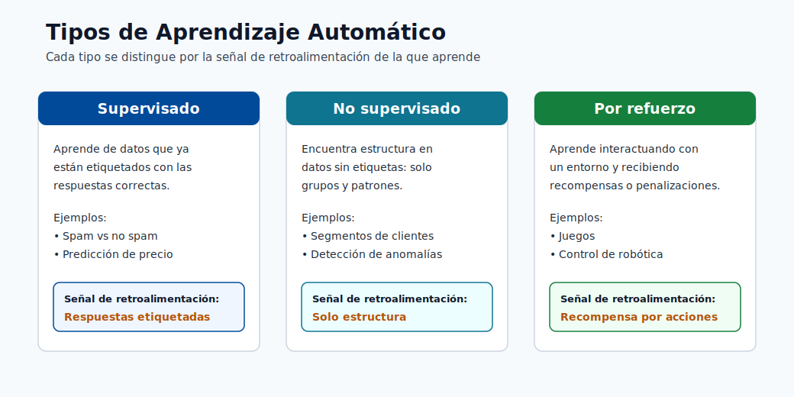
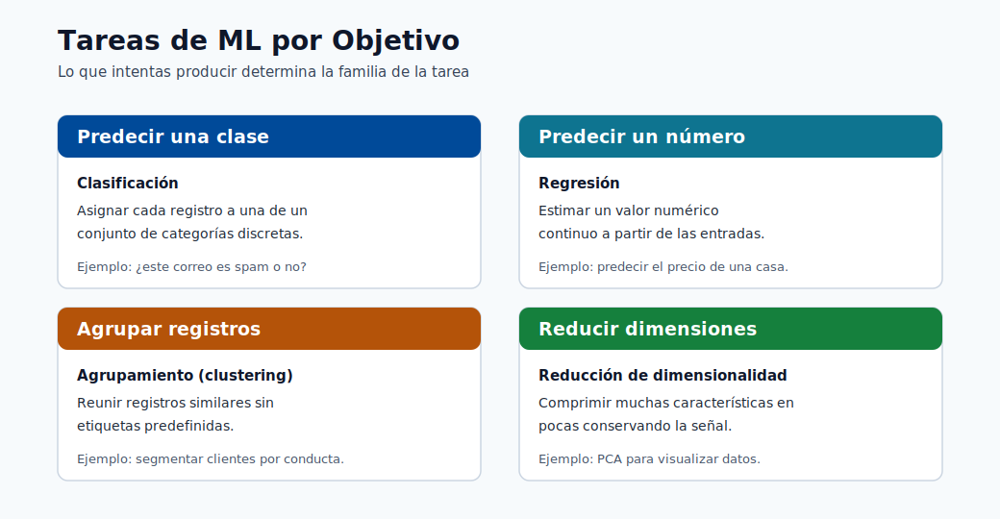

# Fundamentos del ML

Este módulo construye la base matemática y conceptual necesaria para todos los módulos posteriores.  
Comienza desde los primeros principios y luego avanza hacia las familias de modelos y la lógica de selección.

## Familias de aprendizaje fundamentales

- Aprendizaje supervisado: clasificación y regresión
- Aprendizaje no supervisado: agrupamiento y asociación
- Aprendizaje por refuerzo: aprendizaje de políticas a partir de recompensas

Familias modernas adicionales usadas en producción:

- Aprendizaje semisupervisado: combinar un pequeño conjunto etiquetado con un gran conjunto sin etiquetar.
- Aprendizaje autosupervisado: crear señales de supervisión a partir de los propios datos.
- Aprendizaje en línea: actualizar los modelos de forma continua a partir de datos en streaming/nuevos.

Qué recordar:

- El supervisado aprende a partir de respuestas conocidas.
- El no supervisado descubre estructura sin etiquetas.
- El de refuerzo aprende a través de la interacción y la recompensa.

> **Nota - Qué muestra esto:** Las principales familias de aprendizaje una al lado de la otra. El eje distintivo es la *señal de retroalimentación*:
> respuestas etiquetadas (supervisado), solo estructura (no supervisado) o recompensa por interacción
> (refuerzo). Identificar qué señal proporcionan tus datos es el primer paso para elegir un
> enfoque.

> **Nota - Qué muestra esto:** Las tareas de ML organizadas por *objetivo* (predecir una clase, predecir un número, agrupar registros, reducir
> dimensiones). Asigna tu pregunta de negocio a uno de estos objetivos antes de elegir un algoritmo:
> el objetivo restringe tanto la familia del modelo como la métrica de evaluación.

## Tipos de problemas

- Supervisado: clasificación y regresión
- No supervisado: agrupamiento y asociación
- Refuerzo: control y optimización de políticas

## Conceptos básicos de datos y notación

- Conjunto de datos: $D = (x_i, y_i)_{i=1}^{N}$ para el aprendizaje supervisado.
- Vector de características: $x_i \in \mathbb{R}^{d}$.
- Objetivo/etiqueta: $y_i$.
- Modelo: $f_{\theta}(x)$ con parámetros $\theta$.

## Categorías de aprendizaje supervisado

| Categoría                    | Tipo de salida               | Ejemplos                               | Métricas típicas               |
| ---------------------------- | ---------------------------- | -------------------------------------- | ------------------------------ |
| Clasificación binaria        | Clase 0/1                    | Fraude sí/no, fuga de clientes sí/no   | Precisión, Exhaustividad, F1, AUC |
| Clasificación multiclase     | Una de $K$ clases            | Categoría de producto, clase de diagnóstico | Macro-F1, exactitud, log loss |
| Clasificación multietiqueta  | Múltiples clases por muestra | Etiquetar documentos/temas             | Micro-F1, pérdida de Hamming   |
| Regresión                    | Valor continuo               | Precio, demanda, latencia              | MAE, RMSE, $R^2$               |
| Pronóstico de series temporales | Valores futuros a lo largo del tiempo | Ventas, energía, tráfico    | MAPE, RMSE, sMAPE              |

### Intuición de clasificación vs regresión

- La clasificación predice qué clase.
- La regresión predice cuánto.

El mismo conjunto de características puede admitir ambas según el objetivo de negocio.

## Categorías de aprendizaje no supervisado

| Categoría                      | Propósito                                       | Métodos típicos                          |
| ------------------------------ | ----------------------------------------------- | ---------------------------------------- |
| Agrupamiento                   | Agrupar observaciones similares                 | K-Means, DBSCAN, agrupamiento jerárquico |
| Reducción de dimensionalidad   | Comprimir características conservando la estructura | PCA, UMAP, autoencoders             |
| Minería de asociación          | Encontrar reglas de coocurrencia                | Apriori, FP-growth                       |
| Detección de anomalías         | Detectar patrones raros/anormales               | Isolation Forest, One-Class SVM          |

## Semisupervisado y autosupervisado

- El semisupervisado es útil cuando las etiquetas son costosas. Ejemplo: tienes 1,000 imágenes médicas etiquetadas y 50,000 sin etiquetar. Un enfoque semisupervisado entrena sobre ambas, propagando etiquetas a partir de predicciones con confianza.
- El autosupervisado es común en los modelos fundacionales (GPT, BERT, CLIP) y en los pipelines de preentrenamiento. El modelo se entrena sobre una tarea proxy cuyas etiquetas provienen de los propios datos, por ejemplo predecir la siguiente palabra o reconstruir un parche enmascarado.
- Ambos reducen la dependencia del etiquetado manual, que es costoso y lento a gran escala.

| Enfoque         | Requisito de etiquetas          | Algoritmos comunes                         |
| --------------- | ------------------------------- | ------------------------------------------ |
| Supervisado     | Todas las muestras etiquetadas  | Regresión logística, XGBoost, NN           |
| Semisupervisado | Pequeña fracción etiquetada     | Propagación de etiquetas, pseudoetiquetado |
| Autosupervisado | No se necesitan etiquetas       | Autoencoders enmascarados, aprendizaje contrastivo |

## Componentes del aprendizaje por refuerzo

El RL normalmente se modela como un Proceso de Decisión de Markov (MDP):

$$  
(\mathcal{S},\mathcal{A},P,R,\gamma)  
$$

donde:

- $\mathcal{S}$: conjunto de estados
- $\mathcal{A}$: conjunto de acciones
- $P$: dinámica de transición
- $R$: función de recompensa
- $\gamma$: factor de descuento

Concepto de función de valor:

$$  
V^{\pi}(s)=\mathbb{E}_{\pi}\left[\sum_{t=0}^{\infty}\gamma^t r_t\mid s_0=s\right]  
$$

Objetivo:

$$  
\max_{\pi}\mathbb{E}_{\pi}\left[\sum_{t=0}^{\infty}\gamma^t r_t\right]  
$$

Objetivo supervisado:

$$  
\min_{\theta} \frac{1}{N}\sum_{i=1}^{N}\mathcal{L}(f_{\theta}(x_i), y_i)  
$$

Esto es la minimización del riesgo empírico: encontrar los parámetros que minimizan la pérdida promedio de entrenamiento.

Funciones de pérdida comunes:

$$  
\mathcal{L}_{MSE}=\frac{1}{N}\sum_{i=1}^{N}(y_i-\hat{y}_i)^2  
$$

$$  
\mathcal{L}_{BCE}=-\frac{1}{N}\sum_{i=1}^{N}\left[y_i\log(\hat{p}_i)+(1-y_i)\log(1-\hat{p}_i)\right]  
$$

Entropía cruzada multiclase:

$$  
\mathcal{L}_{CE}=-\frac{1}{N}\sum_{i=1}^{N}\sum_{k=1}^{K}y_{ik}\log(\hat{p}_{ik})  
$$

Objetivo de optimización con regularización:

$$  
\min_{\theta}\frac{1}{N}\sum_{i=1}^{N}\mathcal{L}(f_{\theta}(x_i),y_i)+\lambda R(\theta)  
$$

Actualización por descenso de gradiente:

$$  
\theta_{t+1}=\theta_t-\eta\nabla_{\theta}\mathcal{L}  
$$

Regularización:

$$  
\min_{\theta}\frac{1}{N}\sum_{i=1}^{N}\mathcal{L}(f_{\theta}(x_i),y_i)+\lambda R(\theta)  
$$

Opciones comunes:

- Regularización L1: $R(\theta)=\lVert\theta\rVert_1$ (dispersión, selección de características)
- Regularización L2: $R(\theta)=\lVert\theta\rVert_2^2$ (contracción de pesos, estabilidad)

## Sobreajuste y generalización

- El error de entrenamiento puede disminuir mientras el error de prueba aumenta (sobreajuste).
- Usa la separación entrenamiento/validación/prueba y validación cruzada.
- Prefiere modelos más simples cuando el rendimiento es comparable.

Tamaños de división prácticos (regla general):

| División    | Proporción típica | Propósito                                            |
| ----------- | ----------------- | ---------------------------------------------------- |
| Entrenamiento | 60-80%          | Ajustar los parámetros del modelo                    |
| Validación  | 10-20%            | Ajustar hiperparámetros y comparar modelos           |
| Prueba      | 10-20%            | Evaluación final sin sesgo antes del despliegue      |

El conjunto de prueba **nunca** debe usarse durante la selección del modelo. Usarlo para la selección es una forma de fuga de datos que hace que las puntuaciones offline sean demasiado optimistas.

Validación cruzada: cuando los datos son limitados, la validación cruzada k-fold usa todos los datos para tanto entrenamiento como validación rotando los pliegues. K=5 o K=10 es típico.

## Intuición del sesgo-varianza

> **Nota - Cómo leer este gráfico:** A medida que la complejidad crece, el **sesgo al cuadrado** cae (el modelo puede ajustarse más) mientras que la **varianza** sube
> (el modelo reacciona más a la muestra de entrenamiento particular). Su suma, el error total, es una U
> minimizada en una complejidad intermedia. A la izquierda del mínimo hay subajuste; a la derecha, sobreajuste. El piso de la curva nunca llega a cero debido al ruido irreducible $\sigma^2$.

- Alto sesgo: modelo demasiado simple, subajusta. Síntoma: baja exactitud de entrenamiento y baja exactitud de prueba.
- Alta varianza: modelo demasiado complejo, sobreajusta. Síntoma: alta exactitud de entrenamiento, exactitud de prueba mucho menor.

El error de prueba esperado se descompone como:

$$  
\mathbb{E}[(y-\hat{f}(x))^2] = \text{Sesgo}^2 + \text{Varianza} + \sigma^2  
$$

donde $\sigma^2$ es el ruido irreducible.

## Cómo elegir un tipo de ML rápidamente

| Si tu pregunta es...                                   | Usa...                          |
| ------------------------------------------------------ | ------------------------------- |
| ¿Puedo predecir este objetivo conocido?                | Aprendizaje supervisado         |
| ¿Puedo agrupar registros similares sin etiquetas?      | Aprendizaje no supervisado      |
| ¿Puede un agente aprender mediante interacción y recompensa? | Aprendizaje por refuerzo   |
| Tengo pocas etiquetas pero muchos datos sin etiquetar  | Aprendizaje semisupervisado     |

## Errores típicos a evitar

- Usar solo la exactitud en conjuntos de datos muy desequilibrados.
- Mezclar datos de entrenamiento/prueba durante el preprocesamiento (fuga de datos).
- Ignorar el drift de conceptos tras el despliegue.
- Tratar la puntuación del modelo como el único KPI sin validación del impacto de negocio.

## Análisis a fondo: cada concepto, explicado

Esta sección desglosa la notación y los objetivos anteriores para que cada símbolo tenga un significado claro  
y una razón de existir.

### Leyendo la configuración supervisada $D = (x_i, y_i)_{i=1}^{N}$

- $N$ es el número de ejemplos de entrenamiento. Más ejemplos reducen la **varianza** porque  
el promedio empírico es una estimación más ajustada de la expectativa verdadera.
- $x_i \in \mathbb{R}^{d}$ es un **vector de características**: una fila de $d$ números que describe un ejemplo.  
La dimensión $d$ es el *tamaño del espacio de características*; un $d$ alto con $N$ pequeño es la clásica  
"maldición de la dimensionalidad", donde los datos se vuelven dispersos y las distancias pierden significado.
- $y_i$ es la **etiqueta**. Su tipo decide la tarea: discreto → clasificación, continuo →  
regresión, ordenado en el tiempo → pronóstico.
- $f_\theta$ es el **modelo**: una función parametrizada. $\theta$ son los **parámetros**  
(pesos) que el optimizador ajusta. Todo lo que estableces *antes* del entrenamiento (profundidad del árbol, tasa de  
aprendizaje, fuerza de regularización) es un **hiperparámetro**, ajustado en datos de validación, no aprendido.

### Minimización del riesgo empírico (ERM), paso a paso

El objetivo $\min_\theta \frac{1}{N}\sum_i \mathcal{L}(f_\theta(x_i), y_i)$ dice:  
"elige parámetros que hagan el error promedio en los datos de entrenamiento lo más pequeño posible."

- $\mathcal{L}$ es la **función de pérdida**: puntúa qué tan equivocada es una única predicción.
- El $\frac{1}{N}\sum$ convierte las pérdidas por ejemplo en un **promedio** (el *riesgo empírico*),  
que es nuestro sustituto computable del verdadero riesgo esperado sobre $P(X,Y)$.
- La ERM solo funciona si la muestra de entrenamiento se parece a los datos de producción. Cuando no lo hace, el bajo  
riesgo de entrenamiento no implica bajo riesgo en el mundo real: exactamente por eso apartamos datos de prueba.

### Por qué cada función de pérdida tiene la forma que tiene

- **MSE** $\frac{1}{N}\sum (y_i-\hat y_i)^2$ cuadra los errores, de modo que los errores grandes dominan. Es  
la pérdida de máxima verosimilitud cuando el ruido es gaussiano, por eso se empareja con la regresión.
- **Entropía cruzada binaria (BCE)** $-\frac{1}{N}\sum [y\log\hat p + (1-y)\log(1-\hat p)]$  
mide la *sorpresa* de la etiqueta verdadera bajo la probabilidad predicha. Explota cuando  
el modelo está equivocado con confianza ($\hat p \to 0$ mientras $y=1$), lo que desalienta fuertemente  
el exceso de confianza. Es la pérdida de máxima verosimilitud para un objetivo de Bernoulli.
- La **entropía cruzada categórica** generaliza la BCE a $K$ clases sumando la sorpresa sobre la  
etiqueta one-hot $y_{ik}$.

### Descenso de gradiente: qué controla cada símbolo

La actualización $\theta_{t+1} = \theta_t - \eta\nabla_\theta\mathcal{L}$ es el motor del ML.

- $\nabla_\theta\mathcal{L}$ es el **gradiente**: la dirección de mayor *aumento* de la  
pérdida. Moverse en la dirección *negativa* del gradiente reduce la pérdida.
- $\eta$ es la **tasa de aprendizaje** (tamaño del paso). Demasiado grande → el optimizador sobrepasa y  
diverge; demasiado pequeño → el entrenamiento es lento y puede estancarse en regiones planas. En la práctica es el  
único hiperparámetro más importante a ajustar.
- Las variantes importan operacionalmente: el GD **por lotes** usa todos los datos por paso (estable, lento);  
el GD **estocástico** usa un ejemplo (ruidoso, rápido); el GD de **mini-lotes** (el estándar) equilibra  
ambos y es lo que usan los frameworks de aprendizaje profundo.

### Regularización L1 vs L2: geometría y efecto

La regularización añade una penalización $\lambda R(\theta)$ para desalentar los modelos complejos:

- **L1** ($\lVert\theta\rVert_1$) tiene esquinas en su región de restricción, por lo que el óptimo a menudo  
cae exactamente en un eje → algunos pesos se vuelven **exactamente cero** → selección automática de características  
y modelos dispersos.
- **L2** ($\lVert\theta\rVert_2^2$) encoge todos los pesos suavemente hacia cero sin forzar  
ninguno a desaparecer → soluciones más estables y mejor condicionadas.
- $\lambda$ es la **fuerza de regularización**: mayor $\lambda$ → modelo más simple → más sesgo,  
menos varianza. Se ajusta en datos de validación, nunca en el conjunto de prueba.

### Descomposición sesgo-varianza, en términos sencillos

$\mathbb{E}[(y-\hat f(x))^2] = \text{Sesgo}^2 + \text{Varianza} + \sigma^2$ divide el  
error esperado de un modelo en tres fuentes:

- **Sesgo**: error por suposiciones incorrectas (modelo demasiado simple para capturar el patrón). El alto sesgo  
se muestra como *baja* exactitud tanto de entrenamiento como de prueba (subajuste).
- **Varianza**: error por sensibilidad a la muestra de entrenamiento particular. La alta varianza se muestra  
como una gran brecha entre alta exactitud de entrenamiento y menor exactitud de prueba (sobreajuste).
- $\sigma^2$: **ruido irreducible** en las etiquetas mismas. Ningún modelo puede superar este piso; está  
determinado por la calidad de los datos, no por la elección del algoritmo.

El arte del modelado es moverse a lo largo de este compromiso: añadir capacidad para reducir el sesgo, añadir datos  
o regularización para reducir la varianza, hasta que la *suma* se minimice.

### Validación cruzada y por qué el conjunto de prueba es sagrado

- La **validación cruzada k-fold** rota qué pliegue se aparta, de modo que cada ejemplo se usa para tanto  
entrenamiento como validación entre pliegues. La puntuación promediada es una estimación de menor varianza de la  
generalización que una única división, esencial cuando los datos son escasos.
- El **conjunto de prueba** se toca exactamente una vez, al final. Cualquier decisión (elección de modelo,  
umbral, hiperparámetro) influenciada por el rendimiento de prueba filtra información y hace que la puntuación  
reportada tenga un sesgo optimista, una forma sutil pero común de **fuga de datos**.

### Poniéndolo todo junto: diagnosticar subajuste vs sobreajuste

La teoría se vuelve práctica cuando puedes leer una curva de aprendizaje. Traza el error de entrenamiento y validación
mientras aumentas la capacidad del modelo (o el tiempo de entrenamiento), y la brecha entre las dos curvas
te dice exactamente qué hacer a continuación:

| Lo que observas | Diagnóstico | Qué hacer |
|---|---|---|
| Error de entrenamiento alto, error de validación alto (cercanos entre sí) | Subajuste (alto sesgo) | Añadir capacidad: modelo más rico, más características, menos regularización, entrenar más tiempo |
| Error de entrenamiento bajo, error de validación mucho mayor (gran brecha) | Sobreajuste (alta varianza) | Reducir varianza: más datos, regularización más fuerte, modelo más simple, parada temprana |
| Errores de entrenamiento y validación ambos bajos y cercanos | Buen ajuste | Detener; este es el punto óptimo de la curva sesgo-varianza |
| Ambos errores estancados por encima de un umbral aceptable | Ruido irreducible o problemas de etiqueta | Mejorar la calidad de datos/etiquetas; ningún algoritmo puede superar el piso $\sigma^2$ |

> **Consejo - Lee la brecha, no el número absoluto:** La *distancia* entre el error de entrenamiento y de validación
> diagnostica el problema. Una brecha pequeña significa un problema de sesgo (añadir capacidad); una brecha grande significa
> un problema de varianza (añadir datos o regularización). Este único hábito guía la mayor parte de la depuración de modelos.

### Un ejemplo concreto de sesgo-varianza

Imagina ajustar una curva a puntos ruidosos muestreados de una suave onda:

- Una **línea recta** (polinomio de grado 1) no puede doblarse para seguir la onda: está equivocada de la misma
  manera sin importar qué muestra extraigas. Eso es **alto sesgo, baja varianza**.
- Un **polinomio de grado 15** serpentea a través de cada punto, incluido el ruido. Extrae una nueva muestra
  y serpentea de manera completamente diferente. Eso es **bajo sesgo, alta varianza**.
- Un **polinomio de grado 3** captura la forma de la onda mientras ignora el ruido. Es estable
  entre muestras y preciso: el mínimo de la curva de error total.

La regularización, más datos y los métodos de ensamble son simplemente herramientas que te permiten usar un modelo flexible
(bajo sesgo) mientras dominas su oscilación (controlando la varianza).

## Verificación rápida

| # | Pregunta | Respuesta |
|---|----------|-----------|
| 1 | Dado un vector de características $x_i \in \mathbb{R}^d$ y etiqueta $y_i$, ¿cómo determinas si la tarea es clasificación, regresión o pronóstico? | Observa el objetivo: una etiqueta categórica discreta indica clasificación, un valor real continuo indica regresión, y un valor indexado por tiempo futuro (una serie ordenada en el tiempo) indica pronóstico. |
| 2 | ¿Por qué la entropía cruzada binaria penaliza tan fuertemente una predicción incorrecta con confianza? | La pérdida para la clase verdadera es $-\log \hat{p}$; cuando la probabilidad asignada a la clase correcta tiende a 0, $-\log \hat{p} \to \infty$, por lo que una predicción incorrecta con alta confianza incurre en una penalización no acotada. |
| 3 | ¿Cuál es la diferencia práctica entre la regularización L1 y L2 sobre los pesos aprendidos? | L1 ($\lVert\theta\rVert_1$) lleva muchos pesos exactamente a cero, dando dispersión y selección de características; L2 ($\lVert\theta\rVert_2^2$) contrae todos los pesos suavemente hacia cero para dar estabilidad sin volverlos exactamente cero. |
| 4 | Ves 99% de exactitud de entrenamiento y 74% de exactitud de validación. ¿Qué parte del compromiso sesgo-varianza es el problema, y cuáles son dos soluciones? | La gran brecha indica alta varianza (sobreajuste); las soluciones incluyen añadir regularización o reducir la complejidad del modelo, y recolectar más datos de entrenamiento (también detención temprana o dropout). |
| 5 | ¿Por qué el conjunto de prueba debe usarse solo una vez, y cómo se llama cuando se viola esto? | Reutilizarlo para la selección de modelos filtra información y sesga las puntuaciones de forma optimista; esto es fuga de datos (data leakage), un sobreajuste al conjunto de prueba. |

---

## Aprendizaje en línea y streaming

### Definición formal

En el **aprendizaje por lotes** el modelo se entrena una vez sobre un conjunto de datos fijo $D = (x_i, y_i)_{i=1}^N$ y luego se despliega. En el **aprendizaje en línea** el modelo se actualiza continuamente a medida que llega cada nuevo ejemplo $(x_t, y_t)$, sin almacenar el historial completo. La regla de actualización en el tiempo $t$ es:

$$
\theta_{t+1} = \theta_t - \eta \nabla_\theta \mathcal{L}(f_{\theta_t}(x_t), y_t)
$$

Esto es descenso de gradiente estocástico con un tamaño de lote de 1: el aprendizaje en línea es simplemente SGD aplicado en el caso más extremo.

### Cuándo falla el entrenamiento por lotes

El reentrenamiento por lotes tiene una limitación fundamental: requiere recopilar un nuevo conjunto de datos, reentrenar desde cero (o ajustar finamente), revalidar y redesplegar. Este ciclo suele durar horas o días. En dominios donde el mundo cambia más rápido que este ciclo, los modelos por lotes se degradan silenciosamente:

- **Mercados financieros**: las distribuciones de precios cambian durante el día; un modelo entrenado con los datos de ayer puede estar ya desactualizado.
- **Sistemas de recomendación**: los intereses de los usuarios evolucionan continuamente; las recomendaciones desactualizadas pierden compromiso.
- **Detección de intrusiones**: los atacantes adaptan sus patrones más rápido que los ciclos de reentrenamiento periódico.
- **Lenguaje y contenido de tendencia**: los temas emergen y desaparecen en horas.

### SGD como aprendiz en línea

El mini-lote SGD puede aplicarse en modo en línea tratando cada micro-lote entrante como un paso de entrenamiento. La propiedad clave del SGD que lo hace adecuado para entornos en línea es que no requiere ver el conjunto de datos completo para progresar: cada paso solo necesita una pequeña estimación del gradiente local.

El **arrepentimiento** de un algoritmo de aprendizaje en línea a lo largo de $T$ rondas es:

$$
\text{Arrepentimiento}(T) = \sum_{t=1}^T \mathcal{L}(f_{\theta_t}(x_t), y_t) - \min_\theta \sum_{t=1}^T \mathcal{L}(f_\theta(x_t), y_t)
$$

Un buen aprendiz en línea logra **arrepentimiento sublineal**: $\text{Arrepentimiento}(T) = o(T)$, lo que significa que converge en promedio al mejor modelo fijo en retrospectiva. El descenso de gradiente en línea logra arrepentimiento $O(\sqrt{T})$ bajo suposiciones estándar.

### Vowpal Wabbit y la biblioteca river

**Vowpal Wabbit (VW)** es un sistema de aprendizaje en línea a escala industrial desarrollado en Yahoo/Microsoft Research. Sus opciones de diseño reflejan las demandas del ML en streaming:

- Pasa cada ejemplo solo una vez por la memoria (modo en línea verdadero).
- Usa un truco de hashing para manejar espacios de características dispersos y de dimensión extremadamente alta sin almacenar un diccionario de características.
- Admite bandits contextuales, reducciones y aprendizaje activo de forma nativa.
- Rendimiento típico: decenas de millones de ejemplos por segundo en un solo núcleo.

La biblioteca **river** de Python proporciona una API moderna compatible con scikit-learn para el aprendizaje en línea, admitiendo versiones incrementales de árboles de decisión, Naive Bayes, regresión, agrupamiento y detección de drift. Es la opción estándar para pipelines de streaming construidos en Python.

### Ejemplos reales

| Dominio | Por qué aprendizaje en línea | Modelo |
|---------|------------------------------|--------|
| Predicción de tasa de clics | Miles de millones de impresiones de anuncios al día; el desempeño del modelo tiene costo directo de ingresos | Regresión logística en línea (VW) |
| Detección de anomalías de red | Las nuevas firmas de ataque aparecen más rápido que los ciclos de reentrenamiento | LSTM adaptativo, RRCF |
| Puntuación de fraude en tiempo real | Los patrones de fraude en tarjetas evolucionan en horas tras un nuevo vector de ataque | Gradient boosting en línea |
| Detección de temas de tendencia | Los temas tienen una vida útil de horas; el vocabulario por lotes siempre está desactualizado | LDA en streaming, embeddings en línea |

> **Nota - Aprendizaje en línea vs continuo:** El aprendizaje en línea actualiza en un stream en orden. El aprendizaje continuo (de por vida) también se ocupa de cómo añadir nuevas tareas sin olvidar las anteriores, un problema relacionado pero distinto llamado olvido catastrófico.

---

## Bandit multibrazo y la exploración-explotación

### El dilema exploración-explotación

Un **bandit multibrazo** (MAB) modela la situación donde debes elegir repetidamente una de $K$ opciones (brazos), cada una con una recompensa estocástica, con el objetivo de maximizar la recompensa acumulada. La tensión central es:

- **Explotación**: elegir el brazo con la mayor recompensa media estimada hasta ahora.
- **Exploración**: probar brazos menos probados porque sus medias verdaderas pueden ser más altas.

La explotación codiciosa ignora opciones potencialmente mejores. La exploración pura desperdicia intentos en brazos ya conocidos como pobres. Los buenos algoritmos equilibran ambas.

### Epsilon-codicioso

La política más simple: con probabilidad $\epsilon$ elegir un brazo aleatorio (explorar); con probabilidad $1 - \epsilon$ elegir el mejor brazo conocido (explotar).

$$
a_t = \begin{cases} \text{brazo aleatorio} & \text{con probabilidad } \epsilon \\ \arg\max_k \hat{\mu}_k & \text{con probabilidad } 1-\epsilon \end{cases}
$$

donde $\hat{\mu}_k$ es la recompensa media empírica actual del brazo $k$. A pesar de su simplicidad, el epsilon-codicioso con $\epsilon$ decayendo con el tiempo logra arrepentimiento $O(\log T)$.

### Cota de confianza superior (UCB)

Los algoritmos UCB eligen el brazo que maximiza la suma de la media estimada y una **bonificación de incertidumbre**:

$$
a_t = \arg\max_k \left[ \hat{\mu}_k + \sqrt{\frac{2 \ln t}{n_k}} \right]
$$

donde $n_k$ es el número de veces que el brazo $k$ ha sido elegido y $t$ es el número total de rondas. La bonificación $\sqrt{2 \ln t / n_k}$ es grande para los brazos raramente elegidos y se reduce a medida que $n_k$ crece. UCB1 logra arrepentimiento $O(\log T)$ con una constante más ajustada que el epsilon-codicioso.

### Muestreo de Thompson

El muestreo de Thompson adopta un enfoque bayesiano. Mantiene una distribución posterior sobre la recompensa media de cada brazo. En cada paso, **muestra** una estimación de recompensa de la posterior de cada brazo y elige el brazo con la muestra más alta:

$$
\tilde{\mu}_k \sim \text{Posterior}(\mu_k \mid \text{observaciones})
$$
$$
a_t = \arg\max_k \tilde{\mu}_k
$$

Para recompensas de Bernoulli, la posterior conjugada natural es una distribución Beta. El muestreo de Thompson iguala o supera a UCB empíricamente y es la opción dominante en los sistemas de bandit de producción modernos.

### Diferencia con el aprendizaje por refuerzo completo

| Aspecto | Bandit multibrazo | RL completo |
|---------|-------------------|-------------|
| Estado | Sin estado (o estado único) | Espacio de estados completo $\mathcal{S}$ |
| Consecuencia de la acción | Solo recompensa; sin transición de estado | La acción cambia el estado; afecta el futuro |
| Asignación de crédito | Inmediata | Retardada a lo largo de trayectorias |
| Complejidad | Baja; tratable analíticamente | Alta; requiere funciones de valor o gradiente de política |

Los bandits son la herramienta adecuada cuando las decisiones son independientes: cada elección no afecta el contexto para la siguiente elección. El RL completo es necesario cuando las acciones tienen consecuencias duraderas sobre el entorno.

### Pruebas A/B vs bandits

Las **pruebas A/B** clásicas dividen el tráfico 50/50 entre control y tratamiento durante una duración fija, luego eligen al ganador. Esto es estadísticamente riguroso pero ineficiente: durante todo el experimento, la mitad del tráfico está expuesto a la variante potencialmente inferior.

Un **bandit** reasigna continuamente el tráfico hacia la variante de mejor rendimiento a medida que se acumula la evidencia. Esto reduce el costo de oportunidad de la exploración. Sin embargo, los resultados del bandit son más difíciles de interpretar bajo los marcos clásicos de prueba de hipótesis nulas porque la regla de parada es adaptativa.

> **Consejo - Cuándo usar bandits vs pruebas A/B:** Usa pruebas A/B cuando el rigor estadístico y la inferencia causal limpia importan (por ejemplo, presentaciones regulatorias, grandes decisiones organizacionales). Usa bandits cuando minimizar el arrepentimiento durante el período de experimento es la preocupación principal (por ejemplo, optimización de UI web, clasificación de contenido personalizado, selección de anuncios en tiempo real).

---

## Aprendizaje por transferencia y adaptación de dominio

### Configuración formal

Sea el **dominio fuente** $\mathcal{S}$ compuesto por un espacio de características $\mathcal{X}_S$, distribución marginal $P_S(X)$ y tarea $\mathcal{T}_S$. Sea el **dominio objetivo** $\mathcal{T}$ definido análogamente con subíndice $T$. El aprendizaje por transferencia es útil cuando $\mathcal{X}_S = \mathcal{X}_T$ pero $P_S(X) \neq P_T(X)$, o cuando $\mathcal{T}_S \neq \mathcal{T}_T$, y los datos etiquetados en el dominio objetivo son escasos.

La idea central es que las representaciones aprendidas en el dominio fuente (por ejemplo, bordes de bajo nivel en clasificación de imágenes, patrones sintácticos en NLP) son reutilizables en el dominio objetivo incluso cuando la tarea específica difiere.

### Cambio de covariables

El **cambio de covariables** es la forma más común de desajuste de dominio: $P_S(X) \neq P_T(X)$ mientras $P(Y \mid X)$ permanece igual. El modelo aprendido sobre los datos fuente puede funcionar mal en los datos objetivo no porque la función de etiquetado haya cambiado, sino porque la distribución de entrada cambió.

Enfoques de corrección:

- **Ponderación por importancia**: reponderar los ejemplos fuente por $\frac{P_T(x)}{P_S(x)}$ durante el entrenamiento para que los ejemplos fuente que se parecen a la distribución objetivo sean enfatizados.
- **Entrenamiento adversarial de dominio**: añadir un discriminador que intente distinguir ejemplos fuente de objetivo; el extractor de características se entrena para engañar al discriminador (DANN: Red Neuronal Adversarial de Dominio).

### Mecánica del ajuste fino

El flujo de trabajo estándar de aprendizaje por transferencia para redes profundas:

1. **Preentrenar** un modelo grande $f_\theta$ en un gran conjunto de datos fuente (por ejemplo, ImageNet para visión, grandes corpus de texto para NLP).
2. **Reemplazar** la cabeza específica de la tarea (capa final) con una nueva cabeza que coincida con la tarea objetivo.
3. **Congelar** las capas tempranas (que capturan características universales de bajo nivel) y ajustar finamente solo las capas posteriores y la nueva cabeza en el conjunto de datos objetivo.
4. Opcionalmente **descongelar** todas las capas y ajustar finamente con una tasa de aprendizaje muy pequeña si hay suficientes datos objetivo disponibles.

El programa de tasa de aprendizaje para el ajuste fino típicamente usa **decaimiento de tasa de aprendizaje por capas**: tasas de aprendizaje más bajas para las capas tempranas (cuyas características deben cambiar poco) y tasas más altas para las capas posteriores y la nueva cabeza.

### Por qué las características preentrenadas se transfieren

En visión, las capas tempranas de las CNN aprenden detectores de bordes tipo Gabor y manchas de color que son universales en todos los dominios de imagen: aparecen independientemente de si la red fue entrenada con gatos, coches o radiografías. Solo las capas más profundas y más específicas de la tarea se especializan en la tarea fuente. Esta jerarquía de abstracción es lo que hace posible el aprendizaje por transferencia: las características de bajo nivel de propósito general son gratuitas para reutilizar.

En NLP, los modelos de lenguaje preentrenados (BERT, GPT) aprenden representaciones sintácticas y semánticas sobre corpus masivos. El ajuste fino reutiliza estas representaciones para tareas posteriores (clasificación, NER, QA) con tan solo cientos de ejemplos etiquetados, porque el modelo ya "entiende" la estructura del lenguaje.

> **Nota - Cuándo falla el aprendizaje por transferencia:** El aprendizaje por transferencia se degrada cuando los dominios fuente y objetivo son demasiado disímiles (por ejemplo, ajustar finamente un modelo de imágenes naturales sobre imágenes térmicas de satélite). En estos casos, las características del dominio fuente no solo son inútiles, sino que pueden dañar activamente el entrenamiento mediante transferencia negativa. La solución es usar menos capas congeladas o entrenar desde cero en el dominio objetivo si hay suficientes datos disponibles.

---

## Inferencia causal vs correlación

### La correlación no implica causalidad

Un modelo que encuentra una asociación estadística entre $X$ e $Y$ no te dice que cambiar $X$ cambiará $Y$. Esta distinción es crítica en entornos donde el objetivo no es la predicción sino la **intervención**: decidir qué acción tomar.

Ilustración clásica: las ventas de helado están correlacionadas con las tasas de ahogamiento. Un modelo que predice el ahogamiento a partir de las ventas de helado sería preciso pero completamente inútil para la intervención. El modelo correcto es $\text{temperatura} \to \text{ventas de helado}$ y $\text{temperatura} \to \text{natación}$, donde la temperatura es un **confusor**.

### La paradoja de Simpson

La paradoja de Simpson es una demostración concreta de por qué las correlaciones agregadas pueden ser engañosas:

| Grupo | Tasa de éxito del tratamiento A | Tasa de éxito del tratamiento B |
|-------|--------------------------------|--------------------------------|
| Cálculos pequeños | 93% (81/87) | 87% (234/270) |
| Cálculos grandes | 73% (192/263) | 69% (55/80) |
| **Total** | **78% (273/350)** | **83% (289/350)** |

El tratamiento B parece mejor en general, pero el tratamiento A es mejor en **ambos** subgrupos. La inversión ocurre porque los cálculos grandes (casos más difíciles) fueron asignados con más frecuencia al tratamiento A. El confusor, el tamaño del cálculo, invierte la conclusión.

Un modelo de ML entrenado sobre los datos agregados aprendería el patrón engañoso. Sin análisis causal, recomendaría el tratamiento B y causaría daño.

### Datos observacionales vs experimentales

- **Datos experimentales** (ensayos controlados aleatorios, pruebas A/B): el tratamiento se asigna aleatoriamente, por lo que los confusores están equilibrados entre grupos por diseño. Las afirmaciones causales son válidas.
- **Datos observacionales**: el tratamiento se asigna en función de factores que también pueden afectar el resultado. Las afirmaciones causales requieren suposiciones adicionales.

La mayoría de los datos de entrenamiento de ML son observacionales. Un modelo de fuga entrenado en asignaciones históricas de ofertas de retención reflejará la política (sesgada) de la empresa de a quién ofrecer descuentos, no el efecto causal de los descuentos sobre la retención.

### El marco de resultados potenciales

El **modelo causal de Rubin** define el efecto causal del tratamiento $T$ sobre la unidad $i$ en términos de **resultados potenciales**:

$$
\text{EIT}_i = Y_i(T=1) - Y_i(T=0)
$$

El problema fundamental de la inferencia causal es que solo un resultado potencial es observado para cada unidad: no puedes tratar y no tratar a la misma persona simultáneamente. El **efecto promedio del tratamiento (EPT)** es:

$$
\text{EPT} = \mathbb{E}[Y(T=1) - Y(T=0)]
$$

La estimación del EPT a partir de datos observacionales requiere suposiciones sobre qué confusores han sido medidos (**ignorabilidad/no confusión**). Los métodos incluyen:

- **Emparejamiento por puntuación de propensión**: emparejar unidades tratadas y de control con probabilidades similares de tratamiento.
- **Variables instrumentales**: explotar una variable que afecta el tratamiento pero no el resultado directamente.
- **Double ML / bosques causales**: usar ML para eliminar la confusión, luego estimar el efecto del tratamiento en una segunda etapa.

### Cuándo el ML no es suficiente

El ML predictivo puro optimiza $P(Y \mid X)$: la asociación entre entradas y salidas. No puede responder preguntas de la forma "¿qué pasaría si interviniéramos y estableciéramos $X = x$?" (consultas de intervención) o "¿qué habría pasado si $X$ hubiera sido diferente?" (consultas contrafactuales). Estas requieren un modelo causal.

> **Nota - Implicación práctica:** Cuando el objetivo de un proyecto de ML es apoyar una decisión de intervención (ejecutar una promoción, cambiar un tratamiento, modificar una política), incorpora el razonamiento causal desde el principio. Un modelo puramente predictivo puede seleccionar el tratamiento incorrecto o reforzar los sesgos de selección existentes, llevando a peores resultados que ningún modelo en absoluto.

---

## El teorema No Free Lunch

### Enunciado

El **teorema No Free Lunch (NFL)** (Wolpert y Macready, 1997) establece que promediado sobre todas las distribuciones de problemas posibles, cada algoritmo de optimización funciona igualmente bien. Más precisamente: para dos algoritmos cualesquiera $A_1$ y $A_2$, existe una familia de problemas para la que $A_1$ supera a $A_2$ y otra familia para la que $A_2$ supera a $A_1$, y estas familias son igualmente grandes.

Formalmente, si promediamos la pérdida esperada sobre todas las funciones objetivo posibles $f: \mathcal{X} \to \mathcal{Y}$:

$$
\sum_f \mathcal{L}(A_1, f) = \sum_f \mathcal{L}(A_2, f)
$$

Ningún algoritmo es universalmente mejor que cualquier otro cuando se evalúa en todos los problemas posibles.

### Por qué esto no es pesimista en la práctica

El teorema NFL se aplica a una distribución uniforme sobre todas las funciones posibles, incluido el ruido aleatorio y las funciones adversariales patológicas que nunca aparecen en la práctica. Los problemas de ML del mundo real no se extraen de esta distribución uniforme: tienen **estructura** (fronteras de decisión suaves, localidad, composicionalidad) que ciertas familias de algoritmos explotan mejor que otras.

La implicación práctica es:

- No existe un único algoritmo que gane en cada conjunto de datos real (esto se verifica empíricamente en benchmarks como OpenML-CC18).
- La elección del algoritmo debe estar informada por el **conocimiento del dominio** y el **sesgo inductivo**: tu creencia previa sobre qué tipo de función estás aproximando.
- Los árboles de gradient boosting tienden a dominar en datos tabulares estructurados; las CNN dominan en datos espaciales 2D; los transformers dominan en datos de secuencias. Estas son regularidades empíricas sobre la estructura de dominios específicos.

### Implicaciones para la selección y evaluación de modelos

- **Siempre comparar contra líneas de base**: un nuevo algoritmo solo es significativo si supera a las alternativas más simples en tu problema específico, no en general.
- **El protocolo de evaluación determina la validez**: un resultado de selección de modelos es válido solo si se realizó en datos con la misma distribución que el contexto de despliegue.
- **El conocimiento del dominio es una ventaja competitiva**: los equipos que pueden codificar suposiciones estructurales (mediante elección de arquitectura, ingeniería de características o diseño de pérdida) obtienen un almuerzo gratis que el teorema NFL no prohíbe: solo descarta los almuerzos gratis *sin* suposiciones.

> **Consejo - NFL y AutoML:** Por eso los sistemas de AutoML buscan en un espacio de algoritmos en lugar de predeterminar uno. Azure AutoML evalúa docenas de combinaciones de algoritmos-hiperparámetros precisamente porque ninguna elección única domina en todos los conjuntos de datos. El teorema NFL es la justificación matemática para la búsqueda de algoritmos.

---

## Complejidad computacional del ML

Comprender el costo computacional de los algoritmos de ML es esencial para producción: un algoritmo teóricamente excelente que no escala no es desplegable.

### Complejidad de entrenamiento

| Algoritmo | Complejidad de entrenamiento | Variables clave |
|-----------|------------------------------|-----------------|
| Regresión lineal / logística (GD) | $O(N \cdot d \cdot T)$ | $N$ = muestras, $d$ = características, $T$ = iteraciones |
| Árbol de decisión (CART) | $O(N \cdot d \cdot \log N)$ por árbol | Costo de ordenación en cada nodo |
| Random forest ($B$ árboles) | $O(B \cdot N \cdot d' \cdot \log N)$ | $d' = \sqrt{d}$ características por división |
| Árboles de gradient boosting ($B$ rondas) | $O(B \cdot N \cdot d \cdot \log N)$ | Secuencial; más difícil de paralelizar que RF |
| $k$ vecinos más cercanos | $O(1)$ entrenamiento (aprendiz perezoso) | Todo el costo en el momento de la predicción |
| Red neuronal (SGD, $T$ pasos) | $O(T \cdot b \cdot P)$ | $b$ = tamaño de lote, $P$ = parámetros |
| SVM (kernel) | $O(N^2 d)$ a $O(N^3)$ | Programa cuadrático sobre vectores de soporte |

### Complejidad de predicción

| Algoritmo | Complejidad de predicción por consulta | Notas |
|-----------|----------------------------------------|-------|
| Modelo lineal | $O(d)$ | Producto punto; favorable para caché; el más rápido |
| Árbol de decisión / RF | $O(d \cdot \log N)$ por árbol; $O(B \cdot d \cdot \log N)$ para el bosque | Profundidad del recorrido del árbol $\approx \log N$ |
| $k$-NN (exacto) | $O(N \cdot d)$ | Debe calcular la distancia a cada punto de entrenamiento |
| $k$-NN (ANN) | $O(d \log N)$ | Vecino más cercano aproximado (FAISS, HNSW) |
| Red neuronal | $O(P)$ | Pase hacia adelante a través de todos los $P$ parámetros |

El costo de predicción $O(Nd)$ del $k$-NN es el hecho de complejidad más importante para conocer para el despliegue en producción: un $k$-NN con $N = 10^7$ puntos de entrenamiento y $d = 512$ características requiere $5 \times 10^9$ operaciones de punto flotante por consulta, alrededor de 5 segundos en una CPU, completamente inútil para servicio en tiempo real sin indexación aproximada.

### Por qué la complejidad importa para producción

- **Por lotes vs tiempo real**: un modelo con costo de predicción $O(N^2)$ puede servir puntuación offline en lotes pero no puede atender solicitudes en tiempo real.
- **Huella de memoria**: el $k$-NN requiere almacenar todos los $N$ vectores de entrenamiento en memoria. Para $N = 10^8$ y $d = 256$ características float32: $N \cdot d \cdot 4$ bytes $= 100$ GB, superando la RAM de un solo servidor.
- **Leyes de escala**: el costo de entrenamiento de la red neuronal escala con el número de parámetros $P$ y la cantidad de datos $N$. Duplicar ambos aproximadamente duplica el costo, por eso el entrenamiento de modelos grandes requiere cómputo distribuido.
- **Maldición de la dimensión de características**: para los modelos de árbol, añadir características aumenta el costo linealmente. Para $k$-NN, añadir características degrada tanto la complejidad temporal como la eficiencia estadística.

> **Nota - Regla general práctica:** Para el servicio sensible a la latencia, los modelos lineales y los árboles poco profundos son el predeterminado a menos que los requisitos de exactitud exijan otra cosa. Para la puntuación offline en lotes, el gradient boosting y las redes neuronales son aceptables. Para la recuperación a escala (búsquedas $k$-NN sobre grandes corpus), los índices de vecinos más cercanos aproximados (FAISS, ScaNN, Azure Cognitive Search vector) son obligatorios.

---

## Adiciones al análisis a fondo

### Derivación de la descomposición sesgo-varianza

Derivamos el error cuadrático esperado de un modelo $\hat{f}$ entrenado en un conjunto de datos $D$ muestreado de una distribución donde $y = f(x) + \epsilon$, con $\epsilon \sim (0, \sigma^2)$ (ruido de media cero independiente de $x$).

**Configuración.** Fija un punto de prueba $x$. La predicción esperada es:

$$
\bar{f}(x) = \mathbb{E}_D[\hat{f}(x)]
$$

el promedio de predicciones a través de todos los posibles conjuntos de entrenamiento $D$ de tamaño $N$. Queremos calcular:

$$
\mathbb{E}_D\!\left[\mathbb{E}_\epsilon\big[(y - \hat{f}(x))^2\big]\right]
$$

**Paso 1.** Expandir el error cuadrático sumando y restando $\bar{f}(x)$:

$$
(y - \hat{f}(x))^2 = \big[(y - \bar{f}(x)) + (\bar{f}(x) - \hat{f}(x))\big]^2
$$

$$
= (y - \bar{f}(x))^2 + 2(y - \bar{f}(x))(\bar{f}(x) - \hat{f}(x)) + (\bar{f}(x) - \hat{f}(x))^2
$$

**Paso 2.** Tomar la expectativa sobre $D$. El término cruzado del medio:

$$
\mathbb{E}_D\big[2(y - \bar{f}(x))(\bar{f}(x) - \hat{f}(x))\big] = 2(y - \bar{f}(x)) \cdot \underbrace{\mathbb{E}_D[\bar{f}(x) - \hat{f}(x)]}_{= 0}
$$

porque $\bar{f}(x) = \mathbb{E}_D[\hat{f}(x)]$ por definición. Entonces:

$$
\mathbb{E}_D\big[(y - \hat{f}(x))^2\big] = (y - \bar{f}(x))^2 + \mathbb{E}_D\big[(\bar{f}(x) - \hat{f}(x))^2\big]
$$

**Paso 3.** Ahora tomar la expectativa sobre $\epsilon$. Expandir $y - \bar{f}(x) = (f(x) - \bar{f}(x)) + \epsilon$:

$$
\mathbb{E}_\epsilon\big[(y - \bar{f}(x))^2\big] = (f(x) - \bar{f}(x))^2 + \sigma^2
$$

**Paso 4.** Combinar:

$$
\mathbb{E}\big[(y - \hat{f}(x))^2\big] = \underbrace{(f(x) - \bar{f}(x))^2}_{\text{Sesgo}^2} + \underbrace{\mathbb{E}_D\big[(\hat{f}(x) - \bar{f}(x))^2\big]}_{\text{Varianza}} + \underbrace{\sigma^2}_{\text{Ruido irreducible}}
$$

**Interpretación de cada término:**

- **Sesgo$^2$** $= (f(x) - \bar{f}(x))^2$: la diferencia al cuadrado entre la función verdadera y la predicción promedio a través de todos los conjuntos de entrenamiento. Un modelo lineal ajustando una relación cuadrática siempre tiene sesgo no nulo independientemente de cuántos datos añadas.
- **Varianza** $= \mathbb{E}_D[(\hat{f}(x) - \bar{f}(x))^2]$: cuánto fluctúa la predicción del modelo alrededor de su propia media a medida que varía el conjunto de entrenamiento. Un polinomio de grado 15 entrenado en 20 puntos tiene una varianza enorme: oscila salvajemente dependiendo de qué 20 puntos fueron seleccionados.
- **$\sigma^2$**: el ruido irreducible en las etiquetas. Ningún modelo, independientemente de la complejidad, puede superar este piso: representa la aleatoriedad genuina en el proceso generador de datos.

> **Nota - Completitud algebraica:** Cada paso anterior usó solo tres hechos: la linealidad de la expectativa, la definición de varianza como $\mathbb{E}[(Z - \mathbb{E}[Z])^2]$, y la independencia del ruido $\epsilon$ de $D$ y $x$. No se requirió ninguna suposición distribucional más allá del ruido de media cero $\epsilon$ con varianza finita $\sigma^2$.

### Por qué la entropía cruzada es la pérdida correcta para la clasificación

#### Configuración: estimación de máxima verosimilitud

Supongamos que tenemos $N$ ejemplos de entrenamiento $\{(x_i, y_i)\}_{i=1}^N$ donde $y_i \in \{1, \ldots, K\}$. Nuestro modelo $f_\theta$ produce una distribución de probabilidad sobre las clases mediante softmax:

$$
\hat{p}_{ik} = \frac{e^{z_{ik}}}{\sum_{j=1}^K e^{z_{ij}}}
$$

donde $z_{ik}$ es el $k$-ésimo logit para el ejemplo $i$.

#### La verosimilitud de los datos de entrenamiento

Asumiendo que los ejemplos son i.i.d. de $P(Y \mid X)$, la verosimilitud de observar todo el conjunto de entrenamiento es:

$$
\mathcal{L}(\theta) = \prod_{i=1}^N P(Y = y_i \mid X = x_i;\, \theta) = \prod_{i=1}^N \hat{p}_{i,y_i}
$$

Cada factor es la probabilidad que el modelo asignó a la clase verdadera del ejemplo $i$.

#### Log-verosimilitud

Tomando el logaritmo (que es monótono, por lo que maximizar la log-verosimilitud = maximizar la verosimilitud):

$$
\log \mathcal{L}(\theta) = \sum_{i=1}^N \log \hat{p}_{i,y_i}
$$

#### Equivalencia con minimizar la entropía cruzada

**Minimizar** la (log-verosimilitud negativa) sobre $\theta$ equivale a **maximizar** la log-verosimilitud:

$$
\min_\theta -\frac{1}{N}\sum_{i=1}^N \log \hat{p}_{i,y_i}
$$

Escribiendo $y_i$ en forma one-hot: $y_{ik} = \mathbf{1}[y_i = k]$. Entonces $\log \hat{p}_{i,y_i} = \sum_k y_{ik} \log \hat{p}_{ik}$, y:

$$
\min_\theta -\frac{1}{N}\sum_{i=1}^N \sum_{k=1}^K y_{ik} \log \hat{p}_{ik}
$$

Esto es exactamente la **pérdida de entropía cruzada categórica** $\mathcal{L}_{CE}$. Hemos demostrado que:

$$
\boxed{\text{Minimizar la entropía cruzada} = \text{Maximizar la log-verosimilitud de las etiquetas de entrenamiento}}
$$

#### Por qué otras pérdidas son subóptimas para la clasificación

- **MSE sobre probabilidades** $\frac{1}{N}\sum_i (\hat{p}_{i,y_i} - 1)^2$: el gradiente es lineal en el error $(\hat{p} - 1)$. Cuando el modelo está equivocado con confianza ($\hat{p} \approx 0$), el gradiente es cercano a $(-1)^2 = 1$, una señal pequeña. El gradiente de la entropía cruzada es $(\hat{p} - 1)/\hat{p}$, que es grande y negativo cuando $\hat{p}$ es pequeño, dando una señal de aprendizaje mucho más fuerte precisamente cuando el modelo está más equivocado.
- **Pérdida hinge** (SVM): maximiza el margen en lugar de la verosimilitud. Está motivada geométricamente y no produce probabilidades calibradas.
- La **entropía cruzada** produce salidas de probabilidad calibradas (con un parámetro de temperatura o escalado de Platt), lo que es esencial para los sistemas de decisión posteriores que necesitan actuar sobre la confianza del modelo.

> **Consejo - Caso binario:** Para la clasificación binaria con $K=2$, la entropía cruzada categórica se reduce a la **entropía cruzada binaria**: $\mathcal{L}_{BCE} = -\frac{1}{N}\sum_i [y_i \log \hat{p}_i + (1-y_i)\log(1-\hat{p}_i)]$, que es la pérdida MLE para una variable aleatoria de Bernoulli. Las dos formulaciones son lo mismo expresado de forma diferente.

---

## Verificación rápida (ampliada)

| # | Pregunta | Respuesta |
|---|----------|-----------|
| 1 | Dado un vector de características $x_i \in \mathbb{R}^d$ y etiqueta $y_i$, ¿cómo determinas si la tarea es clasificación, regresión o pronóstico? | Observa el objetivo: una etiqueta categórica discreta indica clasificación, un valor real continuo indica regresión, y un valor indexado por tiempo futuro (una serie ordenada en el tiempo) indica pronóstico. |
| 2 | ¿Por qué la entropía cruzada binaria penaliza tan fuertemente una predicción incorrecta con confianza? | La pérdida para la clase verdadera es $-\log \hat{p}$; cuando la probabilidad asignada a la clase correcta tiende a 0, $-\log \hat{p} \to \infty$, por lo que una predicción incorrecta con alta confianza incurre en una penalización no acotada. |
| 3 | ¿Cuál es la diferencia práctica entre la regularización L1 y L2 sobre los pesos aprendidos? | L1 ($\lVert\theta\rVert_1$) lleva muchos pesos exactamente a cero, dando dispersión y selección de características; L2 ($\lVert\theta\rVert_2^2$) contrae todos los pesos suavemente hacia cero para dar estabilidad sin volverlos exactamente cero. |
| 4 | Ves 99% de exactitud de entrenamiento y 74% de exactitud de validación. ¿Qué parte del compromiso sesgo-varianza es el problema, y cuáles son dos soluciones? | La gran brecha indica alta varianza (sobreajuste); las soluciones incluyen añadir regularización o reducir la complejidad del modelo, y recolectar más datos de entrenamiento (también detención temprana o dropout). |
| 5 | ¿Por qué el conjunto de prueba debe usarse solo una vez, y cómo se llama cuando se viola esto? | Reutilizarlo para la selección de modelos filtra información y sesga las puntuaciones de forma optimista; esto es fuga de datos (data leakage), un sobreajuste al conjunto de prueba. |
| 6 | ¿Cuál es la definición formal del arrepentimiento en el aprendizaje en línea, y qué significa arrepentimiento sublineal? | El arrepentimiento es la pérdida acumulada del aprendiz en $T$ rondas menos la pérdida del mejor modelo fijo en retrospectiva; el arrepentimiento sublineal, $\text{Regret}(T) = o(T)$, significa que el arrepentimiento promedio por ronda tiende a cero, por lo que converge a ese mejor modelo fijo. |
| 7 | Explica la política de exploración epsilon-codicioso. ¿Cuál es la principal debilidad de un $\epsilon$ fijo? | Con probabilidad $\epsilon$ elige un brazo aleatorio (explorar) y con probabilidad $1-\epsilon$ el mejor brazo conocido (explotar); un $\epsilon$ fijo sigue explorando a una tasa constante para siempre, desperdiciando tiradas en brazos inferiores, por lo que $\epsilon$ debería decaer con el tiempo. |
| 8 | En la derivación de la descomposición sesgo-varianza, ¿por qué el término cruzado $\mathbb{E}_D[\bar{f}(x) - \hat{f}(x)]$ es igual a cero? | Porque $\bar{f}(x) = \mathbb{E}_D[\hat{f}(x)]$ por definición, así que $\mathbb{E}_D[\bar{f}(x) - \hat{f}(x)] = \bar{f}(x) - \bar{f}(x) = 0$. |
| 9 | Enuncia el teorema No Free Lunch con tus propias palabras. ¿Significa que no tiene sentido comparar algoritmos? ¿Por qué o por qué no? | Promediado sobre todos los problemas posibles, todo algoritmo rinde igual de bien. No hace inútil la comparación: los problemas reales son un subconjunto estructurado y no uniforme, así que ajustar el sesgo inductivo del modelo al problema sigue importando. |
| 10 | Un modelo $k$-NN con $N = 10^6$ y $d = 256$ está desplegado para puntuación en tiempo real. Estima el número de operaciones de punto flotante por consulta y explica por qué esto es un problema. | Alrededor de $N \cdot d \approx 2.56 \times 10^8$ FLOPs por consulta, ya que cada punto de entrenamiento se recorre en el momento de la predicción; esta latencia es demasiado alta para servir en tiempo real sin indexación aproximada de vecinos más cercanos. |
