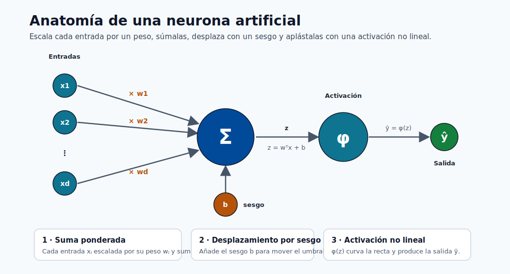
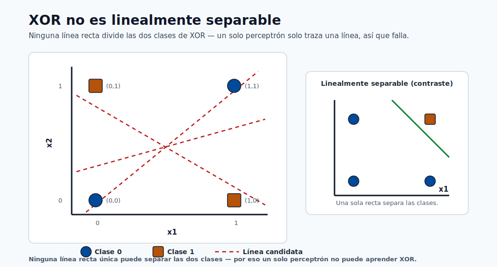
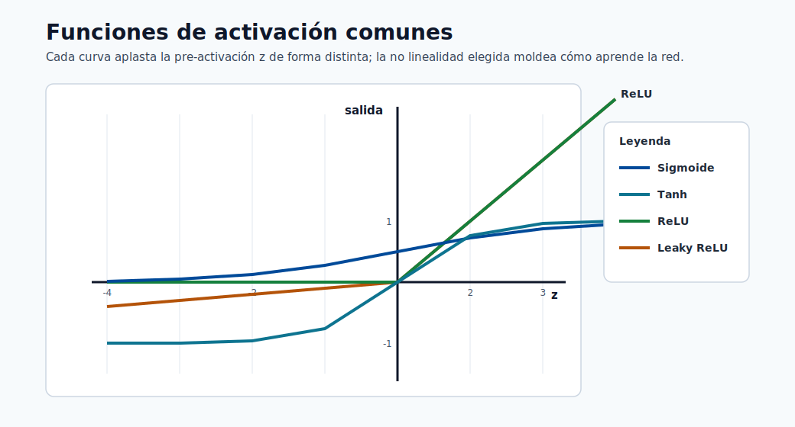

# Redes Neuronales y Aprendizaje Profundo

Las redes neuronales son aproximadores universales de funciones inspirados vagamente en las
neuronas biológicas. Durante la última década se han convertido en el paradigma dominante para
imágenes, voz, texto y cada vez más para datos tabulares a escala. Este módulo construye el
tema completo desde el perceptrón simple — inventado en 1957 — hasta la arquitectura Transformer
que impulsa los modelos de base modernos, con derivaciones matemáticas completas a lo largo de
todo el recorrido.

---

## Objetivos de aprendizaje

Al finalizar este módulo serás capaz de:

1. Derivar la regla de aprendizaje del perceptrón desde primeros principios y explicar su limitación con XOR.
2. Definir el perceptrón multicapa (MLP) y realizar un paso hacia adelante con números reales.
3. Derivar la retropropagación mediante la regla de la cadena y escribir las ecuaciones de actualización de pesos para cada capa.
4. Explicar los gradientes que desaparecen y los que explotan, y describir al menos cuatro estrategias de mitigación.
5. Describir el abandono (dropout), la normalización por lotes, la inicialización de pesos y la programación de la tasa de aprendizaje.
6. Explicar la operación de convolución e identificar el papel de cada bloque constructivo en una CNN.
7. Describir el mecanismo de compuertas de la LSTM y explicar por qué resuelve el problema de asignación de crédito a largo plazo.
8. Derivar la fórmula de atención de producto punto escalado y explicar la atención multi-cabeza.
9. Describir el codificador y decodificador del Transformer y explicar las estrategias de preentrenamiento (BERT, GPT).
10. Configurar y lanzar un trabajo de entrenamiento de PyTorch en un clúster de GPU usando Azure ML SDK v2.

---

## De la biología a las matemáticas: la analogía de la neurona

Una neurona biológica recibe señales electroquímicas a través de las dendritas, las acumula
en el cuerpo celular (soma) y dispara un potencial de acción a través del axón si la señal
acumulada supera un umbral. La señal viaja a través de uniones sinápticas hasta las neuronas
aguas abajo.

El modelo artificial reduce esto a tres operaciones:

1. **Suma ponderada** — cada valor entrante $x_j$ se multiplica por un peso sináptico $w_j$.
2. **Desplazamiento por sesgo** — un escalar de sesgo $b$ mueve el umbral de activación.
3. **Activación no lineal** — una función $\phi$ decide si la neurona dispara y con qué intensidad.

Formalmente, para una única neurona artificial:

$$z = \sum_{j=1}^{d} w_j x_j + b = \mathbf{w}^\top \mathbf{x} + b$$

$$\hat{y} = \phi(z)$$

El vector $\mathbf{x} \in \mathbb{R}^d$ es la entrada, $\mathbf{w} \in \mathbb{R}^d$ el vector de pesos, $b \in \mathbb{R}$ el
sesgo, y $\phi$ la función de activación. Todo en el aprendizaje profundo está construido sobre
la aplicación repetida de este patrón.



> **Nota - Cómo leer la neurona:** Las entradas fluyen de izquierda a derecha — cada una se escala por un peso, se suma en Σ, se desplaza con el sesgo b para formar z, y luego pasa por φ para producir ŷ.

> **Nota - Por qué la analogía es imperfecta:** Las neuronas reales se comunican mediante
> temporización de disparos, no valores continuos; tienen miles de compartimentos dendríticos;
> y la plasticidad hebbiana es mucho más compleja que el descenso de gradiente. La metáfora
> biológica es motivacional, no mecanicista. Concéntrate en las matemáticas.

---

## El Perceptrón (1957)

El perceptrón de Frank Rosenblatt (1957) es la primera neurona artificial entrenable.
Utiliza una función de activación escalonada:

$$\hat{y} = \begin{cases} 1 & \text{si } \mathbf{w}^\top \mathbf{x} + b \geq 0 \\ 0 & \text{en caso contrario} \end{cases}$$

El perceptrón puede aprender cualquier problema de clasificación binaria **linealmente separable**;
es decir, uno en el que un único hiperplano $\mathbf{w}^\top \mathbf{x} + b = 0$ separa las dos clases
en el espacio de entrada.

**La limitación XOR.** La función XOR lógica no es linealmente separable:

| $x_1$ | $x_2$ | XOR |
|-------|-------|-----|
| 0     | 0     | 0   |
| 0     | 1     | 1   |
| 1     | 0     | 1   |
| 1     | 1     | 0   |

Ninguna línea única en 2D puede separar las dos salidas de 1 de las dos salidas de 0.



> **Nota - Por qué XOR rompe el perceptrón:** Las dos clases se ubican en diagonales opuestas, así que cualquier frontera recta única clasifica mal al menos un punto.

Esta limitación, señalada por Minsky y Papert en 1969, detuvo temporalmente la investigación
en redes neuronales hasta que las redes multicapa con activaciones no lineales fueron estudiadas
en los años 1980.

### Regla de aprendizaje del perceptrón

Dado un ejemplo de entrenamiento $(\mathbf{x}, y)$ donde $y \in \{0, 1\}$, la actualización de
pesos es:

$$\mathbf{w} \leftarrow \mathbf{w} + \eta \,(y - \hat{y})\,\mathbf{x}$$
$$b \leftarrow b + \eta\,(y - \hat{y})$$

donde $\eta > 0$ es la tasa de aprendizaje. Cuando la predicción es correcta ($\hat{y} = y$),
la actualización es cero. Cuando la predicción es incorrecta, los pesos se desplazan en la
dirección de $\mathbf{x}$ (para un falso negativo) u opuesta (para un falso positivo), con una
magnitud proporcional a $\eta$.

**Ejemplo resuelto — compuerta AND con 2 entradas.**

Inicializar: $w_1 = 0,\; w_2 = 0,\; b = 0,\; \eta = 1$.

Datos de entrenamiento (AND): $(0,0)\to 0$, $(0,1)\to 0$, $(1,0)\to 0$, $(1,1)\to 1$.

*Época 1, ejemplo $(1,1)\to 1$:*
- $z = 0 \cdot 1 + 0 \cdot 1 + 0 = 0 \Rightarrow \hat{y} = 0$  (incorrecto, $y=1$)
- $w_1 \leftarrow 0 + 1 \cdot (1-0) \cdot 1 = 1$
- $w_2 \leftarrow 0 + 1 \cdot (1-0) \cdot 1 = 1$
- $b   \leftarrow 0 + 1 \cdot (1-0) = 1$

*A continuación, ejemplo $(0,1)\to 0$:*
- $z = 1 \cdot 0 + 1 \cdot 1 + 1 = 2 \Rightarrow \hat{y} = 1$ (incorrecto, $y=0$)
- $w_1 \leftarrow 1 + 1\cdot(0-1)\cdot 0 = 1$
- $w_2 \leftarrow 1 + 1\cdot(0-1)\cdot 1 = 0$
- $b   \leftarrow 1 + 1\cdot(0-1) = 0$

Esto continúa hasta que los cuatro ejemplos se clasifican correctamente.
El teorema de convergencia del perceptrón garantiza convergencia en un número finito de pasos
para cualquier conjunto de datos linealmente separable.

> **Nota - Garantía de convergencia:** El teorema de convergencia del perceptrón establece: si
> los datos son linealmente separables con margen $\gamma > 0$ y todas las entradas satisfacen
> $\|\mathbf{x}\| \leq R$, entonces el número de errores está acotado por $(R/\gamma)^2$. No existe
> tal garantía para datos no separables.

---

## El Perceptrón Multicapa (MLP)

### Arquitectura

Un MLP apila múltiples capas de neuronas. Denota el número de capas como $L$ (excluyendo la
entrada). Notación estándar:

- $a^{(0)} = \mathbf{x}$: la entrada sin procesar (capa 0).
- $a^{(l)} \in \mathbb{R}^{n_l}$: vector de activación en la capa $l$, donde $n_l$ es el ancho.
- $W^{(l)} \in \mathbb{R}^{n_l \times n_{l-1}}$: matriz de pesos para la capa $l$.
- $b^{(l)} \in \mathbb{R}^{n_l}$: vector de sesgos para la capa $l$.
- $z^{(l)} = W^{(l)} a^{(l-1)} + b^{(l)}$: pre-activación (combinación lineal).
- $a^{(l)} = \phi\!\left(z^{(l)}\right)$: post-activación.

La capa final $a^{(L)}$ es la salida de la red $\hat{\mathbf{y}}$.

**Profundidad vs ancho.** Una red *profunda* tiene muchas capas (gran $L$); una red *ancha* tiene
muchas neuronas por capa (gran $n_l$). La profundidad permite aprender representaciones de
características jerárquicas: las capas tempranas aprenden patrones simples, las posteriores los
combinan. El ancho proporciona capacidad dentro de una capa. Empíricamente, la profundidad importa
más que el ancho para funciones complejas como la clasificación de imágenes, aunque las redes
muy anchas tienen propiedades teóricas interesantes (régimen del núcleo tangente neuronal).

### Funciones de activación

Sin funciones de activación no lineales, cualquier composición de transformaciones lineales
colapsa a una única transformación lineal — sin importar cuántas capas apiles:

$$W^{(L)}\!\left(W^{(L-1)}\!\cdots\!\left(W^{(1)}\mathbf{x} + b^{(1)}\right)\!\cdots\right) + b^{(L)} = \tilde{W}\mathbf{x} + \tilde{b}$$

La no linealidad es lo que le otorga fuerza al Teorema de Aproximación Universal.

| Función | Fórmula | Rango | Notas |
|---|---|---|---|
| Sigmoide | $\sigma(z) = \frac{1}{1+e^{-z}}$ | $(0,1)$ | Se satura; gradiente que desaparece |
| Tanh | $\tanh(z) = \frac{e^z - e^{-z}}{e^z + e^{-z}}$ | $(-1,1)$ | Centrado en cero; igual se satura |
| ReLU | $\max(0, z)$ | $[0, \infty)$ | Disperso; rápido; riesgo de neurona muerta |
| Leaky ReLU | $\max(\alpha z, z),\;\alpha \ll 1$ | $(-\infty,\infty)$ | Corrige neuronas muertas |
| GELU | $z \,\Phi(z)$ donde $\Phi$ es la FDA Normal | $\approx(-0.17,\infty)$ | Usado en BERT, GPT |
| Softmax | $\sigma(\mathbf{z})_k = \frac{e^{z_k}}{\sum_j e^{z_j}}$ | $(0,1)$, suma 1 | Capa de salida, multiclase |



> **Nota - La forma importa:** Sigmoide y Tanh se saturan en los extremos (gradientes que desaparecen), mientras que ReLU y Leaky ReLU permanecen lineales para z positivo, manteniendo vivos los gradientes.

**Por qué domina ReLU.** Para $z > 0$, $\frac{d}{dz}\text{ReLU}(z) = 1$, por lo que el gradiente
no se satura para pre-activaciones positivas. Esto hace que el entrenamiento de redes profundas
sea dramáticamente más rápido. La desventaja es el problema de la "neurona ReLU muerta": si la
pre-activación de una neurona es permanentemente negativa (p. ej., debido a un sesgo muy
negativo), su gradiente es exactamente cero y deja de aprender. Leaky ReLU y Parametric ReLU
abordan esto permitiendo una pequeña pendiente para $z < 0$.

**Gradiente que desaparece con sigmoide.** La derivada de la sigmoide es $\sigma'(z) = \sigma(z)(1-\sigma(z))$,
con un máximo de $0.25$ en $z=0$ y aproximándose a cero para $|z|$ grande. Durante la
retropropagación a través de $L$ capas, cada una multiplicando por $\leq 0.25$, los gradientes
se reducen por un factor de como máximo $(0.25)^L$: para $L = 10$ capas esto es $\approx 10^{-6}$.

### Paso hacia adelante

El paso hacia adelante completo para una red con $L$ capas:

$$z^{(l)} = W^{(l)} a^{(l-1)} + b^{(l)}, \quad l = 1, \ldots, L$$
$$a^{(l)} = \phi\!\left(z^{(l)}\right), \quad l = 1, \ldots, L-1$$
$$\hat{\mathbf{y}} = a^{(L)} = \phi_{\text{sal}}\!\left(z^{(L)}\right)$$

donde $\phi_{\text{sal}}$ es la activación de salida (softmax para multiclase, sigmoide para
binaria, identidad para regresión).

**Ejemplo numérico resuelto de 2 capas.**

Red: 2 entradas → 2 neuronas ocultas (ReLU) → 1 salida (sigmoide).

$$W^{(1)} = \begin{pmatrix} 0.5 & -0.3 \\ 0.1 & 0.8 \end{pmatrix}, \quad b^{(1)} = \begin{pmatrix} 0.1 \\ -0.2 \end{pmatrix}$$
$$W^{(2)} = \begin{pmatrix} 0.6 & -0.4 \end{pmatrix}, \quad b^{(2)} = (0.05)$$

Entrada: $\mathbf{x} = (1.0,\; 0.5)^\top$, etiqueta verdadera $y = 1$.

*Pre-activación de la capa 1:*
$$z^{(1)} = \begin{pmatrix} 0.5\cdot1 + (-0.3)\cdot0.5 + 0.1 \\ 0.1\cdot1 + 0.8\cdot0.5 + (-0.2) \end{pmatrix} = \begin{pmatrix} 0.45 \\ 0.30 \end{pmatrix}$$

*Activación de la capa 1 (ReLU):* $a^{(1)} = (0.45,\; 0.30)^\top$ (ambos positivos, sin cambios).

*Pre-activación de la capa 2:*
$$z^{(2)} = 0.6\cdot0.45 + (-0.4)\cdot0.30 + 0.05 = 0.27 - 0.12 + 0.05 = 0.20$$

*Salida:* $\hat{y} = \sigma(0.20) = \frac{1}{1+e^{-0.20}} \approx 0.550$.

Pérdida de entropía cruzada binaria: $\mathcal{L} = -\ln(0.550) \approx 0.598$.

---

## Retropropagación: el algoritmo que entrena las redes

La retropropagación (Rumelhart, Hinton, Williams 1986) es simplemente una aplicación eficiente
de la **regla de la cadena del cálculo** para calcular $\frac{\partial \mathcal{L}}{\partial W^{(l)}}$ y
$\frac{\partial \mathcal{L}}{\partial b^{(l)}}$ para cada capa $l$ simultáneamente, reutilizando
resultados intermedios en lugar de recalcularlos.

### La regla de la cadena revisada

Para una pérdida escalar $\mathcal{L}$ que depende de $W^{(l)}$ a través de la cadena
$W^{(l)} \to z^{(l)} \to a^{(l)} \to \cdots \to \mathcal{L}$, la regla de la cadena da:

$$\frac{\partial \mathcal{L}}{\partial W^{(l)}} = \frac{\partial \mathcal{L}}{\partial z^{(l)}} \cdot \frac{\partial z^{(l)}}{\partial W^{(l)}}$$

Define la **señal de error** (delta) en la capa $l$:

$$\delta^{(l)} \triangleq \frac{\partial \mathcal{L}}{\partial z^{(l)}} \in \mathbb{R}^{n_l}$$

Dado que $z^{(l)} = W^{(l)} a^{(l-1)} + b^{(l)}$, tenemos $\frac{\partial z^{(l)}}{\partial W^{(l)}} = a^{(l-1)}$,
por lo que el gradiente de los pesos es el producto externo:

$$\frac{\partial \mathcal{L}}{\partial W^{(l)}} = \delta^{(l)} \left(a^{(l-1)}\right)^\top$$

### Derivación paso a paso de la retropropagación

**Delta de la capa de salida** (para entropía cruzada binaria con salida sigmoide):

$$\mathcal{L} = -y \ln \hat{y} - (1-y)\ln(1-\hat{y}), \quad \hat{y} = \sigma(z^{(L)})$$

$$\delta^{(L)} = \hat{y} - y$$

Este resultado limpio surge porque la sigmoide y la entropía cruzada binaria son pares conjugados.

**Delta de la capa oculta** (propagando hacia atrás):

$$\delta^{(l)} = \left(W^{(l+1)}\right)^\top \delta^{(l+1)} \odot \phi'\!\left(z^{(l)}\right)$$

donde $\odot$ denota multiplicación elemento a elemento y $\phi'(z^{(l)})$ es la derivada
elemento a elemento de la función de activación evaluada en las pre-activaciones de la capa $l$.

**Gradientes de pesos y sesgos:**

$$\frac{\partial \mathcal{L}}{\partial W^{(l)}} = \delta^{(l)} \left(a^{(l-1)}\right)^\top, \qquad \frac{\partial \mathcal{L}}{\partial b^{(l)}} = \delta^{(l)}$$

**Actualización de descenso de gradiente:**

$$W^{(l)} \leftarrow W^{(l)} - \eta \,\frac{\partial \mathcal{L}}{\partial W^{(l)}}, \qquad b^{(l)} \leftarrow b^{(l)} - \eta \,\frac{\partial \mathcal{L}}{\partial b^{(l)}}$$

**Pseudocódigo del algoritmo completo:**

```
paso hacia adelante:
  a[0] = x
  for l = 1 to L:
    z[l] = W[l] @ a[l-1] + b[l]
    a[l] = activation(z[l])   # softmax en la capa de salida

calcular pérdida L = loss_fn(a[L], y)

paso hacia atrás:
  delta[L] = a[L] - y          # para entropía cruzada + softmax/sigmoide
  for l = L-1 down to 1:
    delta[l] = (W[l+1].T @ delta[l+1]) * activation_derivative(z[l])

actualización:
  for l = 1 to L:
    W[l] -= lr * outer(delta[l], a[l-1])
    b[l] -= lr * delta[l]
```

> **Nota - Diferenciación automática:** Los marcos modernos (PyTorch, JAX, TensorFlow) implementan
> la retropropagación mediante diferenciación automática (autograd), que construye un grafo
> computacional y aplica la regla de la cadena simbólicamente. Nunca escribes la retropropagación
> a mano; comprender las matemáticas te dice qué calcula el marco.

### Gradientes que desaparecen y que explotan

Durante la retropropagación a través de $L$ capas, las señales delta se multiplican repetidamente
por matrices de pesos y derivadas de activación. Surgen dos modos de fallo:

**Gradientes que desaparecen** — si las derivadas de activación son $< 1$ (como con sigmoide/tanh)
y los pesos son pequeños, el producto $\prod_{l} \phi'(z^{(l)})$ se contrae exponencialmente.
Las capas tempranas reciben gradientes casi cero y esencialmente dejan de aprender mientras
las capas posteriores sobreajustan.

**Gradientes que explotan** — si los pesos son grandes, los productos de matrices de pesos pueden
crecer sin límite, dando lugar a pérdidas NaN. Común en RNNs que procesan secuencias largas.

Remedios:

- Usar ReLU (derivada 1 para valores positivos) en lugar de sigmoide/tanh.
- Recorte de gradiente: si $\|\nabla\| > \tau$ entonces $\nabla \leftarrow \tau \nabla / \|\nabla\|$.
- Inicialización cuidadosa de pesos (Xavier, He — ver más abajo).
- Conexiones residuales (ResNet) que proporcionan "autopistas" para los gradientes.
- Normalización por lotes que reescala las activaciones en cada capa.

---

## Entrenamiento de redes profundas

### Resumen de funciones de pérdida

La función de pérdida $\mathcal{L}(\hat{\mathbf{y}}, \mathbf{y})$ mide la calidad de la predicción y
proporciona la señal de gradiente para el aprendizaje. Elegir la pérdida correcta es tan
importante como elegir la arquitectura.

**Entropía cruzada binaria** (clasificación binaria, salida sigmoide):

$$\mathcal{L} = -\frac{1}{N}\sum_{i=1}^{N}\left[y_i \ln \hat{y}_i + (1-y_i)\ln(1-\hat{y}_i)\right]$$

**Entropía cruzada categórica** (multiclase, salida softmax):

$$\mathcal{L} = -\frac{1}{N}\sum_{i=1}^{N}\sum_{k=1}^{K} y_{ik} \ln \hat{y}_{ik}$$

donde $y_{ik} \in \{0,1\}$ es la etiqueta one-hot.

**Error cuadrático medio** (regresión, salida lineal):

$$\mathcal{L} = \frac{1}{N}\sum_{i=1}^{N} \left(y_i - \hat{y}_i\right)^2$$

> **Consejo - Emparejamiento de pérdida con activación:** Empareja siempre la entropía cruzada con
> una capa de salida softmax/sigmoide, y el ECM con una capa de salida lineal. El desajuste
> conduce a inestabilidad numérica o gradientes deficientes. `nn.CrossEntropyLoss` de PyTorch
> espera logits sin procesar (sin softmax) y aplica log-softmax internamente para estabilidad numérica.

### Optimizadores

**Descenso de Gradiente Estocástico (SGD):**

$$\theta \leftarrow \theta - \eta \nabla_\theta \mathcal{L}_{\text{lote}}$$

Usa un mini-lote aleatorio en cada paso en lugar del conjunto de datos completo. El ruido del
mini-lote actúa como regularizador implícito. Sin embargo, el SGD puro es sensible a la tasa
de aprendizaje y converge lentamente en barrancos (paisajes de pérdida elongados).

**SGD con momento:**

$$v \leftarrow \beta v - \eta \nabla_\theta \mathcal{L}$$
$$\theta \leftarrow \theta + v$$

La velocidad $v$ acumula un historial ponderado de gradientes pasados ($\beta \approx 0.9$).
Esto acelera el recorrido en direcciones de gradiente consistentes y amortigua las oscilaciones.

**RMSProp:**

$$s \leftarrow \rho s + (1-\rho)(\nabla_\theta \mathcal{L})^2$$
$$\theta \leftarrow \theta - \frac{\eta}{\sqrt{s + \epsilon}} \nabla_\theta \mathcal{L}$$

Mantiene una media móvil por parámetro de los gradientes cuadrados, dando efectivamente a los
parámetros actualizados con frecuencia una tasa de aprendizaje efectiva menor. Particularmente
efectivo para RNNs.

**Adam (Estimación de Momento Adaptativo):**

$$m \leftarrow \beta_1 m + (1-\beta_1) \nabla_\theta \mathcal{L}$$
$$v \leftarrow \beta_2 v + (1-\beta_2)(\nabla_\theta \mathcal{L})^2$$
$$\hat{m} = \frac{m}{1-\beta_1^t}, \quad \hat{v} = \frac{v}{1-\beta_2^t}$$
$$\theta \leftarrow \theta - \eta \frac{\hat{m}}{\sqrt{\hat{v}} + \epsilon}$$

$\hat{m}$ y $\hat{v}$ son estimaciones con corrección de sesgo (importantes al inicio del
entrenamiento cuando $m, v$ están cerca de cero). Hiperparámetros predeterminados:
$\beta_1 = 0.9$, $\beta_2 = 0.999$, $\epsilon = 10^{-8}$.
Adam es la opción predeterminada para la mayoría de tareas de aprendizaje profundo.

| Optimizador | Mejor para | Debilidad |
|---|---|---|
| SGD + momento | Visión (a menudo la mejor precisión final con ajuste cuidadoso) | Sensible a la LR; inicio lento |
| RMSProp | RNNs, objetivos no estacionarios | Sin momento por defecto |
| Adam | Propósito general; convergencia rápida | Puede generalizar ligeramente peor que SGD ajustado |
| AdamW | Transformers | Corrección del decaimiento de pesos sobre Adam |

### Normalización por lotes

Propuesta por Ioffe y Szegedy (2015), la normalización por lotes aborda el **desplazamiento
covariante interno**: la distribución de las activaciones de cada capa cambia durante el
entrenamiento porque los parámetros de todas las capas anteriores cambian. Esto obliga a las
capas posteriores a adaptarse constantemente a una distribución de entrada cambiante,
ralentizando el aprendizaje.

Para un mini-lote $\mathcal{B} = \{x_1, \ldots, x_m\}$, la transformación de normalización
por lotes es:

$$\mu_\mathcal{B} = \frac{1}{m}\sum_{i=1}^m x_i, \qquad \sigma_\mathcal{B}^2 = \frac{1}{m}\sum_{i=1}^m (x_i - \mu_\mathcal{B})^2$$

$$\hat{x}_i = \frac{x_i - \mu_\mathcal{B}}{\sqrt{\sigma_\mathcal{B}^2 + \epsilon}}$$

$$y_i = \gamma \hat{x}_i + \beta$$

Los parámetros $\gamma$ y $\beta$ son escala y desplazamiento por característica **aprendidos**,
que permiten a la red deshacer la normalización si es beneficioso. En el tiempo de inferencia,
las estadísticas en curso recopiladas durante el entrenamiento reemplazan $\mu_\mathcal{B}$ y
$\sigma_\mathcal{B}^2$.

Beneficios: permite tasas de aprendizaje más altas; reduce la sensibilidad a la inicialización;
proporciona regularización moderada; a menudo elimina la necesidad de abandono.

> **Nota - Normalización por capas vs por lotes:** En Transformers y RNNs, la normalización
> por lotes se reemplaza por la **normalización por capas**, que normaliza a través de la
> dimensión de características en lugar de la dimensión del lote. Esto es necesario porque las
> longitudes de las secuencias varían y los tamaños del lote pueden ser 1 en la inferencia.

### Abandono (Dropout)

Srivastava et al. (2014) propusieron poner a cero aleatoriamente la salida de cada neurona
durante el entrenamiento con probabilidad $p$ (un hiperparámetro, típicamente $0.1$–$0.5$).
Las activaciones que sobreviven se escalan por $\frac{1}{1-p}$ (abandono invertido) para
mantener los valores esperados sin cambios.

En el **tiempo de inferencia**, el abandono se deshabilita (todas las neuronas activas, sin
escala necesaria porque el entrenamiento usó abandono invertido).

**Intuición de regularización.** El abandono evita que las neuronas co-adapten: ninguna neurona
puede depender de que cualquier otra neurona específica esté siempre presente, por lo que cada
una debe codificar características útiles de forma independiente. Esto equivale a entrenar un
número exponencial de sub-redes adelgazadas y promediar sus predicciones en el tiempo de prueba
— un conjunto implícito.

**Consejos prácticos:**

- Abandono después de capas completamente conectadas ($p = 0.5$) y antes de la salida.
- $p$ menor para capas convolucionales ($0.1$–$0.2$) ya que el compartir espacialmente ya regulariza.
- Deshabilitar el abandono (o usar `model.eval()` en PyTorch) al calcular métricas de validación.

### Inicialización de pesos

La inicialización con todos ceros causa simetría: cada neurona en una capa calcula la misma
salida y recibe el mismo gradiente, por lo que todas se actualizan de manera idéntica y nunca
se diferencian. La inicialización aleatoria rompe esta simetría.

**Inicialización Xavier / Glorot** (para activaciones sigmoide/tanh):

$$W \sim \mathcal{U}\!\left(-\frac{\sqrt{6}}{\sqrt{n_{\text{ent}} + n_{\text{sal}}}},\; +\frac{\sqrt{6}}{\sqrt{n_{\text{ent}} + n_{\text{sal}}}}\right)$$

Derivación: elige la varianza $\text{Var}(w) = \frac{2}{n_{\text{ent}} + n_{\text{sal}}}$ para que
la varianza de las activaciones y los gradientes sea igual entre capas.

**Inicialización He (Kaiming)** (para activaciones ReLU):

$$W \sim \mathcal{N}\!\left(0,\; \sqrt{\frac{2}{n_{\text{ent}}}}\right)$$

ReLU pone a cero la mitad de las activaciones en promedio, por lo que la varianza necesita
duplicarse respecto a Xavier. `nn.Linear` de PyTorch usa Kaiming uniforme por defecto.

### Programación de la tasa de aprendizaje

La tasa de aprendizaje $\eta$ es el hiperparámetro más importante. Demasiado grande: la pérdida
diverge u oscila. Demasiado pequeño: el entrenamiento es innecesariamente lento y puede quedar
atrapado en mínimos agudos.

**Decaimiento escalonado:** multiplica $\eta$ por un factor $\gamma < 1$ cada $k$ épocas.
Simple pero abrupto.

**Recocido coseno:**

$$\eta_t = \eta_{\min} + \frac{1}{2}(\eta_{\max} - \eta_{\min})\left(1 + \cos\frac{\pi t}{T}\right)$$

Decae suavemente desde $\eta_{\max}$ a $\eta_{\min}$ durante $T$ pasos. A menudo combinado con
reinicios cálidos (SGDR) para una mejor exploración.

**Calentamiento lineal:** comienza con una $\eta$ muy pequeña y aumenta linealmente durante los
primeros $k$ pasos (p. ej., 1–10 % del entrenamiento total), luego decae. Evita que las
actualizaciones iniciales grandes desestabilicen una red inicializada aleatoriamente. Práctica
estándar para Transformers.

> **Consejo - Política de un ciclo:** La política de tasa de aprendizaje de un ciclo (Smith 2018)
> combina una fase de calentamiento donde LR y el momento se ajustan para complementarse entre sí,
> con fuertes efectos de regularización. Consistentemente logra buenos resultados en menos épocas
> y está disponible como `torch.optim.lr_scheduler.OneCycleLR`.

---

## Redes Neuronales Convolucionales (CNN)

### La operación de convolución

Una convolución discreta 2D de un mapa de características de entrada $I$ (altura $H$, ancho $W$)
con un kernel $K$ de tamaño $k_h \times k_w$ produce una salida $O$:

$$O[i, j] = \sum_{m=0}^{k_h-1}\sum_{n=0}^{k_w-1} I[i \cdot s + m,\; j \cdot s + n] \cdot K[m, n]$$

donde $s$ es el **paso** (stride). Para una entrada multicanal con $C_{\text{ent}}$ canales, cada
kernel se extiende a través de todos los canales y múltiples kernels (filtros) producen múltiples
canales de salida.

**Fórmula del tamaño de salida** para una única dimensión espacial:

$$O_{\text{tamaño}} = \left\lfloor \frac{I_{\text{tamaño}} + 2p - k}{s} \right\rfloor + 1$$

donde $p$ es el relleno de ceros y $k$ es el tamaño del kernel.

**Ejemplo:** entrada $32\times32$, kernel $3\times3$, paso 1, relleno 1:
$O = \lfloor (32 + 2 - 3)/1 \rfloor + 1 = 32$. El mismo relleno preserva las dimensiones espaciales.

### Bloques constructivos de la arquitectura CNN

Un bloque CNN estándar consiste en:

1. **Capa convolucional** — aprende filtros espaciales; se aplica al mapa de características de entrada.
2. **Activación** — típicamente ReLU, aplicada elemento a elemento.
3. **Agrupamiento (pooling)** — reduce las dimensiones espaciales; retiene las características dominantes.
4. **Normalización por lotes** — estabiliza el entrenamiento (colocada después de conv, antes o después de la activación).

**Agrupamiento máximo** toma el valor máximo en cada ventana de agrupamiento (p. ej., $2 \times 2$,
paso 2), reduciendo las dimensiones espaciales a la mitad. Proporciona invariancia a la traslación
dentro de la ventana.

**Agrupamiento promedio global (GAP)** promedia cada mapa de características a un único escalar,
reduciendo drásticamente los parámetros antes de la cabeza de clasificación y actuando como un
regularizador fuerte.

**Aplanamiento** remodela los mapas de características 3D (canales × altura × ancho) en un
vector 1D para su entrada a capas completamente conectadas.

### Por qué las convoluciones funcionan para imágenes

**Compartición de parámetros.** Un único filtro $3\times3$ con $C_{\text{ent}}$ canales tiene solo
$9 C_{\text{ent}}$ parámetros, compartidos a través de todas las posiciones espaciales. Una capa
completamente conectada sobre una imagen de $32\times32\times3$ necesitaría $3072$ pesos por
neurona de salida.

**Conectividad local.** Cada neurona de salida depende de un pequeño parche local de la entrada,
coincidiendo con la localidad de las características naturales de imagen (bordes, texturas).

**Equivariancia a la traslación.** Si la entrada se desplaza $(dx, dy)$, el mapa de características
de salida se desplaza $(dx/s, dy/s)$. Esto significa que la red detecta características
independientemente de su posición.

### Arquitecturas clásicas

**LeNet-5 (LeCun, 1998):** Primera CNN práctica; dos capas convolucionales, dos capas de
agrupamiento, tres capas completamente conectadas. Logró rendimiento comparable al humano en MNIST.

**AlexNet (Krizhevsky, 2012):** Ganó ImageNet LSVRC 2012 por un amplio margen. Innovaciones clave:
activaciones ReLU, abandono, aumento de datos, entrenamiento multi-GPU.

**VGG-16 (Simonyan, 2014):** Demostró que la profundidad con kernels pequeños ($3\times3$) supera
a las redes poco profundas con kernels grandes. Dos convoluciones $3\times3$ apiladas tienen el
mismo campo receptivo que una convolución $5\times5$ pero con menos parámetros y una no
linealidad adicional.

**ResNet (He, 2015):** Introdujo la **conexión residual (de salto)**:

$$a^{(l+2)} = \phi\!\left(W^{(l+2)}\phi\!\left(W^{(l+1)} a^{(l)} + b^{(l+1)}\right) + b^{(l+2)} + a^{(l)}\right)$$

El atajo de identidad $+ a^{(l)}$ permite que los gradientes fluyan directamente a través de
muchas capas durante la retropropagación (el gradiente de $\mathcal{L}$ respecto a $a^{(l)}$
incluye una trayectoria directa de 1 desde la conexión de salto). Esto permitió entrenar redes
con 50, 101 e incluso 152 capas.

---

## Redes Neuronales Recurrentes (RNN)

Las secuencias — texto, audio, series temporales — tienen longitud variable y dependencias
temporales que los MLP de tamaño de entrada fijo no pueden manejar. Las RNN procesan secuencias
paso a paso, manteniendo un **estado oculto** $h_t$ que resume el historial hasta el tiempo $t$.

### Procesamiento de secuencias

En cada paso de tiempo $t$, la RNN recibe la entrada $x_t$ y el estado oculto anterior $h_{t-1}$:

$$h_t = \phi\!\left(W_h h_{t-1} + W_x x_t + b\right)$$

Los mismos parámetros $(W_h, W_x, b)$ se comparten a través de todos los pasos de tiempo
(**compartición de parámetros en el tiempo**). Desenrollar la recurrencia sobre $T$ pasos produce
una red de avance profunda con atado de pesos. La salida en el paso $t$ es opcionalmente
$\hat{y}_t = W_o h_t + b_o$.

**Retropropagación en el tiempo (BPTT)** desenrolla la RNN y aplica retropropagación estándar.
Los gradientes fluyen hacia atrás en el tiempo, multiplicando por $W_h^\top$ en cada paso.

### El problema del gradiente que desaparece en las RNN

Para secuencias largas ($T$ grande), el gradiente de la pérdida en el tiempo $T$ respecto al
estado oculto en el tiempo $t \ll T$ involucra el producto:

$$\frac{\partial h_T}{\partial h_t} = \prod_{k=t}^{T-1} \frac{\partial h_{k+1}}{\partial h_k} = \prod_{k=t}^{T-1} W_h \cdot \text{diag}\!\left(\phi'(z_k)\right)$$

Si la norma espectral de $W_h$ es menor que 1 y $\phi'$ se satura, este producto se desvanece
exponencialmente rápido en $(T - t)$. La RNN no puede aprender dependencias que abarcan muchos
pasos de tiempo.

### LSTM y GRU

**Memoria a Largo y Corto Plazo (LSTM)** (Hochreiter & Schmidhuber 1997) introduce un **estado
de celda** separado $c_t$ (una "cinta de memoria") junto al estado oculto $h_t$, controlado
por tres compuertas multiplicativas:

**Compuerta de olvido** — decide qué borrar del estado de celda:
$$f_t = \sigma\!\left(W_f [h_{t-1}, x_t] + b_f\right)$$

**Compuerta de entrada** — decide qué nueva información escribir:
$$i_t = \sigma\!\left(W_i [h_{t-1}, x_t] + b_i\right), \qquad \tilde{c}_t = \tanh\!\left(W_c [h_{t-1}, x_t] + b_c\right)$$

**Actualización del estado de celda:**
$$c_t = f_t \odot c_{t-1} + i_t \odot \tilde{c}_t$$

**Compuerta de salida:**
$$o_t = \sigma\!\left(W_o [h_{t-1}, x_t] + b_o\right), \qquad h_t = o_t \odot \tanh(c_t)$$

El estado de celda $c_t$ fluye solo con operaciones elemento a elemento (sin multiplicación
matricial), por lo que los gradientes pueden fluir hacia atrás en el tiempo con mucha menos
atenuación — el llamado **carrusel de error constante**.

**Unidad Recurrente con Compuertas (GRU)** (Cho et al. 2014) simplifica la LSTM fusionando las
compuertas de olvido y entrada en una única **compuerta de actualización** $z_t$, y eliminando
el estado de celda separado:

$$r_t = \sigma\!\left(W_r [h_{t-1}, x_t]\right) \quad \text{(compuerta de reinicio)}$$
$$z_t = \sigma\!\left(W_z [h_{t-1}, x_t]\right) \quad \text{(compuerta de actualización)}$$
$$\tilde{h}_t = \tanh\!\left(W [r_t \odot h_{t-1}, x_t]\right)$$
$$h_t = (1 - z_t) \odot h_{t-1} + z_t \odot \tilde{h}_t$$

La GRU tiene menos parámetros y a menudo funciona de manera comparable a la LSTM. Ambas son
ampliamente superadas por los Transformers para la mayoría de las tareas de NLP, pero siguen
siendo relevantes para aplicaciones de series temporales en streaming.

---

## La Arquitectura Transformer

El Transformer (Vaswani et al., "Attention Is All You Need", 2017) reemplaza la recurrencia con
**auto-atención**, habilitando la paralelización completa sobre secuencias y capturando
dependencias de largo alcance en una única operación. Sustenta virtualmente todos los grandes
modelos de lenguaje modernos.

### Mecanismo de atención

Dadas una matriz de consultas $Q \in \mathbb{R}^{T \times d_k}$, una matriz de claves $K \in \mathbb{R}^{T \times d_k}$
y una matriz de valores $V \in \mathbb{R}^{T \times d_v}$:

$$\text{Attention}(Q, K, V) = \text{softmax}\!\left(\frac{QK^\top}{\sqrt{d_k}}\right)V$$

**Intuición.** Para cada consulta (una representación de un token), el producto punto $QK^\top$
mide la compatibilidad con todas las claves (representaciones de todos los tokens en la secuencia).
Tras el softmax, estas puntuaciones se convierten en una distribución de probabilidad — los
**pesos de atención** — sobre los valores. La salida para cada posición es una combinación
ponderada de todos los vectores de valor, permitiendo que cada token "atienda" directamente a
todos los demás tokens.

**¿Por qué dividir por $\sqrt{d_k}$?** Para $d_k$ grande, los productos punto $q \cdot k$ crecen
en varianza ($\approx d_k$ si $q, k$ son de norma unitaria). Las entradas de gran magnitud empujan
el softmax a su región de saturación donde los gradientes desaparecen. Dividir por $\sqrt{d_k}$
normaliza la varianza a 1.

**Complejidad computacional:** $O(T^2 d)$ por capa, que es cuadrática en la longitud de la
secuencia. Para secuencias muy largas ($T \gg 1024$), esto se convierte en un cuello de botella,
motivando variantes de atención eficientes (Longformer, Flash Attention, etc.).

### Atención multi-cabeza

En lugar de realizar una única función de atención, la atención multi-cabeza ejecuta $h$ cabezas
de atención en paralelo, cada una con sus propias matrices de proyección:

$$\text{cabeza}_i = \text{Attention}\!\left(Q W_i^Q,\; K W_i^K,\; V W_i^V\right)$$

$$\text{MultiHead}(Q, K, V) = \text{Concat}(\text{cabeza}_1, \ldots, \text{cabeza}_h)\,W^O$$

donde $W_i^Q \in \mathbb{R}^{d_{\text{modelo}} \times d_k}$, $W_i^K \in \mathbb{R}^{d_{\text{modelo}} \times d_k}$,
$W_i^V \in \mathbb{R}^{d_{\text{modelo}} \times d_v}$, y $W^O \in \mathbb{R}^{hd_v \times d_{\text{modelo}}}$.

Las diferentes cabezas aprenden a atender simultáneamente a distintos tipos de relaciones:
dependencias sintácticas, correferencia, proximidad semántica, etc.
Con $d_{\text{modelo}} = 512$ y $h = 8$, cada cabeza opera en $d_k = d_v = 64$ dimensiones.

### Codificación posicional

La auto-atención es **equivariante a la permutación**: reorganizar los tokens de entrada produce
una salida reorganizada. Las secuencias tienen orden; la atención no lo tiene. Las codificaciones
posicionales inyectan información de posición añadiendo un vector $\text{CP}(t) \in \mathbb{R}^{d_{\text{modelo}}}$
a cada incrustación de token:

$$\text{CP}(t, 2i) = \sin\!\left(\frac{t}{10000^{2i/d_{\text{modelo}}}}\right)$$
$$\text{CP}(t, 2i+1) = \cos\!\left(\frac{t}{10000^{2i/d_{\text{modelo}}}}\right)$$

Las diferentes frecuencias en diferentes dimensiones permiten al modelo atender a posiciones
relativas mediante productos punto de codificaciones posicionales. Las arquitecturas modernas
a menudo usan **incrustaciones posicionales aprendidas** o **incrustaciones posicionales rotatorias (RoPE)**.

### El bloque Transformer completo

Una única capa de **codificador** Transformer consiste en:

1. **Auto-atención multi-cabeza** sobre la secuencia.
2. **Añadir y normalizar** — conexión residual + normalización por capas: $\text{NL}(x + \text{MCA}(x))$.
3. **Red feed-forward posición a posición (FFN):** $\text{FFN}(x) = \max(0, xW_1 + b_1)W_2 + b_2$, aplicada independientemente a cada posición con dimensión oculta $4d_{\text{modelo}}$.
4. **Añadir y normalizar** de nuevo: $\text{NL}(x + \text{FFN}(x))$.

El **decodificador** tiene adicionalmente:

- **Auto-atención enmascarada** — las posiciones futuras se enmascaran ($-\infty$ antes del softmax)
  para generación autorregresiva; un token no puede atender a tokens aún no generados.
- **Atención cruzada** — las consultas vienen del decodificador, las claves y valores de la salida
  del codificador, permitiendo al decodificador atender a toda la secuencia fuente.

**Generación autorregresiva.** En cada paso, el decodificador añade el token siguiente más
probable (o muestrea) a la secuencia y ejecuta un paso hacia adelante para generar el token
subsiguiente hasta que se produce un token de fin de secuencia o se alcanza una longitud máxima.

### Modelos de base y preentrenamiento

Entrenar un Transformer desde cero sobre datos específicos de tarea es costoso y requiere muchos
datos. El **preentrenamiento auto-supervisado** sobre enormes corpus de texto permite aprender
representaciones generales del lenguaje que se transfieren a muchas tareas de destino.

**BERT (Representaciones de Codificadores Bidireccionales de Transformers, Devlin et al. 2018):**
Usa solo el codificador Transformer. Objetivos de preentrenamiento:
- *Modelado de Lenguaje Enmascarado (MLM)*: enmascara aleatoriamente el 15 % de los tokens; predice los tokens enmascarados.
- *Predicción de Siguiente Oración (NSP)*: predice si la oración B sigue a la oración A.

Las representaciones BERT son contextuales y bidireccionales.
Se ajusta finamente añadiendo una cabeza específica de tarea (clasificador lineal para análisis
de sentimientos, extractor de fragmentos para QA).

**GPT (Transformer Generativo Preentrenado, Radford et al. 2018):**
Usa solo el decodificador Transformer. Preentrenamiento: modelado de lenguaje causal — predice
el siguiente token dado todos los tokens anteriores. Naturalmente adecuado para generación de
texto. GPT-3 (175B parámetros) demostró una generalización **few-shot** y **zero-shot** notable:
el modelo puede realizar tareas descritas en el prompt sin ninguna actualización de gradiente.

**Leyes de escala (Hoffmann et al. 2022 — Chinchilla):** Para un presupuesto de cómputo fijo $C$,
el rendimiento óptimo se logra entrenando un modelo de tamaño $N$ sobre $D \approx 20N$ tokens,
donde $\mathcal{L} \propto N^{-\alpha} + D^{-\beta} + \text{const}$. Escalar tanto el tamaño del
modelo como los datos de manera conjunta es crítico; los modelos anteriores (GPT-3) estaban
significativamente sub-entrenados en relación a su tamaño.

> **Nota - Capacidades emergentes:** Ciertas capacidades (razonamiento en cadena de pensamiento,
> aritmética de múltiples pasos) aparecen abruptamente a escalas específicas de modelo en lugar de
> mejorar gradualmente. Esta no linealidad se llama emergencia y es un tema de investigación activa.

---

## Redes Neuronales en Azure ML

### Cuándo usar aprendizaje profundo vs potenciación de gradiente

El aprendizaje profundo no siempre gana. Elegir el paradigma correcto depende de varios factores:

| Factor | Favorece potenciación de gradiente (XGBoost, LightGBM) | Favorece redes neuronales |
|---|---|---|
| Modalidad de datos | Tabular, estructurado | Imagen, texto, audio, video |
| Tamaño del conjunto de datos | Pequeño-mediano ($< 100\text{k}$) | Grande ($> 100\text{k}$, mejor con millones) |
| Ingeniería de características | Características de dominio ricas disponibles | Entradas brutas/no estructuradas |
| Presupuesto de tiempo de entrenamiento | Minutos | Horas-días (requiere GPU) |
| Interpretabilidad | Valores SHAP sencillos | Más difícil; requiere herramientas adicionales |
| Aprendizaje por transferencia | No aplicable | Poderoso; existen grandes modelos preentrenados |

Para competencias tabulares (Kaggle), la potenciación de gradiente gana la mayoría de los
benchmarks. Para visión, NLP y audio, las redes neuronales son la opción predeterminada.

### Entrenamiento a escala en Azure ML

**Clústeres de GPU.** Crea un clúster de cómputo con VMs GPU (serie NC/ND) mediante el SDK de Azure ML:

```python
from azure.ai.ml.entities import AmlCompute

compute = AmlCompute(
    name="gpu-cluster",
    type="amlcompute",
    size="Standard_NC6s_v3",   # 1x V100 16 GB
    min_instances=0,
    max_instances=4,
    idle_time_before_scale_down=120,
)
ml_client.begin_create_or_update(compute).result()
```

**Entrenamiento distribuido.** Para modelos o conjuntos de datos que no caben en una única GPU:

- **Paralelo en datos:** cada GPU tiene el modelo completo y procesa una fracción del mini-lote;
  los gradientes se promedian entre GPUs mediante `AllReduce` (backend NCCL). Implementado con
  `DistributedDataParallel` (DDP) de PyTorch.
- **Paralelo en modelos:** las capas se dividen entre GPUs. Necesario cuando el modelo en sí
  supera la VRAM (p. ej., modelos de clase GPT-3).
- **Paralelo en pipeline:** los micro-lotes fluyen a través de un pipeline de etapas del modelo.

**Entrenamiento en precisión mixta (fp16/bf16).** Usar flotantes de 16 bits para activaciones
y gradientes reduce aproximadamente a la mitad la memoria y duplica el rendimiento en GPUs con
Tensor Core. El escalado de pérdida evita el subdesbordamiento de gradientes pequeños.
PyTorch: `torch.cuda.amp.autocast()`.

### Ejemplo de código: MLP en trabajo de entrenamiento de Azure ML

```python
# train.py  (subido al source_directory del trabajo)
import argparse
import torch
import torch.nn as nn
from torch.utils.data import DataLoader, TensorDataset
import mlflow

def build_model(input_dim, hidden_dim, output_dim, dropout_p):
    return nn.Sequential(
        nn.Linear(input_dim, hidden_dim),
        nn.BatchNorm1d(hidden_dim),
        nn.ReLU(),
        nn.Dropout(dropout_p),
        nn.Linear(hidden_dim, hidden_dim),
        nn.BatchNorm1d(hidden_dim),
        nn.ReLU(),
        nn.Dropout(dropout_p),
        nn.Linear(hidden_dim, output_dim),
    )

def train(args):
    # --- datos (reemplazar con carga de datos real) ---
    X = torch.randn(1000, args.input_dim)
    y = (X[:, 0] + X[:, 1] > 0).long()
    loader = DataLoader(TensorDataset(X, y), batch_size=args.batch_size, shuffle=True)

    device = torch.device("cuda" if torch.cuda.is_available() else "cpu")
    model = build_model(args.input_dim, args.hidden_dim, 2, args.dropout).to(device)
    optimizer = torch.optim.AdamW(model.parameters(), lr=args.lr, weight_decay=1e-4)
    scheduler = torch.optim.lr_scheduler.OneCycleLR(
        optimizer, max_lr=args.lr, steps_per_epoch=len(loader), epochs=args.epochs
    )
    criterion = nn.CrossEntropyLoss()

    mlflow.autolog()
    model.train()
    for epoch in range(args.epochs):
        total_loss = 0.0
        for xb, yb in loader:
            xb, yb = xb.to(device), yb.to(device)
            optimizer.zero_grad()
            loss = criterion(model(xb), yb)
            loss.backward()
            torch.nn.utils.clip_grad_norm_(model.parameters(), max_norm=1.0)
            optimizer.step()
            scheduler.step()
            total_loss += loss.item()
        avg = total_loss / len(loader)
        mlflow.log_metric("train_loss", avg, step=epoch)
        print(f"Época {epoch+1}/{args.epochs}  pérdida={avg:.4f}")

    torch.save(model.state_dict(), "outputs/model.pt")

if __name__ == "__main__":
    parser = argparse.ArgumentParser()
    parser.add_argument("--input_dim",  type=int,   default=20)
    parser.add_argument("--hidden_dim", type=int,   default=128)
    parser.add_argument("--epochs",     type=int,   default=20)
    parser.add_argument("--batch_size", type=int,   default=64)
    parser.add_argument("--lr",         type=float, default=1e-3)
    parser.add_argument("--dropout",    type=float, default=0.3)
    train(parser.parse_args())
```

```python
# submit_job.py  (ejecutar localmente / en un cuaderno)
from azure.ai.ml import MLClient, command, Input
from azure.ai.ml.entities import Environment
from azure.identity import DefaultAzureCredential

ml_client = MLClient(
    DefaultAzureCredential(),
    subscription_id="<sub>",
    resource_group_name="<rg>",
    workspace_name="<ws>",
)

env = Environment(
    image="mcr.microsoft.com/azureml/curated/acft-hf-nlp-gpu:latest",
    conda_file="conda.yml",  # torch, mlflow, azure-ai-ml
)

job = command(
    code="./src",
    command=(
        "python train.py "
        "--input_dim ${{inputs.input_dim}} "
        "--hidden_dim ${{inputs.hidden_dim}} "
        "--epochs ${{inputs.epochs}}"
    ),
    inputs={
        "input_dim":  Input(type="integer", default=20),
        "hidden_dim": Input(type="integer", default=128),
        "epochs":     Input(type="integer", default=20),
    },
    environment=env,
    compute="gpu-cluster",
    display_name="mlp-training-demo",
    experiment_name="neural-networks-module",
)

returned_job = ml_client.jobs.create_or_update(job)
ml_client.jobs.stream(returned_job.name)
```

> **Consejo - MLflow autolog:** `mlflow.autolog()` registra automáticamente curvas de pérdida,
> hiperparámetros y el artefacto del modelo en el experimento de Azure ML. Visualiza la ejecución
> en la interfaz de Azure ML Studio bajo **Experiments** sin escribir código de registro adicional.

### Flujo de trabajo de aprendizaje por transferencia

El aprendizaje por transferencia reutiliza las representaciones aprendidas por un modelo grande
entrenado sobre un conjunto de datos grande y las adapta a un nuevo conjunto de datos más pequeño
o dominio.

**Flujo de trabajo estándar:**

1. Carga un backbone preentrenado (p. ej., ResNet-50 de `torchvision.models`, o un BERT de HuggingFace).
2. **Congela** inicialmente los pesos del backbone estableciendo `param.requires_grad = False`.
3. Reemplaza la cabeza de clasificación final con una nueva cabeza que coincida con el número de clases de tu tarea.
4. Entrena solo la nueva cabeza durante algunas épocas para evitar corromper las características preentrenadas.
5. **Descongela** las últimas pocas capas (o todas las capas) y ajusta finamente de extremo a extremo
   con una tasa de aprendizaje pequeña ($\eta \approx 10^{-5}$) para adaptar las características
   al nuevo dominio.

```python
import torchvision.models as models
import torch.nn as nn

# Paso 1: cargar ResNet-50 preentrenado
backbone = models.resnet50(weights=models.ResNet50_Weights.IMAGENET1K_V2)

# Paso 2: congelar todas las capas
for param in backbone.parameters():
    param.requires_grad = False

# Paso 3: reemplazar la cabeza (original: 1000 clases de ImageNet)
num_classes = 10
backbone.fc = nn.Linear(backbone.fc.in_features, num_classes)

# Paso 4: entrenar solo la cabeza (backbone.fc.parameters() son entrenables)
optimizer = torch.optim.Adam(backbone.fc.parameters(), lr=1e-3)

# Paso 5 (después de algunas épocas): descongelar y ajustar finamente
for param in backbone.layer4.parameters():
    param.requires_grad = True
optimizer = torch.optim.Adam(
    filter(lambda p: p.requires_grad, backbone.parameters()), lr=1e-5
)
```

**Azure ML + HuggingFace:** Los entornos curados de Azure ML incluyen HuggingFace Transformers.
Usa `AutoModelForSequenceClassification.from_pretrained("bert-base-uncased")` y ejecuta el
bucle de entrenamiento como un trabajo de comando estándar de Azure ML, o usa los pipelines
de ajuste fino de HuggingFace integrados.

---

## Análisis profundo: cada concepto explicado

### Teorema de Aproximación Universal

El Teorema de Aproximación Universal (Cybenko 1989, Hornik 1991) establece que una red de
avance con al menos una capa oculta que contenga suficientes neuronas y una función de activación
no polinomial puede aproximar cualquier función continua $f : \mathbb{R}^d \to \mathbb{R}$ en un
dominio compacto con precisión arbitraria. Formalmente: para cualquier $\epsilon > 0$ existe una
red $\hat{f}$ tal que $\sup_x |f(x) - \hat{f}(x)| < \epsilon$.

**Lo que el teorema NO dice:**
- No especifica cuántas neuronas se necesitan (podría ser exponencial en $d$).
- No dice que el descenso de gradiente encuentra la red aproximante.
- No dice que un conjunto de datos finito es suficiente para identificar los pesos.

El teorema justifica el uso de redes neuronales como aproximadores de funciones, pero no dice
nada sobre los desafíos prácticos del entrenamiento.

### Por qué la profundidad supera al ancho para ciertas funciones

Una red profunda con $k$ capas de ancho $n$ puede representar funciones que requerirían una
red de una sola capa de ancho exponencial en $k$ para igualarse (Montufar et al. 2014). La
intuición es que la profundidad permite la **composición de funciones**: cada capa dobla el
espacio de entrada, y las redes más profundas crean exponencialmente más regiones lineales
(piezas) en la función lineal a trozos definida por redes ReLU. Para datos con estructura
jerárquica (imágenes, lenguaje), la profundidad coincide con la estructura jerárquica natural
de los datos — características de características de características.

### Retropropagación como diferenciación automática

La retropropagación es un algoritmo específico de diferenciación automática (DA) en **modo
inverso**. La DA en modo inverso calcula $\frac{\partial \mathcal{L}}{\partial \theta}$ para todos
los parámetros $\theta$ simultáneamente en un único paso hacia atrás, a aproximadamente el mismo
costo que el paso hacia adelante. Esto es óptimo cuando el número de salidas ($= 1$ para una
pérdida escalar) es mucho menor que el número de entradas (millones de parámetros). La DA en
modo hacia adelante es eficiente para el caso opuesto (muchas salidas, pocas entradas). El motor
`autograd` de PyTorch construye un grafo computacional dinámico en tiempo de ejecución y aplica
DA en modo inverso.

### Fenómeno de doble descenso

Estadística clásica: tener más parámetros que datos conduce a sobreajuste y alto error de prueba
— equilibrio sesgo-varianza. El aprendizaje profundo moderno contradice esto: a medida que la
capacidad del modelo aumenta más allá del umbral de interpolación (donde el error de entrenamiento
alcanza cero), el error de prueba **vuelve a disminuir** en lugar de continuar aumentando. Esta
es la curva de **doble descenso** (Belkin et al. 2019). Las explicaciones involucran la
regularización implícita por el descenso de gradiente (que sesga las soluciones hacia funciones
de norma baja y suaves) y la geometría de los paisajes de pérdida sobreparametrizados (muchas
direcciones planas, pocos mínimos agudos).

### Núcleo tangente neuronal (NTK)

En el límite de ancho infinito, una red neuronal entrenada con descenso de gradiente converge
a una solución de regresión con kernel con un kernel fijo llamado Núcleo Tangente Neuronal (NTK)
(Jacot et al. 2018). En este régimen, los pesos de la red apenas se mueven desde la inicialización
(el régimen de "entrenamiento perezoso"), y la clase de funciones es esencialmente la de una
máquina kernel. Con ancho finito, las características evolucionan durante el entrenamiento
(régimen de "aprendizaje de características"), permitiendo a la red adaptar sus representaciones
— que es donde reside el poder práctico de las redes neuronales. El marco NTK proporciona un
sustento matemático para redes infinitamente anchas y ayuda a explicar la generalización, pero
las redes prácticas operan en el régimen de aprendizaje de características.

---

## Autoevaluación rápida

Pon a prueba tu comprensión con las siguientes preguntas. Cada una tiene una respuesta
definitiva y derivable.

| # | Pregunta | Respuesta |
|---|----------|-----------|
| 1 | Límite del perceptrón: ¿por qué un único perceptrón no puede aprender XOR pero un MLP de 2 capas sí, y cuál es la arquitectura mínima? | XOR no es linealmente separable, así que la única frontera recta del perceptrón siempre clasifica mal un punto; un MLP de 2 capas compone fronteras para delimitar una región no lineal. Arquitectura mínima: 2 entradas, 2 neuronas ocultas, 1 salida (2-2-1). |
| 2 | Paso hacia adelante: escribe las ecuaciones completas del paso hacia adelante para un MLP de 3 capas con ReLU oculta y softmax de salida. | $\mathbf{h}^{(1)}=\text{ReLU}(W^{(1)}\mathbf{x}+\mathbf{b}^{(1)})$, luego $\mathbf{h}^{(2)}=\text{ReLU}(W^{(2)}\mathbf{h}^{(1)}+\mathbf{b}^{(2)})$, y $\hat{\mathbf{y}}=\text{softmax}(W^{(3)}\mathbf{h}^{(2)}+\mathbf{b}^{(3)})$. |
| 3 | Retropropagación: deriva la señal de error de la capa de salida $\delta^{(L)}$ para softmax con entropía cruzada categórica. | El jacobiano de softmax y la derivada de la entropía cruzada se cancelan, dejando $\delta^{(L)}=\hat{\mathbf{y}}-\mathbf{y}$ (probabilidades predichas menos verdaderas). |
| 4 | Gradientes que desaparecen: estima la magnitud del gradiente que llega a la capa 1 de una red sigmoide de 20 capas (derivada $\le 0.25$). | Aproximadamente $0.25^{20}\approx 9\times10^{-13}$, es decir, orden $10^{-12}$ — prácticamente nulo, por lo que la capa 1 casi no aprende. |
| 5 | Normalización por lotes: ¿por qué permite una tasa de aprendizaje más alta y qué cambia si el tamaño del lote es 1? | Normaliza las entradas de cada capa, reduciendo el desplazamiento de covariables interno y suavizando la superficie de pérdida, de modo que pasos mayores siguen siendo estables. Con tamaño de lote 1 las estadísticas del lote no están definidas, así que BatchNorm falla — usa LayerNorm/GroupNorm. |
| 6 | Atención: calcula la salida de una cabeza con $Q = K = V = I_3$ y $d_k = 3$. | Las puntuaciones son $QK^\top/\sqrt{d_k}=I_3/\sqrt{3}$; el softmax de cada fila $[0.577,0,0]$ da $\approx[0.47,0.26,0.26]$. Como $V=I_3$, la salida es esa matriz de pesos — un promedio casi uniforme que solo favorece levemente la posición coincidente. |
| 7 | Aprendizaje por transferencia: ¿qué estrategia para 2.000 imágenes médicas con un ResNet-50 preentrenado en ImageNet? | Reemplaza la capa de clasificación final, congela las capas convolucionales tempranas y genéricas, entrena primero la nueva cabeza y luego ajusta finamente los últimos bloques con una tasa de aprendizaje baja usando aumento intensivo. Reutilizar las características preentrenadas evita el sobreajuste con un conjunto pequeño. |

---
