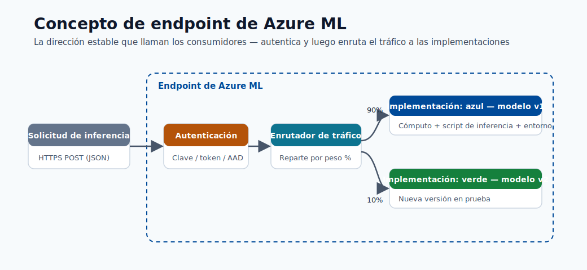
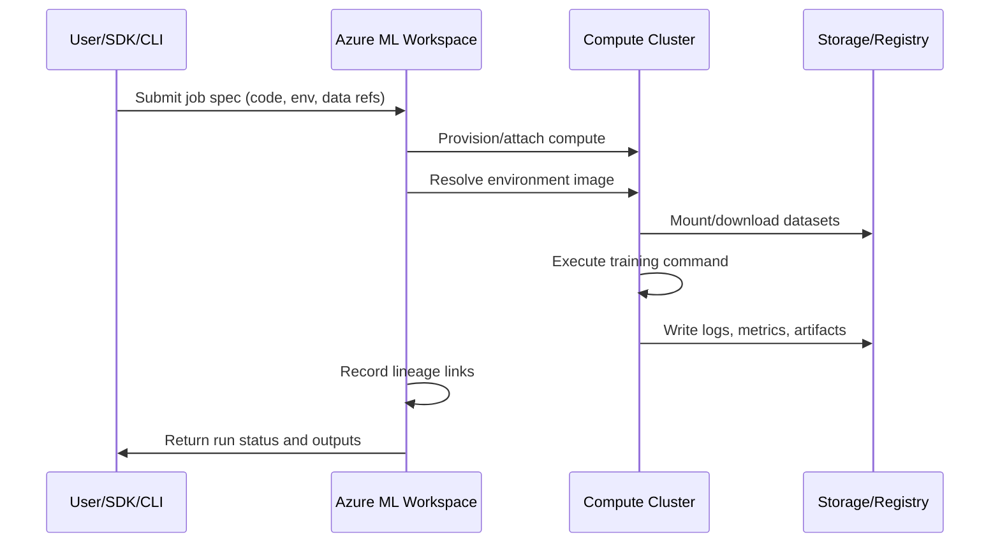
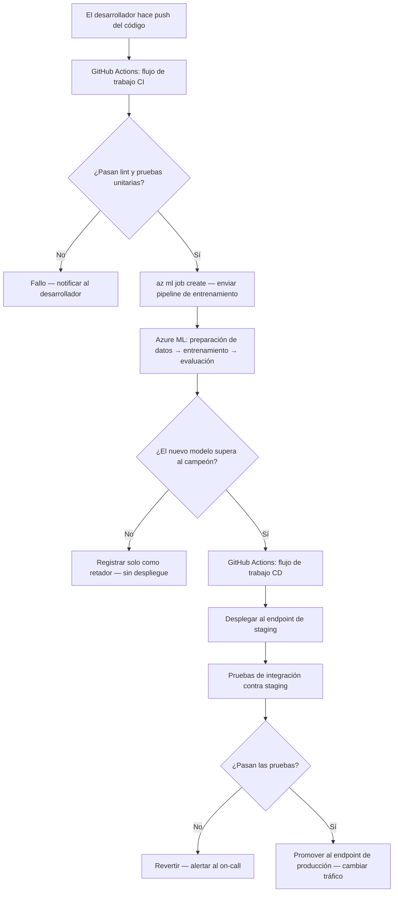

# Entorno de Azure ML

Este módulo explica los bloques de construcción de la plataforma Azure ML y cómo elegir las opciones de cómputo y
de servicio según la escala, la latencia y el costo.

## Activos principales del área de trabajo

- Área de trabajo (workspace)
- Instancia de cómputo
- Clúster de cómputo
- Activos de datos
- Registro de modelos
- Endpoints

## Plano de control vs plano de datos

| Plano | Responsabilidad |
|---|---|
| Plano de control | Metadatos de activos, historial de ejecuciones, permisos, gobernanza |
| Plano de datos | Ejecución de cómputo real, inferencia del modelo, movimiento de datos |

## Taxonomía del área de trabajo


> **Nota - Qué muestra esto:** La taxonomía del área de trabajo de Azure ML: cómo el área de trabajo contiene cómputo, activos de datos, modelos y
> endpoints bajo un mismo límite de gobernanza. Úsala para ver qué tipo de activo posee cada artefacto que
> crearás en los módulos posteriores.


> **Nota - Qué muestra esto:** Cómo un *entorno* versionado (imagen base + dependencias fijadas) se reutiliza tanto en el entrenamiento
> como en la inferencia. Compartir un mismo entorno es lo que evita el sesgo entre entrenamiento y servicio: el mismo código
> comportándose de forma diferente en producción que en el entrenamiento.

Conceptos clave:

- Experimento: una ejecución de entrenamiento rastreada.
- Modelo registrado: artefacto entrenado almacenado con versión y linaje.
- Endpoint: superficie de despliegue para las solicitudes de scoring.

Términos clave adicionales:

- Entorno: dependencias de tiempo de ejecución fijadas e imagen base.
- Almacén de datos (datastore): conexión de almacenamiento registrada.
- Conjunto de datos/activo de datos: referencia de datos versionada usada por los trabajos.



> **Nota - Qué muestra esto:** La anatomía de un endpoint de Azure ML: la superficie de despliegue que recibe las solicitudes de scoring,
> aplica la autenticación y enruta el tráfico a una o más versiones del modelo. Este es el objeto
> al que los consumidores realmente llaman.

## Guía de cómputo

- Instancia de cómputo para desarrollo
- Clúster de cómputo para entrenamiento escalable
- ACI o AKS para servicio

División práctica:

- Clúster de cómputo de AML: entrenamiento, sweeps, iteraciones paralelas de AutoML.
- Clúster de inferencia de AKS: despliegue de nivel de producción y autoescalado.

## Matriz de decisión de cómputo

| Necesidad | Opción recomendada |
|---|---|
| Exploración y depuración en notebooks | Instancia de cómputo |
| Entrenamiento paralelizado y HPO | Clúster de cómputo |
| Prototipo rápido de endpoint | ACI |
| Producción, autoescalado, alta disponibilidad | AKS |

## Línea base de seguridad y gobernanza

- Usa identidades administradas para el acceso a datos.
- Restringe las rutas de red con endpoints privados donde sea posible.
- Usa RBAC de privilegio mínimo.
- Mantén el linaje desde los datos hasta el modelo y el endpoint para la auditabilidad.

## Flujo de ejecución del backend (qué sucede después de enviar)



## Mapa de linaje de activos

| Activo | Versionado | Producido por | Consumido por |
|---|---|---|---|
| Activo de datos | Sí | Trabajo de registro de datos | Trabajos de entrenamiento/inferencia |
| Entorno | Sí | Construcción/fijación del entorno | Entrenamiento y despliegue |
| Modelo | Sí | Salida de la ejecución de entrenamiento | Endpoints en línea/por lotes |
| Despliegue de endpoint | Sí (con revisiones) | Pipeline de despliegue | Consumidores (apps/APIs) |

## Consideraciones empresariales

- Estrategia multi-área de trabajo: separar `dev`, `test`, `prod` con puertas de promoción.
- Estrategia de registro: registro de modelos central para compartir entre áreas de trabajo.
- Modelo de acceso: acceso humano vía grupos RBAC; acceso de cargas de trabajo vía identidad administrada.
- Rastro de cumplimiento: preservar IDs de ejecución, versiones de modelos, versiones de conjuntos de datos y revisiones de despliegue.

## Referencia de roles RBAC de Azure ML

| Rol | Asignatario típico | Permisos |
|---|---|---|
| Owner | Líderes del equipo de plataforma | Control total, incluida la asignación de roles |
| Contributor | Ingenieros de ML | Crear/administrar todos los activos, sin cambios de roles |
| AzureML Data Scientist | Científicos de datos | Ejecutar experimentos, registrar modelos, desplegar |
| AzureML Compute Operator | Equipo de operaciones | Iniciar/detener cómputo, ver ejecuciones |
| Reader | Partes interesadas | Solo ver activos e historial de ejecuciones |

## Análisis a fondo: cada concepto, explicado

Esta sección explica *por qué* existe cada bloque de construcción de Azure ML y qué problema resuelve,
no solo cómo se llama.

### El área de trabajo como unidad de gobernanza

Un **área de trabajo** es el contenedor de nivel superior que une el cómputo, los datos, los modelos y los
endpoints bajo un mismo límite de identidad y acceso. Existe para que todo lo relacionado con un proyecto
— quién puede tocarlo, qué ejecuciones produjeron qué modelo, qué versión de datos lo entrenó — quede
registrado en un solo lugar auditable. Tras bambalinas, un área de trabajo aprovisiona recursos de Azure
asociados: una **cuenta de almacenamiento** (artefactos, conjuntos de datos), **Key Vault** (secretos), **Container
Registry** (imágenes de entorno) y **Application Insights** (telemetría). Comprender esta
asignación explica la mayoría de los problemas de permisos y de red que encontrarás más adelante.

### Plano de control vs plano de datos: por qué importa la división

- El **plano de control** maneja los *metadatos y la intención*: "registrar este conjunto de datos", "iniciar este
  trabajo", "quién tiene permitido desplegar". Es ligero, siempre activo, y es donde viven la gobernanza,
  el linaje y el RBAC.
- El **plano de datos** maneja el *trabajo real*: levantar máquinas virtuales, mover gigabytes, ejecutar bucles de
  entrenamiento, servir inferencia. Es donde se determinan el costo y el rendimiento.

Esta separación es la razón por la que puedes enviar un trabajo (plano de control) y dejar que se ponga en cola hasta que el cómputo
(plano de datos) esté disponible, y por la que el permiso para *ver* un activo es distinto del permiso para
*ejecutar* cómputo costoso con él.

### Instancia de cómputo vs clúster de cómputo vs clúster de inferencia

| Cómputo | Ciclo de vida | Por qué existe |
|---|---|---|
| Instancia de cómputo | VM de desarrollo siempre activa, para un único usuario | Notebooks interactivos, depuración, vinculado a una identidad de usuario |
| Clúster de cómputo | Autoescala de 0 a N nodos por trabajo, luego vuelve a 0 | Entrenamiento paralelo, sweeps de hiperparámetros, pruebas de AutoML; pagas solo mientras se ejecutan los trabajos |
| AKS / inferencia administrada | Pods de larga duración con autoescalado | Servicio de baja latencia y alta disponibilidad con sondas de salud |

La idea económica clave: **el cómputo de entrenamiento debe escalar a cero cuando está inactivo** (intermitente, en lotes),
mientras que **el cómputo de servicio permanece activo** (constante, sensible a la latencia). Elegir el incorrecto es una
causa principal de sorpresas en las facturas de la nube.

### Activos, versionado y linaje

Cada activo de primera clase (datos, entorno, modelo, despliegue de endpoint) está **versionado**. Esto
no es burocracia: es lo que hace que un sistema de ML sea *reproducible* y *auditable*:

- **Activo de datos**: un puntero versionado a los datos en un almacén de datos, de modo que una ejecución registra *exactamente* qué
  instantánea se usó para entrenar.
- **Entorno**: un tiempo de ejecución fijado (imagen base + versiones de dependencias). Reutilizar el mismo
  entorno para entrenamiento e inferencia evita la clase de errores "funciona en entrenamiento, falla en producción".
- **Modelo**: el artefacto entrenado más los metadatos que lo vinculan de vuelta a la ejecución, los datos y el
  entorno que lo produjeron (su **linaje**).
- **Despliegue de endpoint**: una configuración de servicio con revisiones, de modo que el tráfico puede dividirse o
  revertirse entre versiones.

El linaje es la cadena `datos v → ejecución → modelo v → revisión de endpoint`. Cuando se cuestiona una predicción de producción
(auditoría, incidente, revisión de equidad), el linaje te permite reconstruir precisamente cómo fue producida.

### Conceptos de identidad y acceso

- **Identidad administrada**: una credencial administrada por Azure adjunta a una carga de trabajo (no a una persona) para que
  los trabajos puedan leer datos o registros *sin secretos incrustados*. Este es el predeterminado seguro.
- **RBAC (control de acceso basado en roles)**: permisos otorgados a identidades mediante roles. El principio de **privilegio mínimo**
  significa otorgar a cada identidad el rol mínimo necesario (por ejemplo, Contributor para ingenieros, no Owner),
  limitando el radio de explosión si las credenciales son comprometidas.
- **Endpoint privado**: enruta el tráfico al área de trabajo a través de una ruta de red privada en lugar de
  la internet pública, reduciendo la exposición para cargas de trabajo reguladas.

### El flujo de envío-a-resultado, desmitificado

Cuando envías un trabajo, el plano de control valida la especificación, aprovisiona o adjunta el cómputo del plano de datos,
resuelve la imagen del entorno (extrayendo o construyendo el contenedor), monta la versión de datos referenciada, ejecuta
tu comando, transmite registros/métricas/artefactos de vuelta al almacenamiento y registra el linaje. Conocer esta secuencia
es lo que te permite depurar una ejecución atascada: cada flecha en el diagrama de secuencia anterior es un lugar donde
un trabajo puede fallar (cuota, construcción de imagen, montaje de datos, error de código).

---

## Modelo de madurez de MLOps

MLOps (Operaciones de Aprendizaje Automático) es la disciplina de aplicar los principios de DevOps a los
flujos de trabajo de aprendizaje automático. Microsoft define un modelo de madurez de cuatro niveles que describe cómo
las organizaciones evolucionan desde la experimentación ad-hoc hacia sistemas de ML completamente automatizados y autorreparables.
Comprender dónde está tu equipo hoy, y qué requiere el siguiente nivel, es el
punto de partida para cualquier decisión de inversión en plataforma.

### Los cuatro niveles

| Nivel | Nombre | Entrenamiento | Despliegue | Monitoreo | Reentrenamiento |
|---|---|---|---|---|---|
| 0 | Manual | Scripts ejecutados en un laptop | Copia manual del artefacto del modelo | Ninguno | Ad hoc, bajo solicitud |
| 1 | Pipeline de entrenamiento automatizado | Pipeline de ML en clúster de cómputo | Semi-manual o con scripts | Métricas básicas | Activación manual |
| 2 | CI/CD completo de ML | Pipeline activado por commit de código | Modelo desplegado vía pipeline de lanzamiento | Alertas de detección de drift | Activado por umbral |
| 3 | Reentrenamiento automatizado | Activado por drift de datos o programación | Azul/verde, canario, reversión automatizada | Pila de observabilidad completa | Completamente autónomo |

### Nivel 0 — Manual

En el Nivel 0 un científico de datos ejecuta scripts de Python localmente, almacena el modelo como un archivo pickle y
lo envía por correo electrónico a un ingeniero que lo despliega manualmente. No hay versionado, no hay linaje y no hay
ruta de reversión. El modelo es efectivamente una caja negra adjunta al conocimiento tribal.

**Componentes de Azure ML que te sacan del Nivel 0:**
- Registrar tu área de trabajo fuerza a todos los activos (datos, modelo, endpoint) a un almacén gobernado.
- Usar `mlflow.log_metric` y `mlflow.log_artifact` dentro de tu script convierte una ejecución local en
  un experimento rastreado sin cambiar la lógica de entrenamiento.

### Nivel 1 — Pipeline de entrenamiento automatizado

En el Nivel 1 el entrenamiento es un pipeline repetible y parametrizado. Cualquier ingeniero puede volver a ejecutar el
pipeline desde los mismos datos y obtener el mismo modelo. El despliegue aún requiere acción humana.

**Componentes de Azure ML que habilitan el Nivel 1:**
- **Clúster de cómputo** con `min_instances=0` para que el pipeline se ejecute bajo demanda y se apague.
- **Pipelines de Azure ML** (DAGs de componentes) para encadenar preparación de datos → entrenamiento → evaluación →
  registro del modelo como pasos discretos y re-ejecutables.
- **Entornos registrados** para que cada paso use una imagen de tiempo de ejecución inmutable.
- **Activos de datos** con fijación de versión para que el pipeline registre exactamente qué versión de datos entrenó.

### Nivel 2 — CI/CD completo de ML

En el Nivel 2 un commit de código o un evento de drift de datos activa el pipeline completo de entrenamiento-evaluación-despliegue
a través de un orquestador de CI/CD. Una puerta (prueba automatizada o aprobación) evita que los modelos defectuosos
lleguen a producción.

**Componentes de Azure ML que habilitan el Nivel 2:**
- **GitHub Actions / Azure DevOps** integrados con acciones `azure/aml-run` o CLI v2 `az ml job create`.
- **Paso de evaluación del modelo** en el pipeline que compara las métricas del nuevo modelo contra el campeón actual;
  el paso de despliegue solo procede si el retador gana.
- **Endpoints en línea administrados** con división de tráfico azul/verde para que el despliegue sea sin tiempo de inactividad.

### Nivel 3 — Reentrenamiento automatizado

En el Nivel 3 el sistema monitorea sus propias predicciones, detecta el drift y automáticamente inicia un
pipeline de reentrenamiento sin intervención humana. Los modelos están continuamente actualizados.

**Componentes de Azure ML que habilitan el Nivel 3:**
- **Monitor de data drift** en el endpoint en línea que emite una alerta o activa directamente un
  pipeline vía Event Grid.
- **Activadores de pipeline basados en programación** como línea de base más simple para el reentrenamiento periódico.
- **Registro de promoción de modelos** entre áreas de trabajo `dev/test/prod` con puertas de promoción automatizadas.

> **Nota - La madurez no es una carrera:** La mayoría de los equipos de ML de producción operan efectivamente en el Nivel 2.
> La automatización del Nivel 3 es apropiada cuando la latencia del reentrenamiento es un KPI de negocio crítico (por ejemplo,
> modelos de fraude donde la distribución de datos cambia diariamente). Elige el nivel que coincida con tu
> cadencia de negocio, no el que suene más impresionante.

---

## Pipelines de Azure ML como activos de primera clase

### El concepto de componente

Un **componente** en Azure ML es una unidad de cómputo autónoma y reutilizable. Es análogo a
una función: declara entradas tipadas, salidas tipadas y un comando a ejecutar. Los componentes se
definen en YAML y se versionan en el registro del área de trabajo, por lo que pueden compartirse entre proyectos
y reutilizarse sin copiar y pegar código.

El beneficio clave es la **composabilidad**: un pipeline es simplemente un DAG (grafo acíclico dirigido) de
invocaciones de componentes conectadas vinculando las salidas de un componente a las entradas del
siguiente. Azure ML gestiona la programación, el movimiento de datos y el registro de linaje por ti.

### Ejemplo de definición de componente en YAML

```yaml
# components/prep_data/component.yml
$schema: https://azuremlschemas.azureedge.net/latest/commandComponent.schema.json
name: prep_data
display_name: Prepare Training Data
version: "1"
type: command

inputs:
  raw_data:
    type: uri_folder
    description: Raw CSV files from the data lake
  validation_split:
    type: number
    default: 0.2

outputs:
  train_data:
    type: uri_folder
  val_data:
    type: uri_folder

code: ./src
environment: azureml:fraud-train@latest

command: >-
  python prep.py
  --raw_data ${{inputs.raw_data}}
  --validation_split ${{inputs.validation_split}}
  --train_data ${{outputs.train_data}}
  --val_data ${{outputs.val_data}}
```

> **Nota - Tipos de entrada/salida:** `uri_folder` es una ruta a un directorio (ruta de contenedor de blob o
> ruta local); `uri_file` es un único archivo. Azure ML resuelve estas referencias y monta o
> descarga los datos antes de que se ejecute tu script. Usa `mlflow_model` como tipo de salida cuando el
> paso produce un artefacto de modelo registrado.

### Composición de pipeline en YAML

```yaml
# pipelines/fraud_pipeline.yml
$schema: https://azuremlschemas.azureedge.net/latest/pipelineJob.schema.json
type: pipeline
display_name: Fraud Detection Training Pipeline
experiment_name: fraud-detection

inputs:
  raw_data:
    type: uri_folder
    path: azureml:fraud-raw-data@latest

jobs:
  prep_step:
    type: command
    component: azureml:prep_data@1
    inputs:
      raw_data: ${{parent.inputs.raw_data}}
      validation_split: 0.2
    outputs:
      train_data:
        mode: rw_mount
      val_data:
        mode: rw_mount

  train_step:
    type: command
    component: azureml:train_model@1
    inputs:
      train_data: ${{parent.jobs.prep_step.outputs.train_data}}
      val_data: ${{parent.jobs.prep_step.outputs.val_data}}
      learning_rate: 0.01
      n_estimators: 500
    outputs:
      model_output:
        mode: rw_mount

  evaluate_step:
    type: command
    component: azureml:evaluate_model@1
    inputs:
      model: ${{parent.jobs.train_step.outputs.model_output}}
      val_data: ${{parent.jobs.prep_step.outputs.val_data}}
```

Enviar el pipeline:

```bash
az ml job create \
  --file pipelines/fraud_pipeline.yml \
  --workspace-name my-workspace \
  --resource-group my-rg \
  --stream
```

### Cómo los pipelines habilitan flujos de trabajo reproducibles

Cada ejecución de pipeline almacena:
1. La **versión del componente** usada en cada paso.
2. La **versión del activo de datos** consumida.
3. La **versión del entorno** en que se ejecutó cada paso.
4. Todas las **entradas, salidas y métricas** por paso.

Esto significa que cualquier ejecución histórica puede **reproducirse exactamente** volviendo a enviar con las mismas
versiones de componentes y datos, sin reconstrucción manual requerida. Los vínculos de linaje de datos →
componente → modelo → endpoint se registran automáticamente.

### Diferencia con Azure Pipelines / pipelines de DevOps

| Pipeline de Azure ML | Pipeline de Azure DevOps / GitHub Actions |
|---|---|
| Se ejecuta en cómputo de ML (clústeres GPU/CPU) | Se ejecuta en agentes de CI/CD (VMs ligeras) |
| Orquesta pasos de datos + modelos | Orquesta pasos de compilación, prueba y despliegue de código |
| Linaje de ML de primera clase y seguimiento de experimentos | Gestión de control de código fuente y artefactos |
| Puede ser activado *por* un pipeline de DevOps | No puede ejecutar trabajos de entrenamiento de ML de forma nativa |

La arquitectura correcta es **anidada**: un flujo de trabajo de GitHub Actions (pipeline de DevOps) responde a un
commit de código y llama a `az ml job create` para enviar un Pipeline de Azure ML. La capa de DevOps
gestiona CI/CD; la capa de Azure ML gestiona la ejecución de ML.

> **Consejo - Reutilización:** Registra los componentes de uso frecuente (validación de datos, evaluación de modelos,
> ingeniería de características) una vez en un registro de componentes compartido. Los equipos pueden extraerlos por nombre y
> versión en lugar de duplicar código, y las mejoras se propagan a todos los pipelines que referencian
> la última versión.

---

## Feature stores: concepto y motivación

### ¿Qué es un feature store?

Un **feature store** es un repositorio centralizado para almacenar, servir y reutilizar características ingeniadas —
las señales transformadas y significativas para el negocio derivadas de los datos en bruto que se alimentan a los modelos de ML.
Existe para resolver una clase de problemas que surgen cuando la misma característica (por ejemplo,
"velocidad de transacciones de 30 días para el cliente X") necesita calcularse de forma consistente tanto para el
entrenamiento como para la inferencia en tiempo real.

Sin un feature store, los equipos típicamente:
- Reimplementan la misma lógica de características en dos lugares (notebook de entrenamiento y servicio de producción).
- Descubren meses después que las implementaciones divergieron, produciendo **sesgo entrenamiento/servicio**.
- No pueden reutilizar características entre proyectos, por lo que cada nuevo modelo duplica el trabajo de ingeniería de datos.

### Almacén en línea vs almacén offline

| Almacén | Latencia | Contenido | Usado para |
|---|---|---|---|
| **Almacén offline** | Minutos–horas | Valores de características históricas, formato columnar (Parquet) | Entrenamiento de modelos, puntuación en lotes |
| **Almacén en línea** | Milisegundos | Valores de características más recientes, formato clave-valor (Redis/CosmosDB) | Inferencia en tiempo real |

El almacén offline te permite construir conjuntos de datos de entrenamiento recuperando valores históricos de características
tal como existían **en el momento de cada etiqueta de entrenamiento** (corrección punto-en-el-tiempo). El almacén en línea
sirve el valor más reciente en el momento de la inferencia.

### El problema de consistencia entrenamiento/servicio

Supongamos que entrenas un modelo de fraude con la característica "número de transacciones en los últimos 30 días para
esta tarjeta". Tu código de entrenamiento consulta un almacén de datos y agrega correctamente. Tu servicio de inferencia,
escrito por un ingeniero diferente, consulta una tabla diferente con una definición de ventana ligeramente diferente. Los valores
de características difieren sistemáticamente, y el rendimiento del modelo en producción se degrada de maneras que
son muy difíciles de diagnosticar.

Un feature store aplica una implementación canónica única de cada transformación de características. El
**mismo pipeline** que escribe características en el almacén offline también las escribe en el almacén en línea,
garantizando que ambas derivan de lógica idéntica.

### Corrección punto-en-el-tiempo

Al construir un conjunto de datos de entrenamiento no debes "mirar hacia el futuro". Si la etiqueta $y_i$ fue
asignada en el tiempo $t_i$, el vector de características $\mathbf{x}_i$ debe contener solo información
disponible en $t_i$. Una unión ingenua por ID de entidad sin filtrado temporal causa **fuga de etiquetas**,
produciendo métricas de entrenamiento mucho mejores que el rendimiento de producción.

Los feature stores resuelven esto con **consultas de viaje en el tiempo**:

$$\mathbf{x}_i = \text{FeatureStore.get\_historical\_features}(\text{entidad}=e_i,\ t=t_i)$$

El almacén devuelve el valor de la característica tal como estaba almacenado en (o antes de) $t_i$, no el valor actual.

### Cómo se conecta con Azure ML

Azure ML se integra con el **Microsoft Fabric Feature Store** y el **feature store administrado de Azure ML**
(versión preliminar). Puedes:
- Definir conjuntos de características como código de transformación de Python registrado en el feature store.
- Generar conjuntos de datos de entrenamiento uniendo conjuntos de características con una tabla de etiquetas usando
  uniones punto-en-el-tiempo a través del SDK de Azure ML.
- Servir características en el momento de la inferencia desde el almacén en línea detrás de un endpoint en línea administrado.

```python
# Recuperar características históricas para entrenamiento (SDK v2 preliminar)
from azureml.featurestore import FeatureStoreClient, get_offline_features
from azure.identity import DefaultAzureCredential

fs_client = FeatureStoreClient(
    credential=DefaultAzureCredential(),
    subscription_id="<sub>",
    resource_group_name="<rg>",
    name="my-feature-store",
)

feature_set = fs_client.feature_sets.get("transactions", "1")
obs_df = spark.read.parquet("abfss://labels@datalake.dfs.core.windows.net/labels.parquet")

training_df = get_offline_features(
    features=[feature_set.get_feature("tx_velocity_30d")],
    observation_data=obs_df,
    timestamp_column="event_time",
)
```

> **Nota - Madurez:** El feature store administrado de Azure ML alcanzó disponibilidad general en 2024.

> Para proyectos más simples, un pipeline de ingeniería de características bien diseñado (con versionado estricto y
> lógica idéntica en entrenamiento e inferencia) proporciona la mayoría de los beneficios antes de comprometerte con
> la adopción completa de un feature store.

---

## Conceptos de entrenamiento distribuido en Azure ML

### ¿Por qué entrenamiento distribuido?

Para modelos grandes o conjuntos de datos grandes, una sola GPU se convierte en el cuello de botella. El entrenamiento distribuido
distribuye el cómputo entre múltiples GPUs (o múltiples nodos de GPUs). Las dos estrategias fundamentales son el **paralelismo de datos** y el **paralelismo de modelos**.

### Paralelismo de datos

En el paralelismo de datos cada GPU tiene una **copia completa del modelo** pero procesa un mini-lote de datos diferente.
Después de cada pase hacia adelante y hacia atrás, los gradientes se sincronizan (promedian) entre todas las GPUs antes
de la actualización de pesos.

$$\text{Tamaño de lote efectivo} = B \times N_{\text{GPU}}$$

donde $B$ es el tamaño de lote por GPU y $N_{\text{GPU}}$ es el número de GPUs. Un tamaño de lote efectivo mayor
significa menos rondas de sincronización de gradientes por época, pero puede requerir escalado de la tasa de aprendizaje
(regla de escalado lineal: $\eta' = \eta \times N_{\text{GPU}}$).

**PyTorch Distributed Data Parallel (DDP)** es la implementación estándar:

```python
# train.py (punto de entrada DDP — llamado por Azure ML en cada rango)
import os
import torch
import torch.distributed as dist
from torch.nn.parallel import DistributedDataParallel as DDP

def setup():
    dist.init_process_group(backend="nccl")  # NCCL = GPU-a-GPU vía NVLink/InfiniBand
    torch.cuda.set_device(int(os.environ["LOCAL_RANK"]))

def main():
    setup()
    model = MyModel().cuda()
    model = DDP(model, device_ids=[int(os.environ["LOCAL_RANK"])])
    # ... bucle de entrenamiento sin cambios respecto al código de una sola GPU
```

### Paralelismo de modelos

En el paralelismo de modelos el modelo es demasiado grande para caber en una sola GPU, por lo que **diferentes capas se
colocan en diferentes GPUs**. Los datos fluyen secuencialmente a través del pipeline de dispositivos. Esto
requiere una ingeniería más cuidadosa (paralelismo de pipeline, paralelismo de tensor) y típicamente se
usa para el preentrenamiento de LLM (por ejemplo, modelos de estilo GPT con miles de millones de parámetros).

| Estrategia | Usar cuando | Soporte de framework |
|---|---|---|
| Paralelismo de datos (DDP) | El modelo cabe en una GPU; necesita entrenamiento más rápido | PyTorch DDP, Horovod |
| Paralelismo de modelos | El modelo NO cabe en una GPU | DeepSpeed, Megatron-LM |
| Paralelismo de pipeline | Modelos muy profundos; balancear latencia de capas | DeepSpeed, FairScale |
| Paralelismo de tensor | Capas muy anchas (grandes cabezas de atención) | Megatron-LM, NeMo |

### Arquitectura de servidor de parámetros

Una alternativa más antigua a DDP es el modelo de **servidor de parámetros**: algunos nodos actúan como servidores
que almacenan el estado global de parámetros, mientras los nodos trabajadores calculan gradientes y los envían a los servidores.
Esto está menos favorecido para el entrenamiento en GPU hoy (el all-reduce es más eficiente en ancho de banda) pero
aún se usa en el entrenamiento distribuido en CPU y algunas cargas de trabajo de embeddings dispersos.

### Configurar un trabajo de entrenamiento distribuido en Azure ML

```yaml
# jobs/distributed_train.yml
$schema: https://azuremlschemas.azureedge.net/latest/commandJob.schema.json
type: command
display_name: DDP Training Job

code: ./src
command: >-
  python train.py
  --epochs 50
  --batch_size 64

environment: azureml:pytorch-gpu-env@latest
compute: azureml:gpu-cluster

distribution:
  type: pytorch           # Azure ML inyecta MASTER_ADDR, MASTER_PORT, RANK, WORLD_SIZE
  process_count_per_instance: 4  # GPUs por nodo

resources:
  instance_count: 2       # 2 nodos × 4 GPUs = DDP de 8 vías

experiment_name: distributed-training
```

Azure ML establece las variables de entorno `MASTER_ADDR`, `MASTER_PORT`, `RANK`, `LOCAL_RANK` y `WORLD_SIZE`
automáticamente, de modo que tu script llama a `dist.init_process_group()` sin direcciones codificadas.

### Configuración del clúster GPU

```bash
# Crear un clúster de cómputo GPU (Standard_NC6s_v3 = 1x V100)
az ml compute create \
  --name gpu-cluster \
  --type AmlCompute \
  --min-instances 0 \
  --max-instances 8 \
  --size Standard_NC24s_v3 \
  --workspace-name my-workspace \
  --resource-group my-rg
```

> **Consejo - VMs spot para entrenamiento distribuido:** Las VMs spot (prioridad baja) de GPU cuestan ~60–80% menos
> que las dedicadas. Para trabajos de entrenamiento tolerantes a fallos (con puntos de control), usa siempre
> `--tier LowPriority`. Azure ML reencola automáticamente el trabajo si la VM es desalojada.

---

## Redes y despliegue privado

### Por qué importa el aislamiento de red

En industrias reguladas (banca, salud, gobierno), los datos nunca deben atravesar la internet pública.
Incluso con cifrado TLS, el tráfico que toca una IP pública crea un hallazgo de auditoría.
Las características de redes privadas de Azure ML te permiten desplegar un área de trabajo y todos los recursos
asociados completamente dentro de un espacio de direcciones privado.

### Inyección de red virtual (VNet)

Cuando **inyectas en VNet** un área de trabajo de Azure ML, los recursos asociados (almacenamiento, key vault,
registro de contenedores, Application Insights) todos reciben **endpoints privados**: interfaces de red
dentro de tu VNet con direcciones IP privadas. El tráfico entre el cómputo y el almacenamiento permanece completamente
dentro del backbone de Azure, sin salir nunca de tu VNet.

```bash
# Crear un área de trabajo inyectada en VNet
az ml workspace create \
  --name secure-workspace \
  --resource-group my-rg \
  --location eastus \
  --managed-network allow_only_approved_outbound
```

### Endpoint privado para el área de trabajo

Un **endpoint privado** para el área de trabajo misma significa que la UI de Azure ML Studio y todas las llamadas de SDK/CLI
se enrutan a través de una IP privada en tu VNet. El acceso externo requiere:
- Una **VM de salto** dentro de la VNet, o
- **Azure Bastion** para acceso basado en navegador, o
- Una **VPN / ExpressRoute** que conecte tu red corporativa a la VNet.

### Zonas DNS privadas

Cuando se crea un endpoint privado, el FQDN del área de trabajo (por ejemplo,
`my-workspace.api.azureml.ms`) debe resolverse a la IP privada, no a la pública. Esto requiere:
1. Una **zona DNS privada** (`privatelink.api.azureml.ms`) vinculada a la VNet.
2. Un **registro A** que mapee el nombre de host del área de trabajo a la IP del endpoint privado.

Azure puede crear estos automáticamente durante el aprovisionamiento del área de trabajo (`--public-network-access
disabled`) o puedes gestionarlos manualmente para topologías hub-spoke complejas.

### Reglas de salida (VNet administrada)

La característica de **VNet administrada** de Azure ML (disponible de forma general en 2024) gestiona la salida sin que tú
administres NSGs y tablas de rutas. Declaras los destinos de salida permitidos:

```yaml
# workspace_managed_vnet.yml
managed_network:
  isolation_mode: allow_only_approved_outbound
  outbound_rules:
    - name: allow-pypi
      type: fqdn
      destination: pypi.org
    - name: allow-conda-forge
      type: fqdn
      destination: conda.anaconda.org
    - name: allow-storage
      type: private_endpoint
      destination:
        service_resource_id: /subscriptions/<sub>/resourceGroups/<rg>/providers/Microsoft.Storage/storageAccounts/mydatalake
        subresource_type: blob
```

### Resumen: por qué las organizaciones financieras y de salud requieren esto

| Requisito | Característica de Azure ML |
|---|---|
| Los datos nunca salen de la red privada | Inyección de VNet + endpoints privados |
| Sin IP pública en el área de trabajo | `--public-network-access disabled` |
| Rastro de auditoría de rutas de red | Registros de flujo NSG + Azure Monitor |
| Cifrado en tránsito | TLS 1.2+ aplicado en todos los endpoints privados |
| Cifrado en reposo | Almacenamiento + KV con claves administradas por el cliente (CMK) |

> **Nota - Planificación:** Las redes privadas deben planificarse **antes** de la creación del área de trabajo. Modernizar
> los endpoints privados en un área de trabajo pública existente es posible pero requiere volver a desplegar
> los recursos asociados. Diseña la topología de red por adelantado para evitar tiempo de inactividad.

---

## Patrones de optimización de costos

Los costos de Azure ML caen en dos categorías: **cómputo** (VMs ejecutando entrenamiento o inferencia) y
**almacenamiento + egreso** (datos, artefactos, registros). El cómputo es casi siempre el costo dominante.

### VMs spot para entrenamiento

Las VMs spot (prioridad baja) usan capacidad de Azure disponible con un descuento del 60–80%. Pueden ser desalojadas con
2 minutos de aviso. Para el entrenamiento de ML, la mitigación es el **uso de puntos de control**:

```python
# Guardar punto de control cada N épocas
if epoch % checkpoint_every == 0:
    torch.save({
        "epoch": epoch,
        "model_state": model.state_dict(),
        "optimizer_state": optimizer.state_dict(),
    }, f"outputs/checkpoint_epoch_{epoch}.pt")
```

Azure ML reencola automáticamente el trabajo al desalojo; el trabajo se reanuda desde el último punto de control.

```bash
az ml compute create \
  --name spot-cluster \
  --type AmlCompute \
  --size Standard_NC6s_v3 \
  --min-instances 0 \
  --max-instances 4 \
  --tier LowPriority          # <-- precio spot
```

### Apagado automático para instancias de cómputo

Una instancia de cómputo dejada en ejecución durante la noche cuesta ~$50–200/día dependiendo del tamaño de la VM. Establece un
programa de apagado automático:

```bash
az ml compute update \
  --name my-instance \
  --workspace-name my-workspace \
  --resource-group my-rg \
  --idle-time-before-shutdown-minutes 30
```

### Clúster de cómputo con min=0

Los nodos del clúster se facturan por minuto. Establecer `min-instances=0` significa que el clúster escala a cero
cuando está inactivo. La compensación es un **retraso de arranque en frío** de ~3–5 minutos para aprovisionar el primer nodo.
Para los clústeres de desarrollo este es casi siempre el equilibrio correcto.

### Costo de ACI vs AKS

| Opción de servicio | Modelo de facturación | Mejor para | Evitar cuando |
|---|---|---|---|
| ACI | Por segundo de CPU+memoria | Prototipo, <5 RPS | Alto rendimiento, inferencia GPU |
| Endpoint en línea administrado | Por minuto de VM activa | API REST de producción | Puntuación en lotes |
| Endpoint en línea sin servidor | Por token / por solicitud (modelos) | Tráfico esporádico de LLM | Alto rendimiento constante |
| Endpoint en lotes + Clúster | Por minuto de cómputo solo mientras se puntúa | Grandes trabajos en lotes offline | SLA en tiempo real requerido |

### Instancias reservadas para inferencia

Si un endpoint de inferencia de producción se ejecuta 24/7, una **instancia reservada de 1 año** reduce el costo de la VM
en aproximadamente el 40%. Una **reserva de 3 años** lo reduce en ~60%.

### Ejemplo de cálculo de costo real

Supongamos que ejecutas un pipeline de reentrenamiento mensual en una VM spot `Standard_NC6s_v3` (1× V100, ~$0.90/h
precio spot) y sirves un modelo en un `Standard_DS3_v2` (4 vCPU, 14 GB, ~$0.20/h bajo demanda):

| Elemento | Duración | Spot/Bajo demanda | Costo mensual |
|---|---|---|---|
| Pipeline de preparación + entrenamiento | 4 h/mes | Spot $0.90/h | $3.60 |
| Evaluación + registro | 0.5 h/mes | Spot $0.90/h | $0.45 |
| Endpoint en línea (inferencia) | 730 h/mes | Bajo demanda $0.20/h | $146 |
| Almacenamiento (50 GB de artefactos) | 730 h/mes | $0.018/GB/mes | $0.90 |
| **Total** | | | **~$151/mes** |

La VM de inferencia representa el 97% del costo. Esto es típico y explica por qué dimensionar correctamente la VM de
inferencia y usar autoescalado (escalar a 0 con `scale_settings.scale_down_as_needed`) importa mucho más
que optimizar el cómputo de entrenamiento.

> **Consejo - Alertas de costo:** Crea una alerta de presupuesto de Azure al 80% de tu gasto mensual esperado para
> ser notificado antes de que los costos se disparen. Establece una segunda alerta al 100%. Los trabajos de entrenamiento atascados
> en un bucle infinito en un clúster sin spot son una causa común de facturas sorpresa.

---

## Azure ML y DevOps: el pipeline CI/CD de MLOps

### Resumen de la arquitectura

Un pipeline de MLOps de producción combina **dos orquestadores**:
1. **GitHub Actions** (o Azure DevOps) — responde a eventos de control de código fuente (push de código, fusión de PR,
   activador programado) y orquesta el flujo de trabajo de lanzamiento general.
2. **Pipelines de Azure ML** — ejecuta el trabajo específico de ML (preparación de datos, entrenamiento, evaluación) en el cómputo
   de ML con seguimiento completo de linaje.



### Integración con GitHub Actions

```yaml
# .github/workflows/train-and-deploy.yml
name: Train and Deploy Fraud Model

on:
  push:
    branches: [main]
    paths:
      - "src/**"
      - "pipelines/**"
      - "components/**"

env:
  AZURE_SUBSCRIPTION: ${{ secrets.AZURE_SUBSCRIPTION_ID }}
  AZURE_RESOURCE_GROUP: my-rg
  AML_WORKSPACE: my-workspace

jobs:
  train:
    runs-on: ubuntu-latest
    steps:
      - uses: actions/checkout@v4

      - name: Azure login
        uses: azure/login@v2
        with:
          creds: ${{ secrets.AZURE_CREDENTIALS }}

      - name: Install Azure ML CLI extension
        run: az extension add --name ml --yes

      - name: Submit training pipeline
        id: train_job
        run: |
          JOB_NAME=$(az ml job create \
            --file pipelines/fraud_pipeline.yml \
            --workspace-name $AML_WORKSPACE \
            --resource-group $AZURE_RESOURCE_GROUP \
            --query name -o tsv)
          echo "job_name=$JOB_NAME" >> $GITHUB_OUTPUT
          az ml job stream --name $JOB_NAME \
            --workspace-name $AML_WORKSPACE \
            --resource-group $AZURE_RESOURCE_GROUP

      - name: Check job outcome
        run: |
          STATUS=$(az ml job show \
            --name ${{ steps.train_job.outputs.job_name }} \
            --workspace-name $AML_WORKSPACE \
            --resource-group $AZURE_RESOURCE_GROUP \
            --query status -o tsv)
          if [ "$STATUS" != "Completed" ]; then
            echo "Training job failed with status: $STATUS"
            exit 1
          fi

  deploy-staging:
    needs: train
    runs-on: ubuntu-latest
    environment: staging
    steps:
      - uses: actions/checkout@v4

      - name: Azure login
        uses: azure/login@v2
        with:
          creds: ${{ secrets.AZURE_CREDENTIALS }}

      - name: Deploy to staging endpoint
        run: |
          az ml online-deployment create \
            --file deployments/staging_deployment.yml \
            --workspace-name $AML_WORKSPACE \
            --resource-group $AZURE_RESOURCE_GROUP \
            --all-traffic

      - name: Run integration tests
        run: python tests/integration/test_endpoint.py --env staging

  deploy-production:
    needs: deploy-staging
    runs-on: ubuntu-latest
    environment: production   # requiere aprobación manual en los Entornos de GitHub
    steps:
      - uses: actions/checkout@v4

      - name: Azure login
        uses: azure/login@v2
        with:
          creds: ${{ secrets.AZURE_CREDENTIALS }}

      - name: Shift 100% traffic to new deployment
        run: |
          az ml online-endpoint update \
            --name fraud-endpoint \
            --traffic "new-deployment=100" \
            --workspace-name $AML_WORKSPACE \
            --resource-group $AZURE_RESOURCE_GROUP
```

### Entrenamiento del modelo activado por cambio de código

El filtro `paths` en el flujo de trabajo garantiza que **solo los cambios relevantes activen el entrenamiento**.
Los cambios en documentación o archivos de configuración no relacionados no consumen presupuesto de GPU. El filtro `paths`
verifica cambios en `src/`, `pipelines/` y `components/`, los tres directorios
que afectan el comportamiento del modelo.

### Puertas de promoción

En el ejemplo de GitHub Actions, el entorno `production` está configurado en los ajustes del repositorio de GitHub
para **requerir aprobación de un revisor** antes de que se ejecute el trabajo. Esto crea una puerta manual
entre la validación de staging y el despliegue de producción. Para MLOps completamente automatizado de Nivel 3, esta
puerta puede reemplazarse por una suite de pruebas automatizadas que comprueba:

- Latencia de predicción $\leq$ umbral de SLA (por ejemplo, $p99 \leq 100\text{ ms}$).
- Exactitud del modelo $\geq$ exactitud del campeón en un conjunto de evaluación apartado.
- No se detecta drift de datos en las predicciones en sombra del nuevo modelo.

### Pruebas del modelo en el pipeline

El componente de evaluación en el pipeline de Azure ML debe producir un archivo JSON con métricas que el
flujo de trabajo de GitHub Actions lee para tomar la decisión de promoción:

```python
# evaluate.py — se ejecuta dentro del pipeline de Azure ML
import json, mlflow
from sklearn.metrics import roc_auc_score

# ... cargar modelo y datos de validación ...
auc = roc_auc_score(y_val, model.predict_proba(X_val)[:, 1])
mlflow.log_metric("val_auc", auc)

# Escribir un resultado legible por máquina para la puerta de CI
result = {"val_auc": auc, "promoted": auc >= CHAMPION_AUC_THRESHOLD}
with open("outputs/eval_result.json", "w") as f:
    json.dump(result, f)
```

El paso de GitHub Actions descarga este artefacto y falla el pipeline si `promoted` es `False`,
impidiendo que se ejecute el trabajo de despliegue.

> **Consejo - Secretos en Actions:** Nunca codifiques IDs de suscripción o cadenas de conexión en archivos YAML.
> Usa Secretos Cifrados de GitHub (`${{ secrets.NOMBRE }}`) para credenciales y
> `${{ vars.NOMBRE }}` para configuración no sensible. El secreto `AZURE_CREDENTIALS` es un
> JSON de principal de servicio creado con `az ad sp create-for-rbac --role Contributor --scopes
> /subscriptions/<sub>` y almacenado como secreto del repositorio.

## Estrategia de versionado de entornos

Los entornos de Azure ML son inmutables una vez publicados. Enfoque de versionado recomendado:

1. Fija todos los paquetes con versiones exactas en `conda.yml` o `requirements.txt`.
2. Usa el nombre + versión del entorno (por ejemplo, `fraud-train:3`) como referencia en los trabajos.
3. Reconstruye el entorno cuando cambie cualquier dependencia, nunca mutes las versiones existentes.
4. Reutiliza el **mismo** entorno para entrenamiento e inferencia para garantizar la compatibilidad.

```yaml
# Ejemplo conda.yml
name: fraud-train
channels:
  - defaults
dependencies:
  - python=3.10
  - pip:
    - scikit-learn==1.3.0
    - azureml-sdk==1.55.0
    - pandas==2.0.3
    - lightgbm==4.0.0
```

## Consejos de gestión de costos

| Práctica | Ahorra |
|---|---|
| Establecer nodos mínimos del clúster de cómputo = 0 | Evita cargos por cómputo inactivo |
| Usar VMs spot/prioridad baja para entrenamiento | Reducción del 60-80% en costos de cómputo |
| Configurar apagado automático en instancias de cómputo | Evita el gasto inactivo nocturno |
| Usar ACI para endpoints de bajo QPS en lugar de AKS | Elimina la sobrecarga del clúster |

## Elección de cómputo: flujo de decisión

Elegir el cómputo es principalmente una función de dos preguntas: si el trabajo es *interactivo o en lotes*, y
si es *sensible a la latencia u orientado al rendimiento*. Este flujo captura el camino común.
