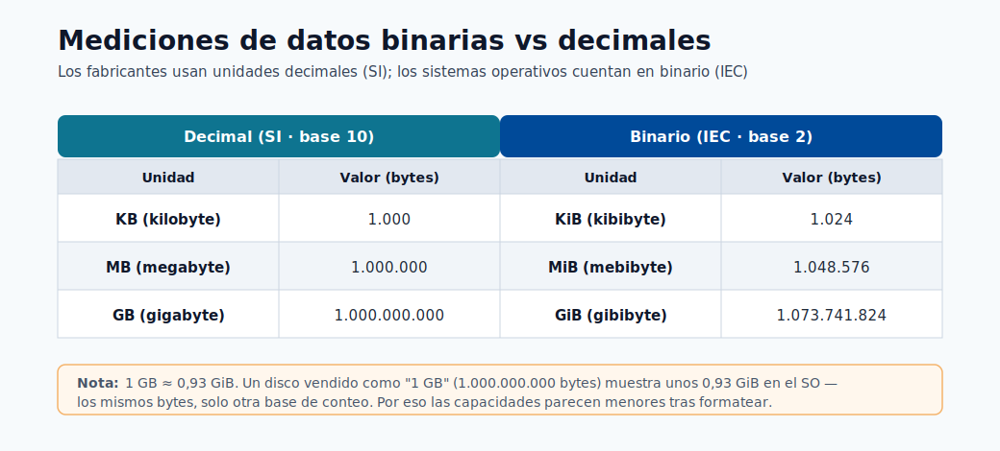
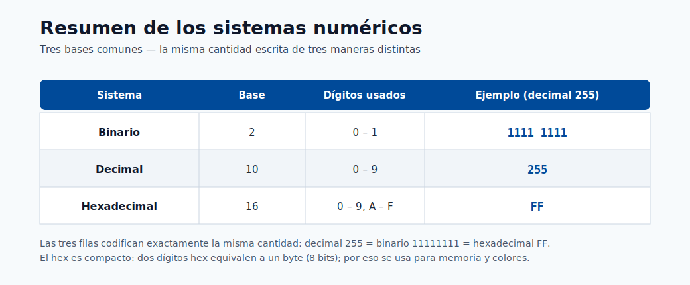

# Configuración del entorno

Este módulo ayuda a las personas principiantes a construir un entorno de ejecución reproducible desde cero. La reproducibilidad es
crítica porque el comportamiento del modelo depende de las versiones de los paquetes, las bibliotecas del sistema operativo y los detalles del entorno
de ejecución de Python.

## Por qué importa la reproducibilidad del entorno

- El mismo código puede producir resultados diferentes con versiones distintas de dependencias.
- El entrenamiento y la inferencia deben compartir bibliotecas compatibles.
- Los equipos necesitan reconstrucciones deterministas para auditorías y recuperación ante incidentes.

Los diagramas siguientes muestran cómo se organizan los activos de Azure ML y cómo se reutilizan
los entornos en el entrenamiento y la inferencia.


> **Nota - Qué muestra esto:** Nuevamente la taxonomía del área de trabajo, aquí para enfatizar *dónde viven los entornos*. El entorno que
> construyes localmente se convierte en un activo registrado y versionado dentro de esta estructura para que los trabajos remotos puedan
> reutilizarlo.


> **Nota - Qué muestra esto:** Cómo una definición de entorno fluye tanto hacia los trabajos de entrenamiento como de inferencia. Fijarla una vez y
> reutilizarla es el mecanismo central detrás de las ejecuciones reproducibles y las reconstrucciones deterministas.

## Configuración típica (desde cero)

```console
conda env create --name aml-env --file ./dependencies/environment.yml --force
conda activate aml-env
pip install -r ./dependencies/requirements.txt
```

## Lista de verificación de validación

1. Confirma que las bibliotecas críticas están instaladas.
2. Confirma que la versión de Python es la que espera tu proyecto.
3. Confirma que el kernel del notebook apunta al mismo entorno.

Validación:

```console
pip show scikit-learn
pip show azureml-sdk
conda env list
```

Registro opcional del kernel:

```console
python -m ipykernel install --user --name aml-env --display-name "AML Env"
```

## Fallos comunes de configuración y soluciones

| Síntoma | Causa probable | Solución |
|---|---|---|
| Error de importación de paquete | Dependencia faltante o discrepancia de versión | Reinstalar la versión fijada desde requirements |
| Resultados diferentes entre máquinas | Dependencias sin fijar | Fijar versiones en los archivos de entorno |
| Notebook usa el intérprete equivocado | Discrepancia de kernel | Volver a seleccionar el kernel y reiniciar |
| `conda activate` no tiene efecto | Conda no inicializado en el shell | Ejecutar `conda init bash` (o `zsh`), luego reabrir la terminal |
| pip instala en el entorno equivocado | Virtualenv activo pero pip resuelve globalmente | Usar `python -m pip install` en lugar de `pip` simple |
| El trabajo de Azure ML usa la imagen equivocada | Entorno no registrado antes de enviar el trabajo | Registrar el entorno primero o usar `Environment.from_conda_specification` |

## Registro del entorno en Azure ML

Registrar un entorno local en Azure ML para que pueda usarse en trabajos de entrenamiento remotos:

```python
from azureml.core import Workspace, Environment

ws = Workspace.from_config()
env = Environment.from_conda_specification(
    name="fraud-train",
    file_path="./environment.yml"
)
env.register(workspace=ws)
```

Después del registro, refiérete a él en la configuración del trabajo por nombre y versión:

```python
from azureml.core import ScriptRunConfig
from azureml.core.runconfig import RunConfiguration

rc = RunConfiguration()
rc.environment = Environment.get(ws, name="fraud-train", version="1")

config = ScriptRunConfig(
    source_directory="./src",
    script="train.py",
    run_config=rc,
    compute_target="gpu-cluster"
)
```

## Análisis a fondo: cada concepto, explicado

Esta sección explica las piezas móviles de un entorno reproducible y por qué cada una puede
cambiar silenciosamente el comportamiento del modelo.

### Qué contiene realmente un "entorno"

Un entorno de ML es una pila de capas, y una discrepancia en *cualquier* capa puede cambiar los resultados:

| Capa | Ejemplo | Fallo si se desvía |
|---|---|---|
| Bibliotecas del sistema operativo | glibc, CUDA, BLAS | Diferencias numéricas, fallos en operaciones de GPU |
| Entorno de ejecución del lenguaje | Python 3.10 vs 3.11 | Rupturas de sintaxis/ABI, los modelos serializados no cargan |
| Paquetes | scikit-learn 1.3 vs 1.4 | Valores predeterminados distintos → predicciones distintas |
| Semillas aleatorias | Semilla de NumPy/PyTorch | Ejecuciones de entrenamiento no deterministas |

La reproducibilidad significa fijar *todos* estos elementos, por lo que Azure ML los empaqueta en un único
**entorno versionado** (una imagen de contenedor) en lugar de depender de lo que esté instalado en una
máquina.

### conda vs pip vs los archivos de entorno

- **conda** gestiona *tanto* Python como las dependencias de sistema no relacionadas con Python (CUDA, MKL, compiladores),
  por lo que es preferible para el entorno base en ciencia de datos.
- **pip** instala paquetes de Python desde PyPI; no gestiona bibliotecas del sistema.
- `environment.yml` declara el entorno de conda (canales + paquetes); `requirements.txt`
  fija los paquetes de pip instalados *dentro* de ese entorno. Usar ambos permite que conda gestione la pesada
  capa del sistema y que pip gestione los paquetes puros de Python.

### Por qué `python -m pip` en lugar de `pip` simple

`pip` es solo un script que apunta a *algún* Python. Si existen varios Python, el `pip` simple puede
instalar en el equivocado. `python -m pip` ejecuta pip *como un módulo del intérprete exacto que
invocaste*, garantizando que el paquete quede en el entorno que crees. La misma lógica
se aplica a `python -m ipykernel install`, que registra *este* intérprete como un kernel de
notebook, evitando el error común de "el notebook usa el entorno equivocado".

### Fijado, archivos de bloqueo y determinismo

- **Fijar** significa especificar versiones exactas (`scikit-learn==1.3.2`) en lugar de rangos
  (`scikit-learn>=1.3`). Los rangos permiten que una reconstrucción extraiga silenciosamente un paquete más nuevo cuyos
  valores predeterminados cambiados alteran las predicciones.
- Un **archivo de bloqueo** captura el *árbol de dependencias resuelto completo* (incluidas las
  dependencias transitivas) para que una reconstrucción sea reproducible bit a bit. Esto es en lo que confían los auditores
  y los responsables de incidentes para recrear un modelo pasado de forma exacta.

### Registrar un entorno en Azure ML

`Environment.from_conda_specification(...).register(workspace=ws)` construye una imagen de contenedor a partir de
tu especificación y la almacena como un activo *versionado* en el área de trabajo. La ventaja: la **misma imagen**
se reutiliza en los trabajos de entrenamiento remotos y en el despliegue de inferencia, eliminando el sesgo entre
entrenamiento y servicio. Referenciarla por `name` + `version` en `ScriptRunConfig` hace que la ejecución sea totalmente reproducible:
el registro de la ejecución apunta entonces a una versión de entorno inmutable, no a una máquina local mutable.

## Conda vs pip vs Docker: cuándo usar cada uno

| Herramienta | Mejor para | Evitar cuando |
|---|---|---|
| Conda | Dependencias mixtas de Python + bibliotecas nativas | Proyectos simples puros de Python |
| pip + venv | Proyectos puros de Python | Dependencias complejas de C/CUDA |
| Docker | Reproducibilidad completa del sistema | El equipo no está familiarizado con contenedores |
| Imágenes curadas de Azure ML | Frameworks estándar (PyTorch, TF) | Bibliotecas de sistema personalizadas de bajo nivel |

Estas referencias ayudan al dimensionar el cómputo y al comprender los conceptos de memoria/representación
numérica que afectan las decisiones de rendimiento.



> **Nota - Qué muestra esto:** La diferencia entre medidas binarias (1 KiB = 1024 bytes) y decimales (1 KB = 1000 bytes).
> Importa al dimensionar conjuntos de datos, memoria y cómputo: una discrepancia explica muchas sorpresas del tipo "¿por qué mis datos
> son más grandes de lo esperado?".



> **Nota - Qué muestra esto:** Un resumen de los sistemas numéricos (binario, decimal, hexadecimal). Conocimiento de fondo útil al leer
> direcciones de memoria, tamaños de bytes y formatos de datos codificados durante la depuración del entorno y los datos.

## El equivalente moderno del SDK v2

Los fragmentos de registro anteriores usan el SDK v1 (`azureml.core`). Los proyectos nuevos deberían preferir el
SDK v2 (`azure-ai-ml`), que modela el entorno como un objeto declarativo y es la base de
la CLI v2 y los flujos de trabajo YAML usados en todo este centro. Los conceptos son idénticos: fijar dependencias,
construir una imagen versionada, reutilizarla en todas partes.

```python
from azure.ai.ml import MLClient
from azure.ai.ml.entities import Environment
from azure.identity import DefaultAzureCredential

ml_client = MLClient.from_config(DefaultAzureCredential())

env = Environment(
    name="fraud-train",
    description="Pinned training/inference environment",
    conda_file="./environment.yml",
    image="mcr.microsoft.com/azureml/openmpi4.1.0-ubuntu20.04:latest",
)
ml_client.environments.create_or_update(env)
```

El mismo entorno puede declararse como YAML y controlarse por versiones junto a tu código, lo cual
es el patrón recomendado para pipelines auditables al estilo GitOps:

```yaml
# environment.yml (activo de CLI v2 de Azure ML)
$schema: https://azuremlschemas.azureedge.net/latest/environment.schema.json
name: fraud-train
image: mcr.microsoft.com/azureml/openmpi4.1.0-ubuntu20.04:latest
conda_file: ./conda.yml
description: Entorno fijado de entrenamiento/inferencia
```

> **Consejo - v1 vs v2:** Si ves `from azureml.core import ...` estás en el SDK v1; si ves
> `from azure.ai.ml import ...` estás en v2. Elige uno por proyecto y sé consistente. v2 es la
> opción orientada al futuro y se alinea con los ejemplos de CLI/YAML en los módulos de despliegue.

## Script de verificación de extremo a extremo

Ejecuta este corto script después de construir un entorno para fallar rápidamente en los problemas más comunes:
versión de Python incorrecta, bibliotecas faltantes y semillas no deterministas. Detectar estos problemas localmente es
mucho más barato que descubrirlos dentro de un trabajo remoto.

```python
import sys, importlib

# 1) La versión de Python debe coincidir con lo que el proyecto fija
assert sys.version_info[:2] == (3, 10), f"Expected Python 3.10, got {sys.version}"

# 2) Las bibliotecas críticas deben importarse en las versiones fijadas
expected = {"sklearn": "1.3.0", "pandas": "2.0.3", "lightgbm": "4.0.0"}
for mod, want in expected.items():
    got = importlib.import_module(mod).__version__
    assert got == want, f"{mod}: expected {want}, got {got}"

# 3) Las semillas deben hacer que una ejecución sea reproducible
import numpy as np
np.random.seed(42)
first = np.random.rand(3)
np.random.seed(42)
assert np.allclose(first, np.random.rand(3)), "Seeding is not deterministic"

print("Environment verification passed.")
```

## Verificación rápida

| # | Pregunta | Respuesta |
|---|----------|-----------|
| 1 | ¿Por qué el entrenamiento y la inferencia deben compartir un entorno fijado? | Para que las versiones exactas de las bibliotecas usadas en el entrenamiento se reproduzcan en el servicio, eliminando el desajuste entrenamiento/servicio y toda una clase de errores por incompatibilidad de versiones. |
| 2 | ¿Qué comando muestra todos los entornos de conda? | `conda env list` (equivalente a `conda info --envs`). |
| 3 | ¿Cuándo deberías registrar un kernel de Jupyter? | Cuando quieras que un entorno conda/virtual concreto sea seleccionable como kernel de notebook, con `python -m ipykernel install --user --name ...`, evitando el error de "el notebook usa el entorno equivocado". |
| 4 | ¿Cómo determinas si un fragmento de código usa el SDK v1 o v2? | Por los imports: `from azureml.core import ...` es v1, mientras que `from azure.ai.ml import ...` (con `MLClient`) es v2. |
| 5 | ¿Qué capas de dependencias (SO, tiempo de ejecución, paquetes, semillas) deben fijarse para la reproducibilidad completa? | Todas: el SO/imagen base, el tiempo de ejecución del lenguaje (versión de Python), los paquetes (versiones exactas) y las semillas aleatorias. |

---

## Fundamentos de la contenerización

### ¿Qué es Docker?

**Docker** es una plataforma para empaquetar una aplicación y todas sus dependencias — bibliotecas del SO,
tiempo de ejecución del lenguaje, paquetes de Python, archivos de configuración — en una única unidad portátil
llamada **imagen de contenedor**. Un contenedor es una instancia en ejecución de una imagen. La idea clave es
que la imagen es **inmutable y autocontenida**: una vez construida, se comporta de forma idéntica en
un laptop de desarrollador, un agente de CI/CD y un clúster de cómputo de Azure ML.

### Dockerfile

Un `Dockerfile` es un archivo de texto que define las capas de una imagen de contenedor:

```dockerfile
# Dockerfile de ejemplo para un trabajo de entrenamiento de Azure ML
FROM mcr.microsoft.com/azureml/openmpi4.1.0-cuda11.8-cudnn8-ubuntu22.04:latest

# Dependencias del sistema
RUN apt-get update && apt-get install -y --no-install-recommends \
    libgomp1 \
    && rm -rf /var/lib/apt/lists/*

# Copiar e instalar dependencias de Python
COPY requirements.txt /tmp/requirements.txt
RUN pip install --no-cache-dir -r /tmp/requirements.txt

# Copiar código de entrenamiento (para imágenes de inferencia; omitir para entrenamiento donde el código se monta)
COPY src/ /app/src/
WORKDIR /app
```

Cada instrucción `RUN`, `COPY` y `FROM` crea una nueva **capa**. Docker almacena en caché las capas, de modo que
reconstruir después de cambiar solo `requirements.txt` solo vuelve a ejecutar la capa de instalación de pip — la capa
del SO se reutiliza desde la caché, haciendo que las compilaciones iterativas sean rápidas.

### Por qué los contenedores resuelven el problema "funciona en mi máquina"

El problema clásico: un modelo entrenado en el MacBook de un desarrollador se comporta de forma diferente cuando se despliega
en un servidor Linux por diferentes implementaciones de BLAS, diferentes versiones de glibc o un numpy
diferente instalado silenciosamente por un paquete en conflicto.

Los contenedores eliminan esto empaquetando el **entorno de ejecución completo** como un artefacto versionado.
Cuando dices "este modelo se ejecuta en la imagen `fraud-train:1.4.2`", es una especificación exacta y reproducible,
no una lista de instrucciones que podrían seguirse de forma diferente en diferentes máquinas.

### Relación entre Docker y los entornos de Azure ML

Los objetos de **entorno** de Azure ML son esencialmente una abstracción administrada sobre las imágenes de Docker:

| Concepto de Azure ML | Concepto de Docker |
|---|---|
| `Environment(image=..., conda_file=...)` | `FROM base_image` + `RUN conda env create` |
| `ml_client.environments.create_or_update(env)` | `docker build` + `docker push` a ACR |
| `azureml:fraud-train@latest` en un trabajo | `image: myacr.azurecr.io/fraud-train:latest` |
| Versión del entorno | Etiqueta de imagen |

Cuando registras un entorno de Azure ML, la plataforma construye la imagen de Docker y la envía al
**Azure Container Registry** del área de trabajo. Cada trabajo que referencia esa versión de entorno
extrae la misma imagen exacta: sin ambigüedad, sin drift.

> **Nota - Raramente escribes Dockerfiles en bruto en Azure ML:** Azure ML maneja el proceso de construcción de Docker
> por ti cuando proporcionas un `conda_file` o `pip_requirements`. Solo escribes un
> Dockerfile personalizado cuando necesitas bibliotecas del sistema que no son de Python que conda no puede instalar (por ejemplo,
> drivers de GPU propietarios o extensiones C compiladas).

---

## Los entornos curados de Azure ML

### Qué son

Los **entornos curados** de Azure ML son imágenes de contenedor preconstruidas y mantenidas por Microsoft para los
frameworks de ML más comunes. Se prueban en la infraestructura de Azure ML, se envían con el
SDK `azureml-mlflow` preinstalado para el registro automático y se actualizan con cada versión del framework.
Usar un entorno curado es el camino más rápido de cero a un trabajo de entrenamiento funcional.

### Entornos curados comunes

| Nombre | Framework | Caso de uso típico |
|---|---|---|
| `AzureML-sklearn-1.5-ubuntu22.04-py310-cpu` | scikit-learn 1.5 | ML clásico, datos tabulares |
| `AzureML-pytorch-2.2-ubuntu22.04-py310-cuda121-gpu` | PyTorch 2.2 | Aprendizaje profundo, CV, NLP |
| `AzureML-tensorflow-2.16-ubuntu22.04-py311-cuda121-gpu` | TensorFlow 2.16 | Aprendizaje profundo, Keras |
| `AzureML-lightgbm-3.3-ubuntu20.04-py38-cpu` | LightGBM 3.3 | Gradient boosting, datos estructurados |
| `AzureML-automl` | Dependencias de AutoML | Ejecuciones de AutoML de Azure ML |
| `AzureML-responsibleai-0.25-ubuntu22.04-py38-cpu` | RAI Toolbox | Equidad, explicabilidad |

### Listar y fijar entornos curados

```bash
# Listar todos los entornos curados
az ml environment list --workspace-name my-workspace --resource-group my-rg \
  --query "[?contains(tags.type, 'curated')].[name, version]" -o table

# Obtener la especificación completa de un entorno curado específico
az ml environment show \
  --name AzureML-sklearn-1.5-ubuntu22.04-py310-cpu \
  --version 1 \
  --workspace-name my-workspace \
  --resource-group my-rg
```

```python
# Usar un entorno curado en un trabajo (SDK v2)
from azure.ai.ml import command
from azure.ai.ml.entities import ResourceConfiguration

job = command(
    code="./src",
    command="python train.py --data ${{inputs.training_data}}",
    inputs={"training_data": Input(type="uri_folder")},
    environment="azureml://registries/azureml/environments/AzureML-sklearn-1.5-ubuntu22.04-py310-cpu/versions/1",
    compute="cpu-cluster",
)
```

> **Consejo - Fija la versión:** Siempre fija la **versión** del entorno curado (no `@latest`) en los
> pipelines de producción. Microsoft actualiza los entornos curados; extraer `@latest` en dos ejecuciones
> separadas por una actualización puede producir diferentes conjuntos de dependencias y resultados no reproducibles.

### Cuándo usar curado vs personalizado

| Situación | Recomendación |
|---|---|
| Framework estándar (PyTorch, TF, sklearn) | Comenzar con el curado; añadir extras de pip si es necesario |
| Necesito un paquete que no está en la imagen curada | Heredar de la imagen curada, añadir paquetes pip/conda |
| Necesito una versión de paquete anterior específica | Construir un entorno personalizado desde cero |
| Necesito una biblioteca del sistema propietaria | Dockerfile personalizado |
| Tiempo de construcción más rápido posible | Curado (preconstruido, sin paso de construcción) |

---

## Gestión avanzada de conda y pip

### Canales de conda

Un **canal de conda** es un servidor de repositorio que aloja paquetes de conda. El canal predeterminado es
`defaults` (Anaconda). **conda-forge** es un canal mantenido por la comunidad con una cobertura de paquetes más amplia
y a menudo más actualizada:

```yaml
# conda.yml con prioridad de canal explícita
channels:
  - conda-forge      # verificado primero
  - defaults         # respaldo
dependencies:
  - python=3.10.*
  - numpy=1.26.*
  - scikit-learn=1.5.*
  - pip:
      - azureml-mlflow==1.57.*
      - lightgbm==4.3.*
```

Establecer `channel_priority: strict` en `.condarc` evita que conda mezcle paquetes de
diferentes canales con versiones de biblioteca C potencialmente incompatibles:

```yaml
# ~/.condarc
channel_priority: strict
```

### conda-forge vs defaults

- Los paquetes de **conda-forge** son construidos por la comunidad y a menudo tienen versiones más recientes.
- Los paquetes de **defaults** son construidos por Anaconda Inc. y pueden estar desfasados pero están probados de forma más conservadora.
- **Mezclar canales sin prioridad estricta** es una fuente común de errores `GLIBC_2.x not found`
  porque los paquetes de diferentes canales pueden estar compilados contra diferentes versiones de bibliotecas del sistema.

> **Nota - Regla general:** Elige un canal principal (`conda-forge` para la mayoría del trabajo de ciencia de datos,
> `defaults` para entornos corporativos con licencias de Anaconda) y úsalo de forma consistente. Solo mezcla
> canales cuando un paquete está disponible en uno pero no en el otro, y siempre prueba el entorno
> combinado antes de confirmarlo.

### Conflictos del solucionador de dependencias

El solucionador de conda (y el resolutor de pip) debe encontrar un conjunto de versiones de paquetes que satisfaga todas las
restricciones declaradas simultáneamente. Con cientos de paquetes esto se convierte en un problema de satisfacción de
restricciones NP-difícil. Síntomas de fallo del solucionador:

```
UnsatisfiableError: The following specifications were found to be incompatible with each other:
  - scikit-learn==1.5.0 -> numpy[version='>=1.17.3,<2.0a0']
  - numpy==2.0.0
```

**Pasos de depuración:**
1. Lee el mensaje de error: suele nombrar la cadena de restricciones en conflicto.
2. Relaja la restricción más ajustada a un rango compatible.
3. Usa `conda install --dry-run` para probar sin confirmar.
4. Usa `mamba` (un solucionador de conda más rápido) que da mejores diagnósticos de conflicto.
5. Si conda está atascado, intenta crear el entorno solo con los paquetes principales primero, luego
   añadir extras de forma incremental.

### Instalaciones editables de pip

```bash
# Instalar tu propio paquete en modo editable (los cambios en src/ se reflejan inmediatamente)
pip install -e ./my_package[dev,test]
```

Una **instalación editable** (`-e`) no copia archivos a `site-packages`; añade un archivo `.pth`
que apunta Python a tu directorio de código fuente. Este es el patrón correcto para desarrollar una biblioteca de utilidades
compartida junto con un script de entrenamiento: los cambios se recogen sin reinstalar.

### extras_require

En `setup.py` o `pyproject.toml`, los **extras** permiten a los usuarios instalar grupos de dependencias opcionales:

```toml
# pyproject.toml
[project.optional-dependencies]
dev = ["pytest>=7.0", "black", "mypy"]
gpu = ["torch>=2.0+cu121", "triton"]
all = ["my-package[dev,gpu]"]
```

En Azure ML, podrías usar esto para mantener un paquete base ligero e instalar extras de GPU solo
en el cómputo GPU:

```yaml
# conda.yml para entorno de entrenamiento GPU
dependencies:
  - python=3.10.*
  - pip:
      - my-ml-lib[gpu]==1.2.3
```

### Depurar el infierno de dependencias

Cuando un trabajo falla con `ImportError` o `ModuleNotFoundError` dentro de una ejecución remota de Azure ML:

```bash
# 1. Iniciar una sesión interactiva en el mismo cómputo
az ml compute connect --name gpu-cluster

# 2. Activar el entorno conda manualmente (o verificar la imagen de Docker)
conda activate /azureml-envs/fraud-train

# 3. Verificar las versiones instaladas
pip show lightgbm scikit-learn numpy

# 4. Verificar errores de importación de forma interactiva
python -c "import lightgbm; print(lightgbm.__version__)"

# 5. Verificar conflictos de versión
pip check
```

> **Consejo - pip check:** `pip check` reporta paquetes con dependencias faltantes o incompatibles
> en el entorno actual. Ejecútalo como parte de tu pipeline de validación de entorno para detectar
> problemas antes de que se manifiesten como errores de tiempo de ejecución crípticos.

---

## Pipeline de validación del entorno

Validar un entorno antes de ejecutar trabajos de entrenamiento costosos ahorra tiempo de cómputo y detecta
problemas de configuración a tiempo. Un pipeline de validación robusto tiene tres capas: **pruebas de importación**,
**pruebas de afirmación de versión** y una **prueba de humo** que ejecuta un mini bucle de entrenamiento.

### Pruebas automatizadas de entornos

Estructura tus pruebas de entorno como una suite estándar de `pytest` para que puedan ejecutarse localmente y en CI:

```
tests/
  environment/
    test_imports.py
    test_versions.py
    test_smoke.py
```

### Probar importaciones de paquetes

```python
# tests/environment/test_imports.py
"""Verificar que todos los paquetes requeridos se importen sin error."""

import pytest

REQUIRED_PACKAGES = [
    "numpy",
    "pandas",
    "sklearn",
    "lightgbm",
    "mlflow",
    "azure.ai.ml",
    "azure.identity",
]

@pytest.mark.parametrize("package", REQUIRED_PACKAGES)
def test_package_imports(package):
    """Cada paquete crítico debe importarse limpiamente."""
    import importlib
    mod = importlib.import_module(package)
    assert mod is not None, f"Failed to import {package}"
```

### Pruebas de afirmación de versión

```python
# tests/environment/test_versions.py
"""Verificar que las versiones de paquetes fijadas estén instaladas."""

import importlib
import pytest

# Actualiza este dict cuando actualices environment.yml
EXPECTED_VERSIONS = {
    "numpy": "1.26.4",
    "pandas": "2.2.2",
    "sklearn": "1.5.0",      # sklearn.__version__ expuesto vía scikit-learn
    "lightgbm": "4.3.0",
    "mlflow": "2.13.0",
}

@pytest.mark.parametrize("package,expected", EXPECTED_VERSIONS.items())
def test_version(package, expected):
    mod = importlib.import_module(package)
    actual = getattr(mod, "__version__", None)
    assert actual == expected, (
        f"{package}: expected {expected}, got {actual}. "
        f"Update environment.yml or fix the pin."
    )
```

### Cómo construir una prueba de humo para un entorno de ML

Una **prueba de humo** ejecuta el bucle de entrenamiento completo en un conjunto de datos pequeño para verificar que el cómputo,
la carga de datos, el ajuste del modelo y el registro de métricas funcionen de extremo a extremo sin errores:

```python
# tests/environment/test_smoke.py
"""Prueba de humo: ejecutar un mini bucle de entrenamiento para verificar el entorno de extremo a extremo."""

import numpy as np
import mlflow
from sklearn.ensemble import GradientBoostingClassifier
from sklearn.metrics import roc_auc_score

def test_smoke_training():
    """El bucle completo de entrenamiento → evaluación → registro en datos sintéticos debe completarse en <30s."""
    rng = np.random.default_rng(42)
    X = rng.standard_normal((200, 10))
    y = (X[:, 0] + rng.standard_normal(200) > 0).astype(int)

    with mlflow.start_run(run_name="smoke_test"):
        model = GradientBoostingClassifier(n_estimators=10, random_state=42)
        model.fit(X[:160], y[:160])
        auc = roc_auc_score(y[160:], model.predict_proba(X[160:])[:, 1])
        mlflow.log_metric("smoke_auc", auc)

    assert 0.5 <= auc <= 1.0, f"Unreasonable AUC in smoke test: {auc}"
```

Ejecutar todas las pruebas de entorno:

```bash
pytest tests/environment/ -v --timeout=120
```

Integra esto en tu flujo de trabajo de CI para que el entorno sea validado en cada cambio a
`environment.yml` o `requirements.txt`:

```yaml
# .github/workflows/validate-env.yml
on:
  push:
    paths:
      - "dependencies/**"

jobs:
  validate:
    runs-on: ubuntu-latest
    steps:
      - uses: actions/checkout@v4
      - name: Set up conda
        uses: conda-incubator/setup-miniconda@v3
        with:
          environment-file: dependencies/environment.yml
          activate-environment: fraud-train
      - name: Run environment tests
        run: pytest tests/environment/ -v
```

---

## Configuración del entorno GPU

### Por qué la configuración del entorno GPU es más difícil

Un entorno de entrenamiento GPU requiere no solo paquetes de Python sino una pila precisamente
coincidente de **componentes a nivel de sistema**:

$$\text{Aplicación (PyTorch)} \rightarrow \text{CUDA Toolkit} \rightarrow \text{cuDNN} \rightarrow \text{Driver de GPU}$$

Cada flecha es una restricción de compatibilidad. Un desajuste en cualquier nivel causa `RuntimeError: CUDA
error: no kernel image is available for execution on the device` o un retroceso silencioso a CPU.

### Matriz de compatibilidad de versiones de CUDA

| Versión de PyTorch | CUDA requerido | cuDNN recomendado | Notas |
|---|---|---|---|
| 2.3.x | 11.8 o 12.1 | 8.7+ | Recomendado para producción |
| 2.2.x | 11.8 o 12.1 | 8.7+ | Estabilidad tipo LTS |
| 2.1.x | 11.8 o 12.1 | 8.7 | |
| 2.0.x | 11.7 o 11.8 | 8.5 | Se introdujo Torch.compile |
| TensorFlow 2.16.x | 12.3 | 8.9 | |
| TensorFlow 2.13.x | 11.8 | 8.6 | El último en soportar Python 3.8 |

> **Nota - Driver de GPU vs CUDA Toolkit:** El **driver de GPU** (instalado en el host) debe soportar
> la versión de CUDA que usas como objetivo. El CUDA Toolkit está incluido dentro de la imagen de Docker, no lo
> instalas en la VM host. El driver debe ser $\geq$ el mínimo requerido para la versión de CUDA.
> Para CUDA 12.1, la versión mínima del driver es 525.60.13 (Linux).

### cuDNN

**cuDNN** (biblioteca CUDA Deep Neural Network) proporciona implementaciones optimizadas de convolución,
atención y funciones de activación. Sin cuDNN, el entrenamiento en GPU es posible pero significativamente
más lento. La versión de cuDNN debe ser compatible con la versión de CUDA y la versión del framework: los
desajustes producen errores `Could not find cudnn` en tiempo de ejecución.

### Cómo Azure ML maneja CUDA automáticamente

Los entornos GPU curados de Azure ML se entregan con combinaciones precompiladas y probadas de CUDA
Toolkit, cuDNN y el framework de ML. Las imágenes base siguen la convención de nomenclatura:

```
mcr.microsoft.com/azureml/openmpi4.1.0-cuda<CUDA_VERSION>-cudnn<CUDNN_MAJOR>-ubuntu<UBUNTU_VERSION>
```

Ejemplo:
```
mcr.microsoft.com/azureml/openmpi4.1.0-cuda11.8-cudnn8-ubuntu22.04:latest
```

Cuando usas un entorno PyTorch curado, no instalas CUDA o cuDNN manualmente: ya están en la imagen base.
La única versión que controlas es la **versión de PyTorch** y tus propios paquetes.

### Construir un entorno GPU personalizado

Si necesitas una combinación no estándar de CUDA/PyTorch, especifícala explícitamente:

```yaml
# conda.yml para entorno personalizado CUDA 12.1 + PyTorch 2.3
channels:
  - pytorch
  - nvidia
  - conda-forge
dependencies:
  - python=3.11.*
  - pytorch=2.3.*
  - pytorch-cuda=12.1     # instala el tiempo de ejecución de CUDA desde el canal nvidia
  - cudnn=8.9.*
  - pip:
      - torchvision==0.18.*
      - torchaudio==2.3.*
      - azureml-mlflow==1.57.*
```

```yaml
# Especificación de entorno de Azure ML referenciando una imagen base CUDA
$schema: https://azuremlschemas.azureedge.net/latest/environment.schema.json
name: pytorch-cuda121
image: mcr.microsoft.com/azureml/openmpi4.1.0-cuda12.1-cudnn8-ubuntu22.04:latest
conda_file: ./conda.yml
description: PyTorch 2.3 con CUDA 12.1 para entrenamiento GPU distribuido
```

### Verificar la disponibilidad de GPU en tiempo de ejecución

```python
# Añade esto al inicio de tu script de entrenamiento para fallar rápidamente si falta la GPU
import torch

assert torch.cuda.is_available(), (
    "CUDA is not available. Check that: "
    "(1) the compute target has GPUs, "
    "(2) the environment image includes CUDA, "
    "(3) the job distribution config is correct."
)
print(f"Using {torch.cuda.device_count()} GPU(s): {torch.cuda.get_device_name(0)}")
print(f"CUDA version: {torch.version.cuda}")
print(f"cuDNN version: {torch.backends.cudnn.version()}")
```

> **Consejo - Precisión mixta:** Para la mayoría del entrenamiento de aprendizaje profundo, habilita la **precisión mixta automática
> (AMP)** para usar FP16 para la mayoría de las operaciones mientras se mantiene FP32 para los cálculos críticos de estabilidad.
> Esto típicamente duplica el rendimiento del entrenamiento en GPUs modernas sin pérdida de exactitud:
> `scaler = torch.cuda.amp.GradScaler()` + `with torch.autocast("cuda"):`.

---

## Gestión de secretos y credenciales

### Nunca pongas credenciales en el código

Codificar contraseñas, cadenas de conexión o claves de API directamente en el código fuente es uno de los
errores de seguridad más comunes y graves en los proyectos de ML. Los secretos en el código acaban en:
- El historial de control de versiones (incluso después de la eliminación, existen en commits antiguos).
- Las capas de la imagen de Docker (visibles con `docker history`).
- Los archivos de registro transmitidos de vuelta desde los trabajos de entrenamiento.
- Capturas de pantalla, demos y documentación.

El enfoque correcto es **inyectar secretos en tiempo de ejecución** desde un almacén de secretos administrado.

### Integración con Azure Key Vault

Azure Key Vault es un servicio administrado para almacenar y acceder a secretos, certificados y
claves criptográficas. El área de trabajo de Azure ML aprovisiona un Key Vault automáticamente: úsalo:

```python
# Acceder a un secreto de Key Vault desde dentro de un trabajo de Azure ML
# (el trabajo se ejecuta con una identidad administrada que tiene el rol Key Vault Secrets User)
from azure.identity import ManagedIdentityCredential
from azure.keyvault.secrets import SecretClient

credential = ManagedIdentityCredential()
kv_client = SecretClient(
    vault_url="https://my-keyvault.vault.azure.net/",
    credential=credential,
)

db_password = kv_client.get_secret("database-password").value
api_key = kv_client.get_secret("external-api-key").value
```

Ninguna contraseña está almacenada en el código ni en el archivo de entorno. La credencial de identidad administrada
es proporcionada automáticamente por el tiempo de ejecución del cómputo de Azure ML; no se requiere inicio de sesión.

### Identidad administrada para el acceso a datos

El enfoque más limpio para el acceso a datos es la **identidad administrada asignada por el sistema** en el clúster de
cómputo, combinada con **asignaciones de roles RBAC** en las fuentes de datos:

```bash
# Conceder acceso de lectura a la identidad administrada del clúster de cómputo al data lake
az role assignment create \
  --assignee-object-id <compute-cluster-principal-id> \
  --assignee-principal-type ServicePrincipal \
  --role "Storage Blob Data Reader" \
  --scope /subscriptions/<sub>/resourceGroups/<rg>/providers/Microsoft.Storage/storageAccounts/mydatalake
```

Con esta asignación, los trabajos que se ejecutan en el clúster pueden leer desde el data lake usando
`DefaultAzureCredential()` sin ningún secreto:

```python
from azure.identity import DefaultAzureCredential
from azure.storage.blob import BlobServiceClient

credential = DefaultAzureCredential()
client = BlobServiceClient(
    account_url="https://mydatalake.blob.core.windows.net",
    credential=credential,
)
```

### Variables de entorno para secretos en el desarrollo local

Para el desarrollo local donde la identidad administrada no está disponible, inyecta secretos como variables de
entorno en lugar de codificarlos. Usa un archivo `.env` (nunca confirmado en git) y el paquete
`python-dotenv`:

```bash
# .env (en .gitignore)
DATABASE_PASSWORD=super-secret-password
API_KEY=another-secret
AZURE_STORAGE_CONNECTION_STRING=DefaultEndpointsProtocol=https;...
```

```python
# load_secrets.py
from dotenv import load_dotenv
import os

load_dotenv()  # lee el archivo .env en variables de entorno

db_password = os.environ["DATABASE_PASSWORD"]  # KeyError si falta — fallar rápido
```

Añade `.env` a `.gitignore` inmediatamente al crear un proyecto. Añade un archivo `.env.example` con
valores marcadores de posición para documentar qué variables son necesarias:

```bash
# .env.example (confirmado en git)
DATABASE_PASSWORD=<your-database-password>
API_KEY=<your-api-key>
```

### Cadena de DefaultAzureCredential

`DefaultAzureCredential` prueba una secuencia de fuentes de credenciales y usa la primera que
tiene éxito:

| Orden | Tipo de credencial | Cuándo se usa |
|---|---|---|
| 1 | `EnvironmentCredential` | Variables de entorno `AZURE_CLIENT_ID` + `AZURE_CLIENT_SECRET` establecidas |
| 2 | `WorkloadIdentityCredential` | Ejecutándose en Kubernetes con identidad de carga de trabajo |
| 3 | `ManagedIdentityCredential` | Ejecutándose en VM de Azure / cómputo de Azure ML |
| 4 | `SharedTokenCacheCredential` | Token en caché de `az login` |
| 5 | `VisualStudioCodeCredential` | Extensión de cuenta de Azure de VS Code |
| 6 | `AzureCliCredential` | Sesión `az login` activa |
| 7 | `InteractiveBrowserCredential` | Abre el navegador para inicio de sesión interactivo |

Esta cadena significa que el **mismo código** funciona localmente (recoge el token de `az login`) y en producción
(recoge la identidad administrada) sin ningún cambio ni secretos en el código base.

> **Nota - Principio de privilegio mínimo:** Concede a la identidad administrada solo los roles que necesita.
> Un trabajo de entrenamiento que solo lee datos necesita `Storage Blob Data Reader`, no `Contributor`.
> Los permisos demasiado amplios aumentan el radio de explosión si el cómputo es comprometido.

---

## Ejemplo de trabajo completo: entorno de proyecto completo

Lo siguiente es una especificación de entorno de nivel de producción para un **proyecto de detección de fraude**,
que demuestra todos los patrones cubiertos en este módulo: base de conda, extras de pip, registro de entorno,
validación e integración con Key Vault.

### Estructura del proyecto

```
fraud-detection/
├── dependencies/
│   ├── environment.yml        # especificación del entorno conda
│   ├── requirements.txt       # paquetes pip (bloqueados)
│   └── register_env.py        # script de registro del entorno
├── src/
│   └── train.py
├── tests/
│   └── environment/
│       ├── test_imports.py
│       ├── test_versions.py
│       └── test_smoke.py
└── .env.example
```

### environment.yml

```yaml
name: fraud-train
channels:
  - conda-forge
  - defaults
dependencies:
  - python=3.11.9
  - numpy=1.26.4
  - pandas=2.2.2
  - scikit-learn=1.5.0
  - lightgbm=4.3.0
  - imbalanced-learn=0.12.3   # para SMOTE en datos de fraude desequilibrados
  - shap=0.45.1               # para explicabilidad
  - matplotlib=3.9.0
  - pip:
      - azureml-mlflow==1.57.0
      - azure-ai-ml==1.17.0
      - azure-identity==1.16.1
      - azure-keyvault-secrets==4.8.0
      - python-dotenv==1.0.1
      - pytest==8.2.2
      - pytest-timeout==2.3.1
```

### requirements.txt (bloqueado, para auditoría de pip)

```text
# Generado por: pip freeze > requirements.txt
# Fecha: 2024-06-26
# Python: 3.11.9
azureml-mlflow==1.57.0
azure-ai-ml==1.17.0
azure-core==1.30.2
azure-identity==1.16.1
azure-keyvault-secrets==4.8.0
azure-storage-blob==12.20.0
lightgbm==4.3.0
imbalanced-learn==0.12.3
mlflow==2.13.0
numpy==1.26.4
pandas==2.2.2
python-dotenv==1.0.1
scikit-learn==1.5.0
shap==0.45.1
```

### register_env.py — script de registro del entorno

```python
"""
register_env.py
Registrar el entorno conda fraud-train en un área de trabajo de Azure ML.

Uso:
    python register_env.py \
        --workspace my-workspace \
        --resource-group my-rg \
        --subscription <subscription-id> \
        [--version 1.0.0]
"""

import argparse
from pathlib import Path

from azure.ai.ml import MLClient
from azure.ai.ml.entities import Environment
from azure.identity import DefaultAzureCredential


CONDA_FILE = Path(__file__).parent / "environment.yml"
BASE_IMAGE = "mcr.microsoft.com/azureml/openmpi4.1.0-ubuntu22.04:latest"


def parse_args() -> argparse.Namespace:
    parser = argparse.ArgumentParser()
    parser.add_argument("--workspace", required=True)
    parser.add_argument("--resource-group", required=True)
    parser.add_argument("--subscription", required=True)
    parser.add_argument("--version", default="1.0.0")
    return parser.parse_args()


def main() -> None:
    args = parse_args()

    ml_client = MLClient(
        credential=DefaultAzureCredential(),
        subscription_id=args.subscription,
        resource_group_name=args.resource_group,
        workspace_name=args.workspace,
    )

    env = Environment(
        name="fraud-train",
        version=args.version,
        description=(
            "Entorno de producción para entrenamiento e inferencia de detección de fraude. "
            "Fijado a versiones exactas de paquetes para reproducibilidad."
        ),
        conda_file=str(CONDA_FILE),
        image=BASE_IMAGE,
        tags={
            "project": "fraud-detection",
            "owner": "ml-platform-team",
            "python": "3.11.9",
        },
    )

    registered = ml_client.environments.create_or_update(env)
    print(f"Registered environment: {registered.name} version {registered.version}")
    print(f"Image build status will appear in: Azure ML Studio > Environments")


if __name__ == "__main__":
    main()
```

### Ejecución de validación completa

```bash
# 1. Crear el entorno conda local
conda env create --name fraud-train --file dependencies/environment.yml --force
conda activate fraud-train

# 2. Instalar paquetes pip en el entorno conda
pip install -r dependencies/requirements.txt --no-deps

# 3. Ejecutar pruebas de importación y versión
pytest tests/environment/test_imports.py tests/environment/test_versions.py -v

# 4. Ejecutar prueba de humo
pytest tests/environment/test_smoke.py -v --timeout=60

# 5. Registrar en el área de trabajo de Azure ML
python dependencies/register_env.py \
  --workspace my-workspace \
  --resource-group my-rg \
  --subscription 00000000-0000-0000-0000-000000000000 \
  --version 1.0.0

# 6. Verificar el registro
az ml environment show \
  --name fraud-train \
  --version 1.0.0 \
  --workspace-name my-workspace \
  --resource-group my-rg
```

### Esqueleto de train.py (mostrando patrones de secretos y MLflow)

```python
"""
train.py — Script de entrenamiento del modelo de detección de fraude.
Diseñado para ejecutarse como un trabajo de Azure ML con identidad administrada.
"""

import os
import argparse
import numpy as np
import pandas as pd
import mlflow
import mlflow.sklearn
from sklearn.ensemble import GradientBoostingClassifier
from sklearn.metrics import roc_auc_score, average_precision_score
from azure.identity import DefaultAzureCredential
from azure.keyvault.secrets import SecretClient


def get_secret(vault_url: str, secret_name: str) -> str:
    """Recuperar un secreto de Key Vault usando la credencial ambiental."""
    client = SecretClient(vault_url=vault_url, credential=DefaultAzureCredential())
    return client.get_secret(secret_name).value


def parse_args() -> argparse.Namespace:
    p = argparse.ArgumentParser()
    p.add_argument("--train_data", type=str, required=True)
    p.add_argument("--val_data", type=str, required=True)
    p.add_argument("--n_estimators", type=int, default=500)
    p.add_argument("--learning_rate", type=float, default=0.05)
    p.add_argument("--max_depth", type=int, default=5)
    p.add_argument("--keyvault_url", type=str, default="")
    return p.parse_args()


def main() -> None:
    args = parse_args()

    # Recuperar clave de API externa de Key Vault si se proporciona URL
    if args.keyvault_url:
        _ = get_secret(args.keyvault_url, "fraud-db-password")  # ejemplo de uso

    # Cargar datos
    train_df = pd.read_parquet(args.train_data)
    val_df = pd.read_parquet(args.val_data)

    feature_cols = [c for c in train_df.columns if c != "is_fraud"]
    X_train, y_train = train_df[feature_cols].values, train_df["is_fraud"].values
    X_val, y_val = val_df[feature_cols].values, val_df["is_fraud"].values

    with mlflow.start_run():
        # Registrar hiperparámetros
        mlflow.log_params({
            "n_estimators": args.n_estimators,
            "learning_rate": args.learning_rate,
            "max_depth": args.max_depth,
        })

        # Entrenar
        model = GradientBoostingClassifier(
            n_estimators=args.n_estimators,
            learning_rate=args.learning_rate,
            max_depth=args.max_depth,
            random_state=42,
        )
        model.fit(X_train, y_train)

        # Evaluar
        proba = model.predict_proba(X_val)[:, 1]
        auc = roc_auc_score(y_val, proba)
        ap = average_precision_score(y_val, proba)

        mlflow.log_metrics({"val_roc_auc": auc, "val_avg_precision": ap})
        print(f"val_roc_auc={auc:.4f}  val_avg_precision={ap:.4f}")

        # Registrar modelo con MLflow (Azure ML lo captura automáticamente)
        mlflow.sklearn.log_model(
            sk_model=model,
            artifact_path="model",
            registered_model_name="fraud-detection-gbm",
        )


if __name__ == "__main__":
    main()
```

> **Consejo - Entrenamiento sin secretos:** Con la identidad administrada en el clúster de cómputo y el RBAC de Key Vault
> configurado, el script `train.py` anterior requiere **cero credenciales codificadas**. La llamada
> `DefaultAzureCredential()` dentro de `get_secret()` usa automáticamente la identidad administrada del cómputo
> en tiempo de ejecución y tu sesión `az login` durante el desarrollo local: el mismo camino de código
> funciona en ambos contextos sin modificación.
