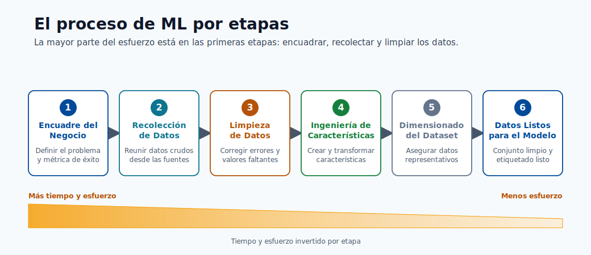
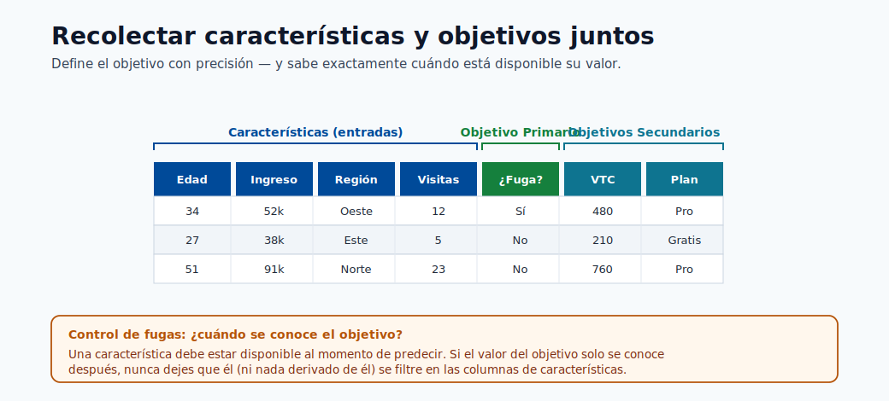
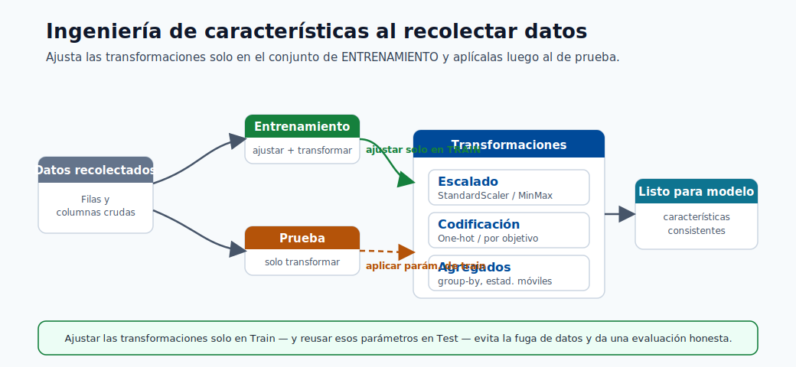
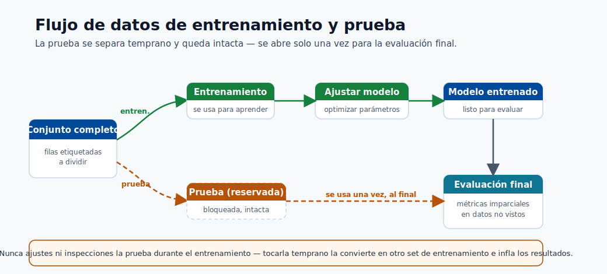
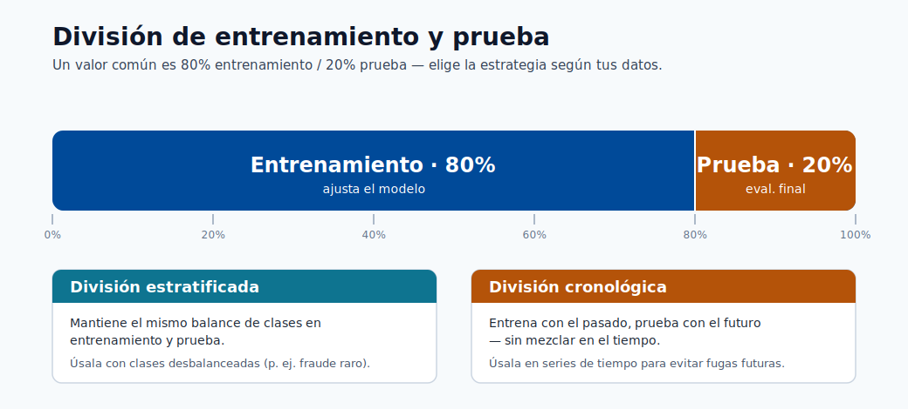
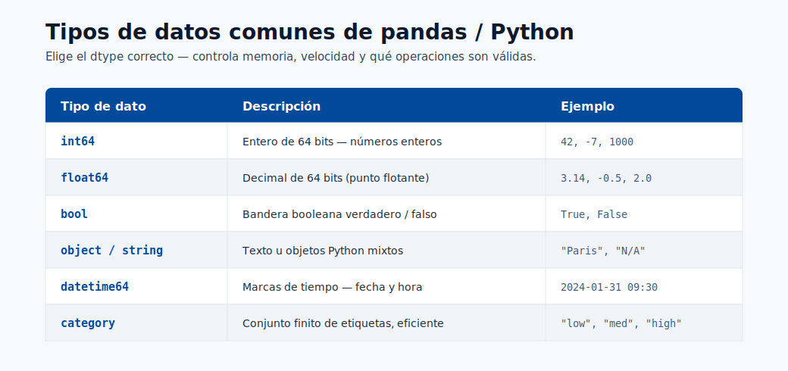

# Preparación de Datos

La preparación de datos es con frecuencia la etapa de mayor esfuerzo en la entrega de ML. Este módulo enseña
cómo pasar de datos brutos a datos listos para el modelo con calidad, reproducibilidad y
prevención de fuga de datos.

## Ciclo de vida de los datos

Esta secuencia ilustra el ciclo de vida: definición del problema de negocio, recolección de datos, ingeniería
de características y dimensionamiento del conjunto de datos para un entrenamiento de modelo confiable.



> **Nota - Qué muestra esto:** El ciclo de vida de los datos por etapa: desde la definición del problema de negocio hasta la recolección y la ingeniería de características.
> La mayor parte del esfuerzo de entrega reside en estas etapas tempranas, y los defectos aquí limitan la calidad que cualquier modelo puede alcanzar.



> **Nota - Qué muestra esto:** Cómo se recopilan los objetivos primarios y secundarios junto con las características. Definir el objetivo
> con precisión (y cuándo se conoce) es lo que más adelante previene la fuga del objetivo.



> **Consejo - Punto práctico:** La ingeniería de características debe ocurrir *mientras* se comprenden los datos, pero las transformaciones deben ajustarse
> solo en la partición de entrenamiento. Diseñar las características y la estrategia de partición juntas es cómo se mantiene
> el preprocesamiento libre de fugas.


> **Consejo - Cómo usar este gráfico:** Haga coincidir su caso de uso con una banda de tamaño de conjunto de datos antes de comprometerse con una familia de modelos. Las
> líneas de base tabulares necesitan mucho menos datos que el aprendizaje profundo; las cargas de trabajo de modelos de base necesitan órdenes de
> magnitud más. Dimensionar los datos primero evita elegir un modelo que no puede alimentar.

> **Nota - Referencia en GB:** En la planificación de conjuntos de datos, el almacenamiento de proveedores es típicamente en unidades decimales:
> 1 KB = 1,000 bytes, 1 MB = 1,000,000 bytes, 1 GB = 1,000,000,000 bytes.
> Las herramientas de memoria pueden mostrar unidades binarias en su lugar: 1 GiB = 1,073,741,824 bytes,
> por lo que 1 GB equivale aproximadamente a 0.93 GiB.

## Lista de verificación de preparación

- Eliminar duplicados y valores nulos
- Validar esquema y tipos de datos
- Dividir conjuntos de entrenamiento y prueba
- Registrar conjuntos de datos en Azure ML

## Dimensiones de calidad de los datos

| Dimensión | Por qué importa |
|---|---|
| Completitud | Los valores faltantes pueden sesgar el entrenamiento |
| Consistencia | La deriva de esquema/tipo rompe los pipelines |
| Exactitud | Las etiquetas ruidosas reducen el techo del modelo |
| Puntualidad | Los datos obsoletos perjudican la relevancia en producción |

## Pipeline mínimo de preprocesamiento

1. Eliminar duplicados y registros inválidos.
2. Definir columnas de características y objetivo.
3. Manejar valores faltantes (estrategia de imputación).
4. Codificar características categóricas.
5. Dividir datos con una estrategia libre de fugas.

División útil:

```python
from sklearn.model_selection import train_test_split
X_train, X_test, y_train, y_test = train_test_split(X, y, test_size=0.33, random_state=1)
```

Para la predicción de series temporales, use divisiones cronológicas (nunca mezcla aleatoria a través del tiempo).

Los siguientes elementos visuales refuerzan cómo los conjuntos de datos supervisados se dividen y validan antes del
entrenamiento, además de una referencia de tipos de datos para prevenir errores de esquema y conversión.



> **Nota - Qué muestra esto:** El flujo de datos a través de las etapas de entrenamiento y prueba. El conjunto de prueba se separa al principio y no
> se toca hasta la evaluación final: la disciplina que mantiene honestos los puntajes fuera de línea.



> **Nota - Qué muestra esto:** Una división de entrenamiento/prueba. Para el desequilibrio de clases use una división *estratificada* para preservar las proporciones de clase; para
> series temporales use una división *cronológica* para que el modelo nunca entrene con datos futuros.



> **Nota - Qué muestra esto:** Una referencia de tipos de datos de Python/pandas. Validar los tipos de datos contra su contrato de datos detecta
> la deriva del esquema y errores de conversión silenciosos antes de que corrompan el entrenamiento.

## Advertencia sobre fuga de datos

La fuga ocurre cuando información futura/del objetivo entra en las características de entrenamiento. Causas típicas:

- Ajustar preprocesadores en los datos completos antes de la división.
- Incluir campos posteriores al resultado.
- División aleatoria en datos temporales.

La fuga crea métricas fuera de línea infladas y un comportamiento deficiente en producción.

### Patrón correcto vs incorrecto en el pipeline

```python
# INCORRECTO: ajustar el escalador en el conjunto de datos completo antes de la división
scaler = StandardScaler()
X_scaled = scaler.fit_transform(X)  # filtra estadísticas de prueba al entrenamiento
X_train, X_test = train_test_split(X_scaled, ...)

# CORRECTO: ajustar el escalador solo en los datos de entrenamiento
X_train, X_test, y_train, y_test = train_test_split(X, y, test_size=0.2, random_state=42)
scaler = StandardScaler()
X_train_scaled = scaler.fit_transform(X_train)  # ajustar solo en entrenamiento
X_test_scaled = scaler.transform(X_test)         # transformar prueba usando estadísticas de entrenamiento
```

Envuelva esto en un `sklearn.pipeline.Pipeline` para que fit/transform siempre se apliquen de manera consistente:

```python
from sklearn.pipeline import Pipeline
from sklearn.preprocessing import StandardScaler
from sklearn.linear_model import LogisticRegression

pipeline = Pipeline([
    ("scaler", StandardScaler()),
    ("model", LogisticRegression())
])
pipeline.fit(X_train, y_train)   # scaler.fit solo en X_train internamente
pipeline.score(X_test, y_test)   # scaler.transform en X_test
```

## Contrato de datos (recomendado)

Defina un contrato antes del entrenamiento para que todos los productores/consumidores estén alineados:

| Campo | Tipo | Anulable | Rango/patrón permitido | Notas |
|---|---|---|---|---|
| `customer_id` | string | No | Regex UUID | Identificador único |
| `event_ts` | datetime | No | ISO-8601 | Marca de tiempo del evento (UTC) |
| `label` | int | Sí | 0 o 1 | Nulo para filas solo de inferencia |
| `amount` | float | No | >= 0 | Característica monetaria |

## Puertas de validación antes del entrenamiento

1. **Puerta de esquema**: columnas y tipos de datos coinciden con el contrato.
2. **Puerta de calidad**: tasas de nulos, tasas de duplicados, comprobaciones de valores atípicos dentro de los umbrales.
3. **Puerta de deriva**: el cambio de distribución de características por debajo de los límites configurados.
4. **Puerta de fuga**: no hay características posteriores al resultado en el conjunto de entrenamiento.

## Estrategias de división por tipo de problema

| Problema | División recomendada | Notas |
|---|---|---|
| Clasificación/regresión tabular IID | División aleatoria entrenamiento/validación/prueba | Usar división estratificada si existe desequilibrio de clases |
| Series temporales | División cronológica (ventanas deslizantes/expansivas) | La mezcla aleatoria destruye el orden temporal |
| Datos correlacionados por entidad (usuarios/dispositivos) | División por grupo por clave de entidad | Previene la filtración de entidades entre particiones |
| Detección de eventos raros | División aleatoria estratificada | Garantiza la clase minoritaria en cada pliegue |

## Inmersión profunda: cada concepto explicado

Esta sección explica el razonamiento detrás de cada paso de preparación para que las reglas se conviertan en
principios que pueda aplicar a nuevos conjuntos de datos.

### Por qué la preparación de datos domina el esfuerzo

Un modelo solo puede aprender la señal que sobrevive en los datos. Cada defecto: una fila mal etiquetada,
una característica con fuga, una unidad inconsistente: establece un techo duro en la calidad alcanzable que ningún
algoritmo puede superar. Este es el significado práctico de "basura entra, basura sale", y
es por eso que los equipos pasan la mayor parte de su tiempo aquí.

### Imputación: cómo elegir cómo llenar los valores faltantes

La **imputación** reemplaza los valores faltantes para que los modelos que no pueden aceptar nulos puedan ejecutarse. El método
codifica una suposición sobre *por qué* falta el valor:

| Estrategia | Suposición | Riesgo |
|---|---|---|
| Relleno por media/mediana | Falta aleatoriamente; el valor central es representativo | Reduce la varianza, oculta la estructura |
| Relleno por moda (categórico) | La categoría más frecuente es un valor predeterminado seguro | Sobre-representa la mayoría |
| Basado en modelo (kNN/MICE) | La ausencia es predecible a partir de otras características | Más costoso, puede filtrarse si se ajusta a todos los datos |
| Indicador de "faltante" | La propia ausencia es informativa | Añade dimensionalidad |

Crucialmente, el imputador debe ser **ajustado solo en la partición de entrenamiento** y luego aplicado a validación
y prueba: de lo contrario, las estadísticas de los datos retenidos se filtran al entrenamiento.

### Codificación de características categóricas

Los modelos operan con números, por lo que las categorías deben convertirse:

- La **codificación one-hot** crea una columna binaria por categoría. Segura para características de baja cardinalidad;
  explota la dimensionalidad para las de alta cardinalidad.
- La **codificación ordinal** mapea categorías a enteros. Solo válida cuando las categorías tienen un verdadero
  orden (p. ej. pequeño/mediano/grande), de lo contrario inventa un ranking falso.
- La **codificación por objetivo/media** reemplaza una categoría con la media del objetivo para esa categoría. Poderosa
  para alta cardinalidad pero una *fuente principal de fuga*: debe calcularse dentro de los pliegues de validación cruzada,
  nunca en el conjunto de datos completo.

Los modelos basados en árboles (y CatBoost nativamente) toleran mejor las categorías brutas que los modelos lineales,
que es parte de la razón por la que dominan los problemas tabulares.

### Por qué escalar, y por qué ajustar solo en entrenamiento

El **escalado de características** (p. ej. `StandardScaler`: restar la media, dividir por la desviación estándar) pone
las características en rangos comparables. Importa para los modelos basados en distancia y gradiente (kNN, SVM,
modelos lineales, redes neuronales) donde una característica de gran magnitud de otro modo dominaría; los modelos de árbol
son invariantes a la escala y no lo necesitan. La media y la desviación estándar del escalador son
*parámetros aprendidos*: ajustarlos en el conjunto de datos completo antes de la división permite que las estadísticas
del conjunto de prueba influyan en la transformación de entrenamiento, la fuga mostrada en el ejemplo INCORRECTO anterior.

### Fuga de datos, formalizada

La **fuga** es cualquier situación donde la información no disponible en el momento de la predicción entra al entrenamiento.
Infla las métricas fuera de línea y colapsa en producción. Tres mecanismos se repiten:

1. **Fuga de preprocesamiento**: ajustar escaladores/imputadores/codificadores en datos que incluyen la partición de prueba.
   Se corrige ajustando las transformaciones dentro de un `Pipeline` *después* de la división.
2. **Fuga del objetivo**: una característica que es un proxy de, o se calcula a partir del resultado (p. ej.
   "account_closed_date" al predecir la cancelación). Se corrige auditando la disponibilidad temporal de cada característica
   en relación con el momento de predicción.
3. **Fuga temporal**: mezclar aleatoriamente datos ordenados en el tiempo para que el modelo "vea el futuro".
   Se corrige con divisiones cronológicas.

El patrón `Pipeline` es la defensa estructural: porque `fit` solo ve datos de entrenamiento y
`transform` se reaaplica de manera idéntica a los datos nuevos, la fuga a través del preprocesamiento se vuelve
imposible por construcción.

### Entrenamiento / validación / prueba y estratificación

- El **entrenamiento** ajusta los parámetros, la **validación** ajusta los hiperparámetros y compara modelos, la **prueba**
  da una estimación final imparcial.
- La **división estratificada** preserva la proporción de clases en cada partición. Sin ella, una clase positiva rara
  (p. ej. 1% de fraude) puede estar sub-representada o ausente en un pliegue, haciendo que las métricas sean ruidosas o
  indefinidas. Estratificar en la etiqueta para clasificación; para series temporales, nunca mezclar en absoluto.

### El contrato de datos y las puertas de validación como cortafuegos de calidad

El **contrato de datos** (esquema, tipos, nulabilidad, rangos) convierte los supuestos implícitos en un
acuerdo aplicable entre los productores de datos y el pipeline de entrenamiento. Las cuatro **puertas de validación**
(esquema, calidad, deriva, fuga) son comprobaciones automatizadas que *bloquean* un conjunto de datos defectuoso para que
nunca llegue al entrenamiento: el equivalente de pruebas unitarias en la ingeniería de datos. Esto desplaza los fallos
hacia la izquierda, donde son baratos de corregir, en lugar de descubrirlos como predicciones de producción degradadas
semanas después.

### Manejo de datos desbalanceados

Muchos problemas de alto valor (fraude, cancelación, defectos) tienen una clase positiva rara. Un modelo ingenuo puede
obtener un 99% de exactitud prediciendo siempre "negativo" sin capturar ningún positivo, por lo que el desbalance
debe manejarse deliberadamente:

| Técnica | Cómo funciona | Precaución |
|---|---|---|
| Pesos de clase | Penalizar más los errores en la clase rara en la pérdida | El más simple, sin cambio de datos; ajustar el peso |
| Sobremuestreo (p. ej. SMOTE) | Sintetizar más ejemplos de la minoría | Ajustar solo en la partición de entrenamiento, nunca antes de la división |
| Submuestreo | Eliminar ejemplos de la mayoría | Descarta datos; usar cuando la mayoría es enorme |
| Ajuste de umbral | Mover el punto de corte de decisión después del entrenamiento | Desacopla el modelo del umbral de negocio |

> **Nota - Remuestrear después de dividir:** Cualquier remuestreo (SMOTE, sobre/submuestreo) debe ocurrir
> *dentro* del pliegue de entrenamiento únicamente. Remuestrear antes de la división filtra vecinos sintéticos de las filas de prueba
> al entrenamiento y produce puntuaciones fuera de línea demasiado optimistas.

### Ejemplo de división estratificada

```python
from sklearn.model_selection import train_test_split

# stratify= garantiza que las proporciones de etiquetas se preserven en cada división
X_train, X_test, y_train, y_test = train_test_split(
    X, y, test_size=0.2, random_state=42, stratify=y
)
```

## Patrones de ingeniería de características

- Numérico: escalado, recorte, transformaciones logarítmicas.
- Categórico: one-hot, codificación por objetivo (con pliegues libres de fugas).
- Tiempo: rezagos, agregados deslizantes, características de calendario/estacionalidad.
- Texto: tokenización, TF-IDF, embeddings.

### Ejemplo de transformación logarítmica (numérico sesgado)

```python
import numpy as np
import pandas as pd

df["amount_log"] = np.log1p(df["amount"])  # log1p = log(1+x), seguro para valores 0
```

### Agregado deslizante (características de series temporales)

```python
df = df.sort_values("event_ts")
df["spend_7d"] = df.groupby("customer_id")["amount"].transform(
    lambda x: x.rolling(window=7, min_periods=1).sum()
)
```

### Codificación por objetivo con protección contra fugas (validación cruzada por pliegues)

```python
from category_encoders import TargetEncoder
from sklearn.model_selection import cross_val_score

enc = TargetEncoder(smoothing=10)
X_encoded = enc.fit_transform(X_train[["category"]], y_train)
# El codificador estima estadísticas dentro del pliegue cuando se usa en un pipeline de validación cruzada
```

## Lista de verificación de reproducibilidad

- Persistir el pipeline de transformación con los artefactos del modelo.
- Versionar los instantáneos del conjunto de datos y las definiciones de esquema.
- Almacenar semillas de división e índices de división para reejecutar exactamente.
- Registrar la lista de características y el orden de características usado para el entrenamiento.

## Autoevaluación rápida

| # | Pregunta | Respuesta |
|---|----------|-----------|
| 1 | ¿Por qué la división aleatoria es incorrecta para la mayoría de las tareas de predicción? | Los datos de predicción están ordenados en el tiempo, así que una división aleatoria filtra información futura al entrenamiento; hay que dividir cronológicamente. |
| 2 | ¿Qué dimensión de calidad se ve afectada por una discrepancia de esquema? | La validez: los datos dejan de ajustarse a los tipos/esquema esperados. |
| 3 | ¿Cuál es una fuente común de fuga de datos? | Ajustar transformaciones (o usar información del objetivo/futura) sobre todo el conjunto antes de separar entrenamiento y prueba. |
| 4 | ¿Por qué un escalador o imputador debe ajustarse solo en la partición de entrenamiento? | Ajustarlo con todos los datos filtra estadísticas de prueba al entrenamiento y produce una evaluación optimista sesgada; ajústalo en entrenamiento y aplícalo a validación/prueba. |
| 5 | ¿Dónde en el pipeline debe ocurrir SMOTE/sobremuestreo, y por qué? | Solo en el pliegue de entrenamiento después de dividir (dentro de la validación cruzada), para que las muestras sintéticas nunca se filtren a validación/prueba. |

---

## Flujo de trabajo de Análisis Exploratorio de Datos (EDA)

El EDA es la investigación sistemática de un conjunto de datos antes del modelado. Su propósito es comprender
la estructura y la calidad de los datos, identificar anomalías, revelar propiedades de distribución y
generar hipótesis de ingeniería de características. Omitir el EDA lleva a sorpresas durante el entrenamiento y
fallos de modelo inexplicados en producción.

Un EDA disciplinado sigue esta secuencia:

```
1. Auditoría de forma y tipos de datos
2. Distribuciones univariadas
3. Relaciones bivariadas
4. Matriz de correlación
5. Detección de valores atípicos
6. Análisis del objetivo
7. Mapa de valores faltantes
```

### Paso 1: Auditoría de forma y tipos de datos

La primera acción es siempre comprender qué se tiene.

```python
import pandas as pd

df = pd.read_csv("dataset.csv")

print(df.shape)          # (filas, columnas)
print(df.dtypes)         # tipo de cada columna
print(df.head())         # primeras cinco filas
print(df.describe())     # conteo, media, desv. est., mín., cuartiles, máx. para numéricos
print(df.info())         # conteos no nulos y tipos de datos juntos
```

Verificar columnas que se leen como `object` cuando deberían ser numéricas (a menudo señala problemas de codificación),
y columnas de fechas y horas analizadas como cadenas. Corregir los tipos de datos antes de cualquier otro análisis.

```python
# Corregir problemas comunes de tipos de datos
df["event_ts"] = pd.to_datetime(df["event_ts"])
df["amount"] = pd.to_numeric(df["amount"], errors="coerce")  # convertir valores incorrectos a NaN
```

### Paso 2: Distribuciones univariadas

Para cada característica, comprender la distribución marginal independientemente de otras características.

```python
import matplotlib.pyplot as plt

# Numérico: histograma + KDE
df["amount"].plot(kind="hist", bins=50, figsize=(8, 4), title="Distribución de amount")
plt.show()

# Categórico: gráfico de barras de conteos de valores
df["category"].value_counts().plot(kind="bar", figsize=(8, 4), title="Frecuencia de categoría")
plt.show()

# Estadísticas resumidas para todos los numéricos
print(df.describe(percentiles=[0.01, 0.05, 0.25, 0.5, 0.75, 0.95, 0.99]))
```

Aspectos clave a notar: sesgo fuerte hacia la derecha (señala transformación logarítmica), multimodalidad (puede indicar
subpoblaciones) y varianza casi nula (características casi constantes no tienen señal).

### Paso 3: Gráficos bivariados

Explorar relaciones entre pares de características y entre cada característica y el objetivo.

```python
import seaborn as sns

# Dispersión: numérico vs numérico
sns.scatterplot(data=df, x="feature_a", y="feature_b", hue="label", alpha=0.4)
plt.show()

# Diagrama de caja: numérico vs objetivo categórico
sns.boxplot(data=df, x="label", y="amount")
plt.show()

# Diagrama de violín para comparación de distribución más rica
sns.violinplot(data=df, x="label", y="amount", inner="quartile")
plt.show()
```

> **Consejo - Superposición de puntos en conjuntos de datos grandes:** Cuando `n > 100,000`, muestrear antes de graficar para evitar
> cuellos de botella de renderizado: `df.sample(10_000, random_state=42)`.

### Paso 4: Matriz de correlación

La matriz de correlación de Pearson muestra las relaciones lineales por pares entre características numéricas.

```python
import seaborn as sns
import matplotlib.pyplot as plt

corr = df.select_dtypes(include="number").corr()

plt.figure(figsize=(12, 10))
sns.heatmap(corr, annot=True, fmt=".2f", cmap="coolwarm", center=0,
            linewidths=0.5, vmin=-1, vmax=1)
plt.title("Matriz de correlación de Pearson")
plt.tight_layout()
plt.show()
```

Los valores cercanos a $\pm 1$ indican características casi colineales; una de ellas a menudo puede eliminarse sin
perder información. Una alta correlación entre una característica y el objetivo es una señal fuerte de
poder predictivo, pero verifique que no sea fuga del objetivo.

> **Nota - Limitaciones de Pearson:** Pearson mide solo la asociación *lineal*. Use la correlación de rango de Spearman
> (`corr(method='spearman')`) para relaciones no lineales monótonas, y la información mutua para dependencias arbitrarias.

### Paso 5: Detección de valores atípicos

Los valores atípicos son observaciones extremas que pueden distorsionar el entrenamiento del modelo, particularmente para los modelos lineales
y los métodos basados en distancia.

```python
# Método z-score: marcar observaciones a más de 3 desv. est. de la media
from scipy import stats
import numpy as np

z_scores = np.abs(stats.zscore(df.select_dtypes(include="number")))
outlier_mask = (z_scores > 3).any(axis=1)
print(f"Filas atípicas (z > 3): {outlier_mask.sum()}")

# Método IQR: más robusto para colas pesadas
Q1 = df["amount"].quantile(0.25)
Q3 = df["amount"].quantile(0.75)
IQR = Q3 - Q1
lower = Q1 - 1.5 * IQR
upper = Q3 + 1.5 * IQR
print(df[(df["amount"] < lower) | (df["amount"] > upper)].shape[0], "valores atípicos IQR")
```

Opciones de tratamiento de valores atípicos: recorte (limitar al percentil 99), eliminación (solo si es claramente erróneo)
o modelado robusto (los modelos de árbol toleran bien los valores atípicos).

### Paso 6: Análisis del objetivo

Comprender la distribución del objetivo es crítico antes de cualquier decisión de modelado.

```python
# Clasificación: verificar el desequilibrio de clases
print(df["label"].value_counts(normalize=True))
# Si la clase minoritaria < 5%, planificar el manejo del desequilibrio

# Regresión: verificar el sesgo del objetivo
print(f"Sesgo del objetivo: {df['target'].skew():.3f}")
# |sesgo| > 1 sugiere transformación logarítmica del objetivo para modelos lineales

# Graficar distribución del objetivo
df["target"].plot(kind="hist", bins=40, title="Distribución del objetivo")
plt.show()
```

> **Nota - Umbral de desequilibrio:** Un desequilibrio de clases por debajo del 10% en la minoría merece manejo explícito.
> Por debajo del 1% (eventos raros), la exactitud estándar no tiene sentido; use AUC de precisión-recall en su lugar.

### Paso 7: Mapa de valores faltantes

Visualizar y cuantificar los valores faltantes para decidir estrategias de imputación.

```python
import missingno as msno   # pip install missingno

# Gráfico matricial: muestra el patrón de ausencia en todas las filas
msno.matrix(df, figsize=(12, 6))
plt.show()

# Gráfico de barras: fracción faltante por columna
msno.bar(df, figsize=(12, 4))
plt.show()

# Tabla resumen
missing_summary = df.isnull().mean().sort_values(ascending=False)
print(missing_summary[missing_summary > 0])
```

Si dos columnas faltan en las mismas filas, pueden compartir una causa común: esto puede informar
una característica indicadora de "ausencia" que en sí misma tiene poder predictivo.

---

## Inmersión profunda en la ingeniería de características

La ingeniería de características es el proceso de transformar columnas brutas en representaciones que exponen
señal al modelo. Es la palanca individual más grande para mejorar el rendimiento en datos tabulares.
Las siguientes subsecciones cubren transformaciones numéricas, construcción de interacciones, características temporales
y representaciones de texto.

### Transformaciones de características numéricas

Las características numéricas brutas rara vez están en la forma óptima para el aprendizaje. El problema más común es
el **sesgo**: una cola larga a la derecha significa que la mayoría de los valores se agrupan cerca de cero mientras que unos pocos valores extremos
dominan la escala.

La **transformación logarítmica** es la solución más simple para características con sesgo a la derecha y estrictamente positivas:

$$
x' = \log(1 + x)
$$

Usar $\log(1+x)$ (implementado como `np.log1p`) evita valores indefinidos en $x=0$.

```python
import numpy as np

df["revenue_log"] = np.log1p(df["revenue"])
print(f"Antes: sesgo={df['revenue'].skew():.2f}")
print(f"Después:  sesgo={df['revenue_log'].skew():.2f}")
```

La **transformación Box-Cox** encuentra la potencia óptima $\lambda$ para normalizar una distribución. Requiere
valores estrictamente positivos:

$$
x'(\lambda) = \begin{cases} \frac{x^\lambda - 1}{\lambda} & \lambda \neq 0 \\ \ln x & \lambda = 0 \end{cases}
$$

```python
from scipy.stats import boxcox

df["revenue_bc"], lambda_bc = boxcox(df["revenue"] + 1)  # +1 garantiza positividad
print(f"Lambda óptimo: {lambda_bc:.4f}")
```

La **transformación Yeo-Johnson** extiende Box-Cox para manejar valores cero y negativos:

$$
x'(\lambda) = \begin{cases}
\frac{(x+1)^\lambda - 1}{\lambda} & x \geq 0,\, \lambda \neq 0 \\
\ln(x+1) & x \geq 0,\, \lambda = 0 \\
\frac{-((-x+1)^{2-\lambda} - 1)}{2 - \lambda} & x < 0,\, \lambda \neq 2 \\
-\ln(-x+1) & x < 0,\, \lambda = 2
\end{cases}
$$

```python
from sklearn.preprocessing import PowerTransformer

pt = PowerTransformer(method="yeo-johnson")
df_transformed = pt.fit_transform(df[["revenue", "spend"]])
```

**Cuándo usar cuál:**

| Transformación | Requisitos | Mejor para |
|---|---|---|
| Log / log1p | $x \geq 0$ | Ingresos, conteos, precios |
| Box-Cox | $x > 0$ | Estrictamente positivo, distribución desconocida |
| Yeo-Johnson | Cualquier signo | Propósito general, predeterminado recomendado |
| Transformación cuantil | Cualquiera | Cuando importa la normalidad basada en rango |

> **Nota - Escalar antes de modelos lineales, no de árboles:** Los modelos basados en árboles son invariantes a las transformaciones
> monótonas de características individuales. Las transformaciones de potencia importan más para los modelos lineales, SVMs
> y redes neuronales donde la escala y distribución de las entradas afectan la optimización.

### Características de interacción

Algunas señales predictivas solo existen en la *combinación* de dos características. Una sola característica puede
ser poco informativa; multiplicada o dividida, se vuelve muy predictiva.

**Características producto** capturan efectos multiplicativos:

```python
df["length_x_width"] = df["length"] * df["width"]       # proxy de área
df["price_x_qty"]    = df["unit_price"] * df["quantity"] # proxy de ingresos
```

**Características de ratio** normalizan una característica por otra:

```python
df["spend_per_visit"]    = df["total_spend"] / (df["visit_count"] + 1)
df["click_through_rate"] = df["clicks"] / (df["impressions"] + 1)
```

**Características polinomiales** expanden todas las características al grado $d$, incluidos los productos cruzados:

```python
from sklearn.preprocessing import PolynomialFeatures

poly = PolynomialFeatures(degree=2, interaction_only=False, include_bias=False)
X_poly = poly.fit_transform(X[["age", "income", "tenure"]])
print(f"Original: 3 características -> Polinomial grado-2: {X_poly.shape[1]} características")
```

> **Nota - Maldición de la dimensionalidad:** Las características polinomiales de grado 2 con $p$ características originales producen $O(p^2)$ nuevas características.
> Al grado 3, $O(p^3)$. Con $p=100$ características y grado 2, se obtienen aproximadamente 5,000 características,
> más de lo que la mayoría de los conjuntos de datos pueden soportar. Use el conocimiento del dominio para seleccionar interacciones manualmente,
> o use `interaction_only=True` con un modelo regularizado para que la penalización elimine las poco informativas.

### Características de fecha y hora

Las marcas de tiempo brutas son opacas para la mayoría de los modelos. Descomponerlas en campos de calendario numéricos expone
patrones estacionales y cíclicos.

```python
import pandas as pd
import numpy as np

df["event_ts"] = pd.to_datetime(df["event_ts"])

# Descomposición de calendario
df["year"]       = df["event_ts"].dt.year
df["month"]      = df["event_ts"].dt.month       # 1-12
df["day"]        = df["event_ts"].dt.day         # 1-31
df["hour"]       = df["event_ts"].dt.hour        # 0-23
df["weekday"]    = df["event_ts"].dt.dayofweek   # 0=Lunes, 6=Domingo
df["is_weekend"] = (df["weekday"] >= 5).astype(int)
df["quarter"]    = df["event_ts"].dt.quarter
```

La **codificación cíclica** evita que el modelo trate la hora 23 como "lejos" de la hora 0. Codifique
las características circulares con proyecciones de seno y coseno:

$$
\text{hour\_sin} = \sin\!\left(\frac{2\pi \cdot \text{hour}}{24}\right), \quad
\text{hour\_cos} = \cos\!\left(\frac{2\pi \cdot \text{hour}}{24}\right)
$$

```python
df["hour_sin"]  = np.sin(2 * np.pi * df["hour"] / 24)
df["hour_cos"]  = np.cos(2 * np.pi * df["hour"] / 24)

# Mismo patrón para mes (período=12) y día de semana (período=7)
df["month_sin"] = np.sin(2 * np.pi * df["month"] / 12)
df["month_cos"] = np.cos(2 * np.pi * df["month"] / 12)
```

**Días desde el evento** captura la recencia:

```python
reference_date = pd.Timestamp("2024-01-01")
df["days_since_signup"]    = (df["event_ts"] - df["signup_ts"]).dt.days
df["days_since_reference"] = (df["event_ts"] - reference_date).dt.days
```

### Características de texto

Cuando las características incluyen columnas de texto libre, deben codificarse numéricamente antes del entrenamiento.

**Bolsa de palabras (BoW)** cuenta las ocurrencias de términos por documento:

```python
from sklearn.feature_extraction.text import CountVectorizer

cv = CountVectorizer(max_features=5000, stop_words="english")
X_bow = cv.fit_transform(df["description"])   # matriz dispersa (n_docs, vocab_size)
```

**TF-IDF** reduce el peso de los términos que aparecen en casi todos los documentos (valor discriminativo bajo):

$$
\text{TF-IDF}(t, d) = \text{TF}(t, d) \cdot \log\frac{N}{df(t)}
$$

donde $\text{TF}(t,d)$ es la frecuencia del término $t$ en el documento $d$, $N$ es el número total de
documentos, y $df(t)$ es el número de documentos que contienen el término $t$.

```python
from sklearn.feature_extraction.text import TfidfVectorizer

tfidf = TfidfVectorizer(max_features=10_000, ngram_range=(1, 2), sublinear_tf=True)
X_tfidf = tfidf.fit_transform(df["description"])
```

**Los N-gramas** extienden BoW/TF-IDF para capturar frases de múltiples palabras. `ngram_range=(1, 2)` incluye
unigramas y bigramas, p. ej. "no bueno" como un solo token junto con "no" y "bueno".

**Los embeddings** mapean el texto a un espacio semántico denso de baja dimensión (p. ej. sentence-transformers
o embeddings de OpenAI). Capturan el significado en lugar de solo la superposición de términos:

```python
from sentence_transformers import SentenceTransformer

model = SentenceTransformer("all-MiniLM-L6-v2")
embeddings = model.encode(df["description"].tolist(), show_progress_bar=True)
# forma de embeddings: (n_docs, 384)
```

**Cuándo usar cada uno:**

| Método | Dimensionalidad | Captura semántica | Costo de entrenamiento | Mejor para |
|---|---|---|---|---|
| Bolsa de palabras | Alta (tamaño del vocabulario) | No | Muy bajo | Problemas dominados por palabras clave |
| TF-IDF | Alta (tamaño del vocabulario) | Parcialmente | Muy bajo | Línea de base de clasificación de documentos |
| N-gramas (bi/tri) | Muy alta | Parcialmente | Bajo | Sentimiento, detección de frases |
| Embeddings preentrenados | Baja (128-1536) | Sí | Bajo (solo inferencia) | Similitud semántica, pocos datos |

---

## Reducción de dimensionalidad

Los espacios de características de alta dimensión causan varios problemas: dispersión, multicolinealidad, entrenamiento lento
y sobreajuste. La reducción de dimensionalidad condensa el espacio preservando la mayor
estructura útil posible.

### PCA desde cero

El Análisis de Componentes Principales encuentra las direcciones (componentes principales) de máxima varianza en
los datos y proyecta los datos sobre un subespacio de menor dimensión.

**Algoritmo:**

1. Centrar los datos: $\tilde{X} = X - \bar{X}$
2. Calcular la matriz de covarianza: $C = \frac{1}{n-1}\tilde{X}^T\tilde{X}$
3. Calcular vectores propios y valores propios: $C v_k = \lambda_k v_k$
4. Ordenar por valor propio descendente; conservar los $k$ vectores propios superiores.
5. Proyectar: $Z = \tilde{X} W_k$ donde $W_k$ contiene los $k$ vectores propios superiores como columnas.

La **ratio de varianza explicada** del componente $k$ es $\frac{\lambda_k}{\sum_j \lambda_j}$.

```python
import numpy as np
import matplotlib.pyplot as plt
from sklearn.preprocessing import StandardScaler
from sklearn.decomposition import PCA

# Escalar primero: PCA es sensible a la magnitud de las características
scaler = StandardScaler()
X_scaled = scaler.fit_transform(X_train)

# Ajustar PCA solo en los datos de entrenamiento
pca = PCA()
pca.fit(X_scaled)

# Gráfico de sedimentación: visualizar la varianza explicada por componente
plt.figure(figsize=(9, 4))
plt.plot(np.cumsum(pca.explained_variance_ratio_), marker="o")
plt.axhline(0.95, color="red", linestyle="--", label="Umbral del 95%")
plt.xlabel("Número de componentes")
plt.ylabel("Varianza explicada acumulada")
plt.title("Gráfico de sedimentación de PCA")
plt.legend()
plt.tight_layout()
plt.show()

# Elegir k componentes que expliquen el 95% de la varianza
k = np.argmax(np.cumsum(pca.explained_variance_ratio_) >= 0.95) + 1
print(f"Componentes para el 95% de varianza: {k}")

pca_k = PCA(n_components=k)
X_train_pca = pca_k.fit_transform(X_scaled)
X_test_pca  = pca_k.transform(scaler.transform(X_test))
```

**Limitaciones de PCA:**

- Solo captura la estructura de varianza *lineal*; no puede desenrollar una variedad.
- Los componentes principales son combinaciones lineales de todas las características originales, por lo que no son
  directamente interpretables.
- Sensible a los valores atípicos (que distorsionan la matriz de covarianza).
- No tiene en cuenta la variable objetivo; los componentes que explican la varianza en $X$ pueden no ser
  los componentes que explican la varianza en $y$.
