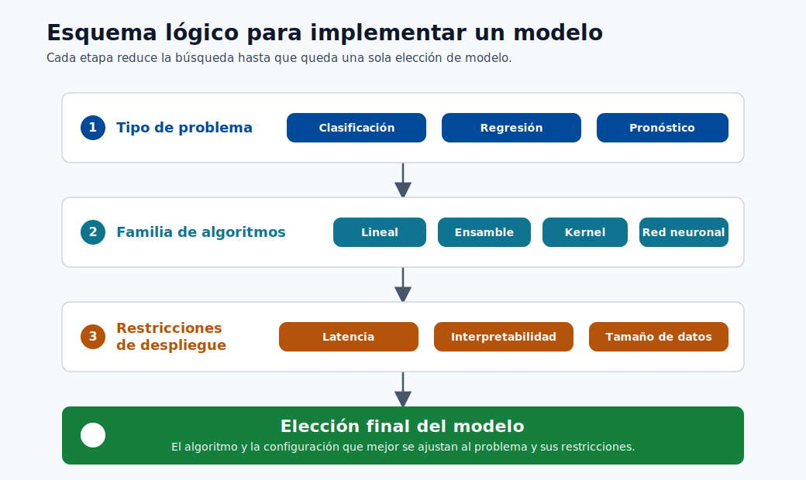
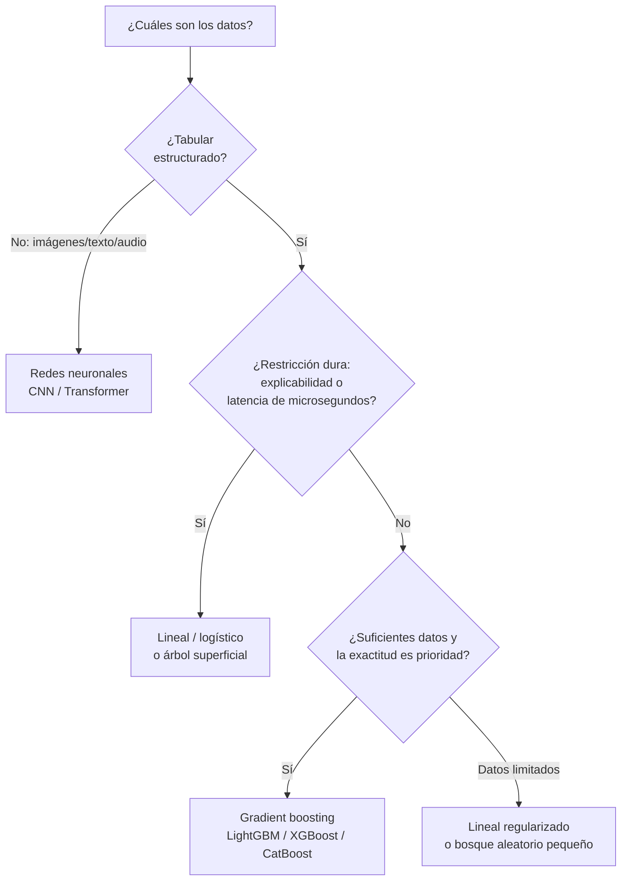

# Tipos de Modelos



> **Nota - Qué muestra esto:** Un esquema lógico para implementar un modelo: desde el tipo de problema hasta la familia de algoritmos y las restricciones de despliegue.
> Úselo para rastrear cómo una pregunta de negocio se reduce a una elección de modelo específica.

Este módulo conecta las familias de algoritmos con los tipos de problemas y las restricciones de despliegue.

## Algoritmos comunes por tarea

- Clasificación: regresión logística, bosque aleatorio, gradient boosting, SVM
- Regresión: regresión lineal, regresor de bosque aleatorio, XGBoost
- Predicción: AutoARIMA, Prophet, variantes de gradient boosting

## Guía rápida de familias de modelos

| Familia | Fortaleza | Debilidad | Uso típico |
|---|---|---|---|
| Modelos lineales | Rápidos, interpretables | Capacidad no lineal limitada | Líneas de base, regresión tabular |
| Conjuntos de árboles | Buen rendimiento tabular | Mayor memoria/latencia | Datos de negocio estructurados |
| Métodos de kernel | Buen comportamiento basado en márgenes | Escala deficiente en datos muy grandes | Clasificación de tamaño mediano |
| Redes neuronales | Alto poder representacional | Intensivos en datos y ajuste | Visión, PLN, patrones complejos |

Objetivo regularizado:

$$
\min_{\theta} \frac{1}{N}\sum_{i=1}^{N}\mathcal{L}(f_{\theta}(x_i), y_i) + \lambda R(\theta)
$$

## Formas matemáticas representativas

Probabilidad de regresión logística:

$$
\hat{p}=\sigma(\theta^T x)=\frac{1}{1+e^{-\theta^T x}}
$$

Interpretación de la frontera de decisión:

- Si $\hat{p} > \tau$, predecir clase positiva.
- El umbral $\tau$ debe ajustarse según el trade-off de costo del negocio.

Regla de decisión de Naive Bayes:

$$
P(y\mid x_1,\dots,x_n)\propto P(y)\prod_{i=1}^{n}P(x_i\mid y)
$$

Nota sobre el supuesto: Naive Bayes asume independencia condicional de las características.

Objetivo Elastic Net:

$$
\min_{\theta}\frac{1}{2N}\|y-X\theta\|_2^2+\lambda\left(\alpha\|\theta\|_1+\frac{1-\alpha}{2}\|\theta\|_2^2\right)
$$

LightGBM y los modelos de gradient boosting construyen árboles aditivos:

$$
F_m(x)=F_{m-1}(x)+\nu\,h_m(x)
$$

donde $h_m(x)$ es el aprendiz débil ajustado en la etapa $m$ y $\nu$ es la tasa de aprendizaje.

## Selección práctica de modelos

| Restricción | Preferencia |
|---|---|
| Necesita explicabilidad | Modelos lineales, árboles superficiales |
| Mejor exactitud tabular | Gradient boosting (LightGBM/XGBoost/CatBoost) |
| Latencia muy baja | Modelo lineal u optimizado de árbol |
| Datos de entrenamiento limitados | Modelos regularizados más simples |
| Características dispersas de alta dimensión | Modelos lineales dispersos (SGDClassifier, Elastic Net) |
| Mezcla de numérico + categórico | Conjuntos de árboles o CatBoost (manejo nativo de categorías) |

## Intuición de los árboles de decisión

Los árboles de decisión dividen los datos maximizando una medida de pureza en cada nodo:

$$
\text{Impureza de Gini} = 1 - \sum_{k=1}^{K} p_k^2
$$

$$
\text{Ganancia de información} = H(S) - \sum_{v} \frac{|S_v|}{|S|} H(S_v)
$$

donde $H(S) = -\sum_k p_k \log_2 p_k$ es la entropía del conjunto $S$.

Los árboles profundos sobreajustan. Los bosques aleatorios promedian muchos árboles entrenados en muestras bootstrap y subconjuntos aleatorios de características. Esto reduce la varianza sin un gran aumento en el sesgo.

## Mecánica del gradient boosting

El gradient boosting construye árboles de forma iterativa para corregir los errores residuales:

| Iteración | Qué se aprende |
|---|---|
| 0 | Predicción base (media o frecuencia de clase) |
| 1 | Árbol ajustado al gradiente de la pérdida (residuos de primer orden) |
| 2 | Árbol ajustado a los residuos restantes |
| ... | Cada paso reduce los residuos hacia cero |

Hiperparámetros clave que más importan:

| Parámetro | Efecto |
|---|---|
| `n_estimators` | Más árboles = más capacidad (riesgo: sobreajuste sin parada temprana) |
| `learning_rate` (reducción $\nu$) | Más pequeño = más conservador, generalmente mejor con más árboles |
| `max_depth` / `num_leaves` | Controla la complejidad del árbol (principal control de sobreajuste) |
| `min_child_samples` | Regulariza el tamaño de la hoja |
| `subsample` / `colsample_bytree` | Muestreo estocástico de columnas/filas, reduce la varianza |

## Sesgo, varianza y complejidad

- Aumentar la complejidad del modelo generalmente reduce el sesgo pero aumenta la varianza.
- La regularización, la poda y la parada temprana son controles prácticos.

## Consideraciones avanzadas

- Calibración: las probabilidades predichas deben reflejar la frecuencia real de los eventos.
- Equidad: evaluar el rendimiento por grupos, no solo la puntuación global.
- Robustez: probar bajo ruido, valores faltantes y distribuciones desplazadas.

## Métodos de ensamble en la práctica

Tres patrones principales de ensamble más allá del gradient boosting:

| Método | Idea | Beneficio |
|---|---|---|
| Bagging | Entrenar modelos en muestras bootstrap, promediar predicciones | Reduce la varianza |
| Boosting | Entrenar modelos secuencialmente, cada uno corrigiendo al anterior | Reduce el sesgo iterativamente |
| Stacking | Entrenar un metamodelo en las predicciones fuera del pliegue de los modelos base | A menudo la mejor exactitud final |

Ejemplo de stacking (2 capas):

```python
from sklearn.ensemble import StackingClassifier
from sklearn.linear_model import LogisticRegression
from sklearn.ensemble import RandomForestClassifier
from lightgbm import LGBMClassifier

estimators = [
    ("rf", RandomForestClassifier(n_estimators=100)),
    ("lgbm", LGBMClassifier(n_estimators=200)),
]
stacker = StackingClassifier(estimators=estimators, final_estimator=LogisticRegression())
stacker.fit(X_train, y_train)
```

## Trade-off de complejidad del algoritmo y latencia

| Tipo de modelo | Latencia de inferencia | Huella de memoria | Notas |
|---|---|---|---|
| Regresión logística | Muy baja (us) | Muy pequeña | Una sola multiplicación de matrices |
| Árbol de decisión superficial | Baja (us) | Pequeña | Recorrido del árbol |
| Bosque aleatorio (100 árboles) | Media (ms) | Media | N recorridos de árbol |
| LightGBM (1000 árboles) | Baja-media | Media | Por hojas, bien optimizado |
| Red neuronal profunda | Alta (ms-s en CPU) | Grande | Se prefiere la inferencia por lotes |

## Inmersión profunda: cada concepto explicado

Esta sección conecta las ecuaciones anteriores con la intuición y los trade-offs de ingeniería.

### Modelos lineales y logísticos: la línea de base interpretable

Un **modelo lineal** predice $\hat y = \theta^T x$: cada característica contribuye con un voto ponderado, y
el peso $\theta_j$ es directamente legible como "efecto de la característica $j$". La **regresión logística**
envuelve esto en la **sigmoide** $\sigma(z) = \tfrac{1}{1+e^{-z}}$, que comprime cualquier número real
en $(0,1)$ para que la salida sea una probabilidad válida. El modelo es lineal en *log-odds*: un cambio unitario
en $x_j$ multiplica las odds por $e^{\theta_j}$. Esta transparencia es por qué los modelos lineales
siguen siendo la línea de base predeterminada y la elección cuando los reguladores requieren decisiones explicables.

### El umbral de decisión $\tau$ es una palanca de negocio, no una constante

Un clasificador produce una probabilidad; convertirla en sí/no necesita un **umbral** $\tau$
(predeterminado 0.5). Mover $\tau$ intercambia precisión por recall: un equipo de fraude que teme el fraude no detectado
baja $\tau$ (captura más, acepta más falsas alarmas); un equipo que teme bloquear buenos
clientes lo sube. El $\tau$ correcto está determinado por el *costo relativo* de los dos tipos de error, no
por el algoritmo: por eso los umbrales se ajustan después del entrenamiento, considerando el costo del negocio.

### Naive Bayes y el supuesto de independencia

$P(y\mid x) \propto P(y)\prod_i P(x_i\mid y)$ proviene directamente de la regla de Bayes, con un
supuesto simplificador ("ingenuo"): las características son **condicionalmente independientes dada la clase**.
Esto casi nunca es literalmente cierto, sin embargo el modelo funciona sorprendentemente bien para texto/spam porque
necesita muy pocos datos y el entrenamiento es simplemente contar frecuencias. Conocer el supuesto le indica
su modo de fallo: las características fuertemente correlacionadas tienen su evidencia contada doble.

### Árboles, impureza y por qué los ensambles superan a los árboles individuales

Un **árbol de decisión** divide repetidamente los datos para que cada grupo resultante sea más "puro":

- La **impureza de Gini** $1-\sum_k p_k^2$ y la **entropía** $-\sum_k p_k\log_2 p_k$ miden cuán
  mezcladas están las etiquetas de un nodo; se elige una división para reducir esto al máximo (**ganancia de información**).
- Un árbol profundo individual memoriza los datos de entrenamiento → **alta varianza / sobreajuste**.
- Los **bosques aleatorios** corrigen esto mediante **bagging**: entrenan muchos árboles en muestras bootstrap con
  subconjuntos aleatorios de características y los promedian. Promediar árboles descorrelacionados cancela sus errores individuales,
  reduciendo la varianza con poco aumento de sesgo.

### El gradient boosting toma la ruta opuesta: construir árboles secuencialmente

El **gradient boosting** toma la ruta opuesta: construye árboles **secuencialmente**, cada uno ajustado a
los *errores residuales* (el gradiente de la pérdida) del ensemble actual. La actualización
$F_m(x) = F_{m-1}(x) + \nu\,h_m(x)$ añade cada nuevo aprendiz débil escalado por la **reducción**
$\nu$. Un $\nu$ pequeño con muchos árboles es la conocida receta para la mejor exactitud tabular.

### Los hiperparámetros de boosting y lo que realmente controlan

- `n_estimators` es la *capacidad*: más árboles ajustan estructuras más finas pero sobreajustan sin parada temprana en un conjunto de validación.
- `learning_rate` ($\nu$) es la *cautela por paso*: más bajo significa que cada árbol corrige menos, por lo que el ensemble generaliza mejor, pero necesita proporcionalmente más árboles.
- `max_depth` / `num_leaves` es el *principal control de sobreajuste*: limita cuán complejo puede ser cualquier árbol individual.
- `subsample` / `colsample_bytree` inyectan **estocasticidad** (muestreo de filas/columnas) que descorrelaciona árboles y reduce la varianza, como lo hace un bosque aleatorio.

### Bagging vs boosting vs stacking: una oración cada uno

- El **bagging** reduce la **varianza** promediando modelos independientes (bosque aleatorio).
- El **boosting** reduce el **sesgo** corrigiendo secuencialmente los errores (XGBoost/LightGBM).
- El **stacking** entrena un **metamodelo** en las predicciones fuera del pliegue de modelos base diversos para
  explotar sus fortalezas complementarias: generalmente la mayor exactitud, a costa de complejidad y latencia.

### Calibración, equidad, robustez: las preocupaciones de nivel de producción

- **Calibración**: un modelo está calibrado si, entre las predicciones de "70% de probabilidad", aproximadamente el 70%
  son realmente positivos. Los árboles boosteados a menudo están *mal calibrados* y se benefician de la escala de Platt
  o la regresión isotónica antes de que las probabilidades se usen en las decisiones.
- **Equidad**: la exactitud agregada puede ocultar que un modelo tiene peor rendimiento para un subgrupo. Siempre
  evaluar las métricas *por segmento*, no solo globalmente.
- **Robustez**: los datos de producción son más ruidosos que los datos de entrenamiento; probar el modelo bajo ruido inyectado,
  campos faltantes y distribuciones desplazadas antes de confiar en él.

### Por qué la latencia y la memoria pertenecen a la selección del modelo

La tabla de latencia/huella es un recordatorio de que el "mejor" modelo es el que cumple
*todas* las restricciones. Un ensemble de 1000 árboles que añade 30 ms por llamada puede violar un SLA en tiempo real, mientras
que una única multiplicación de matrices de regresión logística sirve en microsegundos. La exactitud es necesaria pero
nunca suficiente: el costo, la latencia, la interpretabilidad y la mantenibilidad son criterios de selección co-iguales.

## Un diagrama de flujo de selección de modelos

La mayoría de las elecciones de modelos tabulares se reducen a pocas preguntas sobre el tipo de datos, el tamaño y las restricciones.
Este flujo es un primer pasaje rápido; siempre confirmar con una línea de base validada.



> **Consejo - Empezar simple, escalar con evidencia:** Siempre ajustar primero una línea de base barata (regresión logística
> o un árbol pequeño). Solo pasar a boosting o deep learning cuando el error de la línea de base es genuinamente
> el cuello de botella y la exactitud adicional vale el costo y la latencia añadidos.

## Cuándo realmente optar por el deep learning

El deep learning no es un predeterminado para los datos tabulares; el gradient boosting generalmente lo iguala o supera
allí a una fracción del costo. Optar por redes neuronales cuando se cumple una de estas condiciones:

| Situación | Por qué ganan las redes neuronales |
|---|---|
| Entrada no estructurada (imágenes, audio, texto sin procesar) | Aprenden la representación de características automáticamente |
| Conjuntos de datos muy grandes (millones+ de ejemplos) | La capacidad escala con los datos; el boosting se estanca |
| Interacciones de características complejas que la ingeniería manual no puede capturar | Las capas profundas componen características jerárquicamente |
| El transfer learning desde un modelo preentrenado está disponible | El fine-tuning supera el entrenamiento desde cero en datos pequeños |

## Autoevaluación rápida

| # | Pregunta | Respuesta |
|---|----------|-----------|
| 1 | ¿Por qué la regresión logística sigue siendo la línea de base predeterminada a pesar de su simplicidad? | Es rápida, interpretable y bien calibrada, y establece una referencia sólida que los modelos más complejos deben superar. |
| 2 | ¿Qué intercambia el parámetro de reducción $\nu$ (learning_rate) en el gradient boosting? | Velocidad de aprendizaje frente a precisión/sobreajuste: un $\nu$ más pequeño requiere más árboles pero generaliza mejor. |
| 3 | ¿En qué se diferencian el bagging, el boosting y el stacking, en una oración cada uno? | El bagging entrena modelos independientes en paralelo sobre bootstraps y los promedia para reducir la varianza; el boosting entrena modelos en secuencia, cada uno corrigiendo los errores del anterior para reducir el sesgo; el stacking entrena un metamodelo sobre las predicciones de los modelos base. |
| 4 | Un modelo boosteado produce "0.7" pero solo el 50% de esos casos son positivos: ¿cuál es el problema y cómo se corrige? | El modelo está mal calibrado; aplica escala de Platt o regresión isotónica para corregir sus probabilidades. |
| 5 | Nombre dos razones para elegir una red neuronal sobre el gradient boosting. | Datos no estructurados como imágenes, texto o audio, y conjuntos de datos muy grandes donde ayuda el aprendizaje de representaciones/transferencia. |

---

## Máquinas de Vectores de Soporte: derivación completa

### El problema de maximización del margen

Una Máquina de Vectores de Soporte (SVM) encuentra el hiperplano que separa dos clases con el
**margen máximo**: la distancia desde el hiperplano hasta el punto de entrenamiento más cercano en cada lado.
Maximizar el margen produce una mejor generalización: cuanto más ancha es la calle entre clases,
menos sensible es la frontera de decisión a pequeñas perturbaciones en los datos de entrenamiento.

Para un problema de clasificación binaria con etiquetas $y_i \in \{-1, +1\}$ y vectores de características $x_i$,
la **formulación primal** es:

$$
\min_{w, b} \frac{1}{2}\|w\|^2 \quad \text{sujeto a} \quad y_i(w^T x_i + b) \geq 1 \quad \forall i
$$

El ancho del margen es $\frac{2}{\|w\|}$, así que minimizar $\|w\|^2$ maximiza el margen. Los puntos
donde la restricción es activa ($y_i(w^T x_i + b) = 1$) son los **vectores de soporte**: son
los únicos puntos de entrenamiento que definen la frontera.

### Extensión de margen suave

Los datos reales rara vez son linealmente separables. La **SVM de margen suave** permite violaciones de restricciones
mediante variables de holgura $\xi_i \geq 0$:

$$
\min_{w, b, \xi} \frac{1}{2}\|w\|^2 + C \sum_{i=1}^n \xi_i
\quad \text{s.a.} \quad y_i(w^T x_i + b) \geq 1 - \xi_i, \quad \xi_i \geq 0
$$

El hiperparámetro $C$ controla el trade-off: un $C$ grande penaliza fuertemente la mala clasificación
(bajo sesgo, alta varianza); un $C$ pequeño permite más violaciones para un margen más amplio (alto sesgo, baja varianza).

### Lagrangiano y condiciones KKT

Introduzca multiplicadores de Lagrange $\alpha_i \geq 0$ para cada restricción. El Lagrangiano es:

$$
\mathcal{L}(w, b, \alpha) = \frac{1}{2}\|w\|^2 - \sum_{i=1}^n \alpha_i \left[y_i(w^T x_i + b) - 1\right]
$$

Establecer $\nabla_w \mathcal{L} = 0$ da $w = \sum_i \alpha_i y_i x_i$, y
$\nabla_b \mathcal{L} = 0$ da $\sum_i \alpha_i y_i = 0$.

La **condición de complementariedad KKT** establece $\alpha_i [y_i(w^T x_i + b) - 1] = 0$. Esto significa
que $\alpha_i > 0$ solo para los vectores de soporte: todos los demás puntos de entrenamiento no contribuyen a la frontera de decisión.

### Problema dual

Sustituyendo $w = \sum_i \alpha_i y_i x_i$ en el Lagrangiano y maximizando sobre
$\alpha$ se obtiene la **formulación dual**:

$$
\max_{\alpha} \sum_{i=1}^n \alpha_i - \frac{1}{2} \sum_{i,j} \alpha_i \alpha_j y_i y_j x_i^T x_j
\quad \text{s.a.} \quad 0 \leq \alpha_i \leq C, \quad \sum_i \alpha_i y_i = 0
$$

El dual es un programa cuadrático resuelto eficientemente por algoritmos como SMO (Optimización Mínima Secuencial). Crucialmente, el objetivo depende solo de **productos punto** $x_i^T x_j$.

### Truco del kernel

La dependencia del dual en $x_i^T x_j$ habilita el **truco del kernel**: reemplazar el producto interior
con una función kernel $K(x, z)$ que implícitamente calcula el producto punto en un espacio de características de mayor dimensión
(posiblemente infinito) $\phi$:

$$
K(x, z) = \phi(x)^T \phi(z)
$$

Esto permite a las SVMs aprender fronteras de decisión no lineales sin calcular explícitamente $\phi$.

**Kernels comunes:**

| Kernel | Fórmula | Cuándo usar |
|---|---|---|
| Lineal | $x^T z$ | Linealmente separable, características dispersas de alta dimensión |
| Polinomial (grado $d$) | $(x^T z + c)^d$ | No linealidad moderada, características de imagen |
| RBF (Gaussiano) | $\exp\!\left(-\gamma \|x - z\|^2\right)$ | Clasificación no lineal de propósito general |
| Sigmoide | $\tanh(\kappa x^T z + c)$ | Rara vez preferido; analogía con red neuronal |

El **kernel RBF** es el más común para SVMs no lineales. El hiperparámetro
$\gamma = \frac{1}{2\sigma^2}$ controla el ancho del Gaussiano: un $\gamma$ alto significa que el
kernel decae rápidamente (frontera de decisión local, alta varianza); un $\gamma$ bajo significa que la frontera
es suave y global (menor varianza).

```python
from sklearn.svm import SVC
from sklearn.preprocessing import StandardScaler
from sklearn.pipeline import Pipeline

# La SVM es sensible a la escala: siempre estandarizar
svm_pipeline = Pipeline([
    ("scaler", StandardScaler()),
    ("svm", SVC(kernel="rbf", C=1.0, gamma="scale", probability=True))
])
svm_pipeline.fit(X_train, y_train)
print(svm_pipeline.score(X_test, y_test))
```

### Cuándo la SVM supera a los conjuntos de árboles

| Escenario | Ventaja de la SVM |
|---|---|
| Características dispersas de alta dimensión (texto, genómica) | La formulación dual es eficiente en espacio disperso de características |
| Conjuntos de datos pequeños a medianos (< 50k filas) | La solución de margen máximo generaliza bien con datos limitados |
| Frontera no lineal con kernel RBF | El kernel enriquece implícitamente el espacio de características de forma económica |
| Necesitar una salida probabilística fundamentada | Escala de Platt sobre los márgenes de la SVM |

> **Nota - El escalado es obligatorio:** Las SVMs minimizan $\|w\|^2$; una característica con magnitud 1000
> domina a una con magnitud 1. Siempre estandarizar antes de ajustar una SVM.

---

## Métodos Bayesianos

### Regresión lineal Bayesiana

En la regresión lineal clásica, $\theta$ es una estimación puntual. La **regresión lineal Bayesiana**
trata $\theta$ como una variable aleatoria con una distribución a priori, luego la actualiza mediante la regla de Bayes
dada la data observada:

$$
P(\theta \mid X, y) = \frac{P(y \mid X, \theta)\, P(\theta)}{P(y \mid X)}
$$

Con un a priori Gaussiano $\theta \sim \mathcal{N}(0, \sigma_\theta^2 I)$ y verosimilitud Gaussiana,
el a posteriori también es Gaussiano (conjugado), y la media a posteriori se reduce a la estimación de regresión ridge:

$$
\hat{\theta}_{\text{MAP}} = (X^T X + \lambda I)^{-1} X^T y, \quad \lambda = \frac{\sigma^2}{\sigma_\theta^2}
$$

La **distribución predictiva a posteriori** para un nuevo punto $x^*$ es:

$$
p(y^* \mid x^*, X, y) = \mathcal{N}(x^{*T}\hat{\theta},\; \sigma^2 + x^{*T}(X^T X + \lambda I)^{-1} x^*)
$$

El segundo término en la varianza es la **incertidumbre epistémica**: crece cuando $x^*$ está lejos de los datos de entrenamiento. Esto es lo que las estimaciones puntuales frecuentistas no pueden proporcionar.

### Cuándo los métodos Bayesianos superan a los enfoques frecuentistas

| Situación | Por qué gana Bayesiano |
|---|---|
| Conjuntos de datos pequeños | El a priori regulariza y previene el sobreajuste |
| Necesidad de incertidumbre calibrada | El a posteriori da distribución de probabilidad, no solo estimación puntual |
| Toma de decisiones secuencial | El a posteriori se actualiza a medida que llegan nuevos datos (aprendizaje en línea) |
| Optimización de hiperparámetros | La optimización Bayesiana (sustituto GP) es más eficiente en muestras que la búsqueda en cuadrícula |

---

## Detección de anomalías

La detección de anomalías identifica observaciones que se desvían significativamente del patrón esperado.
Es un problema fundamentalmente diferente a la clasificación supervisada: en la mayoría de los despliegues del mundo real,
los ejemplos de anomalías etiquetadas son escasos o ausentes por completo.

### Isolation Forest

**Isolation Forest** (Liu et al., 2008) detecta anomalías mediante partición aleatoria. La idea clave: las anomalías son raras y diferentes, por lo que se aíslan con menos divisiones aleatorias que los puntos normales.

**Algoritmo:**

1. Construir $T$ árboles de aislamiento, cada uno seleccionando aleatoriamente una característica y un valor de división aleatorio dentro del rango de la característica.
2. Para cada muestra, registrar la longitud del camino $h(x)$ (número de divisiones) para aislarla.
3. La **puntuación de anomalía** normaliza la longitud del camino contra la longitud esperada $c(n)$ para un árbol de búsqueda binaria sobre $n$ muestras:

$$
s(x, n) = 2^{-\frac{\mathbb{E}[h(x)]}{c(n)}}, \quad c(n) = 2H(n-1) - \frac{2(n-1)}{n}
$$

donde $H(k) = \ln k + 0.5772$ (constante de Euler-Mascheroni). Las puntuaciones cercanas a 1 indican anomalías; cercanas a 0.5 indican puntos normales.

```python
from sklearn.ensemble import IsolationForest
import numpy as np

iso = IsolationForest(n_estimators=100, contamination=0.05, random_state=42)
iso.fit(X_train)

scores = iso.decision_function(X_test)   # más alto = más normal
labels = iso.predict(X_test)             # +1 = normal, -1 = anomalía
anomaly_count = (labels == -1).sum()
print(f"Anomalías detectadas: {anomaly_count} ({anomaly_count/len(labels)*100:.1f}%)")
```

### Análisis de supervivencia

El análisis de supervivencia estudia *cuánto tiempo hasta que ocurre un evento*. Las aplicaciones canónicas incluyen:
tiempo hasta la cancelación del cliente, tiempo hasta el fallo de la máquina, tiempo hasta el impago del préstamo y tiempo hasta la recaída del paciente. El desafío clave es el **censuramiento**.

Una muestra está **censurada a la derecha** si el evento no ha ocurrido al final de la ventana de observación. Los modelos de supervivencia manejan el censuramiento explícitamente incorporando el hecho de que estas observaciones contribuyen con información de "sobrevivió al menos $t$".

### Estimador de Kaplan-Meier

El **estimador de Kaplan-Meier (KM)** es la estimación no paramétrica de la función de supervivencia
$S(t) = P(T > t)$, es decir, la probabilidad de que un individuo sobreviva más allá del tiempo $t$:

$$
\hat{S}(t) = \prod_{t_i \leq t} \left(1 - \frac{d_i}{n_i}\right)
$$

donde $d_i$ es el número de eventos en el tiempo $t_i$ y $n_i$ es el número de individuos en
riesgo justo antes de $t_i$.

```python
from lifelines import KaplanMeierFitter
import matplotlib.pyplot as plt

kmf = KaplanMeierFitter()
kmf.fit(durations=df["tenure_days"], event_observed=df["churned"])

kmf.plot_survival_function(ci_show=True, figsize=(9, 5))
plt.title("Curva de Supervivencia de Kaplan-Meier: Cancelación de Clientes")
plt.xlabel("Días desde el registro")
plt.ylabel("Probabilidad de supervivencia S(t)")
plt.tight_layout()
plt.show()

print(f"Tiempo mediano de supervivencia: {kmf.median_survival_time_} días")
```
