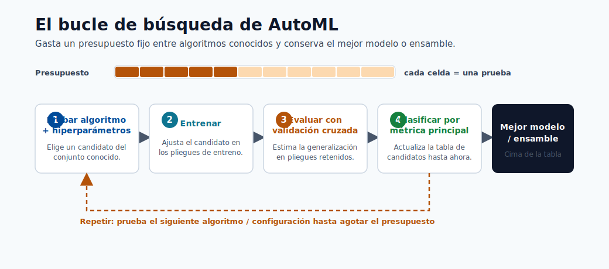
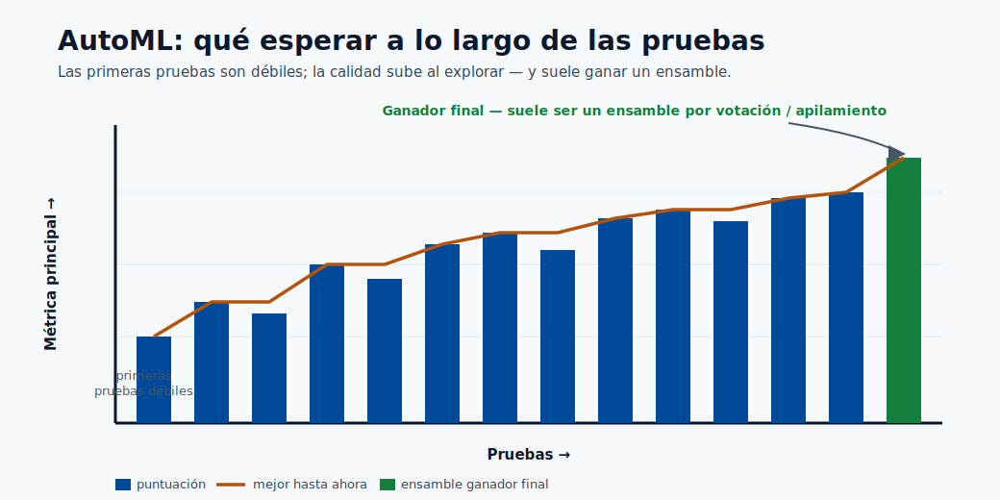
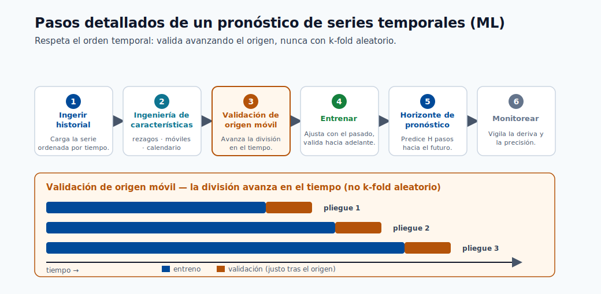

# Entrenamiento y AutoML

Este módulo explica cómo se entrenan los modelos en Azure ML, qué hace AutoML en el backend,
y cómo pasar de experimentos de línea de base a una selección de modelos confiable.

## Objetivos de aprendizaje

1. Comprender el entrenamiento manual vs AutoML.
2. Configurar una ejecución de AutoML con restricciones útiles.
3. Interpretar las salidas de ejecución y elegir un candidato de producción.



> **Nota - Qué muestra esto:** El ciclo de AutoML: probar combinaciones de algoritmo + hiperparámetro, puntuar cada una con validación cruzada,
> y clasificar por la métrica primaria. AutoML no inventa algoritmos: asigna un presupuesto de búsqueda fijo
> entre los conocidos.



> **Consejo - Qué esperar:** Los primeros ensayos son líneas de base débiles; la calidad sube a medida que la búsqueda explora, y el ganador final es
> a menudo un ensemble de votación/stacking de las mejores ejecuciones. Presupueste suficientes iteraciones antes de confiar en el
> marcador.



> **Nota - Qué muestra esto:** Los pasos detallados de una predicción de series temporales basada en ML. Tenga en cuenta la validación de *origen deslizante*:
> el k-fold simple filtraría valores futuros, por lo que los datos temporales se validan avanzando en el tiempo.

## Flujo de trabajo de AutoML

1. Elegir el tipo de tarea
2. Proporcionar datos de entrenamiento
3. Seleccionar el objetivo de cómputo
4. Establecer métrica y restricciones
5. Enviar ejecución y comparar candidatos

## Qué hace AutoML detrás de escena

- Prueba múltiples algoritmos e hiperparámetros.
- Ejecuta validación cruzada/puntuación de validación.
- Aplica transformaciones de características cuando está configurado.
- Registra métricas, artefactos y linaje.
- Devuelve la mejor ejecución/modelo basado en la métrica primaria elegida.

### Candidatos del algoritmo de AutoML (clasificación tabular)

AutoML típicamente evalúa algunos o todos los siguientes:

| Modelo candidato | Notas |
|---|---|
| LightGBM | A menudo el mejor en tabular; rápido y eficiente en memoria |
| XGBoost | Fuerte competidor; más hiperparámetros |
| LogisticRegression | Línea de base rápida; revela si la estructura lineal es suficiente |
| RandomForest | Buena estabilidad, menos ajuste |
| ExtraTrees | Variante de entrenamiento más rápida del bosque aleatorio |
| Voting Ensemble | Ensemble específico de AutoML de las mejores ejecuciones |
| Stack Ensemble | Metamodelo específico de AutoML sobre las mejores ejecuciones |

El `VotingEnsemble` o `StackEnsemble` al final es la forma que tiene AutoML de exprimir rendimiento extra más allá de los modelos individuales; a menudo son el ganador final.

## AutoML vs entrenamiento manual: cuándo usar cuál

AutoML es una opción predeterminada poderosa, pero no siempre es la herramienta correcta. La elección es sobre cuánto
control de dominio se necesita versus cuánta búsqueda se quiere automatizar.

| Usar AutoML cuando | Preferir entrenamiento manual cuando |
|---|---|
| Necesita una línea de base sólida rápidamente | Tiene una arquitectura específica en mente (p. ej. una red neuronal personalizada) |
| El problema es tabular/predicción estándar | Necesita control total del ciclo de entrenamiento o la pérdida |
| Quiere la featurización libre de fugas manejada por usted | Requiere ingeniería de características específica o lógica de CV personalizada |
| Quiere muchos algoritmos comparados objetivamente | El presupuesto de cómputo es limitado y la familia de modelos ya está decidida |

En la práctica, muchos equipos usan ambos: AutoML para descubrir un candidato sólido y validar la
exactitud alcanzable, luego un pipeline construido a mano para refinar, optimizar la latencia y llevarlo a producción.

## Cómputo y rendimiento

Relación de rendimiento:

$$
\text{Rendimiento}=\frac{1}{\text{Tiempo de ejecución}}
$$
El tiempo de ejecución se ve afectado por:

- Volumen de datos y dimensionalidad de características
- Complejidad del algoritmo
- Tamaño del cómputo (CPU/GPU, memoria)
- Paralelización e iteraciones concurrentes máximas

## Lista de verificación mínima de configuración de AutoML

| Configuración | Por qué importa |
|---|---|
| task | Define la familia de modelos candidatos |
| primary metric | Alinea la optimización con el objetivo de negocio |
| iterations/timeout | Controla el presupuesto de búsqueda |
| cross-validation | Mejora la robustez del ranking |
| featurization settings | Impacta la calidad del modelo y la reproducibilidad |

### Ejemplo mínimo de código de AutoML (Azure SDK v2)

```python
from azure.ai.ml import MLClient, automl
from azure.ai.ml.entities import AmlCompute
from azure.identity import DefaultAzureCredential

ml_client = MLClient(
    credential=DefaultAzureCredential(),
    subscription_id="<sub-id>",
    resource_group_name="<rg>",
    workspace_name="<ws>"
)

classification_job = automl.classification(
    compute="cpu-cluster",
    experiment_name="fraud-automl",
    training_data=ml_client.data.get("fraud-train", version="1"),
    target_column_name="is_fraud",
    primary_metric="AUC_weighted",
    n_cross_validations=5,
    enable_model_explainability=True,
    timeout_minutes=60,
    max_concurrent_trials=4,
)

returned_job = ml_client.jobs.create_or_update(classification_job)
```

Indicadores clave:
- `AUC_weighted` es más seguro que `accuracy` para fraude (clases desbalanceadas).
- `enable_model_explainability=True` genera importancia de características basada en SHAP.
- `max_concurrent_trials` debe coincidir con el conteo de núcleos del clúster de cómputo.

## Errores comunes

- Elegir exactitud para clasificación desbalanceada.
- Ejecutar muy pocas iteraciones y confiar demasiado en el primer ganador.
- Ignorar la latencia/costo al seleccionar la mejor puntuación.

## Diseño del espacio de búsqueda (importante)

La calidad de AutoML depende del espacio de búsqueda, no solo del conteo de iteraciones.

| Parámetro | Demasiado estrecho | Demasiado amplio | Enfoque práctico |
|---|---|---|---|
| Familias de modelos | Pierde el mejor tipo de modelo | Desperdicia presupuesto | Empezar amplio, podar después de la línea de base |
| Tasa de aprendizaje | Puede perder el punto óptimo de convergencia | Exploración lenta | Usar rangos en escala logarítmica |
| Profundidad del árbol/hojas | Riesgo de subajuste | Riesgo de sobreajuste + latencia | Restringir por presupuesto de latencia |
| Regularización | Ajuste de ruido sub-regularizado | Subajuste sobre-regularizado | Ajustar con CV y comprobaciones de holdout |

## Opciones de estrategia de validación

| Contexto | Enfoque de validación |
|---|---|
| Tabular estándar | Validación cruzada K-fold |
| Predicción temporal | Validación de origen deslizante |
| Entidades agrupadas | Divisiones de entidad tipo GroupKFold |

## Campos de seguimiento de experimentos a persistir

Metadatos mínimos para reproducibilidad:

- ID de ejecución, ID de ejecución padre
- Instantánea/versión del código
- Versión del activo del conjunto de datos
- Versión del entorno
- Conjunto/hash de características
- Hiperparámetros
- Métricas por división
- URI/versión del modelo de salida

## Política de selección de candidatos

Seleccionar el candidato de despliegue usando criterios multi-objetivo:

$$
\text{Puntuación}_{deploy}=w_1\cdot\text{Calidad}-w_2\cdot\text{Latencia}-w_3\cdot\text{Costo}+w_4\cdot\text{Estabilidad}
$$

donde los pesos $w_i$ reflejan las prioridades del negocio.

## Puertas de promoción (dev a prod)

1. Umbral de métrica fuera de línea cumplido.
2. Latencia de inferencia bajo SLO en hardware representativo.
3. Análisis de seguridad y política de dependencias aprobados.
4. Revisión de explicabilidad/equidad completada.
5. Registro de aprobación del flujo de trabajo registrado.

## Autoevaluación rápida

| # | Pregunta | Respuesta |
|---|----------|-----------|
| 1 | ¿Por qué es crítica la elección de la métrica primaria en AutoML? | Define el objetivo que AutoML optimiza; una métrica equivocada (p. ej. la exactitud con datos desbalanceados) hace que AutoML seleccione el modelo incorrecto. |
| 2 | ¿Qué trade-off controla el máximo de iteraciones concurrentes? | Paralelismo frente a costo y calidad de búsqueda: más concurrencia termina antes pero usa más cómputo y deja al optimizador menos resultados previos de los que aprender. |
| 3 | ¿Por qué deben considerarse las restricciones de despliegue durante la selección del modelo? | El modelo debe cumplir los límites de latencia, tamaño e interpretabilidad en producción; el modelo más preciso es inútil si no puede desplegarse dentro de esas restricciones. |

## Inmersión profunda: cada concepto explicado

Esta sección explica qué automatiza AutoML, qué *no* hace, y por qué existe cada control.

### Qué busca realmente AutoML

AutoML es una búsqueda estructurada sobre tres elecciones acopladas: **featurización** (cómo las columnas brutas se convierten en entradas del modelo), **algoritmo** (qué familia de modelos), e **hiperparámetros** (la configuración dentro de esa familia). Conceptualmente está resolviendo una optimización externa:

$$
\min_{a \in \text{algoritmos},\; h \in \text{hiperparáms}(a)}\; \text{PérdidaDeValidación}(a, h)
$$

No inventa nuevos algoritmos: *asigna inteligentemente un presupuesto fijo* de ensayos entre los conocidos, usando los resultados hasta el momento para decidir qué probar a continuación. Por eso el "diseño del espacio de búsqueda" importa más que el conteo puro de iteraciones: un buen espacio contiene la región ganadora; uno malo nunca lo hace.

### Featurización, desmitificada

Cuando está habilitada, AutoML maneja automáticamente la imputación de valores faltantes, la codificación categórica,
la vectorización de texto y el escalado de características: los mismos pasos del módulo de preparación de datos, aplicados
de manera consistente dentro de los pliegues de validación cruzada para que no filtrarse. El beneficio es un preprocesamiento reproducible libre de fugas; el costo es menos control manual, por lo que los ajustes de `featurization` son explícitos y registrados para la reproducibilidad.

### Validación cruzada dentro de AutoML y por qué clasifica modelos de manera justa

`n_cross_validations=5` significa que cada candidato se puntúa en 5 pliegues de validación rotativos y los
resultados se promedian. Esto reduce la posibilidad de que una división afortunada corone al modelo equivocado. Para
datos **temporales**, el k-fold simple filtra el futuro, por lo que se usa la validación de **origen deslizante**
en su lugar; para **entidades agrupadas** (p. ej. múltiples filas por cliente), las divisiones con conocimiento de grupo previenen
que la misma entidad aparezca en entrenamiento y validación.

### Métrica primaria: alineando el optimizador con el negocio

AutoML optimiza exactamente una **métrica primaria**, por lo que elegirla *es* elegir qué significa "mejor".
En problemas desbalanceados, `accuracy` es engañosa (un modelo que predice "nunca fraude" obtiene el 99%),
por lo que se usan `AUC_weighted` o `average_precision` en su lugar. La lección se generaliza: el optimizador
explotará despiadadamente cualquier métrica que le dé, por lo que la métrica debe codificar la estructura real de costos.

### Ensembles: por qué el ganador es a menudo un `VotingEnsemble`

Después de probar modelos individuales, AutoML construye dos metamodelos:

- **Ensemble de votación**: promedia las predicciones de las mejores ejecuciones. Los modelos diversos cometen
  errores *no correlacionados*, por lo que el promedio es más exacto y estable que cualquier miembro individual.
- **Ensemble de stacking**: entrena un pequeño metamodelo en las predicciones fuera del pliegue de los modelos base para
  aprender *cómo* combinarlos.

Estos generalmente ganan porque combinar aprendices diversos reduce la varianza: el mismo principio de bagging/stacking
del módulo de tipos de modelos, aplicado automáticamente.

### Concurrencia, presupuesto y el trade-off costo/tiempo

`max_concurrent_trials` controla cuántos candidatos se entrenan en paralelo; configurarlo al conteo de nodos del
clúster mantiene el cómputo ocupado y acorta el tiempo de reloj, pero **no** reduce el costo total de cómputo (se paga por el mismo número de ensayos, solo más rápido). `timeout_minutes` y los límites de iteraciones delimitan el **presupuesto** de búsqueda: el control central que intercambia exhaustividad contra tiempo y dinero.

### La puntuación de selección multi-objetivo, explicada

La puntuación del candidato $\text{Puntuación}_{deploy}=w_1\text{Calidad}-w_2\text{Latencia}-w_3\text{Costo}+w_4\text{Estabilidad}$
formaliza una verdad del mundo real: el modelo desplegable maximiza la calidad *y* la estabilidad mientras es penalizado por la latencia y el costo. Los pesos $w_i$ codifican las prioridades del negocio: una API en tiempo real pondera la latencia fuertemente; un trabajo por lotes nocturno la pondera cerca de cero. AutoML clasifica por la métrica primaria, pero la decisión de promoción *humana* debe usar este objetivo más completo, que es exactamente por qué las **puertas de promoción** verifican la latencia bajo SLO, la seguridad y la equidad, no solo la puntuación fuera de línea.

### Por qué los metadatos de seguimiento de experimentos son no negociables

La lista de campos a persistir (ID de ejecución, versión de datos, versión del entorno, hash de características,
hiperparámetros, métricas por división, URI del modelo) es lo que hace que un resultado sea **reproducible** y
**auditable**. Si no puede responder "¿qué datos, código y entorno produjeron este modelo?", no puede
depurar una regresión, pasar una auditoría o reentrenar de forma segura: por lo que estos metadatos son la columna vertebral de
MLOps, no una contabilidad opcional.

## Optimización de hiperparámetros (HPO) en profundidad

La optimización de hiperparámetros es el proceso de buscar la configuración de un modelo (tasa de aprendizaje,
profundidad del árbol, fuerza de regularización, etc.) que minimiza la pérdida de validación. A diferencia de los parámetros del modelo
(pesos aprendidos durante el descenso de gradiente), los hiperparámetros se establecen *antes* del entrenamiento
y no pueden ser aprendidos por el algoritmo de optimización estándar.

### Búsqueda en cuadrícula, búsqueda aleatoria y por qué gana la aleatoria

La **búsqueda en cuadrícula** enumera cada combinación de una cuadrícula de hiperparámetros discreta. Si tiene 5
valores para la tasa de aprendizaje y 5 para la regularización, la búsqueda en cuadrícula ejecuta 25 ensayos. Para 10 hiperparámetros
con 5 valores cada uno, ejecuta $5^{10} \approx 10^7$ ensayos: computacionalmente inviable.

La **búsqueda aleatoria** (Bergstra & Bengio, 2012) muestrea cada hiperparámetro independientemente de una
distribución sobre su rango. La perspectiva crítica es la **baja dimensionalidad efectiva**: en la práctica,
el rendimiento del modelo es sensible solo a un pequeño número de hiperparámetros a la vez. Cuando 8 de 10
hiperparámetros apenas afectan la pérdida, la búsqueda en cuadrícula desperdicia la mayor parte de su presupuesto variando esos 8,
mientras que la búsqueda aleatoria cubre los 2 que importan en muchos más valores distintos.

> **Nota - Resultado de Bergstra & Bengio:** La búsqueda aleatoria iguala o supera a la búsqueda en cuadrícula en el mismo número de ensayos
> porque nunca "desperdicia" un ensayo duplicando el valor de un hiperparámetro sin importancia.
> Para un presupuesto de $n$ ensayos, la búsqueda aleatoria explora $n$ valores distintos de cada hiperparámetro;
> la búsqueda en cuadrícula explora solo $n^{1/d}$ valores por dimensión en una cuadrícula $d$-dimensional.

| Método | Complejidad | Maneja rangos continuos | Paralelizable | Se adapta a los resultados |
|---|---|---|---|---|
| Búsqueda en cuadrícula | Exponencial en $d$ | No (requiere discretización) | Sí | No |
| Búsqueda aleatoria | Lineal en el presupuesto | Sí | Sí | No |
| Optimización Bayesiana | Sub-lineal en la práctica | Sí | Parcialmente | Sí |

**Regla práctica:** Para presupuestos de menos de ~20 ensayos y menos de 4 hiperparámetros, la búsqueda en cuadrícula
está bien. Para espacios más grandes, use la búsqueda aleatoria como línea de base y la Bayesiana como actualización.

### Optimización Bayesiana

La optimización Bayesiana es una **optimización secuencial basada en modelos (SMBO)**. Mantiene un
**modelo sustituto** probabilístico de la función objetivo real (costosa de evaluar) y lo usa
para decidir *dónde muestrear a continuación* equilibrando la exploración (probar regiones inciertas) y
la explotación (probar regiones predichas como buenas).

**Función de adquisición de Mejora Esperada (EI):**

$$
\text{EI}(x) = \mathbb{E}[\max(f(x) - f^+, 0)]
$$

donde $f^+$ es el mejor valor observado hasta ahora. EI es alto donde el sustituto predice un valor
superior a $f^+$ o donde la incertidumbre es alta.

**Estimador de Parzen Estructurado en Árbol (TPE)** es una alternativa utilizada por Hyperopt y Azure ML. En lugar
de ajustar un único GP, TPE modela dos densidades:

- $l(x)$: distribución de hiperparámetros que produjeron *buenos* resultados (por debajo de un umbral cuantil $\gamma$)
- $g(x)$: distribución de hiperparámetros que produjeron *malos* resultados

La adquisición se maximiza muestreando de $l(x)/g(x)$, lo que es rápido incluso para espacios de alta dimensión,
condicionales y categóricos, haciendo que TPE sea práctico donde el GP tiene dificultades.

> **Consejo - Cuándo Bayesiana supera a la aleatoria:** La ventaja de la optimización Bayesiana crece con el costo de evaluación. Cuando un
> solo ensayo tarda horas (entrenamiento de deep learning), ahorrar el 30% de los ensayos importa enormemente.
> Cuando un ensayo tarda segundos, la búsqueda aleatoria a menudo es suficiente y más simple.

### HyperDrive en Azure ML

HyperDrive es el servicio HPO nativo de Azure ML. Envuelve cualquier script de entrenamiento y gestiona el ciclo de vida del ensayo: muestreo, lanzamiento, monitoreo, terminación temprana y agregación de resultados.

**Ejemplo completo de HyperDrive (patrón compatible con Azure SDK v2):**

```python
from azure.ai.ml import MLClient, command
from azure.ai.ml.sweep import (
    Choice, Uniform, LogUniform,
    BayesianParameterSampling,
    BanditPolicy
)
from azure.identity import DefaultAzureCredential

ml_client = MLClient(
    credential=DefaultAzureCredential(),
    subscription_id="<sub-id>",
    resource_group_name="<rg>",
    workspace_name="<ws>"
)

# Comando de entrenamiento base
base_command = command(
    code="./src",
    command=(
        "python train.py "
        "--learning_rate ${{search_space.learning_rate}} "
        "--num_leaves ${{search_space.num_leaves}} "
        "--min_data_in_leaf ${{search_space.min_data_in_leaf}}"
    ),
    environment="azureml:lightgbm-env:1",
    compute="cpu-cluster",
    inputs={"train_data": ml_client.data.get("fraud-train", version="1")},
)

# Definir el espacio de búsqueda
sweep_job = base_command.sweep(
    sampling_algorithm=BayesianParameterSampling(),
    search_space={
        "learning_rate": LogUniform(min_value=-4, max_value=-1),  # 10^-4 a 10^-1
        "num_leaves": Choice(values=[31, 63, 127, 255]),
        "min_data_in_leaf": Choice(values=[10, 20, 50, 100]),
    },
    primary_metric="val_auc",
    goal="Maximize",
    max_total_trials=40,
    max_concurrent_trials=8,
    early_termination_policy=BanditPolicy(
        evaluation_interval=5,
        slack_factor=0.1,
        delay_evaluation=10,
    ),
)

returned_sweep = ml_client.jobs.create_or_update(sweep_job)
```

**Métodos de muestreo de parámetros comparados:**

| Clase | Estrategia | Usar cuando |
|---|---|---|
| `RandomParameterSampling` | Extracciones uniforme/log-uniforme independientes | Línea de base rápida; siempre funciona; soporta terminación temprana |
| `BayesianParameterSampling` | Muestreo secuencial guiado por TPE | Ensayos costosos; espacios de búsqueda continuos |
| `GridParameterSampling` | Enumeración exhaustiva | Cuadrículas discretas pequeñas; necesita cobertura completa |

> **Nota - Limitación Bayesiana:** `BayesianParameterSampling` no soporta políticas de terminación temprana en Azure ML
> porque el modelo sustituto depende de resultados de ensayos *completados* para ajustar el siguiente punto. Terminar
> ensayos temprano produce información incompleta que degrada el ajuste del sustituto.

**Políticas de terminación temprana:**

- **Política Bandit:** Termina un ensayo en el intervalo de evaluación $k$ si su métrica primaria no está dentro de
  `slack_factor` (relativo) o `slack_amount` (absoluto) del mejor ensayo hasta ahora. Agresivo pero eficaz.
- **Política de detención mediana:** Termina un ensayo si su promedio en ejecución está por debajo de la mediana de todos los
  ensayos completados en el mismo paso. Más conservadora; útil cuando las curvas de entrenamiento son ruidosas.
- **Selección por truncamiento:** Termina el $X\%$ inferior de ejecuciones en cada intervalo.
- **Sin política (None):** Cada ensayo se ejecuta hasta completarse. Usar solo cuando los ensayos son económicos o cuando
  se usa muestreo Bayesiano.

## Seguimiento de experimentos con MLflow

El seguimiento de experimentos es la disciplina de registrar las entradas, configuración y salidas de cada ensayo para que los resultados sean reproducibles, comparables y auditables. En Azure ML, el estándar es **MLflow**, que está integrado de forma nativa.

```python
import mlflow
import mlflow.sklearn
from sklearn.ensemble import GradientBoostingClassifier
from sklearn.metrics import roc_auc_score

# Azure ML configura automáticamente MLFLOW_TRACKING_URI en el cómputo
mlflow.set_experiment("fraud-detection-v2")

with mlflow.start_run(run_name="gbm-baseline") as run:
    # Registrar hiperparámetros
    mlflow.log_params({
        "n_estimators": 200,
        "max_depth": 5,
        "learning_rate": 0.05,
        "subsample": 0.8,
    })

    model = GradientBoostingClassifier(
        n_estimators=200, max_depth=5,
        learning_rate=0.05, subsample=0.8
    )
    model.fit(X_train, y_train)

    # Registrar métricas
    val_auc = roc_auc_score(y_val, model.predict_proba(X_val)[:, 1])
    mlflow.log_metric("val_auc", val_auc)

    # Registrar artefacto
    mlflow.log_artifact("confusion_matrix.png")

    # Registrar el modelo (habilita el registro en un paso)
    mlflow.sklearn.log_model(model, artifact_path="model")

    print(f"ID de ejecución: {run.info.run_id}")
```

> **Consejo - MLflow como estándar:** MLflow es el estándar de facto para el seguimiento de experimentos de ML porque es agnóstico al framework,
> de código abierto, e integrado de forma nativa en Azure ML, Databricks y muchas plataformas de CI/CD.
> Escribir código de registro idiomático de MLflow significa que sus scripts de entrenamiento son portátiles entre
> entornos sin modificación.

## El ciclo de vida completo de AutoML: escenario de producción

Esta sección recorre un escenario de producción de extremo a extremo: comenzando desde un activo de datos registrado,
ejecutando AutoML, seleccionando el mejor modelo, registrándolo, evaluándolo contra las puertas de promoción
y promoviéndolo a un endpoint de producción.

**Visión general de las etapas:**

```
Activo de datos (versionado)
    → Trabajo de AutoML (clasificación / regresión / predicción)
    → Mejor ejecución identificada (métrica primaria + selección multi-objetivo)
    → Modelo registrado en el Registro de Modelos de Azure ML
    → Pipeline de evaluación (calidad fuera de línea + equidad + latencia)
    → Decisión de promoción (¿se cumplen las puertas de promoción?)
    → Desplegado en endpoint gestionado en línea (azul/verde)
```

**Etapa 1 — Registrar el activo de datos de entrenamiento:**

```python
from azure.ai.ml.entities import Data
from azure.ai.ml.constants import AssetTypes

train_data = Data(
    name="fraud-train",
    version="3",
    description="Conjunto de entrenamiento de detección de fraude, T1 2025, deduplicado",
    path="azureml://datastores/training_data/paths/fraud/train_v3/",
    type=AssetTypes.MLTABLE,
)
ml_client.data.create_or_update(train_data)
```

**Etapa 2 — Enviar el trabajo de AutoML:**

```python
from azure.ai.ml import automl

classification_job = automl.classification(
    compute="cpu-cluster",
    experiment_name="fraud-automl-prod",
    training_data=ml_client.data.get("fraud-train", version="3"),
    target_column_name="is_fraud",
    primary_metric="AUC_weighted",
    n_cross_validations=5,
    enable_model_explainability=True,
    timeout_minutes=120,
    max_concurrent_trials=8,
    max_trials=50,
    featurization="auto",
)
returned_job = ml_client.jobs.create_or_update(classification_job)
ml_client.jobs.stream(returned_job.name)   # Bloquear hasta completar
```
