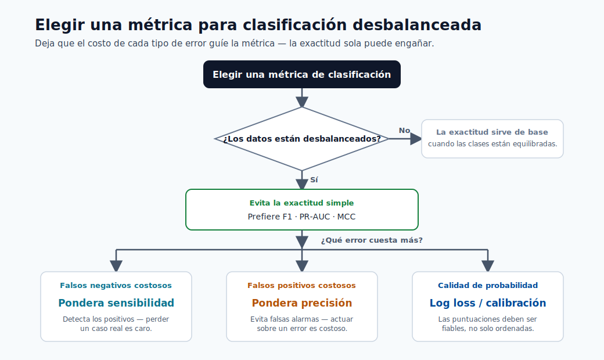

# Métricas de Rendimiento

Elegir la métrica correcta es una de las decisiones más importantes en ML. Un modelo puede parecer
excelente en una métrica y fallar en el objetivo real del negocio.



> **Consejo - Cómo usar este gráfico:** Elija la métrica a partir del *costo de los errores*, no del hábito. En problemas desbalanceados, prefiera F1, PR-AUC,
> o MCC sobre la exactitud; pese el recall cuando los positivos perdidos son costosos, la precisión cuando las falsas alarmas son costosas.

## Conceptos básicos de la matriz de confusión

Conteos:

- $TP$: verdaderos positivos
- $FP$: falsos positivos
- $TN$: verdaderos negativos
- $FN$: falsos negativos

Tasas:

$$
\text{TPR}=\frac{TP}{TP+FN},\quad
\text{FPR}=\frac{FP}{FP+TN},\quad
\text{TNR}=\frac{TN}{TN+FP}
$$

### Leyendo la matriz de confusión

| Real \ Predicho | Positivo | Negativo |
|---|---|---|
| Positivo | TP | FN |
| Negativo | FP | TN |

| Celda | Significado | Ejemplo (modelo de fraude) |
|---|---|---|
| TP | Positivo correctamente marcado | Fraude real detectado |
| FP | Falsa alarma | Transacción legítima bloqueada |
| TN | Negativo correctamente eliminado | Transacción legítima aprobada |
| FN | Positivo perdido | Fraude no detectado |

Para un caso de uso de fraude, **el FN es el error más peligroso** (fraude no detectado). Esto significa que el recall debe tener mucho peso en la elección de la métrica.

## Métricas de clasificación

- Precisión: $\frac{TP}{TP+FP}$
- Recall: $\frac{TP}{TP+FN}$
- F1: $2\cdot\frac{PR}{P+R}$
- AUC

Fórmulas adicionales:

$$
\text{Exactitud}=\frac{TP+TN}{TP+TN+FP+FN}
$$

$$
\mathrm{MCC}=\frac{TP\cdot TN-FP\cdot FN}{\sqrt{(TP+FP)(TP+FN)(TN+FP)(TN+FN)}}
$$

$$
\mathrm{AUC}=\int_0^1 \mathrm{TPR}(\mathrm{FPR})\,d\mathrm{FPR}
$$

Cuándo usar qué:

| Escenario | Mejores opciones de métrica |
|---|---|
| Desequilibrio de clases | F1, PR-AUC, MCC, exactitud balanceada |
| Alto costo de falsos negativos | Recall, F2 |
| Alto costo de falsos positivos | Precisión |
| Calidad de probabilidad | Pérdida logarítmica, métricas de calibración |

## Métricas de regresión

- MAE
- RMSE
- R2

Fórmulas:

$$
\mathrm{MAE}=\frac{1}{N}\sum_{i=1}^{N}|y_i-\hat{y}_i|,
\quad
\mathrm{RMSE}=\sqrt{\frac{1}{N}\sum_{i=1}^{N}(y_i-\hat{y}_i)^2}
$$

$$
R^2=1-\frac{\sum_{i=1}^{N}(y_i-\hat{y}_i)^2}{\sum_{i=1}^{N}(y_i-\bar{y})^2}
$$

Consejos de interpretación:

- MAE es robusto y fácil de explicar en unidades originales.
- RMSE penaliza los errores grandes más fuertemente.
- $R^2$ compara contra una línea de base de predicción de la media.

## Métricas de predicción (prácticas)

- MAPE: error porcentual intuitivo, inestable cerca de valores cero.
- sMAPE: variante simétrica para mejor comparabilidad.
- RMSE/MAE: todavía útiles para la calidad de la predicción.

Fórmulas:

$$
\text{MAPE}=\frac{100}{N}\sum_{i=1}^{N}\left|\frac{y_i-\hat{y}_i}{y_i}\right|
$$

$$
\text{sMAPE}=\frac{100}{N}\sum_{i=1}^{N}\frac{2|y_i-\hat{y}_i|}{|y_i|+|\hat{y}_i|}
$$

Orientación: prefiera RMSE/MAE para comparar modelos en la misma escala. Use MAPE/sMAPE solo cuando comunique errores como porcentajes a las partes interesadas del negocio.

## Errores a evitar

- Reportar una métrica sin intervalos de confianza.
- Comparar modelos en diferentes particiones de validación.
- Ignorar el ajuste del umbral en la clasificación.
- Usar la exactitud como métrica principal para datos desbalanceados.
- Evaluar solo globalmente cuando el rendimiento a nivel de segmento puede divergir significativamente.

## Optimización del umbral (clasificación)

Las decisiones de clasificación en producción requieren una política de umbral, no el valor predeterminado $0.5$.

Costo esperado del negocio en el umbral $\tau$:

$$
\mathbb{E}[\text{Costo}(\tau)] = C_{FP}\cdot FP(\tau)+C_{FN}\cdot FN(\tau)
$$

Elegir $\tau$ que minimice el costo esperado bajo las restricciones del negocio.

## Calibración y confiabilidad

Un clasificador puede clasificar bien (alta AUC) pero producir probabilidades mal calibradas.

Comprobaciones de calibración:

- Curva de fiabilidad
- Puntuación de Brier
- Error de calibración esperado (ECE)

Use métodos de calibración (escala de Platt, regresión isotónica) cuando los sistemas de decisión dependen
de los valores de probabilidad, no solo del orden de clasificación.

## Ejemplos de SLI/SLO para calidad del modelo

| SLI | Ejemplo de SLO |
|---|---|
| Macro-F1 semanal | >= 0.82 |
| RMSE semanal | <= 5.0 |
| Error de calibración | <= 0.03 |
| Ratio de disparidad por segmento | <= 1.25 |

## Autoevaluación rápida

| # | Pregunta | Respuesta |
|---|----------|-----------|
| 1 | ¿Qué métrica es más segura que la exactitud para datos desbalanceados? | F1 (o PR-AUC, MCC o exactitud balanceada), que evitan que la clase mayoritaria domine la puntuación. |
| 2 | ¿Por qué puede ser RMSE mucho mayor que MAE? | RMSE eleva al cuadrado los errores, así que unos pocos errores grandes se penalizan desproporcionadamente; una gran brecha RMSE–MAE indica errores de cola pesada o atípicos. |
| 3 | ¿Qué implica un $R^2$ negativo? | Que el modelo es peor que simplemente predecir la media: una señal clara de que algo está roto. |

## Inmersión profunda: cada concepto explicado

Esta sección explica *por qué* cada métrica está construida de la manera en que está y cuándo engaña.

### La matriz de confusión es el origen de cada métrica de clasificación

Todas las métricas de clasificación son cocientes de las cuatro celdas $TP, FP, TN, FN$. Memorizar las celdas
es suficiente para reconstruir cualquier métrica:

- La **Precisión** $\tfrac{TP}{TP+FP}$ responde "cuando el modelo dice positivo, ¿con qué frecuencia tiene razón?"
  Es la métrica que importa cuando **los falsos positivos son costosos** (bloquear buenos
  clientes, marcar pacientes sanos).
- El **Recall / TPR** $\tfrac{TP}{TP+FN}$ responde "de todos los positivos reales, ¿cuántos capturamos?"
  La métrica cuando **los falsos negativos son costosos** (fraude no detectado, enfermedad no detectada).
- **F1** $2\tfrac{PR}{P+R}$ es la **media armónica** de los dos. La media armónica (no el
  promedio ordinario) se usa porque se mantiene baja a menos que *tanto* la precisión como el recall sean altos:
  se niega a recompensar a un modelo que sacrifica uno por el otro.

### Por qué la exactitud falla en datos desbalanceados

La exactitud $\tfrac{TP+TN}{\text{todos}}$ pondera cada ejemplo igualmente, por lo que cuando el 99% de los casos son
negativos, predecir "siempre negativo" obtiene el 99% sin capturar ningún positivo. Por eso el
curso orienta repetidamente hacia **F1, PR-AUC, MCC o exactitud balanceada** para problemas sesgados:
todos, de diferentes maneras, evitan que la clase mayoritaria domine la puntuación.

### ROC-AUC vs PR-AUC, y qué significa "sin umbral"

- **AUC** es el área bajo la curva ROC (TPR vs FPR a medida que el umbral se desliza de 1 a 0). Es
  igual a la probabilidad de que el modelo clasifique un positivo aleatorio por encima de un negativo aleatorio: una medida pura de
  **calidad de clasificación**, independiente de cualquier umbral elegido.
- En un desequilibrio severo, el ROC-AUC puede parecer engañosamente alto porque el enorme conteo negativo mantiene el FPR
  bajo. El **PR-AUC** (precisión vs recall) se centra en la clase positiva y es el resumen más honesto
  cuando los positivos son raros.

### Optimización del umbral como minimización de costos

Un modelo produce probabilidades; el **umbral** $\tau$ las convierte en decisiones. Debido a que los falsos
positivos y los falsos negativos generalmente tienen *costos diferentes*, el umbral óptimo minimiza el costo esperado
$\mathbb{E}[\text{Costo}(\tau)] = C_{FP}\cdot FP(\tau) + C_{FN}\cdot FN(\tau)$ en lugar de
maximizar la exactitud. Concretamente: si un fraude no detectado cuesta 20 veces más que una falsa alarma, baje $\tau$
para intercambiar muchos falsos positivos por menos falsos negativos. El predeterminado 0.5 casi nunca es óptimo
en producción.

### Métricas de regresión: MAE vs RMSE vs $R^2$

- **MAE** promedia errores absolutos: está en las unidades del objetivo y trata todos los errores linealmente,
  por lo que es **robusto a los valores atípicos** y fácil de explicar ("errado en \$5 en promedio").
- **RMSE** promedia los errores *cuadráticos* y luego saca la raíz cuadrada, por lo que los errores grandes se penalizan
  desproporcionadamente. RMSE ≥ MAE siempre; una *gran brecha* entre ellos señala algunos errores grandes
  (errores de cola pesada) que vale la pena investigar.
- $R^2 = 1 - \tfrac{SS_{res}}{SS_{tot}}$ compara el modelo contra la línea de base trivial "predecir la media".
  $R^2=1$ es perfecto, $0$ significa que no es mejor que la media, y **un $R^2$ negativo significa que el
  modelo es *peor* que predecir la media**: una señal clara de que algo está roto.

### Métricas de predicción y la trampa del denominador cero

**MAPE** expresa el error como un porcentaje, que las partes interesadas encuentran intuitivo, pero **divide por
el valor real**, por lo que explota o es indefinido cerca de cero y penaliza excesivamente las predicciones bajas.
**sMAPE** simetriza el denominador para limitar el valor y tratar las predicciones altas/bajas de forma más equilibrada. La regla práctica del módulo: optimizar y comparar modelos en RMSE/MAE (estable),
y traducir a MAPE/sMAPE solo para *comunicar* con las partes interesadas del negocio.

### Calibración: clasificar bien no es lo mismo que estar en lo correcto

Un modelo con alta AUC clasifica los ejemplos correctamente pero puede aún producir probabilidades que no
coinciden con la realidad (p. ej. sus predicciones del "90%" son correctas solo el 70% de las veces). Cuando las decisiones posteriores usan el *valor* de la probabilidad (cálculos de pérdida esperada, precios, triaje), necesita
**calibración**:

- La **curva de fiabilidad** representa la frecuencia predicha vs la observada; la diagonal es perfecta.
- La **puntuación de Brier** es el error cuadrático medio de las probabilidades mismas.
- El **ECE** (error de calibración esperado) resume la brecha promedio entre la confianza y la exactitud.
- La **escala de Platt** (ajustar una logística sobre las puntuaciones) y la **regresión isotónica** (ajustar una función de paso monótona) son las correcciones post-hoc estándar.

### De las métricas a los SLIs/SLOs: cerrando el ciclo hacia las operaciones

Una métrica fuera de línea se convierte en un **SLI** (indicador de nivel de servicio) de producción cuando se mide
continuamente, y en un **SLO** (objetivo) cuando se adjunta un umbral (p. ej. "macro-F1 semanal ≥ 0.82"). Así es como la calidad del modelo se une a la latencia y la disponibilidad como una propiedad monitoreada y alertable: el puente de este módulo a la monitorización de deriva y los SLOs de despliegue más adelante en el curso.

## Autoevaluación rápida (inmersión profunda)

| # | Pregunta | Respuesta |
|---|----------|-----------|
| 1 | ¿Por qué F1 es la media armónica de la precisión y el recall en lugar del promedio ordinario? | La media armónica se mantiene baja a menos que tanto la precisión como el recall sean altos, por lo que se niega a recompensar a un modelo que sacrifica uno por el otro. |
| 2 | En un conjunto de datos con 99% negativos, ¿por qué puede parecer excelente el ROC-AUC mientras que el PR-AUC es deficiente? | El enorme conteo de negativos mantiene el FPR bajo, así que el ROC-AUC se ve alto, mientras que el PR-AUC se centra en la clase positiva rara y revela el débil desempeño en ella. |
| 3 | ¿Qué le dice sobre el modelo un $R^2$ negativo? | Que rinde peor que el predictor trivial de la media: una señal clara de que algo está roto. |
| 4 | ¿Por qué el umbral predeterminado 0.5 casi nunca es óptimo en producción? | Porque los falsos positivos y los falsos negativos tienen costos diferentes; el umbral óptimo minimiza el costo esperado, no la exactitud. |
| 5 | Un modelo tiene alta AUC pero sus predicciones del "90%" son correctas solo el 70% de las veces: ¿cuál es el problema y qué correcciones se aplican? | Clasifica bien pero está mal calibrado; se corrige con escala de Platt o regresión isotónica. |

## Métricas multiclase y multietiqueta en profundidad

Las métricas de clasificación binaria se extienden a configuraciones multiclase, pero la estrategia de agregación
cambia drásticamente lo que significa la puntuación final.

### Promediado macro, micro y ponderado

Considere un problema de 3 clases (clases A, B, C) con los siguientes conteos por clase y
precisión/recall:

| Clase | Soporte ($n_k$) | Precisión ($P_k$) | Recall ($R_k$) | $F1_k$ |
|---|---|---|---|---|
| A | 1000 | 0.90 | 0.85 | 0.874 |
| B | 100 | 0.70 | 0.75 | 0.724 |
| C | 20 | 0.50 | 0.60 | 0.545 |
| **Total** | **1120** | — | — | — |

El **promedio macro** calcula la media no ponderada de las puntuaciones por clase:

$$
F1_{\text{macro}} = \frac{1}{K}\sum_{k=1}^{K} F1_k = \frac{0.874 + 0.724 + 0.545}{3} = 0.714
$$

El promedio macro trata cada clase igualmente independientemente del tamaño. Es apropiado cuando todas las clases importan igualmente, especialmente cuando las clases minoritarias son importantes.

El **promedio micro** agrupa todos los conteos TP, FP, FN entre las clases antes de calcular la métrica:

$$
F1_{\text{micro}} = \frac{2\cdot\sum_k TP_k}{2\cdot\sum_k TP_k + \sum_k FP_k + \sum_k FN_k}
$$

El promedio micro está dominado por la clase más grande. Use el promedio micro cuando la fracción total de instancias correctamente clasificadas es la preocupación principal.

El **promedio ponderado** escala cada puntuación de clase por su soporte:

$$
F1_{\text{weighted}} = \frac{\sum_k n_k \cdot F1_k}{\sum_k n_k}
= \frac{1000\cdot 0.874 + 100\cdot 0.724 + 20\cdot 0.545}{1120} = 0.858
$$

El promedio ponderado tiene en cuenta el desequilibrio de clases mientras sigue reflejando el rendimiento por clase.
Es el predeterminado en `sklearn.metrics.f1_score(average='weighted')`.

> **Nota - Cómo elegir la estrategia de promediado:** Use macro cuando el rendimiento de la clase minoritaria es crítico. Use micro cuando
> le importa la exactitud a nivel de instancia general. Use ponderado como predeterminado balanceado que
> refleja naturalmente la distribución de clases en sus datos.

**Código para los tres modos de promediado:**

```python
from sklearn.metrics import f1_score, precision_score, recall_score, classification_report

print(classification_report(y_true, y_pred, target_names=["A", "B", "C"]))

f1_macro    = f1_score(y_true, y_pred, average="macro")
f1_micro    = f1_score(y_true, y_pred, average="micro")
f1_weighted = f1_score(y_true, y_pred, average="weighted")
print(f"Macro F1: {f1_macro:.3f}, Micro F1: {f1_micro:.3f}, F1 ponderado: {f1_weighted:.3f}")
```

### Kappa de Cohen

El kappa de Cohen mide el acuerdo entre evaluadores (o clasificador vs. verdad de base) mientras corrige el acuerdo esperado por azar:

$$
\kappa = \frac{p_o - p_e}{1 - p_e}
$$

**Escala de interpretación:**

| Rango de $\kappa$ | Interpretación |
|---|---|
| $< 0$ | Peor que el azar |
| $0.01 – 0.20$ | Acuerdo leve |
| $0.21 – 0.40$ | Acuerdo regular |
| $0.41 – 0.60$ | Acuerdo moderado |
| $0.61 – 0.80$ | Acuerdo sustancial |
| $0.81 – 1.00$ | Acuerdo casi perfecto |

```python
from sklearn.metrics import cohen_kappa_score
kappa = cohen_kappa_score(y_true, y_pred)
print(f"Kappa de Cohen: {kappa:.3f}")
```

## Métricas de clasificación

Las métricas de clasificación evalúan listas ordenadas de predicciones. Son las métricas primarias en recuperación de información, sistemas de recomendación y problemas de aprendizaje a clasificar.

### NDCG (Ganancia Acumulada Descontada Normalizada)

NDCG mide la calidad de una lista clasificada de elementos, recompensando los elementos relevantes que aparecen
antes en la lista.

**Ganancia Acumulada Descontada en el rango $k$:**

$$
\text{DCG}_k = \sum_{i=1}^{k} \frac{2^{rel_i} - 1}{\log_2(i + 1)}
$$

**Normalización NDCG:**

$$
\text{NDCG}_k = \frac{\text{DCG}_k}{\text{IDCG}_k}
$$

```python
from sklearn.metrics import ndcg_score
import numpy as np

# Etiquetas de relevancia verdadera (una consulta)
y_true = np.array([[3, 2, 3, 0]])
# Puntuaciones predichas (mayor = más relevante)
y_score = np.array([[0.9, 0.7, 0.8, 0.1]])

ndcg = ndcg_score(y_true, y_score, k=4)
print(f"NDCG@4: {ndcg:.3f}")
```

### Precisión Media (MAP)

**Precisión Promedio (AP)** para una sola consulta resume el trade-off precisión-recall a través de todos los elementos relevantes en la lista clasificada.

**Precisión Media Promedio (MAP)** promedia AP sobre todas las consultas:

$$
\text{MAP} = \frac{1}{|Q|} \sum_{q=1}^{|Q|} \text{AP}(q)
$$

## Inmersión profunda en métricas de regresión

### Pérdida de Huber

La pérdida de Huber combina las mejores propiedades de MAE y MSE. Para errores menores que un umbral
$\delta$ se comporta como MSE (suave, diferenciable); para errores mayores se comporta como MAE (lineal, robusto a valores atípicos):

$$
\mathcal{L}_\delta(y, \hat{y}) =
\begin{cases}
\frac{1}{2}(y - \hat{y})^2 & \text{si } |y - \hat{y}| \leq \delta \\
\delta\left(|y - \hat{y}| - \frac{1}{2}\delta\right) & \text{en otro caso}
\end{cases}
$$

```python
from sklearn.linear_model import HuberRegressor
from sklearn.metrics import mean_absolute_error, mean_squared_error
import numpy as np

model = HuberRegressor(epsilon=1.35)   # epsilon = delta en la parametrización de sklearn
model.fit(X_train, y_train)
y_pred = model.predict(X_test)

print(f"MAE: {mean_absolute_error(y_test, y_pred):.4f}")
print(f"RMSE: {np.sqrt(mean_squared_error(y_test, y_pred)):.4f}")
```

### Métricas cuantílicas e intervalos de predicción

La regresión cuantílica evalúa predicciones *distribucionales*: estimaciones de percentiles específicos de la distribución objetivo.

**Pérdida pinball (pérdida cuantílica):**

$$
\mathcal{L}_q(y, \hat{y}) =
\begin{cases}
q(y - \hat{y}) & \text{si } y \geq \hat{y} \\
(q - 1)(y - \hat{y}) & \text{si } y < \hat{y}
\end{cases}
$$

```python
from sklearn.ensemble import GradientBoostingRegressor
import numpy as np

# Entrenar modelos para cuantiles inferior, mediano y superior
quantiles = [0.05, 0.50, 0.95]
models = {}
for q in quantiles:
    model = GradientBoostingRegressor(
        loss="quantile", alpha=q,
        n_estimators=200, max_depth=4
    )
    model.fit(X_train, y_train)
    models[q] = model

lower = models[0.05].predict(X_test)
median = models[0.50].predict(X_test)
upper = models[0.95].predict(X_test)

# Cobertura empírica: debería ser ~90%
coverage = np.mean((y_test >= lower) & (y_test <= upper))
print(f"Cobertura empírica del intervalo del 90%: {coverage:.1%}")
```

> **Nota - Verificación de calibración del intervalo:** Siempre verifique la cobertura empírica. Si un intervalo del 90% cubre solo el 70% de los puntos de prueba,
> el modelo tiene exceso de confianza (intervalos demasiado estrechos). Si cubre el 99%, el modelo tiene falta de confianza (intervalos demasiado amplios). Los intervalos calibrados son el objetivo.

## Alineación con las métricas del negocio

Elegir la métrica de ML correcta es necesario pero no suficiente. La medida final del valor de un modelo es su impacto en el objetivo del negocio.

### Curvas de lift y ganancia

Las curvas de lift responden: "en comparación con la selección aleatoria de clientes/registros, ¿cuánto mejor lo hace el modelo?" Son herramientas fundamentales en marketing directo, puntuación de crédito y detección de fraude.

**Ejemplo trabajado — campaña de marketing:**

Suponga 10,000 clientes, 500 compradores (tasa base del 5%). El modelo clasifica a todos los clientes.

| Décil | Clientes | Compradores en el décil | Ganancia acum. | Lift |
|---|---|---|---|---|
| 1 | 1,000 | 200 | 40% | 4.0 |
| 2 | 1,000 | 100 | 60% | 3.0 |
| 3 | 1,000 | 75 | 75% | 2.5 |
| 5 | 1,000 | 25 | 90% | 1.8 |
| 10 | 1,000 | 10 | 100% | 1.0 |

Si el presupuesto de la campaña permite contactar solo a 2,000 clientes (los 2 primeros déciles), dirigirse con
el modelo captura el 60% de todos los compradores vs. el 20% con selección aleatoria: un lift de 3× en el ROI.

### Marco de valor esperado

El marco de valor esperado (VE) convierte una matriz de confusión en valor de negocio adjuntando
montos en dólares (o cualquier utilidad) a cada celda:

$$
\text{VE} = TP \cdot v_{TP} - FP \cdot c_{FP} - FN \cdot c_{FN} + TN \cdot v_{TN}
$$

**Optimización del umbral para el VE, no para la exactitud:**

Para un modelo fijo, el umbral $\tau$ determina los conteos TP/FP/FN/TN. El umbral óptimo maximiza el VE:

$$
\tau^* = \arg\max_\tau \; \text{VE}(\tau)
$$

```python
import numpy as np

def expected_value(y_true, y_scores, threshold, v_tp, c_fp, c_fn, v_tn=0):
    y_pred = (y_scores >= threshold).astype(int)
    tp = np.sum((y_pred == 1) & (y_true == 1))
    fp = np.sum((y_pred == 1) & (y_true == 0))
    fn = np.sum((y_pred == 0) & (y_true == 1))
    tn = np.sum((y_pred == 0) & (y_true == 0))
    return tp * v_tp - fp * c_fp - fn * c_fn + tn * v_tn

# Explorar umbrales y encontrar el que maximiza el VE
thresholds = np.linspace(0.01, 0.99, 99)
evs = [expected_value(y_test, y_scores, t, v_tp=200, c_fp=10, c_fn=200)
       for t in thresholds]

best_thresh = thresholds[np.argmax(evs)]
best_ev = max(evs)
print(f"Umbral óptimo: {best_thresh:.2f}, VE diario: ${best_ev:,.0f}")

# Comparar con el umbral predeterminado 0.5
default_ev = expected_value(y_test, y_scores, 0.5, v_tp=200, c_fp=10, c_fn=200)
print(f"VE con umbral predeterminado (0.5): ${default_ev:,.0f}")
print(f"Ganancia de VE con umbral óptimo: ${best_ev - default_ev:,.0f} por día")
```

> **Consejo - Marco de VE en Azure ML AutoML:** El `primary_metric` de AutoML optimiza una métrica estadística. Después de que AutoML
> seleccione el mejor modelo, aplique el marco de VE post-hoc para ajustar el umbral. Este
> enfoque en dos pasos separa la selección del modelo (calidad estadística) del establecimiento del umbral
> (optimización del valor del negocio).
