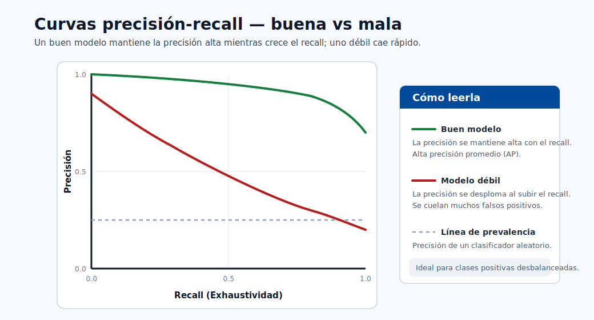
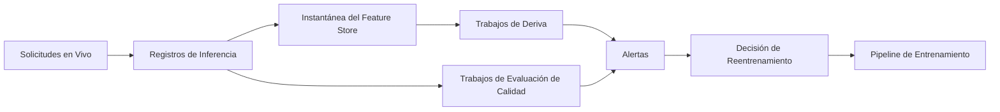

# Resultados y Explicabilidad

Este módulo enseña cómo pasar de la presentación de puntuaciones del modelo al análisis del comportamiento del modelo confiable
para las partes interesadas técnicas y no técnicas.

## Artefactos de revisión del modelo

- Matriz de confusión
- Curvas ROC y de precisión-recall
- Importancia de características
- Explicaciones SHAP y LIME

## Explicabilidad global vs local

| Tipo | Propósito | Ejemplo |
|---|---|---|
| Global | Explicar el comportamiento general del modelo | Las principales características en todas las muestras |
| Local | Explicar una sola predicción | Por qué se predijo que el cliente A tiene alto riesgo |

Use ambas:

- Global explica el comportamiento a nivel de estrategia y ayuda a los científicos de datos a verificar que el modelo aprendió señales reales (no artefactos de fuga).
- Local soporta revisiones de casos, apelaciones y rastros de auditoría regulatoria.

### Ejemplo de resumen SHAP (modelo tabular)

```python
import shap
import lightgbm as lgb

model = lgb.LGBMClassifier().fit(X_train, y_train)
explainer = shap.TreeExplainer(model)
shap_values = explainer.shap_values(X_test)

# Gráfico de importancia global
shap.summary_plot(shap_values[1], X_test, plot_type="bar")

# Explicación local para una predicción
shap.force_plot(explainer.expected_value[1], shap_values[1][0], X_test.iloc[0])
```

### Interpretación de los valores SHAP

- Valor SHAP para la característica $j$ en la muestra $i$: el cambio en la salida del modelo atribuible a la característica $j$.
- SHAP positivo = empuja la predicción hacia arriba. SHAP negativo = empuja la predicción hacia abajo.
- La suma de todos los valores SHAP es igual a la salida del modelo menos el valor esperado.

## Monitoreo y Deriva

Deriva de covariables (cambio de distribución de entrada):

$$
P_t(X)\neq P_{t+\Delta}(X)
$$

Deriva de concepto (cambio de mapeo):

$$
P_t(Y\mid X)\neq P_{t+\Delta}(Y\mid X)
$$

Índice de Estabilidad de la Población (PSI):

$$
\mathrm{PSI}=\sum_{b=1}^{B}(a_b-e_b)\ln\frac{a_b}{e_b}
$$

donde $a_b$ y $e_b$ son las proporciones de contenedores actual y esperada.

Orientación operacional:

- Establecer ventanas de referencia a partir de períodos de datos estables.
- Alertar tanto sobre las métricas de deriva como sobre los cambios en los KPI del negocio.
- Activar el reentrenamiento solo cuando los umbrales persisten, no por picos únicos.


> **Nota - Cómo leerla:** Curvas ROC buenas vs malas. Un modelo cuya curva se curva hacia la parte superior izquierda separa bien las clases
> (alta AUC); una cerca de la diagonal es poco mejor que aleatoria. Comparar candidatos en la misma
> partición de validación.



> **Nota - Cómo leerla:** Curvas de precisión-recall buenas vs malas. En datos desbalanceados las curvas PR son más honestas que las ROC: una
> curva que se mantiene alta a medida que aumenta el recall significa que el modelo mantiene la precisión mientras captura más
> positivos.

Use tanto explicaciones globales como locales antes de la publicación en producción.

## Pila de explicabilidad en la práctica

- SHAP: fuerte para la interpretabilidad de modelos tabulares. Exacto para modelos de árbol (TreeSHAP); aproximado para otros (KernelSHAP).
- LIME: aproximación local alrededor de una predicción usando un modelo sustituto lineal.
- Importancia de permutación: señal global agnóstica del modelo. Mide la caída de exactitud cuando los valores de una característica se mezclan aleatoriamente.

### Cómo elegir entre SHAP y LIME

| Criterio | SHAP | LIME |
|---|---|---|
| Consistencia de las explicaciones | Alta (fundamentada en teoría de juegos) | Varía con la muestra aleatoria |
| Velocidad para modelos de árbol | Rápida (TreeSHAP es $O(TLD^2)$) | Lenta (requiere predicción repetida) |
| Funciona con cualquier modelo | Sí (KernelSHAP) | Sí |
| Adecuada para depuración | Sí | Sí, especialmente para modelos de caja negra |

### Importancia de permutación en código

```python
from sklearn.inspection import permutation_importance

result = permutation_importance(model, X_test, y_test, n_repeats=10, random_state=42)
for i in result.importances_mean.argsort()[::-1]:
    print(f"{X_test.columns[i]:<25} {result.importances_mean[i]:.4f} +/- {result.importances_std[i]:.4f}")
```

## Lista de verificación de gobernanza

1. Documentar los supuestos del modelo y las limitaciones conocidas.
2. Validar el rendimiento por segmentos importantes de usuarios.
3. Rastrear la versión del modelo y los artefactos de explicación juntos.
4. Definir la ruta de escalada para los incidentes del modelo.

## Plantilla de tarjeta del modelo (recomendada)

| Sección | Qué documentar |
|---|---|
| Uso previsto | Objetivo del negocio, usuarios objetivo, no objetivos |
| Datos | Fuentes, muestreo, sesgos conocidos |
| Métricas | Métricas primarias/secundarias y umbrales |
| Explicabilidad | Métodos usados (SHAP/LIME/PFI) |
| Equidad | Resultados a nivel de segmento y notas de mitigación |
| Límites de seguridad | Condiciones donde el modelo no debe usarse |
| Operaciones | Cadencia de reentrenamiento, umbrales de alerta, plan de reversión |

## Arquitectura de monitoreo



## Política de respuesta para alertas de deriva

1. Validar la calidad de la alerta (descartar problemas de registro o pipeline).
2. Verificar el movimiento del KPI del negocio vs la deriva estadística.
3. Activar el reentrenamiento en la sombra antes del cambio de producción.
4. Usar el despliegue canary para el modelo de reemplazo.

### Guía de decisión para la cadencia de reentrenamiento

| Señal | Acción recomendada |
|---|---|
| PSI > 0.2 en características clave | Iniciar investigación de deriva, considerar reentrenamiento |
| SLO de calidad de predicción no cumplido durante 2+ semanas consecutivas | Reentrenamiento obligatorio + causa raíz |
| Retraso de retroalimentación de etiquetas (etiquetas obsoletas) | Recopilar etiquetas nuevas, luego reentrenar |
| Auditoría regulatoria o revisión de equidad | Reentrenar en un conjunto de datos actualizado y auditado |
| Sin señal de deriva durante 3+ meses | Reentrenamiento proactivo programado de todas formas |

### Lista de verificación de monitoreo para nuevos despliegues

1. Conjunto de datos de referencia almacenado y con huella digital.
2. Monitor de deriva de características configurado (PSI o prueba KS por característica).
3. Monitor de distribución de predicciones configurado.
4. Umbrales de alerta establecidos y webhook de PagerDuty/Teams adjunto.
5. Trabajo de evaluación de calidad del modelo programado (semanal o mensual).
6. El despliegue de reversión está etiquetado y accesible.

## Inmersión profunda: cada concepto explicado

Esta sección explica la teoría detrás de las herramientas de explicabilidad y deriva para que pueda confiar
y defender sus salidas.

### Por qué la explicabilidad es un requisito, no un lujo

Un modelo que no puede explicarse no puede depurarse, auditarse ni defenderse legalmente. La explicabilidad
sirve a tres audiencias distintas: los **científicos de datos** que verifican que el modelo aprendió señal real (no
un artefacto de fuga), las **partes interesadas del negocio** que confían en él y lo adoptan, y los **reguladores/usuarios afectados**
que tienen derecho a saber por qué se tomó una decisión. Por eso el módulo separa las explicaciones globales
de las locales: responden preguntas diferentes para personas diferentes.

### Global vs local, con precisión

- Las explicaciones **globales** describen el comportamiento *general* del modelo: qué características importan en todas
  las predicciones. Responden "¿qué aprendió el modelo?"
- Las explicaciones **locales** describen *una* predicción: por qué este cliente fue puntuado de alto riesgo. Responden "¿por qué esta decisión?" y son lo que necesita un proceso de apelación o auditoría.

Un modelo puede tener un comportamiento global sensato y sin embargo una explicación local incorrecta para un caso límite, por lo que
ambas vistas son requeridas antes de la publicación.

### SHAP: una distribución justa del crédito

**SHAP (SHapley Additive exPlanations)** toma prestado el **valor de Shapley** de la teoría de juegos cooperativos.
La idea: tratar cada característica como un "jugador" y la predicción como el "pago", luego
distribuir el pago equitativamente entre las características promediando la contribución marginal de cada característica
sobre *todos los posibles ordenamientos* de las demás. Esto produce la **propiedad de aditividad** que nota el módulo: los valores SHAP para un ejemplo suman (salida del modelo − salida esperada). Concretamente, un
valor SHAP positivo empujó la predicción hacia arriba; uno negativo la empujó hacia abajo; su total explica
toda la brecha desde la línea de base.

Por qué se prefiere SHAP para los modelos tabulares:

- Es **consistente y localmente exacto** (fundamentado en axiomas), por lo que las explicaciones no cambian arbitrariamente.
- **TreeSHAP** calcula los valores exactos de Shapley para los conjuntos de árboles en tiempo polinomial
  ($O(TLD^2)$ para $T$ árboles, $L$ hojas, profundidad $D$), haciéndolo lo suficientemente rápido para producción.
- Para los modelos no arbóreos, **KernelSHAP** aproxima los mismos valores de forma agnóstica al modelo (más lento).

### LIME e importancia de permutación: las herramientas complementarias

- **LIME** (Explicaciones de Modelo Agnóstico Interpretable Local) explica una predicción muestreando
  puntos perturbados alrededor de ella y ajustando un modelo simple de **sustituto** (generalmente lineal) localmente.
  Funciona en cualquier caja negra pero, porque depende del muestreo aleatorio, sus explicaciones pueden variar
  entre ejecuciones: la debilidad de consistencia señalada en la tabla de comparación.
- La **importancia de permutación** es una señal global agnóstica del modelo: mezcle los valores de una característica y
  mida cuánto cae la exactitud. Una gran caída significa que el modelo se basó en esa característica. Es
  económica e intuitiva pero puede ser engañada por características correlacionadas.

### Deriva: las dos distribuciones que pueden cambiar

El fallo de producción generalmente se rastrea hasta que una distribución cambia por debajo del modelo:

- **Deriva de covariables (de datos)**: las entradas cambian: $P_t(X) \neq P_{t+\Delta}(X)$. Ejemplo: un nuevo
  segmento de clientes con diferentes patrones de gasto. El mapeo puede seguir siendo válido, pero el modelo
  ve entradas diferentes a los datos de entrenamiento.
- **Deriva de concepto**: la *relación* cambia: $P_t(Y\mid X) \neq P_{t+\Delta}(Y\mid X)$.
  Ejemplo: las tácticas de fraude evolucionan, por lo que las mismas características ahora implican un riesgo diferente. Esto es más
  peligroso porque la función aprendida es ahora simplemente incorrecta.

Distinguirlas importa: la deriva de covariables puede corregirse ponderando de nuevo o recopilando nuevos datos;
la deriva de concepto generalmente requiere reentrenamiento con etiquetas nuevas.

### PSI, de forma intuitiva

El **Índice de Estabilidad de la Población** $\text{PSI}=\sum_b (a_b-e_b)\ln\tfrac{a_b}{e_b}$ compara la
distribución binificada *actual* de una característica ($a_b$) contra una *línea de base* ($e_b$). Cada término crece cuando
la parte de un contenedor se aleja de su parte de línea de base, por lo que PSI es un único número que mide "¿cuánto
se ha movido esta distribución?" Umbrales comunes: **< 0.1** sin cambio significativo, **0.1-0.2**
moderado (investigar), **> 0.2** significativo (probablemente reentrenar).

### Por qué el reentrenamiento se basa en umbrales y persistencia, no es reflexivo

La orientación operacional: alertar sobre deriva persistente, validar contra KPIs del negocio, probar en la sombra
antes de cambiar: existe porque el reentrenamiento es costoso y arriesgado. Un único pico de deriva puede ser un
problema de registro; reaccionar a él cicla modelos innecesariamente. La disciplina es: confirmar que la señal es
real *y* sostenida *y* ligada a un movimiento del KPI, luego reentrenar en un despliegue **en la sombra** o **canary**
antes de promover. Esto vincula la explicabilidad/monitoreo de vuelta a las estrategias de lanzamiento del módulo de despliegue.

## Autoevaluación rápida

| # | Pregunta | Respuesta |
|---|----------|-----------|
| 1 | ¿Qué pregunta diferente responde una explicación *local* en comparación con una *global*? | Una explicación local responde "¿por qué esta decisión?" para una sola predicción; una global responde "¿qué aprendió el modelo?" a través de todas las predicciones. |
| 2 | ¿Por qué los valores SHAP para una sola predicción suman "salida del modelo menos valor esperado"? | SHAP reparte de forma justa la predicción (el pago) entre las características mediante valores de Shapley, y su axioma de aditividad garantiza que las contribuciones sumen la diferencia entre la salida y el valor esperado de referencia. |
| 3 | ¿Cuándo elegiría LIME sobre TreeSHAP, y cuál es la principal debilidad de LIME? | Use LIME para una explicación local rápida y agnóstica al modelo de una caja negra no basada en árboles; su principal debilidad es la inestabilidad: el muestreo aleatorio hace que las explicaciones varíen entre ejecuciones. |
| 4 | ¿Cuál es la diferencia entre la deriva de covariables y la deriva de concepto, y cuál generalmente fuerza el reentrenamiento? | La deriva de covariables es un cambio en las entradas $P(X)$; la deriva de concepto es un cambio en la relación $P(Y \mid X)$. La deriva de concepto suele forzar el reentrenamiento porque la función aprendida ya es incorrecta. |
| 5 | Una característica clave muestra PSI = 0.27: ¿qué indica eso y qué debe hacer antes de reentrenar? | PSI > 0.2 indica un cambio de distribución significativo; antes de reentrenar, confirme que la señal es real y sostenida (no un fallo de registro) y está ligada a un movimiento del KPI, luego pruebe el nuevo modelo en sombra o canary. |

---

## Métodos avanzados de explicabilidad

### Gradientes integrados (redes neuronales)

Para los modelos diferenciables como las redes neuronales profundas, los **Gradientes Integrados (IG)** proporcionan un método de atribución axiomático que requiere solo acceso a gradientes.

La definición formal para la característica $i$ dada la entrada $x$ y la línea de base $x'$ es:

$$
\text{IG}_i(x) = (x_i - x'_i) \times \int_0^1 \frac{\partial F(x' + \alpha(x-x'))}{\partial x_i} \, d\alpha
$$

donde $F$ es la salida de la red neuronal y $\alpha \in [0,1]$ interpola entre la línea de base
y la entrada real.

**Propiedad de completitud.** Al igual que SHAP, IG satisface el axioma de completitud:

$$
\sum_{i=1}^{d} \text{IG}_i(x) = F(x) - F(x')
$$

```python
import torch
from captum.attr import IntegratedGradients

model.eval()
ig = IntegratedGradients(model)

# línea de base: tensor de la media de características
baseline = X_train_tensor.mean(dim=0, keepdim=True)

attributions, delta = ig.attribute(
    X_test_tensor[:1],
    baselines=baseline,
    n_steps=200,
    return_convergence_delta=True
)
print("Delta de convergencia (debe estar cerca de 0):", delta.item())
```

> **Nota - Delta de convergencia:** El delta de convergencia mide qué tan bien la aproximación integral
> satisface la propiedad de completitud. Un delta cercano a cero confirma que la atribución es confiable.
> Si es grande, aumente `n_steps`.

> **Consejo - Integración con Azure ML:** Registre las atribuciones IG como artefactos MLflow junto con cada
> versión de modelo registrado para que las explicaciones sean rastreables hasta el estado exacto del modelo.

### Explicaciones contrafactuales

Una **explicación contrafactual** responde: *"¿Cuál es el cambio mínimo en la entrada que cambiaría la predicción del modelo?"*

**El algoritmo DiCE** (Diverse Counterfactual Explanations) genera un conjunto de $k$ contrafactuales diversos en lugar de un único de distancia mínima:

$$
\underset{c_1,\ldots,c_k}{\text{minimizar}} \;\; \underbrace{\sum_{j} \text{yloss}(F(c_j), y_{\text{objetivo}})}_{\text{pérdida de predicción}} + \lambda_1 \underbrace{\sum_j d(x, c_j)}_{\text{proximidad}} - \lambda_2 \underbrace{\text{diversidad}(c_1,\ldots,c_k)}_{\text{dispersión}}
$$

```python
import dice_ml
from dice_ml import Dice

data = dice_ml.Data(dataframe=train_df, continuous_features=cont_cols, outcome_name="label")
model_d = dice_ml.Model(model=clf, backend="sklearn")

exp = Dice(data, model_d, method="random")
cf = exp.generate_counterfactuals(
    query_instances=X_test.iloc[:1],
    total_CFs=4,
    desired_class="opposite"
)
cf.visualize_as_dataframe()
```

**Propiedades clave de los buenos contrafactuales:**

| Propiedad | Significado |
|---|---|
| Validez | El contrafactual realmente cambia la predicción |
| Proximidad | Las características cambian lo menos posible |
| Dispersión | Pocas características cambian (más fácil de actuar) |
| Accionabilidad | Solo cambian las características mutables (no la edad, la raza, etc.) |
| Diversidad | Existen múltiples caminos para que el usuario tenga una elección real |

**Caso de uso regulatorio.** Tanto la Ley de IA de la UE como el artículo 22 del GDPR establecen derechos de explicación
para las decisiones automatizadas. Los contrafactuales satisfacen directamente la interpretación del "derecho de recurso"
porque muestran al individuo afectado lo que podría cambiar.

---

## Evaluación de equidad en profundidad

La explicabilidad le dice *qué* aprendió el modelo; la evaluación de equidad le dice si lo que aprendió es equitativo para los grupos protegidos.

### Cuatro criterios de equidad

Sean $\hat{Y}$ la predicción, $Y$ la etiqueta verdadera y $A$ el atributo protegido.

**1. Paridad demográfica** (paridad estadística):

$$
P(\hat{Y}=1 \mid A=0) = P(\hat{Y}=1 \mid A=1)
$$

**2. Odds igualadas:**

$$
P(\hat{Y}=1 \mid Y=y, A=0) = P(\hat{Y}=1 \mid Y=y, A=1) \quad \forall y \in \{0,1\}
$$

**3. Equidad individual:**

$$
d_{\text{salida}}(F(x), F(x')) \leq L \cdot d_{\text{entrada}}(x, x')
$$

**4. Calibración:**

$$
P(Y=1 \mid \hat{p}=p, A=a) = p \quad \forall p, a
$$

### El teorema de imposibilidad

Un resultado crítico en la equidad algorítmica (Chouldechova 2017; Kleinberg et al. 2016) establece que
**ningún clasificador puede satisfacer simultáneamente la paridad demográfica, las odds igualadas y la calibración**
a menos que las tasas base sean iguales entre grupos o el clasificador sea perfecto. La implicación es que
**la equidad requiere una elección normativa**: decidir qué criterio es más importante para la aplicación específica y documentar esa elección como parte de la tarjeta del modelo.

### Kit de herramientas Fairlearn

```python
from fairlearn.metrics import MetricFrame, selection_rate, false_positive_rate, true_positive_rate
from sklearn.metrics import accuracy_score

mf = MetricFrame(
    metrics={
        "accuracy": accuracy_score,
        "selection_rate": selection_rate,
        "fpr": false_positive_rate,
        "tpr": true_positive_rate,
    },
    y_true=y_test,
    y_pred=y_pred,
    sensitive_features=A_test["gender"]
)

print(mf.by_group)
print("Disparidad máxima en FPR:", mf.difference(method="between_groups")["fpr"])
```

```python
# Mitigación: optimizador de umbral para odds igualadas
from fairlearn.postprocessing import ThresholdOptimizer

optimizer = ThresholdOptimizer(
    estimator=clf,
    constraints="equalized_odds",
    objective="balanced_accuracy_score"
)
optimizer.fit(X_train, y_train, sensitive_features=A_train["gender"])
y_fair = optimizer.predict(X_test, sensitive_features=A_test["gender"])
```

> **Nota - Trade-off de mitigación:** La mitigación post-procesamiento (optimización de umbral) reduce
> la disparidad entre grupos pero típicamente reduce la exactitud general. Documente tanto las métricas pre como post-mitigación en la tarjeta del modelo. El trade-off es una decisión de negocio y ética, no técnica.

---

## Flujo de trabajo de depuración del modelo

El **panel de IA Responsable** en Azure ML consolida la explicabilidad, el análisis de errores, la equidad
y los conocimientos causales en una única superficie interactiva.

### Componentes del panel de IA Responsable

| Componente | Pregunta que responde |
|---|---|
| Análisis de errores | ¿Qué subgrupos tienen la mayor tasa de error? |
| Resumen del modelo | Métricas de rendimiento generales (exactitud, AUC, F1) |
| Explorador de datos | Distribuciones de características entre cohortes |
| Importancia de características | Valores SHAP globales |
| Predicciones individuales | SHAP local + contrafactuales |
| Equidad | Métricas de disparidad entre grupos protegidos |
| Análisis causal | Efecto causal estimado de las características en el resultado |

### Flujo de trabajo de análisis de cohortes

1. **Empezar globalmente.** Revisar las métricas generales y la importancia SHAP. Confirmar que el modelo aprendió la señal prevista y no un artefacto de fuga.
2. **Identificar puntos críticos de error.** Ejecutar análisis de errores para identificar la partición de características con la mayor concentración de errores.
3. **Profundizar en la cohorte.** Filtrar al subgrupo de alto error. Inspeccionar las distribuciones de características para comprender si los datos de entrenamiento sub-representan a este grupo.
4. **Generar contrafactuales para los falsos negativos.** Para los casos mal clasificados, generar contrafactuales para comprender qué valores de características habrían cambiado el resultado.
5. **Auditoría de equidad.** Comparar FPR y TPR entre grupos protegidos. Documentar cualquier disparidad y decidir sobre una estrategia de mitigación.
6. **Aprobar o iterar.** Si el punto crítico de error es una brecha de datos conocida, planificar la recopilación de datos específica.

> **Consejo - Exportar el panel:** El panel de IA Responsable puede exportarse como un informe HTML estático para envíos regulatorios usando `rai.export_to_html("rai_report.html")`.

---

## Inmersión profunda en la arquitectura de monitoreo

### Pruebas estadísticas de deriva en profundidad

**Distancia de Wasserstein (Distancia del Transportador de Tierra):**

$$
W_1(P, Q) = \inf_{\gamma \in \Gamma(P,Q)} \mathbb{E}_{(x,y) \sim \gamma}[|x - y|]
$$

Intuitivamente, el "trabajo" mínimo necesario para transformar la distribución $P$ en la distribución $Q$.

**Prueba de Kolmogorov-Smirnov (KS):**

$$
D_{KS} = \sup_x |F_P(x) - F_Q(x)|
$$

La diferencia absoluta máxima entre las dos CDF empíricas. La prueba KS proporciona un valor $p$, que el PSI no, haciéndola útil para alertas estadísticamente fundamentadas.

**PSI vs KS vs Wasserstein: cuándo usar cada uno:**

| Métrica | Sensible a | Salida | Mejor para |
|---|---|---|---|
| PSI | Cambios de proporción a nivel de contenedor | Índice escalar | Paneles de características tabulares, umbrales interpretables |
| Prueba KS | Diferencias a nivel de CDF | Estadístico $D$ + valor $p$ | Prueba de significancia estadística por característica |
| Wasserstein | Geometría de la distribución completa | Distancia en unidades de características | Detectar cambios continuos sutiles |

> **Nota - Usar los tres:** Una pila de monitoreo de producción típicamente ejecuta los tres y alerta cuando
> al menos dos están de acuerdo. Esto reduce los falsos positivos (el PSI solo puede activarse con ruido de muestreo)
> mientras mantiene sensibilidad a la deriva genuina.

### Pipelines de reentrenamiento

El monitoreo le indica *cuándo* reentrenar; esta sección define *cómo* hacerlo de forma segura.

**El patrón campeón-retador** garantiza que el nuevo modelo (retador) sea validado contra el titular (campeón) en tráfico real antes de cualquier promoción. El proceso:

1. **Entrenar el retador** con datos actualizados.
2. **Evaluar fuera de línea**: el retador debe igualar o superar al campeón en el conjunto de holdout.
3. **Despliegue en la sombra** del retador junto al campeón.
4. **Comparar en tráfico de producción**: recopilar predicciones de ambos; comparar la calidad una vez que las etiquetas estén disponibles.
5. **Promover** el retador al campeón solo si el delta de calidad supera el umbral mínimo de mejora detectable.
6. **Retirar** el campeón antiguo y mantenerlo archivado para reversión durante 30 días.

```python
# Puntuación en la sombra: ejecutar ambos modelos, registrar predicciones del retador sin servirlas
def run(raw_data: str) -> str:
    data = json.loads(raw_data)
    features = np.array(data["features"])

    # Predicción del campeón: servida al llamante
    champion_pred = champion_model.predict_proba(features)

    # Predicción del retador: solo registrada, nunca devuelta
    try:
        challenger_pred = challenger_model.predict_proba(features)
        mlflow.log_metric("challenger_score", float(challenger_pred[0][1]))
    except Exception as e:
        logging.warning("Falló la inferencia del retador: %s", e)

    return json.dumps({
        "prediction": champion_model.predict(features).tolist(),
        "probability": champion_pred.tolist()
    })
```

> **Nota - Costo en la sombra:** El despliegue en la sombra aproximadamente duplica el costo de cómputo durante el período de evaluación.
> Presupueste en consecuencia y establezca una ventana máxima de evaluación en la sombra (p. ej., dos semanas).
