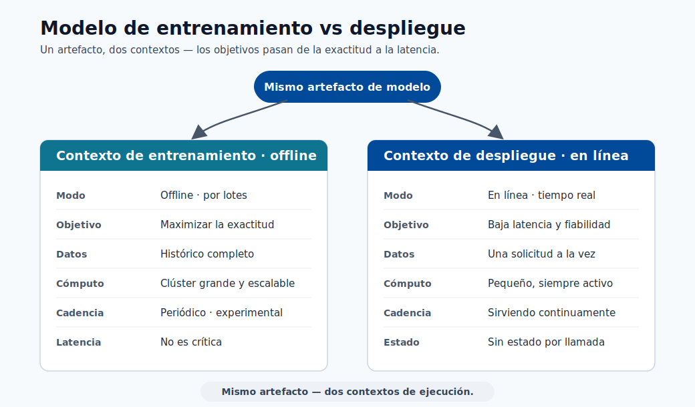
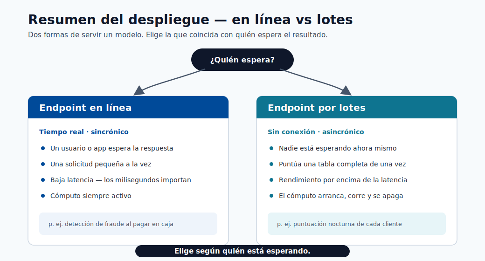
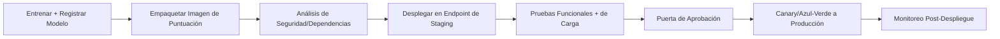
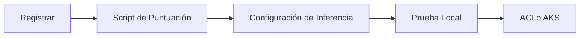

# Despliegue

Este módulo cubre el camino desde el artefacto del modelo hasta el endpoint de producción, incluyendo
patrones de despliegue, estrategias de lanzamiento y salvaguardas operacionales.



> **Nota - Qué muestra esto:** El contraste entre el modelo de *entrenamiento* (fuera de línea, por lotes, optimizado para exactitud) y el
> modelo de *despliegue* (en línea, sin estado, optimizado para latencia). El mismo artefacto sirve a dos contextos de tiempo de ejecución muy diferentes.


> **Nota - Qué muestra esto:** El flujo de despliegue desde el modelo registrado hasta el endpoint activo. Cada etapa: empaquetar, validar
> localmente, desplegar, enrutar el tráfico: es un punto de control donde se puede detener un lanzamiento antes de que los clientes
> se vean afectados.



> **Nota - Qué muestra esto:** Una visión general de alto nivel de las opciones de despliegue (endpoints en línea vs por lotes). Elija por *quién espera*:
> un usuario/aplicación en tiempo real → endpoint en línea; una tabla completa puntuada durante la noche → endpoint por lotes.

## Pasos del despliegue

1. Registrar el modelo
2. Construir el script de puntuación con init y run
3. Crear el entorno de inferencia
4. Validar el despliegue local
5. Desplegar en ACI o AKS

### Estructura del script de puntuación (Azure ML SDK v2)

```python
import json
import numpy as np
import joblib
from azureml.core.model import Model

def init():
    global model
    model_path = Model.get_model_path("fraud-model")
    model = joblib.load(model_path)

def run(raw_data: str) -> str:
    data = json.loads(raw_data)
    features = np.array(data["features"])
    prediction = model.predict(features)
    probability = model.predict_proba(features)
    return json.dumps({
        "prediction": prediction.tolist(),
        "probability": probability.tolist()
    })
```

Reglas clave para un script de puntuación de calidad de producción:

- `init()` se ejecuta una vez al inicio; cargar el modelo aquí, no en `run()`.
- `run()` se llama para cada solicitud; mantenerlo sin estado.
- Validar el esquema de entrada dentro de `run()` antes de llamar al modelo.
- Nunca registrar PII sin procesar; registrar IDs con hash y metadatos de predicción únicamente.

## Tipos de endpoints

| Tipo | Mejor para | Trade-off |
|---|---|---|
| Endpoint en línea | Predicciones en tiempo real | Requiere operaciones de baja latencia |
| Endpoint por lotes | Grandes trabajos de puntuación fuera de línea | No es tiempo real |

## Ejemplo de extremo a extremo: llamar a un modelo desplegado

Esto muestra exactamente cómo se ve un modelo desplegado en la práctica: la API, qué enviar,
cómo llamarla y qué regresa, usando el `fraud-endpoint` del script de puntuación anterior.


> **Nota - Cómo leer este diagrama:** El cliente envía un `POST` HTTPS con un cuerpo JSON de filas de características. El endpoint autentica la llamada, valida el esquema y la enruta a una réplica activa.
> Dentro, `init()` ya ha cargado el modelo registrado una vez, por lo que `run()` solo hace la predicción rápida
> y devuelve un cuerpo JSON con la clase predicha y la probabilidad por clase.

### 1. Cómo se ve la API

Después del despliegue, Azure ML le proporciona dos cosas:

| Elemento | Ejemplo | Cómo obtenerlo |
|---|---|---|
| URI de puntuación | `https://fraud-endpoint.eastus.inference.ml.azure.com/score` | `az ml online-endpoint show -n fraud-endpoint --query scoring_uri` |
| Clave/token de autenticación | `Bearer <primary-key>` | `az ml online-endpoint get-credentials -n fraud-endpoint` |

El contrato es un simple HTTP POST:

| Campo | Valor |
|---|---|
| Método | `POST` |
| Ruta | `/score` |
| Cabeceras | `Content-Type: application/json`, `Authorization: Bearer <key>` |
| Cuerpo | Objeto JSON: `{"features": [[...], [...]]}` |

### 2. La solicitud que envía

```json
{
  "features": [
    [0.21, 1.4, 0.0, 7, 1, 0.55],
    [1.02, 0.3, 2.1, 2, 0, 0.10]
  ]
}
```

Cada arreglo interno es un registro, con valores en el **mismo orden de columnas usado durante el entrenamiento**.
Aquí enviamos dos transacciones en una sola llamada (agrupar reduce la sobrecarga por solicitud).

### 3. Cómo llamarla

=== "curl"

    ```bash
    curl -X POST "https://fraud-endpoint.eastus.inference.ml.azure.com/score" \
      -H "Content-Type: application/json" \
      -H "Authorization: Bearer $ENDPOINT_KEY" \
      -d '{"features": [[0.21, 1.4, 0.0, 7, 1, 0.55], [1.02, 0.3, 2.1, 2, 0, 0.10]]}'
    ```

=== "Python"

    ```python
    import os
    import requests

    url = "https://fraud-endpoint.eastus.inference.ml.azure.com/score"
    headers = {
        "Content-Type": "application/json",
        "Authorization": f"Bearer {os.environ['ENDPOINT_KEY']}",
    }
    payload = {"features": [[0.21, 1.4, 0.0, 7, 1, 0.55],
                            [1.02, 0.3, 2.1, 2, 0, 0.10]]}

    response = requests.post(url, json=payload, headers=headers, timeout=10)
    response.raise_for_status()
    result = response.json()

    for i, (label, proba) in enumerate(zip(result["prediction"], result["probability"])):
        confidence = max(proba)
        print(f"fila {i}: clase={label} confianza={confidence:.0%}")
    ```

=== "JavaScript"

    ```javascript
    const res = await fetch("https://fraud-endpoint.eastus.inference.ml.azure.com/score", {
      method: "POST",
      headers: {
        "Content-Type": "application/json",
        Authorization: `Bearer ${process.env.ENDPOINT_KEY}`,
      },
      body: JSON.stringify({
        features: [
          [0.21, 1.4, 0.0, 7, 1, 0.55],
          [1.02, 0.3, 2.1, 2, 0, 0.10],
        ],
      }),
    });
    const result = await res.json();
    console.log(result.prediction, result.probability);
    ```

### 4. La respuesta que recibe

```json
{
  "prediction": [1, 0],
  "probability": [
    [0.08, 0.92],
    [0.86, 0.14]
  ]
}
```

### 5. Cómo leer el resultado

| Fila | `prediction` | `probability` `[P(clase0), P(clase1)]` | Significado |
|---|---|---|---|
| 0 | `1` | `[0.08, 0.92]` | Marcado como **fraude** con 92% de confianza |
| 1 | `0` | `[0.86, 0.14]` | Predicho como **legítimo** con 86% de confianza |

- `prediction` es la clase elegida por el modelo por fila (aquí `1 = fraude`, `0 = legítimo`).
- `probability` da la confianza por clase; los valores en cada fila suman `1.0`.
- Su aplicación decide el **umbral de acción**: p. ej. bloqueo automático cuando `P(fraude) >= 0.90`, enviar a
  revisión manual entre `0.50` y `0.90`, y permitir por debajo de `0.50`. El modelo devuelve puntuaciones; la
  regla de negocio las convierte en decisiones.

> **Consejo - Manejar errores en el cliente:** Espere también respuestas que no sean `200`: `401/403` (clave incorrecta o caducada),
> `400` (discrepancia de esquema/forma), `429` (limitación de velocidad, esperar y reintentar), y `503` (arranque en frío de réplica
> o sobrecarga). Siempre establezca un tiempo de espera y un pequeño reintento con retroceso.

## Estrategias de lanzamiento


> **Consejo - Cómo elegir:** Las tres protegen el modelo activo (v1) mientras validan uno nuevo (v2). **Azul-verde** cambia el 100%
> del tráfico a la vez y revierte cambiando de vuelta: el más simple, pero el radio de impacto es toda la
> base de usuarios en el momento del cambio. **Canary** envía una pequeña parte (p. ej. 5%) a v2 y aumenta
> solo mientras las métricas se mantengan saludables: el despliegue progresivo más seguro. **En la sombra** refleja el tráfico real
> a v2 pero descarta sus respuestas, para que pueda probarse con carga de producción con cero impacto en el cliente
> antes de cualquier cambio real.

- Azul/verde: cambiar el tráfico a una nueva versión completamente preparada.
- Canary: enviar primero un pequeño porcentaje del tráfico a la nueva versión.
- En la sombra: reflejar el tráfico para observación sin servir respuestas.

### Cuándo usar cada estrategia

| Estrategia | Usar cuando | Nivel de riesgo |
|---|---|---|
| Azul/verde | La reversión debe ser instantánea; la nueva versión está bien probada | Bajo (con reversión lista) |
| Canary | Necesita validar el nuevo modelo en tráfico real con baja exposición | Medio |
| En la sombra | Necesita comparar el nuevo modelo con cero exposición del cliente | Muy bajo (sin impacto en producción) |
| Actualización continua | Microservicio sin estado sin estado específico del modelo | Bajo |

### Configurar la división de tráfico canary (endpoint en línea gestionado de Azure ML)

```yaml
# deployment.yml
$schema: https://azuremlschemas.azureedge.net/latest/managedOnlineDeployment.schema.json
name: blue
endpoint_name: fraud-endpoint
model: azureml:fraud-model:3
code_configuration:
  code: ./src
  scoring_script: score.py
environment: azureml:fraud-infer:2
instance_type: Standard_DS2_v2
instance_count: 1
```

Después de desplegar tanto `blue` como `green`:

```bash
# Enrutar el 10% del tráfico al canary (green)
az ml online-endpoint update \
  --name fraud-endpoint \
  --traffic "blue=90 green=10"
```

## Lista de verificación de confiabilidad

1. Sondas de salud y comprobaciones de vivacidad configuradas.
2. Validación del esquema de solicitud/respuesta en el script de puntuación.
3. Tiempos de espera y reintentos definidos en la capa de cliente y servicio.
4. Criterios de reversión definidos antes del lanzamiento.

## Lista de verificación de seguridad

- Aplicar claves/tokens de autenticación y rotar las credenciales.
- Restringir la exposición de red (endpoints privados cuando sea posible).
- Registrar el acceso y los metadatos de predicción para auditorías.

## Pipeline de CI/CD para despliegue (recomendado)



## Conceptos básicos de planificación de capacidad

Estimación de réplicas requeridas:

$$
R \approx \left\lceil \frac{QPS\cdot t_{p95}}{u}\right\rceil
$$

donde:

- $QPS$: solicitudes esperadas por segundo
- $t_{p95}$: tiempo de servicio p95 (segundos)
- $u$: utilización objetivo por réplica (p. ej., 0.6 a 0.8)

## Tabla de SLI/SLO en tiempo de ejecución

| SLI | SLO típico |
|---|---|
| Disponibilidad | >= 99.9% |
| Latencia p95 | <= 250 ms |
| Tasa de error | <= 1% |
| Frescura de la versión del modelo | <= 30 días (dependiente de la política) |



## Autoevaluación rápida

| # | Pregunta | Respuesta |
|---|----------|-----------|
| 1 | ¿Cuándo es mejor el endpoint por lotes que el endpoint en línea? | Cuando ningún usuario espera la respuesta: puntuación masiva y sin conexión de grandes conjuntos de datos (p. ej., puntuar una tabla entera durante la noche). |
| 2 | ¿Por qué ejecutar una etapa de validación local antes del despliegue en la nube? | Detecta los fallos baratos y comunes (dependencias defectuosas, errores de carga del modelo, discrepancias de esquema) en segundos, antes de pagar el aprovisionamiento en la nube o arriesgar un despliegue de producción fallido. |
| 3 | ¿Cuál es la ventaja del lanzamiento canary? | Enruta una pequeña parte del tráfico real a la nueva versión y observa las métricas antes de aumentar, limitando el radio de impacto y detectando problemas que las pruebas fuera de línea pierden. |

## Inmersión profunda: cada concepto explicado

Esta sección explica los conceptos de despliegue para que cada elección operacional tenga una justificación clara.

### Por qué `init()` y `run()` están separados

El script de puntuación tiene dos funciones por diseño:

- **`init()`** se ejecuta **una vez** cuando el contenedor se inicia. Cargar el modelo (a menudo cientos de MB)
  es costoso, por lo que hacerlo aquí, en una variable global, significa que ocurre una única vez, no por solicitud.
- **`run()`** se ejecuta **por solicitud** y debe ser **sin estado**: sin estado mutable compartido entre
  llamadas, para que las solicitudes concurrentes no puedan corromperse entre sí. La ausencia de estado es también lo que hace
  que el servicio sea escalable horizontalmente: cualquier réplica puede manejar cualquier solicitud.

Esta separación determina directamente la latencia: la carga del modelo es un costo de **arranque en frío** único;
`run()` es la ruta **en caliente** por solicitud que se optimiza.

### Endpoints en línea vs por lotes: ajustar la forma a la carga de trabajo

| Dimensión | Endpoint en línea | Endpoint por lotes |
|---|---|---|
| Disparador | Solicitud HTTP síncrona | Trabajo programado/bajo demanda |
| Objetivo de latencia | Milisegundos por solicitud | Rendimiento sobre millones de filas |
| Escalado | Mantener réplicas activas | Arrancar, procesar, escalar a cero |
| Usar cuando | Un usuario/aplicación espera la respuesta | Puntuar toda una tabla durante la noche |

### Estrategias de lanzamiento y el riesgo que gestionan

Las tres estrategias existen para limitar el radio de impacto de un modelo defectuoso:

- **Azul/verde** mantiene la versión antigua (azul) completamente activa mientras se prepara la nueva (verde),
  luego cambia el 100% del tráfico a la vez. La reversión es instantánea: volver a cambiar. Mejor cuando confía en la nueva
  versión y necesita un cambio sin tiempo de inactividad.
- **Canary** enruta una *pequeña* parte (p. ej. 10%) a la nueva versión y observa las métricas antes de aumentar.
  Valida en **tráfico real** con exposición controlada: la forma más segura de detectar
  problemas que las pruebas fuera de línea pierden.
- **En la sombra** envía una copia del tráfico al nuevo modelo pero descarta sus respuestas, por lo que se
  evalúa contra entradas de producción con **cero impacto en el cliente**. Ideal para modelos de alto riesgo
  donde incluso el 10% de exposición es demasiado arriesgado.

La división de tráfico de Azure (`blue=90 green=10`) es el mecanismo concreto que implementa canary en un
endpoint en línea gestionado.

### Planificación de capacidad: de dónde viene la fórmula de réplicas

$R \approx \lceil \tfrac{QPS\cdot t_{p95}}{u}\rceil$ es la **Ley de Little** aplicada al servicio.
$QPS\cdot t_{p95}$ es el número promedio de solicitudes *en vuelo* en cualquier momento (tasa de llegada por tiempo
de servicio); dividir por la utilización objetivo $u$ (p. ej. 0.7, dejando espacio para ráfagas y
latencia de cola) da el conteo de réplicas, redondeado hacia arriba. Usar $t_{p95}$ en lugar de la media dimensiona la
flota para el tiempo de servicio realista del peor caso, para que el SLO se mantenga bajo carga y no solo en promedio.

### SLIs, SLOs y por qué la frescura del modelo es uno de ellos

Un **SLI** es una señal medida (disponibilidad, latencia p95, tasa de error); un **SLO** adjunta un
objetivo ("p95 ≤ 250 ms"). Incluir la **frescura de la versión del modelo** como SLO es lo que distingue el
servicio de ML del servicio web ordinario: un endpoint perfectamente disponible que sirve un modelo obsoleto y derivado
sigue fallando en su trabajo. Esto conecta el estado del despliegue de vuelta a la monitorización de deriva del módulo anterior.

### Por qué la validación local precede al despliegue en la nube

Validar el contenedor de puntuación localmente detecta los fallos baratos y comunes: dependencias defectuosas,
errores de carga del modelo, discrepancias de esquema: en segundos, antes de pagar por el aprovisionamiento en la nube y
antes de arriesgar un despliegue de producción fallido. Es el análogo del despliegue de ejecutar pruebas unitarias
antes de fusionar: fallar rápido, fallar barato.

### Conceptos de seguridad en el servicio

- Las **claves/tokens de autenticación** garantizan que solo las personas autorizadas lleguen al endpoint; **rotarlas**
  limita el daño de una credencial filtrada.
- Los **endpoints privados** mantienen el tráfico fuera de la internet pública para datos regulados.
- Registrar **metadatos de predicción pero nunca PII sin procesar** (registrar IDs con hash, no campos personales) da
  auditabilidad sin crear una responsabilidad de protección de datos.

## Autoevaluación rápida (inmersión profunda)

| # | Pregunta | Respuesta |
|---|----------|-----------|
| 1 | ¿Por qué se carga el modelo en `init()` y no en `run()`? | `init()` se ejecuta una sola vez al iniciar el contenedor, por lo que la costosa carga del modelo ocurre una única vez en lugar de en cada solicitud. |
| 2 | ¿Qué propiedad debe tener `run()` para permitir el escalado horizontal, y por qué? | Debe ser sin estado (sin estado mutable compartido), para que cualquier réplica pueda manejar cualquier solicitud y las solicitudes concurrentes no se corrompan entre sí. |
| 3 | Compare los lanzamientos canary y en la sombra: ¿cuál expone a los clientes al nuevo modelo, y cuál no? | Canary expone a los clientes (una pequeña parte del tráfico real llega al nuevo modelo); en la sombra no, porque sus respuestas se descartan, con cero impacto en el cliente. |
| 4 | En la fórmula de réplicas $R \approx \lceil QPS \cdot t_{p95} / u \rceil$, ¿por qué usar el tiempo de servicio p95 en lugar de la media? | El p95 dimensiona la flota para el tiempo de servicio realista del peor caso, de modo que el SLO se mantenga bajo carga y no solo en promedio. |
| 5 | ¿Por qué la frescura de la versión del modelo se trata como SLO junto a la latencia y la disponibilidad? | Un endpoint perfectamente disponible que sirve un modelo obsoleto y derivado sigue fallando en su trabajo, por lo que la frescura es un objetivo de calidad igual que la latencia y la disponibilidad. |

---

## Endpoints en línea vs por lotes: inmersión profunda

Azure ML ofrece dos familias de endpoints. Elegir la incorrecta al inicio de un proyecto es un error costoso de revertir, por lo que esta sección proporciona los criterios de decisión completos y los detalles de configuración.

### Endpoint en línea gestionado vs endpoint en línea de Kubernetes

| Dimensión | Endpoint en línea gestionado | Endpoint en línea de Kubernetes |
|---|---|---|
| Gestión de infraestructura | Gestionada por Azure (completamente sin servidor) | Clúster AKS gestionado por el cliente |
| División de tráfico | Nativa (porcentaje por despliegue) | Mediante reglas de Service/Ingress de Kubernetes |
| Red personalizada | Endpoint privado compatible | Integración VNet completa y CNI personalizado |
| Soporte GPU | Disponible (tipos de instancia A100, V100) | Cualquier grupo de nodos GPU en AKS |
| Observabilidad | Azure Monitor + métricas integradas | Traer su propio Prometheus/Grafana |
| Modelo de costo | Pago por hora de instancia + reservado | Costo del grupo de nodos AKS (siempre activo) |
| Mejor para | Equipos que quieren cero operaciones de clúster | Equipos de plataforma con gobernanza AKS existente |

### Activadores de endpoints por lotes

Los endpoints por lotes procesan grandes volúmenes de datos de forma asíncrona. Admiten dos modos de activación:

- **Invocación bajo demanda** mediante `az ml batch-endpoint invoke` o llamada SDK.
- **Invocación programada** mediante un trabajo de programación de Azure ML vinculado al endpoint por lotes.

```bash
# Invocación por lotes bajo demanda
az ml batch-endpoint invoke \
  --name fraud-batch-endpoint \
  --input azureml:transactions-nov:1 \
  --mini-batch-size 100 \
  --instance-count 5
```

### YAML de configuración de despliegue detallado

```yaml
# deployment_blue.yml
$schema: https://azuremlschemas.azureedge.net/latest/managedOnlineDeployment.schema.json
name: blue
endpoint_name: fraud-endpoint
model: azureml:fraud-model:5
code_configuration:
  code: ./src
  scoring_script: score.py
environment: azureml:fraud-infer:3
instance_type: Standard_DS3_v2
instance_count: 2
request_settings:
  request_timeout_ms: 3000
  max_concurrent_requests_per_instance: 10
  max_queue_wait_ms: 500
liveness_probe:
  initial_delay: 30
  period: 10
  timeout: 2
  success_threshold: 1
  failure_threshold: 30
readiness_probe:
  initial_delay: 30
  period: 10
  timeout: 2
  success_threshold: 1
  failure_threshold: 10
data_collector:
  collections:
    request:
      enabled: true
    response:
      enabled: true
```

---

## Escalado automático y gestión de carga

El escalado automático previene tanto el aprovisionamiento excesivo (desperdicio de dinero) como el insuficiente (causando tiempos de espera). Los endpoints en línea gestionados de Azure ML usan **Escalado Automático de Pod Horizontal (HPA)** respaldado por métricas de Azure Monitor.

### Lógica de activación de escalado

El escalador automático monitorea dos señales primarias:

- **Utilización de CPU**: escalar cuando la CPU promedio entre réplicas supera un porcentaje objetivo.
- **Profundidad de la cola de solicitudes**: escalar cuando las solicitudes pendientes superan un umbral, incluso antes de que la CPU esté completamente saturada.

La decisión de escalar usa la fórmula:

$$
N_{\text{objetivo}} = \left\lceil N_{\text{actual}} \times \frac{\text{métrica actual}}{\text{métrica objetivo}} \right\rceil
$$

Ejemplo: 3 réplicas al 85% de CPU con un objetivo del 60% → objetivo = $\lceil 3 \times 85/60 \rceil = 5$ réplicas.

### YAML de escalado automático para endpoint en línea gestionado de Azure ML

```yaml
# autoscale_policy.yml — aplicado mediante az ml online-deployment update
$schema: https://azuremlschemas.azureedge.net/latest/managedOnlineDeployment.schema.json
name: blue
endpoint_name: fraud-endpoint
scale_settings:
  type: target_utilization
  min_instances: 2
  max_instances: 10
  target_utilization_percentage: 70
  polling_interval: 30
  cooldown_period: 120
```

| Parámetro | Valor recomendado | Justificación |
|---|---|---|
| `min_instances` | ≥ 2 | Sobrevivir un fallo de réplica única sin tiempo de inactividad |
| `max_instances` | Techo de costo / capacidad de ráfaga | Limitar el gasto; establecer según la cuota |
| `target_utilization_percentage` | 60-75% | Dejar margen para ráfagas de solicitudes y latencia de cola |
| `cooldown_period` | 120 s | Prevenir la oscilación (reducción de escala demasiado rápida después de una ráfaga breve) |

### Por qué el escalado automático requiere puntuación sin estado

El escalador automático puede añadir o eliminar réplicas en cualquier momento. Si una réplica mantiene estado (conexiones de base de datos abiertas por solicitud, contexto en caché por usuario), enrutar una solicitud a una nueva réplica perdería ese estado. La **ausencia de estado** es el requisito previo arquitectónico que hace que el escalado horizontal sea correcto y seguro.

---

## Optimización del rendimiento del servicio de modelos

La latencia y el rendimiento son problemas de ingeniería con técnicas concretas. Esta sección cubre las cinco optimizaciones más impactantes en orden de esfuerzo de implementación.

### Exportación ONNX para portabilidad entre frameworks

**ONNX (Open Neural Network Exchange)** es un formato de modelo neutral al proveedor. Exportar a ONNX desacopla el tiempo de ejecución del servicio del framework de entrenamiento, habilitando el uso de ONNX Runtime, un motor de inferencia altamente optimizado.

```python
# Servir con ONNX Runtime en el script de puntuación
import onnxruntime as rt
import numpy as np

def init():
    global session
    model_path = os.path.join(os.getenv("AZUREML_MODEL_DIR"), "model.onnx")
    opts = rt.SessionOptions()
    opts.intra_op_num_threads = 4
    session = rt.InferenceSession(model_path, opts, providers=["CPUExecutionProvider"])

def run(raw_data: str) -> str:
    data = json.loads(raw_data)
    features = np.array(data["features"], dtype=np.float32)
    input_name = session.get_inputs()[0].name
    result = session.run(None, {input_name: features})
    return json.dumps({"prediction": result[0].tolist()})
```

Mejora típica de latencia al cambiar a ONNX Runtime: **20-60%** en CPU, dependiendo de la complejidad del modelo.

### Cuantización del modelo: INT8

**La cuantización** reduce la precisión de los pesos del modelo de FP32 a INT8, reduciendo el tamaño del modelo en aproximadamente 4× y la latencia de inferencia en 2-3× en hardware compatible, a costa de una pequeña caída de exactitud (típicamente < 1% en modelos bien calibrados).

$$
x_q = \text{round}\!\left(\frac{x}{s}\right) + z
$$

donde $s$ es el factor de escala y $z$ es el punto cero, calculados a partir de la distribución de pesos.

```python
# Cuantización dinámica (no se necesitan datos de calibración)
from onnxruntime.quantization import quantize_dynamic, QuantType

quantize_dynamic(
    model_input="model.onnx",
    model_output="model_int8.onnx",
    weight_type=QuantType.QInt8
)
```

| Formato | Tamaño del modelo | Latencia | Impacto en la exactitud |
|---|---|---|---|
| FP32 (original) | 100% | Línea de base | Ninguno |
| FP16 | ~50% | ~10-20% más rápido | Insignificante |
| INT8 | ~25% | ~50-70% más rápido | < 1% en la mayoría de los tabulares |

### Agrupación en lotes en el tiempo de inferencia

Agrupar múltiples solicitudes juntas amortiza la sobrecarga fija por llamada en muchas filas.

```yaml
# Habilitar la micro-agrupación en el despliegue
request_settings:
  max_concurrent_requests_per_instance: 20
  request_timeout_ms: 5000
```

---

## Endpoints multi-modelo y enrutamiento de modelos

Un único endpoint de puntuación puede servir múltiples modelos, por ejemplo, un modelo por segmento de cliente, geografía o línea de productos.

### Cuándo usar endpoints multi-modelo

| Escenario | Patrón |
|---|---|
| 10+ modelos de segmento, mismas características, mismo esquema | Cargar todos los modelos en `init()`; enrutar en `run()` |
| Los modelos difieren en el esquema de entrada | Endpoints separados (la discrepancia de esquema rompe la agrupación) |
| Pruebas A/B de dos algoritmos | Multi-modelo con enrutamiento aleatorio + registro |
| Ruta crítica de latencia | Modelo único (cargar múltiples modelos aumenta el arranque en frío) |

### Lógica de enrutamiento en el script de puntuación

```python
import joblib
import json
import os
import threading
import numpy as np

_models = {}
_lock = threading.Lock()

def init():
    global _models
    model_dir = os.getenv("AZUREML_MODEL_DIR")
    # Cargar todos los modelos de segmento al inicio
    for segment in ["retail", "corporate", "sme"]:
        model_path = os.path.join(model_dir, f"fraud_model_{segment}.pkl")
        if os.path.exists(model_path):
            _models[segment] = joblib.load(model_path)

def run(raw_data: str) -> str:
    data = json.loads(raw_data)
    segment = data.get("segment", "retail")

    with _lock:
        model = _models.get(segment)

    if model is None:
        return json.dumps({"error": f"Segmento desconocido: {segment}"}), 400

    features = np.array(data["features"])
    prediction = model.predict(features)
    return json.dumps({"prediction": prediction.tolist(), "segment": segment})
```

> **Nota - Presupuesto de memoria:** Cada modelo cargado en `init()` consume RAM continuamente. Para
> tipos de instancia con 8 GB de RAM, cargar 20 × 300 MB de modelos causará un OOMKill del contenedor. Perfile
> el tamaño total del modelo antes de elegir el tipo de instancia, o implemente la expulsión LRU para modelos de segmento raramente usados.

---

## Fortalecimiento de la seguridad del despliegue

La seguridad para los endpoints de ML va más allá de la seguridad de API estándar porque el artefacto del modelo en sí y los datos de entrada/salida conllevan riesgos únicos.

### Aislamiento de red

```yaml
# Endpoint privado para el endpoint en línea gestionado
az ml online-endpoint create \
  --file endpoint.yml \
  --set public_network_access=disabled \
  --set egress_public_network_access=disabled
```
