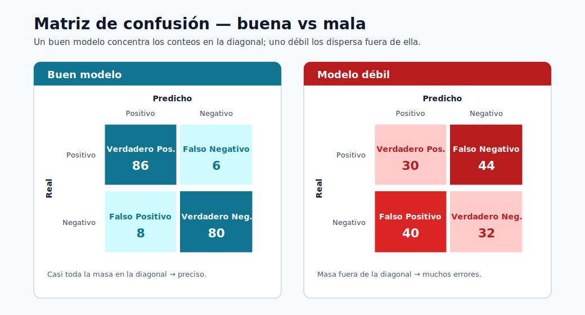
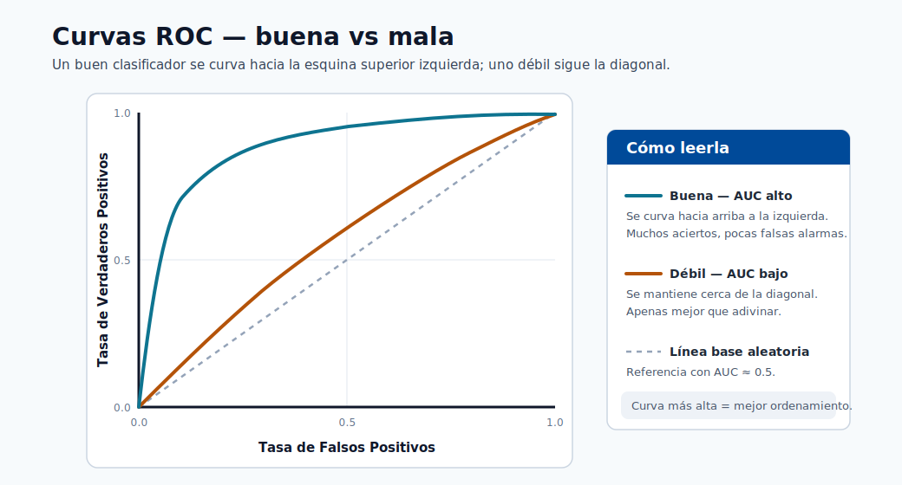
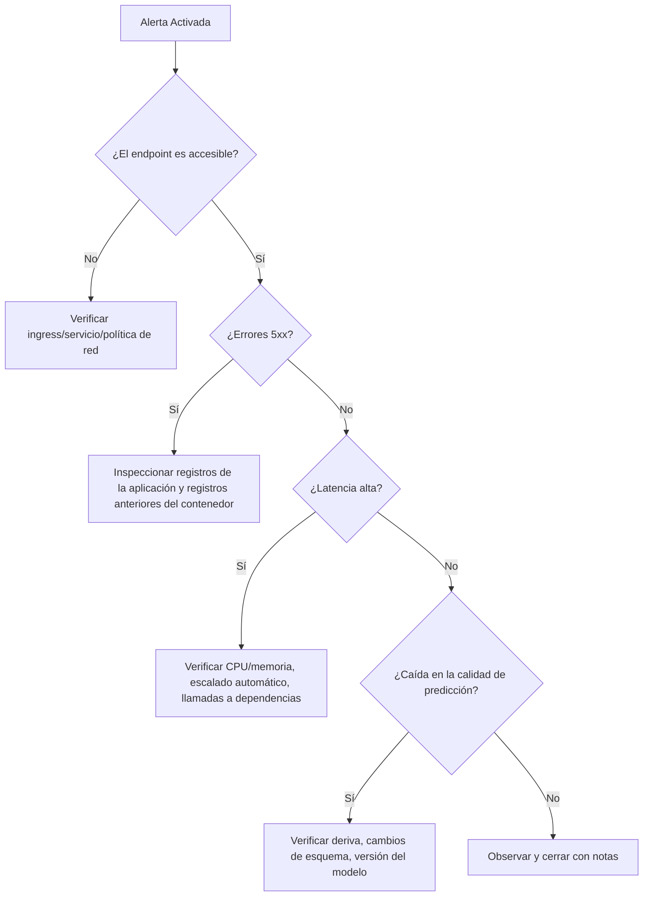

# Depuración de Despliegues con Kubernetes

Este módulo proporciona una ruta práctica de respuesta a incidentes para los endpoints de ML que se ejecutan en
infraestructura respaldada por Kubernetes.



> **Nota - Cómo leerla:** Una matriz de confusión buena vs mala. Un modelo sólido concentra la masa en la diagonal (predicciones correctas); la masa fuera de la diagonal muestra qué tipo de error domina: la primera pista al depurar una regresión de calidad.


> **Nota - Cómo leerla:** Una curva de lift muestra cuánto mejor clasifica el modelo los positivos que la selección aleatoria. Una curva
> que se acerca a la parte superior izquierda captura la mayoría de los positivos en la fracción de mayor puntuación: valiosa para
> colas de revisión priorizadas.



> **Nota - Cómo leerla:** La curva ROC traza la tasa de verdaderos positivos vs la de falsos positivos a través de los umbrales. Una curva que se curva
> hacia la parte superior izquierda (mayor AUC) clasifica mejor; la diagonal es la suposición aleatoria.

## Herramientas clave

- kubectl
- kind
- minikube
- kubeadm

## Flujo de trabajo de depuración

1. Confirmar el estado del despliegue y del pod.
2. Inspeccionar los eventos del pod y las causas de reinicio.
3. Inspeccionar los registros del contenedor (actuales y anteriores).
4. Validar las rutas de service/endpoints e ingress.
5. Validar el payload de entrada del modelo y el esquema.
6. Confirmar la versión del modelo y la alineación del entorno.

## Comandos útiles

```bash
kubectl get pods
kubectl describe pod <pod-name>
kubectl logs <pod-name>
```

Comandos adicionales de alto valor:

```bash
kubectl get events --sort-by=.lastTimestamp
kubectl logs <pod-name> --previous
kubectl get svc
kubectl get endpoints
```

### Secuencia sistemática de clasificación

```bash
# 1. Verificar el estado del pod
kubectl get pods -n <namespace>

# 2. Si algún pod no está en Running, describir para ver los eventos
kubectl describe pod <pod-name> -n <namespace>

# 3. Verificar los registros del contenedor (en ejecución)
kubectl logs <pod-name> -n <namespace> -c <container-name>

# 4. Verificar los registros anteriores del contenedor (si hay CrashLoopBackOff)
kubectl logs <pod-name> -n <namespace> --previous

# 5. Verificar que los endpoints del servicio estén poblados
kubectl get endpoints <service-name> -n <namespace>

# 6. Reenvío de puerto para prueba directa del endpoint
kubectl port-forward svc/<service-name> 8080:80 -n <namespace>
curl -X POST http://localhost:8080/score -d '{"features":[...]}' -H 'Content-Type: application/json'
```

## Patrones de fallos comunes

| Síntoma | Causa probable | Primera comprobación |
|---|---|---|
| CrashLoopBackOff | Dependencia incorrecta/fallo de carga del modelo | `kubectl logs --previous` |
| 5xx desde el endpoint | Excepción en el código de puntuación | registros del contenedor + esquema del payload |
| Errores de tiempo de espera | Presión de recursos o arranque en frío | CPU/memoria, sondas de preparación |
| Predicciones incorrectas después del lanzamiento | Discrepancia de modelo/versión | etiqueta de imagen + versión en el registro del modelo |

## Fundamentos del runbook estilo SRE

- Definir niveles de severidad y contactos de escalada.
- Tener listos los comandos de reversión.
- Capturar la línea de tiempo del incidente y la causa raíz.
- Convertir los aprendizajes del incidente en pruebas/alertas.

## Matriz de severidad de incidentes

| Severidad | Criterio | Objetivo de respuesta típico |
|---|---|---|
| Sev-1 | Interrupción de producción o impacto mayor en el negocio | Respuesta inmediata |
| Sev-2 | Degradación parcial con solución alternativa | <= 1 hora |
| Sev-3 | Defecto no crítico o problema de bajo impacto | Corrección planificada |

## Árbol de decisión para la resolución de problemas



## Qué capturar en el postmortem

1. Tiempo de detección y línea de tiempo de síntomas.
2. Causa raíz y factores contribuyentes.
3. Qué funcionó/falló en la respuesta.
4. Acciones correctivas y propietarios.

### Plantilla de postmortem

| Sección | Contenido |
|---|---|
| Título del incidente | Descripción de una línea |
| Fecha/hora | Detección → mitigación → resolución completa |
| Severidad | Sev-1 / 2 / 3 y alcance del impacto |
| Detección | ¿Cómo se encontró (alerta, informe de usuario, monitoreo)? |
| Causa raíz | Causa raíz técnica (sin culpa) |
| Factores contribuyentes | Brechas de infraestructura, proceso o herramientas |
| Línea de tiempo | Acciones clave minuto a minuto |
| Impacto | Clientes / duración del incumplimiento del SLO / brecha de datos |
| Qué salió bien | Señales positivas en la respuesta |
| Qué salió mal | Fallos de proceso o herramientas |
| Elementos de acción | Correcciones específicas, con propietario y fecha límite |

### Convertir incidentes en mejoras

Cada incidente Sev-1 y Sev-2 debe producir al menos una acción concreta de prevención:

| Patrón de causa raíz | Acción de prevención |
|---|---|
| Discrepancia de versión del modelo | Agregar comprobación de hash de versión al script de despliegue |
| Falta validación del esquema | Agregar comprobación del esquema de entrada al script de puntuación |
| Sin sonda de vivacidad | Agregar sondas de preparación y vivacidad al YAML de despliegue |
| Deriva del modelo obsoleto | Automatizar la comprobación de deriva semanal + alerta |
| Entorno no reproducible | Anclar todas las dependencias + registrar la versión del entorno |

## Autoevaluación rápida

| # | Pregunta | Respuesta |
|---|----------|-----------|
| 1 | ¿Qué comando ayuda a diagnosticar por qué se reinició un pod? | `kubectl describe pod <nombre>` (eventos y último estado) junto con `kubectl logs --previous` para leer la salida del contenedor bloqueado. |
| 2 | ¿Por qué debería verificar los registros `--previous`? | Un contenedor reiniciado puede ser demasiado joven para tener registros; `--previous` muestra la salida de la instancia bloqueada, que contiene el fallo real (p. ej., una excepción de `init()`). |
| 3 | ¿Cuál es una señal de discrepancia de modelo/versión? | Infraestructura correcta y en buen estado pero predicciones incorrectas tras un lanzamiento: la etiqueta de imagen desplegada apunta a una versión del modelo distinta de la prevista. |

## Inmersión profunda: cada concepto explicado

Esta sección explica los primitivos de Kubernetes y los modos de fallo detrás de los comandos para que el
runbook sea comprensible en lugar de memorizado.

### Los objetos de Kubernetes que está depurando en realidad

| Objeto | Qué es | Por qué importa para el servicio de ML |
|---|---|---|
| **Pod** | La unidad desplegable más pequeña; uno o más contenedores que comparten red/almacenamiento | Su contenedor de puntuación se ejecuta aquí; la salud del pod = salud del endpoint |
| **Deployment** | Controlador que mantiene N réplicas de pods | Maneja las actualizaciones continuas y la auto-recuperación |
| **Service** | IP virtual estable/DNS con balanceo de carga entre pods | Los clientes llegan al Service, no a los pods individuales |
| **Endpoints** | La lista de IPs de pod *listas* detrás de un Service | Los endpoints vacíos = el tráfico no tiene adónde ir (un "503" común) |
| **Ingress** | Enrutamiento HTTP desde fuera del clúster hacia los Services | Donde vive el mapeo de URL externa → Service interno |

La secuencia de clasificación en este módulo recorre la cadena *de afuera hacia adentro* (ingress → service →
endpoints → pod → contenedor), porque una solicitud falla en el eslabón que está roto.

### Ciclo de vida del pod y qué significan los estados

Un pod pasa por fases, y la fase que falla apunta a la causa:

- **Pending**: el planificador no puede colocar el pod (cuota insuficiente de CPU/memoria, ningún nodo coincidente).
- **ContainerCreating**: se está descargando la imagen o se está montando un volumen; un estancamiento aquí generalmente
  significa un problema de registro/autenticación o almacenamiento.
- **Running**: los contenedores se iniciaron; la aplicación puede seguir estando en mal estado si las sondas fallan.
- **CrashLoopBackOff**: el contenedor se inicia, se cierra y Kubernetes lo reinicia con un retroceso creciente.
  Para ML, esto casi siempre significa que **`init()` falló**: una dependencia faltante o un modelo
  que no se carga. Por eso `kubectl logs --previous` es esencial: el contenedor actual puede ser
  demasiado joven para tener registros, por lo que se leen los registros del contenedor *bloqueado*.

### Sondas de vivacidad vs sondas de preparación

- Una **sonda de preparación** decide si un pod debe recibir tráfico. Hasta que pase, el pod se
  mantiene fuera de la lista de **Endpoints** del Service: por eso una carga lenta del modelo (arranque en frío prolongado)
  se manifiesta como endpoints vacíos y tiempos de espera en lugar de errores.
- Una **sonda de vivacidad** decide si *reiniciar* un pod bloqueado. Un proceso de puntuación bloqueado sin
  una sonda de vivacidad colgará indefinidamente; con una, Kubernetes lo recicla.

La falta de sondas es una causa raíz recurrente en la tabla de prevención precisamente porque sin ellas
Kubernetes no puede distinguir un pod en calentamiento de uno roto.

### Los fallos comunes mapeados a su mecanismo

| Síntoma | Mecanismo subyacente | Por qué funciona la comprobación listada |
|---|---|---|
| `CrashLoopBackOff` | `init()` generó un error (dependencia incorrecta / carga del modelo) | Los registros `--previous` muestran la excepción del contenedor muerto |
| 5xx desde el endpoint | `run()` generó un error en una solicitud | Los registros del contenedor + el esquema del payload revelan la entrada incorrecta o el error |
| Tiempos de espera | Presión de recursos o arranque en frío | CPU/memoria + estado de la sonda de preparación muestran saturación o inicio lento |
| Predicciones incorrectas después del lanzamiento | La etiqueta de imagen apunta a la versión incorrecta del modelo | Comparar la etiqueta de imagen desplegada con la versión en el registro del modelo |

### Por qué la discrepancia de modelo/versión es un fallo único de ML

En los microservicios ordinarios, "el código es el artefacto". En ML, el **modelo es un artefacto versionado separado**
integrado en (o montado por) la imagen. Un despliegue puede tener éxito, el servicio puede estar en buen estado,
y las predicciones pueden seguir siendo silenciosamente incorrectas porque la imagen referencia el modelo `v2` mientras que el
previsto era `v3`. Por eso la acción de prevención es una **comprobación de hash de versión** en el momento del despliegue,
y por qué el linaje (del módulo de entorno) importa: le permite demostrar qué versión del modelo está sirviendo realmente.

### Del incidente a la prevención: el volante de confiabilidad

La plantilla de postmortem y la tabla "incidente → prevención" codifican un principio de **SRE**: cada
Sev-1/Sev-2 debe producir al menos una salvaguarda duradera (una sonda, una comprobación de esquema, una aserción de versión,
una alerta de deriva automatizada). Con el tiempo, esto convierte las interrupciones dolorosas de una sola vez en
pruebas y alertas permanentes, reduciendo de manera constante la tasa de incidentes repetidos.

## Autoevaluación rápida (inmersión profunda)

| # | Pregunta | Respuesta |
|---|----------|-----------|
| 1 | La secuencia de clasificación se mueve "de afuera hacia adentro" (ingress → service → endpoints → pod → contenedor). ¿Por qué ese orden es más eficiente que empezar por el pod? | Una solicitud falla en el eslabón que esté roto, así que recorrer la cadena desde afuera aísla directamente el eslabón roto en lugar de adivinar primero en la capa más profunda. |
| 2 | Un Service devuelve 503 pero todos los pods muestran `Running`. ¿Qué objeto inspeccionaría a continuación y qué le diría si estuviera vacío? | Inspeccione los `Endpoints` del Service; una lista vacía significa que ningún pod está `Ready` (sonda de preparación fallida o carga lenta del modelo), por lo que el tráfico no tiene adónde ir. |
| 3 | ¿Por qué `CrashLoopBackOff` para un contenedor de ML casi siempre apunta a `init()` en lugar de a `run()`? | `init()` se ejecuta al iniciar el contenedor y carga el modelo y las dependencias; una dependencia faltante o un modelo que no se carga hace que el contenedor se cierre de inmediato y se reinicie en bucle. |
| 4 | Explique la diferencia entre una sonda de preparación y una sonda de vivacidad, y cuál afecta primero una carga lenta del modelo. | La preparación decide si un pod recibe tráfico; la vivacidad decide si reiniciar un pod bloqueado. Una carga lenta del modelo afecta primero a la preparación (el pod queda fuera de Endpoints hasta que pase). |
| 5 | ¿Por qué puede un despliegue estar "en buen estado" y aún así servir predicciones incorrectas, y qué comprobación única en el momento del despliegue lo previene? | El modelo es un artefacto versionado separado, por lo que un servicio sano puede referenciar la versión equivocada; una comprobación de hash de versión en el momento del despliegue lo previene. |

---

## Fundamentos de Kubernetes para ingenieros de ML

Los ingenieros de ML interactúan con Kubernetes principalmente a través de la salida de `kubectl` y los manifiestos YAML.
Esta sección explica los cuatro objetos principales que encontrará al desplegar y depurar endpoints de ML, no solo como definiciones sino como cosas que leerá y diagnosticará en la práctica.

### Pods

Un **Pod** es la unidad desplegable más pequeña en Kubernetes. Envuelve uno o más contenedores que
comparten un espacio de nombres de red y volúmenes de almacenamiento.

Leyendo la salida de `kubectl get pods`:

```
NAME                            READY   STATUS    RESTARTS   AGE
fraud-scorer-7d4b9f-xk2pq       1/1     Running   0          3d
fraud-scorer-7d4b9f-mp9wz       1/1     Running   2          3d
fraud-scorer-7d4b9f-nt8rs       0/1     Pending   0          5m
```

| Columna | Qué significa |
|---|---|
| `READY` | `1/1` = todos los contenedores en el pod están listos. `0/1` = no listo (la sonda de preparación está fallando o aún no ha comenzado) |
| `STATUS` | `Running` = al menos un contenedor se está ejecutando; `Pending` = no programado; `CrashLoopBackOff` = reiniciándose repetidamente |
| `RESTARTS` | Los reinicios no nulos indican fallos de la sonda de vivacidad o bloqueos del contenedor |
| `AGE` | Un pod muy reciente después de un lanzamiento de despliegue es el que más probablemente tenga un problema nuevo |

### Deployments

Un **Deployment** le indica a Kubernetes cuántas réplicas de pods mantener y qué plantilla usar.
Maneja las actualizaciones continuas y la auto-recuperación.

```
NAME            READY   UP-TO-DATE   AVAILABLE   AGE
fraud-scorer    3/3     3            3           10d
```

| Columna | Qué significa para ML |
|---|---|
| `READY` | `3/3` = todas las réplicas deseadas están listas para servir tráfico |
| `UP-TO-DATE` | Número de réplicas con la última plantilla (p. ej., nueva imagen del modelo); menos que lo deseado = lanzamiento en progreso |
| `AVAILABLE` | Réplicas que pasan las sondas de preparación; este es el número que realmente sirve solicitudes |

Inspeccionar el estado del lanzamiento durante una actualización del modelo:

```bash
kubectl rollout status deployment/fraud-scorer -n ml-serving
# Esperando a que termine el lanzamiento del despliegue "fraud-scorer": 1 de 3 nuevas réplicas se han actualizado...
```

### Services

Un **Service** proporciona una IP virtual estable y un nombre DNS que balancea la carga entre las réplicas de pods.
Los clientes envían tráfico al Service, nunca a los pods individuales.

```
NAME             TYPE        CLUSTER-IP     EXTERNAL-IP   PORT(S)   AGE
fraud-scorer     ClusterIP   10.96.44.120   <none>        80/TCP    10d
fraud-scorer-lb  LoadBalancer 10.96.44.121  20.42.0.10   443/TCP   10d
```

`ClusterIP` es solo interno; `LoadBalancer` tiene una IP externa para acceso fuera del clúster.

### Ingress

Un **Ingress** mapea los nombres de host y rutas HTTP(S) externos a los Services dentro del clúster. Es
donde viven la terminación TLS y el enrutamiento basado en host:

```yaml
apiVersion: networking.k8s.io/v1
kind: Ingress
metadata:
  name: ml-ingress
  annotations:
    nginx.ingress.kubernetes.io/proxy-read-timeout: "30"
spec:
  rules:
    - host: fraud-api.company.com
      http:
        paths:
          - path: /score
            pathType: Prefix
            backend:
              service:
                name: fraud-scorer
                port:
                  number: 80
```

Un campo `ADDRESS` vacío significa que el controlador de ingress no asignó una IP: el endpoint es
inaccesible desde fuera del clúster.

### Solicitudes y límites de recursos

Las solicitudes y límites de recursos se definen por contenedor en la especificación del pod. Tienen una importancia desproporcionada para las cargas de trabajo de ML donde los modelos pueden ser de cientos de MB a GB.

```yaml
resources:
  requests:
    memory: "2Gi"
    cpu: "500m"
  limits:
    memory: "4Gi"
    cpu: "2"
```

| Campo | Significado | Efecto si se configura incorrectamente |
|---|---|---|
| `requests.memory` | Memoria mínima que el planificador reserva | Demasiado bajo: pod programado en un nodo con memoria real insuficiente → OOMKill en tiempo de ejecución |
| `limits.memory` | Techo máximo | Demasiado bajo: el modelo no cabe → OOMKilled al cargar |
| `requests.cpu` | Peso de programación | Demasiado bajo: el pod puede ser privado de recursos bajo carga |
| `limits.cpu` | Techo de aceleración de CPU | La aceleración de CPU añade latencia incluso cuando los nodos tienen capacidad libre |

> **Nota - Límites de CPU y ML:** Establecer los límites de CPU de forma demasiado agresiva hace que el planificador CFS de Linux
> acelere el contenedor durante la inferencia, añadiendo latencia de cola impredecible. Una práctica común en producción
> es establecer las solicitudes de CPU pero dejar los límites de CPU sin establecer (o muy generosos), y depender del
> aprovisionamiento automático de nodos para prevenir la privación.

### Namespaces

Los namespaces dividen los recursos del clúster y los controles de acceso. En las plataformas de ML, las convenciones de namespace comunes son:

| Namespace | Propósito |
|---|---|
| `ml-serving-prod` | Endpoints de inferencia de producción |
| `ml-serving-staging` | Endpoints de staging/canary |
| `ml-training` | Pods de trabajo de entrenamiento |
| `monitoring` | Prometheus, Grafana, administrador de alertas |

Siempre especifique `-n <namespace>` en los comandos `kubectl` o establezca su namespace predeterminado:

```bash
kubectl config set-context --current --namespace=ml-serving-prod
```

---

## Modos de fallo comunes de Kubernetes en ML, explicados

Cada modo de fallo tiene un síntoma característico, una causa raíz y una secuencia de comando de diagnóstico definitiva.

### OOMKilled: límite de memoria excedido

**Síntoma:** El estado del pod muestra `OOMKilled` o el conteo de reinicios se incrementa sin error de aplicación en los registros.

**Causa raíz:** El contenedor superó el valor de `limits.memory`. Para ML, esto casi siempre
significa que el artefacto del modelo es más grande de lo anticipado, o el contenedor de puntuación acumula memoria
durante solicitudes por lotes.

```bash
# Confirmar OOM
kubectl describe pod <pod-name> -n ml-serving-prod | grep -A5 "Last State"
# Salida:
# Last State: Terminated
#   Reason: OOMKilled
#   Exit Code: 137
```

**Corrección:**

```yaml
# Aumentar el límite de memoria en el YAML de despliegue
resources:
  requests:
    memory: "4Gi"
  limits:
    memory: "8Gi"
```

Para encontrar la huella de memoria del modelo antes del despliegue:

```python
import tracemalloc
tracemalloc.start()
model = joblib.load("model.pkl")
current, peak = tracemalloc.get_traced_memory()
print(f"Memoria máxima del modelo: {peak / 1024**2:.1f} MB")
```

### ImagePullBackOff: fallo de autenticación en el registro

**Síntoma:** Estado del pod `ImagePullBackOff` o `ErrImagePull`, el contenedor nunca se inicia.

**Causa raíz:** El nodo no puede descargar la imagen del contenedor de puntuación, generalmente debido a un imagePullSecret faltante o caducado, una etiqueta de imagen incorrecta o un registro privado no listado en la especificación del pod.

```bash
# Diagnosticar
kubectl describe pod <pod-name> -n ml-serving-prod
# Buscar: "Failed to pull image ... unauthorized: ..."

# Corrección: crear o renovar el secreto del registro
kubectl create secret docker-registry acr-secret \
  --docker-server=mlregistry.azurecr.io \
  --docker-username=$ACR_USERNAME \
  --docker-password=$ACR_PASSWORD \
  -n ml-serving-prod
```

> **Consejo - Use identidad administrada:** Adjunte la identidad administrada del grupo de nodos de AKS al Azure
> Container Registry con el rol `AcrPull`. Esto elimina las credenciales estáticas por completo y
> previene que `ImagePullBackOff` ocurra por la expiración de credenciales.

### Init:Error: fallo del contenedor de inicio

**Síntoma:** Estado del pod `Init:Error` o `Init:CrashLoopBackOff`. El contenedor principal nunca se inicia.

**Causa raíz:** Un contenedor de inicio, típicamente usado para descargar un artefacto del modelo desde el almacenamiento de blobs o ejecutar una migración, salió con un código distinto de cero.

```bash
kubectl describe pod <pod-name> -n ml-serving-prod
# Buscar el código de salida del contenedor de inicio "model-downloader"

kubectl logs <pod-name> -c model-downloader -n ml-serving-prod
# Muestra el error real: 403 Forbidden, o archivo de modelo no encontrado
```

Causas comunes y correcciones:

| Error | Causa | Corrección |
|---|---|---|
| `403 Forbidden` en el almacenamiento de blobs | Identidad administrada sin rol Storage Blob Data Reader asignado | Asignar el rol RBAC a la identidad del pod |
| `model.pkl not found` | Ruta de blob incorrecta o versión del modelo no registrada | Verificar la versión del modelo en el registro; corregir los argumentos del contenedor de inicio |
| Error de importación de Python | Paquete faltante en la imagen del contenedor de inicio | Reconstruir la imagen del contenedor de inicio con los paquetes requeridos |

### Pending: cuota o discrepancia de selector de nodo

**Síntoma:** El pod permanece indefinidamente en estado `Pending`.

```bash
kubectl describe pod <pod-name> -n ml-serving-prod
# Buscar: "0/5 nodes are available: 5 Insufficient memory" o
#         "0/5 nodes are available: node(s) didn't match node selector"
```

**Causas raíz:**

- **Cuota de recursos excedida:** El namespace tiene una `ResourceQuota` que limita la memoria/CPU total.
  Comprobación: `kubectl describe resourcequota -n ml-serving-prod`
- **Discrepancia de selector de nodo:** El despliegue solicita un nodo con la etiqueta `gpu=true` pero no existe tal
  nodo en el grupo. Comprobación: `kubectl get nodes --show-labels`
- **Taints sin tolerancias:** Los nodos GPU tienen taints; la especificación del pod falta la tolerancia.

```yaml
# Agregar tolerancia para el taint del nodo GPU
tolerations:
  - key: "nvidia.com/gpu"
    operator: "Exists"
    effect: "NoSchedule"
nodeSelector:
  accelerator: nvidia-a100
```

### Referencia completa de comandos de diagnóstico

```bash
# 1. Pod no Running — obtener la razón
kubectl describe pod <pod-name> -n <ns> | grep -E "Status|Reason|Message|Events" -A 3

# 2. Confirmación de OOMKilled
kubectl get pod <pod-name> -n <ns> -o jsonpath='{.status.containerStatuses[0].lastState.terminated}'

# 3. ImagePullBackOff — ver error del registro
kubectl describe pod <pod-name> -n <ns> | grep "Failed\|Error\|Back-off"

# 4. Pending — encontrar el bloqueador de programación
kubectl describe pod <pod-name> -n <ns> | grep -A 10 "Events:"

# 5. Running pero en mal estado — verificar preparación
kubectl get pod <pod-name> -n <ns> -o jsonpath='{.status.conditions}'
```

---

## Pila de observabilidad

Un endpoint de ML en producción requiere más que los registros del pod. Una pila de observabilidad completa proporciona
métricas, registros y trazas: los tres pilares: para que pueda responder "qué sucedió, cuándo y por qué"
sin acceso SSH a los nodos.

### Métricas de Prometheus

Prometheus recopila métricas de los endpoints instrumentados. Para los contenedores de puntuación de ML, exponga
métricas personalizadas usando la biblioteca `prometheus_client`:

```python
from prometheus_client import Counter, Histogram, start_http_server
import time

PREDICTION_COUNTER = Counter("ml_predictions_total", "Total de predicciones", ["segment", "class"])
INFERENCE_LATENCY = Histogram(
    "ml_inference_duration_seconds",
    "Latencia de inferencia",
    buckets=[0.01, 0.025, 0.05, 0.1, 0.25, 0.5, 1.0]
)

def init():
    start_http_server(8001)  # Prometheus recopila de :8001/metrics
    global model
    model = load_model()

def run(raw_data: str) -> str:
    start = time.time()
    data = json.loads(raw_data)
    prediction = model.predict(np.array(data["features"]))

    duration = time.time() - start
    INFERENCE_LATENCY.observe(duration)
    for label in prediction:
        PREDICTION_COUNTER.labels(segment="default", class=str(label)).inc()

    return json.dumps({"prediction": prediction.tolist()})
```

### Paneles de Grafana

Un panel de Grafana de ML de producción debe incluir estos paneles:

| Panel | Métrica | Umbral de alerta |
|---|---|---|
| Tasa de solicitudes | `rate(ml_predictions_total[5m])` | < 10% de la línea de base → problema ascendente |
| Latencia p50/p95/p99 | `histogram_quantile(0.95, ml_inference_duration_seconds_bucket)` | p95 > 250 ms |
| Tasa de error | `rate(http_requests_total{status=~"5.."}[5m]) / rate(http_requests_total[5m])` | > 2% |
| Reinicios de pods | `kube_pod_container_status_restarts_total` | > 0 en los últimos 30 min |
| Utilización de memoria | `container_memory_working_set_bytes / container_spec_memory_limit_bytes` | > 85% |
| Distribución de clases de predicción | `ml_predictions_total by (class)` | Cualquier clase cae a 0 |

> **Nota - Alerta de distribución de clases:** Monitorear la distribución de las clases predichas es
> un proxy ligero para la calidad del modelo. Si un modelo de fraude repentinamente predice 0 transacciones fraudulentas,
> el modelo probablemente ha dejado de funcionar: esta alerta lo detecta antes de que una revisión del KPI del negocio lo haría.

### Integración con Azure Monitor

```bash
# Habilitar Container Insights en el clúster AKS
az aks enable-addons \
  --resource-group ml-rg \
  --name ml-aks-cluster \
  --addons monitoring \
  --workspace-resource-id /subscriptions/<sub>/resourceGroups/ml-rg/providers/Microsoft.OperationalInsights/workspaces/ml-logs
```

Azure Monitor Container Insights proporciona:

- **Transmisión de registros en vivo** desde los pods sin `kubectl exec`.
- **Métricas de CPU/memoria** del contenedor con retención histórica.
- **Estado del nodo** y métricas a nivel de grupo.
- **Consultas KQL** sobre los registros de pods para análisis de registros estructurados:

```kql
ContainerLogV2
| where ContainerName == "fraud-scorer"
| where LogMessage contains "ERROR"
| summarize count() by bin(TimeGenerated, 5m)
| render timechart
```

---

## Ingeniería del caos para endpoints de ML

La ingeniería del caos es la práctica de inyectar deliberadamente fallos para verificar que el sistema los maneja correctamente. Para los endpoints de ML, esto es más importante que para los microservicios típicos porque la inferencia del modelo añade modos de fallo únicos que solo aparecen bajo condiciones realistas.

### Presupuesto de Disrupción de Pods

Un **Presupuesto de Disrupción de Pods (PDB)** establece un mínimo en el número de réplicas que deben permanecer
disponibles durante las disrupciones voluntarias (drenaje de nodos, actualizaciones continuas):

```yaml
apiVersion: policy/v1
kind: PodDisruptionBudget
metadata:
  name: fraud-scorer-pdb
  namespace: ml-serving-prod
spec:
  minAvailable: 2
  selector:
    matchLabels:
      app: fraud-scorer
```

Con este PDB, una operación `kubectl drain` en un nodo no procederá si dejaría menos
de 2 réplicas disponibles. Esto previene que una ventana de mantenimiento de nodos accidentalmente haga
el endpoint indisponible.

### Simular la eliminación de un pod

```bash
# Eliminar una réplica y verificar que el servicio sigue disponible
kubectl delete pod fraud-scorer-7d4b9f-xk2pq -n ml-serving-prod

# Simultáneamente ejecutar carga contra el endpoint
ab -n 1000 -c 10 -H "Authorization: Bearer $ENDPOINT_KEY" \
   -p payload.json -T application/json \
   https://fraud-api.company.com/score

# Verificar: la tasa de error debe ser < 1% durante la ventana de reemplazo del pod
```

Comportamiento esperado: Kubernetes detecta inmediatamente el pod faltante a través del controlador del Deployment,
programa un reemplazo, y el tráfico se enruta a las réplicas saludables restantes. El PDB
garantiza que al menos 2 réplicas estén siempre disponibles.

### Qué valida la ingeniería del caos para ML

| Escenario de caos | Qué valida |
|---|---|
| Eliminación de pod | El PDB previene la interrupción total; el Deployment se auto-recupera |
| Drenaje del nodo | La actualización continua no descarta solicitudes |
| Rampa de alta carga | El escalador automático reacciona antes del incumplimiento del SLO p95 |
| Inyección de latencia en el feature store | El disyuntor se activa; la ruta de respaldo funciona |
| Artefacto del modelo no disponible en init | El error se registra y el pod entra en CrashLoopBackOff (no predicciones incorrectas silenciosas) |
| Payload de lote grande (1000 filas) | OOM no ocurre; la validación del tamaño del lote se activa |

> **Consejo - Ejecutar pruebas de caos en staging:** Siempre ejecute las pruebas de caos contra el endpoint de staging
> antes de validar en producción.
