# Análisis matemático en profundidad: modelos de ML fundamentales

Esta página es un análisis matemático ampliado de las familias de modelos utilizadas a lo largo
de este centro de capacitación. Está diseñada como una referencia práctica para ingenieros que
quieren tanto comprensión a nivel de fórmula como intuición de producción. Cada sección sigue el
mismo ritmo: **qué supone el modelo**, **el objetivo que optimiza**, **cómo se
entrena**, **los tipos/variantes en que se presenta**, **cómo ajustarlo** y **cómo falla**.

## Cómo usar esta página

1. Comienza con la función objetivo y los supuestos.
2. Revisa el comportamiento de optimización y los controles de regularización.
3. Verifica los modos de falla antes del despliegue.
4. Conecta con la elección de métricas en el módulo de rendimiento.

## Qué cubre esta página (panorama general)

La siguiente tabla es un mapa de todo lo que se explica más adelante. Léela de arriba hacia abajo
como un orden aproximado de capacidad creciente (y riesgo creciente de sobreajuste): los modelos
lineales son los más simples e interpretables, las redes neuronales las más flexibles y las que
más datos demandan. "Dónde destaca" es la mejor razón individual para recurrir a cada familia.

| #  | Familia de modelos | Tipo de aprendizaje | Salida | Dónde destaca | Debilidad principal | Hiperparámetros clave |
|----|--------------|---------------|--------|-----------------|---------------|---------------------|
| 1  | Regresión lineal | Supervisado (regresión) | Valor continuo | Líneas base tabulares interpretables, estimación de tendencias | Pasa por alto la no linealidad, sensible a valores atípicos | regularización $\lambda$, tipo de penalización |
| 2  | Regresión logística | Supervisado (clasificación) | Probabilidad de clase | Probabilidades calibradas, scoring de riesgo interpretable | Solo frontera de decisión lineal | $\lambda$, pesos de clase, umbral $\tau$ |
| 3  | Naive Bayes | Supervisado (clasificación) | Probabilidad de clase | Texto/spam, datos dispersos de muy alta dimensión | Supuesto de independencia, calibración débil | suavizado $\alpha$, elección de distribución |
| 4  | Máquina de vectores de soporte | Supervisado (clas./regr.) | Clase o valor | Márgenes claros, fronteras complejas de tamaño medio | Escala mal a $N$ grande, requiere escalado | $C$, kernel, $\gamma$ |
| 5  | Árbol de decisión | Supervisado (clas./regr.) | Clase o valor | Reglas legibles por humanos, tipos de datos mixtos | Sobreajusta, inestable ante pequeños cambios en los datos | profundidad máxima, muestras mínimas, criterio |
| 6  | Random Forest | Ensamble supervisado (bagging) | Clase o valor | Línea base tabular robusta con poco ajuste | Mayor memoria/latencia, menos interpretable | n_estimators, max_features, profundidad |
| 7  | Gradient Boosting | Ensamble supervisado (boosting) | Clase o valor | Precisión tabular de primer nivel | Sensibilidad al ajuste, riesgo de sobreajuste | learning_rate, n_estimators, profundidad/hojas |
| 8  | Red neuronal (MLP) | Supervisado (clas./regr.) | Clase o valor | Datos no estructurados, interacciones complejas | Demanda de datos, más difícil de interpretar/operar | capas, ancho, tasa de aprendizaje, dropout |
| 9  | Modelos de series temporales | Supervisado (pronóstico) | Valores futuros | Datos temporales/estacionales, demanda y capacidad | Requiere cuidado cronológico, propenso a deriva | orden $(p,d,q)$, estacionalidad, horizonte |

Las familias 1-3 son **paramétricas y convexas** (un único óptimo global, rápidas de entrenar).
Las familias 4-9 cambian esa garantía por **flexibilidad**: los árboles y ensambles capturan
interacciones no lineales, y las redes neuronales aproximan casi cualquier función con suficientes
datos. Luego las secciones 10 y 11 las comparan lado a lado y ofrecen un flujo de selección en
Azure ML.

> **Consejo - Lectura de las matemáticas:** A lo largo del texto, $X$ es la matriz de características ($N$ filas, $d$ columnas),
> $y$ el objetivo, $\theta$ o $w$ las ponderaciones aprendidas, y $\mathcal{L}$ una pérdida. "Convexo" significa
> que el descenso de gradiente no puede quedar atrapado en un mal óptimo local; "no convexo" (árboles, redes profundas) significa
> que el entrenamiento es una búsqueda heurística y los resultados dependen de la inicialización y el orden de los datos.

## Qué significan realmente los componentes matemáticos (en acción y en valor)

Cada modelo de abajo está construido a partir del mismo puñado de ideas matemáticas. Las fórmulas
se ven diferentes, pero hacen los mismos trabajos. Esta sección decodifica cada componente
recurrente: qué **es**, qué **hace en acción** durante el entrenamiento o la predicción, y qué **valor**
entrega a un proyecto real. Lee esto una vez y el resto de la página se vuelve reconocimiento de patrones.

### La función del modelo $f_\theta(x)$ : aquello que hace las predicciones

- **Qué es:** una fórmula con números ajustables (parámetros $\theta$) que asigna a una entrada
  $x$ una salida $\hat{y}$. Para la regresión lineal es una suma ponderada; para una red neuronal
  son capas de sumas ponderadas y no linealidades.
- **En acción:** en el **momento de la predicción**, esto es literalmente la aritmética que tu endpoint ejecuta en
  cada solicitud: introduces las características y obtienes un número. Las ponderaciones $\theta$ quedan congeladas tras el
  entrenamiento, así que servir es solo matemática rápida y determinista.
- **Su valor:** los parámetros son donde se almacena el "aprendizaje". Un archivo de modelo de 50 MB es solo una
  gran lista de estos números. Los parámetros interpretables (un coeficiente de regresión) sirven a la vez como
  insight de negocio: "cada año adicional de antigüedad reduce el riesgo de abandono en X".

### La función objetivo / de pérdida $\mathcal{L}$ : la definición de "incorrecto"

- **Qué es:** un único número que mide qué tan mal se ajusta el modelo actual a los datos.
  Error cuadrático para regresión, entropía cruzada para clasificación, hinge loss para SVM.
- **En acción:** el entrenamiento no es más que **buscar parámetros que hagan pequeño este
  número**. La pérdida es el marcador contra el cual juega el optimizador; cambia la pérdida y cambias
  lo que el modelo considera una buena respuesta.
- **Su valor:** esta es tu palanca principal para **codificar prioridades de negocio en matemática**. ¿Te importa
  más el fraude poco frecuente que el tráfico legítimo común? Pondera la pérdida. ¿Los errores grandes son mucho peores que los
  pequeños? Usa error cuadrático. La pérdida es donde la estrategia se convierte en un número que una computadora puede perseguir.

### La optimización y el gradiente $\nabla_\theta \mathcal{L}$ : cómo aprende el modelo

- **Qué es:** el gradiente es la pendiente de la pérdida con respecto a cada parámetro : un vector
  que apunta en la dirección que **aumenta** el error más rápido. El descenso de gradiente da un paso en sentido
  opuesto: $\theta_{t+1} = \theta_t - \eta\,\nabla_\theta\mathcal{L}$.
- **En acción:** el entrenamiento repite "medir error, calcular gradiente, empujar ponderaciones cuesta abajo"
  miles de veces. La tasa de aprendizaje $\eta$ es el tamaño del paso: demasiado grande y el entrenamiento diverge,
  demasiado pequeño y avanza a paso de tortuga. Este bucle es lo que consume tus horas de GPU.
- **Su valor:** los gradientes son la razón por la que los modelos pueden tener **millones de parámetros** y aun así entrenarse :
  nunca buscas a ciegas, siempre sabes hacia dónde queda cuesta abajo. Comprender esto explica
  la mayoría de las fallas de entrenamiento (pérdida que explota, pérdida estancada, pérdida que oscila).

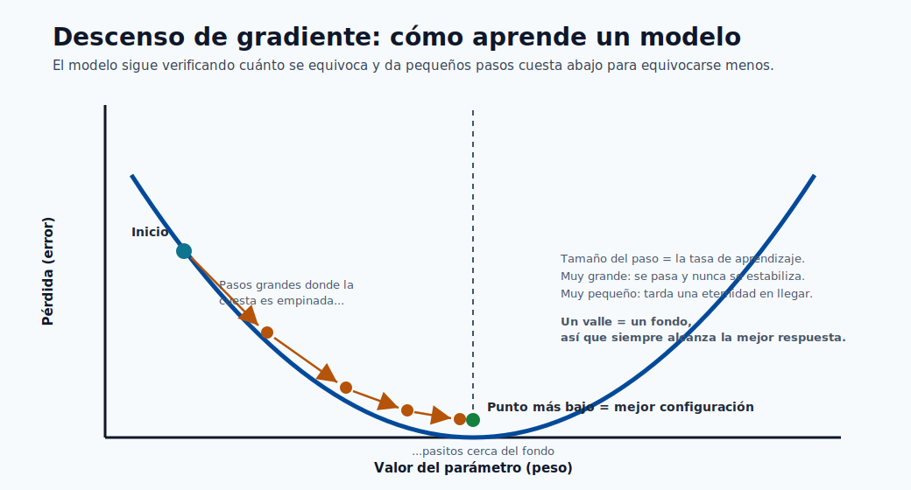

La imagen de arriba es la idea completa en una sola figura: la curva es la pérdida, los puntos son pasos sucesivos
de entrenamiento, y el gradiente es simplemente la pendiente bajo cada punto. Los pasos son grandes donde la
pendiente es pronunciada y se reducen a nada en el fondo, que es el modelo llegando a sus mejores
ponderaciones.

### Convexidad : la garantía de que el entrenamiento "simplemente funciona"

- **Qué es:** una pérdida convexa tiene forma de cuenco : tiene exactamente un fondo. Las pérdidas no convexas
  (árboles, redes profundas) son una cadena montañosa con muchos valles.
- **En acción:** para los modelos convexos (lineal, logístico, SVM) el optimizador **siempre llega a la
  única mejor respuesta**, sin importar dónde comience. Para los modelos no convexos, distintas semillas aleatorias
  dan distintos resultados, así que fijas semillas, ejecutas múltiples veces y validas con cuidado.
- **Su valor:** la convexidad compra **reproducibilidad y confianza** con casi ningún ajuste : una enorme
  razón por la que los modelos simples siguen siendo la decisión correcta para muchos sistemas de producción y auditorías.

### Regularización ($\lambda\|\theta\|$) : el freno que evita memorizar

- **Qué es:** una penalización extra añadida a la pérdida que crece cuando las ponderaciones se hacen grandes, de modo que el
  modelo es recompensado por mantenerse simple. $L_2$ encoge las ponderaciones de forma suave; $L_1$ pone algunas a cero.
- **En acción:** durante el entrenamiento frena los parámetros que solo ajustan ruido, sacrificando un poco
  de precisión de entrenamiento por mejor rendimiento en datos **no vistos**. La fuerza $\lambda$ es el
  único control que mueve al modelo a lo largo del espectro del subajuste al sobreajuste.
- **Su valor:** este es el **regulador de generalización**. Es la diferencia entre un modelo que
  obtiene 99% en la demo y falla en producción, y uno que obtiene 92% en todas partes. Ajustar
  $\lambda$ suele ser lo de mayor retorno que haces.

### Probabilidad, verosimilitud y $\arg\max$ : convertir puntajes en decisiones

- **Qué es:** muchos modelos producen una probabilidad $P(y\mid x)$ (sigmoide/softmax) y eligen la
  clase con la más alta mediante $\arg\max$. El entrenamiento a menudo **maximiza la verosimilitud** : encontrar
  parámetros que hagan más probables los datos observados.
- **En acción:** en el momento de la predicción el modelo emite una confianza (p. ej. 0.83), y un umbral
  $\tau$ o $\arg\max$ la convierte en una acción (aprobar/denegar). Ese umbral es una decisión de negocio
  aplicada *después* de la matemática.
- **Su valor:** las probabilidades te permiten **clasificar, priorizar y fijar cortes conscientes del costo** en lugar
  de obtener un mero sí/no. Las probabilidades calibradas son lo que hace posibles los sistemas de fijación de precios, triaje y
  scoring de riesgo.

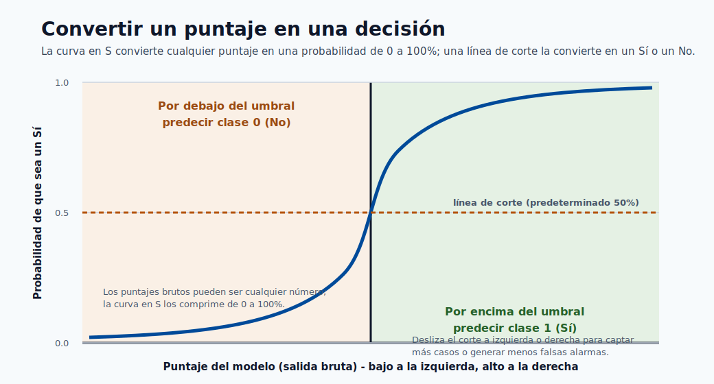

Esto es lo que parece "un puntaje se convierte en una decisión": la curva en S comprime cualquier puntaje crudo en una
probabilidad, y la línea de umbral punteada es la regla de negocio que convierte esa probabilidad en un
Sí o No concreto. Deslizar el umbral a la izquierda o a la derecha es como sacrificas capturar más casos
a cambio de generar menos falsas alarmas.

### Álgebra lineal ($X\theta$, $X^TX$, kernels) : por qué todo esto es rápido

- **Qué es:** apilar los datos en matrices y expresar las predicciones como productos de matrices.
  $X\theta$ calcula la predicción de cada fila de una vez; los kernels calculan similitudes en bloque.
- **En acción:** las operaciones matriciales vectorizadas corren sobre hardware BLAS/GPU optimizado, así que puntuar un
  millón de filas es una multiplicación de matrices, no un millón de bucles.
- **Su valor:** esta es la **razón de ingeniería** por la que el ML es práctico a escala. También explica
  el costo y la latencia: el tamaño del modelo y el número de características se traducen directamente en FLOPs por solicitud.

> **Nota - El resumen en una frase:** Un modelo es una **función** ($f_\theta$) cuyos **parámetros**
> son elegidos por un **optimizador** (descenso de gradiente) para minimizar una **pérdida** (tu definición de
> incorrecto), mantenida honesta por la **regularización** (para que generalice), y convertida en **decisiones** mediante
> **probabilidades y umbrales**. Cada sección de abajo es una elección específica de esas cinco piezas.

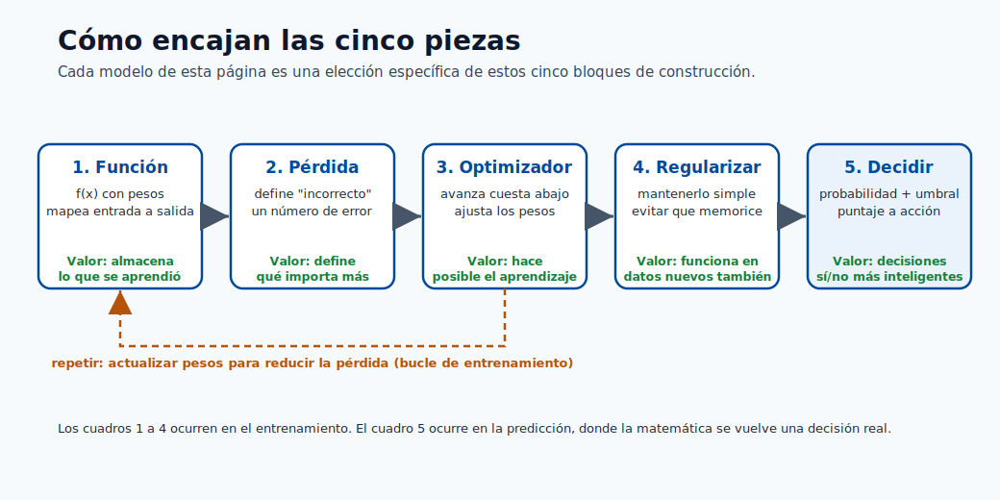

Usa este diagrama como una lista de verificación mental: cuando encuentres cualquier modelo de abajo, pregunta qué función
usa, qué pérdida minimiza, cómo optimiza, cómo regulariza y cómo toma la decisión
final. Esas cinco respuestas lo describen por completo.

---

## 1) Regresión lineal

La regresión lineal es el modelo de regresión fundamental y el ancla mental para casi
todo lo demás: predice un objetivo continuo como una **suma ponderada de características**. Es
el modelo al que recurres primero porque es rápido, interpretable y da una línea base que
los modelos más complejos deben superar para justificar su costo.

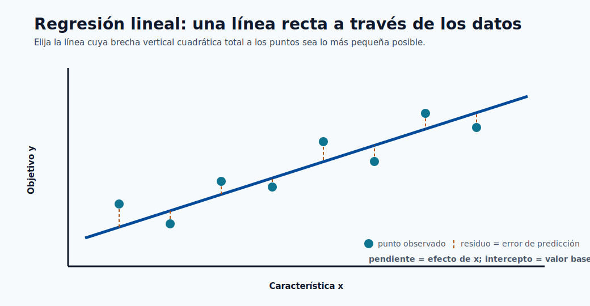

La recta es el modelo y los segmentos punteados son los residuos : mínimos cuadrados simplemente elige la
recta cuyos residuos al cuadrado suman el total más pequeño. La pendiente es el efecto de cada característica y
la intersección es el valor base cuando cada característica es cero.

Forma del modelo:

$$
\hat{y} = X\theta + b
$$

Cada coeficiente $\theta_j$ es el cambio esperado en $\hat{y}$ ante un aumento de una unidad en
la característica $j$, **manteniendo fijas todas las demás características** : esto es exactamente por lo que el modelo es tan
interpretable, y también por lo que las características correlacionadas hacen difícil confiar en los coeficientes individuales.

Objetivo de mínimos cuadrados:

$$
\min_{\theta,b}\;\frac{1}{N}\|y-(X\theta+b)\|_2^2
$$

Elevamos al cuadrado los residuos por dos razones: penaliza desproporcionadamente los errores grandes, y
produce un objetivo suave y convexo con un mínimo único. Minimizar el error cuadrático también es
equivalente a la **estimación por máxima verosimilitud bajo ruido gaussiano**, que es la justificación formal
del método.

Forma cerrada (ecuación normal, forma centrada):

$$
\hat{\theta}=(X^TX)^{-1}X^Ty
$$

Esta solución exacta existe solo porque el problema es convexo y cuadrático. En la práctica
rara vez invertimos $X^TX$ directamente (es $O(d^3)$ y numéricamente inestable cuando las características están
correlacionadas); las bibliotecas usan descomposición QR o, para datos grandes, descenso de gradiente iterativo.

Supuestos y notas:

- **Linealidad**: el objetivo es una función lineal de las características (todavía puedes modelar curvas
  añadiendo características polinómicas o de interacción).
- **Errores independientes y homocedásticos**: los residuos tienen varianza constante y no están correlacionados.
- **Baja multicolinealidad**: las características altamente correlacionadas inflan la varianza de los coeficientes y hacen
  que $X^TX$ sea casi singular.
- **Sensibilidad a valores atípicos**: como los errores se elevan al cuadrado, unos pocos puntos extremos pueden dominar el ajuste.
- Sigue siendo una **gran línea base** para la regresión tabular y una herramienta de diagnóstico incluso cuando se despliega un
  modelo más sofisticado.

Variantes regularizadas (los "tipos" de regresión lineal):

- **Ridge (L2)**: añade $\lambda\|\theta\|_2^2$. Encoge los coeficientes suavemente hacia cero,
  estabiliza las características correlacionadas y nunca pone las ponderaciones exactamente a cero. Mejor cuando muchas
  características contribuyen cada una un poco.
- **Lasso (L1)**: añade $\lambda\|\theta\|_1$. Lleva algunos coeficientes exactamente a cero, así que
  realiza **selección automática de características**. Mejor cuando esperas que solo unas pocas características importen.
- **Elastic Net**: combina L1 y L2, $\lambda_1\|\theta\|_1 + \lambda_2\|\theta\|_2^2$. Obtiene
  la dispersión de Lasso mientras maneja con elegancia los grupos de características correlacionadas.
- **Regresión polinómica / de expansión de base**: sigue siendo "lineal en los parámetros" pero ajusta
  curvas transformando las entradas ($x, x^2, x^3, \dots$).

> **Nota - Conexión con Azure ML:** Los modelos lineales se entrenan en segundos, así que son
> líneas base ideales de prueba de humo en una ejecución de AutoML. Si un modelo de boosting fuertemente ajustado apenas supera la regresión
> ridge, el costo y la complejidad adicionales de servir pueden no valer la pena.

---

## 2) Regresión logística

A pesar del nombre, la regresión logística es un modelo de **clasificación**. Toma el mismo puntaje
lineal que la regresión lineal y lo comprime a través de la función sigmoide para producir una
probabilidad entre 0 y 1. Es el primer modelo por defecto para la clasificación binaria porque
sus salidas son calibradas, interpretables y baratas de calcular.

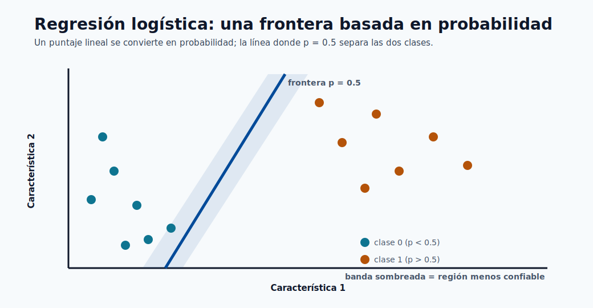

La frontera es la línea donde la probabilidad predicha es igual a 0.5; los puntos se clasifican con más confianza
cuanto más lejos se sitúan de ella. La banda sombreada es la zona de incertidumbre donde pequeños cambios en las características
voltean la predicción, que es exactamente donde el ajuste del umbral importa más.

Probabilidad binaria:

$$
P(y=1\mid x)=\sigma(\theta^Tx+b)=\frac{1}{1+e^{-(\theta^Tx+b)}}
$$

La parte lineal $\theta^Tx+b$ se denomina el **logit** o log-odds. Reordenando da
$\log\frac{p}{1-p}=\theta^Tx+b$, así que cada coeficiente $\theta_j$ es el cambio en **log-odds**
por unidad de la característica $j$; exponenciando, $e^{\theta_j}$ es un **odds ratio**, que es como
se reportan estos modelos en contextos de riesgo y medicina.

Pérdida de entropía cruzada binaria:

$$
\min_{\theta,b}\;-\frac{1}{N}\sum_{i=1}^{N}\left[y_i\log\hat{p}_i+(1-y_i)\log(1-\hat{p}_i)\right]
$$

Esta es la log-verosimilitud negativa de los datos bajo un modelo de Bernoulli. Es convexa, así que
hay un único óptimo global, pero a diferencia de la regresión lineal **no hay forma cerrada** :
se resuelve iterativamente con descenso de gradiente, el método de Newton o L-BFGS.

Regla de decisión:

$$
\hat{y}=\mathbb{1}[\hat{p}>\tau]
$$

El umbral $\tau$ es una **decisión de negocio, no un parámetro del modelo**. El valor por defecto $0.5$ es
rara vez óptimo bajo desequilibrio de clases o costos de error asimétricos; se ajusta después usando
el equilibrio precisión/exhaustividad del módulo de métricas de rendimiento.

Tipos y extensiones:

- **Regresión logística binaria**: el caso base de dos clases anterior.
- **Regresión multinomial (softmax)**: generaliza a $K$ clases con
  $P(y=k\mid x)=\frac{e^{\theta_k^Tx}}{\sum_j e^{\theta_j^Tx}}$.
- **Regresión logística ordinal**: para categorías ordenadas (bajo/medio/alto).
- **Regresión logística regularizada**: penalizaciones L1/L2/Elastic-Net, exactamente como en la regresión
  lineal, para controlar el sobreajuste en altas dimensiones.

Puntos prácticos:

- Los coeficientes son interpretables en el espacio de log-odds, lo cual les gusta a auditores y expertos del dominio.
- El desequilibrio de clases requiere ajuste del umbral y a menudo **pesos de clase** (penalizar más fuertemente los errores en la
  clase poco frecuente).
- Ejecuta siempre **verificaciones de calibración** (curvas de fiabilidad) cuando las probabilidades, no solo las etiquetas,
  impulsan decisiones posteriores como la fijación de precios o el triaje.
- Las características deben escalarse al usar regularización, para que la penalización las trate de forma comparable.

> **Nota - Conexión con Azure ML:** Como la salida es una probabilidad, la regresión logística
> se combina naturalmente con una política de umbral/costo en el endpoint: el modelo devuelve $\hat{p}$, y
> la aplicación decide la acción (bloquear, revisar, permitir) según cortes ajustados.

---

## 3) Naive Bayes

Naive Bayes es un **clasificador probabilístico** construido directamente a partir del teorema de Bayes. Su supuesto
simplificador "naive" : que las características son condicionalmente independientes dada la clase : lo hace
extremadamente rápido y sorprendentemente eficaz en datos dispersos de alta dimensión como el texto.

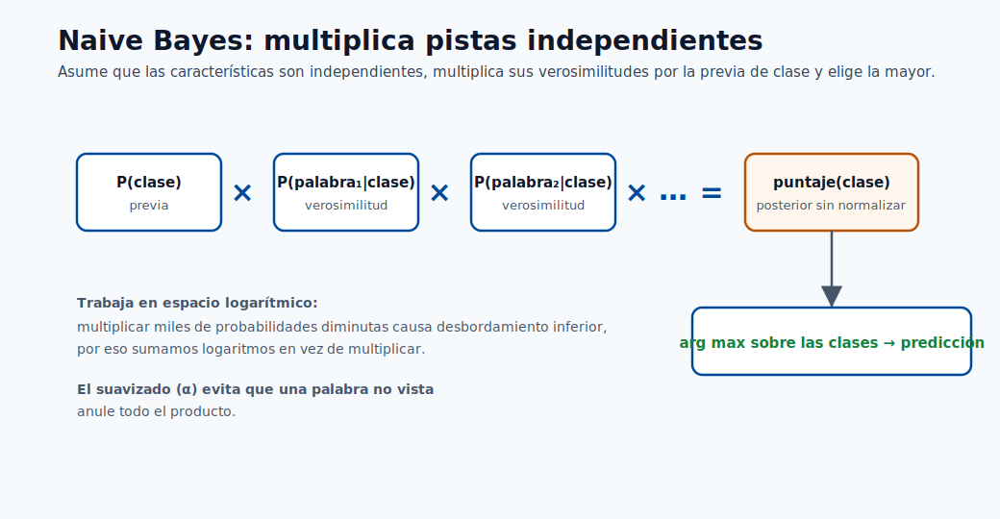

La imagen es el modelo completo: multiplica el prior de clase por una verosimilitud por característica, hazlo
para cada clase y toma la mayor. El supuesto de independencia es lo que permite que esos términos por característica
simplemente se multipliquen, y trabajar en el espacio logarítmico convierte el producto en una suma segura.

Regla de Bayes con independencia condicional:

$$
P(y\mid x_1,\dots,x_d)\propto P(y)\prod_{j=1}^{d}P(x_j\mid y)
$$

$P(y)$ es el **prior** (qué tan común es cada clase), y cada $P(x_j\mid y)$ es la
**verosimilitud** de ver un valor de característica dada la clase. El producto sobre las características es exactamente
donde entra el supuesto de independencia : nos permite estimar $d$ distribuciones simples unidimensionales
en lugar de una distribución conjunta intratable de $d$ dimensiones.

Predicción:

$$
\hat{y}=\arg\max_y\left[\log P(y)+\sum_{j=1}^{d}\log P(x_j\mid y)\right]
$$

Trabajamos en el **espacio logarítmico** para convertir el producto en una suma, evitando el desbordamiento numérico por debajo al
multiplicar miles de probabilidades diminutas (común en texto con vocabularios grandes).

Tipos de Naive Bayes (la variante coincide con la distribución de las características):

- **Gaussian NB**: características continuas modeladas como distribuciones normales por clase. Úsalo para
  datos tabulares de valor real.
- **Multinomial NB**: conteos discretos (p. ej. frecuencias de palabras). El valor por defecto para clasificación de documentos/temas.
- **Bernoulli NB**: características binarias de presencia/ausencia. Bueno para textos cortos donde una palabra
  aparece o no.
- **Complement NB**: una variante multinomial que corrige el desequilibrio de clases, a menudo mejor en
  corpus de texto sesgados.

Por qué funciona a pesar del supuesto:

- La independencia es a menudo falsa, pero el modelo solo necesita que la **clase correcta obtenga el puntaje más
  alto** : el ranking preciso sobrevive incluso cuando las estimaciones de probabilidad están sesgadas.
- Funciona bien para tareas de texto dispersas de alta dimensión (spam, sentimiento, etiquetado de temas) y
  se entrena en una sola pasada sobre los datos.

Notas prácticas y modos de falla:

- El **suavizado de Laplace/aditivo** ($\alpha$) es esencial : sin él, una única combinación de
  característica-clase no vista produce una probabilidad cero que anula todo el producto.
- Las características correlacionadas **cuentan doble la evidencia**, empujando las probabilidades hacia 0 o 1, así que las
  salidas están mal calibradas incluso cuando las etiquetas son correctas.
- Trata sus probabilidades como puntajes, no como confianzas confiables, a menos que las recalibres.

---

## 4) Máquinas de vectores de soporte (SVM)

Una SVM encuentra la frontera de decisión que **maximiza el margen** : la distancia entre la
frontera y los puntos más cercanos de cada clase. La intuición es que la "calle" más ancha posible
entre clases generaliza mejor. Solo los puntos en el borde de esa calle (los
**vectores de soporte**) determinan la frontera; todo lo demás es irrelevante.

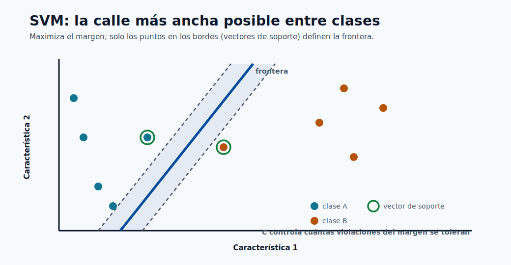

La línea sólida es la frontera y las líneas punteadas marcan los bordes de la "calle" más ancha que
todavía separa las clases. Solo los vectores de soporte circulados tocan esos bordes y definen el
ajuste; el parámetro $C$ decide cuántos puntos pueden situarse dentro de la calle.

Formulación de margen duro:

$$
\min_{w,b}\;\frac{1}{2}\|w\|^2 \quad \text{s.t.}\; y_i(w^Tx_i+b)\ge 1
$$

Minimizar $\|w\|^2$ es equivalente a **maximizar el margen** $2/\|w\|$. La forma de margen duro
supone que los datos son perfectamente separables : un supuesto frágil que se rompe en cualquier conjunto de datos ruidoso.

Margen blando (hinge loss):

$$
\min_{w,b,\xi}\;\frac{1}{2}\|w\|^2 + C\sum_i\xi_i
\quad \text{s.t.}\; y_i(w^Tx_i+b)\ge 1-\xi_i,\;\xi_i\ge 0
$$

Las **variables de holgura** $\xi_i$ permiten que algunos puntos violen el margen, y $C$ controla el
equilibrio: un $C$ grande castiga las violaciones con fuerza (bajo sesgo, alta varianza, riesgo de sobreajuste),
un $C$ pequeño las tolera (margen más ancho, más regularización). Este es el control individual más importante.

Truco del kernel:

$$
K(x_i,x_j)=\phi(x_i)^T\phi(x_j)
$$

El kernel calcula productos internos en un espacio de características de alta dimensión **sin formar nunca
ese espacio explícitamente**, permitiendo que un margen lineal en el espacio transformado se convierta en una frontera
curva en el original. Kernels comunes (los "tipos" de SVM):

- **Lineal**: $K=x_i^Tx_j$. Rápido, mejor cuando los datos ya son de alta dimensión (p. ej. texto).
- **Polinómico**: $K=(x_i^Tx_j+c)^p$. Captura interacciones de características hasta el grado $p$.
- **RBF / Gaussiano**: $K=\exp(-\gamma\|x_i-x_j\|^2)$. El valor por defecto flexible; $\gamma$ fija qué tan
  lejos llega la influencia de cada punto.
- **Sigmoide**: se comporta como una red neuronal de dos capas para ciertos parámetros.

Formas relacionadas:

- **SVR (regresión de vectores de soporte)** aplica la misma idea de margen a la regresión usando un
  tubo $\epsilon$-insensible alrededor de la predicción.
- **SVM de una clase** se usa para detección de novedades/anomalías.

Notas prácticas:

- Fuerte en conjuntos de datos de **tamaño medio** con estructura de clases clara.
- La SVM con kernel escala **mal en $N$ muy grande** (el entrenamiento está entre $O(N^2)$ y $O(N^3)$).
- Las características **deben escalarse** : los kernels basados en distancia están dominados por características de gran magnitud.
- Los hiperparámetros $C$ y los parámetros del kernel (p. ej. $\gamma$) dominan el comportamiento y requieren
  ajuste con validación cruzada.

---

## 5) Árboles de decisión

Un árbol de decisión divide los datos en regiones cada vez más pequeñas haciendo una secuencia de
preguntas de sí/no sobre las características, produciendo un diagrama de flujo que un humano puede leer directamente. Es el bloque
de construcción de los modelos tabulares más potentes (bosques y boosting), así que comprenderlo es clave.

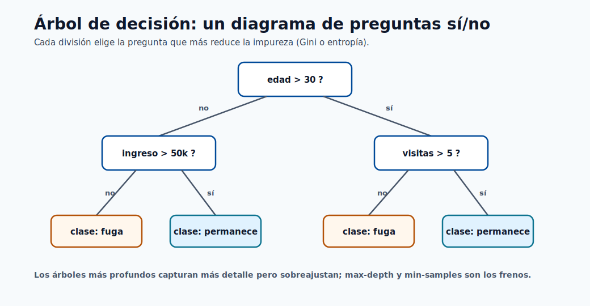

Cada caja interna es una pregunta de sí/no sobre una característica y cada hoja es una predicción; seguir las
respuestas de una fila desde la raíz hasta la hoja es todo el proceso de inferencia. El árbol elige con avidez la
pregunta que más reduce la impureza en cada nodo, que es por lo que los árboles más profundos ajustan más detalle pero
arriesgan memorizar ruido.

Ejemplos de criterio de división:

$$
\text{Gini}(S)=1-\sum_{k=1}^{K}p_k^2
$$

$$
H(S)=-\sum_{k=1}^{K}p_k\log_2 p_k
$$

Ambos miden la **impureza** : qué tan mezcladas están las etiquetas de clase en un nodo. Gini y entropía se comportan
de forma similar; Gini es algo más barato de calcular, la entropía viene de la teoría de la información. Un nodo
puro (todo de una clase) tiene impureza 0.

Ganancia de información para la división $v$:

$$
IG=H(S)-\sum_v\frac{|S_v|}{|S|}H(S_v)
$$

El árbol se hace crecer de forma **ávida**: en cada nodo prueba cada característica y umbral y elige la
división que más reduce la impureza (mayor ganancia de información). Nunca reconsidera divisiones
anteriores, que es por lo que los árboles son rápidos pero no globalmente óptimos.

Tipos y criterios:

- **Árboles de clasificación** usan Gini o entropía y predicen la clase mayoritaria en una hoja.
- **Árboles de regresión** dividen para minimizar la varianza (o MSE) y predicen la **media** de los
  objetivos de la hoja.
- Los algoritmos clásicos difieren en detalle: **CART** (divisiones binarias, el valor por defecto de scikit-learn),
  **ID3/C4.5** (divisiones de múltiples vías, razón de ganancia).

Regularización (cómo evitas que un árbol memorice):

- **max_depth**: límite duro de cuántas preguntas de profundidad puede tener el árbol.
- **min_samples_split / min_samples_leaf**: requiere suficientes datos en un nodo antes/después de una división.
- **Poda por costo-complejidad** ($\alpha$): crece por completo, luego recorta ramas que aportan poco.

Ventajas y riesgos:

- Altamente **interpretable**, maneja datos numéricos/categóricos mixtos, no necesita escalado de características,
  y es insensible a transformaciones monótonas.
- **Los árboles sin podar sobreajustan rápidamente** : un árbol profundo puede tallar una hoja para cada fila de entrenamiento.
- **Alta varianza**: un pequeño cambio en los datos puede producir un árbol muy diferente, que es la
  debilidad exacta que los ensambles (secciones 6-7) fueron inventados para corregir.

---

## 6) Random Forest

Un random forest es un **ensamble de árboles de decisión** combinados por promediado (regresión) o
votación (clasificación). Ataca directamente la debilidad de alta varianza del árbol individual: muchos
árboles decorrelacionados, cada uno ligeramente equivocado de una manera diferente, se promedian hacia una predicción estable.

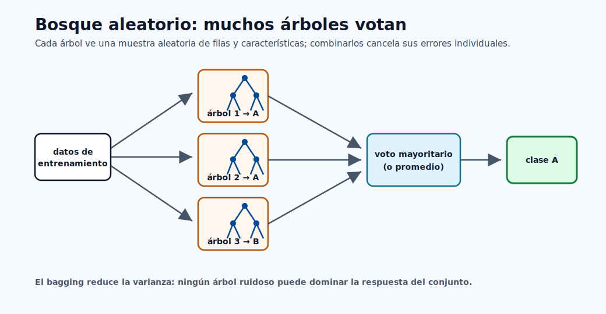

Cada árbol se entrena sobre su propia muestra aleatoria de filas y características, así que cometen errores diferentes;
el voto (o promedio) cancela esos errores. Esto es bagging : reduce la varianza sin
aumentar el sesgo, que es por lo que un bosque es mucho más estable que cualquier árbol individual.

Predicción del ensamble (regresión):

$$
\hat{y}=\frac{1}{T}\sum_{t=1}^{T}f_t(x)
$$

Clasificación mediante voto mayoritario:

$$
\hat{y}=\text{mode}(f_1(x),\dots,f_T(x))
$$

Idea central : dos fuentes de aleatoriedad hacen diferentes a los árboles:

- **Bagging (agregación bootstrap)**: cada árbol se entrena sobre una muestra aleatoria de filas extraídas con
  reemplazo, así que no hay dos árboles que vean los mismos datos.
- **Subconjuntos aleatorios de características**: en cada división un árbol puede elegir solo de un subconjunto aleatorio de
  características, lo cual evita que unas pocas características dominantes hagan que todos los árboles se parezcan.

Promediar estimadores independientes reduce la varianza aproximadamente en proporción a qué tan **decorrelacionados**
están : esa es toda la razón para inyectar aleatoriedad, no solo el bagging.

Propiedades útiles:

- **Error out-of-bag (OOB)**: las filas no muestreadas para un árbol actúan como un conjunto de validación incorporado,
  dando una estimación gratuita de generalización sin un hold-out separado.
- **Importancia de características**: la reducción de impureza promediada (o la importancia por permutación) clasifica qué
  características usó el bosque : aunque las características correlacionadas pueden compartir/diluir la importancia.

Variante relacionada:

- **Árboles extremadamente aleatorizados (Extra-Trees)** también aleatorizan los umbrales de división, sacrificando un
  poco más de sesgo por una varianza aún menor y un entrenamiento más rápido.

Compromisos y ajuste:

- **Línea base fuerte** para datos tabulares con un ajuste mínimo : a menudo competitiva desde el inicio.
- Más árboles (`n_estimators`) solo ayudan (nunca sobreajustan por el conteo solo) pero cuestan memoria y
  latencia de inferencia; `max_features`, `max_depth` y `min_samples_leaf` controlan cada árbol.
- Mayor costo de memoria e inferencia que los modelos lineales; menos interpretable que un árbol individual,
  aunque todavía explicable mediante importancias y SHAP.

---

## 7) Gradient Boosting (XGBoost / LightGBM)

El gradient boosting construye un ensamble de forma **secuencial**: cada nuevo árbol se enfoca en los errores que el
ensamble actual sigue cometiendo. Donde un random forest construye árboles independientes en paralelo y
los promedia, el boosting construye árboles dependientes en serie y los suma : esta es la diferencia
entre reducir la varianza (bosques) y reducir el sesgo (boosting), y es por lo que el boosting tiende
a ganar concursos de precisión en datos tabulares.

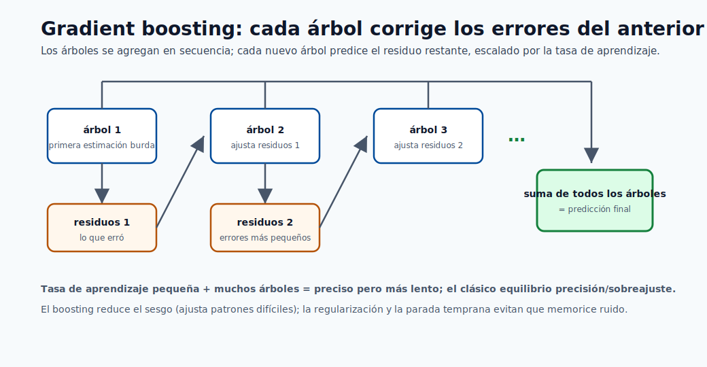

A diferencia del voto en paralelo de un bosque, el boosting añade árboles en secuencia: cada nuevo árbol predice el
error restante de la suma corriente, reducido por la tasa de aprendizaje. Sumar estas correcciones
hace bajar el sesgo paso a paso, mientras que el encogimiento y la regularización evitan que persiga ruido.

Modelo aditivo por etapas:

$$
F_m(x)=F_{m-1}(x)+\nu h_m(x)
$$

donde $h_m$ es un pequeño árbol ajustado al **gradiente negativo** de la pérdida (la dirección que
más reduce el error), y $\nu$ es la **tasa de aprendizaje** (encogimiento). Un $\nu$ pequeño significa que cada
árbol contribuye un poco, así que necesitas más árboles pero generalizas mejor : el clásico
compromiso `learning_rate` vs `n_estimators`.

Objetivo regularizado genérico:

$$
\mathcal{L}=\sum_{i=1}^{N}\ell(y_i,\hat{y}_i)+\sum_{m}\Omega(h_m)
$$

El segundo término $\Omega$ penaliza la complejidad del árbol (número de hojas, ponderaciones de las hojas). Las
implementaciones modernas como XGBoost también usan una **expansión de segundo orden (Newton)** de la pérdida,
usando tanto gradientes como Hessianas para elegir las divisiones con más precisión.

Tipos e implementaciones (los "sabores" del boosting):

- **AdaBoost**: el original, repondera los puntos mal clasificados en cada ronda.
- **Máquinas de gradient boosting (GBM)**: la vista general del descenso de gradiente en el espacio de funciones.
- **XGBoost**: regularizado, de segundo orden, crecimiento de árboles por niveles; muy robusto.
- **LightGBM**: crecimiento por hojas con binning por histograma : el más rápido en datos grandes, controlado por
  `num_leaves`.
- **CatBoost**: manejo nativo y ordenado de características categóricas con menos fuga.

Por qué a menudo gana en datos tabulares:

- Captura interacciones no lineales y umbrales de características automáticamente.
- Maneja escalas de características heterogéneas y valores faltantes con elegancia.
- Los ricos controles de regularización y encogimiento te permiten cambiar sesgo por varianza con precisión.

Controles más importantes (y qué hacen):

- `learning_rate` y `n_estimators`: tasa más baja + más árboles = mejor pero más lento.
- `max_depth` o `num_leaves`: capacidad del árbol; la palanca principal de sobreajuste.
- `subsample`, `colsample_bytree`: muestreo de filas/columnas para regularización y velocidad.
- `lambda_l1`, `lambda_l2`, `min_child_weight`: penalizan la complejidad.

> **Nota - Conexión con Azure ML:** El boosting es el caballo de batalla de las ejecuciones tabulares de AutoML. Como
> es sensible al ajuste, combínalo con detención temprana sobre un conjunto de validación y búsqueda HyperDrive/sweep
> en lugar de ajustarlo a mano.

---

## 8) Redes neuronales (fundamentos de MLP)

Una red neuronal apila capas de transformaciones lineales seguidas de activaciones no lineales, permitiéndole
aproximar casi cualquier función con suficiente capacidad y datos (la propiedad de aproximación
universal). El perceptrón multicapa (MLP) es la forma más simple y la base para las arquitecturas
de aprendizaje profundo.

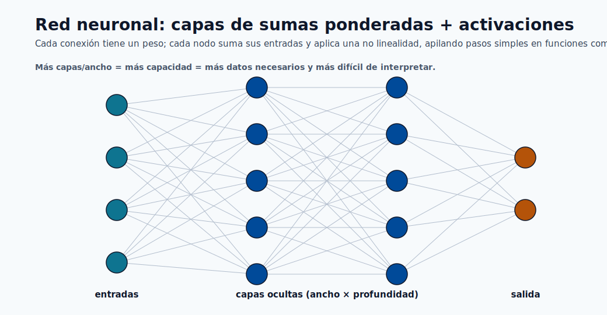

Cada conexión lleva una ponderación y cada nodo calcula una suma ponderada seguida de una activación no
lineal; apilar estos pasos simples es lo que permite a la red representar funciones complejas. Más
ancho y profundidad añaden capacidad, lo cual es potente pero demanda más datos y hace al modelo más difícil
de interpretar y operar.

Mapeo de capa (paso hacia adelante):

$$
a^{(l)}=\phi\left(W^{(l)}a^{(l-1)}+b^{(l)}\right)
$$

Cada capa aplica ponderaciones $W^{(l)}$, un sesgo y una no linealidad $\phi$. La **no linealidad es
esencial** : sin ella, apilar capas colapsaría en un único mapeo lineal. Las opciones comunes
son ReLU (rápida, por defecto para capas ocultas), sigmoide/tanh (más antiguas, propensas a gradientes que se desvanecen),
y softmax (capa de salida para probabilidades multiclase).

Minimización del riesgo empírico:

$$
\min_{\Theta}\frac{1}{N}\sum_{i=1}^{N}\mathcal{L}(f_{\Theta}(x_i),y_i)
$$

Actualización del descenso de gradiente:

$$
\Theta_{t+1}=\Theta_t-\eta\nabla_{\Theta}\mathcal{L}
$$

Los gradientes se calculan mediante **retropropagación** (la regla de la cadena aplicada capa por capa). El
objetivo es **no convexo**, así que el entrenamiento encuentra un buen óptimo local, no uno global garantizado
: los resultados dependen de la inicialización, el orden de los datos y el optimizador. En la práctica $\eta$ (la
tasa de aprendizaje) es el hiperparámetro individual más importante, y los optimizadores adaptativos como
**Adam** la ajustan por parámetro para una convergencia más rápida y estable que el SGD simple.

Tipos de redes neuronales (más allá del MLP):

- **MLP / totalmente conectada**: datos tabulares y como bloques de construcción.
- **CNN (convolucional)**: imágenes y datos espaciales; comparten ponderaciones entre ubicaciones.
- **RNN / LSTM / GRU**: secuencias y series temporales con memoria de pasos anteriores.
- **Transformers**: basados en atención; dominan el lenguaje y cada vez más la visión.

Opciones de regularización (la capacidad es alta, así que controlarla es obligatorio):

- **Decaimiento de pesos ($L_2$)**: encoge las ponderaciones para reducir el sobreajuste.
- **Dropout**: pone aleatoriamente a cero las activaciones durante el entrenamiento para evitar la coadaptación.
- **Detención temprana**: detener cuando la pérdida de validación deja de mejorar.
- **Normalización por lotes** y **aumento de datos**: estabilizan y enriquecen el entrenamiento.

Nota operativa:

- La capacidad es alta, así que la estrategia de validación y el monitoreo son obligatorios.
- Las redes neuronales **demandan muchos datos y mucho cómputo**; para datos tabulares pequeños/medianos, el boosting
  usualmente las iguala o supera a una fracción del costo.
- Son más difíciles de interpretar y operar (servicio en GPU, versionado), así que resérvalas para
  datos no estructurados (texto, imágenes, audio) o interacciones genuinamente complejas.

---

## 9) Modelos de pronóstico de series temporales

Los modelos de series temporales predicen valores futuros a partir de una secuencia ordenada en el tiempo. La diferencia
definitoria respecto a todos los demás modelos de esta página es que **las observaciones no son independientes** :
hoy depende de ayer, así que el orden importa y la división aleatoria habitual de entrenamiento/prueba es inválida.

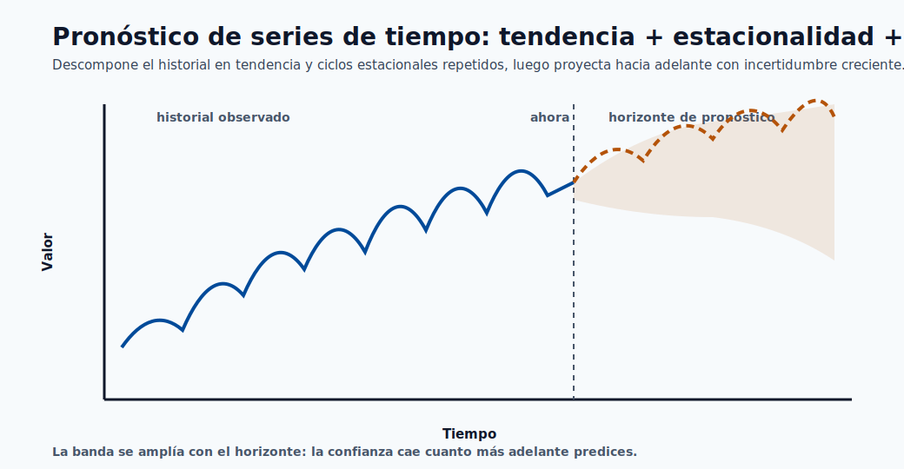

El pronóstico descompone el pasado en una tendencia más ciclos estacionales repetidos, y luego los proyecta
hacia adelante. La banda que se ensancha más allá del "ahora" es el mensaje clave : la incertidumbre crece con el horizonte, así que
los pronósticos de mayor alcance deben reportar intervalos, no solo una línea.

Familia autorregresiva (AR):

$$
y_t=c+\sum_{i=1}^{p}\phi_i y_{t-i}+\epsilon_t
$$

Un modelo AR($p$) predice el valor actual como una suma ponderada de los $p$ valores anteriores más
ruido. El modelo compañero **MA($q$)** en cambio regresa sobre los $q$ errores de pronóstico anteriores.

ARIMA los combina y añade diferenciación:

$$
\phi(B)(1-B)^d y_t = c + \theta(B)\epsilon_t
$$

donde $B$ es el **operador de retroceso** ($B y_t = y_{t-1}$). Los tres órdenes $(p,d,q)$ son:
$p$ términos autorregresivos, $d$ rondas de diferenciación para eliminar la tendencia (hacer la serie
**estacionaria**), y $q$ términos de media móvil.

Tipos de modelos de pronóstico:

- **AR / MA / ARMA**: series estacionarias sin/con manejo de tendencia.
- **ARIMA**: añade diferenciación para datos con tendencia.
- **SARIMA**: añade términos estacionales para ciclos repetidos (semanales, anuales).
- **Suavizado exponencial (ETS / Holt-Winters)**: pondera más fuertemente las observaciones recientes,
  con componentes explícitos de tendencia y estacionalidad.
- **Prophet**: descompone en tendencia + estacionalidad + días festivos; robusto y fácil de usar.
- **Enfoques de ML/DL**: gradient boosting sobre características de rezago, o LSTM/Transformers para series complejas
  y multivariadas.

Restricciones prácticas del pronóstico:

- Usa **validación cronológica (rodante/expansiva)** únicamente : nunca mezcles, o filtras el
  futuro hacia el pasado.
- Verifica la **estacionariedad** (p. ej. prueba ADF) y diferencia o transforma según sea necesario.
- Evalúa métricas tanto **dependientes de escala** (MAE, RMSE) como de **porcentaje** (MAPE, sMAPE).
- La cadencia de reentrenamiento debe seguir los cambios de deriva y estacionalidad; los pronósticos se degradan a medida que el horizonte
  se alarga, así que reporta intervalos de incertidumbre, no solo predicciones puntuales.

---

## 10) Comparación de modelos desde una lente matemática

La tabla de abajo resume los compromisos que se repiten a lo largo de esta página. El patrón individual más
útil: los **modelos convexos** (filas superiores) te dan estabilidad y velocidad, mientras que los **modelos no convexos
de alta capacidad** (filas inferiores) te dan flexibilidad a costa del esfuerzo de ajuste y el riesgo de
sobreajuste.

| Familia | Objetivo principal | Optimización típica | Riesgo común |
|---|---|---|---|
| Lineal/Logística | Pérdida convexa + regularización opcional | Métodos convexos deterministas | Subajuste de patrones no lineales |
| Naive Bayes | Maximizar la posterior de clase | Conteo en forma cerrada | Supuesto de independencia, calibración deficiente |
| SVM | Maximización de margen + hinge loss | Optimización cuadrática | Escalado en conjuntos de datos grandes |
| Árboles/Bosques | Minimización de impureza | División recursiva ávida | Sobreajuste sin restricciones |
| Boosting | Reducción aditiva de pérdida | Actualizaciones por etapas basadas en gradiente | Sobreajuste si hay demasiados árboles profundos |
| Redes neuronales | Minimización no convexa del riesgo empírico | Retropropagación SGD/Adam | Inestabilidad, demanda de datos |
| Series temporales | Minimizar el error de pronóstico en datos ordenados | Verosimilitud / mínimos cuadrados | Fuga si no se valida cronológicamente |

Algunos temas transversales que vale la pena interiorizar:

- **Sesgo-varianza**: lineal/Naive Bayes son de alto sesgo/baja varianza; los árboles profundos y las redes neuronales
  son de bajo sesgo/alta varianza. Los ensambles (bosques, boosting) deliberadamente diseñan un mejor
  punto intermedio.
- **Interpretabilidad vs precisión**: disminuye aproximadamente a medida que bajas por la tabla. Elige el
  modelo menos complejo que cumpla con el umbral de precisión.
- **Sensibilidad al escalado**: los modelos basados en distancia y gradiente (SVM, redes neuronales, lineal
  regularizado) necesitan escalado de características; los modelos basados en árboles no.

---

## 11) Elegir el modelo correcto en Azure ML

Flujo de trabajo sugerido:

1. Comienza con líneas base lineales/logísticas y de árboles.
2. Pasa al boosting para ganancias de precisión tabular.
3. Usa arquitecturas neuronales para datos no estructurados.
4. Valida con métricas alineadas al negocio y política de umbral.
5. Despliega con monitoreo de deriva, latencia y calibración.

Una guía práctica de decisión basada en los datos que tienes:

- **Tabular pequeño, se requiere interpretabilidad**: regresión lineal/logística o un único árbol
  poco profundo. Barato, auditable, rápido.
- **Tabular mediano, la precisión importa**: el gradient boosting (XGBoost/LightGBM) es usualmente la
  mejor opción por defecto; un random forest es el respaldo sin ajuste.
- **Texto disperso de alta dimensión**: Naive Bayes o modelos lineales como líneas base, luego asciende.
- **Márgenes claros, $N$ mediano**: SVM con un kernel RBF.
- **Datos no estructurados (imágenes, audio, lenguaje)**: redes neuronales (CNN, RNN, Transformers).
- **Datos ordenados en el tiempo**: ARIMA/SARIMA o Prophet primero, luego boosting sobre características de rezago o
  modelos de secuencia si es necesario.

Un modelo matemáticamente elegante no es automáticamente el mejor modelo de producción. En
la práctica, el mejor modelo maximiza el valor de negocio bajo restricciones de latencia, costo, gobernanza
y mantenibilidad. El camino disciplinado es **establecer primero una línea base simple**,
y luego añadir complejidad solo cuando se gane su lugar en una métrica que al negocio realmente le
importa.
